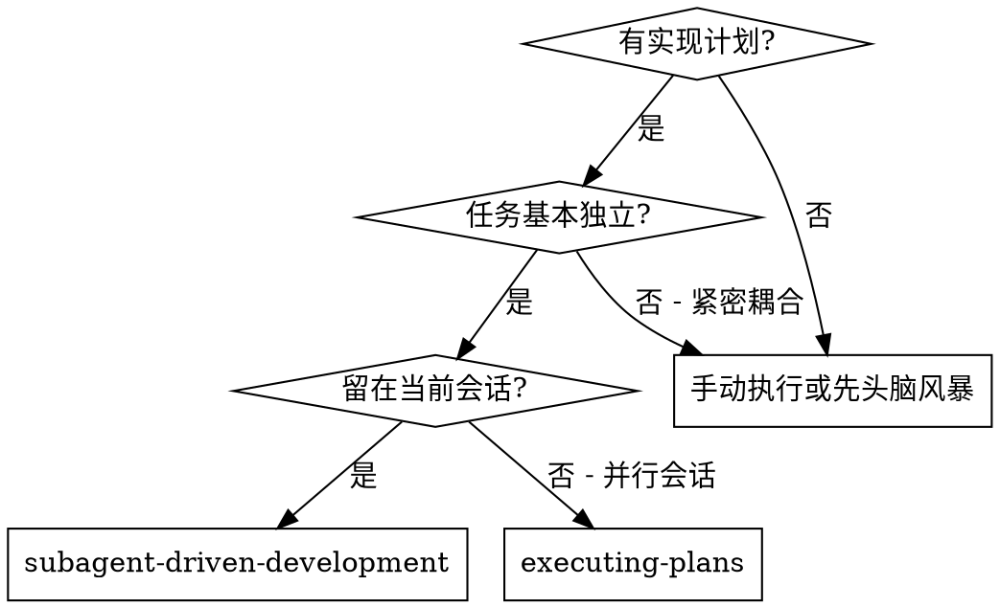
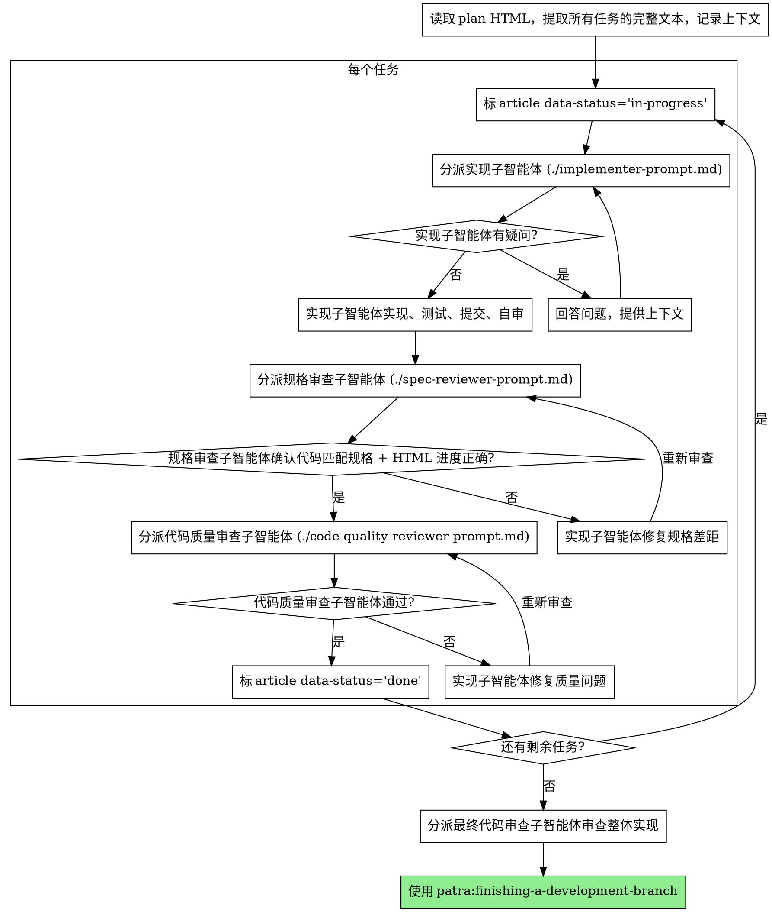

# 子智能体驱动开发

通过为每个任务分派一个全新的子智能体来执行计划，每个任务完成后进行两阶段审查：先审查规格合规性，再审查代码质量。

**为什么用子智能体：** 你将任务委派给具有隔离上下文的专用智能体。通过精心设计它们的指令和上下文，确保它们专注并成功完成任务。它们不应继承你的会话上下文或历史记录——你要精确构造它们所需的一切。这样也能为你自己保留用于协调工作的上下文。

**核心原则：** 每个任务一个全新子智能体 + 两阶段审查（先规格后质量）= 高质量、快速迭代

## 进度追踪机制

writing-plans 写出的 plan 是 HTML 文件，每个 `<article class="task">` 与 `<li class="step">` 都带 `data-status` 属性。**唯一**的进度追踪方式是修改这个属性——不使用 TodoWrite，避免双源真相漂移。控制者负责更新 plan HTML 的 data-status，子智能体只负责实现 / 审查。

状态简表（详细定义见 `skills/brainstorming/html-output-guide.md`）：

| 状态 | 时机 |
|---|---|
| `pending` | 任务尚未开始 |
| `in-progress` | 实现者已分派 |
| `done` | 两阶段审查全部通过 |
| `blocked` | 实现者上报 BLOCKED 或审查反复失败 |
| `skipped` | 任务因前置变更不再需要 |

**小贴士：** 执行过程中**在浏览器中打开 plan 文件**可实时看到任务卡片的进度可视化（绿/灰/蓝/红边框 + ☐/▶/☑/✗ 符号），强烈建议开着浏览器对照状态变化。

## 何时使用



**与 Executing Plans（并行会话）的对比：**
- 同一会话（无上下文切换）
- 每个任务全新子智能体（无上下文污染）
- 每个任务后两阶段审查：先规格合规性，再代码质量
- 更快的迭代（任务间无需人工介入）

## 流程



## 模型选择

**所有 subagent（implementer / spec reviewer / code quality reviewer）统一使用 `claude-opus-4-7`。**

理由：
- patra-api 是单人开发的绿地项目，项目 CLAUDE.md 明确"质量优先 — 可投入任何必要时间实现最优方案"
- 不在乎模型成本与单任务延迟，只追求每次产出最高质量
- 避免不同模型间的能力波动给 spec / quality review 引入噪声

在 Codex 下：使用平台支持的最强模型（含等价的高阶推理模式）。

## 处理实现者状态

实现子智能体报告四种状态之一。根据每种状态进行相应处理：

**DONE：** 进入规格合规性审查。

**DONE_WITH_CONCERNS：** 实现者完成了工作但标记了疑虑。在继续之前阅读这些疑虑。如果疑虑涉及正确性或范围，在审查前解决。如果只是观察性说明（如"这个文件越来越大了"），记录下来并继续审查。

**NEEDS_CONTEXT：** 实现者需要未提供的信息。提供缺失的上下文并重新分派。

**BLOCKED：** 实现者无法完成任务。评估阻塞原因：
1. 如果是上下文问题，提供更多上下文并重新分派（仍用 Opus 4.7）
2. 如果任务太大，拆分为更小的部分
3. 如果计划本身有问题，上报给人类，并把 article data-status 改为 `blocked` + 插入 `<aside class="blocker">`

**绝不** 忽略上报或在不做任何更改的情况下重试。如果实现者说卡住了，说明有什么东西需要改变。

## 提示词模板

- `./implementer-prompt.md` - 分派实现子智能体
- `./spec-reviewer-prompt.md` - 分派规格合规审查子智能体（含 HTML 进度结构验证）
- `./code-quality-reviewer-prompt.md` - 分派代码质量审查子智能体

## 示例工作流

> **说明：** 以下为流程示意，**不是真实任务**——示例任务名（"Hook 安装脚本"、"恢复模式"）只是占位符。实际执行时把这些替换为你 plan HTML 里的真实任务。

```
你：我正在使用子智能体驱动开发来执行这个计划。

[一次性读取 plan HTML 文件：docs/patra/plans/2026-MM-DD-feature.html]
[提取全部 5 个任务的完整文本和上下文]

任务 1：[占位：Hook 安装脚本]

[控制者：标 <article id="task-1" data-status="in-progress">]
[获取任务 1 的文本和上下文（已提取）]
[分派实现子智能体，附带完整任务文本 + 上下文]

实现者："在我开始之前——hook 应该安装在哪里？"

你：[提供澄清]

实现者："明白了。现在开始实现……"
[稍后] 实现者：
  - 实现了 install-hook 命令
  - 添加了测试，5/5 通过
  - 自审：发现遗漏了 --force 参数，已添加
  - 已提交

[分派规格合规审查（含 HTML 进度结构验证）]
规格审查者：✅ 符合规格 - 所有需求已满足，无多余内容
            HTML 进度：article data-status="in-progress" ✓，5 个 li data-status 全为 done ✓

[获取 git SHA，分派代码质量审查]
代码审查者：优点：测试覆盖好，代码整洁。问题：无。通过。

[控制者：标 <article id="task-1" data-status="done">]

任务 2：[占位：恢复模式]

[控制者：标 <article id="task-2" data-status="in-progress">]
[获取任务 2 的文本和上下文（已提取）]
[分派实现子智能体，附带完整任务文本 + 上下文]

实现者：[无疑问，直接开始]
实现者：
  - 添加了 verify/repair 模式
  - 8/8 测试通过
  - 自审：一切正常
  - 已提交

[分派规格合规审查]
规格审查者：❌ 问题：
  - 缺失：进度报告（规格要求"每 100 项报告一次"）
  - 多余：添加了 --json 参数（未被要求）

[实现者修复问题]
实现者：移除了 --json 参数，添加了进度报告

[规格审查者再次审查]
规格审查者：✅ 现在符合规格

[分派代码质量审查]
代码审查者：优点：扎实。问题（重要）：魔法数字（100）

[实现者修复]
实现者：提取了 PROGRESS_INTERVAL 常量

[代码审查者再次审查]
代码审查者：✅ 通过

[控制者：标 <article id="task-2" data-status="done">]

...

[所有任务完成后]
[分派最终代码审查]
最终审查者：所有需求已满足，可以合并

完成！
```

## 优势

**与手动执行相比：**
- 子智能体自然遵循 TDD
- 每个任务全新上下文（不会混淆）
- 子智能体可以提问（工作前和工作中都可以）

**与 Executing Plans 相比：**
- 同一会话（无交接）
- 持续进展（无需等待）
- 审查检查点自动化

**效率提升：**
- 无文件读取开销（控制者提供完整文本）
- 控制者精确策划所需上下文
- 子智能体预先获得完整信息
- 问题在工作开始前就被提出（而非工作结束后）

**质量关卡：**
- 自审在交接前发现问题
- 两阶段审查：规格合规性 + HTML 进度结构验证，然后代码质量
- 审查循环确保修复确实有效
- 规格合规防止过度/不足构建
- 代码质量确保实现良好

**成本：**
- 每个任务需要实现者 + 2 个审查者，统一 Opus 4.7
- 控制者需要更多准备工作（预先提取所有任务）
- 审查循环增加迭代次数
- 但能及早发现问题（比后期调试更省成本）

## 红线

**绝不：**
- 未经用户明确同意就在 main/master 分支上开始实现
- 跳过审查（规格合规性或代码质量）
- 带着未修复的问题继续
- 并行分派多个实现子智能体（会冲突）
- 让子智能体读取 plan 文件（应提供完整文本）
- 跳过场景铺设上下文（子智能体需要理解任务在哪个环节）
- 忽视子智能体的问题（在让它们继续之前先回答）
- 在规格合规性上接受"差不多就行"（规格审查者发现问题 = 未完成）
- 跳过审查循环（审查者发现问题 = 实现者修复 = 再次审查）
- 让实现者的自审替代正式审查（两者都需要）
- **在规格合规性审查通过之前开始代码质量审查**（顺序错误）
- 在任一审查有未解决问题时就进入下一个任务
- **使用 TodoWrite 跟踪进度**——只用 plan HTML 的 `data-status`，单源真相

**如果子智能体提问：**
- 清晰完整地回答
- 必要时提供额外上下文
- 不要催促它们进入实现阶段

**如果审查者发现问题：**
- 实现者（同一子智能体）修复
- 审查者再次审查
- 重复直到通过
- 不要跳过重新审查

**如果子智能体失败：**
- 分派修复子智能体并提供具体指令
- 不要尝试手动修复（上下文污染）

## 集成

**必需的工作流技能：**
- **patra:using-git-worktrees** - 必需：在开始前建立隔离工作区
- **patra:writing-plans** - 创建本技能执行的 HTML 计划
- **patra:requesting-code-review** - 审查子智能体的代码审查模板
- **patra:finishing-a-development-branch** - 所有任务完成后收尾

**子智能体应使用：**
- **patra:test-driven-development** - 子智能体对每个任务遵循 TDD

**替代工作流：**
- **patra:executing-plans** - 单线程批量执行（不分派子智能体），可作为降级路径
