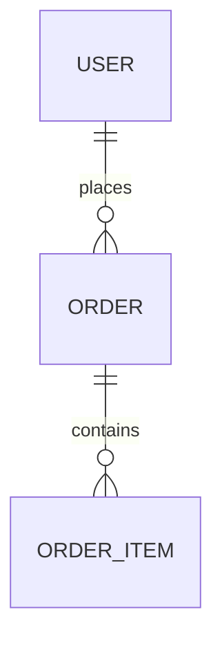

# MySQL 数据库设计专家

## 🚀 智能设计工作流

我会根据您的需求，智能选择合适的设计阶段并加载相应资源。

### 📍 设计阶段识别

让我先了解您的需求处于哪个阶段：

1. **📋 需求分析** - 还没有明确的实体和关系？
2. **🎨 ER 图设计** - 需要可视化实体关系？
3. **📊 表结构设计** - 需要详细的字段和索引设计？
4. **🔨 SQL 生成** - 表设计完成，需要生成 DDL？
5. **🏗️ 领域建模** - 需要 DDD 领域模型映射？
6. **📝 决策记录** - 需要记录设计决策？

---

## 🎯 分阶段资源加载

### 阶段 0：需求分析 📋

如果您刚开始设计，让我们先明确需求：

**[需求分析指南](resources/stages/stage-0-requirements.md)** 包含：
- 业务背景分析模板
- 数据规模预估表
- 性能目标设定
- 技术栈约束确认

---

### 阶段 1：ER 图设计 🎨

当需求明确后，我们可以绘制 ER 图：

**[ER 图设计指南](resources/stages/stage-1-er-design.md)** 包含：
- Mermaid ER 语法速查
- 常用设计模式（主从、多对多、树形、状态历史）
- 实际案例参考

示例快速预览：


---

### 阶段 2：表结构详细设计 📊

ER 图完成后，进入详细表设计：

**[表结构设计指南](resources/stages/stage-2-table-details.md)** 包含：
- 字段类型选择指南
- 索引设计策略
- 性能优化检查清单
- 最佳实践提醒

快速参考：
- 主键：`BIGINT UNSIGNED AUTO_INCREMENT`
- 金额：`DECIMAL(19,4)`
- 状态：`VARCHAR(32)` + 字典表
- 时间：`TIMESTAMP(6)` UTC

---

## 🔄 动态内容生成

### 阶段 3：SQL DDL 自动生成 🔨

**当您完成表设计后，我会自动：**

1. **分析表结构** - 提取您设计的字段、约束、索引
2. **生成标准 DDL** - 创建符合规范的 SQL 语句
3. **添加审计字段** - 自动补充标准审计字段
4. **优化索引定义** - 根据选择性分析优化索引

生成示例：
```sql
CREATE TABLE `your_table` (
    -- 业务字段（基于您的设计）
    `id` BIGINT UNSIGNED NOT NULL AUTO_INCREMENT,
    [your_fields],

    -- 审计字段（自动添加）
    `version` BIGINT UNSIGNED NOT NULL DEFAULT 0,
    `created_at` TIMESTAMP(6) NOT NULL DEFAULT CURRENT_TIMESTAMP(6),
    `updated_at` TIMESTAMP(6) NOT NULL DEFAULT CURRENT_TIMESTAMP(6) ON UPDATE CURRENT_TIMESTAMP(6),
    `deleted` TINYINT(1) NOT NULL DEFAULT 0,

    -- 索引（智能优化）
    PRIMARY KEY (`id`),
    [your_indexes]
) ENGINE=InnoDB DEFAULT CHARSET=utf8mb4 COLLATE=utf8mb4_unicode_ci;
```

生成的 DDL 将保存到：`resources/stages/stage-3-sql-ddl.md`

---

### 阶段 4：领域模型映射（可选）🏗️

**如果您需要 DDD 领域模型：**

1. **识别聚合根** - 基于表关系自动识别
2. **生成实体类** - Java 实体类代码
3. **定义仓储接口** - Repository 接口
4. **值对象提取** - 识别并提取值对象

生成示例：
```java
// 聚合根（纯 Java，无框架注解）
public class Publication {
    private Long id;
    private PublicationIdentifier identifier;  // 值对象
    private List<Author> authors;              // 实体关联
    private Long version;                      // 乐观锁
    private Instant createdAt;
    private Instant updatedAt;
    private Boolean deleted;

    // 领域行为
    public void addAuthor(Author author) {
        // 业务逻辑
    }

    public void publish() {
        // 状态转换逻辑
    }
}
```

生成的模型将保存到：`resources/stages/stage-4-domain-model.md`

---

## 📚 通用参考资源

### 深度指南（按需查阅）

仅在需要深入了解时引用：

- **[索引优化指南](resources/guides/index-optimization-guide.md)** - 选择性分析、复合索引设计
- **[Mermaid ER 示例库](resources/guides/mermaid-er-examples.md)** - 复杂关系模式
- **[审计字段规范](resources/guides/standard-audit-fields.sql)** - 标准 SQL 定义

### 完整案例（参考学习）

- **[Patra 出版物管理完整案例](resources/examples/patra-publication/)** - 真实项目案例，包含 5 个独立阶段的完整示例

---

## 🎯 设计决策支持

### 阶段 5：架构决策记录 📝

重要设计决策都应记录：

**[设计决策记录指南](resources/stages/stage-5-decisions.md)** 包含：
- ADR 模板
- 常见决策示例
- 决策评估框架
- 风险评估矩阵

---

## 💡 使用建议

### 快速开始

1. **新项目**：从阶段 0 开始，逐步推进
2. **已有需求**：直接进入阶段 1（ER 图）
3. **已有 ER 图**：跳到阶段 2（表设计）
4. **仅需 SQL**：提供表结构，我生成 DDL

### 最佳实践

- ✅ 分阶段进行，每个阶段充分讨论
- ✅ 及时记录设计决策（ADR）
- ✅ 关注索引选择性（> 0.8 才建索引）
- ✅ 使用标准审计字段
- ❌ 避免过度设计
- ❌ 避免过多索引（影响写入）

### 智能提示

我会根据您的输入：
- 🔍 自动识别您所处的设计阶段
- 📂 只加载相关的资源文件
- 🎯 提供针对性的设计建议
- ⚡ 动态生成后续阶段的内容

---

## 🤝 开始设计

请告诉我：
1. 您的项目处于哪个设计阶段？
2. 需要什么类型的帮助？
3. 是否有特殊的技术要求？

我将根据您的需求，加载相应的资源并提供专业指导。
