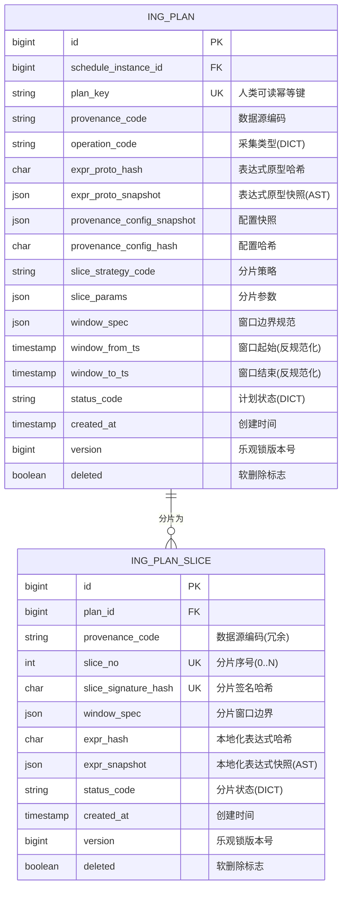

# MySQL 数据库设计专家

## 快速开始：4 步工作流

### 步骤 1: 理解业务需求 → 识别实体和关系

**分析维度：**
- 核心业务实体（User、Publication、Author）
- 实体间关系（一对一、一对多、多对多）
- 业务约束（唯一性、必填性、取值范围）
- 数据规模预估（初始量、年增长量、5 年后规模）

**输出：** 业务实体清单 + 关系描述

---

### 步骤 2: 绘制 Mermaid ER 图 → 可视化设计

**Patra Ingest 模块实际示例（一对多关系）：**



**关系符号说明：**
- `||--||` : 一对一
- `||--o{` : 一对多（一个计划可以有多个分片）
- `}o--||` : 多对一
- `}o--o{` : 多对多

**设计亮点：**
1. ✅ **无物理外键** - 跨模块完整性由应用层保证（使用逻辑外键 `plan_id`）
2. ✅ **字典代码字段** - 使用 `*_code` 后缀，关联字典表（如 `ing_operation`, `ing_slice_status`）
3. ✅ **JSON 字段** - 存储复杂配置和快照（`expr_proto_snapshot`, `provenance_config_snapshot`）
4. ✅ **哈希指纹** - 用于幂等性和快速比较（`expr_proto_hash`, `slice_signature_hash`）
5. ✅ **反规范化字段** - 时间范围字段（`window_from_ts`, `window_to_ts`）用于查询优化
6. ✅ **复合唯一索引** - `(plan_id, slice_no)` 和 `(plan_id, slice_signature_hash)` 保证分片唯一性

详细示例见：[mermaid-er-examples.md](resources/mermaid-er-examples.md)

---

### 步骤 3: 详细表设计 → Markdown 表格说明

**Patra Ingest 模块实际示例：ing_plan_slice (计划分片表)**

**业务字段：**

| 字段名 | 类型 | 约束 | 说明 | 索引选择性 |
|-------|------|------|------|-----------|
| id | BIGINT UNSIGNED | PK, AUTO_INCREMENT | 主键 · 分片ID | 1.0 ✅ |
| plan_id | BIGINT UNSIGNED | NOT NULL | 关联的计划（逻辑外键） | 0.001 ❌ |
| provenance_code | VARCHAR(64) | NULL | 数据源编码（冗余，加速按来源过滤） | 0.01 ❌ |
| slice_no | INT | NOT NULL | 分片序号（0..N） | 0.001 ❌ |
| slice_signature_hash | CHAR(64) | NOT NULL | 分片签名哈希（边界 JSON 归一化后计算） | 0.95 ✅ |
| window_spec | JSON | NOT NULL | 此分片的窗口边界规范 | N/A |
| expr_hash | CHAR(64) | NOT NULL | 本地化表达式哈希 | 0.85 ✅ |
| expr_snapshot | JSON | NULL | 本地化表达式快照（AST，可直接执行） | N/A |
| status_code | VARCHAR(32) | NOT NULL, DEFAULT 'PENDING' | 分片状态（字典代码：PENDING/ASSIGNED/FINISHED） | 0.15 ⚠️ |

**审计字段：**（参见标准审计字段规范）

| 字段名 | 类型 | 约束 | 说明 |
|-------|------|------|------|
| record_remarks | JSON | NULL | 备注/变更日志 |
| version | BIGINT UNSIGNED | NOT NULL, DEFAULT 0 | 乐观锁版本号 |
| ip_address | VARBINARY(16) | NULL | 请求者IP |
| created_at | TIMESTAMP(6) | NOT NULL, DEFAULT CURRENT_TIMESTAMP(6) | 创建时间（UTC） |
| created_by | BIGINT UNSIGNED | NULL | 创建人ID |
| created_by_name | VARCHAR(100) | NULL | 创建人姓名 |
| updated_at | TIMESTAMP(6) | NOT NULL, DEFAULT CURRENT_TIMESTAMP(6) ON UPDATE CURRENT_TIMESTAMP(6) | 更新时间（UTC） |
| updated_by | BIGINT UNSIGNED | NULL | 更新人ID |
| updated_by_name | VARCHAR(100) | NULL | 更新人姓名 |
| deleted | TINYINT(1) | NOT NULL, DEFAULT 0 | 软删除标志 |

**索引设计：**

| 索引名 | 字段 | 类型 | 选择性分析 |
|-------|------|------|-----------|
| PRIMARY KEY | `id` | 聚簇索引 | 1.0（最高） |
| uk_slice_unique | `plan_id`, `slice_no` | 复合唯一索引 | 保证同一计划内分片序号唯一 |
| uk_slice_sig | `plan_id`, `slice_signature_hash` | 复合唯一索引 | 防止同一计划下相同边界重复生成 |
| idx_slice_prov_status | `provenance_code`, `status_code` | 组合索引 | 按数据源和状态聚合查询 |
| idx_slice_status | `status_code` | 单列索引 | 查询待处理/进行中的分片 |
| idx_slice_expr | `expr_hash` | 单列索引 | 按表达式哈希查询（用于幂等性） |
| idx_audit_deleted_upd | `deleted`, `updated_at` | 组合索引 | 用于审计查询和软删除过滤 |

**索引决策说明：**
- ✅ `slice_signature_hash` 选择性高（0.95），适合唯一索引
- ✅ `expr_hash` 选择性高（0.85），适合索引
- ❌ `plan_id` 选择性极低（0.001），不单独建索引，仅作为复合索引的一部分
- ❌ `slice_no` 选择性极低（0.001），不单独建索引
- ❌ `provenance_code` 选择性极低（0.01），不单独建索引
- ⚠️ `status_code` 选择性中等（0.15），建立单列索引用于任务调度查询
- ✅ **复合唯一索引设计** - `uk_slice_unique` 和 `uk_slice_sig` 从不同维度保证幂等性

**业务规则：**
- 分片是并行和幂等的最小单元
- 同一计划内，`(plan_id, slice_no)` 和 `(plan_id, slice_signature_hash)` 均唯一
- `slice_signature_hash` 用于去重：相同边界的分片不会重复生成
- `expr_snapshot` 包含可直接执行的表达式树，支持重放
- 无物理外键，应用层保证 `plan_id` 的引用完整性

---

### 步骤 4: 生成 SQL DDL → 可执行脚本

**Patra Ingest 模块实际 DDL：**

```sql
-- ======================================================================
-- 3) 计划分片: 通用分片 (时间/ID/令牌/预算), 并行和幂等边界
-- ======================================================================
/* ====================================================================
 * 表: ing_plan_slice —— 计划分片
 * 语义: 从计划的总体窗口和策略切割的分片; 并行和幂等的最小单元; expr_* 是本地化表达式 (带边界)。
 * 要点: 在同一计划内, (slice_no) 和 (slice_signature_hash) 均唯一; 无 FK。
 * 索引: uk_slice_unique / uk_slice_sig / idx_slice_status / idx_slice_expr.
 * ==================================================================== */
CREATE TABLE IF NOT EXISTS `ing_plan_slice`
(
    `id`                   BIGINT UNSIGNED NOT NULL AUTO_INCREMENT COMMENT '主键 · 分片ID',
    `plan_id`              BIGINT UNSIGNED NOT NULL COMMENT '关联的计划',

    `provenance_code`      VARCHAR(64)     NULL COMMENT '冗余: Provenance 编码, 与 reg_provenance.provenance_code 对齐 (加速按来源过滤)',

    `slice_no`             INT             NOT NULL COMMENT '分片序号 (0..N)',
    `slice_signature_hash` CHAR(64)        NOT NULL COMMENT '分片签名哈希: 仅在 window_spec (边界 JSON) 归一化后计算; 用于加权/去权 (同一计划下相同边界不重复生成)',
    `window_spec`          JSON            NOT NULL COMMENT '此分片的窗口边界规范 (从 plan.window_spec 缩小). TIME/DATE: {"strategy":"TIME|DATE","window":{"from":"...","to":"..."}}; ID_RANGE: {"strategy":"ID_RANGE","window":{"from":N,"to":M}}; 其他类似 plan 表',
    `expr_hash`            CHAR(64)        NOT NULL COMMENT '本地化表达式哈希: 从"归一化本地化 AST"计算的指纹; 通常与 slice_signature_hash 一起变化',

    `expr_snapshot`        JSON            NULL COMMENT '本地化表达式快照 (AST, JSON): "可直接执行的表达式树",将此分片边界条件注入计划原型后得到; 分片携带重放语义',
    `status_code`          VARCHAR(32)     NOT NULL DEFAULT 'PENDING' COMMENT 'DICT CODE(type=ing_slice_status): PENDING/ASSIGNED/FINISHED',

    -- 审计字段
    `record_remarks`       JSON            NULL COMMENT 'JSON 数组, 备注/变更日志 [{"time":"2025-08-18 15:00:00","by":"John Doe","note":"xxx"}]',
    `version`              BIGINT UNSIGNED NOT NULL DEFAULT 0 COMMENT '乐观锁版本号',
    `ip_address`           VARBINARY(16)   NULL COMMENT '请求者IP (二进制, 支持 IPv4/IPv6)',
    `created_at`           TIMESTAMP(6)    NOT NULL DEFAULT CURRENT_TIMESTAMP(6) COMMENT '创建时间 (UTC)',
    `created_by`           BIGINT UNSIGNED NULL COMMENT '创建人ID',
    `created_by_name`      VARCHAR(100)    NULL COMMENT '创建人姓名',
    `updated_at`           TIMESTAMP(6)    NOT NULL DEFAULT CURRENT_TIMESTAMP(6) ON UPDATE CURRENT_TIMESTAMP(6) COMMENT '更新时间 (UTC)',
    `updated_by`           BIGINT UNSIGNED NULL COMMENT '更新人ID',
    `updated_by_name`      VARCHAR(100)    NULL COMMENT '更新人姓名',
    `deleted`              TINYINT(1)      NOT NULL DEFAULT 0 COMMENT '软删除: 0=活动, 1=已删除',

    PRIMARY KEY (`id`),
    UNIQUE KEY `uk_slice_unique` (`plan_id`, `slice_no`),
    UNIQUE KEY `uk_slice_sig` (`plan_id`, `slice_signature_hash`),
    KEY `idx_slice_prov_status` (`provenance_code`, `status_code`),
    KEY `idx_slice_status` (`status_code`),
    KEY `idx_slice_expr` (`expr_hash`),
    KEY `idx_audit_deleted_upd` (`deleted`, `updated_at`),
    KEY `idx_audit_created_by` (`created_by`),
    KEY `idx_audit_updated_by` (`updated_by`)
) ENGINE = InnoDB
  DEFAULT CHARSET = utf8mb4
  COLLATE = utf8mb4_0900_ai_ci
    COMMENT ='计划分片: 通用分片 (时间/ID/令牌/预算), 是并行和幂等的边界; 无物理外键';
```

**DDL 设计要点：**
1. ✅ **复合唯一索引** - `uk_slice_unique` 和 `uk_slice_sig` 从不同维度保证幂等性
2. ✅ **哈希字段类型** - 使用 `CHAR(64)` 而非 `VARCHAR(64)`（固定长度，性能更好）
3. ✅ **JSON 字段注释** - 在 COMMENT 中说明 JSON 的预期结构
4. ✅ **字典代码注释** - 明确标注字典类型（`DICT CODE(type=ing_slice_status)`）
5. ✅ **审计索引** - 为常用的审计查询（按创建人/更新人）建立索引
6. ✅ **字符集** - 使用 `utf8mb4_0900_ai_ci`（MySQL 8.0 推荐）

---

## 标准审计字段规范

**所有业务表必须包含以下审计字段：**

```sql
-- ==================== 审计字段 ====================
-- 变更追踪
`record_remarks`    JSON            NULL COMMENT 'JSON 数组, 备注/变更日志 [{"time":"2025-08-18 15:00:00","by":"John Doe","note":"xxx"}]',
`version`           BIGINT UNSIGNED NOT NULL DEFAULT 0 COMMENT '乐观锁版本号',
`ip_address`        VARBINARY(16)   NULL COMMENT '请求者IP (二进制, 支持 IPv4/IPv6)',

-- 创建信息
`created_at`        TIMESTAMP(6)    NOT NULL DEFAULT CURRENT_TIMESTAMP(6) COMMENT '创建时间 (UTC)',
`created_by`        BIGINT UNSIGNED NULL COMMENT '创建人ID',
`created_by_name`   VARCHAR(100)    NULL COMMENT '创建人姓名',

-- 更新信息
`updated_at`        TIMESTAMP(6)    NOT NULL DEFAULT CURRENT_TIMESTAMP(6) ON UPDATE CURRENT_TIMESTAMP(6) COMMENT '更新时间 (UTC)',
`updated_by`        BIGINT UNSIGNED NULL COMMENT '更新人ID',
`updated_by_name`   VARCHAR(100)    NULL COMMENT '更新人姓名',

-- 软删除
`deleted`           TINYINT(1)      NOT NULL DEFAULT 0 COMMENT '软删除: 0=活动, 1=已删除',
```

**使用说明：**
- `record_remarks`: 记录数据修正历史，JSON 数组格式
- `version`: 用于 MyBatis-Plus 乐观锁（`@Version` 注解）
- `ip_address`: 二进制存储，节省空间，支持 IPv4/IPv6
- 时间字段统一使用 `TIMESTAMP(6)` 精确到微秒，存储 UTC 时间
- `deleted`: 配合 MyBatis-Plus 逻辑删除（`@TableLogic` 注解）

完整模板见：[standard-audit-fields.sql](resources/standard-audit-fields.sql)

---

## 索引设计原则

### 索引选择性计算公式

```sql
索引选择性 = COUNT(DISTINCT column_name) / COUNT(*)
```

**选择性分级：**

| 选择性范围 | 是否适合单列索引 | Patra Ingest 实际示例 |
|-----------|----------------|---------------------|
| > 0.8 | ✅ 强烈推荐 | `idempotent_key` (0.99)、`slice_signature_hash` (0.95)、`expr_hash` (0.85) |
| 0.3 - 0.8 | ✅ 可以考虑 | `scheduler_log_id` (0.70) |
| 0.1 - 0.3 | ⚠️ 需评估 | `status_code` (0.15)、`trigger_type_code` (0.10) |
| < 0.1 | ❌ 不推荐 | `scheduler_code` (0.05)、`provenance_code` (0.01)、`deleted` (0.001) |

**实际查询索引选择性（Patra Ingest 模块）：**

```sql
-- 检查 ing_task 表的 idempotent_key 字段选择性
SELECT
  COUNT(DISTINCT idempotent_key) / COUNT(*) AS selectivity,
  COUNT(DISTINCT idempotent_key) AS distinct_values,
  COUNT(*) AS total_rows
FROM ing_task;
-- 预期输出: selectivity ≈ 0.99

-- 检查 ing_task 表的 status_code 字段选择性
SELECT
  COUNT(DISTINCT status_code) / COUNT(*) AS selectivity,
  COUNT(DISTINCT status_code) AS distinct_values,
  COUNT(*) AS total_rows
FROM ing_task;
-- 预期输出: selectivity ≈ 0.15 (PENDING/QUEUED/RUNNING/SUCCEEDED/FAILED 约5个值)
```

### 实战案例：ing_task 表的索引设计

**表结构：**
```sql
CREATE TABLE `ing_task` (
    `id` BIGINT UNSIGNED NOT NULL AUTO_INCREMENT,
    `slice_id` BIGINT UNSIGNED NOT NULL,
    `provenance_code` VARCHAR(64) NOT NULL,
    `operation_code` VARCHAR(32) NOT NULL,
    `idempotent_key` CHAR(64) NOT NULL,
    `status_code` VARCHAR(32) NOT NULL DEFAULT 'PENDING',
    `priority` TINYINT UNSIGNED NOT NULL DEFAULT 5,
    `scheduled_at` TIMESTAMP(6) NULL,
    `leased_until` TIMESTAMP(6) NULL,
    `deleted` TINYINT(1) NOT NULL DEFAULT 0,
    -- 其他字段...
    PRIMARY KEY (`id`),
    UNIQUE KEY `uk_task_idem` (`idempotent_key`),
    UNIQUE KEY `uk_task_slice` (`slice_id`),
    KEY `idx_task_src_op` (`provenance_code`, `operation_code`, `status_code`),
    KEY `idx_task_queue` (`status_code`, `leased_until`, `priority`, `scheduled_at`, `id`)
) ENGINE=InnoDB;
```

**索引设计分析：**

#### 1. 幂等键唯一索引（高选择性）
```sql
UNIQUE KEY `uk_task_idem` (`idempotent_key`)
-- 选择性: 0.99（几乎每个任务都有唯一的幂等键）
-- 用途: 防止重复创建任务，支持幂等性查询
```

#### 2. 1:1 关系唯一索引（高选择性）
```sql
UNIQUE KEY `uk_task_slice` (`slice_id`)
-- 选择性: 1.0（每个分片精确对应一个任务）
-- 用途: 强制 1:1 关系约束，支持从分片反查任务
```

#### 3. 复杂任务队列索引（多字段组合）
```sql
KEY `idx_task_queue` (`status_code`, `leased_until`, `priority`, `scheduled_at`, `id`)
-- 用途: 优化任务队列查询
-- 查询模式:
WHERE status_code = 'QUEUED'
  AND (leased_until IS NULL OR leased_until < NOW(6))
ORDER BY priority ASC, scheduled_at ASC, id ASC
LIMIT 100;

-- 字段顺序说明:
-- 1. status_code (0.15) - 过滤大部分记录
-- 2. leased_until - 过滤已被占用的任务
-- 3. priority, scheduled_at, id - 排序字段（覆盖索引）
```

#### 4. 低选择性字段组合索引
```sql
KEY `idx_task_src_op` (`provenance_code`, `operation_code`, `status_code`)
-- 选择性: provenance_code (0.01) + operation_code (0.05) + status_code (0.15)
-- 组合选择性: ≈ 0.20（可接受）
-- 用途: 按数据源和操作类型聚合统计
-- 查询模式:
SELECT COUNT(*), status_code
FROM ing_task
WHERE provenance_code = 'PUBMED' AND operation_code = 'HARVEST'
GROUP BY status_code;
```

### 软删除字段的索引策略（Patra 实际实践）

`deleted` 字段只有 0 和 1 两个值，区分度极低（< 0.001），**不应该单独建立索引**。

**Patra Ingest 模块的实际策略：**

```sql
-- ✅ 策略 1: 不建单独索引，依赖其他高选择性索引
SELECT * FROM ing_task
WHERE deleted = 0 AND idempotent_key = 'abc123...';
-- MySQL 使用 uk_task_idem 索引，然后在内存中过滤 deleted = 0

-- ✅ 策略 2: 组合索引（deleted 放在末尾）
KEY `idx_audit_deleted_upd` (`deleted`, `updated_at`)
-- 用途: 定期清理软删除记录
-- 查询模式:
DELETE FROM ing_task
WHERE deleted = 1 AND updated_at < DATE_SUB(NOW(), INTERVAL 90 DAY)
LIMIT 1000;

-- ❌ 错误: deleted 单独建索引
KEY `idx_deleted` (`deleted`)  -- 浪费空间，几乎不会被使用
```

**Patra 项目中的低选择性字段：**
- `deleted` (软删除标志: 0/1) - 选择性 < 0.001
- `status_code` (任务状态: 5个值) - 选择性 ≈ 0.15
- `provenance_code` (数据源: 10+个值) - 选择性 ≈ 0.01
- `scheduler_code` (调度器: 2-3个值) - 选择性 ≈ 0.05

详细指南见：[index-optimization-guide.md](resources/index-optimization-guide.md)

---

## MyBatis-Plus 实体类映射

### 从表结构到实体类

**审计字段基类（BaseDO）：**

Patra 项目的所有 DO 类都继承自 `com.patra.starter.mybatis.entity.BaseDO`：

```java
/**
 * 数据对象（DO）的抽象基类，提供审计、乐观锁和软删除的通用字段。
 *
 * 位置: patra-spring-boot-starter-mybatis/src/main/java/com/patra/starter/mybatis/entity/BaseDO.java
 */
@Data
@SuperBuilder
@NoArgsConstructor
@AllArgsConstructor
@EqualsAndHashCode
public abstract class BaseDO implements Serializable {

    @Serial
    private static final long serialVersionUID = 1L;

    /**
     * 主键 - 使用分布式 ID 生成器（如 Snowflake）
     */
    @TableId(type = IdType.ASSIGN_ID)
    private Long id;

    /**
     * JSON 格式的备注或变更日志
     * 示例: [{"timestamp":"2025-10-11T10:00:00Z","user":"admin","action":"Created"}]
     */
    @TableField(value = "record_remarks")
    private String recordRemarks;

    /**
     * 创建时间 - 自动填充
     * 注意: 使用 Instant 而非 LocalDateTime
     */
    @TableField(value = "created_at", fill = FieldFill.INSERT)
    private Instant createdAt;

    /**
     * 创建人 ID - 自动填充
     */
    @TableField(value = "created_by", fill = FieldFill.INSERT)
    private Long createdBy;

    /**
     * 创建人姓名 - 自动填充
     */
    @TableField(value = "created_by_name", fill = FieldFill.INSERT)
    private String createdByName;

    /**
     * 更新时间 - 自动填充
     */
    @TableField(value = "updated_at", fill = FieldFill.INSERT_UPDATE)
    private Instant updatedAt;

    /**
     * 更新人 ID - 自动填充
     */
    @TableField(value = "updated_by", fill = FieldFill.INSERT_UPDATE)
    private Long updatedBy;

    /**
     * 更新人姓名 - 自动填充
     */
    @TableField(value = "updated_by_name", fill = FieldFill.INSERT_UPDATE)
    private String updatedByName;

    /**
     * 乐观锁版本号 - 自动管理
     */
    @Version
    @TableField(value = "version")
    private Long version;

    /**
     * IP 地址 - 二进制格式，支持 IPv4/IPv6
     */
    @TableField(value = "ip_address")
    private byte[] ipAddress;

    /**
     * 软删除标志 - 逻辑删除
     */
    @TableLogic
    @TableField(value = "deleted")
    private Boolean deleted;
}
```

**实际业务实体类示例 1: RegProvenanceDO（数据源配置）**

```java
/**
 * 数据库实体，映射到表 {@code reg_provenance}。
 *
 * 位置: patra-registry/patra-registry-infra/src/main/java/com/patra/registry/infra/persistence/entity/provenance/RegProvenanceDO.java
 */
@Data
@SuperBuilder
@NoArgsConstructor
@AllArgsConstructor
@EqualsAndHashCode(callSuper = true)
@TableName("reg_provenance")
public class RegProvenanceDO extends BaseDO {

    /** 用作业务标识符的稳定数据源代码 */
    @TableField("provenance_code")
    private String provenanceCode;

    /** 可读的数据源名称 */
    @TableField("provenance_name")
    private String provenanceName;

    /** 当操作级覆盖不存在时使用的默认基础 URL */
    @TableField("base_url_default")
    private String baseUrlDefault;

    /** 应用于日期字段的默认时区(IANA 格式) */
    @TableField("timezone_default")
    private String timezoneDefault;

    /** 指向官方提供方文档的可选链接 */
    @TableField("docs_url")
    private String docsUrl;

    /** 指示数据源是否激活的标志 */
    @TableField("is_active")
    private Boolean isActive;

    /** 与字典 {@code lifecycle_status} 对齐的生命周期状态代码 */
    @TableField("lifecycle_status_code")
    private String lifecycleStatusCode;
}
```

**实际业务实体类示例 2: RegSysDictTypeDO（字典类型，包含 JSON 字段）**

```java
/**
 * 数据库实体，映射到表 {@code sys_dict_type}。
 *
 * 位置: patra-registry/patra-registry-infra/src/main/java/com/patra/registry/infra/persistence/entity/dictionary/RegSysDictTypeDO.java
 */
@Data
@SuperBuilder
@NoArgsConstructor
@AllArgsConstructor
@EqualsAndHashCode(callSuper = true)
@TableName("sys_dict_type")
public class RegSysDictTypeDO extends BaseDO {

    /**
     * 稳定的业务键（如 {@code http_method}）
     * 格式: 小写蛇形命名
     */
    @TableField("type_code")
    private String typeCode;

    /** 人类可读的显示名称 */
    @TableField("type_name")
    private String typeName;

    /** 可选的自由描述 */
    @TableField("description")
    private String description;

    /** 指示业务用户是否可以创建自定义项 */
    @TableField("allow_custom_items")
    private Boolean allowCustomItems;

    /**
     * 标志此字典类型是否由平台管理（{@code true}）或业务管理（{@code false}）
     */
    @TableField("is_system")
    private Boolean isSystem;

    /**
     * 可选的 JSON 负载，用于额外元数据（如颜色、图标）
     * 注意: 使用 Jackson 的 JsonNode 类型
     */
    @TableField("reserved_json")
    private JsonNode reservedJson;
}
```

---

## 数据库类型映射表

| MySQL 类型 | Java 类型 | MyBatis-Plus 注解 | 说明 |
|-----------|----------|-----------------|------|
| BIGINT UNSIGNED | Long | `@TableId(type = IdType.ASSIGN_ID)` | 主键（分布式 ID 生成器） |
| VARCHAR(n) | String | `@TableField` | 字符串 |
| TEXT | String | `@TableField` | 长文本 |
| TIMESTAMP(6) | Instant | `@TableField(fill = FieldFill.INSERT)` | 时间戳（UTC） |
| TINYINT(1) | Boolean | `@TableLogic` | 布尔值（软删除标志） |
| JSON | String | `@TableField` | JSON 字符串 |
| JSON | JsonNode | `@TableField` | JSON 对象（Jackson） |
| DECIMAL(10,2) | BigDecimal | `@TableField` | 金额 |
| DATE | LocalDate | `@TableField` | 日期 |
| VARBINARY(16) | byte[] | `@TableField` | 二进制（IP 地址） |

**重要说明：**

1. **主键生成策略**：
   - **应用层**：使用 `IdType.ASSIGN_ID`（分布式 ID 生成器，如 Snowflake）
   - **数据库层**：仍保留 `AUTO_INCREMENT`（作为备用机制）
   - MyBatis-Plus 会在插入前生成 ID，数据库的 AUTO_INCREMENT 不会被触发

2. **时间字段使用 `Instant`** - 统一使用 UTC 时间，避免时区问题

3. **JSON 字段有两种映射方式**：
   - `String` - 简单的 JSON 字符串，需要手动序列化/反序列化
   - `JsonNode` - Jackson 的 JSON 对象，可以直接操作 JSON 结构（推荐用于复杂 JSON）

---

## 性能优化检查清单

### 表设计阶段

- [ ] **主键设计**
  - ✅ 应用层使用分布式 ID 生成器（`IdType.ASSIGN_ID`）
  - ✅ 数据库层保留 `BIGINT UNSIGNED AUTO_INCREMENT`（备用机制）
  - ❌ 避免使用 UUID 字符串作为主键（索引效率低，存储空间大）

- [ ] **字段类型**
  - ✅ VARCHAR 长度根据实际需求设置（不要统一 255）
  - ✅ 金额字段使用 DECIMAL，不用 FLOAT/DOUBLE
  - ✅ 时间字段使用 TIMESTAMP(6)（对应 Java 的 Instant，UTC 时间）而非 DATETIME

- [ ] **审计字段**
  - ✅ 所有表包含标准审计字段
  - ✅ `deleted` 字段用于软删除
  - ✅ `version` 字段用于乐观锁

### 索引设计阶段

- [ ] **索引数量**
  - ✅ 每个表不超过 5-6 个索引
  - ✅ 优先为高选择性字段（> 0.8）建索引

- [ ] **组合索引**
  - ✅ 高选择性字段在前，低选择性字段在后
  - ✅ 遵循"最左前缀"原则

- [ ] **避免过度索引**
  - ❌ 不为低选择性字段（< 0.1）单独建索引
  - ❌ 不为很少使用的查询条件建索引

### 查询性能阶段

- [ ] **使用 EXPLAIN 分析**
  ```sql
  -- 实际 Patra Ingest 查询示例
  EXPLAIN SELECT * FROM ing_task
  WHERE idempotent_key = 'harvest:pubmed:2025-01-01:batch-001'
    AND deleted = 0;
  ```
  - 检查 `type` 列: const > eq_ref > ref > range > index > ALL
  - 检查 `key` 列: 确保使用了预期的索引（应该使用 `uk_task_idem`）

- [ ] **避免全表扫描**
  - ✅ WHERE 条件使用索引字段
  - ❌ 避免在索引字段上使用函数: `WHERE DATE(created_at) = '2025-01-01'`
  - ✅ 改为: `WHERE created_at >= '2025-01-01' AND created_at < '2025-01-02'`

---

## 设计决策记录（ADR）模板

为重要的设计决策创建 ADR（Architecture Decision Record）：

```markdown
### ADR-001: 选择 PMID 作为出版物唯一标识

**日期:** 2025-11-17
**状态:** 已采纳

**背景:**
出版物需要唯一标识符，候选方案包括：
1. 自增 ID
2. PMID (PubMed ID)
3. DOI (Digital Object Identifier)

**决策:**
使用自增 ID 作为主键，PMID 作为业务唯一键。

**理由:**
- PMID 在 PubMed 数据源中具有唯一性和稳定性
- DOI 不是所有出版物都有
- 自增 ID 作为主键提供数据库层面的性能优化
- PMID 作为唯一索引保证业务逻辑正确性

**影响:**
- 需要在应用层处理 PMID 重复问题
- 跨数据源时需要建立 PMID 映射关系
```

---

## 常见场景模式

### 一对多关系（Patra Ingest: ing_plan → ing_plan_slice）

**实际业务场景：** 一个采集计划可以分为多个分片执行

```sql
-- 父表：采集计划
CREATE TABLE `ing_plan` (
  `id` BIGINT UNSIGNED NOT NULL AUTO_INCREMENT COMMENT '主键 · 计划ID',
  `schedule_instance_id` BIGINT UNSIGNED NOT NULL COMMENT '关联的调度实例',
  `plan_key` VARCHAR(255) NOT NULL COMMENT '人类可读幂等键',
  `provenance_code` VARCHAR(64) NOT NULL COMMENT 'Provenance 编码',
  `operation_code` VARCHAR(32) NOT NULL COMMENT 'DICT CODE(type=ing_operation)',
  `status_code` VARCHAR(32) NOT NULL DEFAULT 'DRAFT' COMMENT 'DICT CODE(type=ing_plan_status)',
  -- 审计字段省略...
  PRIMARY KEY (`id`),
  UNIQUE KEY `uk_plan_key` (`plan_key`),
  KEY `idx_plan_schedule` (`schedule_instance_id`),
  KEY `idx_plan_status` (`status_code`)
) ENGINE=InnoDB COMMENT='采集计划: 表达式 + 窗口 + 分片策略';

-- 子表：计划分片（一对多）
CREATE TABLE `ing_plan_slice` (
  `id` BIGINT UNSIGNED NOT NULL AUTO_INCREMENT COMMENT '主键 · 分片ID',
  `plan_id` BIGINT UNSIGNED NOT NULL COMMENT '关联的计划（逻辑外键）',
  `slice_no` INT NOT NULL COMMENT '分片序号 (0..N)',
  `slice_signature_hash` CHAR(64) NOT NULL COMMENT '分片签名哈希',
  `status_code` VARCHAR(32) NOT NULL DEFAULT 'PENDING' COMMENT 'DICT CODE(type=ing_slice_status)',
  -- 审计字段省略...
  PRIMARY KEY (`id`),
  UNIQUE KEY `uk_slice_unique` (`plan_id`, `slice_no`),
  UNIQUE KEY `uk_slice_sig` (`plan_id`, `slice_signature_hash`),
  KEY `idx_slice_status` (`status_code`)
) ENGINE=InnoDB COMMENT='计划分片: 通用分片, 并行和幂等的边界';
```

**设计要点：**
- ✅ **无物理外键** - 跨模块完整性由应用层保证（使用逻辑外键 `plan_id`）
- ✅ **复合唯一索引** - `(plan_id, slice_no)` 保证同一计划内分片序号唯一
- ✅ **哈希去重** - `(plan_id, slice_signature_hash)` 防止相同边界重复生成
- ✅ **索引策略** - `plan_id` 选择性低（0.001），不单独建索引，仅作为复合索引的一部分

---

> **注意：** 以下为扩展参考模式，Patra 项目当前未使用这些设计模式。仅作为未来可能需要的参考。

### 多对多关系（扩展参考）

**场景：** 出版物与作者的多对多关系（未来可能用于 patra-data 模块）

```sql
-- 关联表
CREATE TABLE `publication_author` (
  `publication_id` BIGINT UNSIGNED NOT NULL,
  `author_id` BIGINT UNSIGNED NOT NULL,
  `author_order` INT NOT NULL COMMENT '作者排序',

  PRIMARY KEY (`publication_id`, `author_id`),
  KEY `idx_author_id` (`author_id`)
) ENGINE=InnoDB COMMENT='出版物-作者关联表（多对多）';
```

**设计要点：**
- ✅ 复合主键同时也是索引
- ✅ 为反向查询（从作者查出版物）建立 `author_id` 索引
- ⚠️ Patra 项目中暂未使用物理外键约束

### 树形结构（扩展参考）

**场景：** 组织架构或分类树（未来可能用于权限管理或分类系统）

```sql
CREATE TABLE `department` (
  `id` BIGINT UNSIGNED NOT NULL AUTO_INCREMENT,
  `parent_id` BIGINT UNSIGNED NULL COMMENT '父部门ID',
  `name` VARCHAR(100) NOT NULL,
  `level` TINYINT NOT NULL COMMENT '层级深度',
  `path` VARCHAR(500) NOT NULL COMMENT '路径: /1/2/3/',

  PRIMARY KEY (`id`),
  KEY `idx_parent_id` (`parent_id`),
  KEY `idx_path` (`path`(100))  -- 前缀索引
) ENGINE=InnoDB COMMENT='部门树形结构（邻接表 + 路径枚举）';
```

**设计要点：**
- ✅ 同时存储 `parent_id`（邻接表）和 `path`（路径枚举）
- ✅ `path` 字段用于快速查询子树（`WHERE path LIKE '/1/2/%'`）
- ✅ `level` 字段用于限制查询深度
- ⚠️ 树形结构在高并发更新时性能较差，考虑使用嵌套集（Nested Set）或闭包表（Closure Table）

---

## 详细资源

需要深入了解时，查看以下资源文件：

- [database-modeling-example.md](resources/database-modeling-example.md) - **完整数据库设计示例**（从业务背景到 SQL DDL 的全流程）
- [standard-audit-fields.sql](resources/standard-audit-fields.sql) - 标准审计字段 SQL 模板
- [index-optimization-guide.md](resources/index-optimization-guide.md) - 索引优化详细指南
- [mermaid-er-examples.md](resources/mermaid-er-examples.md) - 多场景 ER 图示例
