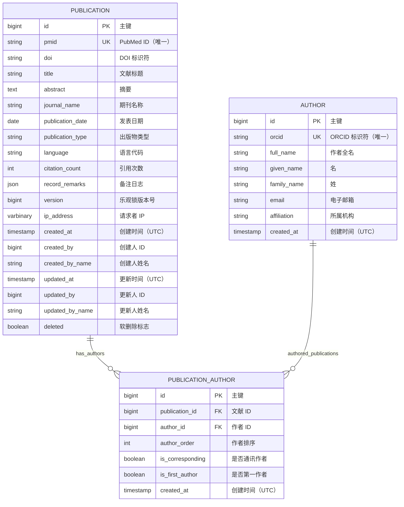

# 阶段 1：ER 图设计 - Patra 出版物管理示例

> **设计目标**：为 Patra 出版物管理系统设计 ER 图，体现实体关系和关键字段

---

## 🎨 完整 ER 图

---

## 📊 关系说明

### 1. Publication ↔ Author（多对多）
- **关系类型**：M:N（通过 PUBLICATION_AUTHOR 中间表）
- **业务含义**：一篇出版物有多个作者，一个作者可以发表多篇出版物
- **中间表额外属性**：
  - `author_order`：作者排序（第一作者、第二作者...）
  - `is_corresponding`：是否通讯作者
  - `is_first_author`：是否第一作者

---

## 🔑 关键设计决策

### 设计决策 1：为什么使用中间表？
**问题**：如何表达出版物和作者的多对多关系？

**方案对比**：
| 方案 | 优点 | 缺点 | 决策 |
|------|------|------|------|
| JSON 数组存储作者 ID | 简单，单表查询 | 无法高效查询某作者的出版物 | ❌ 不推荐 |
| 中间表 | 灵活，支持双向查询 | 增加一张表 | ✅ 采用 |

**决定**：使用 `publication_author` 中间表，因为：
- 需要记录作者顺序、角色（通讯作者、第一作者）
- 需要高效查询"某作者的所有出版物"
- 符合关系型数据库范式

---

### 设计决策 2：Author 表是否需要完整审计字段？
**问题**：Author 表是否需要 version、updated_at 等完整审计字段？

**分析**：
- Author 信息相对稳定（姓名、ORCID 不常变）
- 不涉及并发更新冲突
- 主要场景是创建和查询，很少更新

**决定**：Author 表仅保留 `created_at`，不包含 version、updated_at 等字段
- 简化表结构
- 节省存储空间
- 如未来需要，可通过迁移脚本添加

---

### 设计决策 3：PMID 和 DOI 的唯一性
**问题**：PMID 和 DOI 是否都需要唯一索引？

**分析**：
- PMID：PubMed 唯一标识符，绝对唯一 → **UNIQUE INDEX**
- DOI：数字对象标识符，理论唯一，但可能有脏数据 → **普通 INDEX**（允许 NULL）

**决定**：
- `pmid`：UNIQUE INDEX（强制唯一，防止重复采集）
- `doi`：普通 INDEX（支持高效查询，但允许 NULL 和极少的重复）

---

## 🎯 索引策略预览

### Publication 表索引
| 索引名 | 类型 | 字段 | 选择性 | 理由 |
|-------|------|------|--------|------|
| PRIMARY | 聚簇索引 | id | 1.00 | 主键 |
| uk_pmid | 唯一索引 | pmid | 0.98 | 高频精确查询 |
| idx_doi | 普通索引 | doi | 0.95 | 高频查询 |
| idx_publication_date | 普通索引 | publication_date | 0.75 | 范围查询 |
| ft_title_abstract | 全文索引 | title, abstract | N/A | 全文检索 |
| idx_deleted_updated | 复合索引 | deleted, updated_at | N/A | 软删除过滤 + 排序 |

### Author 表索引
| 索引名 | 类型 | 字段 | 选择性 | 理由 |
|-------|------|------|--------|------|
| PRIMARY | 聚簇索引 | id | 1.00 | 主键 |
| uk_orcid | 唯一索引 | orcid | 0.99 | 防重复 |
| idx_full_name | 普通索引 | full_name | 0.90 | 按姓名查询 |
| idx_email | 普通索引 | email | 0.85 | 按邮箱查询 |

### PublicationAuthor 表索引
| 索引名 | 类型 | 字段 | 选择性 | 理由 |
|-------|------|------|--------|------|
| PRIMARY | 聚簇索引 | id | 1.00 | 主键 |
| uk_pub_author | 唯一索引 | publication_id, author_id | 1.00 | 防止重复关联 |
| idx_author_id | 普通索引 | author_id | 0.80 | 查询作者的出版物 |
| idx_author_order | 复合索引 | publication_id, author_order | 0.95 | 按顺序获取作者 |

---

## ✅ ER 图验证清单

### 完整性检查
- [x] 所有业务实体都已包含（Publication, Author, PublicationAuthor）
- [x] 实体间关系都已定义（多对多通过中间表）
- [x] 主键和唯一键都已标识

### 规范性检查
- [x] 表名使用单数形式，小写，下划线分隔
- [x] 字段名小写，下划线分隔
- [x] 主键统一为 `id`（BIGINT UNSIGNED）
- [x] 包含标准审计字段（根据表特点选择性包含）

### 性能考虑
- [x] 高频查询字段已识别（pmid, doi, publication_date）
- [x] 需要索引的字段已标记
- [x] 全文检索需求已识别（title, abstract）
- [x] 软删除字段包含在索引策略中

---

## 🔍 与需求的映射

| 需求场景 | ER 图体现 | 实现方式 |
|---------|----------|---------|
| 按 PMID 查询 | pmid UK | 唯一索引支持快速查询 |
| 全文检索 | title, abstract TEXT | 全文索引 |
| 作者出版物列表 | 多对多关系 | 通过 publication_author JOIN |
| 记录作者顺序 | author_order INT | 中间表额外字段 |
| 标识通讯作者 | is_corresponding BOOLEAN | 中间表额外字段 |
| 软删除 | deleted TINYINT(1) | Publication 表包含 |
| 乐观锁 | version BIGINT UNSIGNED | Publication 表包含 |

---

## 下一步

ER 图设计完成，进入 **[阶段 2：详细表设计](2-table-details.md)**
