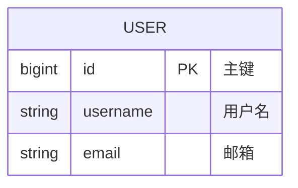
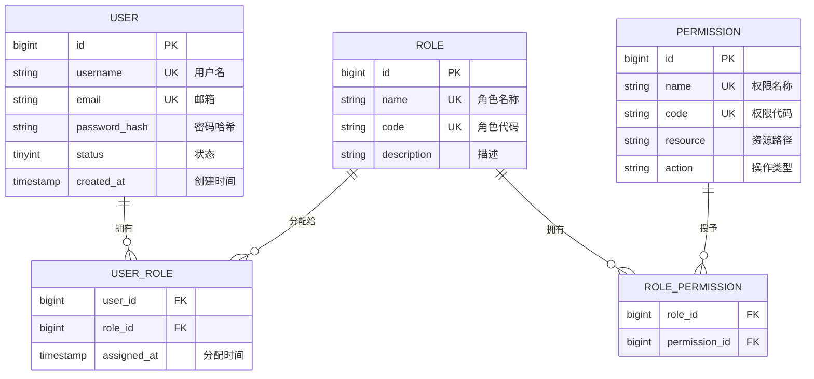
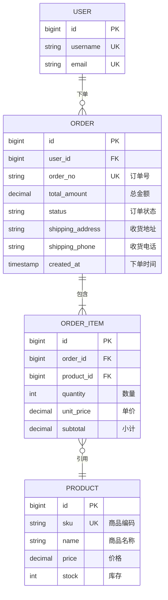
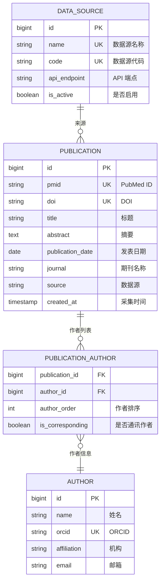
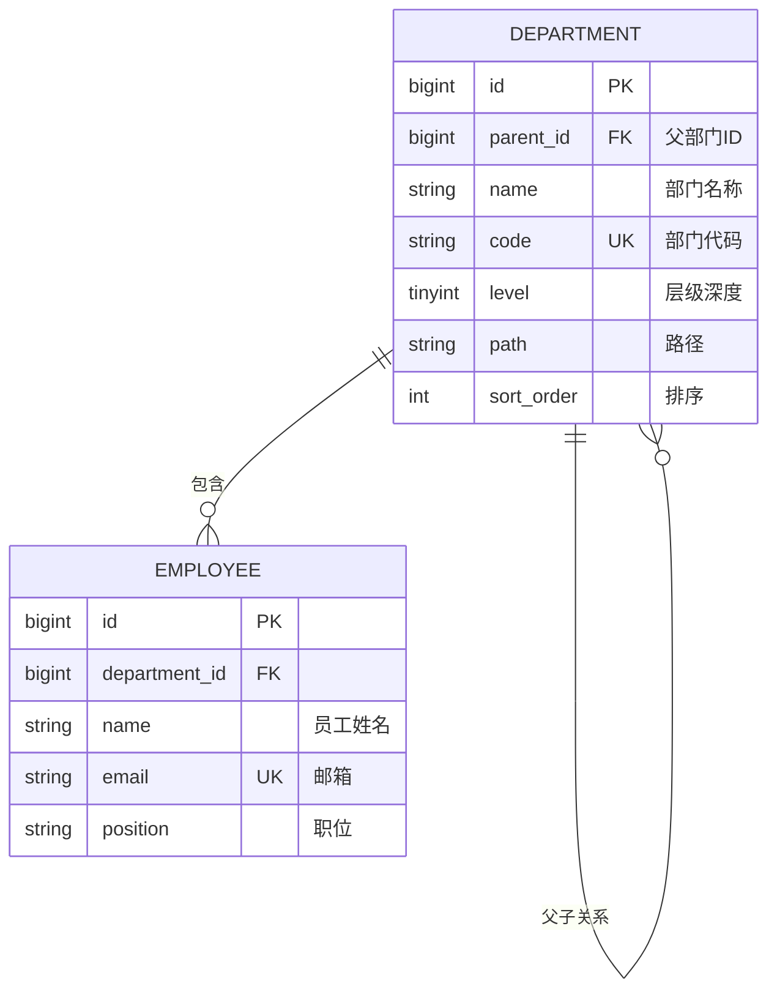
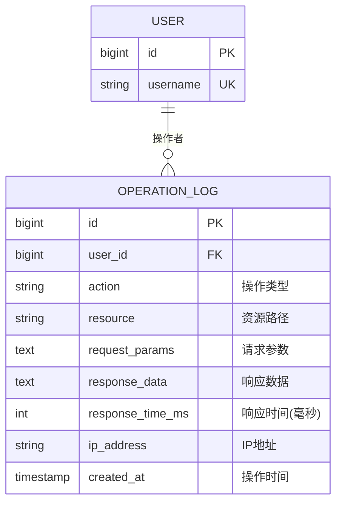
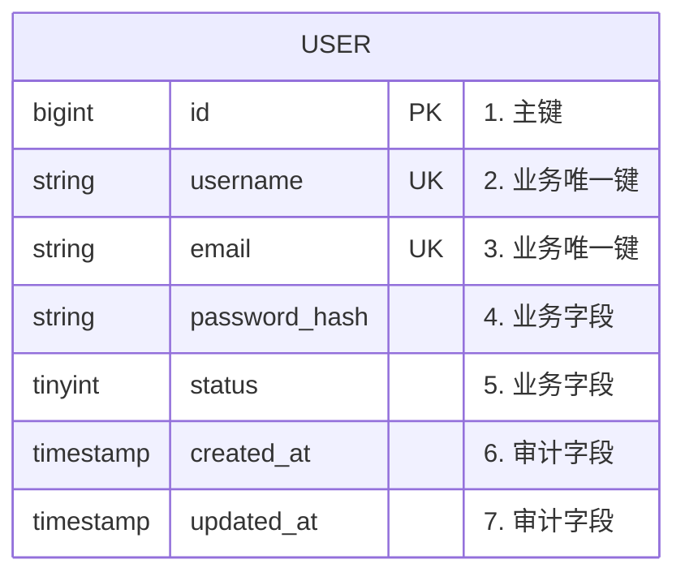

# Mermaid ER 图示例集

## 1. 基础语法

### 1.1 实体定义



### 1.2 关系符号

| 符号 | 左侧基数 | 右侧基数 | 说明 |
|------|---------|---------|------|
| `\|\|--\|\|` | 一 | 一 | 一对一 |
| `\|\|--o{` | 一 | 零或多 | 一对多 |
| `}o--\|\|` | 零或多 | 一 | 多对一 |
| `}o--o{` | 零或多 | 零或多 | 多对多 |

### 1.3 字段标记

| 标记 | 说明 |
|------|------|
| `PK` | 主键（Primary Key） |
| `FK` | 外键（Foreign Key） |
| `UK` | 唯一键（Unique Key） |

---

## 2. 场景 1: 用户权限系统（一对多 + 多对多）

### 业务需求
- 用户可以拥有多个角色
- 角色可以包含多个权限
- 用户通过角色获得权限

### ER 图



### 对应 SQL

```sql
-- 用户表
CREATE TABLE `user` (
  `id` BIGINT UNSIGNED NOT NULL AUTO_INCREMENT,
  `username` VARCHAR(50) NOT NULL,
  `email` VARCHAR(100) NOT NULL,
  `password_hash` VARCHAR(255) NOT NULL,
  `status` TINYINT NOT NULL DEFAULT 1,
  `created_at` TIMESTAMP(6) NOT NULL DEFAULT CURRENT_TIMESTAMP(6),
  PRIMARY KEY (`id`),
  UNIQUE KEY `uk_username` (`username`),
  UNIQUE KEY `uk_email` (`email`)
) ENGINE=InnoDB;

-- 角色表
CREATE TABLE `role` (
  `id` BIGINT UNSIGNED NOT NULL AUTO_INCREMENT,
  `name` VARCHAR(50) NOT NULL,
  `code` VARCHAR(50) NOT NULL,
  `description` VARCHAR(200),
  PRIMARY KEY (`id`),
  UNIQUE KEY `uk_name` (`name`),
  UNIQUE KEY `uk_code` (`code`)
) ENGINE=InnoDB;

-- 用户角色关联表（多对多）
CREATE TABLE `user_role` (
  `user_id` BIGINT UNSIGNED NOT NULL,
  `role_id` BIGINT UNSIGNED NOT NULL,
  `assigned_at` TIMESTAMP(6) NOT NULL DEFAULT CURRENT_TIMESTAMP(6),
  PRIMARY KEY (`user_id`, `role_id`),
  KEY `idx_role_id` (`role_id`),
  CONSTRAINT `fk_user_role_user` FOREIGN KEY (`user_id`) REFERENCES `user` (`id`),
  CONSTRAINT `fk_user_role_role` FOREIGN KEY (`role_id`) REFERENCES `role` (`id`)
) ENGINE=InnoDB;

-- 权限表
CREATE TABLE `permission` (
  `id` BIGINT UNSIGNED NOT NULL AUTO_INCREMENT,
  `name` VARCHAR(50) NOT NULL,
  `code` VARCHAR(50) NOT NULL,
  `resource` VARCHAR(200) NOT NULL,
  `action` VARCHAR(50) NOT NULL,
  PRIMARY KEY (`id`),
  UNIQUE KEY `uk_code` (`code`)
) ENGINE=InnoDB;

-- 角色权限关联表（多对多）
CREATE TABLE `role_permission` (
  `role_id` BIGINT UNSIGNED NOT NULL,
  `permission_id` BIGINT UNSIGNED NOT NULL,
  PRIMARY KEY (`role_id`, `permission_id`),
  KEY `idx_permission_id` (`permission_id`),
  CONSTRAINT `fk_role_permission_role` FOREIGN KEY (`role_id`) REFERENCES `role` (`id`),
  CONSTRAINT `fk_role_permission_permission` FOREIGN KEY (`permission_id`) REFERENCES `permission` (`id`)
) ENGINE=InnoDB;
```

---

## 3. 场景 2: 电商订单系统（一对多 + 聚合）

### 业务需求
- 用户可以下多个订单
- 订单包含多个订单项
- 订单项关联商品
- 订单包含收货地址信息

### ER 图



### 关键设计决策

1. **订单号 `order_no`**：使用业务唯一标识符，而不是自增 ID
2. **订单状态 `status`**：枚举值（PENDING, PAID, SHIPPED, COMPLETED, CANCELLED）
3. **小计 `subtotal`**：冗余字段（= quantity × unit_price），用于快速汇总
4. **收货地址**：存储在订单中（快照），不关联地址表（避免用户修改地址影响历史订单）

---

## 4. 场景 3: 文献管理系统（多对多 + 多数据源）

### 业务需求
- 出版物可以有多个作者
- 作者可以发表多篇出版物
- 作者排序很重要（第一作者、通讯作者）
- 支持多个数据源（PubMed、Europe PMC、Crossref）

### ER 图



### 关键设计决策

1. **唯一标识符**：同时支持 PMID 和 DOI，因为不同数据源可能只有其中一个
2. **作者排序**：`author_order` 字段记录作者在论文中的顺序（1, 2, 3...）
3. **通讯作者标志**：`is_corresponding` 布尔字段标识通讯作者
4. **数据源配置表**：集中管理数据源配置，便于动态添加新数据源

### 对应 SQL

```sql
-- 出版物表
CREATE TABLE `publication` (
  `id` BIGINT UNSIGNED NOT NULL AUTO_INCREMENT,
  `pmid` VARCHAR(20) NOT NULL,
  `doi` VARCHAR(100) DEFAULT NULL,
  `title` VARCHAR(500) NOT NULL,
  `abstract` TEXT,
  `publication_date` DATE,
  `journal` VARCHAR(200),
  `source` VARCHAR(50) NOT NULL,
  `created_at` TIMESTAMP(6) NOT NULL DEFAULT CURRENT_TIMESTAMP(6),
  PRIMARY KEY (`id`),
  UNIQUE KEY `uk_pmid` (`pmid`),
  UNIQUE KEY `uk_doi` (`doi`),
  KEY `idx_publication_date` (`publication_date`),
  KEY `idx_source` (`source`),
  FULLTEXT KEY `ft_title_abstract` (`title`, `abstract`)
) ENGINE=InnoDB;

-- 作者表
CREATE TABLE `author` (
  `id` BIGINT UNSIGNED NOT NULL AUTO_INCREMENT,
  `name` VARCHAR(200) NOT NULL,
  `orcid` VARCHAR(50) DEFAULT NULL,
  `affiliation` VARCHAR(500),
  `email` VARCHAR(100),
  PRIMARY KEY (`id`),
  UNIQUE KEY `uk_orcid` (`orcid`),
  KEY `idx_name` (`name`)
) ENGINE=InnoDB;

-- 出版物-作者关联表
CREATE TABLE `publication_author` (
  `publication_id` BIGINT UNSIGNED NOT NULL,
  `author_id` BIGINT UNSIGNED NOT NULL,
  `author_order` INT NOT NULL COMMENT '作者排序: 1=第一作者, 2=第二作者, ...',
  `is_corresponding` TINYINT(1) NOT NULL DEFAULT 0 COMMENT '是否通讯作者',
  PRIMARY KEY (`publication_id`, `author_id`),
  KEY `idx_author_id` (`author_id`),
  KEY `idx_author_order` (`publication_id`, `author_order`),
  CONSTRAINT `fk_pub_author_publication` FOREIGN KEY (`publication_id`) REFERENCES `publication` (`id`),
  CONSTRAINT `fk_pub_author_author` FOREIGN KEY (`author_id`) REFERENCES `author` (`id`)
) ENGINE=InnoDB;
```

---

## 5. 场景 4: 树形结构（部门层级）

### 业务需求
- 部门具有层级关系（公司 → 部门 → 团队）
- 支持无限层级
- 快速查询某个部门的所有子部门

### ER 图



### 关键设计决策

1. **自关联**：`parent_id` 指向同一张表的 `id`
2. **层级深度 `level`**：0=根节点，1=一级部门，2=二级部门...
3. **路径 `path`**：存储完整路径（如 `/1/3/7/`），用于快速查询子树
4. **排序 `sort_order`**：同级部门的显示顺序

### 对应 SQL

```sql
CREATE TABLE `department` (
  `id` BIGINT UNSIGNED NOT NULL AUTO_INCREMENT,
  `parent_id` BIGINT UNSIGNED DEFAULT NULL COMMENT '父部门ID, NULL=根节点',
  `name` VARCHAR(100) NOT NULL,
  `code` VARCHAR(50) NOT NULL,
  `level` TINYINT NOT NULL DEFAULT 0 COMMENT '层级深度: 0=根, 1=一级, 2=二级',
  `path` VARCHAR(500) NOT NULL COMMENT '路径: /1/3/7/',
  `sort_order` INT NOT NULL DEFAULT 0,
  PRIMARY KEY (`id`),
  UNIQUE KEY `uk_code` (`code`),
  KEY `idx_parent_id` (`parent_id`),
  KEY `idx_path` (`path`(100)),  -- 前缀索引
  CONSTRAINT `fk_department_parent` FOREIGN KEY (`parent_id`) REFERENCES `department` (`id`)
) ENGINE=InnoDB;

-- 查询某个部门的所有子部门
SELECT * FROM department
WHERE path LIKE '/1/3/%'  -- 查询 ID=3 的部门的所有子部门
ORDER BY path, sort_order;
```

---

## 6. 场景 5: 时间序列数据（日志记录）

### 业务需求
- 记录系统操作日志
- 支持按时间范围查询
- 数据量巨大（千万级）
- 历史数据归档

### ER 图



### 关键设计决策

1. **分区表**：按月分区，提高查询性能
2. **索引策略**：主要按时间范围查询，`created_at` 是关键索引
3. **数据归档**：定期将旧数据迁移到归档表
4. **JSON 字段**：`request_params` 和 `response_data` 使用 TEXT 或 JSON 类型

### 对应 SQL

```sql
CREATE TABLE `operation_log` (
  `id` BIGINT UNSIGNED NOT NULL AUTO_INCREMENT,
  `user_id` BIGINT UNSIGNED NOT NULL,
  `action` VARCHAR(50) NOT NULL COMMENT '操作类型: CREATE, UPDATE, DELETE',
  `resource` VARCHAR(200) NOT NULL COMMENT '资源路径: /api/v1/users/123',
  `request_params` JSON COMMENT '请求参数',
  `response_data` JSON COMMENT '响应数据',
  `response_time_ms` INT NOT NULL COMMENT '响应时间(毫秒)',
  `ip_address` VARBINARY(16) NOT NULL,
  `created_at` TIMESTAMP(6) NOT NULL DEFAULT CURRENT_TIMESTAMP(6),
  PRIMARY KEY (`id`, `created_at`),  -- 复合主键（分区键）
  KEY `idx_user_id_created_at` (`user_id`, `created_at`),
  KEY `idx_action_created_at` (`action`, `created_at`)
) ENGINE=InnoDB
PARTITION BY RANGE (YEAR(created_at) * 100 + MONTH(created_at)) (
  PARTITION p202501 VALUES LESS THAN (202502),
  PARTITION p202502 VALUES LESS THAN (202503),
  PARTITION p202503 VALUES LESS THAN (202504),
  PARTITION p_future VALUES LESS THAN MAXVALUE
);
```

---

## 7. Mermaid ER 图最佳实践

### 7.1 字段顺序



**推荐顺序：**
1. 主键（PK）
2. 唯一键（UK）
3. 外键（FK）
4. 业务字段（按重要性排序）
5. 审计字段（created_at, updated_at, deleted）

### 7.2 关系命名


**建议：** 在关系标签中使用动词 + 中文说明，增强可读性。

### 7.3 避免过度复杂

**❌ 不推荐：** 在一张 ER 图中展示所有表（20+ 个）

**✅ 推荐：** 按业务域分组，每张 ER 图展示 3-7 个相关表

```markdown
## 用户域 ER 图
...包含 User, Role, Permission

## 订单域 ER 图
...包含 Order, OrderItem, Product

## 支付域 ER 图
...包含 Payment, PaymentMethod, Transaction
```

---

## 总结

1. **实体命名**：使用大写单数形式（USER, ORDER）
2. **字段命名**：使用小写 snake_case（user_id, created_at）
3. **关系符号**：遵循 Mermaid 语法规范
4. **字段顺序**：主键 → 唯一键 → 外键 → 业务字段 → 审计字段
5. **分组展示**：按业务域拆分多张 ER 图，避免单张图过于复杂
6. **添加注释**：在字段后添加中文说明，增强可读性
