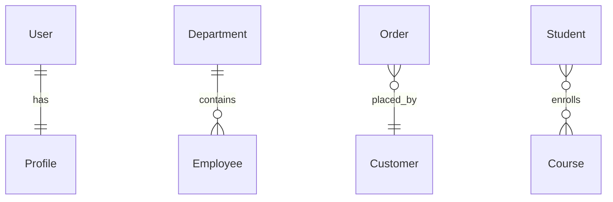
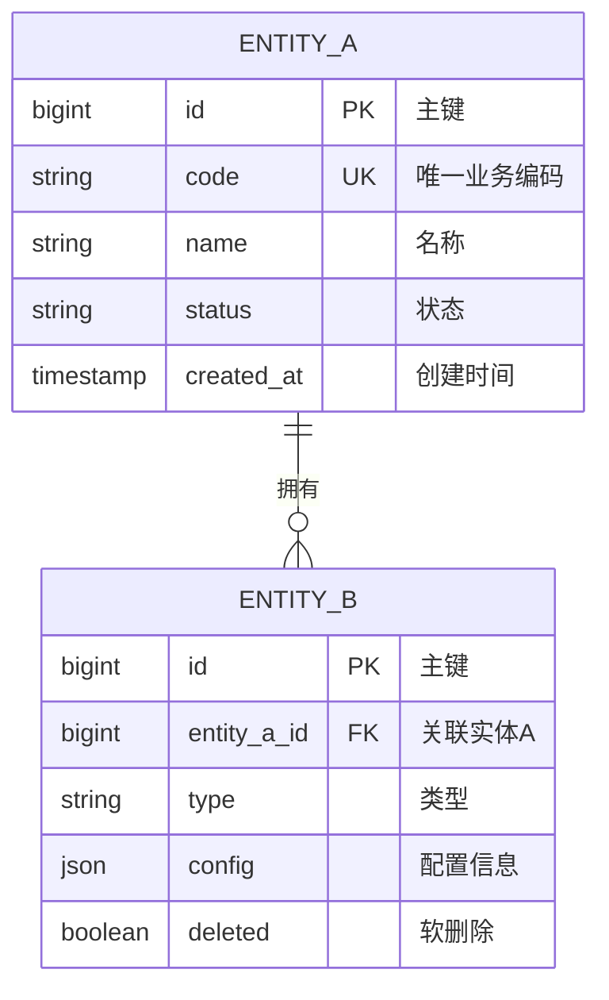
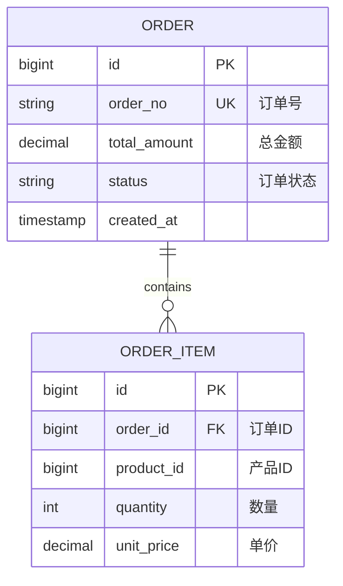
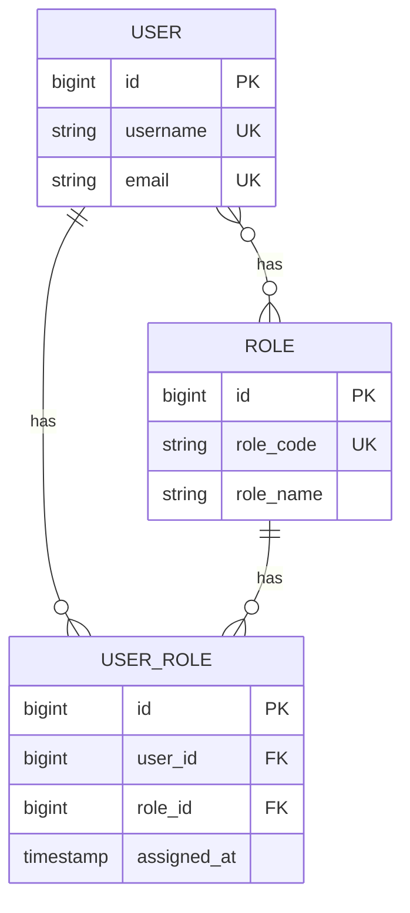
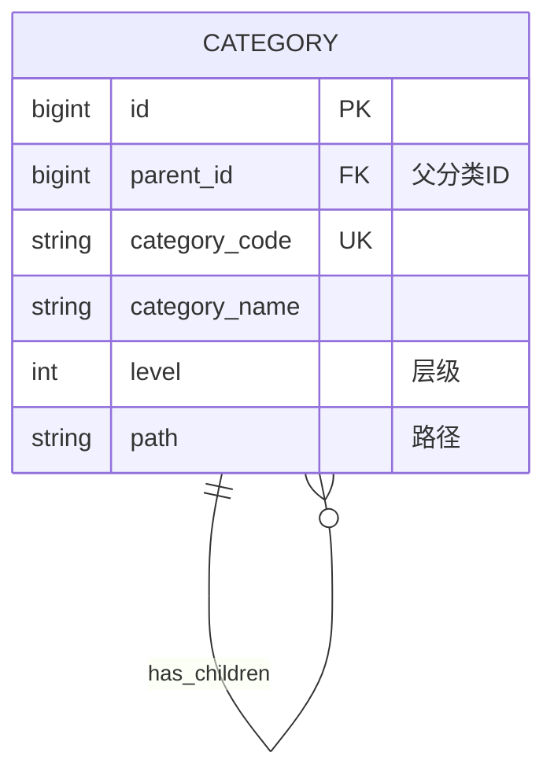
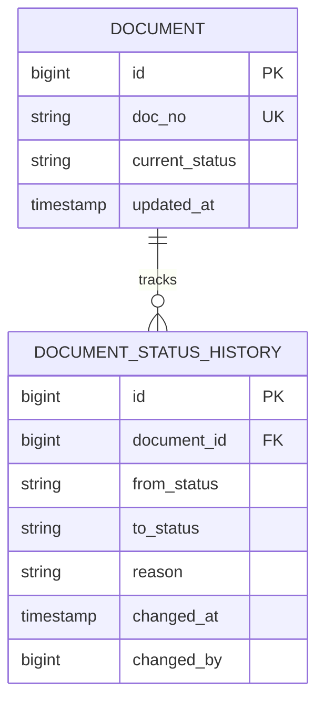
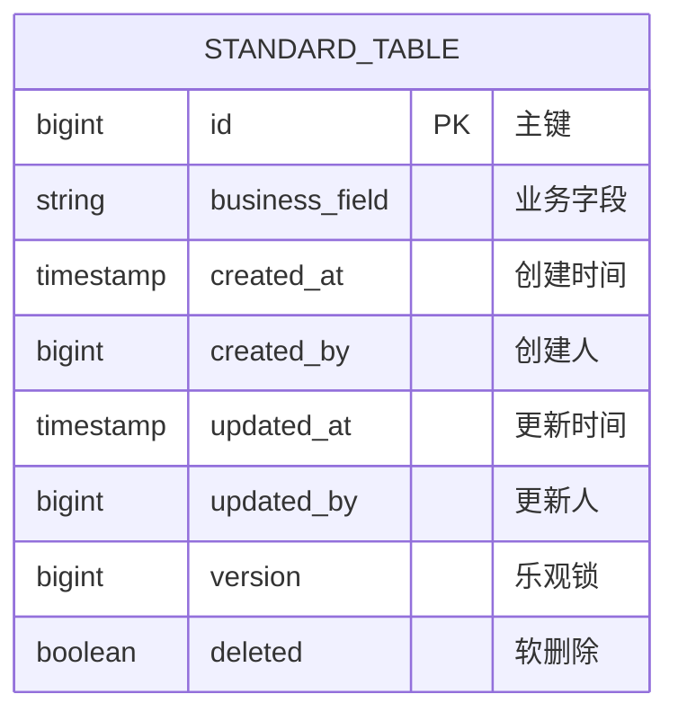

# 阶段 1：ER 图设计

## 🎨 Mermaid ER 图设计指南

### 快速语法参考

#### 关系类型

#### 关系符号说明
| 符号 | 含义 | 示例场景 |
|------|------|---------|
| `\|\|--\|\|` | 一对一 | 用户-用户详情 |
| `\|\|--o{` | 一对多 | 部门-员工 |
| `}o--\|\|` | 多对一 | 订单-客户 |
| `}o--o{` | 多对多 | 学生-课程 |

---

## 📐 设计模板

### 基础 ER 图模板

---

## 🏗️ 设计模式库

### 模式 1：主从关系（Master-Detail）

### 模式 2：多对多关联（通过中间表）

### 模式 3：树形结构（自关联）

### 模式 4：状态历史追踪

---

## 🎯 设计原则

### 1. 命名规范
- **表名**：使用单数形式，小写，下划线分隔
- **字段名**：小写，下划线分隔，见名知意
- **外键字段**：`关联表名_id` 格式

### 2. 主键设计
- 统一使用 `BIGINT UNSIGNED` 类型
- 命名为 `id`
- 使用 `AUTO_INCREMENT`

### 3. 必备字段

### 4. 关系设计检查
- [ ] 是否使用了外键（不允许）
- [ ] 关联字段是否建立索引？
- [ ] 是否需要冗余字段优化查询？
- [ ] 多对多关系是否需要中间表额外属性？

---

## 🔍 ER 图验证清单

设计完成后，检查以下项目：

### 完整性检查
- [ ] 所有业务实体都已包含
- [ ] 实体间关系都已定义
- [ ] 主键和唯一键都已标识

### 规范性检查
- [ ] 命名符合规范
- [ ] 包含必要的审计字段
- [ ] 数据类型选择合理

### 性能考虑
- [ ] 高频查询字段已识别
- [ ] 需要索引的字段已标记
- [ ] 是否需要反规范化设计

---

## 实际案例参考

需要更多示例，请参考：
- [Mermaid ER 复杂示例](../guides/mermaid-er-examples.md)
- [Patra 项目完整案例](../examples/patra-complete-example.md)

---

## 下一步

ER 图设计完成后，进入 **[阶段 2：详细表设计](stage-2-table-details.md)**
