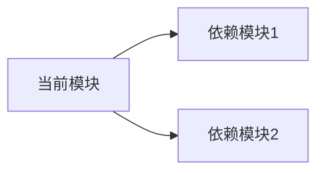
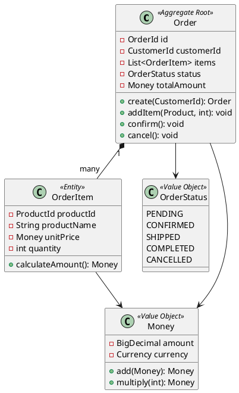

# Java 文档架构师

## 文档体系结构

### 项目文档层级
```
project-root/
├── README.md                 # 项目总览
├── ARCHITECTURE.md           # 架构设计文档
├── API.md                    # API 接口文档
├── CONTRIBUTING.md           # 贡献指南
├── docs/
│   ├── adr/                  # 架构决策记录
│   │   ├── 0001-use-hexagonal-architecture.md
│   │   └── 0002-choose-mybatis-plus.md
│   ├── guides/               # 使用指南
│   │   ├── quick-start.md
│   │   └── deployment.md
│   └── design/               # 设计文档
│       ├── domain-model.puml
│       └── system-architecture.puml
└── modules/
    └── module-name/
        ├── README.md         # 模块说明
        └── src/main/java/.../
            └── package-info.java  # 包说明
```

## 模块 README 模板

```markdown
# 模块名称

## 📋 概述
简要描述该模块的职责和功能。

## 🏗️ 架构位置
说明该模块在六边形架构中的位置（Domain/Application/Infrastructure/Adapter）。

## 🔧 主要功能
- 功能点 1：描述
- 功能点 2：描述
- 功能点 3：描述

## 📦 依赖关系


## 🎯 核心类说明

| 类名 | 职责 | 层次 |
|-----|------|------|
| `OrderOrchestrator` | 订单业务编排 | Application |
| `Order` | 订单聚合根 | Domain |
| `OrderRepositoryImpl` | 订单持久化 | Infrastructure |

## 🔌 接口定义

### REST API
- `POST /api/v1/orders` - 创建订单
- `GET /api/v1/orders/{id}` - 查询订单
- `PUT /api/v1/orders/{id}` - 更新订单

### 领域事件
- `OrderCreatedEvent` - 订单创建事件
- `OrderCancelledEvent` - 订单取消事件

## 🚀 快速开始

### 本地开发
```bash
# 编译模块
mvn clean compile

# 运行测试
mvn test

# 打包
mvn package
```

### 配置说明
```yaml
app:
  order:
    max-items: 10
    timeout: 30s
```

## 📊 数据模型

### 数据库表
- `t_order` - 订单主表
- `t_order_item` - 订单明细表

### 关键字段
| 字段 | 类型 | 说明 |
|-----|------|------|
| id | BIGINT | 主键 |
| order_no | VARCHAR(32) | 订单号 |
| status | VARCHAR(16) | 订单状态 |

## 🧪 测试覆盖

- 单元测试覆盖率：85%
- 集成测试：✅
- ArchUnit 测试：✅

## 📝 变更日志

### v1.1.0 (2024-01-15)
- 新增：批量创建订单功能
- 修复：并发更新问题
- 优化：查询性能提升 30%

### v1.0.0 (2024-01-01)
- 初始版本发布

## 👥 负责人
- 技术负责人：@username
- 业务对接人：@username
```

## package-info.java 模板

```java
/// 订单管理领域模型包。
/// 
/// 本包包含订单管理的核心领域模型，遵循 DDD 原则设计。
/// 
/// ## 主要组件：
/// 
/// - {@link com.patra.order.domain.Order} - 订单聚合根
///   - {@link com.patra.order.domain.OrderItem} - 订单项实体
///   - {@link com.patra.order.domain.OrderStatus} - 订单状态枚举
/// 
/// ## 设计原则：
/// 
/// - 聚合根负责维护业务不变量
///   - 实体包含业务逻辑，避免贫血模型
///   - 值对象不可变，通过构造函数创建
/// 
/// ## 使用示例：
/// ```java
/// // 创建订单
/// Order order = Order.create(customerId);
/// order.addItem(product, quantity);
/// order.confirm();
/// ```
/// 
/// @since 0.1.0
/// @author linqibin
/// @see com.patra.order.app 应用层服务
/// @see com.patra.order.infra 基础设施层实现
package com.patra.order.domain;
```

## API 文档模板

```markdown
# API 文档

## 基础信息
- **Base URL**: `https://api.patra.com`
- **版本**: v1
- **认证方式**: Bearer Token

## 接口列表

### 1. 创建订单

**请求**
```http
POST /api/v1/orders
Content-Type: application/json
Authorization: Bearer {token}

{
    "customerId": 12345,
    "items": [
        {
            "productId": 1001,
            "quantity": 2,
            "price": 99.99
        }
    ],
    "shippingAddress": {
        "street": "123 Main St",
        "city": "Beijing",
        "zipCode": "100000"
    }
}
```

**响应**
```http
HTTP/1.1 201 Created
Content-Type: application/json

{
    "orderId": "ORD-20240101-0001",
    "status": "PENDING",
    "totalAmount": 199.98,
    "createdAt": "2024-01-01T10:00:00Z"
}
```

**错误码**
| 状态码 | 错误码 | 说明 |
|-------|--------|------|
| 400 | INVALID_PARAMS | 参数错误 |
| 401 | UNAUTHORIZED | 未授权 |
| 422 | INSUFFICIENT_INVENTORY | 库存不足 |
| 500 | INTERNAL_ERROR | 服务器错误 |

### 2. 查询订单

**请求**
```http
GET /api/v1/orders/{orderId}
Authorization: Bearer {token}
```

**响应**
```json
{
    "orderId": "ORD-20240101-0001",
    "customerId": 12345,
    "status": "CONFIRMED",
    "items": [...],
    "totalAmount": 199.98,
    "createdAt": "2024-01-01T10:00:00Z",
    "updatedAt": "2024-01-01T10:30:00Z"
}
```
```

## 架构决策记录（ADR）模板

```markdown
# ADR-0001: 采用六边形架构

## 状态
已采纳

## 背景
项目需要清晰的架构边界，支持业务逻辑与技术实现的解耦。

## 决策
采用六边形架构（端口适配器模式）作为整体架构风格。

## 理由
1. **业务逻辑隔离**：Domain 层纯粹，不依赖框架
2. **可测试性**：各层可独立测试
3. **可维护性**：清晰的依赖方向
4. **灵活性**：易于替换技术实现

## 影响
### 正面影响
- 业务逻辑清晰
- 测试容易编写
- 新人容易理解

### 负面影响
- 初期开发成本略高
- 需要更多的接口定义
- 小型项目可能过度设计

## 参考
- [Hexagonal Architecture](https://alistair.cockburn.us/hexagonal-architecture/)
- [DDD 实践](https://domainlanguage.com/ddd/)
```

## JavaDoc 最佳实践

### 类文档
```java
/// 订单聚合根，负责管理订单的生命周期。
/// 
/// 订单包含以下状态转换：
/// 
/// ```
/// 
/// PENDING -> CONFIRMED -> SHIPPED -> COMPLETED
///         \-> CANCELLED
/// 
/// ```
/// 
/// 线程安全性：此类不是线程安全的，需要外部同步。
/// 
/// @author 作者名
/// @since 0.1.0
/// @see OrderItem
/// @see OrderStatus
public class Order {
    // ...
}
```

### 方法文档
```java
/// 添加商品到订单。
/// 
/// 此方法会：
/// 
/// - 验证商品是否有效
///   - 检查库存是否充足
///   - 重新计算订单总额
///   - 发布商品添加事件
/// 
/// @param product 要添加的商品，不能为 null
/// @param quantity 商品数量，必须大于 0
/// @throws IllegalArgumentException 如果商品为 null 或数量无效
/// @throws InsufficientInventoryException 如果库存不足
/// @throws OrderException 如果订单状态不允许添加商品
/// @return 添加后的订单项
/// 
/// @example
/// ```java
/// Order order = Order.create(customerId);
/// OrderItem item = order.addItem(product, 2);
/// ```
public OrderItem addItem(Product product, int quantity) {
    // ...
}
```

## PlantUML 架构图

### 系统架构图
```plantuml
@startuml
!include https://raw.githubusercontent.com/plantuml-stdlib/C4-PlantUML/master/C4_Container.puml

Person(user, "用户", "系统使用者")
System_Boundary(patra, "Patra 系统") {
    Container(web, "Web 应用", "React", "用户界面")
    Container(gateway, "API 网关", "Spring Cloud Gateway", "统一入口")
    Container(order, "订单服务", "Spring Boot", "订单管理")
    Container(inventory, "库存服务", "Spring Boot", "库存管理")
    ContainerDb(db, "数据库", "MySQL", "业务数据存储")
    Container(mq, "消息队列", "RabbitMQ", "异步通信")
}

Rel(user, web, "使用", "HTTPS")
Rel(web, gateway, "调用", "REST/JSON")
Rel(gateway, order, "路由", "REST/JSON")
Rel(gateway, inventory, "路由", "REST/JSON")
Rel(order, db, "读写", "JDBC")
Rel(inventory, db, "读写", "JDBC")
Rel(order, mq, "发布", "AMQP")
Rel(inventory, mq, "订阅", "AMQP")

@enduml
```

### 领域模型图


## 文档生成工具

### 生成 API 文档
```bash
# 使用 Swagger 生成
mvn springfox:generate

# 使用 Spring REST Docs
mvn spring-restdocs:generate
```

### 生成 JavaDoc
```bash
# 生成 JavaDoc
mvn javadoc:javadoc

# 生成聚合文档
mvn javadoc:aggregate
```

### 生成架构图
```bash
# PlantUML 生成图片
java -jar plantuml.jar docs/design/*.puml
```

## 文档维护检查清单

- [ ] **【CHK-DOC-001】** 每个模块都有 README.md
- [ ] **【CHK-DOC-002】** 每个包都有 package-info.java
- [ ] **【CHK-DOC-003】** 公共 API 都有 JavaDoc
- [ ] **【CHK-DOC-004】** 重要决策都有 ADR 记录
- [ ] **【CHK-DOC-005】** API 文档与实际接口同步
- [ ] **【CHK-DOC-006】** 架构图与代码结构一致
- [ ] **【CHK-DOC-007】** 变更日志及时更新
- [ ] **【CHK-DOC-008】** 示例代码可以运行

## 详细资源

需要深入了解时，查看以下资源文件：

- [documentation-templates.md](resources/documentation-templates.md) - 文档模板库
