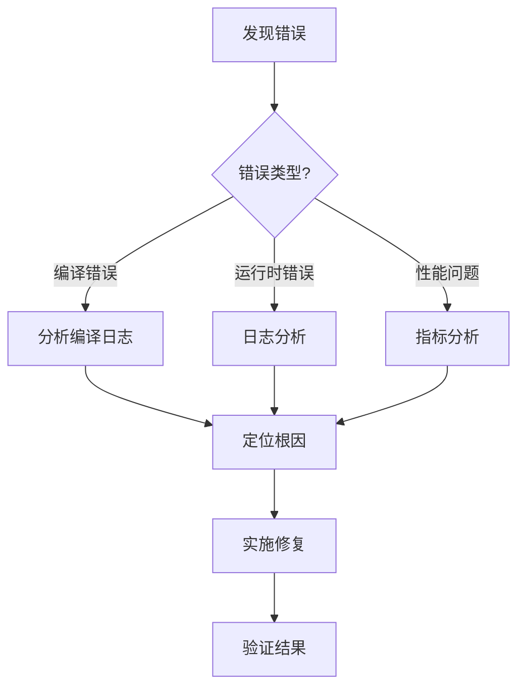

# 错误诊断详细指南

系统化的运行时错误诊断流程和工具使用指南。

## 🎯 诊断流程概览



## 📂 日志文件结构

### Patra 日志目录

```
$PROJECT_ROOT/logs/
├── patra-gateway.log          # API 网关日志
├── patra-registry.log         # 注册中心日志
├── patra-ingest.log          # 数据摄入服务日志
├── patra-object-storage.log         # 存储服务日志
└── patra-ingest/             # 历史日志
    ├── patra-ingest.2024-11-01.log
    └── patra-ingest.2024-10-31.log
```

### 日志格式解析

```
2025-01-15 10:23:45.123  INFO [patra-ingest] [trace:abc123,seg:def456,span:ghi789] [http-nio-8082-exec-1] c.p.i.adapter.rest.PlanController : Plan created
│                        │    │              │                                      │                      │                                  │
│                        │    │              │                                      │                      │                                  └─ 日志消息
│                        │    │              │                                      │                      └─ Logger类名 (最多40字符)
│                        │    │              │                                      └─ 线程名
│                        │    │              └─ SkyWalking 追踪上下文 (traceId, segmentId, spanId)
│                        │    └─ 应用名称
│                        └─ 日志级别
└─ 时间戳
```

## 🔍 错误类型识别

### 常见错误模式

| 错误类型 | 日志特征 | 诊断工具 | 优先级 |
|---------|---------|---------|--------|
| **NullPointerException** | `java.lang.NullPointerException` | 代码审查 + DEBUG日志 | 高 |
| **SQL异常** | `SQLSyntaxErrorException`, `DataIntegrityViolation` | 数据库日志 + SQL审查 | 高 |
| **连接超时** | `ConnectTimeoutException`, `SocketTimeoutException` | 网络诊断 + 配置检查 | 中 |
| **内存溢出** | `OutOfMemoryError`, `GC overhead limit` | 堆dump分析 | 紧急 |
| **死锁** | `waiting for monitor entry`, `Found one Java-level deadlock` | 线程dump分析 | 紧急 |
| **事务回滚** | `TransactionSystemException`, `rolled back` | 事务日志 + 业务逻辑 | 高 |
| **配置错误** | `ConfigurationException`, `@Value` 解析失败 | Nacos配置检查 | 中 |
| **Bean创建失败** | `BeanCreationException`, `NoSuchBeanDefinition` | Spring启动日志 | 高 |

## 📊 诊断命令大全

### 基础日志查询

```bash
# 1. 查看最近N条错误
tail -n 1000 logs/patra-ingest.log | grep ERROR

# 2. 特定时间窗口的错误
sed -n '/2025-01-15 10:00/,/2025-01-15 11:00/p' logs/patra-ingest.log | grep ERROR

# 3. 按错误类型统计
grep ERROR logs/patra-ingest.log | \
  awk -F'Exception|Error' '{print $1}' | \
  awk '{print $NF}' | \
  sort | uniq -c | sort -rn

# 4. 查找特定异常的完整堆栈
grep -A 50 "NullPointerException" logs/patra-ingest.log

# 5. 统计每小时错误数
grep ERROR logs/patra-ingest.log | \
  awk '{print substr($2,1,2)}' | \
  sort | uniq -c
```

### SkyWalking 追踪关联

```bash
# 1. 通过traceId追踪完整请求链路
TRACE_ID="abc123def456"
for log in logs/*.log; do
    echo "=== $(basename $log) ==="
    grep "trace:$TRACE_ID" "$log" | head -5
done

# 2. 查找跨服务调用链
grep "trace:$TRACE_ID" logs/*.log | \
  awk -F'[][]' '{print $2, $4, $8}' | \
  sort -k1,2

# 3. 提取特定请求的所有span
grep "trace:$TRACE_ID" logs/patra-ingest.log | \
  awk -F'span:' '{print $2}' | \
  awk '{print $1}' | sort -u
```

### 性能问题诊断

```bash
# 1. 查找慢查询
grep -E "duration=[0-9]{4,}" logs/patra-ingest.log  # 超过1000ms

# 2. 统计平均响应时间
grep "duration=" logs/patra-ingest.log | \
  awk -F'duration=' '{print $2}' | \
  awk '{sum+=$1; count++} END {print "Avg:", sum/count "ms"}'

# 3. 查找N+1查询问题
grep "SELECT" logs/patra-ingest.log | \
  awk '{print $1, substr($2,1,8)}' | \
  uniq -c | awk '$1 > 10 {print}'

# 4. 监控GC活动
grep "GC" logs/patra-ingest.log | tail -20
```

### 业务问题诊断

```bash
# 1. 查找卡住的Plan
grep "Plan.*RUNNING" logs/patra-ingest.log | \
  awk '{print $NF}' | sort | uniq -c | \
  awk '$1 > 5 {print "Stuck Plan:", $2}'

# 2. 查找失败的Task
grep "Task.*FAILED" logs/patra-ingest.log | tail -20

# 3. 检查事件处理延迟
grep "Event received" logs/patra-ingest.log | \
  awk '{print $1, $2}' > events_received.txt
grep "Event processed" logs/patra-ingest.log | \
  awk '{print $1, $2}' > events_processed.txt
# 然后对比时间差
```

## 🔧 动态调试技术

### Actuator 端点使用

```bash
# 1. 健康检查
curl http://localhost:8081/actuator/health | jq '.'

# 2. 查看当前日志级别
curl http://localhost:8081/actuator/loggers | jq '.loggers["com.patra.ingest"]'

# 3. 动态调整日志级别
# DEBUG级别 - 查看详细流程
curl -X POST http://localhost:8081/actuator/loggers/com.patra.ingest.app \
  -H "Content-Type: application/json" \
  -d '{"configuredLevel": "DEBUG"}'

# TRACE级别 - 最详细的诊断
curl -X POST http://localhost:8081/actuator/loggers/com.baomidou.mybatisplus \
  -H "Content-Type: application/json" \
  -d '{"configuredLevel": "TRACE"}'

# 4. 获取线程dump
curl http://localhost:8081/actuator/threaddump > threaddump.json

# 5. 查看环境配置
curl http://localhost:8081/actuator/env | jq '.propertySources[].properties'

# 6. 查看指标
curl http://localhost:8081/actuator/metrics | jq '.names'
curl http://localhost:8081/actuator/metrics/jvm.memory.used | jq '.'
```

### 动态日志级别策略

| 包名 | 何时开启DEBUG | 关注内容 |
|------|--------------|----------|
| `com.patra.*.app.usecase` | 编排逻辑问题 | Phase日志、协调器调用 |
| `com.patra.*.domain` | 业务规则问题 | 状态转换、验证逻辑 |
| `com.patra.*.infra.persistence` | 数据库问题 | SQL执行、事务边界 |
| `com.baomidou.mybatisplus` | SQL问题 | 完整SQL、参数绑定 |
| `org.springframework.transaction` | 事务问题 | 事务传播、回滚 |
| `feign` | 远程调用问题 | HTTP请求/响应 |
| `com.alibaba.nacos` | 配置问题 | 配置加载、刷新 |

## 🎨 根因分析模板

### 分析步骤

1. **收集证据**
```bash
# 错误时间窗口
START_TIME="2025-01-15 10:00"
END_TIME="2025-01-15 11:00"

# 提取所有相关日志
sed -n "/${START_TIME}/,/${END_TIME}/p" logs/patra-ingest.log > incident.log

# 错误统计
grep ERROR incident.log | wc -l
grep WARN incident.log | wc -l
```

2. **关联分析**
```bash
# 找出错误前的操作
grep -B 10 "ERROR" incident.log | grep -v ERROR

# 找出错误后的影响
grep -A 10 "ERROR" incident.log | grep -v ERROR
```

3. **根因定位**
- 第一个ERROR是什么？
- 错误前最后的成功操作是什么？
- 是否有资源耗尽的迹象？
- 是否有外部依赖失败？

### 常见根因及解决方案

| 根因 | 证据 | 解决方案 |
|------|------|----------|
| **数据库连接池耗尽** | `Timeout waiting for connection` | 增加连接池大小或优化查询 |
| **内存泄漏** | `OutOfMemoryError` + 内存持续增长 | 分析heap dump，修复泄漏 |
| **死锁** | `Found one Java-level deadlock` | 调整锁顺序或使用无锁设计 |
| **配置错误** | `Could not resolve placeholder` | 检查Nacos配置 |
| **网络问题** | `Connection refused` | 检查服务可用性和网络 |
| **并发问题** | `OptimisticLockingFailureException` | 实现重试机制 |

## 📝 诊断报告模板

```markdown
## 事件报告

**时间**: 2025-01-15 10:00-11:00
**服务**: patra-ingest
**问题**: Plan卡在RUNNING状态

### 时间线
- 10:00 - 用户报告Plan未完成
- 10:05 - 发现大量RUNNING状态的Plan
- 10:10 - 定位到TaskCompletedEvent处理失败
- 10:15 - 发现异步执行器队列满
- 10:20 - 增加队列容量
- 10:25 - 手动触发完成检查
- 10:30 - 问题解决

### 根因分析
异步事件处理器线程池队列容量不足(100)，在高峰期无法及时处理TaskCompletedEvent，
导致Slice和Plan状态更新延迟。

### 证据
\`\`\`
2025-01-15 10:00:15.234 ERROR - Task rejected from executor
java.util.concurrent.RejectedExecutionException: Queue capacity exceeded
\`\`\`

### 解决方案
1. 增加异步执行器队列容量: 100 → 500
2. 增加核心线程数: 10 → 20
3. 配置队列监控告警

### 验证结果
- ✅ 所有卡住的Plan已完成
- ✅ 新的Plan正常处理
- ✅ 队列使用率 < 50%

### 预防措施
1. 添加队列大小监控指标
2. 设置队列使用率 > 80% 告警
3. 实现队列满时的降级策略
```

## 🚀 快速诊断检查清单

```
□ 查看错误日志和堆栈跟踪
□ 检查错误发生的时间模式
□ 使用traceId关联跨服务日志
□ 检查应用健康状态
□ 必要时开启DEBUG日志
□ 检查外部依赖状态
□ 分析资源使用情况
□ 识别错误模式（偶发/持续）
□ 定位第一个错误
□ 实施修复并验证
□ 记录根因和解决方案
□ 制定预防措施
```

## ⚠️ 注意事项

1. **不要长时间开启DEBUG/TRACE** - 影响性能并产生大量日志
2. **先在非生产环境重现** - 避免影响生产
3. **保留现场** - 修复前备份相关日志
4. **关注关联影响** - 一个错误可能引发连锁反应
5. **记录时间线** - 便于事后分析和改进