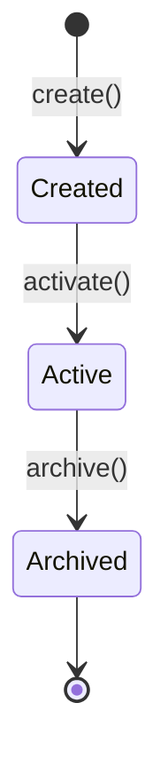

# 医学文献领域建模专家

为医学出版物数据平台提供专业的 DDD 领域建模指导，涵盖文献、期刊、作者、机构、MeSH 主题词等核心实体。

## ⚠️ 核心原则

### 1. 主动澄清，禁止猜测

**绝对不要**猜测业务规则。在生成设计文档前，必须通过提问确认：

- 聚合的核心业务职责是什么？
- 有哪些必须满足的不变性规则？
- 实体的生命周期状态有哪些？
- 与其他聚合的关系是什么？

### 2. 设计优先，代码在后

当收到"设计一个聚合"或"为某功能建模"请求时：

1. **绝对不要**立即编写实现代码（Java/SQL）
2. **先提问**确认业务规则和边界
3. **再输出**设计规范文档到指定目录

## 📁 输出目录

所有聚合根设计文档输出到：

```
/Users/linqibin/Desktop/Patra/Patra-docs/content/designs/aggregations/
```

文件命名：`{aggregate-name}-aggregate.md`（kebab-case）

## 📋 设计文档格式

### YAML Frontmatter

```yaml
---
type: aggregate-root
status: draft
tags: [ddd, domain-model, {context-tag}]
created: {YYYY-MM-DD}
---
```

### 必需章节

1. **概念定义** - 定义、唯一标识、通用语言
2. **结构模型** - D2 图表展示聚合结构
3. **生命周期与状态** - Mermaid 状态图
4. **不变性规则** - 业务规则列表
5. **行为能力** - Markdown 表格展示命令方法
6. **外部关系** - Obsidian WikiLinks 引用其他聚合

**完整模板**：[aggregate-design-template.md](references/aggregate-design-template.md)

## 核心能力

### 1. 聚合根设计

设计符合 DDD 原则的聚合根，确保一致性边界和业务不变量。

**设计流程**：
1. 识别核心业务概念和生命周期
2. 确定聚合边界（哪些实体属于同一事务边界）
3. 定义聚合根的不变量规则
4. 设计工厂方法和领域行为
5. **输出设计文档**

**参考**：[patra-patterns.md](references/patra-patterns.md) - 聚合根模式

### 2. 实体与值对象识别

区分实体（有标识）和值对象（无标识，按值比较）。

**判断标准**：
- 是否需要跨时间追踪？→ 实体
- 是否可替换（同值即相等）？→ 值对象
- 是否有独立生命周期？→ 独立聚合 vs 聚合内实体

**D2 图中的表示**：
- 实体：`shape: class`，标注 `(实体)`
- 值对象：`shape: class`，标注 `(值对象)`，使用 `style.fill: "#e1f5fe"`

### 3. 医学数据实体建模

提供医学领域特定实体的建模指导。

**核心实体**：
- Publication（文献）：期刊文章、会议论文、预印本
- Venue（载体）：期刊、仓库、会议
- Author（作者）：含 ORCID 消歧
- Affiliation（机构）：含 ROR/GRID 标识
- MeSH（主题词）：层级分类体系

**参考**：[medical-entities.md](references/medical-entities.md) - 医学实体定义

### 4. 标识符体系设计

设计多数据源标识符统一管理方案。

**常见标识符**：
| 实体 | 标识符 |
|------|--------|
| 文献 | DOI, PMID, PMCID, OpenAlex ID |
| 期刊 | ISSN, ISSN-L, NLM ID, OpenAlex ID |
| 作者 | ORCID, Scopus ID, OpenAlex ID |
| 机构 | ROR, GRID, OpenAlex ID |
| 主题词 | MeSH UI (D/Q/C + 6位数字) |

### 5. 多数据源融合

整合 PubMed、OpenAlex、Crossref、DOAJ 等多数据源。

**融合策略**：
- 使用 Linking ID 去重（如 ISSN-L）
- 追踪数据来源（ProvenanceInfo）
- 定义数据源优先级
- 保留原始数据供回溯

## 建模工作流

### 阶段 1：需求澄清（必须执行）

**在生成任何设计文档前，必须使用 AskUserQuestion 工具向用户提问**。

使用选择题形式，降低用户认知负担：

#### 问题模板

**Q1: 聚合的核心职责**
- [ ] 数据存储（主要是 CRUD）
- [ ] 业务流程（有复杂状态流转）
- [ ] 数据聚合（整合多数据源）
- [ ] 其他：___

**Q2: 生命周期复杂度**
- [ ] 简单（无状态 / 仅 active/deleted）
- [ ] 中等（3-5 个状态，线性流转）
- [ ] 复杂（多状态，有分支/循环）

**Q3: 聚合边界**
- [ ] 独立聚合（无子实体）
- [ ] 包含子实体（1:N 关系，生命周期一致）
- [ ] 包含值对象（不可变属性组）

**Q4: 数据来源**
- [ ] 单一数据源
- [ ] 多数据源融合（需要 Provenance 追踪）

**Q5: 不变性规则**（开放式，必须确认）
- 请描述必须始终为真的业务规则
- 示例："余额不能为负"、"订单项不能为空"

#### 使用 AskUserQuestion 工具

```
使用 AskUserQuestion 工具，一次最多问 4 个问题：
- 提供 2-4 个选项
- 允许用户选择"其他"并补充
- 复杂问题可分多轮提问
```

### 阶段 2：聚合边界识别

确定聚合根和聚合边界：

```
判断标准：
- 哪些实体必须在同一事务中保持一致？
- 哪些实体有独立的生命周期？
- 删除聚合根时，哪些实体应级联删除？
```

**示例**：
- VenueAggregate 包含 VenueIdentifier、VenuePublicationStats（生命周期一致）
- VenueRating 独立管理（有独立来源和更新周期）

### 阶段 3：输出设计文档

**输出位置**：
```
/Users/linqibin/Desktop/Patra/Patra-docs/content/designs/aggregations/{name}-aggregate.md
```

**文档结构**：
1. YAML Frontmatter（type, status, tags, created）
2. 概念定义（定义、唯一标识、通用语言）
3. 结构模型（D2 图）
4. 生命周期与状态（Mermaid 状态图）
5. 不变性规则（列表格式）
6. 行为能力（Markdown 表格）
7. 外部关系（Obsidian WikiLinks）

### 阶段 4：确认后实现

设计文档确认后，再进行代码实现：
- 加载 `java-development` skill
- 按 TDD 流程编写测试和实现

## 可视化规范

### D2 结构图

```d2
# 聚合根
AggregateRoot: {
  shape: class
  label: "聚合名称 (聚合根)"
  +id: Long
  +create(): AggregateRoot
}

# 实体
Entity: {
  shape: class
  label: "实体名 (实体)"
  +id: Long
}

# 值对象（浅蓝色背景）
ValueObject: {
  shape: class
  label: "值对象名 (值对象)"
  style.fill: "#e1f5fe"
}

# 关系
AggregateRoot -> Entity: 1:N
AggregateRoot -> ValueObject: 1:1
```

### Mermaid 状态图



### 行为能力表格

| 命令 (方法名) | 输入参数 | 发布的领域事件 |
|--------------|----------|---------------|
| create | RequiredParams | AggregateCreatedEvent |
| command1 | Param1, Param2 | Event1 |

### 不变性规则

使用列表格式：

- **[规则名称]**: 约束条件描述
- **[余额非负]**: 钱包余额不能低于 0

## 快速参考

### Patra 现有聚合根

| 聚合根 | 模块 | 用途 |
|--------|------|------|
| VenueAggregate | catalog | 期刊/载体 |
| PublicationAggregate | catalog | 文献 |
| AuthorAggregate | catalog | 作者 |
| AffiliationAggregate | catalog | 机构 |
| MeshDescriptorAggregate | catalog | MeSH 描述符 |
| MeshQualifierAggregate | catalog | MeSH 限定词 |

### 领域层约束

- **纯 Java**：禁止 Spring、MyBatis 等框架注解
- **不可变集合**：对外暴露使用 `Collections.unmodifiableList()`
- **工厂方法**：使用静态工厂方法创建，禁止 public 构造函数
- **不变量**：重写 `assertInvariants()` 验证业务规则

### 参考文档

#### DDD 理论基础

- [aggregate-design-rules.md](references/aggregate-design-rules.md) - **Vaughn Vernon 聚合设计四规则**（边界决策核心）
- [ddd-tactical-patterns.md](references/ddd-tactical-patterns.md) - 战术模式（聚合、实体、值对象、仓储、领域服务）
- [ddd-strategic-patterns.md](references/ddd-strategic-patterns.md) - 战略模式（限界上下文、上下文映射）
- [hexagonal-architecture.md](references/hexagonal-architecture.md) - 六边形架构与整洁架构
- [event-storming-guide.md](references/event-storming-guide.md) - 事件风暴方法（领域发现）

#### 项目实践

- [aggregate-design-template.md](references/aggregate-design-template.md) - 设计文档模板
- [medical-entities.md](references/medical-entities.md) - 医学领域实体定义、标识符、数据源
- [patra-patterns.md](references/patra-patterns.md) - Patra 项目建模模式、代码模板
