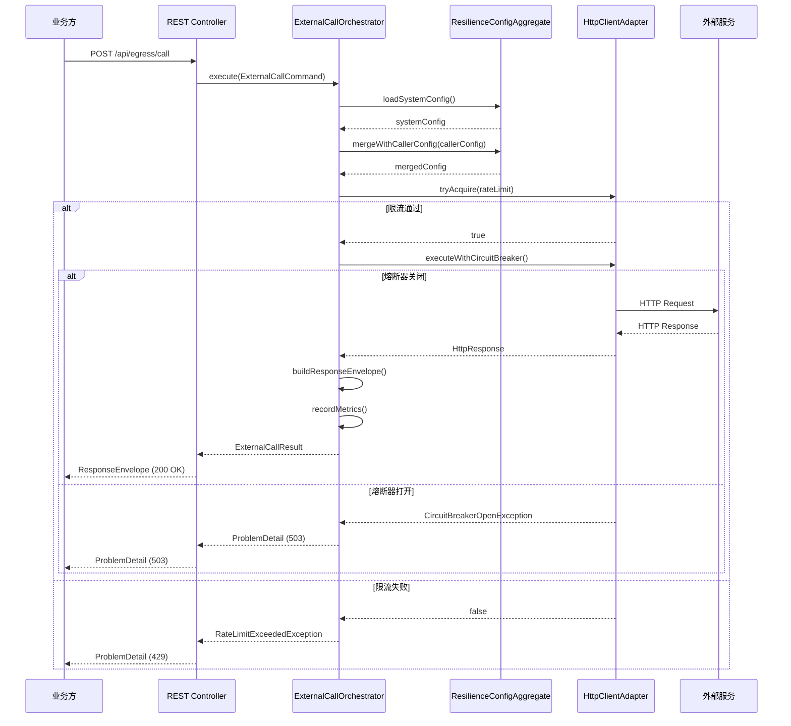
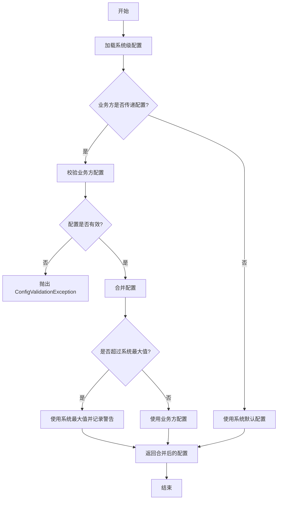
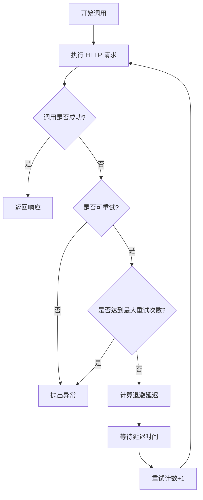
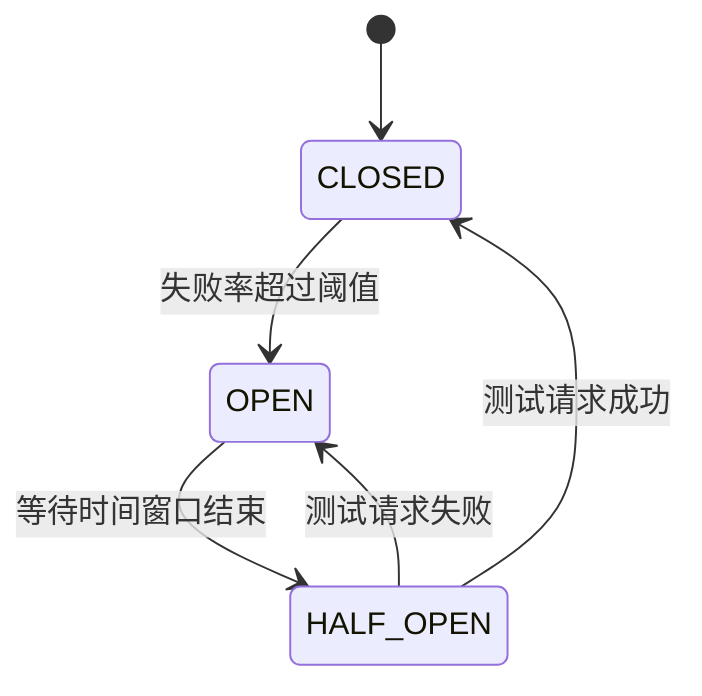

# patra-egress-gateway 设计文档

## 概述

patra-egress-gateway（南向网关）是 Papertrace 项目中负责统一管理所有出站外部服务调用的微服务。它遵循六边形架构和 DDD 设计原则，为上游业务方提供标准化的外部服务访问能力，包括弹性能力（限流/重试/熔断/超时）和统一的响应语义封装。

### 核心职责

1. **透传外部服务调用**：接收业务方的请求参数和认证信息，原样透传给外部服务
2. **弹性能力提供**：提供限流、重试、熔断、超时等通用弹性能力
3. **响应语义统一**：将外部服务的响应封装为统一的语义结构
4. **配置管理**：管理系统级弹性配置，支持业务方覆盖（不超过最大值）
5. **可观测性**：记录每次外部调用的详细日志和指标

### 非职责

- 不进行业务数据转换和处理
- 不包含业务规则判断
- 不持久化业务数据
- 不解析外部服务的业务数据内容

## 架构设计

### 模块结构

遵循 Papertrace 项目的标准模块结构：

```
patra-egress-gateway/
├── patra-egress-gateway-api/          # 错误码、外部 DTOs
├── patra-egress-gateway-adapter/      # Inbound adapters (REST)
├── patra-egress-gateway-app/          # Use case orchestration
├── patra-egress-gateway-domain/       # Aggregates, entities, domain ports
├── patra-egress-gateway-infra/        # Outbound implementations
└── patra-egress-gateway-boot/         # Spring Boot application
```

### 依赖方向

```
adapter → app → domain ← infra
```


### 层次职责

#### API 层 (patra-egress-gateway-api)
- 定义错误码枚举（EgressErrors）
- 定义对外暴露的 DTO（请求/响应对象）
- 不依赖任何框架

#### Adapter 层 (patra-egress-gateway-adapter)
- REST Controller：接收业务方的 HTTP 请求
- 协议转换：将 HTTP 请求转换为 Use Case Command
- 错误映射：将领域异常映射为 ProblemDetail 响应

#### Application 层 (patra-egress-gateway-app)
- Use Case 编排：协调外部服务调用流程
- 配置合并与校验：合并系统配置和业务方配置
- 事务边界管理（如需要）

#### Domain 层 (patra-egress-gateway-domain)
- 聚合根：ResilienceConfigAggregate（弹性配置聚合）
- 值对象：RequestSnapshot、ResponseSnapshot、RetryAdvice、RateLimitStatus
- 领域端口：ConfigPort、HttpClientPort、RateLimiterPort、CircuitBreakerPort
- 领域事件：ExternalCallCompletedEvent、CircuitBreakerOpenedEvent

#### Infrastructure 层 (patra-egress-gateway-infra)
- 配置实现：YamlConfigRepository、DatabaseConfigRepository（后期）
- HTTP 客户端：基于 Spring RestClient 或 WebClient 的实现
- 弹性能力：基于 Resilience4j 的限流、重试、熔断实现
- 持久化：配置数据的数据库访问（后期）

#### Boot 层 (patra-egress-gateway-boot)
- Spring Boot 主类
- 配置文件（application.yaml、egress-error-config.yaml）
- 依赖注入配置

## 组件与接口

### 核心组件

#### 1. ExternalCallUseCase（外部调用用例）

**职责**：编排外部服务调用的完整流程

**接口定义**：
```java
public interface ExternalCallUseCase {
    ExternalCallResult execute(ExternalCallCommand command);
}
```

**流程**：
1. 接收 ExternalCallCommand（包含目标 URL、HTTP 方法、Headers、Body、可选的弹性配置）
2. 加载系统级弹性配置
3. 合并并校验业务方传递的配置（不超过系统最大值）
4. 应用弹性能力（限流、重试、熔断、超时）
5. 调用外部服务
6. 封装响应为统一语义结构
7. 记录日志和指标
8. 返回 ExternalCallResult


#### 2. ResilienceConfigAggregate（弹性配置聚合）

**职责**：管理弹性配置的加载、合并和校验

**核心方法**：
```java
public class ResilienceConfigAggregate {
    // 加载系统级配置
    public static ResilienceConfigAggregate loadSystemConfig(ConfigPort configPort);
    
    // 合并业务方配置（不超过系统最大值）
    public ResilienceConfig mergeWithCallerConfig(ResilienceConfig callerConfig);
    
    // 校验配置有效性
    public void validate();
}
```

**配置项**：
- 超时时间（timeout）
- 重试次数（maxRetries）
- 重试退避策略（retryBackoff）
- 限流速率（rateLimit）
- 熔断阈值（circuitBreakerThreshold）
- 熔断时间窗口（circuitBreakerWindow）
- 响应头白名单（responseHeaderWhitelist）

#### 3. HttpClientPort（HTTP 客户端端口）

**职责**：定义外部 HTTP 调用的抽象接口

**接口定义**：
```java
public interface HttpClientPort {
    HttpResponse call(HttpRequest request, ResilienceConfig config);
}
```

**实现**：
- 基于 Spring RestClient 或 WebClient
- 支持各种 HTTP 方法（GET、POST、PUT、DELETE 等）
- 支持自定义 Headers 和 Body
- 支持超时配置

#### 4. RateLimiterPort（限流端口）

**职责**：定义限流能力的抽象接口

**接口定义**：
```java
public interface RateLimiterPort {
    boolean tryAcquire(String key, RateLimitConfig config);
    RateLimitStatus getStatus(String key);
}
```

**实现**：
- 基于 Resilience4j RateLimiter
- 支持全局限流和按 key 限流
- 记录限流状态（已用配额/剩余配额）


#### 5. CircuitBreakerPort（熔断端口）

**职责**：定义熔断能力的抽象接口

**接口定义**：
```java
public interface CircuitBreakerPort {
    <T> T executeWithCircuitBreaker(String key, Supplier<T> supplier, CircuitBreakerConfig config);
    CircuitBreakerState getState(String key);
}
```

**实现**：
- 基于 Resilience4j CircuitBreaker
- 支持熔断状态管理（CLOSED、OPEN、HALF_OPEN）
- 记录熔断事件

#### 6. ConfigPort（配置端口）

**职责**：定义配置加载的抽象接口

**接口定义**：
```java
public interface ConfigPort {
    ResilienceConfig loadSystemConfig();
    void saveConfig(ResilienceConfig config); // 后期数据库模式
}
```

**实现**：
- YamlConfigRepository：从 YAML 文件加载配置
- DatabaseConfigRepository：从数据库加载配置（后期）

#### 7. ResponseEnvelopeBuilder（响应封装构建器）

**职责**：构建统一语义的响应结构

**核心方法**：
```java
public class ResponseEnvelopeBuilder {
    public ResponseEnvelope build(
        HttpResponse rawResponse,
        RateLimitStatus rateLimitStatus,
        RetryAdvice retryAdvice,
        List<String> headerWhitelist
    );
}
```

**响应结构**：
```java
public record ResponseEnvelope(
    boolean success,                    // 成功/失败标识（基于 HTTP 状态码）
    int statusCode,                     // HTTP 状态码
    Map<String, String> headers,        // 白名单过滤后的响应头
    String body,                        // 原始响应 Body
    String bodyHash,                    // 响应 Body 的哈希值
    RateLimitStatus rateLimitStatus,    // 限流状态
    RetryAdvice retryAdvice,            // 重试建议
    String snapshotMode                 // 快照模式（META_PLUS_BODY）
) {}
```


## 数据模型

### 值对象

#### ResilienceConfig（弹性配置）
```java
public record ResilienceConfig(
    Duration timeout,                   // 超时时间
    int maxRetries,                     // 最大重试次数
    Duration retryBackoff,              // 重试退避时间
    int rateLimit,                      // 限流速率（每秒请求数）
    int circuitBreakerThreshold,        // 熔断阈值（失败次数）
    Duration circuitBreakerWindow,      // 熔断时间窗口
    List<String> responseHeaderWhitelist // 响应头白名单
) {
    // 校验方法
    public void validate() {
        if (timeout.isNegative() || timeout.isZero()) {
            throw new IllegalArgumentException("Timeout must be positive");
        }
        if (maxRetries < 0) {
            throw new IllegalArgumentException("MaxRetries cannot be negative");
        }
        // ... 其他校验
    }
    
    // 合并方法（不超过最大值）
    public ResilienceConfig mergeWithMax(ResilienceConfig max) {
        return new ResilienceConfig(
            timeout.compareTo(max.timeout) > 0 ? max.timeout : timeout,
            Math.min(maxRetries, max.maxRetries),
            retryBackoff.compareTo(max.retryBackoff) > 0 ? max.retryBackoff : retryBackoff,
            Math.min(rateLimit, max.rateLimit),
            Math.min(circuitBreakerThreshold, max.circuitBreakerThreshold),
            circuitBreakerWindow.compareTo(max.circuitBreakerWindow) > 0 
                ? max.circuitBreakerWindow : circuitBreakerWindow,
            responseHeaderWhitelist != null ? responseHeaderWhitelist : max.responseHeaderWhitelist
        );
    }
}
```

#### HttpRequest（HTTP 请求）
```java
public record HttpRequest(
    String url,                         // 目标 URL
    HttpMethod method,                  // HTTP 方法
    Map<String, String> headers,        // 请求头
    String body                         // 请求体
) {}
```

#### HttpResponse（HTTP 响应）
```java
public record HttpResponse(
    int statusCode,                     // HTTP 状态码
    Map<String, List<String>> headers,  // 响应头
    String body                         // 响应体
) {
    public boolean isSuccess() {
        return statusCode >= 200 && statusCode < 300;
    }
}
```


#### RateLimitStatus（限流状态）
```java
public record RateLimitStatus(
    int limit,                          // 限流上限
    int remaining,                      // 剩余配额
    Duration resetAfter,                // 重置时间
    ExternalRateLimitInfo externalInfo  // 外部服务返回的限流信息
) {}

public record ExternalRateLimitInfo(
    Integer limit,                      // X-RateLimit-Limit
    Integer remaining,                  // X-RateLimit-Remaining
    Long resetTimestamp                 // X-RateLimit-Reset
) {
    public static ExternalRateLimitInfo fromHeaders(Map<String, List<String>> headers) {
        // 从响应头提取限流信息
    }
}
```

#### RetryAdvice（重试建议）
```java
public record RetryAdvice(
    boolean retryable,                  // 是否可重试
    Duration suggestedDelay,            // 建议延迟时间
    String reason                       // 重试建议原因
) {
    public static RetryAdvice fromResponse(HttpResponse response, ResilienceConfig config) {
        // 根据响应状态码和 Retry-After Header 生成重试建议
        if (response.statusCode() == 429 || response.statusCode() == 503) {
            Duration delay = extractRetryAfter(response.headers())
                .orElse(config.retryBackoff());
            return new RetryAdvice(true, delay, "Rate limited or service unavailable");
        }
        if (response.statusCode() >= 500) {
            return new RetryAdvice(true, config.retryBackoff(), "Server error");
        }
        return new RetryAdvice(false, Duration.ZERO, "Not retryable");
    }
}
```

### Command 对象

#### ExternalCallCommand（外部调用命令）
```java
public record ExternalCallCommand(
    HttpRequest request,                // HTTP 请求
    ResilienceConfig callerConfig       // 业务方传递的配置（可选）
) {}
```

### Result 对象

#### ExternalCallResult（外部调用结果）
```java
public record ExternalCallResult(
    ResponseEnvelope envelope,          // 响应封装
    Duration duration,                  // 调用耗时
    int retryCount,                     // 实际重试次数
    String traceId                      // 追踪 ID
) {}
```


## 错误处理

### 错误码设计

遵循 Papertrace 项目的错误码规范：`EGR-<HTTP_STATUS>` 或 `EGR-<BUSINESS_CODE>`

#### HTTP 对齐错误（0xxx 段）
- `EGR-0400`：Bad Request（请求参数错误）
- `EGR-0422`：Unprocessable Entity（配置参数校验失败）
- `EGR-0429`：Too Many Requests（触发限流）
- `EGR-0500`：Internal Server Error（内部错误）
- `EGR-0503`：Service Unavailable（触发熔断）
- `EGR-0504`：Gateway Timeout（调用超时）

#### 业务错误（1xxx+ 段）
- `EGR-1001`：配置加载失败
- `EGR-1002`：配置校验失败
- `EGR-1003`：外部服务调用失败
- `EGR-1004`：响应封装失败

### 异常层次

```java
// 领域异常基类
public class EgressException extends ApplicationException {
    public EgressException(ErrorCodeLike errorCode, String message) {
        super(errorCode, message);
    }
    
    public EgressException(ErrorCodeLike errorCode, String message, Throwable cause) {
        super(errorCode, message, cause);
    }
}

// 具体异常
public class ConfigValidationException extends EgressException {
    public ConfigValidationException(String message) {
        super(EgressErrors.CONFIG_VALIDATION_FAILED, message);
    }
}

public class RateLimitExceededException extends EgressException {
    public RateLimitExceededException(String message) {
        super(EgressErrors.RATE_LIMIT_EXCEEDED, message);
    }
}

public class CircuitBreakerOpenException extends EgressException {
    public CircuitBreakerOpenException(String message) {
        super(EgressErrors.CIRCUIT_BREAKER_OPEN, message);
    }
}

public class ExternalCallTimeoutException extends EgressException {
    public ExternalCallTimeoutException(String message, Throwable cause) {
        super(EgressErrors.GATEWAY_TIMEOUT, message, cause);
    }
}
```


### ProblemDetail 输出

所有错误统一输出 RFC 7807 ProblemDetail 格式：

```json
{
  "code": "EGR-0429",
  "status": 429,
  "title": "Too Many Requests",
  "detail": "Rate limit exceeded: 100 requests per second",
  "path": "/api/egress/call",
  "timestamp": "2025-10-05T10:30:00Z",
  "traceId": "abc123def456"
}
```

## 测试策略

### 单元测试

#### Domain 层测试
- ResilienceConfigAggregate 的配置合并和校验逻辑
- 值对象的不变性和业务规则
- RetryAdvice 的生成逻辑
- RateLimitStatus 的计算逻辑

#### Application 层测试
- ExternalCallOrchestrator 的流程编排
- 配置合并与校验逻辑
- 异常处理和错误映射

#### Infrastructure 层测试
- YamlConfigRepository 的配置加载
- HttpClientAdapter 的 HTTP 调用（使用 MockWebServer）
- Resilience4j 集成测试

### 集成测试

#### Boot 层测试
- 端到端外部服务调用流程
- 限流、重试、熔断的实际行为
- 配置热更新（数据库模式）
- 错误处理和 ProblemDetail 输出

### 测试数据

- 使用 WireMock 模拟外部服务
- 使用 H2 内存数据库测试配置持久化（后期）
- 使用 Testcontainers 测试 Redis 限流（如需要）


## 技术选型

### 核心依赖

- **Spring Boot**: 3.2.4（与项目统一）
- **Spring Cloud**: 2023.0.1（与项目统一）
- **Resilience4j**: 弹性能力实现（限流、重试、熔断）
- **Spring RestClient/WebClient**: HTTP 客户端
- **Jackson**: JSON 序列化/反序列化
- **Hutool**: 工具类库
- **MapStruct**: 对象映射
- **Lombok**: 代码生成

### 弹性能力实现

#### Resilience4j 模块选择

- **resilience4j-ratelimiter**: 限流
- **resilience4j-retry**: 重试
- **resilience4j-circuitbreaker**: 熔断
- **resilience4j-timelimiter**: 超时

#### 配置示例

```yaml
resilience4j:
  ratelimiter:
    instances:
      default:
        limitForPeriod: 100
        limitRefreshPeriod: 1s
        timeoutDuration: 0s
  
  retry:
    instances:
      default:
        maxAttempts: 3
        waitDuration: 1s
        exponentialBackoffMultiplier: 2
        retryExceptions:
          - java.io.IOException
          - java.util.concurrent.TimeoutException
  
  circuitbreaker:
    instances:
      default:
        slidingWindowSize: 10
        failureRateThreshold: 50
        waitDurationInOpenState: 10s
        permittedNumberOfCallsInHalfOpenState: 3
  
  timelimiter:
    instances:
      default:
        timeoutDuration: 30s
```


### HTTP 客户端选择

使用 **Spring RestClient**（Spring 6.1+ 推荐）：

```java
@Configuration
public class HttpClientConfig {
    
    @Bean
    public RestClient restClient(RestClient.Builder builder) {
        return builder
            .requestFactory(new JdkClientHttpRequestFactory())
            .build();
    }
}
```

**优势**：
- 同步 API，简单直观
- 支持超时配置
- 支持自定义 Headers
- 与 Spring Boot 3.x 深度集成

**备选方案**：WebClient（如需要异步调用）

## 配置管理

### 系统级配置（YAML）

```yaml
# application.yaml
patra:
  egress:
    resilience:
      # 系统级最大值配置
      max:
        timeout: 60s
        maxRetries: 5
        retryBackoff: 10s
        rateLimit: 1000
        circuitBreakerThreshold: 20
        circuitBreakerWindow: 60s
      
      # 系统级默认值配置
      default:
        timeout: 30s
        maxRetries: 3
        retryBackoff: 2s
        rateLimit: 100
        circuitBreakerThreshold: 10
        circuitBreakerWindow: 30s
        responseHeaderWhitelist:
          - Content-Type
          - Content-Length
          - X-RateLimit-Limit
          - X-RateLimit-Remaining
          - X-RateLimit-Reset
          - Retry-After
```

### 配置演进路径

#### 阶段 1：YAML 配置（初期）

```java
@Component
public class YamlConfigRepository implements ConfigPort {
    
    @Value("${patra.egress.resilience.default}")
    private ResilienceConfig defaultConfig;
    
    @Value("${patra.egress.resilience.max}")
    private ResilienceConfig maxConfig;
    
    @Override
    public ResilienceConfig loadSystemConfig() {
        return defaultConfig;
    }
    
    public ResilienceConfig getMaxConfig() {
        return maxConfig;
    }
}
```


#### 阶段 2：数据库配置（后期）

```java
@Component
@ConditionalOnProperty(name = "patra.egress.config.source", havingValue = "database")
public class DatabaseConfigRepository implements ConfigPort {
    
    private final ConfigMapper configMapper;
    
    @Override
    public ResilienceConfig loadSystemConfig() {
        ConfigDO configDO = configMapper.selectById("default");
        return ConfigConverter.toDomain(configDO);
    }
    
    @Override
    public void saveConfig(ResilienceConfig config) {
        ConfigDO configDO = ConfigConverter.toDO(config);
        configMapper.updateById(configDO);
    }
}
```

**数据库表设计**：

```sql
CREATE TABLE egress_resilience_config (
    id VARCHAR(64) PRIMARY KEY,
    timeout_seconds INT NOT NULL,
    max_retries INT NOT NULL,
    retry_backoff_seconds INT NOT NULL,
    rate_limit INT NOT NULL,
    circuit_breaker_threshold INT NOT NULL,
    circuit_breaker_window_seconds INT NOT NULL,
    response_header_whitelist JSON,
    created_at TIMESTAMP DEFAULT CURRENT_TIMESTAMP,
    updated_at TIMESTAMP DEFAULT CURRENT_TIMESTAMP ON UPDATE CURRENT_TIMESTAMP
);
```

### 配置切换

通过配置属性控制配置源：

```yaml
patra:
  egress:
    config:
      source: yaml  # 或 database
```

## 可观测性

### 日志规范

#### 日志前缀

所有日志使用 `[EGRESS][LAYER]` 前缀：

- `[EGRESS][ADAPTER]`：Adapter 层日志
- `[EGRESS][APP]`：Application 层日志
- `[EGRESS][DOMAIN]`：Domain 层日志
- `[EGRESS][INFRA]`：Infrastructure 层日志


#### 日志内容

**请求日志**：
```java
log.info("[EGRESS][APP] External call started: url={} method={} traceId={}", 
    request.url(), request.method(), traceId);
log.debug("[EGRESS][APP] Request headers: {}", maskSensitiveHeaders(request.headers()));
log.debug("[EGRESS][APP] Request body size: {} bytes", request.body().length());
```

**响应日志**：
```java
log.info("[EGRESS][APP] External call completed: statusCode={} duration={}ms traceId={}", 
    response.statusCode(), duration.toMillis(), traceId);
log.debug("[EGRESS][APP] Response headers: {}", filterWhitelistHeaders(response.headers()));
log.debug("[EGRESS][APP] Response body hash: {}", bodyHash);
```

**错误日志**：
```java
log.error("[EGRESS][APP] External call failed: url={} error={} traceId={}", 
    request.url(), e.getMessage(), traceId, e);
```

**弹性事件日志**：
```java
log.warn("[EGRESS][INFRA] Rate limit exceeded: limit={} remaining={} traceId={}", 
    rateLimitStatus.limit(), rateLimitStatus.remaining(), traceId);
log.warn("[EGRESS][INFRA] Circuit breaker opened: threshold={} failures={} traceId={}", 
    config.circuitBreakerThreshold(), failureCount, traceId);
log.info("[EGRESS][INFRA] Retry attempt: attempt={}/{} delay={}ms traceId={}", 
    retryCount, maxRetries, delay.toMillis(), traceId);
```

### 指标收集

使用 Micrometer 收集指标：

```java
@Component
public class ExternalCallMetrics {
    
    private final MeterRegistry meterRegistry;
    
    public void recordCall(String url, int statusCode, Duration duration) {
        Timer.builder("egress.call.duration")
            .tag("url", url)
            .tag("status", String.valueOf(statusCode))
            .register(meterRegistry)
            .record(duration);
    }
    
    public void recordRateLimit(String key) {
        Counter.builder("egress.ratelimit.exceeded")
            .tag("key", key)
            .register(meterRegistry)
            .increment();
    }
    
    public void recordCircuitBreakerOpen(String key) {
        Counter.builder("egress.circuitbreaker.opened")
            .tag("key", key)
            .register(meterRegistry)
            .increment();
    }
}
```


## 关键流程

### 外部服务调用流程



### 配置合并流程




### 重试流程



### 熔断状态转换



## 部署与运维

### 配置文件

#### application.yaml
```yaml
server:
  port: 8083

spring:
  application:
    name: patra-egress-gateway
  
  cloud:
    nacos:
      discovery:
        server-addr: ${NACOS_SERVER:localhost:8848}
      config:
        server-addr: ${NACOS_SERVER:localhost:8848}
        file-extension: yaml

patra:
  error:
    context-prefix: EGR
  
  egress:
    config:
      source: yaml
    
    resilience:
      max:
        timeout: 60s
        maxRetries: 5
        retryBackoff: 10s
        rateLimit: 1000
        circuitBreakerThreshold: 20
        circuitBreakerWindow: 60s
      
      default:
        timeout: 30s
        maxRetries: 3
        retryBackoff: 2s
        rateLimit: 100
        circuitBreakerThreshold: 10
        circuitBreakerWindow: 30s
        responseHeaderWhitelist:
          - Content-Type
          - Content-Length
          - X-RateLimit-Limit
          - X-RateLimit-Remaining
          - X-RateLimit-Reset
          - Retry-After

logging:
  level:
    com.patra.egress: INFO
    io.github.resilience4j: DEBUG
```


#### egress-error-config.yaml
```yaml
patra:
  error:
    mappings:
      # HTTP 对齐错误
      - code: EGR-0400
        status: 400
        title: Bad Request
        detail: Invalid request parameters
      
      - code: EGR-0422
        status: 422
        title: Unprocessable Entity
        detail: Configuration validation failed
      
      - code: EGR-0429
        status: 429
        title: Too Many Requests
        detail: Rate limit exceeded
      
      - code: EGR-0500
        status: 500
        title: Internal Server Error
        detail: Internal error occurred
      
      - code: EGR-0503
        status: 503
        title: Service Unavailable
        detail: Circuit breaker is open
      
      - code: EGR-0504
        status: 504
        title: Gateway Timeout
        detail: External service call timeout
      
      # 业务错误
      - code: EGR-1001
        status: 500
        title: Config Load Failed
        detail: Failed to load system configuration
      
      - code: EGR-1002
        status: 422
        title: Config Validation Failed
        detail: Configuration validation failed
      
      - code: EGR-1003
        status: 502
        title: External Call Failed
        detail: External service call failed
      
      - code: EGR-1004
        status: 500
        title: Response Envelope Failed
        detail: Failed to build response envelope
```

### Docker 部署

```dockerfile
FROM eclipse-temurin:21-jre-alpine
WORKDIR /app
COPY target/patra-egress-gateway-boot-0.1.0-SNAPSHOT.jar app.jar
EXPOSE 8083
ENTRYPOINT ["java", "-jar", "app.jar"]
```

### 健康检查

```java
@RestController
@RequestMapping("/actuator")
public class HealthController {
    
    @GetMapping("/health")
    public Map<String, String> health() {
        return Map.of("status", "UP");
    }
}
```


## 扩展性设计

### 支持多种外部服务类型

网关设计为通用的 HTTP 调用封装，不依赖具体的服务类型。业务方通过传递不同的 URL、Headers 和 Body 来访问不同类型的外部服务。

**示例**：

#### 调用 PubMed API
```java
ExternalCallCommand command = new ExternalCallCommand(
    new HttpRequest(
        "https://eutils.ncbi.nlm.nih.gov/entrez/eutils/esearch.fcgi",
        HttpMethod.GET,
        Map.of("User-Agent", "Papertrace/0.1.0"),
        null
    ),
    new ResilienceConfig(
        Duration.ofSeconds(10),
        3,
        Duration.ofSeconds(1),
        10,  // PubMed 限流：每秒 10 次
        5,
        Duration.ofSeconds(30),
        List.of("Content-Type", "X-RateLimit-Remaining")
    )
);
```

#### 调用 OSS API
```java
ExternalCallCommand command = new ExternalCallCommand(
    new HttpRequest(
        "https://bucket.oss-cn-hangzhou.aliyuncs.com/file.pdf",
        HttpMethod.PUT,
        Map.of(
            "Authorization", "OSS " + accessKeyId + ":" + signature,
            "Content-Type", "application/pdf"
        ),
        fileContent
    ),
    new ResilienceConfig(
        Duration.ofSeconds(60),
        5,
        Duration.ofSeconds(2),
        100,
        10,
        Duration.ofSeconds(30),
        List.of("ETag", "x-oss-request-id")
    )
);
```

### 配置源切换

通过实现 `ConfigPort` 接口，可以轻松切换配置源：

```java
public interface ConfigPort {
    ResilienceConfig loadSystemConfig();
    void saveConfig(ResilienceConfig config);
}

// YAML 实现
@Component
@ConditionalOnProperty(name = "patra.egress.config.source", havingValue = "yaml", matchIfMissing = true)
public class YamlConfigRepository implements ConfigPort { ... }

// 数据库实现
@Component
@ConditionalOnProperty(name = "patra.egress.config.source", havingValue = "database")
public class DatabaseConfigRepository implements ConfigPort { ... }

// Nacos 实现（未来）
@Component
@ConditionalOnProperty(name = "patra.egress.config.source", havingValue = "nacos")
public class NacosConfigRepository implements ConfigPort { ... }
```


## 安全考虑

### 敏感信息处理

1. **请求头脱敏**：日志中不记录 Authorization、API-Key 等敏感头
2. **响应头白名单**：只保留白名单中的响应头，避免泄露敏感信息
3. **Body 哈希**：使用哈希值而非明文记录大型响应体

```java
public class SensitiveHeaderMasker {
    
    private static final Set<String> SENSITIVE_HEADERS = Set.of(
        "Authorization",
        "API-Key",
        "X-API-Key",
        "Cookie",
        "Set-Cookie"
    );
    
    public static Map<String, String> mask(Map<String, String> headers) {
        return headers.entrySet().stream()
            .collect(Collectors.toMap(
                Map.Entry::getKey,
                e -> SENSITIVE_HEADERS.contains(e.getKey()) ? "***" : e.getValue()
            ));
    }
}
```

### 请求验证

虽然网关不负责业务数据验证，但需要验证请求的基本有效性：

```java
public class ExternalCallCommandValidator {
    
    public void validate(ExternalCallCommand command) {
        if (command.request() == null) {
            throw new IllegalArgumentException("Request cannot be null");
        }
        if (command.request().url() == null || command.request().url().isBlank()) {
            throw new IllegalArgumentException("URL cannot be null or blank");
        }
        if (command.request().method() == null) {
            throw new IllegalArgumentException("HTTP method cannot be null");
        }
        if (command.callerConfig() != null) {
            command.callerConfig().validate();
        }
    }
}
```

## 性能优化

### 连接池配置

```java
@Configuration
public class HttpClientConfig {
    
    @Bean
    public RestClient restClient(RestClient.Builder builder) {
        JdkClientHttpRequestFactory factory = new JdkClientHttpRequestFactory();
        factory.setReadTimeout(Duration.ofSeconds(30));
        
        return builder
            .requestFactory(factory)
            .build();
    }
}
```

### 响应体哈希计算

使用高效的哈希算法（如 SHA-256）：

```java
public class ResponseHashCalculator {
    
    public static String calculateHash(String body) {
        try {
            MessageDigest digest = MessageDigest.getInstance("SHA-256");
            byte[] hash = digest.digest(body.getBytes(StandardCharsets.UTF_8));
            return HexFormat.of().formatHex(hash);
        } catch (NoSuchAlgorithmException e) {
            throw new RuntimeException("SHA-256 algorithm not available", e);
        }
    }
}
```


## 依赖管理

### pom.xml 依赖

```xml
<!-- patra-egress-gateway/pom.xml -->
<dependencies>
    <!-- 内部依赖 -->
    <dependency>
        <groupId>com.papertrace</groupId>
        <artifactId>patra-common</artifactId>
    </dependency>
    
    <dependency>
        <groupId>com.papertrace</groupId>
        <artifactId>patra-spring-boot-starter-core</artifactId>
    </dependency>
    
    <dependency>
        <groupId>com.papertrace</groupId>
        <artifactId>patra-spring-boot-starter-web</artifactId>
    </dependency>
    
    <!-- Resilience4j -->
    <dependency>
        <groupId>io.github.resilience4j</groupId>
        <artifactId>resilience4j-spring-boot3</artifactId>
    </dependency>
    
    <dependency>
        <groupId>io.github.resilience4j</groupId>
        <artifactId>resilience4j-ratelimiter</artifactId>
    </dependency>
    
    <dependency>
        <groupId>io.github.resilience4j</groupId>
        <artifactId>resilience4j-retry</artifactId>
    </dependency>
    
    <dependency>
        <groupId>io.github.resilience4j</groupId>
        <artifactId>resilience4j-circuitbreaker</artifactId>
    </dependency>
    
    <dependency>
        <groupId>io.github.resilience4j</groupId>
        <artifactId>resilience4j-timelimiter</artifactId>
    </dependency>
    
    <!-- Spring Boot -->
    <dependency>
        <groupId>org.springframework.boot</groupId>
        <artifactId>spring-boot-starter-web</artifactId>
    </dependency>
    
    <dependency>
        <groupId>org.springframework.boot</groupId>
        <artifactId>spring-boot-starter-actuator</artifactId>
    </dependency>
    
    <!-- Micrometer -->
    <dependency>
        <groupId>io.micrometer</groupId>
        <artifactId>micrometer-registry-prometheus</artifactId>
    </dependency>
    
    <!-- Hutool -->
    <dependency>
        <groupId>cn.hutool</groupId>
        <artifactId>hutool-core</artifactId>
    </dependency>
    
    <dependency>
        <groupId>cn.hutool</groupId>
        <artifactId>hutool-crypto</artifactId>
    </dependency>
</dependencies>
```

## 总结

patra-egress-gateway 的设计遵循以下核心原则：

1. **职责单一**：只负责外部服务调用和弹性能力，不涉及业务逻辑
2. **透传为主**：接收业务方的请求参数和认证信息，原样透传给外部服务
3. **配置灵活**：系统级配置兜底，支持业务方覆盖（不超过最大值）
4. **响应统一**：将外部服务的响应封装为统一的语义结构
5. **可扩展性**：支持多种外部服务类型，配置源可平滑切换
6. **可观测性**：详细的日志记录和指标收集
7. **安全性**：敏感信息脱敏，响应头白名单过滤

通过六边形架构和 DDD 设计，网关的核心业务逻辑与基础设施解耦，易于测试和维护。
