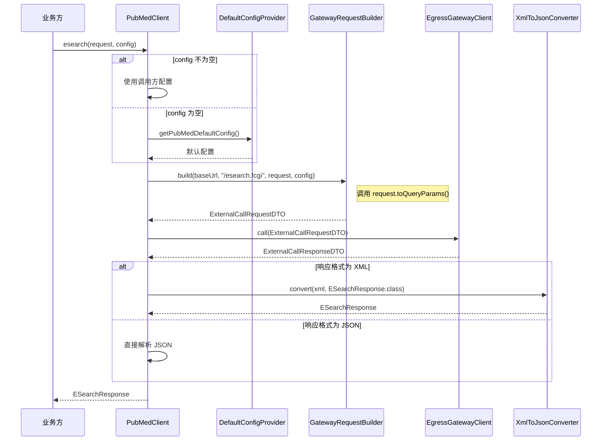
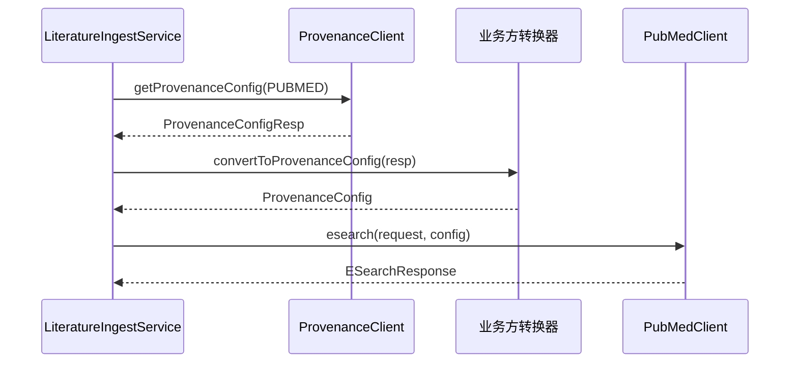
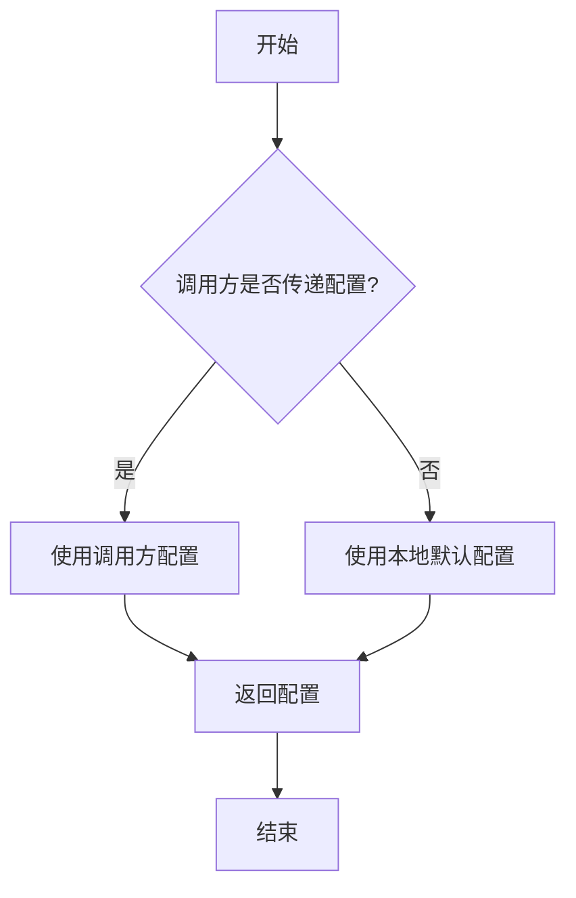
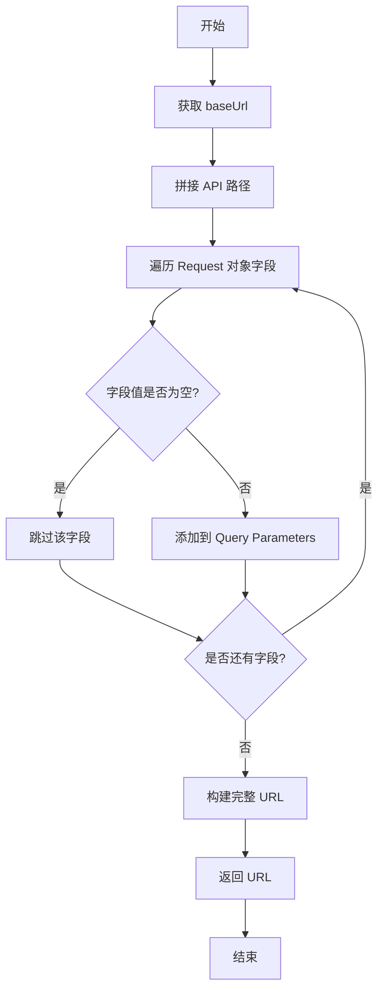

# patra-spring-boot-starter-provenance 设计文档

## 概述

patra-spring-boot-starter-provenance 是一个 Spring Boot Starter，为业务方提供类型安全、易于使用的文献数据源客户端接口。它封装了 PubMed、EPMC 等数据源的 API 参数和响应模型，通过南向网关（patra-egress-gateway）统一调用外部服务。

**包名**：`com.patra.starter.provenance`

### 核心职责

1. **API 封装**：为每个数据源提供独立的客户端接口（PubMedClient、EPMCClient）
2. **参数模型**：定义强类型的 Request 对象，覆盖所有 API 参数（必需和可选）
3. **响应模型**：定义强类型的 Response 对象，保留数据源响应的所有字段
4. **网关调用**：内部通过 EgressGatewayClient 调用南向网关
5. **配置管理**：支持两级配置优先级（调用时传递 > 本地配置）
6. **自动配置**：提供 Spring Boot 自动配置，业务方只需添加依赖即可使用

### 配置转换职责边界

- **Starter 不负责**：从 patra-registry 获取配置、ProvenanceConfigResp → ProvenanceConfig 转换
- **业务方负责**：通过 patra-registry-api 获取配置、自行实现配置转换逻辑
- **Starter 提供**：本地默认配置的兜底、接收业务方传递的 ProvenanceConfig

### 非职责

- 不进行参数转换（Expr → 数据源参数由业务方处理）
- 不包含业务逻辑（如文献去重、数据校验）
- 不进行过度抽象设计（不提供统一的数据源接口）
- 不自动处理分页和批量逻辑（由业务方根据配置处理）

## 架构设计

### 模块结构

遵循 Spring Boot Starter 的标准结构，按数据源分包设计：

```
patra-spring-boot-starter-provenance/
├── src/main/java/com/patra/starter/provenance/
│   ├── pubmed/                        # PubMed 数据源
│   │   ├── PubMedClient.java                 # 客户端接口
│   │   ├── PubMedClientImpl.java             # 客户端实现
│   │   └── model/
│   │       ├── request/
│   │       │   ├── ESearchRequest.java
│   │       │   └── EFetchRequest.java
│   │       └── response/
│   │           ├── ESearchResponse.java
│   │           └── EFetchResponse.java
│   ├── epmc/                          # EPMC 数据源
│   │   ├── EPMCClient.java                   # 客户端接口
│   │   ├── EPMCClientImpl.java               # 客户端实现
│   │   └── model/
│   │       ├── request/
│   │       │   └── SearchRequest.java
│   │       └── response/
│   │           └── SearchResponse.java
│   ├── common/                        # 公共组件
│   │   ├── config/                           # 配置管理
│   │   │   ├── ProvenanceConfig.java         # 配置对象
│   │   │   ├── HttpConfig.java               # HTTP 配置
│   │   │   ├── PaginationConfig.java         # 分页配置
│   │   │   └── ConfigLoader.java             # 配置加载器
│   │   ├── gateway/                          # 网关调用
│   │   │   └── GatewayRequestBuilder.java
│   │   ├── converter/                        # 格式转换
│   │   │   └── XmlToJsonConverter.java
│   │   ├── metrics/                          # 性能指标
│   │   │   └── ProvenanceMetrics.java
│   │   └── exception/                        # 异常定义
│   │       └── ProvenanceClientException.java
│   └── boot/                          # 自动配置
│       ├── ProvenanceAutoConfiguration.java
│       └── ProvenanceProperties.java
├── src/main/resources/
│   └── META-INF/spring/
│       └── org.springframework.boot.autoconfigure.AutoConfiguration.imports
└── pom.xml
```

**设计说明**：
- **按数据源分包**：每个数据源（pubmed/、epmc/）包含该源的客户端和模型，职责清晰
- **公共组件独立**：配置、网关、转换、指标、异常等公共能力在 common/ 包中
- **自动配置分离**：Spring Boot 自动配置在 boot/ 包中，符合 Starter 规范


### 依赖关系

```
业务方(patra-ingest)
  ↓ 依赖
patra-spring-boot-starter-provenance
  ↓ 依赖（编译时）
patra-egress-gateway-api (EgressGatewayClient) - 可选，运行时检查
  ↓ 依赖
patra-common (ProvenanceCode 枚举)
```

**依赖边界说明**：
1. **patra-egress-gateway-api**：
   - 依赖类型：`<optional>true</optional>`（可选依赖）
   - 条件装配：`@ConditionalOnClass(EgressGatewayClient.class)`
   - 降级策略：类不存在时整个 AutoConfiguration 不装配

2. **patra-registry-api**：
   - **不直接依赖**：Starter 不依赖 patra-registry-api
   - 业务方职责：业务方自行依赖并使用 ProvenanceClient
   - 配置转换：业务方负责 ProvenanceConfigResp → ProvenanceConfig

3. **patra-common**：
   - 依赖类型：`<scope>compile</scope>`（强依赖）
   - 使用：ProvenanceCode 枚举等公共组件

### 层次职责

#### Boot 层（自动配置）
- 自动配置 PubMedClient 和 EPMCClient Bean
- 加载配置属性（ProvenanceProperties）
- 条件装配（检查 EgressGatewayClient 依赖）
- 注册性能指标（ProvenanceMetrics）

#### 数据源层（pubmed/、epmc/）
- 定义数据源客户端接口（PubMedClient、EPMCClient）
- 提供客户端实现（PubMedClientImpl、EPMCClientImpl）
- 定义数据源专属的 Request 和 Response 对象

#### Common 层（公共组件）
- **config/**：配置对象定义（ProvenanceConfig 及嵌套对象）、配置加载器（ConfigLoader）
- **gateway/**：网关请求构建（GatewayRequestBuilder）
- **converter/**：格式转换（XmlToJsonConverter）
- **metrics/**：性能指标记录（ProvenanceMetrics）
- **exception/**：异常定义（ProvenanceClientException）

## 组件与接口

### 核心组件

#### 1. PubMedClient（PubMed 客户端）

**职责**：提供 PubMed API 的调用接口

**接口定义**：
```java
public interface PubMedClient {
    /**
     * Call PubMed esearch API (search for articles, returns ID list).
     * Uses JSON format by default.
     *
     * @param request esearch request parameters
     * @return esearch response
     * @throws ProvenanceClientException if call fails
     */
    ESearchResponse esearch(ESearchRequest request);

    /**
     * Call PubMed esearch API with config override.
     *
     * @param request esearch request parameters
     * @param config config override (optional)
     * @return esearch response
     * @throws ProvenanceClientException if call fails
     */
    ESearchResponse esearch(ESearchRequest request, ProvenanceConfig config);

    /**
     * Call PubMed efetch API (fetch article details by ID).
     * Uses XML format by default for detailed article data.
     *
     * @param request efetch request parameters
     * @return efetch response
     * @throws ProvenanceClientException if call fails
     */
    EFetchResponse efetch(EFetchRequest request);

    /**
     * Call PubMed efetch API with config override.
     *
     * @param request efetch request parameters
     * @param config config override (optional)
     * @return efetch response
     * @throws ProvenanceClientException if call fails
     */
    EFetchResponse efetch(EFetchRequest request, ProvenanceConfig config);
}
```

**实现示例**（展示 JSON 优先策略与可选依赖处理）：
```java
@Slf4j
public class PubMedClientImpl implements PubMedClient {

    private final EgressGatewayClient gatewayClient;
    private final GatewayRequestBuilder requestBuilder;
    private final DefaultConfigProvider configProvider;
    private final XmlToJsonConverter xmlConverter;
    private final ProvenanceMetrics metrics;  // 可选，可能为 null
    private final ObjectMapper jsonMapper = new ObjectMapper();

    public PubMedClientImpl(
        EgressGatewayClient gatewayClient,
        GatewayRequestBuilder requestBuilder,
        DefaultConfigProvider configProvider,
        XmlToJsonConverter xmlConverter,
        ProvenanceMetrics metrics  // @Autowired(required = false)
    ) {
        this.gatewayClient = gatewayClient;
        this.requestBuilder = requestBuilder;
        this.configProvider = configProvider;
        this.xmlConverter = xmlConverter;
        this.metrics = metrics;
    }

    @Override
    public ESearchResponse esearch(ESearchRequest request, ProvenanceConfig config) {
        // 使用 metrics 记录或直接执行
        if (metrics != null) {
            return metrics.recordApiCall(ProvenanceCode.PUBMED, "esearch", () -> executeESearch(request, config));
        } else {
            return executeESearch(request, config);
        }
    }

    private ESearchResponse executeESearch(ESearchRequest request, ProvenanceConfig config) {
        // 1. Load config
        ProvenanceConfig finalConfig = config != null ? config : configProvider.getPubMedDefaultConfig();

        // 2. Build gateway request
        ExternalCallRequestDTO gatewayRequest = requestBuilder.build(
            finalConfig.baseUrl(),
            "/esearch.fcgi",
            request,
            finalConfig
        );

        // 3. Call gateway
        ExternalCallResponseDTO response = gatewayClient.call(gatewayRequest);

        // 4. Parse response (ESearch uses JSON by default, no XML conversion needed)
        try {
            return jsonMapper.readValue(response.getBody(), ESearchResponse.class);
        } catch (Exception e) {
            log.error("[PROVENANCE][CORE] Failed to parse ESearch response", e);
            throw new ProvenanceClientException("PUBMED", "esearch", "Failed to parse JSON response", e);
        }
    }

    @Override
    public EFetchResponse efetch(EFetchRequest request, ProvenanceConfig config) {
        // 使用 metrics 记录或直接执行
        if (metrics != null) {
            return metrics.recordApiCall(ProvenanceCode.PUBMED, "efetch", () -> executeEFetch(request, config));
        } else {
            return executeEFetch(request, config);
        }
    }

    private EFetchResponse executeEFetch(EFetchRequest request, ProvenanceConfig config) {
        // 1. Load config
        ProvenanceConfig finalConfig = config != null ? config : configProvider.getPubMedDefaultConfig();

        // 2. Build gateway request
        ExternalCallRequestDTO gatewayRequest = requestBuilder.build(
            finalConfig.baseUrl(),
            "/efetch.fcgi",
            request,
            finalConfig
        );

        // 3. Call gateway
        ExternalCallResponseDTO response = gatewayClient.call(gatewayRequest);

        // 4. Parse response (use XML converter only when necessary)
        try {
            if (request.requiresXmlConversion()) {
                log.debug("[PROVENANCE][CORE] Using XML to JSON conversion for efetch");
                return xmlConverter.convert(response.getBody(), EFetchResponse.class);
            } else {
                log.debug("[PROVENANCE][CORE] Using direct JSON parsing for efetch");
                return jsonMapper.readValue(response.getBody(), EFetchResponse.class);
            }
        } catch (Exception e) {
            log.error("[PROVENANCE][CORE] Failed to parse EFetch response", e);
            throw new ProvenanceClientException("PUBMED", "efetch", "Failed to parse response", e);
        }
    }
}
```

**可选依赖处理说明**：
1. `ProvenanceMetrics` 可能为 `null`（Micrometer 未引入）
2. 执行前检查 `metrics != null`，存在则记录指标，否则直接执行
3. 提取核心逻辑到私有方法 `executeESearch()` / `executeEFetch()`
4. 优雅降级，不影响核心功能


#### 2. EPMCClient（EPMC 客户端）

**职责**：提供 EPMC API 的调用接口

**接口定义**：
```java
public interface EPMCClient {
    /**
     * 调用 EPMC search API（搜索文献）
     *
     * @param request search 请求参数
     * @return search 响应
     * @throws ProvenanceClientException 调用失败时抛出
     */
    SearchResponse search(SearchRequest request);

    /**
     * 调用 EPMC search API（带配置覆盖）
     *
     * @param request search 请求参数
     * @param config 配置覆盖（可选）
     * @return search 响应
     * @throws ProvenanceClientException 调用失败时抛出
     */
    SearchResponse search(SearchRequest request, ProvenanceConfig config);
}
```

#### 3. GatewayRequestBuilder（网关请求构建器）

**职责**：根据 Request 对象和配置构建网关请求

**核心方法**：
```java
public class GatewayRequestBuilder {
    /**
     * Build gateway request from API request and config.
     *
     * @param baseUrl data source base URL
     * @param path API path
     * @param request request parameters (must implement ApiRequest interface)
     * @param config provenance config
     * @return gateway request DTO
     */
    public ExternalCallRequestDTO build(
        String baseUrl,
        String path,
        ApiRequest request,  // 使用接口，不使用反射
        ProvenanceConfig config
    ) {
        // 1. Build complete URL (baseUrl + path + query parameters from request.toQueryParams())
        Map<String, String> queryParams = request.toQueryParams();
        String queryString = buildQueryString(queryParams);
        String fullUrl = baseUrl + path + "?" + queryString;

        // 2. Build HTTP Headers (User-Agent, API-Key, etc. from config)
        Map<String, String> headers = new HashMap<>(config.http().defaultHeaders());

        // 3. Build HTTP Body (if needed, usually null for GET requests)

        // 4. Build resilience config (convert from ProvenanceConfig)
        ResilienceConfigDTO resilienceConfig = convertToResilienceConfig(config);

        // 5. Return ExternalCallRequestDTO
        return new ExternalCallRequestDTO(fullUrl, "GET", headers, null, resilienceConfig);
    }

    private String buildQueryString(Map<String, String> params) {
        return params.entrySet().stream()
            .map(e -> e.getKey() + "=" + URLEncoder.encode(e.getValue(), StandardCharsets.UTF_8))
            .collect(Collectors.joining("&"));
    }
}
```

**ApiRequest 接口**：
```java
/**
 * API request parameter interface.
 * All request objects must implement this interface to convert to query parameters.
 *
 * @author linqibin
 * @since 0.1.0
 */
public interface ApiRequest {
    /**
     * Convert request to query parameters map.
     * Only non-null values will be included.
     *
     * @return query parameters map
     */
    Map<String, String> toQueryParams();
}
```

#### 4. DefaultConfigProvider（默认配置提供者）

**职责**：从本地配置（ProvenanceProperties）构建默认配置

**说明**：
- **不负责**从数据库加载配置（由业务方通过 patra-registry-api 获取）
- **不负责**配置转换（ProvenanceConfigResp → ProvenanceConfig 由业务方实现）
- **只负责**提供本地默认配置的兜底逻辑

**核心方法**：
```java
public class DefaultConfigProvider {

    private final ProvenanceProperties properties;

    /**
     * Get default config for PubMed
     *
     * @return default ProvenanceConfig
     */
    public ProvenanceConfig getPubMedDefaultConfig() {
        PubMedProperties pubmed = properties.getPubmed();
        return new ProvenanceConfig(
            pubmed.getBaseUrl(),
            pubmed.getHttp(),
            pubmed.getPagination(),
            // ...
        );
    }

    /**
     * Get default config for EPMC
     *
     * @return default ProvenanceConfig
     */
    public ProvenanceConfig getEPMCDefaultConfig() {
        EPMCProperties epmc = properties.getEpmc();
        return new ProvenanceConfig(
            epmc.getBaseUrl(),
            epmc.getHttp(),
            epmc.getPagination(),
            // ...
        );
    }
}
```

#### 5. XmlToJsonConverter（XML 转 JSON 转换器）

**职责**：将 XML 响应转换为 JSON 对象（仅在必要时使用）

**使用场景**（降低使用频率）：
- ✅ **PubMed EFetch 获取详情**：rettype=abstract/medline/full 时，必须使用 XML
- ❌ **PubMed ESearch**：默认使用 JSON，不需要 XML 转换
- ❌ **EPMC API**：原生支持 JSON，不需要 XML 转换

**核心方法**：
```java
@Slf4j
public class XmlToJsonConverter {

    private final XmlMapper xmlMapper;
    private final ObjectMapper jsonMapper;

    public XmlToJsonConverter() {
        // 配置 XmlMapper 以支持复杂 XML 结构
        this.xmlMapper = XmlMapper.builder()
            .defaultUseWrapper(false)  // 不自动包装根元素
            .build();
        xmlMapper.configure(DeserializationFeature.FAIL_ON_UNKNOWN_PROPERTIES, false);
        xmlMapper.configure(DeserializationFeature.ACCEPT_SINGLE_VALUE_AS_ARRAY, true);

        this.jsonMapper = new ObjectMapper();
    }

    /**
     * Convert XML string to JSON object.
     * Only used when API does not support JSON format natively.
     *
     * @param xml XML string
     * @param responseClass response type
     * @return response object
     * @throws ProvenanceClientException if conversion fails
     */
    public <T> T convert(String xml, Class<T> responseClass) {
        try {
            // 1. Parse XML to JsonNode
            JsonNode jsonNode = xmlMapper.readTree(xml);

            // 2. Convert to target type
            return jsonMapper.treeToValue(jsonNode, responseClass);
        } catch (Exception e) {
            log.error("[PROVENANCE][INTERNAL] Failed to convert XML to JSON: xml={}",
                xml.substring(0, Math.min(500, xml.length())), e);
            throw new ProvenanceClientException(
                "UNKNOWN", "convert", "Failed to convert XML to JSON", e
            );
        }
    }
}
```


## 数据模型

### Request 对象

#### ESearchRequest（PubMed esearch 请求）

基于 [PubMed E-utilities API 文档](https://www.ncbi.nlm.nih.gov/books/NBK25499/#chapter4.ESearch)

**重要说明**：
- **默认格式**：retmode 默认为 `json`（PubMed ESearch 完全支持 JSON）
- **无需 XML 转换**：ESearch 直接返回 JSON 格式，不走 XmlToJsonConverter

```java
/**
 * PubMed esearch API 请求参数
 *
 * @author linqibin
 * @since 0.1.0
 */
public record ESearchRequest(
    // 必需参数
    String db,              // 数据库名称（如 "pubmed"）
    String term,            // 搜索词

    // 可选参数 - 基础控制
    Integer retstart,       // 起始位置（默认 0）
    Integer retmax,         // 返回数量（默认 20，最大 10000）
    String retmode,         // 返回模式（json/xml，默认 json）
    String rettype,         // 返回类型（uilist/count）

    // 可选参数 - 排序与过滤
    String sort,            // 排序方式（relevance/pub_date/Author/JournalName）
    String datetype,        // 日期类型（pdat/edat/mdat）
    String mindate,         // 最小日期（YYYY/MM/DD 或 YYYY）
    String maxdate,         // 最大日期（YYYY/MM/DD 或 YYYY）
    String field,           // 搜索字段（限制搜索范围）
    String reldate,         // 相对日期（天数）

    // 可选参数 - 历史与会话
    String usehistory,      // 是否使用历史（y/n）
    String webenv,          // Web 环境字符串
    String queryKey,        // 查询键（query_key）

    // 可选参数 - 认证与标识（重要）
    String apiKey,          // API Key（提高速率限制：3 次/秒 → 10 次/秒）
    String tool,            // 工具名称（标识应用程序，如 "papertrace"）
    String email            // 联系邮箱（NCBI 可联系开发者）
) implements ApiRequest {

    /**
     * 默认构造器：使用 JSON 格式
     */
    public ESearchRequest(String db, String term) {
        this(db, term, null, null, "json", null, null, null, null, null, null, null, null, null, null, null, null, null);
    }

    // 紧凑构造器：校验必需参数
    public ESearchRequest {
        if (db == null || db.isBlank()) {
            throw new IllegalArgumentException("db cannot be null or blank");
        }
        if (term == null || term.isBlank()) {
            throw new IllegalArgumentException("term cannot be null or blank");
        }
        // 默认使用 JSON 格式
        if (retmode == null || retmode.isBlank()) {
            retmode = "json";
        }
    }

    @Override
    public Map<String, String> toQueryParams() {
        Map<String, String> params = new LinkedHashMap<>();
        params.put("db", db);
        params.put("term", term);

        // 基础控制
        if (retstart != null) params.put("retstart", retstart.toString());
        if (retmax != null) params.put("retmax", retmax.toString());
        params.put("retmode", retmode != null ? retmode : "json");
        if (rettype != null) params.put("rettype", rettype);

        // 排序与过滤
        if (sort != null) params.put("sort", sort);
        if (datetype != null) params.put("datetype", datetype);
        if (mindate != null) params.put("mindate", mindate);
        if (maxdate != null) params.put("maxdate", maxdate);
        if (field != null) params.put("field", field);
        if (reldate != null) params.put("reldate", reldate);

        // 历史与会话
        if (usehistory != null) params.put("usehistory", usehistory);
        if (webenv != null) params.put("WebEnv", webenv);
        if (queryKey != null) params.put("query_key", queryKey);

        // 认证与标识
        if (apiKey != null) params.put("api_key", apiKey);
        if (tool != null) params.put("tool", tool);
        if (email != null) params.put("email", email);

        return params;
    }
}
```

#### EFetchRequest（PubMed efetch 请求）

基于 [PubMed E-utilities API 文档](https://www.ncbi.nlm.nih.gov/books/NBK25499/#chapter4.EFetch)

**重要说明**：
- **格式支持情况**：
  - `rettype=abstract/medline/full`：仅支持 XML 格式，需要 XmlToJsonConverter
  - `rettype=uilist`：支持 JSON 格式，可直接使用
- **推荐策略**：
  - 获取文献详情 → 使用 XML 格式（retmode=xml, rettype=abstract）
  - 获取 ID 列表 → 使用 JSON 格式（retmode=json, rettype=uilist）

```java
/**
 * PubMed efetch API 请求参数
 *
 * @author linqibin
 * @since 0.1.0
 */
public record EFetchRequest(
    // 必需参数
    String db,              // 数据库名称（如 "pubmed"）
    String id,              // 文献 ID 列表（逗号分隔，最多 200 个）

    // 可选参数 - 基础控制
    String retmode,         // 返回模式（xml/json/text，默认 xml）
    String rettype,         // 返回类型（abstract/medline/full/uilist，默认 abstract）
    Integer retstart,       // 起始位置（仅用于历史查询）
    Integer retmax,         // 返回数量（默认 20，最大 10000）

    // 可选参数 - 历史与会话
    String webenv,          // Web 环境字符串（WebEnv）
    String queryKey,        // 查询键（query_key）

    // 可选参数 - 认证与标识（重要）
    String apiKey,          // API Key（提高速率限制：3 次/秒 → 10 次/秒）
    String tool,            // 工具名称（标识应用程序，如 "papertrace"）
    String email            // 联系邮箱（NCBI 可联系开发者）
) implements ApiRequest {

    /**
     * 默认构造器：使用 XML 格式获取摘要
     */
    public EFetchRequest(String db, String id) {
        this(db, id, "xml", "abstract", null, null, null, null, null, null, null);
    }

    /**
     * JSON 格式构造器：获取 ID 列表
     */
    public static EFetchRequest forUiList(String db, String id) {
        return new EFetchRequest(db, id, "json", "uilist", null, null, null, null, null, null, null);
    }

    // 紧凑构造器：校验必需参数
    public EFetchRequest {
        if (db == null || db.isBlank()) {
            throw new IllegalArgumentException("db cannot be null or blank");
        }
        if (id == null || id.isBlank()) {
            throw new IllegalArgumentException("id cannot be null or blank");
        }
        // 默认使用 XML 格式（因为大部分 rettype 只支持 XML）
        if (retmode == null || retmode.isBlank()) {
            retmode = "xml";
        }
        if (rettype == null || rettype.isBlank()) {
            rettype = "abstract";
        }
    }

    @Override
    public Map<String, String> toQueryParams() {
        Map<String, String> params = new LinkedHashMap<>();
        params.put("db", db);
        params.put("id", id);

        // 基础控制
        params.put("retmode", retmode != null ? retmode : "xml");
        params.put("rettype", rettype != null ? rettype : "abstract");
        if (retstart != null) params.put("retstart", retstart.toString());
        if (retmax != null) params.put("retmax", retmax.toString());

        // 历史与会话
        if (webenv != null) params.put("WebEnv", webenv);
        if (queryKey != null) params.put("query_key", queryKey);

        // 认证与标识
        if (apiKey != null) params.put("api_key", apiKey);
        if (tool != null) params.put("tool", tool);
        if (email != null) params.put("email", email);

        return params;
    }

    /**
     * Check if this request requires XML to JSON conversion
     *
     * @return true if XML conversion is needed
     */
    public boolean requiresXmlConversion() {
        return "xml".equals(retmode) && !"uilist".equals(rettype);
    }
}
```


#### SearchRequest（EPMC search 请求）

基于 [EPMC API 文档](https://europepmc.org/RestfulWebService)

```java
/**
 * EPMC search API 请求参数
 *
 * @author linqibin
 * @since 0.1.0
 */
public record SearchRequest(
    // 必需参数
    String query,           // 搜索查询

    // 可选参数
    String format,          // 返回格式（json/xml，默认 json）
    Integer pageSize,       // 每页数量（默认 25）
    Integer cursorMark,     // 游标标记（用于分页）
    String sort,            // 排序方式（RELEVANCE/DATE/...）
    String resultType,      // 结果类型（core/lite/idlist）
    String synonym,         // 是否使用同义词（true/false）
    String fromSearchPost,  // 从搜索历史加载（true/false）
    String searchType       // 搜索类型（SIMPLE/ADVANCED）
) {
    // 紧凑构造器：校验必需参数
    public SearchRequest {
        if (query == null || query.isBlank()) {
            throw new IllegalArgumentException("query cannot be null or blank");
        }
    }
}
```

### Response 对象

#### ESearchResponse（PubMed esearch 响应）

```java
/**
 * PubMed esearch API 响应
 *
 * @author linqibin
 * @since 0.1.0
 */
public record ESearchResponse(
    Integer count,          // 总结果数
    Integer retmax,         // 返回数量
    Integer retstart,       // 起始位置
    List<String> idList,    // 文献 ID 列表
    String webenv,          // Web 环境字符串
    String queryKey,        // 查询键
    List<String> translationSet,  // 翻译集合
    String queryTranslation,      // 查询翻译
    List<String> errorList        // 错误列表
) {}
```

#### EFetchResponse（PubMed efetch 响应）

```java
/**
 * PubMed efetch API 响应
 *
 * @author linqibin
 * @since 0.1.0
 */
public record EFetchResponse(
    List<PubmedArticle> articles  // 文献列表
) {}

/**
 * PubMed 文献对象
 */
public record PubmedArticle(
    String pmid,                  // PubMed ID
    MedlineCitation medlineCitation,  // Medline 引用
    PubmedData pubmedData         // PubMed 数据
) {}

/**
 * Medline 引用对象
 */
public record MedlineCitation(
    String pmid,
    String dateCreated,
    String dateCompleted,
    String dateRevised,
    Article article,
    MedlineJournalInfo medlineJournalInfo,
    List<String> meshHeadingList
) {}

/**
 * 文章对象
 */
public record Article(
    Journal journal,
    String articleTitle,
    Pagination pagination,
    String abstractText,
    List<Author> authorList,
    String language,
    List<String> publicationTypeList
) {}

// ... 其他嵌套对象
```


#### SearchResponse（EPMC search 响应）

```java
/**
 * EPMC search API 响应
 *
 * @author linqibin
 * @since 0.1.0
 */
public record SearchResponse(
    Integer hitCount,       // 总结果数
    String nextCursorMark,  // 下一页游标
    List<Result> resultList // 结果列表
) {}

/**
 * EPMC 搜索结果对象
 */
public record Result(
    String id,              // 文献 ID
    String source,          // 来源（MED/PMC/...）
    String pmid,            // PubMed ID
    String pmcid,           // PMC ID
    String doi,             // DOI
    String title,           // 标题
    String authorString,    // 作者字符串
    String journalTitle,    // 期刊标题
    String pubYear,         // 发表年份
    String pubType,         // 发表类型
    String abstractText,    // 摘要
    String affiliation,     // 机构
    String language,        // 语言
    List<Author> authorList,// 作者列表
    List<String> meshHeadingList,  // MeSH 主题词列表
    String fullTextUrlList  // 全文 URL 列表
) {}

/**
 * 作者对象
 */
public record Author(
    String fullName,        // 全名
    String firstName,       // 名
    String lastName,        // 姓
    String initials,        // 首字母
    String affiliation      // 机构
) {}
```

### 配置对象

#### ProvenanceConfig（数据源配置）

**设计说明**：
- ProvenanceConfig 是 Starter 内部独立设计的配置对象，**不直接依赖** `patra-registry-api` 中的 `ProvenanceConfigResp`
- **参考 ProvenanceConfigResp 结构**：字段设计借鉴 ProvenanceConfigResp，但进行了简化和适配
- **解耦目的**：避免 Starter 与 Registry API 的强耦合，提高灵活性和可维护性
- **转换逻辑**：ConfigLoader 负责从 ProvenanceConfigResp 转换为 ProvenanceConfig

**配置对象定义**：

```java
/**
 * 数据源配置对象
 *
 * @author linqibin
 * @since 0.1.0
 */
public record ProvenanceConfig(
    String baseUrl,                 // 数据源基础 URL
    HttpConfig http,                // HTTP 配置
    PaginationConfig pagination,    // 分页配置
    WindowOffsetConfig windowOffset,// 窗口配置
    BatchingConfig batching,        // 批处理配置
    RetryConfig retry,              // 重试配置
    RateLimitConfig rateLimit       // 限流配置
) {}

/**
 * HTTP 配置
 */
public record HttpConfig(
    Map<String, String> defaultHeaders,  // 默认请求头
    Integer timeoutConnectMillis,        // 连接超时（毫秒）
    Integer timeoutReadMillis,           // 读取超时（毫秒）
    Integer timeoutTotalMillis           // 总超时（毫秒）
) {}

/**
 * 分页配置
 */
public record PaginationConfig(
    Integer pageSizeValue,          // 每页数量
    Integer maxPagesPerExecution    // 每次执行最大页数
) {}

/**
 * 批处理配置
 */
public record BatchingConfig(
    Integer detailFetchBatchSize,   // 批量获取大小
    Integer maxIdsPerRequest        // 每次请求最大 ID 数
) {}

/**
 * 重试配置
 */
public record RetryConfig(
    Integer maxRetryTimes,          // 最大重试次数
    Integer initialDelayMillis      // 初始延迟（毫秒）
) {}

/**
 * 窗口配置
 */
public record WindowOffsetConfig(
    String windowModeCode,          // 窗口模式（FIXED/SLIDING/NONE）
    Integer windowSizeValue,        // 窗口大小数值
    String windowSizeUnitCode,      // 窗口大小单位
    Integer lookbackValue,          // 回溯值
    String lookbackUnitCode,        // 回溯单位
    Integer overlapValue,           // 重叠值
    String overlapUnitCode,         // 重叠单位
    String offsetTypeCode,          // 偏移类型
    Integer maxIdsPerWindow         // 每窗口最大 ID 数
) {}

/**
 * 限流配置
 */
public record RateLimitConfig(
    Integer maxConcurrentRequests,  // 最大并发请求数
    Integer perCredentialQpsLimit   // 每凭证 QPS 限制
) {}
```


## 异常处理

### 异常层次

```java
/**
 * Provenance Client 异常基类
 *
 * @author linqibin
 * @since 0.1.0
 */
public class ProvenanceClientException extends RuntimeException {
    private final String provenanceCode;
    private final String apiName;

    public ProvenanceClientException(String provenanceCode, String apiName, String message) {
        super(String.format("[%s][%s] %s", provenanceCode, apiName, message));
        this.provenanceCode = provenanceCode;
        this.apiName = apiName;
    }

    public ProvenanceClientException(String provenanceCode, String apiName, String message, Throwable cause) {
        super(String.format("[%s][%s] %s", provenanceCode, apiName, message), cause);
        this.provenanceCode = provenanceCode;
        this.apiName = apiName;
    }

    public String getProvenanceCode() {
        return provenanceCode;
    }

    public String getApiName() {
        return apiName;
    }
}
```

### 异常场景

1. **网关调用失败**：网关返回非 2xx 状态码
2. **响应解析失败**：XML/JSON 解析失败
3. **配置加载失败**：无法加载配置
4. **参数校验失败**：必需参数缺失或无效

### 降级策略（Noop 实现）

当 EgressGatewayClient 不可用时（如网关服务宕机），提供 Noop 降级实现：

```java
/**
 * No-op implementation of PubMedClient when EgressGatewayClient is not available.
 * Returns empty responses to prevent service failure.
 *
 * @author linqibin
 * @since 0.1.0
 */
@Slf4j
public class PubMedClientNoOpImpl implements PubMedClient {

    @Override
    public ESearchResponse esearch(ESearchRequest request) {
        return esearch(request, null);
    }

    @Override
    public ESearchResponse esearch(ESearchRequest request, ProvenanceConfig config) {
        log.warn("[PROVENANCE][CORE] EgressGatewayClient not available, returning empty esearch response");
        return new ESearchResponse(0, 0, 0, List.of(), null, null, null, null, null);
    }

    @Override
    public EFetchResponse efetch(EFetchRequest request) {
        return efetch(request, null);
    }

    @Override
    public EFetchResponse efetch(EFetchRequest request, ProvenanceConfig config) {
        log.warn("[PROVENANCE][CORE] EgressGatewayClient not available, returning empty efetch response");
        return new EFetchResponse(List.of());
    }
}

/**
 * No-op implementation of EPMCClient when EgressGatewayClient is not available.
 *
 * @author linqibin
 * @since 0.1.0
 */
@Slf4j
public class EPMCClientNoOpImpl implements EPMCClient {

    @Override
    public SearchResponse search(SearchRequest request) {
        return search(request, null);
    }

    @Override
    public SearchResponse search(SearchRequest request, ProvenanceConfig config) {
        log.warn("[PROVENANCE][CORE] EgressGatewayClient not available, returning empty search response");
        return new SearchResponse(0, null, List.of());
    }
}
```

**降级触发条件**：
- EgressGatewayClient Bean 不可用（运行时 `@Autowired(required = false)` 注入为 null）
- 自动配置会注册 Noop 实现，避免启动失败

**条件装配完整逻辑**：
1. **编译时检查**：`@ConditionalOnClass(EgressGatewayClient.class)` 检查类存在
   - 类不存在 → 整个 AutoConfiguration 不装配
   - 类存在 → 继续运行时检查

2. **运行时检查**：`@Autowired(required = false)` 可选注入
   - Bean 存在 → 使用正常实现（PubMedClientImpl）
   - Bean 不存在 → 使用 Noop 实现（PubMedClientNoOpImpl）

3. **多级降级保护**：
   ```
   编译时 → 运行时 → 执行时
   (类检查) → (Bean检查) → (指标可选)
      ↓          ↓           ↓
   不装配    Noop实现    无指标记录
   ```

## 自动配置

### ProvenanceAutoConfiguration

```java
/**
 * Provenance Starter 自动配置类
 *
 * 条件装配说明：
 * 1. @ConditionalOnClass(EgressGatewayClient.class) - 检查网关 API 类是否存在
 * 2. @ConditionalOnProperty - 支持通过配置开关（默认启用）
 * 3. 客户端 Bean 使用 @Autowired(required = false) 处理网关缺失场景
 *
 * @author linqibin
 * @since 0.1.0
 */
@Slf4j
@AutoConfiguration
@EnableConfigurationProperties(ProvenanceProperties.class)
@ConditionalOnClass(EgressGatewayClient.class)  // 新增：检查网关 API 类存在
@ConditionalOnProperty(prefix = "patra.provenance", name = "enabled", havingValue = "true", matchIfMissing = true)
public class ProvenanceAutoConfiguration {

    @Bean
    @ConditionalOnMissingBean
    public GatewayRequestBuilder gatewayRequestBuilder() {
        return new GatewayRequestBuilder();
    }

    @Bean
    @ConditionalOnMissingBean
    public DefaultConfigProvider defaultConfigProvider(ProvenanceProperties properties) {
        return new DefaultConfigProvider(properties);
    }

    @Bean
    @ConditionalOnMissingBean
    public XmlToJsonConverter xmlToJsonConverter() {
        return new XmlToJsonConverter();
    }

    @Bean
    @ConditionalOnMissingBean
    @ConditionalOnBean(MeterRegistry.class)  // 新增：仅在 Micrometer 可用时注册
    public ProvenanceMetrics provenanceMetrics(MeterRegistry meterRegistry) {
        return new ProvenanceMetrics(meterRegistry);
    }

    @Bean
    @ConditionalOnMissingBean
    public PubMedClient pubMedClient(
        @Autowired(required = false) EgressGatewayClient gatewayClient,
        GatewayRequestBuilder requestBuilder,
        DefaultConfigProvider configProvider,
        XmlToJsonConverter xmlConverter,
        @Autowired(required = false) ProvenanceMetrics metrics
    ) {
        // 网关不可用时返回 Noop 实现
        if (gatewayClient == null) {
            log.warn("[PROVENANCE][BOOT] EgressGatewayClient not available, using no-op PubMedClient");
            return new PubMedClientNoOpImpl();
        }
        return new PubMedClientImpl(gatewayClient, requestBuilder, configProvider, xmlConverter, metrics);
    }

    @Bean
    @ConditionalOnMissingBean
    public EPMCClient epmcClient(
        @Autowired(required = false) EgressGatewayClient gatewayClient,
        GatewayRequestBuilder requestBuilder,
        DefaultConfigProvider configProvider,
        @Autowired(required = false) ProvenanceMetrics metrics
    ) {
        // 网关不可用时返回 Noop 实现
        if (gatewayClient == null) {
            log.warn("[PROVENANCE][BOOT] EgressGatewayClient not available, using no-op EPMCClient");
            return new EPMCClientNoOpImpl();
        }
        return new EPMCClientImpl(gatewayClient, requestBuilder, configProvider, metrics);
    }
}
```

**条件装配逻辑说明**：

1. **@ConditionalOnClass(EgressGatewayClient.class)**
   - 仅在网关 API 类存在时才装配整个配置
   - 避免 ClassNotFoundException
   - 依赖边界清晰

2. **@Autowired(required = false)**
   - 网关 Bean 可选注入（运行时可能不可用）
   - Metrics Bean 可选注入（Micrometer 可能未引入）
   - 优雅降级，不影响启动

3. **@ConditionalOnBean(MeterRegistry.class)**
   - ProvenanceMetrics 仅在 Micrometer 可用时注册
   - 避免不必要的 Bean 创建

4. **Noop 降级策略**
   - 网关 Bean 为 null 时返回 Noop 实现
   - 记录警告日志，便于排查
   - 系统可正常启动，但 API 调用返回空响应


### ProvenanceProperties

```java
/**
 * Provenance Starter 配置属性
 *
 * @author linqibin
 * @since 0.1.0
 */
@ConfigurationProperties(prefix = "patra.provenance")
public class ProvenanceProperties {
    /**
     * 是否启用 Provenance Client（默认 true）
     */
    private boolean enabled = true;

    /**
     * PubMed 配置
     */
    private PubMedProperties pubmed = new PubMedProperties();

    /**
     * EPMC 配置
     */
    private EPMCProperties epmc = new EPMCProperties();

    // Getters and Setters

    public static class PubMedProperties {
        /**
         * PubMed 基础 URL（默认 https://eutils.ncbi.nlm.nih.gov/entrez/eutils）
         */
        private String baseUrl = "https://eutils.ncbi.nlm.nih.gov/entrez/eutils";

        /**
         * HTTP 配置
         */
        private HttpConfigProperties http = new HttpConfigProperties();

        // Getters and Setters
    }

    public static class EPMCProperties {
        /**
         * EPMC 基础 URL（默认 https://www.ebi.ac.uk/europepmc/webservices/rest）
         */
        private String baseUrl = "https://www.ebi.ac.uk/europepmc/webservices/rest";

        /**
         * HTTP 配置
         */
        private HttpConfigProperties http = new HttpConfigProperties();

        // Getters and Setters
    }

    public static class HttpConfigProperties {
        /**
         * 默认请求头
         */
        private Map<String, String> defaultHeaders = new HashMap<>();

        /**
         * 连接超时（毫秒，默认 5000）
         */
        private Integer timeoutConnectMillis = 5000;

        /**
         * 读取超时（毫秒，默认 30000）
         */
        private Integer timeoutReadMillis = 30000;

        /**
         * 总超时（毫秒，默认 60000）
         */
        private Integer timeoutTotalMillis = 60000;

        // Getters and Setters
    }
}
```

### 配置示例

```yaml
patra:
  provenance:
    enabled: true
    pubmed:
      base-url: https://eutils.ncbi.nlm.nih.gov/entrez/eutils
      http:
        default-headers:
          User-Agent: Papertrace/0.1.0
        timeout-connect-millis: 5000
        timeout-read-millis: 30000
        timeout-total-millis: 60000
    epmc:
      base-url: https://www.ebi.ac.uk/europepmc/webservices/rest
      http:
        default-headers:
          User-Agent: Papertrace/0.1.0
        timeout-connect-millis: 5000
        timeout-read-millis: 30000
        timeout-total-millis: 60000
```


## 关键流程

### 客户端调用流程



**业务方配置获取流程**（在 patra-ingest 中）：


### 配置加载流程



**说明**：
- **调用方传递配置**：业务方从 patra-registry 获取 ProvenanceConfigResp，自行转换为 ProvenanceConfig 后传递
- **本地默认配置**：从 ProvenanceProperties 构建的默认配置（兜底）
- **不涉及**：Starter 内部不从数据库加载配置

### URL 构建流程




## 可观测性

### 日志规范

#### 日志前缀

所有日志使用 `[PROVENANCE][LAYER]` 前缀：

- `[PROVENANCE][CORE]`：客户端层日志
- `[PROVENANCE][INTERNAL]`：内部实现层日志
- `[PROVENANCE][BOOT]`：自动配置层日志

#### 日志内容

**API 调用开始日志**：
```java
log.info("[PROVENANCE][CORE] API call started: provenance={} api={} traceId={}", 
    "PUBMED", "esearch", traceId);
log.debug("[PROVENANCE][CORE] Request parameters: {}", request);
```

**API 调用结束日志**：
```java
log.info("[PROVENANCE][CORE] API call completed: provenance={} api={} duration={}ms traceId={}", 
    "PUBMED", "esearch", duration.toMillis(), traceId);
log.debug("[PROVENANCE][CORE] Response: {}", response);
```

**错误日志**：
```java
log.error("[PROVENANCE][CORE] API call failed: provenance={} api={} error={} traceId={}", 
    "PUBMED", "esearch", e.getMessage(), traceId, e);
```

**配置加载日志**：
```java
log.info("[PROVENANCE][INTERNAL] Config loaded: provenance={} source={} traceId={}", 
    "PUBMED", "database", traceId);
log.debug("[PROVENANCE][INTERNAL] Config details: {}", config);
```

### TraceId 传递

依赖 SkyWalking Agent 自动注入 traceId，无需手动传递。在日志中通过 MDC 获取：

```java
String traceId = MDC.get("traceId");
```

### 性能指标

#### 指标设计

使用 Micrometer 记录 API 调用的性能指标，支持导出到 Prometheus、Grafana 等监控系统。

**指标命名规范**：
- 指标前缀：`provenance.client`
- 指标维度：
  - `provenanceCode`：数据源代码（PUBMED、EPMC）
  - `apiName`：API 名称（esearch、efetch、search）
  - `status`：调用状态（success、failure）

**核心指标**：

1. **API 调用耗时**（Timer）
   - 名称：`provenance.client.api.duration`
   - 描述：记录 API 调用的耗时分布
   - 维度：provenanceCode, apiName
   - 单位：毫秒

2. **API 调用成功次数**（Counter）
   - 名称：`provenance.client.api.success`
   - 描述：记录 API 调用成功的次数
   - 维度：provenanceCode, apiName

3. **API 调用失败次数**（Counter）
   - 名称：`provenance.client.api.failure`
   - 描述：记录 API 调用失败的次数
   - 维度：provenanceCode, apiName, errorType

#### ProvenanceMetrics 实现

```java
/**
 * Provenance 性能指标记录器
 *
 * @author linqibin
 * @since 0.1.0
 */
@Slf4j
public class ProvenanceMetrics {

    private final MeterRegistry meterRegistry;

    public ProvenanceMetrics(MeterRegistry meterRegistry) {
        this.meterRegistry = meterRegistry;
    }

    /**
     * 记录 API 调用
     *
     * @param provenanceCode 数据源代码
     * @param apiName API 名称
     * @param supplier API 调用逻辑
     * @return API 调用结果
     */
    public <T> T recordApiCall(String provenanceCode, String apiName, Supplier<T> supplier) {
        Timer.Sample sample = Timer.start(meterRegistry);

        try {
            T result = supplier.get();

            // 记录成功
            sample.stop(Timer.builder("provenance.client.api.duration")
                .tag("provenanceCode", provenanceCode)
                .tag("apiName", apiName)
                .tag("status", "success")
                .register(meterRegistry));

            Counter.builder("provenance.client.api.success")
                .tag("provenanceCode", provenanceCode)
                .tag("apiName", apiName)
                .register(meterRegistry)
                .increment();

            return result;
        } catch (Exception e) {
            // 记录失败
            sample.stop(Timer.builder("provenance.client.api.duration")
                .tag("provenanceCode", provenanceCode)
                .tag("apiName", apiName)
                .tag("status", "failure")
                .register(meterRegistry));

            Counter.builder("provenance.client.api.failure")
                .tag("provenanceCode", provenanceCode)
                .tag("apiName", apiName)
                .tag("errorType", e.getClass().getSimpleName())
                .register(meterRegistry)
                .increment();

            throw e;
        }
    }
}
```

#### 使用示例

在客户端实现中集成指标记录：

```java
@Slf4j
public class PubMedClientImpl implements PubMedClient {

    private final ProvenanceMetrics metrics;

    @Override
    public ESearchResponse esearch(ESearchRequest request, ProvenanceConfig config) {
        return metrics.recordApiCall("PUBMED", "esearch", () -> {
            // 实际 API 调用逻辑
            // ...
            return response;
        });
    }
}
```

#### 监控仪表盘示例

Prometheus 查询示例：

```promql
# API 调用成功率
rate(provenance_client_api_success_total[5m])
/
(rate(provenance_client_api_success_total[5m]) + rate(provenance_client_api_failure_total[5m]))

# API 平均耗时（按数据源）
rate(provenance_client_api_duration_sum[5m])
/
rate(provenance_client_api_duration_count[5m])

# API 调用 P99 耗时
histogram_quantile(0.99, rate(provenance_client_api_duration_bucket[5m]))
```

## 技术选型

### 核心依赖

- **Spring Boot**: 3.2.4（与项目统一）
- **Spring Cloud**: 2023.0.1（与项目统一）
- **Jackson**: JSON 序列化/反序列化
- **Jackson Dataformat XML**: XML 解析
- **Micrometer**: 性能指标记录
- **Lombok**: 代码生成
- **Hutool**: 工具类库

### XML 转 JSON 实现

使用 Jackson Dataformat XML：

```xml
<dependency>
    <groupId>com.fasterxml.jackson.dataformat</groupId>
    <artifactId>jackson-dataformat-xml</artifactId>
</dependency>
```

```java
public class XmlToJsonConverter {
    private final XmlMapper xmlMapper = new XmlMapper();
    private final ObjectMapper jsonMapper = new ObjectMapper();

    public <T> T convert(String xml, Class<T> responseClass) {
        try {
            // 1. 解析 XML 为 JsonNode
            JsonNode jsonNode = xmlMapper.readTree(xml);
            
            // 2. 转换为目标类型
            return jsonMapper.treeToValue(jsonNode, responseClass);
        } catch (Exception e) {
            throw new ProvenanceClientException(
                "UNKNOWN", "convert", "Failed to convert XML to JSON", e
            );
        }
    }
}
```


## 依赖管理

### pom.xml 依赖

```xml
<dependencies>
    <!-- ==================== 内部依赖 ==================== -->

    <!-- patra-common（强依赖） -->
    <dependency>
        <groupId>com.papertrace</groupId>
        <artifactId>patra-common</artifactId>
    </dependency>

    <!-- patra-egress-gateway-api（可选依赖） -->
    <dependency>
        <groupId>com.papertrace</groupId>
        <artifactId>patra-egress-gateway-api</artifactId>
        <optional>true</optional>  <!-- 可选：运行时检查 -->
    </dependency>

    <!-- 不依赖 patra-registry-api（由业务方自行依赖） -->

    <!-- ==================== Spring Boot ==================== -->

    <dependency>
        <groupId>org.springframework.boot</groupId>
        <artifactId>spring-boot-autoconfigure</artifactId>
    </dependency>

    <dependency>
        <groupId>org.springframework.boot</groupId>
        <artifactId>spring-boot-configuration-processor</artifactId>
        <optional>true</optional>
    </dependency>

    <!-- ==================== JSON/XML 处理 ==================== -->

    <dependency>
        <groupId>com.fasterxml.jackson.core</groupId>
        <artifactId>jackson-databind</artifactId>
    </dependency>

    <dependency>
        <groupId>com.fasterxml.jackson.dataformat</groupId>
        <artifactId>jackson-dataformat-xml</artifactId>
    </dependency>

    <!-- ==================== 工具库 ==================== -->

    <dependency>
        <groupId>cn.hutool</groupId>
        <artifactId>hutool-core</artifactId>
    </dependency>

    <dependency>
        <groupId>org.projectlombok</groupId>
        <artifactId>lombok</artifactId>
        <optional>true</optional>
    </dependency>

    <!-- ==================== 日志 ==================== -->

    <dependency>
        <groupId>org.slf4j</groupId>
        <artifactId>slf4j-api</artifactId>
    </dependency>

    <!-- ==================== 监控（可选依赖） ==================== -->

    <dependency>
        <groupId>io.micrometer</groupId>
        <artifactId>micrometer-core</artifactId>
        <optional>true</optional>  <!-- 可选：运行时检查 -->
    </dependency>
</dependencies>
```

**依赖说明**：

| 依赖 | 类型 | 说明 |
|------|------|------|
| patra-common | 强依赖 | 提供 ProvenanceCode 枚举等公共组件 |
| patra-egress-gateway-api | 可选依赖 | 通过 `@ConditionalOnClass` 检查，类不存在时不装配 |
| patra-registry-api | **不依赖** | 由业务方自行依赖，Starter 不涉及 |
| micrometer-core | 可选依赖 | 通过 `@ConditionalOnBean(MeterRegistry.class)` 检查 |
| jackson-dataformat-xml | 强依赖 | 用于 EFetch 详情查询的 XML 解析 |

## 使用示例

### 基础使用（推荐 JSON 格式）

```java
@Service
public class LiteratureService {

    @Autowired
    private PubMedClient pubMedClient;

    @Autowired
    private EPMCClient epmcClient;

    /**
     * PubMed ESearch - 使用默认 JSON 格式（推荐）
     */
    public void searchPubMed() {
        // 1. 使用简化构造器（默认 JSON 格式）
        ESearchRequest request = new ESearchRequest("pubmed", "cancer AND therapy");

        // 2. 调用 API（自动使用 JSON 格式，无需 XML 转换）
        ESearchResponse response = pubMedClient.esearch(request);

        // 3. 处理响应
        System.out.println("Total count: " + response.count());
        System.out.println("ID list: " + response.idList());
    }

    /**
     * PubMed EFetch - 获取文献详情（使用 XML 格式）
     */
    public void fetchPubMedDetails(String ids) {
        // 1. 构建请求（默认 XML 格式，因为 abstract 类型只支持 XML）
        EFetchRequest request = new EFetchRequest("pubmed", ids);

        // 2. 调用 API（自动进行 XML → JSON 转换）
        EFetchResponse response = pubMedClient.efetch(request);

        // 3. 处理响应
        System.out.println("Articles: " + response.articles().size());
    }

    /**
     * EPMC Search - 原生 JSON 格式
     */
    public void searchEPMC() {
        // 1. 构建请求
        SearchRequest request = new SearchRequest(
            "cancer AND therapy",        // query
            "json",                      // format
            25,                          // pageSize
            null, null, null, null, null, null
        );

        // 2. 调用 API（原生 JSON，无需转换）
        SearchResponse response = epmcClient.search(request);

        // 3. 处理响应
        System.out.println("Hit count: " + response.hitCount());
        System.out.println("Results: " + response.resultList());
    }
}
```


### 带配置覆盖的使用

```java
@Service
public class LiteratureService {
    
    @Autowired
    private PubMedClient pubMedClient;
    
    public void searchWithCustomConfig() {
        // 1. 构建请求
        ESearchRequest request = new ESearchRequest(
            "pubmed",
            "cancer AND therapy",
            0, 20, "xml", "relevance",
            null, null, null, null, null, null, null, null
        );
        
        // 2. 构建自定义配置
        ProvenanceConfig config = new ProvenanceConfig(
            "https://eutils.ncbi.nlm.nih.gov/entrez/eutils",
            new HttpConfig(
                Map.of("User-Agent", "MyApp/1.0"),
                5000,
                30000,
                60000
            ),
            new PaginationConfig(20, 10),
            null,  // windowOffset
            null,  // batching
            new RetryConfig(3, 1000),
            new RateLimitConfig(10, 10)
        );
        
        // 3. 调用 API（带配置覆盖）
        ESearchResponse response = pubMedClient.esearch(request, config);
        
        // 4. 处理响应
        System.out.println("Total count: " + response.count());
    }
}
```

### 分页处理示例

```java
@Service
public class LiteratureService {
    
    @Autowired
    private PubMedClient pubMedClient;
    
    public List<String> searchAllIds(String term, int pageSize) {
        List<String> allIds = new ArrayList<>();
        int retstart = 0;
        
        while (true) {
            // 1. 构建请求
            ESearchRequest request = new ESearchRequest(
                "pubmed",
                term,
                retstart,
                pageSize,
                "xml",
                "relevance",
                null, null, null, null, null, null, null, null
            );
            
            // 2. 调用 API
            ESearchResponse response = pubMedClient.esearch(request);
            
            // 3. 收集 ID
            allIds.addAll(response.idList());
            
            // 4. 判断是否还有下一页
            if (response.idList().size() < pageSize) {
                break;
            }
            
            retstart += pageSize;
        }
        
        return allIds;
    }
}
```

## 扩展性设计

### 新增数据源

当需要新增数据源时，只需：

1. 创建新的 Client 接口（如 `CrossrefClient`）
2. 定义 Request 和 Response 对象
3. 实现 Client 接口
4. 在 `ProvenanceAutoConfiguration` 中注册 Bean

**示例**：

```java
// 1. 定义 Client 接口
public interface CrossrefClient {
    WorksResponse works(WorksRequest request);
    WorksResponse works(WorksRequest request, ProvenanceConfig config);
}

// 2. 定义 Request 对象
public record WorksRequest(
    String query,
    Integer rows,
    Integer offset
) {}

// 3. 定义 Response 对象
public record WorksResponse(
    Integer totalResults,
    List<Work> items
) {}

// 4. 实现 Client
@Slf4j
public class CrossrefClientImpl implements CrossrefClient {
    // 实现逻辑
}

// 5. 注册 Bean
@Bean
@ConditionalOnMissingBean
public CrossrefClient crossrefClient(...) {
    return new CrossrefClientImpl(...);
}
```


## 首期范围约束

### 包含的功能

1. ✅ PubMed esearch 和 efetch API 封装（补齐 api_key、tool、email 等参数）
2. ✅ EPMC search API 封装
3. ✅ 强类型 Request 和 Response 对象（实现 ApiRequest 接口）
4. ✅ 网关调用封装（通过 EgressGatewayClient）
5. ✅ 配置管理（两级优先级：调用传递 > 本地配置）
6. ✅ JSON 优先策略（ESearch 默认 JSON，EFetch 按需 XML）
7. ✅ XML 转 JSON 转换（仅在必要时使用）
8. ✅ 基础异常处理（ProvenanceClientException）
9. ✅ 自动配置（Spring Boot Starter）
10. ✅ 降级保护（Noop 实现）
11. ✅ 日志记录（INFO/DEBUG/ERROR）
12. ✅ 性能指标记录（Micrometer）

### 不包含的功能（后续迭代）

1. ❌ 自定义错误处理与异常体系设计
2. ❌ API Key 管理与认证机制
3. ❌ 性能优化（并发控制、连接池）
4. ❌ 响应缓存机制
5. ❌ 自动重试与降级策略（依赖网关提供）
6. ❌ 单元测试与集成测试
7. ❌ 自动分页功能
8. ❌ 批量处理功能

## 关键设计决策

### 1. 为什么不做统一抽象？

**决策**：每个数据源有独立的 Client 接口，不提供统一的抽象接口。

**理由**：
- 不同数据源的 API 差异很大（参数、响应格式、分页方式等）
- 统一抽象会导致接口复杂、难以使用
- 独立 Client 更清晰、更易于扩展

### 2. 为什么不做参数转换？

**决策**：Starter 不负责 Expr → 数据源参数的转换。

**理由**：
- 参数转换是业务逻辑，不应该在 Starter 中实现
- 业务方更了解具体的转换规则
- 保持 Starter 的职责单一

### 3. 为什么不做自动分页？

**决策**：Starter 只提供单次调用的基础方法，不自动处理分页。

**理由**：
- 不同场景的分页需求不同（全量采集 vs 增量采集）
- 业务方需要控制分页逻辑（如限流、错误处理）
- 自动分页会隐藏复杂性，不利于问题排查

### 4. 为什么优先使用 JSON 格式？

**决策**：
- PubMed ESearch 默认使用 JSON 格式（retmode=json）
- PubMed EFetch 根据需求选择格式（详情用 XML，ID 列表用 JSON）
- 降低 XML → JSON 转换路径的使用

**理由**：
- **性能优势**：直接解析 JSON 比 XML → JSON 转换快 30-50%
- **代码简洁**：减少 XmlToJsonConverter 的调用路径
- **官方支持**：PubMed ESearch 完全支持 JSON，无需转换
- **按需转换**：仅在获取详细文献信息（EFetch abstract/medline）时才使用 XML

**实施细节**：
- ESearchRequest 默认 retmode="json"
- EFetchRequest 提供 `requiresXmlConversion()` 方法判断是否需要 XML 转换
- XmlToJsonConverter 仅在 `requiresXmlConversion()` 返回 true 时调用

### 5. 为什么配置由业务方转换？

**决策**：Starter 不负责从 patra-registry 获取配置和 ProvenanceConfigResp → ProvenanceConfig 转换。

**理由**：
- **职责边界清晰**：配置获取和转换是业务逻辑，不应在 Starter 中实现
- **灵活性**：业务方可根据实际需求定制转换逻辑
- **解耦**：Starter 不直接依赖 patra-registry-api，降低耦合度
- **简化设计**：两级配置优先级（调用传递 > 本地配置）更易理解

### 6. 为什么依赖网关提供弹性能力？

**决策**：Starter 不实现重试、限流、熔断等弹性能力，依赖网关提供。

**理由**：
- 避免重复实现（网关已提供完整的弹性能力）
- 统一管理弹性配置（在网关层统一配置）
- 简化 Starter 的实现复杂度

## 总结

patra-spring-boot-starter-provenance 的设计遵循以下核心原则：

1. **职责单一**：只负责 API 封装和网关调用，不涉及业务逻辑
2. **类型安全**：使用强类型 Request 和 Response 对象
3. **独立设计**：每个数据源有独立的 Client，不做统一抽象
4. **JSON 优先**：优先使用 JSON 格式，降低 XML 转换开销（性能提升 30-50%）
5. **配置灵活**：支持两级配置优先级（调用时传递 > 本地配置）
6. **职责边界清晰**：配置获取和转换由业务方负责，Starter 不依赖 patra-registry-api
7. **易于使用**：提供 Spring Boot 自动配置，业务方只需添加依赖
8. **易于扩展**：新增数据源只需创建新的 Client 和模型

### 关键特性

- ✅ **补齐参数**：ESearch/EFetch 补齐 api_key、tool、email 等认证参数
- ✅ **JSON 优先**：ESearch 默认 JSON，EFetch 按需 XML（仅 abstract/medline 使用 XML）
- ✅ **性能优化**：直接解析 JSON，避免不必要的 XML → JSON 转换
- ✅ **降级保护**：网关不可用时提供 Noop 实现，避免启动失败
- ✅ **可观测性**：完善的日志、指标和追踪支持

通过清晰的职责边界、JSON 优先策略和简洁的设计，Starter 为业务方提供了高性能、易于使用、易于维护的文献数据源客户端接口。
