# 📊 TaskExecution 用例流程图

> 可视化展示从 MQ 消费到游标推进的完整执行流程
>
> 最后更新：2025-01-15

---

## 完整流程图

```mermaid
flowchart TD
    Start([MQ 消费 TASK_READY]) --> Step0[步骤0: 解析消息<br/>TaskReadyCommand]
    Step0 --> Check1{幂等检查<br/>SUCCEEDED +<br/>idempotentKey?}
    Check1 -->|是| End1([跳过执行])
    Check1 -->|否| Step1[步骤1: CAS 抢占租约<br/>tryAcquireLease]

    Step1 --> Check2{租约抢占<br/>成功?}
    Check2 -->|失败| End2([优雅退出])
    Check2 -->|成功| Step2[步骤2: 初始化执行会话<br/>事务内]

    Step2 --> Step2a[2.1 解析配置<br/>plan/slice/window]
    Step2a --> Step2b[2.2 置 Task=RUNNING]
    Step2b --> Step2c[2.3 创建 TaskRun]
    Step2c --> Step2d[2.4 绑定上下文]
    Step2d --> Step2e[2.5 安排心跳续租]

    Step2e --> Step3[步骤3: 还原配置快照]
    Step3 --> Step3a[3.1 读取 provenance_config]
    Step3a --> Step3b[3.2 读取 expr_snapshot]
    Step3b --> Step3c[3.3 哈希校验]
    Step3c --> Step3d[3.4 刷新心跳]
    Step3d --> Check3{耗时超<br/>TTL/3?}
    Check3 -->|是| Step3e[3.5 续租]
    Check3 -->|否| Step4
    Step3e --> Step4[步骤4: 编译表达式<br/>exprCompiler.compile]

    Step4 --> Step5[步骤5: 生成 RunBatch 计划]
    Step5 --> Step5a[5.1 调用 esearch API<br/>usehistory=y]
    Step5a --> Step5b[5.2 获取 total/WebEnv/QueryKey]
    Step5b --> Step5c[5.3 读取 pageSize 配置]
    Step5c --> Step5d[5.4 计算 batchCount]
    Step5d --> Step5e[5.5 生成 RunBatchPlan 列表]
    Step5e --> DB1[(批量插入<br/>ing_task_run_batch<br/>status=PENDING)]

    DB1 --> Step6[步骤6: 逐批执行 RunBatch]
    Step6 --> Loop{遍历 PENDING<br/>的 batch}

    Loop -->|有| Check6{幂等检查<br/>已成功?}
    Check6 -->|是| Loop
    Check6 -->|否| Step6a[6.1 更新 status=RUNNING]

    Step6a --> Step6b[6.2 调用 efetch API<br/>使用 WebEnv]
    Step6b --> Step6c[6.3 解析响应数据]
    Step6c --> Step6d[6.4 压缩数据 gzip]
    Step6d --> MinIO[(6.5 上传到 MinIO<br/>ingest-data-buffer/...)]

    MinIO --> TX1[6.6 事务: 写入 Outbox +<br/>更新 batch]
    TX1 --> Outbox[(ing_outbox_message<br/>轻量 payload)]
    TX1 --> DB2[(ing_task_run_batch<br/>status=SUCCEEDED)]

    DB2 --> Loop
    Loop -->|无| Step7[步骤7: 推进游标<br/>Task 完成后]

    Step7 --> Check7{需要推进?<br/>根据 operation}
    Check7 -->|否| Step8
    Check7 -->|是| Step7a[7.1 从 batch.stats 提取值]
    Step7a --> Step7b[7.2 聚合计算最大值]
    Step7b --> TX2[7.3 事务: 更新 cursor +<br/>插入 event]
    TX2 --> DB3[(ing_cursor<br/>乐观锁)]
    TX2 --> DB4[(ing_cursor_event<br/>幂等)]

    DB3 --> Step8[步骤8: 更新执行状态]
    DB4 --> Step8

    Step8 --> Step8a[8.1 聚合统计信息]
    Step8a --> Step8b[8.2 判断整体状态]
    Step8b --> TX3[8.3 事务: 更新 TaskRun +<br/>Task]
    TX3 --> DB5[(ing_task_run<br/>stats/status)]
    TX3 --> DB6[(ing_task<br/>释放租约)]

    DB6 --> Step8c[8.4 停止心跳任务]
    Step8c --> End3([执行完成])

    %% 异常处理分支
    Step5a -.->|失败| Error1[标记 TaskRun FAILED<br/>释放租约]
    Error1 --> End4([抛出异常<br/>MQ 重试])

    Step6b -.->|失败| Error2[标记 batch FAILED<br/>继续下一个]
    Error2 --> Loop

    MinIO -.->|失败| Error3[重试 3 次<br/>仍失败标记 FAILED]
    Error3 --> Loop

    Step3d -.->|心跳失败| Error4[租约丢失<br/>中断执行]
    Error4 --> End5([清理资源<br/>优雅退出])

    style Start fill:#e1f5e1
    style End1 fill:#ffe1e1
    style End2 fill:#ffe1e1
    style End3 fill:#e1f5e1
    style End4 fill:#ffe1e1
    style End5 fill:#ffe1e1
    style Check1 fill:#fff4e1
    style Check2 fill:#fff4e1
    style Check3 fill:#fff4e1
    style Check6 fill:#fff4e1
    style Check7 fill:#fff4e1
    style DB1 fill:#e1e8ff
    style DB2 fill:#e1e8ff
    style DB3 fill:#e1e8ff
    style DB4 fill:#e1e8ff
    style DB5 fill:#e1e8ff
    style DB6 fill:#e1e8ff
    style MinIO fill:#f0e1ff
    style Outbox fill:#e1e8ff
    style Error1 fill:#ffe1e1
    style Error2 fill:#ffe1e1
    style Error3 fill:#ffe1e1
    style Error4 fill:#ffe1e1
```



---

## 🎯 流程图说明

### 颜色图例
- 🟢 **绿色**：开始/成功结束节点
- 🔴 **红色**：异常/退出节点
- 🟡 **黄色**：决策点
- 🔵 **蓝色**：数据库操作
- 🟣 **紫色**：MinIO 存储

### 主要路径说明

#### 1. 正常流程（实线）
```
MQ 消费
  → 幂等检查
  → CAS 抢占租约
  → 初始化会话
  → 还原配置
  → 编译表达式
  → 生成 RunBatch 计划
  → 逐批执行
  → 推进游标
  → 更新状态
  → 完成
```

#### 2. 异常分支（虚线）
- **幂等跳过**：已成功 → 直接退出
- **租约失败**：抢占失败 → 优雅退出
- **esearch 失败**：标记 FAILED → 抛异常触发重试
- **efetch 失败**：标记当前 batch FAILED → 继续执行其他 batch
- **MinIO 失败**：重试 3 次 → 仍失败标记 FAILED
- **心跳失败**：租约丢失 → 中断执行并清理

---

## 📊 关键决策点详解

### Decision 1: 幂等检查（入口）
```
条件：task.status == SUCCEEDED AND task.idempotentKey == command.idempotentKey
  ├─ 是 → 跳过执行（防止重复）
  └─ 否 → 继续执行
```

### Decision 2: 租约抢占
```
CAS 更新：WHERE id=? AND (lease_owner IS NULL OR leased_until < NOW())
  ├─ 成功 → 获得租约，继续执行
  └─ 失败 → 他人持有，优雅退出
```

### Decision 3: 条件续租
```
条件：步骤耗时 > leaseTtl / 3
  ├─ 是 → 续租（延长 leased_until）
  └─ 否 → 跳过续租
```

### Decision 4: RunBatch 幂等检查
```
条件：batch.idempotentKey 已存在 AND status=SUCCEEDED
  ├─ 是 → 跳过该 batch
  └─ 否 → 执行该 batch
```

### Decision 5: 游标推进判断
```
条件：根据 operationType
  ├─ HARVEST → 推进（时间型或 ID 型）
  ├─ BACKFILL → 推进（窗口型）
  └─ UPDATE → 可能不推进
```

---

## 🔄 核心循环详解

### RunBatch 执行循环（步骤 6）

```
查询 PENDING 的 batch（按 batch_no 排序）
  ↓
FOR EACH batch:
  │
  ├─ 幂等检查（已 SUCCEEDED？）
  │   ├─ 是 → CONTINUE（跳过）
  │   └─ 否 → 继续
  │
  ├─ [事务 1] 更新 status=RUNNING
  │
  ├─ 调用 efetch API（WebEnv + retstart/retmax）
  │   ├─ 成功 → 解析数据
  │   └─ 失败 → 标记 FAILED，CONTINUE
  │
  ├─ 压缩数据（gzip）
  │
  ├─ 上传到 MinIO
  │   ├─ 成功 → 获得 storagePath
  │   └─ 失败 → 重试 3 次 → 仍失败标记 FAILED，CONTINUE
  │
  ├─ [事务 2] 写入 Outbox + 更新 batch
  │   └─ payload: { storageType, storagePath, recordCount }
  │
  └─ 记录统计信息（totalRecords++, succeededCount++)

ALL BATCHES DONE
```

---

## 📦 数据流转路径

### 1. 配置数据流
```
ing_plan.provenance_config_snapshot
  → ConfigurationSnapshot.provenanceSnapshot
  → PubMedBatchPlanner（读取 pagination 配置）
  → RunBatchExecutor（读取 batching/http 配置）
```

### 2. 表达式数据流
```
ing_plan.expr_proto_snapshot
  → ing_plan_slice.expr_snapshot（局部化）
  → ConfigurationSnapshot.exprSnapshotJson
  → ExprCompiler.compile()
  → CompileResult（查询参数）
  → esearch API
```

### 3. 原始数据流
```
efetch API 响应（XML/JSON）
  → PubMedResponseParser（解析）
  → List<PubMedRecord>（领域对象）
  → DataCompressor（gzip 压缩）
  → MinIO 上传（对象存储）
  → Outbox（轻量引用）
  → MQ 发布
  → 下游消费者
```

### 4. 游标数据流
```
ing_task_run_batch.stats（每个 batch 的最大值）
  → CursorCalculator（聚合）
  → 全局最大值
  → ing_cursor（当前水位，乐观锁更新）
  → ing_cursor_event（推进事件，幂等记录）
```

---

## 🔐 事务边界明细

### 事务 1：初始化会话（步骤 2）
```sql
BEGIN;
  UPDATE ing_task SET status='RUNNING', lease_owner=?, leased_until=? WHERE id=?;
  INSERT INTO ing_task_run (...) VALUES (...);
COMMIT;
```

### 事务 2：批量创建 RunBatch（步骤 5）
```sql
BEGIN;
  INSERT INTO ing_task_run_batch (run_id, batch_no, ..., status='PENDING') VALUES (...), (...), ...;
COMMIT;
```

### 事务 3：单个 RunBatch 状态更新（步骤 6.1）
```sql
BEGIN;
  UPDATE ing_task_run_batch SET status='RUNNING' WHERE id=? AND version=?;
COMMIT;
```

### 事务 4：RunBatch 完成 + Outbox（步骤 6.6）
```sql
BEGIN;
  INSERT INTO ing_outbox_message (...) VALUES (...);
  UPDATE ing_task_run_batch SET status='SUCCEEDED', record_count=?, stats=?, committed_at=? WHERE id=?;
COMMIT;
```

### 事务 5：游标推进（步骤 7）
```sql
BEGIN;
  INSERT INTO ing_cursor (...) ON DUPLICATE KEY UPDATE cursor_value=?, normalized_instant=?, version=version+1;
  INSERT INTO ing_cursor_event (...) VALUES (...);
COMMIT;
```

### 事务 6：最终状态更新（步骤 8）
```sql
BEGIN;
  UPDATE ing_task_run SET stats=?, status=?, finished_at=? WHERE id=?;
  UPDATE ing_task SET status=?, finished_at=?, lease_owner=NULL, leased_until=NULL WHERE id=?;
COMMIT;
```

---

## ⚡ 性能优化点

### 1. 批量操作
- ✅ RunBatch 批量插入（减少 DB 交互）
- ✅ 查询 PENDING batch 时按 batch_no 排序（顺序执行）

### 2. 数据压缩
- ✅ gzip 压缩后上传 MinIO（节省带宽和存储）
- ✅ 预期压缩比：5-10 倍

### 3. 异步执行
- ✅ 心跳续租异步调度（不阻塞主流程）
- ✅ Outbox 异步发布（Relay 独立扫描）

### 4. 幂等优化
- ✅ 入口幂等检查（避免重复消费）
- ✅ RunBatch 幂等检查（断点续传）
- ✅ 游标推进幂等（防止重复推进）

---

## 🛡️ 容错机制

### 1. 租约保护
- **CAS 抢占**：防止多 worker 并发执行同一任务
- **心跳续租**：维持租约有效性
- **租约丢失检测**：心跳失败时中断执行

### 2. 幂等保障
- **Task 级别**：idempotentKey 唯一约束
- **RunBatch 级别**：idempotent_key 唯一约束
- **Cursor 级别**：CursorEvent.idempotent_key 唯一约束

### 3. 部分失败容忍
- **RunBatch 失败**：标记该 batch FAILED，继续执行其他 batch
- **最终状态**：根据成功率判断 SUCCEEDED/FAILED/PARTIAL

### 4. 重试机制
- **MQ 层重试**：消费失败触发 binder 重试
- **MinIO 上传重试**：3 次 exponential backoff
- **Task 层重试**：retry_count 控制重试次数

---

## 📚 相关文档

- [任务清单](./TaskExecution-TaskList.md) - 详细实现步骤
- [架构文档](./papertrace-ingest-orchestration-architecture.md) - 整体架构设计（Memory）
- [数据库表结构](./patra-ingest/patra-ingest-infra/src/main/resources/db/migration/V0.1.0__init_ingest_schema.sql)

---

**版本历史**：
- v0.1.0 (2025-01-15)：初始版本，基于深入讨论生成
