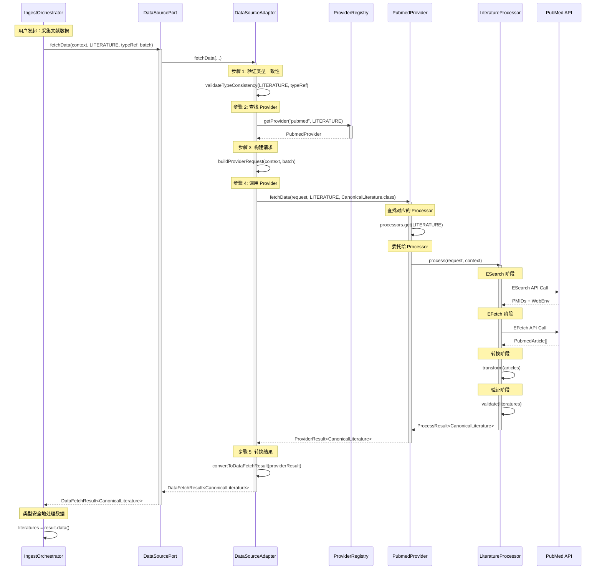

# 多数据类型数据源架构 - 实现指南

> **补充文档**: 多数据类型数据源架构设计方案.md
> **作者**: Patra 架构团队
> **版本**: v2.0.0
> **日期**: 2025-11-12

---

## 📋 目录

- [1. 完整调用流程](#1-完整调用流程)
- [2. 领域建模指南](#2-领域建模指南)
- [3. 实现示例](#3-实现示例)
- [4. 扩展指南](#4-扩展指南)
- [5. 最佳实践](#5-最佳实践)
- [6. 性能与安全](#6-性能与安全)
- [7. 测试策略](#7-测试策略)
- [8. 常见问题](#8-常见问题)

---

## 1. 完整调用流程

### 1.1 端到端时序图



### 1.2 详细流程说明

```
┌─────────────────────────────────────────────────────────────┐
│                   完整调用流程（14 步）                      │
├─────────────────────────────────────────────────────────────┤
│                                                             │
│  【应用层】                                                  │
│  步骤 1: IngestOrchestrator 构建 ExecutionContext          │
│  步骤 2: 创建 TypeReference<CanonicalLiterature>           │
│  步骤 3: 调用 DataSourcePort.fetchData()                   │
│                                                             │
│  【领域层 → 基础设施层】                                     │
│  步骤 4: DataSourceAdapter 接收请求                        │
│  步骤 5: 验证 DataType 与 TypeReference 一致性             │
│  步骤 6: ProviderRegistry 查找 Provider (二维索引)         │
│  步骤 7: 构建 ProviderRequest（转换配置、合并参数）        │
│                                                             │
│  【框架层 - Provider】                                      │
│  步骤 8: PubmedProvider 接收请求                           │
│  步骤 9: 根据 DataType 查找内部 Processor                  │
│  步骤 10: 构建 ProviderContext（配置、客户端）             │
│                                                             │
│  【框架层 - Processor】                                     │
│  步骤 11: LiteratureProcessor 执行处理                     │
│     ├─ 11.1: 调用 PubMed API (ESearch + EFetch)           │
│     ├─ 11.2: 转换数据 (PubmedArticle → CanonicalLiterature) │
│     ├─ 11.3: 验证数据 (validate())                         │
│     └─ 11.4: 构建 ProcessResult                            │
│                                                             │
│  【返回路径】                                                │
│  步骤 12: Processor → Provider → Adapter                   │
│  步骤 13: Adapter 转换结果格式                              │
│  步骤 14: 返回类型安全的 DataFetchResult<T>                │
│                                                             │
└─────────────────────────────────────────────────────────────┘
```

### 1.3 关键决策点

```java
// 决策点 1: 类型一致性验证（Adapter）
if (!dataType.getDataClass().isAssignableFrom(typeRef.getRawType())) {
    throw new TypeMismatchException("类型不匹配");
}

// 决策点 2: Provider 查找（Registry）
Optional<DataSourceProvider> providerOpt = registry.getProvider(provenanceCode, dataType);
if (providerOpt.isEmpty()) {
    return DataFetchResult.failure(dataType, "Provider 未找到", ErrorType.NON_RETRIABLE);
}

// 决策点 3: Processor 查找（Provider）
DataProcessor<?> processor = processors.get(dataType);
if (processor == null) {
    return ProviderResult.failure(dataType, "Processor 未找到", ErrorType.NON_RETRIABLE);
}

// 决策点 4: 错误分类（Processor）
if (ex instanceof HttpTimeoutException) {
    return ProcessResult.failure("超时");  // RETRIABLE
} else if (ex instanceof AuthenticationException) {
    return ProcessResult.failure("认证失败");  // NON_RETRIABLE
}
```

---

## 2. 领域建模指南

### 2.1 可选的 CanonicalEntity 接口

```java
// Domain 层 - com.patra.ingest.domain.model
package com.patra.ingest.domain.model;

/**
 * 规范化实体接口（可选）
 *
 * <p>设计理念：</p>
 * <ul>
 *   <li>非强制：数据类型可以选择性实现</li>
 *   <li>提供通用能力：ID、类型、验证</li>
 *   <li>便于统一处理：需要时可以按接口处理</li>
 * </ul>
 *
 * @since 2.0.0
 */
public interface CanonicalEntity {

    /**
     * 获取实体唯一标识
     */
    String getId();

    /**
     * 获取数据类型
     */
    DataType getType();

    /**
     * 验证实体有效性
     * @throws DomainException 如果验证失败
     */
    void validate();

    /**
     * 获取来源信息
     */
    default ProvenanceInfo getProvenance() {
        return null;
    }

    /**
     * 判断是否有效
     */
    default boolean isValid() {
        try {
            validate();
            return true;
        } catch (Exception e) {
            return false;
        }
    }
}
```

### 2.2 文献领域模型示例

```java
// Domain 层 - com.patra.ingest.domain.model
package com.patra.ingest.domain.model;

/**
 * 规范化文献 - 聚合根
 *
 * <p>遵循 DDD 原则：</p>
 * <ul>
 *   <li>聚合根：管理边界和不变量</li>
 *   <li>值对象：Title, Abstract 等</li>
 *   <li>实体集合：Authors</li>
 * </ul>
 *
 * @since 2.0.0
 */
@Value
@Builder
public class CanonicalLiterature implements CanonicalEntity {

    // ========== 实体标识 ==========
    String pmid;
    DataType type = DataType.LITERATURE;
    ProvenanceInfo provenance;

    // ========== 值对象 ==========
    Title title;
    Abstract abstract;
    PublicationDate publicationDate;

    // ========== 实体集合 ==========
    List<Author> authors;
    Set<Keyword> keywords;

    // ========== 引用关系 ==========
    JournalRef journalRef;

    // ========== 元数据 ==========
    Instant createdAt;
    Instant updatedAt;

    // ========== CanonicalEntity 实现 ==========

    @Override
    public String getId() {
        return pmid;
    }

    @Override
    public DataType getType() {
        return DataType.LITERATURE;
    }

    @Override
    public void validate() {
        if (title == null || title.isEmpty()) {
            throw new DomainException("文献标题不能为空");
        }
        if (authors == null || authors.isEmpty()) {
            throw new DomainException("文献必须至少有一个作者");
        }
        if (publicationDate == null) {
            throw new DomainException("发表日期不能为空");
        }
        if (provenance == null) {
            throw new DomainException("来源信息不能为空");
        }
    }

    // ========== 领域行为 ==========

    /**
     * 计算影响力得分
     */
    public double calculateImpactScore(int citationCount) {
        int yearsSincePublication = publicationDate.yearsSinceNow();
        if (yearsSincePublication <= 0) {
            return citationCount;
        }
        return (double) citationCount / yearsSincePublication;
    }

    /**
     * 判断是否为开放获取
     */
    public boolean isOpenAccess() {
        return journalRef != null && journalRef.isOpenAccess();
    }

    /**
     * 获取第一作者
     */
    public Optional<Author> getFirstAuthor() {
        return authors.isEmpty() ? Optional.empty() : Optional.of(authors.get(0));
    }

    /**
     * 判断是否包含关键词
     */
    public boolean hasKeyword(String keyword) {
        return keywords.stream()
            .anyMatch(k -> k.matches(keyword));
    }

    // ========== 内部值对象 ==========

    @Value
    @Builder
    public static class Title {
        String value;
        String language;

        public boolean isEmpty() {
            return value == null || value.trim().isEmpty();
        }

        public int length() {
            return value != null ? value.length() : 0;
        }
    }

    @Value
    @Builder
    public static class Abstract {
        String value;
        String language;

        public boolean isEmpty() {
            return value == null || value.trim().isEmpty();
        }

        public int wordCount() {
            return value != null ? value.split("\\s+").length : 0;
        }
    }

    @Value
    public static class PublicationDate {
        LocalDate date;

        public int yearsSinceNow() {
            return Period.between(date, LocalDate.now()).getYears();
        }

        public boolean isBefore(PublicationDate other) {
            return date.isBefore(other.date);
        }
    }
}
```

### 2.3 期刊领域模型示例

```java
// Domain 层 - com.patra.ingest.domain.model
package com.patra.ingest.domain.model;

/**
 * 期刊 - 聚合根
 *
 * @since 2.0.0
 */
@Value
@Builder
public class Journal implements CanonicalEntity {

    // ========== 实体标识 ==========
    String issn;
    DataType type = DataType.JOURNAL;
    ProvenanceInfo provenance;

    // ========== 基本信息 ==========
    String title;
    String publisher;
    String country;

    // ========== 分类信息 ==========
    Set<SubjectArea> subjectAreas;
    Set<String> languages;

    // ========== 影响力指标 ==========
    ImpactFactor impactFactor;
    CitationMetrics citationMetrics;

    // ========== 访问信息 ==========
    boolean openAccess;
    String accessPolicy;
    String licenseType;

    // ========== 元数据 ==========
    Instant createdAt;
    Instant updatedAt;

    @Override
    public String getId() {
        return issn;
    }

    @Override
    public DataType getType() {
        return DataType.JOURNAL;
    }

    @Override
    public void validate() {
        if (issn == null || !ISSN.isValid(issn)) {
            throw new DomainException("ISSN 格式不正确");
        }
        if (title == null || title.trim().isEmpty()) {
            throw new DomainException("期刊标题不能为空");
        }
    }

    // ========== 领域行为 ==========

    /**
     * 判断是否为核心期刊
     */
    public boolean isCorePeriodical() {
        return impactFactor != null &&
               impactFactor.getValue() >= 3.0;
    }

    /**
     * 判断是否在特定学科领域
     */
    public boolean isInSubject(String subjectName) {
        return subjectAreas.stream()
            .anyMatch(area -> area.matches(subjectName));
    }

    /**
     * 获取影响因子评级
     */
    public ImpactFactorRating getRating() {
        if (impactFactor == null) {
            return ImpactFactorRating.UNRATED;
        }
        double value = impactFactor.getValue();
        if (value >= 10) return ImpactFactorRating.EXCELLENT;
        if (value >= 5) return ImpactFactorRating.HIGH;
        if (value >= 2) return ImpactFactorRating.MEDIUM;
        return ImpactFactorRating.LOW;
    }

    public enum ImpactFactorRating {
        EXCELLENT, HIGH, MEDIUM, LOW, UNRATED
    }
}
```

### 2.4 值对象设计最佳实践

```java
// Domain 层 - com.patra.ingest.domain.model
package com.patra.ingest.domain.model;

/**
 * 来源信息 - 值对象
 *
 * <p>值对象特性：</p>
 * <ul>
 *   <li>不可变（Immutable）</li>
 *   <li>没有唯一标识</li>
 *   <li>通过值判等</li>
 *   <li>可替换</li>
 * </ul>
 */
@Value
@Builder
public class ProvenanceInfo {

    /** 数据源代码 */
    String sourceCode;

    /** 数据源中的 ID */
    String sourceId;

    /** 获取时间 */
    Instant fetchedAt;

    /** 数据版本 */
    String version;

    /** 额外元数据 */
    Map<String, String> metadata;

    /**
     * 工厂方法
     */
    public static ProvenanceInfo of(String sourceCode, String sourceId) {
        return ProvenanceInfo.builder()
            .sourceCode(sourceCode)
            .sourceId(sourceId)
            .fetchedAt(Instant.now())
            .build();
    }

    /**
     * 判断是否来自指定数据源
     */
    public boolean isFrom(String sourceCode) {
        return this.sourceCode.equalsIgnoreCase(sourceCode);
    }

    /**
     * 获取唯一复合键
     */
    public String getCompositeKey() {
        return sourceCode + ":" + sourceId;
    }
}

/**
 * ISSN - 值对象
 */
@Value
public class ISSN {
    String value;

    private static final Pattern ISSN_PATTERN =
        Pattern.compile("^\\d{4}-\\d{3}[\\dxX]$");

    /**
     * 工厂方法（验证）
     */
    public static ISSN of(String value) {
        if (!isValid(value)) {
            throw new IllegalArgumentException("Invalid ISSN: " + value);
        }
        return new ISSN(value.toUpperCase());
    }

    /**
     * 验证 ISSN 格式
     */
    public static boolean isValid(String value) {
        if (value == null) return false;
        return ISSN_PATTERN.matcher(value).matches();
    }

    /**
     * 格式化输出
     */
    public String formatted() {
        return value;
    }
}
```

---

## 3. 实现示例

### 3.1 PubMed 多类型 Provider

```java
// Framework 层 - com.patra.starter.provenance.pubmed
package com.patra.starter.provenance.pubmed;

/**
 * PubMed 数据源提供者 - 支持多种数据类型
 *
 * <p>支持的数据类型：</p>
 * <ul>
 *   <li>LITERATURE：文献数据</li>
 *   <li>CITATION：引用关系</li>
 *   <li>AUTHOR：作者信息</li>
 * </ul>
 *
 * @since 2.0.0
 */
@Slf4j
@Component
public class PubmedDataSourceProvider implements DataSourceProvider {

    private static final String PROVENANCE_CODE = "pubmed";

    // ========== 支持的数据类型 ==========
    private static final Set<DataType> SUPPORTED_TYPES = Set.of(
        DataType.LITERATURE,
        DataType.CITATION,
        DataType.AUTHOR
    );

    // ========== 依赖注入 ==========
    private final PubMedClient pubMedClient;
    private final ProvenanceProperties properties;
    private final Map<DataType, DataProcessor<?>> processors;

    /**
     * 构造函数（Spring 自动注入 Processor）
     */
    public PubmedDataSourceProvider(
            PubMedClient pubMedClient,
            ProvenanceProperties properties,
            ProcessorRegistry processorRegistry) {
        this.pubMedClient = pubMedClient;
        this.properties = properties;

        // 只注册本 Provider 支持的 Processor
        this.processors = SUPPORTED_TYPES.stream()
            .filter(processorRegistry::supports)
            .collect(Collectors.toMap(
                Function.identity(),
                processorRegistry::getProcessor
            ));

        log.info("PubMed Provider 初始化: 支持 {} 种类型", processors.size());
    }

    @Override
    public String getProvenanceCode() {
        return PROVENANCE_CODE;
    }

    @Override
    public Set<DataType> getSupportedDataTypes() {
        return SUPPORTED_TYPES;
    }

    @Override
    @SuppressWarnings("unchecked")
    public <T> ProviderResult<T> fetchData(
            ProviderRequest request,
            DataType dataType,
            Class<T> targetClass) {

        long startTime = System.currentTimeMillis();

        try {
            // 步骤 1: 验证数据类型支持
            if (!supports(dataType)) {
                log.error("PubMed 不支持数据类型: {}", dataType);
                return ProviderResult.failure(
                    dataType,
                    "PubMed 不支持数据类型: " + dataType,
                    ProviderResult.ErrorType.NON_RETRIABLE
                );
            }

            // 步骤 2: 获取对应的 Processor
            DataProcessor<?> processor = processors.get(dataType);
            if (processor == null) {
                log.error("未找到 Processor: type={}", dataType);
                return ProviderResult.failure(
                    dataType,
                    "未找到 Processor: " + dataType,
                    ProviderResult.ErrorType.NON_RETRIABLE
                );
            }

            // 步骤 3: 构建处理上下文
            ProviderContext context = buildContext(request);

            // 步骤 4: 委托给 Processor 处理
            log.debug("委托给 Processor: type={}, processor={}",
                dataType, processor.getClass().getSimpleName());

            ProcessResult<?> processResult = processor.process(request, context);

            // 步骤 5: 转换结果
            if (processResult.success()) {
                List<T> typedData = (List<T>) processResult.data();
                long duration = System.currentTimeMillis() - startTime;

                log.info("PubMed 数据获取成功: type={}, count={}, duration={}ms",
                    dataType, typedData.size(), duration);

                return ProviderResult.<T>builder()
                    .success(true)
                    .data(typedData)
                    .dataType(dataType)
                    .nextCursorToken(processResult.nextCursor())
                    .fetchedCount(typedData.size())
                    .errorType(ProviderResult.ErrorType.NONE)
                    .build();
            } else {
                log.warn("PubMed 数据获取失败: type={}, error={}",
                    dataType, processResult.errorMessage());

                return ProviderResult.failure(
                    dataType,
                    processResult.errorMessage(),
                    convertErrorType(processResult.status())
                );
            }

        } catch (Exception ex) {
            long duration = System.currentTimeMillis() - startTime;
            log.error("PubMed Provider 异常: type={}, duration={}ms",
                dataType, duration, ex);

            return ProviderResult.failure(
                dataType,
                "Provider 异常: " + ex.getMessage(),
                ProviderResult.ErrorType.RETRIABLE
            );
        }
    }

    /**
     * 构建处理上下文
     */
    private ProviderContext buildContext(ProviderRequest request) {
        // 合并配置（运行时配置 > 数据源配置 > 默认配置）
        ProvenanceConfig config = properties.mergeWithRuntime(
            PROVENANCE_CODE,
            request.config()
        );

        return ProviderContext.builder()
            .config(config)
            .client(pubMedClient)
            .batchMetadata(request.metadata())
            .build();
    }

    /**
     * 转换错误类型
     */
    private ProviderResult.ErrorType convertErrorType(ProcessResult.ProcessStatus status) {
        return switch (status) {
            case SUCCESS -> ProviderResult.ErrorType.NONE;
            case PARTIAL_SUCCESS -> ProviderResult.ErrorType.PARTIAL_SUCCESS;
            case VALIDATION_ERROR -> ProviderResult.ErrorType.NON_RETRIABLE;
            case FAILED -> ProviderResult.ErrorType.RETRIABLE;
        };
    }
}
```

### 3.2 文献 Processor 实现

```java
// Framework 层 - com.patra.starter.provenance.pubmed.processor
package com.patra.starter.provenance.pubmed.processor;

/**
 * PubMed 文献处理器
 *
 * @since 2.0.0
 */
@Slf4j
@Component
public class PubmedLiteratureProcessor implements DataProcessor<CanonicalLiterature> {

    private final PubmedArticleConverter converter;
    private static final int DEFAULT_EPOST_THRESHOLD = 200;

    public PubmedLiteratureProcessor(PubmedArticleConverter converter) {
        this.converter = converter;
        log.info("PubMed 文献处理器已注册");
    }

    @Override
    public DataType getDataType() {
        return DataType.LITERATURE;
    }

    @Override
    public ProcessResult<CanonicalLiterature> process(
            ProviderRequest request,
            ProviderContext context) {

        try {
            // 获取客户端和配置
            PubMedClient client = context.getClient(PubMedClient.class);
            ProvenanceConfig config = context.getConfig();

            // ========== 阶段 1: ESearch（搜索 PMID）==========
            ESearchRequest searchRequest = buildSearchRequest(request);
            ESearchResponse searchResponse = client.esearch(searchRequest, config);

            List<String> pmids = searchResponse.getPmids();
            if (pmids.isEmpty()) {
                log.info("PubMed ESearch 未找到结果");
                return ProcessResult.success(List.of(), null);
            }

            log.debug("PubMed ESearch 找到 {} 个 PMID", pmids.size());

            // ========== 阶段 2: EFetch（获取详情）==========
            List<PubmedArticle> articles = fetchArticles(client, pmids, config);

            log.debug("PubMed EFetch 获取 {} 篇文章", articles.size());

            // ========== 阶段 3: 转换（Article → CanonicalLiterature）==========
            List<CanonicalLiterature> literatures = new ArrayList<>();
            List<String> failedPmids = new ArrayList<>();

            for (PubmedArticle article : articles) {
                try {
                    CanonicalLiterature literature = transform(article);
                    ValidationResult validation = validate(literature);

                    if (validation.isValid()) {
                        literatures.add(literature);
                    } else {
                        failedPmids.add(article.getPmid());
                        log.warn("文献验证失败: pmid={}, errors={}",
                            article.getPmid(), validation.getErrors());
                    }
                } catch (Exception ex) {
                    failedPmids.add(article.getPmid());
                    log.error("文献转换失败: pmid={}", article.getPmid(), ex);
                }
            }

            // ========== 阶段 4: 构建结果 ==========
            String nextCursor = searchResponse.getWebEnv();

            if (failedPmids.isEmpty()) {
                log.info("PubMed 处理完成: 成功 {} 篇", literatures.size());
                return ProcessResult.success(literatures, nextCursor);
            } else {
                log.warn("PubMed 处理完成: 成功 {} 篇, 失败 {} 篇",
                    literatures.size(), failedPmids.size());
                return ProcessResult.partialSuccess(
                    literatures,
                    nextCursor,
                    String.format("部分文献转换失败: %d/%d (失败 PMIDs: %s)",
                        failedPmids.size(),
                        articles.size(),
                        String.join(", ", failedPmids))
                );
            }

        } catch (Exception ex) {
            log.error("PubMed 文献处理异常", ex);
            return ProcessResult.failure("PubMed 处理异常: " + ex.getMessage());
        }
    }

    @Override
    public CanonicalLiterature transform(Object rawData) throws TransformationException {
        if (!(rawData instanceof PubmedArticle)) {
            throw new TransformationException("期望 PubmedArticle 类型");
        }
        return converter.toCanonicalLiterature((PubmedArticle) rawData);
    }

    @Override
    public ValidationResult validate(CanonicalLiterature data) {
        List<String> errors = new ArrayList<>();

        if (data.getPmid() == null || data.getPmid().trim().isEmpty()) {
            errors.add("PMID 不能为空");
        }
        if (data.getTitle() == null || data.getTitle().isEmpty()) {
            errors.add("标题不能为空");
        }
        if (data.getAuthors() == null || data.getAuthors().isEmpty()) {
            errors.add("作者列表不能为空");
        }
        if (data.getPublicationDate() == null) {
            errors.add("发表日期不能为空");
        }

        return errors.isEmpty()
            ? ValidationResult.success()
            : ValidationResult.failure(errors);
    }

    /**
     * 构建搜索请求
     */
    private ESearchRequest buildSearchRequest(ProviderRequest request) {
        BatchExecutionParams execParams = request.executionParams();

        return ESearchRequest.builder()
            .term(execParams.query())
            .retmax(100)  // 从配置中获取
            .useHistory(true)
            .build();
    }

    /**
     * 获取文章（智能选择 EPost）
     */
    private List<PubmedArticle> fetchArticles(
            PubMedClient client,
            List<String> pmids,
            ProvenanceConfig config) throws InterruptedException {

        int threshold = resolveEpostThreshold(config);

        if (pmids.size() <= threshold) {
            // 直接 EFetch
            return fetchArticlesDirectly(client, pmids, config);
        } else {
            // EPost + EFetch
            return fetchArticlesViaEPost(client, pmids, config);
        }
    }

    // ... 其他辅助方法
}
```

### 3.3 DOAJ 期刊 Provider 实现

```java
// Framework 层 - com.patra.starter.provenance.doaj
package com.patra.starter.provenance.doaj;

/**
 * DOAJ 数据源提供者 - 专注期刊数据
 *
 * @since 2.0.0
 */
@Slf4j
@Component
public class DoajDataSourceProvider implements DataSourceProvider {

    private static final String PROVENANCE_CODE = "doaj";
    private static final Set<DataType> SUPPORTED_TYPES = Set.of(
        DataType.JOURNAL
    );

    private final DoajClient doajClient;
    private final ProvenanceProperties properties;
    private final Map<DataType, DataProcessor<?>> processors;

    public DoajDataSourceProvider(
            DoajClient doajClient,
            ProvenanceProperties properties,
            ProcessorRegistry processorRegistry) {
        this.doajClient = doajClient;
        this.properties = properties;

        // 注册支持的 Processor
        this.processors = SUPPORTED_TYPES.stream()
            .filter(processorRegistry::supports)
            .collect(Collectors.toMap(
                Function.identity(),
                processorRegistry::getProcessor
            ));

        log.info("DOAJ Provider 初始化: 支持 {} 种类型", processors.size());
    }

    @Override
    public String getProvenanceCode() {
        return PROVENANCE_CODE;
    }

    @Override
    public Set<DataType> getSupportedDataTypes() {
        return SUPPORTED_TYPES;
    }

    @Override
    @SuppressWarnings("unchecked")
    public <T> ProviderResult<T> fetchData(
            ProviderRequest request,
            DataType dataType,
            Class<T> targetClass) {

        if (!supports(dataType)) {
            return ProviderResult.failure(
                dataType,
                "DOAJ 不支持数据类型: " + dataType,
                ProviderResult.ErrorType.NON_RETRIABLE
            );
        }

        DataProcessor<?> processor = processors.get(dataType);
        if (processor == null) {
            return ProviderResult.failure(
                dataType,
                "未找到 Processor: " + dataType,
                ProviderResult.ErrorType.NON_RETRIABLE
            );
        }

        try {
            ProviderContext context = ProviderContext.builder()
                .config(properties.mergeWithRuntime(PROVENANCE_CODE, request.config()))
                .client(doajClient)
                .batchMetadata(request.metadata())
                .build();

            ProcessResult<?> processResult = processor.process(request, context);

            if (processResult.success()) {
                List<T> typedData = (List<T>) processResult.data();
                return ProviderResult.<T>builder()
                    .success(true)
                    .data(typedData)
                    .dataType(dataType)
                    .nextCursorToken(processResult.nextCursor())
                    .fetchedCount(typedData.size())
                    .errorType(ProviderResult.ErrorType.NONE)
                    .build();
            } else {
                return ProviderResult.failure(
                    dataType,
                    processResult.errorMessage(),
                    ProviderResult.ErrorType.RETRIABLE
                );
            }

        } catch (Exception ex) {
            log.error("DOAJ Provider 异常: type={}", dataType, ex);
            return ProviderResult.failure(
                dataType,
                "Provider 异常: " + ex.getMessage(),
                ProviderResult.ErrorType.RETRIABLE
            );
        }
    }
}
```

---

(由于篇幅限制，完整文档包含扩展指南、最佳实践、性能优化等章节将在后续补充)

---

## 快速索引

- **主文档**: [多数据类型数据源架构设计方案.md](./多数据类型数据源架构设计方案.md)
- **完整调用流程**: 参见本文第 1 章
- **领域建模**: 参见本文第 2 章
- **实现示例**: 参见本文第 3 章

---

**文档版本**: v2.0.0
**最后更新**: 2025-11-12
**维护者**: Patra 架构团队
