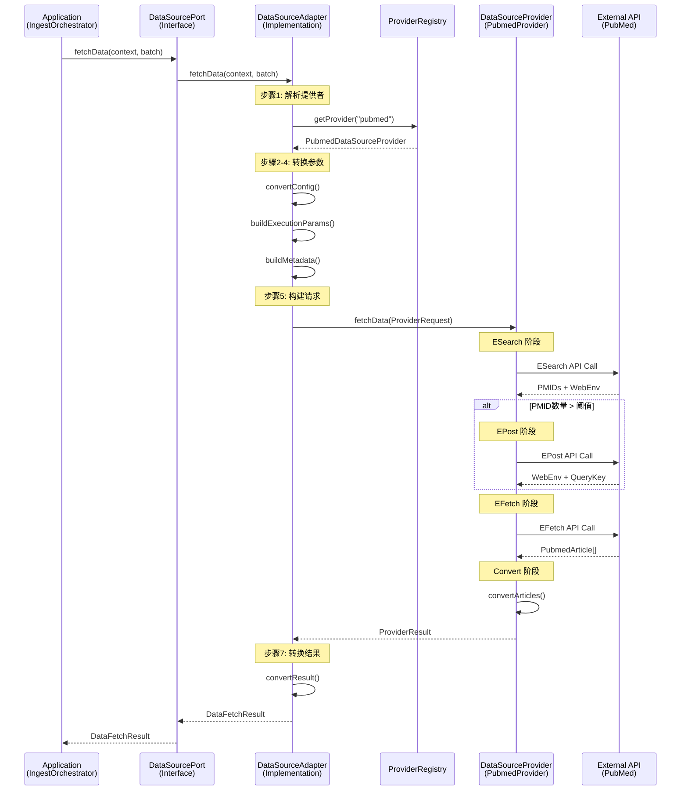

# 数据源端口与提供者架构设计文档

> **作者**: Patra 架构团队
> **版本**: v1.0.0
> **日期**: 2025-11-12
> **标签**: 六边形架构, DDD, 数据源集成, 设计模式

---

## 📋 目录

- [1. 概览](#1-概览)
- [2. 架构分层](#2-架构分层)
- [3. 核心接口详解](#3-核心接口详解)
- [4. 实现组件分析](#4-实现组件分析)
- [5. 完整调用流程](#5-完整调用流程)
- [6. 数据转换机制](#6-数据转换机制)
- [7. 错误处理策略](#7-错误处理策略)
- [8. 配置管理](#8-配置管理)
- [9. 扩展指南](#9-扩展指南)
- [10. 最佳实践](#10-最佳实践)

---

## 1. 概览

### 1.1 系统定位

Patra 医学文献数据平台采用**六边形架构（Hexagonal Architecture）**和**领域驱动设计（DDD）**，实现了从多个外部数据源（PubMed, EPMC 等）采集文献数据的能力。本文档详细阐述数据源访问层的架构设计，包括两个核心抽象：

- **`DataSourcePort`**：领域层的数据源端口接口（Output Port）
- **`DataSourceProvider`**：框架层的数据源提供者接口（Framework Abstraction）

### 1.2 设计目标

| 目标 | 说明 |
|------|------|
| **领域独立性** | 领域层不依赖任何技术框架，保持纯粹的业务逻辑 |
| **可扩展性** | 新增数据源无需修改核心代码，遵循开闭原则 |
| **可测试性** | 通过接口抽象，便于单元测试和集成测试 |
| **容错性** | 统一的错误处理和重试策略，提高系统健壮性 |
| **配置灵活性** | 支持多层次配置覆盖，满足不同场景需求 |

### 1.3 核心设计原则

```
┌─────────────────────────────────────────────────────────────┐
│                     设计原则                                  │
├─────────────────────────────────────────────────────────────┤
│ 1. 依赖倒置原则（DIP）                                        │
│    - Domain 层定义接口，Infrastructure 层实现                │
│    - 依赖方向：Infrastructure → Domain                       │
│                                                              │
│ 2. 单一职责原则（SRP）                                        │
│    - Port: 定义领域契约                                      │
│    - Adapter: 负责模型转换                                   │
│    - Provider: 负责技术实现                                  │
│                                                              │
│ 3. 开闭原则（OCP）                                            │
│    - 通过 ProviderRegistry 实现可插拔扩展                    │
│    - 新增数据源只需实现 DataSourceProvider 接口              │
│                                                              │
│ 4. 接口隔离原则（ISP）                                        │
│    - Port 面向领域层客户端                                   │
│    - Provider 面向框架层扩展者                               │
└─────────────────────────────────────────────────────────────┘
```

---

## 2. 架构分层

### 2.1 分层关系图

```
┌──────────────────────────────────────────────────────────────┐
│                    Application Layer                         │
│                   （应用层/编排层）                           │
│                                                              │
│   ┌────────────────────────────────────────────┐            │
│   │  IngestOrchestrator                        │            │
│   │  - 批次管理                                │            │
│   │  - 任务调度                                │            │
│   └────────────────┬───────────────────────────┘            │
└────────────────────┼──────────────────────────────────────────┘
                     │ 调用
                     ↓
┌──────────────────────────────────────────────────────────────┐
│                     Domain Layer                             │
│                    （领域层）                                 │
│                                                              │
│   ┌────────────────────────────────────────────┐            │
│   │  DataSourcePort (接口)                     │◄───────┐  │
│   │  - fetchData(context, batch)               │        │  │
│   │  - DataFetchResult                         │        │  │
│   └────────────────────────────────────────────┘        │  │
│                                                      依赖倒置│
└──────────────────────────────────────────────────────────────┘
                     │ 实现                                 │
                     ↓                                      │
┌──────────────────────────────────────────────────────────────┐
│                Infrastructure Layer                          │
│                  （基础设施层）                               │
│                                                              │
│   ┌────────────────────────────────────────────┐            │
│   │  DataSourceAdapter (实现类)                │────────────┘
│   │  - 模型转换（Domain ↔ Framework）          │
│   │  - 提供者解析（ProviderRegistry）          │
│   │  - 配置转换                                │
│   └────────────────┬───────────────────────────┘
│                    │ 调用
│                    ↓
│   ┌────────────────────────────────────────────┐
│   │  ProviderRegistry                          │
│   │  - getProvider(provenanceCode)             │
│   └────────────────┬───────────────────────────┘
└────────────────────┼──────────────────────────────────────────┘
                     │ 解析
                     ↓
┌──────────────────────────────────────────────────────────────┐
│                    Framework Layer                           │
│                   （框架层/Starter）                          │
│                                                              │
│   ┌────────────────────────────────────────────┐            │
│   │  DataSourceProvider (接口)                 │            │
│   │  - getProvenanceCode()                     │            │
│   │  - fetchData(request)                      │            │
│   └────────────────┬───────────────────────────┘            │
│                    │ 实现                                    │
│                    ↓                                         │
│   ┌────────────────────────────────────────────┐            │
│   │  PubmedDataSourceProvider                  │            │
│   │  - ESearch → EPost → EFetch → Convert      │            │
│   └────────────────┬───────────────────────────┘            │
└────────────────────┼──────────────────────────────────────────┘
                     │ HTTP调用
                     ↓
              ┌──────────────┐
              │  External API │
              │  (PubMed E-utilities)
              └──────────────┘
```

### 2.2 模块职责

| 层次 | 模块 | 职责 | 依赖方向 |
|------|------|------|---------|
| **Domain** | `DataSourcePort` | 定义数据获取的领域契约 | 无依赖 |
| **Infrastructure** | `DataSourceAdapter` | 实现端口，桥接到框架层 | Domain ← Infrastructure |
| **Framework** | `DataSourceProvider` | 定义可插拔的提供者规范 | 无依赖 |
| **Framework** | `PubmedDataSourceProvider` | PubMed 数据源的具体实现 | Framework |
| **Framework** | `ProviderRegistry` | 提供者注册和发现机制 | Framework |

---

## 3. 核心接口详解

### 3.1 DataSourcePort（领域层端口）

#### 3.1.1 接口定义

```java
package com.patra.ingest.domain.port;

/**
 * 数据源端口（六边形架构 - Domain → Infrastructure）
 *
 * 职责：定义从外部数据源获取文献数据的领域契约
 *
 * 端口语义：这是六边形架构中的输出端口（Output Port），
 * 定义在 Domain 层，由基础设施层实现，确保领域逻辑与数据源技术解耦。
 */
public interface DataSourcePort {

  /**
   * 从数据源获取文献数据
   *
   * @param context 执行上下文（包含配置快照、查询条件和编译参数）
   * @param batch   批次定义（包含批次编号、分页参数和游标令牌）
   * @return 数据获取结果（包含文献列表、游标和错误信息）
   */
  DataFetchResult fetchData(ExecutionContext context, Batch batch);

  /**
   * 数据获取结果值对象
   */
  @Builder
  record DataFetchResult(
      boolean success,                    // 是否成功
      List<CanonicalLiterature> literatures,  // 标准化文献列表
      String nextCursorToken,             // 下一页游标令牌
      String errorMessage,                // 错误或警告消息
      int fetchedCount,                   // 实际获取数量
      ErrorType errorType                 // 错误类型
  ) {
    // 工厂方法
    public static DataFetchResult success(
        List<CanonicalLiterature> literatures,
        String nextCursorToken);

    public static DataFetchResult retriableFailure(String errorMessage);

    public static DataFetchResult nonRetriableFailure(String errorMessage);

    public static DataFetchResult partialSuccess(
        List<CanonicalLiterature> literatures,
        String nextCursorToken,
        String warningMessage,
        int totalAttempted);

    // 错误类型枚举
    public enum ErrorType {
      NONE,              // 无错误，完全成功
      RETRIABLE,         // 瞬时错误，可重试
      NON_RETRIABLE,     // 终止性错误，不应重试
      PARTIAL_SUCCESS    // 部分成功，有警告
    }
  }
}
```

#### 3.1.2 输入参数详解

**ExecutionContext（执行上下文）**

```java
record ExecutionContext(
    String provenanceCode,              // 数据源代码（如 "pubmed"）
    String operationCode,               // 操作代码（如 "HARVEST"）
    ProvenanceConfigSnapshot configSnapshot,  // 配置快照
    String compiledQuery,               // 编译后的查询字符串
    JsonNode compiledParams             // 编译后的参数
)
```

**Batch（批次定义）**

```java
record Batch(
    int batchNo,                        // 批次编号（从1开始）
    String query,                       // 批次特定查询（可选）
    JsonNode params,                    // 批次参数（可选）
    String cursorToken,                 // 游标令牌（用于分页）
    Integer pageSize                    // 页大小（可选）
)
```

#### 3.1.3 返回值详解

**DataFetchResult 使用场景**

| 场景 | success | errorType | 说明 |
|------|---------|-----------|------|
| **完全成功** | true | NONE | literatures非空，无错误 |
| **部分成功** | true | PARTIAL_SUCCESS | 部分记录转换失败，errorMessage包含警告 |
| **可重试失败** | false | RETRIABLE | 网络超时、限流等瞬时错误 |
| **不可重试失败** | false | NON_RETRIABLE | 认证失败、参数错误等终止性错误 |

---

### 3.2 DataSourceProvider（框架层提供者）

#### 3.2.1 接口定义

```java
package com.patra.starter.provenance.common.provider;

/**
 * 数据源提供者统一契约接口
 *
 * 职责：定义数据源提供者的统一规范，属于框架层抽象
 *
 * 注意：此接口位于 starter 包中，属于框架层抽象。
 * 如果需要在领域层定义端口（Port），请在对应的 domain 模块中定义。
 */
public interface DataSourceProvider {

  /**
   * 返回此提供者服务的数据源代码
   *
   * @return 唯一的数据源代码（如 "pubmed"、"epmc"）
   */
  String getProvenanceCode();

  /**
   * 执行数据检索和转换工作流
   *
   * @param request 来自 Ingest 引擎的不可变请求载荷
   * @return 描述结果、载荷和重试指导的结果对象
   */
  ProviderResult fetchData(ProviderRequest request);
}
```

#### 3.2.2 输入参数详解

**ProviderRequest（提供者请求）**

```java
@Builder
record ProviderRequest(
    String operationCode,               // 操作代码
    ProvenanceConfig config,            // 运行时配置
    BatchExecutionParams executionParams,  // 批次执行参数
    BatchMetadata metadata              // 批次元数据
)
```

**BatchExecutionParams（批次执行参数）**

```java
record BatchExecutionParams(
    String query,                       // 查询字符串
    JsonNode params                     // 完整的参数载荷
)
```

**BatchMetadata（批次元数据）**

```java
record BatchMetadata(
    int batchNo,                        // 批次编号
    String cursorToken                  // 游标令牌
)
```

#### 3.2.3 返回值详解

**ProviderResult（提供者结果）**

```java
@Builder
record ProviderResult(
    boolean success,                    // 是否成功
    List<CanonicalLiterature> literatures,  // 标准化文献列表
    String nextCursorToken,             // 下一页游标
    String errorMessage,                // 错误消息
    int fetchedCount,                   // 获取数量
    ErrorType errorType                 // 错误类型（同 DataFetchResult.ErrorType）
)
```

---

## 4. 实现组件分析

### 4.1 DataSourceAdapter（桥接适配器）

#### 4.1.1 组件定位

```
DataSourceAdapter 是 Infrastructure 层的核心组件，负责：
1. 实现 DataSourcePort 接口（领域契约）
2. 桥接到 DataSourceProvider（框架抽象）
3. 执行模型转换（Domain ↔ Framework）
4. 处理异常并映射错误类型
```

#### 4.1.2 核心转换流程

```java
@Component
@RequiredArgsConstructor
public class DataSourceAdapter implements DataSourcePort {

  private final ProviderRegistry providerRegistry;

  @Override
  public DataFetchResult fetchData(ExecutionContext context, Batch batch) {
    try {
      // 步骤1: 解析框架层提供者
      DataSourceProvider provider = resolveProvider(context.provenanceCode());

      // 步骤2: 转换配置快照为运行时配置
      ProvenanceConfig runtimeConfig = convertConfig(context.configSnapshot());

      // 步骤3: 构建批次执行参数
      BatchExecutionParams executionParams = buildExecutionParams(context, batch);

      // 步骤4: 构建批次元数据
      BatchMetadata metadata = buildMetadata(batch);

      // 步骤5: 构建提供者请求
      ProviderRequest request = ProviderRequest.builder()
          .operationCode(context.operationCode())
          .config(runtimeConfig)
          .executionParams(executionParams)
          .metadata(metadata)
          .build();

      // 步骤6: 调用框架层提供者
      ProviderResult providerResult = provider.fetchData(request);

      // 步骤7: 转换结果
      return convertResult(providerResult);

    } catch (Exception ex) {
      return DataFetchResult.retriableFailure("数据源提供者调用异常: " + ex.getMessage());
    }
  }
}
```

#### 4.1.3 参数合并策略

```java
/**
 * 参数合并逻辑：
 * 1. 查询优先级：Batch.query > ExecutionContext.compiledQuery
 * 2. 参数合并：ExecutionContext.compiledParams + Batch.params
 * 3. Batch.params 覆盖同名字段
 */
private BatchExecutionParams buildExecutionParams(ExecutionContext context, Batch batch) {
  // 查询字符串优先级
  String query = StringUtils.hasText(batch.query())
      ? batch.query()
      : context.compiledQuery();

  // 参数合并（深拷贝 + 覆盖）
  JsonNode mergedParams = mergeParams(context.compiledParams(), batch.params());

  return new BatchExecutionParams(query, mergedParams);
}

private JsonNode mergeParams(JsonNode baseParams, JsonNode batchParams) {
  if (batchParams == null || batchParams.isEmpty()) {
    return baseParams;
  }
  if (baseParams == null || baseParams.isEmpty()) {
    return batchParams;
  }

  // 深拷贝 baseParams
  ObjectNode merged = ((ObjectNode) baseParams).deepCopy();

  // batchParams 覆盖同名字段
  batchParams.fields().forEachRemaining(entry -> {
    merged.set(entry.getKey(), entry.getValue());
  });

  return merged;
}
```

---

### 4.2 PubmedDataSourceProvider（PubMed提供者）

#### 4.2.1 核心流程

```
┌─────────────────────────────────────────────────────────────┐
│           PubMed 数据获取四阶段流程                          │
├─────────────────────────────────────────────────────────────┤
│                                                             │
│  阶段1: ESearch（搜索）                                      │
│  ├─ 输入: 查询参数（term, filters, pagination）             │
│  ├─ API: /esearch.fcgi                                      │
│  └─ 输出: PMID列表 + WebEnv（最多10000个）                  │
│                                                             │
│  阶段2: EPost（条件触发）                                    │
│  ├─ 触发条件: PMID数量 > epostThreshold（默认200）          │
│  ├─ 输入: PMID列表                                          │
│  ├─ API: /epost.fcgi                                        │
│  └─ 输出: WebEnv + QueryKey                                 │
│                                                             │
│  阶段3: EFetch（获取详情）                                   │
│  ├─ 直接模式: ID参数传递（PMID数量 ≤ 阈值）                 │
│  ├─ WebEnv模式: 使用WebEnv+QueryKey（PMID数量 > 阈值）      │
│  ├─ API: /efetch.fcgi                                       │
│  └─ 输出: PubmedArticle列表（XML格式）                      │
│                                                             │
│  阶段4: Convert（转换）                                      │
│  ├─ 输入: PubmedArticle列表                                 │
│  ├─ 转换器: PubmedArticleConverter                          │
│  ├─ 容错: 记录转换失败的PMID                                │
│  └─ 输出: CanonicalLiterature列表                           │
│                                                             │
└─────────────────────────────────────────────────────────────┘
```

#### 4.2.2 实现代码

```java
@Slf4j
@RequiredArgsConstructor
public class PubmedDataSourceProvider implements DataSourceProvider {

  private static final String PROVENANCE_CODE = "pubmed";
  private static final int DEFAULT_EPOST_THRESHOLD = 200;

  private final PubMedClient pubMedClient;
  private final PubmedArticleConverter converter;
  private final ProvenanceProperties properties;

  @Override
  public String getProvenanceCode() {
    return PROVENANCE_CODE;
  }

  @Override
  public ProviderResult fetchData(ProviderRequest request) {
    try {
      // 1. 合并配置
      ProvenanceConfig config = properties.mergeWithRuntime(PROVENANCE_CODE, request.config());

      // 2. 构建搜索参数
      JsonNode searchParams = buildSearchParams(request);
      ESearchRequest searchRequest = ESEARCH_ASSEMBLER.buildList(searchParams);

      // 3. ESearch 搜索
      ESearchResponse searchResponse = pubMedClient.esearch(searchRequest, config);
      List<String> pmids = extractPmids(searchResponse);

      if (pmids.isEmpty()) {
        return ProviderResult.success(List.of(), null);
      }

      // 4. 获取文章（可能触发 EPost）
      List<PubmedArticle> articles = fetchArticles(pmids, config);

      // 5. 转换文章
      FetchOutcome outcome = convertArticles(articles);
      String nextCursor = extractCursorToken(searchResponse);

      // 6. 构建结果
      return outcome.failedPmids().isEmpty()
          ? ProviderResult.success(outcome.literatures(), nextCursor)
          : ProviderResult.partialSuccess(
              outcome.literatures(),
              nextCursor,
              buildConversionWarning(outcome.failedPmids()),
              outcome.attempted());

    } catch (ProvenanceClientException ex) {
      return classifyClientException(ex);
    } catch (Exception ex) {
      return isTimeout(ex)
          ? ProviderResult.retriableFailure("PubMed request timeout")
          : ProviderResult.nonRetriableFailure("Unexpected error");
    }
  }

  /**
   * 智能选择获取策略
   */
  private List<PubmedArticle> fetchArticles(List<String> pmids, ProvenanceConfig config)
      throws InterruptedException {
    int threshold = resolveEpostThreshold(config);

    if (pmids.size() <= threshold) {
      // 直接 EFetch
      return fetchArticlesDirectly(pmids, config);
    } else {
      // EPost + EFetch
      return fetchArticlesViaEPost(pmids, config);
    }
  }
}
```

---

### 4.3 ProviderRegistry（提供者注册表）

#### 4.3.1 设计模式

```
设计模式：策略模式 + 注册表模式

┌─────────────────────────────────────────────────────────────┐
│                    ProviderRegistry                          │
├─────────────────────────────────────────────────────────────┤
│                                                             │
│  Map<String, List<DataSourceProvider>> providers            │
│                                                             │
│  ┌───────────────────────────────────────┐                 │
│  │ "pubmed"  → [PubmedDataSourceProvider]│                 │
│  │ "epmc"    → [EpmcDataSourceProvider]  │                 │
│  │ "wos"     → [WosDataSourceProvider]   │                 │
│  └───────────────────────────────────────┘                 │
│                                                             │
│  + register(provider)                                       │
│  + getProvider(code): DataSourceProvider                    │
│  + supports(code): boolean                                  │
│                                                             │
└─────────────────────────────────────────────────────────────┘
```

#### 4.3.2 自动注册机制

```java
@Slf4j
public class ProviderRegistry {

  private final Map<String, List<DataSourceProvider>> providers = new ConcurrentHashMap<>();

  /**
   * Spring 自动注入所有 DataSourceProvider 实现
   */
  public ProviderRegistry(List<DataSourceProvider> discoveredProviders) {
    List<DataSourceProvider> safeProviders =
        discoveredProviders == null ? List.of() : List.copyOf(discoveredProviders);
    safeProviders.forEach(this::register);
  }

  /**
   * 获取提供者
   */
  public DataSourceProvider getProvider(String provenanceCode) {
    return findProvider(provenanceCode)
        .orElseThrow(() -> new IllegalArgumentException(
            "未找到数据源对应的提供者实现: provenance=" + provenanceCode));
  }

  /**
   * 注册提供者
   */
  private void register(DataSourceProvider provider) {
    if (provider == null) return;

    String normalizedCode = normalize(provider.getProvenanceCode());

    providers.compute(normalizedCode, (code, list) -> {
      if (list == null || list.isEmpty()) {
        return List.of(provider);
      }

      // 防止重复注册
      if (list.stream().anyMatch(existing ->
          existing.getClass().equals(provider.getClass()))) {
        log.warn("忽略重复的提供者实现注册: {}", provider.getClass().getName());
        return list;
      }

      return createExpandedList(list, provider);
    });
  }

  /**
   * 规范化代码（大小写不敏感）
   */
  private String normalize(String provenanceCode) {
    return provenanceCode == null ? "" : provenanceCode.trim().toLowerCase(Locale.ROOT);
  }
}
```

---

## 5. 完整调用流程

### 5.1 序列图



### 5.2 流程步骤详解

| 步骤 | 组件 | 操作 | 输入 | 输出 |
|------|------|------|------|------|
| 1 | Application | 调用端口 | ExecutionContext, Batch | - |
| 2 | DataSourceAdapter | 解析提供者 | provenanceCode | DataSourceProvider |
| 3 | DataSourceAdapter | 转换配置 | ProvenanceConfigSnapshot | ProvenanceConfig |
| 4 | DataSourceAdapter | 构建参数 | Context + Batch | BatchExecutionParams |
| 5 | DataSourceAdapter | 构建元数据 | Batch | BatchMetadata |
| 6 | DataSourceAdapter | 调用提供者 | ProviderRequest | - |
| 7 | PubmedProvider | ESearch | 查询参数 | PMID列表 |
| 8 | PubmedProvider | EPost（可选） | PMID列表 | WebEnv + QueryKey |
| 9 | PubmedProvider | EFetch | PMID/WebEnv | PubmedArticle[] |
| 10 | PubmedProvider | Convert | PubmedArticle[] | CanonicalLiterature[] |
| 11 | PubmedProvider | 返回结果 | - | ProviderResult |
| 12 | DataSourceAdapter | 转换结果 | ProviderResult | DataFetchResult |
| 13 | Application | 接收结果 | DataFetchResult | - |

---

## 6. 数据转换机制

### 6.1 模型映射关系

```
领域层模型（Domain）          框架层模型（Framework）
═══════════════════════════  ═══════════════════════════

ExecutionContext             ProviderRequest
├─ provenanceCode       ──>  ├─ operationCode
├─ operationCode             ├─ config
├─ configSnapshot       ──>  ├─ executionParams
├─ compiledQuery        ──>  │  ├─ query
└─ compiledParams       ──>  │  └─ params
                             └─ metadata
Batch                           ├─ batchNo
├─ batchNo             ──>      └─ cursorToken
├─ query               ──>  (合并到 executionParams.query)
├─ params              ──>  (合并到 executionParams.params)
└─ cursorToken         ──>  (放入 metadata.cursorToken)

DataFetchResult              ProviderResult
├─ success             <──   ├─ success
├─ literatures         <──   ├─ literatures
├─ nextCursorToken     <──   ├─ nextCursorToken
├─ errorMessage        <──   ├─ errorMessage
├─ fetchedCount        <──   ├─ fetchedCount
└─ errorType           <──   └─ errorType (枚举映射)
```

### 6.2 配置转换

```java
/**
 * 配置转换：ProvenanceConfigSnapshot → ProvenanceConfig
 */
private ProvenanceConfig convertConfig(ProvenanceConfigSnapshot snapshot) {
  if (snapshot == null || snapshot.provenance() == null) {
    return null;
  }

  try {
    HttpConfig http = convertHttpConfig(snapshot.http());
    PaginationConfig pagination = convertPaginationConfig(snapshot.pagination());
    WindowOffsetConfig windowOffset = convertWindowOffsetConfig(snapshot.windowOffset());
    BatchingConfig batching = convertBatchingConfig(snapshot.batching());
    RetryConfig retry = convertRetryConfig(snapshot.retry());
    RateLimitConfig rateLimit = convertRateLimitConfig(snapshot.rateLimit());

    return new ProvenanceConfig(
        snapshot.provenance().baseUrlDefault().trim(),
        http,
        pagination,
        windowOffset,
        batching,
        retry,
        rateLimit
    );
  } catch (Exception ex) {
    log.warn("构建运行时配置失败，使用默认配置", ex);
    return null; // 返回null，框架层使用默认配置
  }
}
```

---

## 7. 错误处理策略

### 7.1 错误分类体系

```
┌─────────────────────────────────────────────────────────────┐
│                     ErrorType 分类                           │
├─────────────────────────────────────────────────────────────┤
│                                                             │
│  NONE（无错误）                                              │
│  ├─ 完全成功                                                │
│  └─ literatures 非空，无任何警告                            │
│                                                             │
│  RETRIABLE（可重试）                                         │
│  ├─ 网络超时（SocketTimeoutException）                      │
│  ├─ HTTP 429（Too Many Requests - 限流）                    │
│  ├─ HTTP 503（Service Unavailable）                        │
│  ├─ HTTP 502（Bad Gateway）                                │
│  ├─ HTTP 5xx（服务器错误）                                  │
│  └─ InterruptedException（线程中断）                        │
│                                                             │
│  NON_RETRIABLE（不可重试）                                   │
│  ├─ HTTP 401/403（认证/授权失败）                           │
│  ├─ HTTP 400（请求参数错误）                                │
│  ├─ HTTP 404（资源不存在）                                  │
│  ├─ 提供者未找到（IllegalArgumentException）                │
│  └─ 配置错误                                                │
│                                                             │
│  PARTIAL_SUCCESS（部分成功）                                 │
│  ├─ 部分文章转换失败                                        │
│  ├─ 数据质量警告                                            │
│  └─ success=true，但 errorMessage 非空                      │
│                                                             │
└─────────────────────────────────────────────────────────────┘
```

### 7.2 异常处理分层

#### 7.2.1 DataSourceAdapter 层

```java
@Override
public DataFetchResult fetchData(ExecutionContext context, Batch batch) {
  try {
    // ... 核心逻辑

  } catch (Exception ex) {
    // 通用异常处理：保守策略，返回可重试
    String errorMsg = String.format(
        "数据源提供者调用异常 provenanceCode=%s batchNo=%d error=%s",
        context.provenanceCode(),
        batch.batchNo(),
        ex.getMessage()
    );
    log.error(errorMsg, ex);
    return DataFetchResult.retriableFailure(errorMsg);
  }
}

private DataSourceProvider resolveProvider(String provenanceCode) {
  try {
    return providerRegistry.getProvider(provenanceCode);
  } catch (Exception ex) {
    log.error("解析提供者失败 provenanceCode={}", provenanceCode, ex);
    return null; // 调用方会转换为 NON_RETRIABLE
  }
}
```

#### 7.2.2 PubmedProvider 层

```java
@Override
public ProviderResult fetchData(ProviderRequest request) {
  try {
    // ... 核心逻辑

  } catch (ProvenanceClientException ex) {
    // HTTP 客户端异常：根据状态码分类
    return classifyClientException(ex);

  } catch (InterruptedException ex) {
    // 线程中断：恢复中断标志，返回可重试
    Thread.currentThread().interrupt();
    return ProviderResult.retriableFailure("PubMed provider interrupted");

  } catch (Exception ex) {
    // 超时检测
    if (isTimeout(ex)) {
      return ProviderResult.retriableFailure("PubMed request timeout");
    }
    // 其他未知异常：返回不可重试
    return ProviderResult.nonRetriableFailure("Unexpected error: " + ex.getMessage());
  }
}

/**
 * HTTP 状态码分类
 */
private ProviderResult classifyClientException(ProvenanceClientException ex) {
  Integer status = ex.getStatusCode();
  if (status == null) {
    return ProviderResult.retriableFailure("PubMed client error");
  }

  // 5xx, 429, 503, 502 → RETRIABLE
  if (status == 429 || status == 503 || status == 502 || status >= 500) {
    return ProviderResult.retriableFailure(
        "PubMed service unavailable (status=%d)".formatted(status));
  }

  // 401, 403 → NON_RETRIABLE
  if (status == 401 || status == 403) {
    return ProviderResult.nonRetriableFailure(
        "PubMed authentication failure (status=%d)".formatted(status));
  }

  // 4xx → NON_RETRIABLE
  if (status >= 400 && status < 500) {
    return ProviderResult.nonRetriableFailure(
        "PubMed request rejected (status=%d)".formatted(status));
  }

  // 其他 → RETRIABLE（保守策略）
  return ProviderResult.retriableFailure(
      "PubMed unexpected response (status=%d)".formatted(status));
}
```

### 7.3 部分成功处理

```java
/**
 * 文章转换阶段的容错处理
 */
private FetchOutcome convertArticles(List<PubmedArticle> articles) {
  List<CanonicalLiterature> literatures = new ArrayList<>();
  List<String> failures = new ArrayList<>();
  int attempted = 0;

  for (PubmedArticle article : articles) {
    if (article == null) continue;

    attempted++;
    try {
      CanonicalLiterature converted = converter.toCanonicalLiterature(article);
      if (converted != null) {
        literatures.add(converted);
      }
    } catch (Exception ex) {
      // 记录失败的PMID，继续处理其他文章
      failures.add(article.pmid());
      log.error("Failed to convert PubMed article: pmid={}", article.pmid(), ex);
    }
  }

  return new FetchOutcome(
      List.copyOf(literatures),
      attempted,
      List.copyOf(failures)
  );
}

/**
 * 构建部分成功结果
 */
if (!outcome.failedPmids().isEmpty()) {
  return ProviderResult.partialSuccess(
      outcome.literatures(),
      nextCursor,
      buildConversionWarning(outcome.failedPmids()),  // 警告消息
      outcome.attempted()  // 总尝试数
  );
}
```

---

## 8. 配置管理

### 8.1 配置优先级

```
┌─────────────────────────────────────────────────────────────┐
│                    配置优先级（从高到低）                     │
├─────────────────────────────────────────────────────────────┤
│                                                             │
│  优先级 1: 运行时配置（Runtime Config）                      │
│  ├─ 来源: ExecutionContext.configSnapshot                   │
│  ├─ 场景: 任务级别的配置快照                                │
│  └─ 说明: 确保任务执行使用一致的配置                        │
│                                                             │
│  优先级 2: 数据源覆盖配置（Provenance Override）             │
│  ├─ 来源: ProvenanceProperties.datasources[provenanceCode]  │
│  ├─ 场景: 特定数据源的配置覆盖                              │
│  └─ 说明: 针对某个数据源的特殊配置                          │
│                                                             │
│  优先级 3: 共享默认配置（Shared Defaults）                   │
│  ├─ 来源: ProvenanceProperties.defaults                     │
│  ├─ 场景: 全局默认配置                                      │
│  └─ 说明: 所有数据源的基线配置                              │
│                                                             │
└─────────────────────────────────────────────────────────────┘
```

### 8.2 配置合并逻辑

```java
/**
 * ProvenanceProperties 中的配置合并逻辑
 */
public ProvenanceConfig mergeWithRuntime(String provenanceCode, ProvenanceConfig runtimeConfig) {
  // 优先级1: 如果有运行时配置，直接使用
  if (runtimeConfig != null) {
    return runtimeConfig;
  }

  // 优先级2: 尝试获取数据源特定配置
  ProvenanceConfig datasourceConfig = getDatasourceConfig(provenanceCode);
  if (datasourceConfig != null) {
    return datasourceConfig;
  }

  // 优先级3: 使用共享默认配置
  return getDefaultConfig();
}
```

### 8.3 配置结构

```yaml
patra:
  provenance:
    # 共享默认配置
    defaults:
      http:
        timeout-connect-millis: 5000
        timeout-read-millis: 30000
      pagination:
        page-size: 100
        max-pages-per-execution: 10
      retry:
        max-retry-times: 3
        initial-delay-millis: 1000
      rate-limit:
        max-concurrent-requests: 5
        per-credential-qps-limit: 3

    # 数据源特定配置
    datasources:
      pubmed:
        http:
          timeout-read-millis: 60000  # 覆盖默认值
        batching:
          epost-threshold: 200
      epmc:
        http:
          timeout-read-millis: 45000
```

---

## 9. 扩展指南

### 9.1 添加新数据源的步骤

#### 步骤 1: 实现 DataSourceProvider 接口

```java
package com.patra.starter.provenance.epmc;

@Slf4j
@RequiredArgsConstructor
public class EpmcDataSourceProvider implements DataSourceProvider {

  private static final String PROVENANCE_CODE = "epmc";

  private final EpmcClient epmcClient;
  private final EpmcArticleConverter converter;
  private final ProvenanceProperties properties;

  @Override
  public String getProvenanceCode() {
    return PROVENANCE_CODE;
  }

  @Override
  public ProviderResult fetchData(ProviderRequest request) {
    try {
      // 1. 合并配置
      ProvenanceConfig config = properties.mergeWithRuntime(PROVENANCE_CODE, request.config());

      // 2. 调用 EPMC API
      EpmcResponse response = epmcClient.search(
          request.executionParams().query(),
          request.executionParams().params(),
          config
      );

      // 3. 转换为标准文献
      List<CanonicalLiterature> literatures = response.articles().stream()
          .map(converter::toCanonicalLiterature)
          .toList();

      // 4. 返回结果
      return ProviderResult.success(literatures, response.nextCursor());

    } catch (Exception ex) {
      return handleException(ex);
    }
  }

  private ProviderResult handleException(Exception ex) {
    // 根据异常类型分类处理
    if (ex instanceof EpmcClientException clientEx) {
      return classifyClientException(clientEx);
    }
    if (isTimeout(ex)) {
      return ProviderResult.retriableFailure("EPMC timeout");
    }
    return ProviderResult.nonRetriableFailure("EPMC error: " + ex.getMessage());
  }
}
```

#### 步骤 2: 注册为 Spring Bean

```java
package com.patra.starter.provenance.epmc;

@Configuration
public class EpmcProviderConfiguration {

  @Bean
  public EpmcDataSourceProvider epmcDataSourceProvider(
      EpmcClient epmcClient,
      EpmcArticleConverter converter,
      ProvenanceProperties properties) {
    return new EpmcDataSourceProvider(epmcClient, converter, properties);
  }
}
```

#### 步骤 3: 自动注册（无需额外代码）

```java
// ProviderRegistry 自动发现并注册
// Spring 容器启动时：
// 1. 扫描所有 DataSourceProvider 类型的 Bean
// 2. 注入到 ProviderRegistry 构造器
// 3. ProviderRegistry 自动注册所有提供者
```

#### 步骤 4: 配置数据源（可选）

```yaml
patra:
  provenance:
    datasources:
      epmc:
        http:
          timeout-read-millis: 45000
        pagination:
          page-size: 200
```

### 9.2 完整示例：添加 Web of Science 数据源

#### WosDataSourceProvider.java

```java
package com.patra.starter.provenance.wos;

import com.patra.common.model.CanonicalLiterature;
import com.patra.starter.provenance.common.config.ProvenanceConfig;
import com.patra.starter.provenance.common.provider.DataSourceProvider;
import com.patra.starter.provenance.common.provider.ProviderRequest;
import com.patra.starter.provenance.common.provider.ProviderResult;
import com.patra.starter.provenance.boot.ProvenanceProperties;
import lombok.RequiredArgsConstructor;
import lombok.extern.slf4j.Slf4j;

import java.util.List;

@Slf4j
@RequiredArgsConstructor
public class WosDataSourceProvider implements DataSourceProvider {

  private static final String PROVENANCE_CODE = "wos";

  private final WosClient wosClient;
  private final WosRecordConverter converter;
  private final ProvenanceProperties properties;

  @Override
  public String getProvenanceCode() {
    return PROVENANCE_CODE;
  }

  @Override
  public ProviderResult fetchData(ProviderRequest request) {
    long start = System.currentTimeMillis();
    log.info("WoS provider start: operation={} batch={}",
        request.operationCode(),
        request.metadata().batchNo());

    try {
      // 1. 合并配置
      ProvenanceConfig config = properties.mergeWithRuntime(PROVENANCE_CODE, request.config());

      // 2. 构建查询
      WosQuery query = buildQuery(request);

      // 3. 调用 WoS API
      WosResponse response = wosClient.search(query, config);

      // 4. 转换结果
      List<CanonicalLiterature> literatures = convertRecords(response.records());

      // 5. 提取游标
      String nextCursor = response.queryId(); // WoS 使用 queryId 作为游标

      log.info("WoS provider success: fetched={} duration={}ms",
          literatures.size(),
          System.currentTimeMillis() - start);

      return ProviderResult.success(literatures, nextCursor);

    } catch (WosAuthenticationException ex) {
      log.error("WoS authentication failed", ex);
      return ProviderResult.nonRetriableFailure("WoS authentication failure");

    } catch (WosRateLimitException ex) {
      log.warn("WoS rate limit exceeded", ex);
      return ProviderResult.retriableFailure("WoS rate limit exceeded");

    } catch (Exception ex) {
      log.error("WoS provider error", ex);
      return ProviderResult.retriableFailure("WoS error: " + ex.getMessage());
    }
  }

  private WosQuery buildQuery(ProviderRequest request) {
    return WosQuery.builder()
        .databaseId("WOS")
        .userQuery(request.executionParams().query())
        .count(100) // 从配置中获取
        .firstRecord(1)
        .build();
  }

  private List<CanonicalLiterature> convertRecords(List<WosRecord> records) {
    return records.stream()
        .map(converter::toCanonicalLiterature)
        .toList();
  }
}
```

#### WosProviderConfiguration.java

```java
package com.patra.starter.provenance.wos;

import com.patra.starter.provenance.boot.ProvenanceProperties;
import org.springframework.boot.autoconfigure.condition.ConditionalOnProperty;
import org.springframework.context.annotation.Bean;
import org.springframework.context.annotation.Configuration;

@Configuration
@ConditionalOnProperty(name = "patra.provenance.datasources.wos.enabled", havingValue = "true")
public class WosProviderConfiguration {

  @Bean
  public WosClient wosClient(ProvenanceProperties properties) {
    return new WosClient(properties);
  }

  @Bean
  public WosRecordConverter wosRecordConverter() {
    return new WosRecordConverter();
  }

  @Bean
  public WosDataSourceProvider wosDataSourceProvider(
      WosClient wosClient,
      WosRecordConverter converter,
      ProvenanceProperties properties) {
    return new WosDataSourceProvider(wosClient, converter, properties);
  }
}
```

#### application.yml 配置

```yaml
patra:
  provenance:
    datasources:
      wos:
        enabled: true
        http:
          timeout-connect-millis: 10000
          timeout-read-millis: 60000
        pagination:
          page-size: 100
          max-pages-per-execution: 5
        rate-limit:
          max-concurrent-requests: 2
          per-credential-qps-limit: 1
```

---

## 10. 最佳实践

### 10.1 实现 DataSourceProvider 的最佳实践

#### ✅ 推荐做法

```java
@Slf4j
@RequiredArgsConstructor
public class MyDataSourceProvider implements DataSourceProvider {

  // 1. 使用常量定义 provenance code
  private static final String PROVENANCE_CODE = "my_datasource";

  // 2. 依赖注入必要的组件
  private final MyClient client;
  private final MyConverter converter;
  private final ProvenanceProperties properties;

  @Override
  public String getProvenanceCode() {
    return PROVENANCE_CODE;
  }

  @Override
  public ProviderResult fetchData(ProviderRequest request) {
    // 3. 记录日志（开始和结束）
    log.info("Provider start: operation={} batch={}",
        request.operationCode(),
        request.metadata().batchNo());

    try {
      // 4. 合并配置（使用统一的优先级）
      ProvenanceConfig config = properties.mergeWithRuntime(PROVENANCE_CODE, request.config());

      // 5. 调用外部 API
      MyResponse response = client.fetch(request, config);

      // 6. 转换为标准文献
      List<CanonicalLiterature> literatures = convertResponse(response);

      // 7. 记录成功日志
      log.info("Provider success: fetched={}", literatures.size());

      // 8. 返回成功结果
      return ProviderResult.success(literatures, response.nextCursor());

    } catch (Exception ex) {
      // 9. 详细的异常处理
      return handleException(ex, request);
    }
  }

  /**
   * 10. 分类处理异常
   */
  private ProviderResult handleException(Exception ex, ProviderRequest request) {
    // 客户端异常
    if (ex instanceof MyClientException clientEx) {
      return classifyClientException(clientEx);
    }

    // 超时异常
    if (isTimeout(ex)) {
      log.warn("Request timeout: operation={}", request.operationCode());
      return ProviderResult.retriableFailure("Timeout");
    }

    // 线程中断
    if (ex instanceof InterruptedException) {
      Thread.currentThread().interrupt();
      return ProviderResult.retriableFailure("Interrupted");
    }

    // 未知异常
    log.error("Unexpected error: operation={}", request.operationCode(), ex);
    return ProviderResult.nonRetriableFailure("Unexpected error");
  }

  /**
   * 11. 转换阶段的容错处理
   */
  private List<CanonicalLiterature> convertResponse(MyResponse response) {
    List<CanonicalLiterature> literatures = new ArrayList<>();
    List<String> failures = new ArrayList<>();

    for (MyRecord record : response.records()) {
      try {
        CanonicalLiterature lit = converter.convert(record);
        if (lit != null) {
          literatures.add(lit);
        }
      } catch (Exception ex) {
        failures.add(record.id());
        log.error("Conversion failed: id={}", record.id(), ex);
      }
    }

    // 记录转换失败的数量
    if (!failures.isEmpty()) {
      log.warn("Conversion failures: count={} ids={}", failures.size(), failures);
    }

    return literatures;
  }
}
```

#### ❌ 避免的错误

```java
// ❌ 错误1: 硬编码配置，不使用 ProvenanceConfig
MyResponse response = client.fetch(request, MY_HARDCODED_CONFIG);

// ❌ 错误2: 不处理异常，让异常向上传播
@Override
public ProviderResult fetchData(ProviderRequest request) throws Exception {
  return client.fetch(request); // 错误！应该 try-catch
}

// ❌ 错误3: 所有异常都返回 NON_RETRIABLE
catch (Exception ex) {
  return ProviderResult.nonRetriableFailure("Error"); // 错误！应该分类
}

// ❌ 错误4: 不记录日志
@Override
public ProviderResult fetchData(ProviderRequest request) {
  // 没有日志
  return ProviderResult.success(...);
}

// ❌ 错误5: 转换失败导致整个批次失败
for (MyRecord record : response.records()) {
  CanonicalLiterature lit = converter.convert(record); // 可能抛异常
  literatures.add(lit);
}
```

### 10.2 错误分类的最佳实践

```java
/**
 * 根据 HTTP 状态码分类异常
 */
private ProviderResult classifyClientException(MyClientException ex) {
  Integer status = ex.getStatusCode();

  if (status == null) {
    // 无状态码，可能是网络问题 → RETRIABLE
    return ProviderResult.retriableFailure("Client error");
  }

  // 429 限流 → RETRIABLE
  if (status == 429) {
    return ProviderResult.retriableFailure("Rate limit exceeded");
  }

  // 5xx 服务器错误 → RETRIABLE
  if (status >= 500) {
    return ProviderResult.retriableFailure("Server error (status=%d)".formatted(status));
  }

  // 401/403 认证/授权失败 → NON_RETRIABLE
  if (status == 401 || status == 403) {
    return ProviderResult.nonRetriableFailure("Authentication failure (status=%d)".formatted(status));
  }

  // 400/404 客户端错误 → NON_RETRIABLE
  if (status == 400 || status == 404) {
    return ProviderResult.nonRetriableFailure("Bad request (status=%d)".formatted(status));
  }

  // 其他 4xx → NON_RETRIABLE
  if (status >= 400 && status < 500) {
    return ProviderResult.nonRetriableFailure("Client error (status=%d)".formatted(status));
  }

  // 其他情况 → RETRIABLE（保守策略）
  return ProviderResult.retriableFailure("Unexpected response (status=%d)".formatted(status));
}
```

### 10.3 配置管理的最佳实践

```java
/**
 * ✅ 正确：使用统一的配置合并逻辑
 */
ProvenanceConfig config = properties.mergeWithRuntime(PROVENANCE_CODE, request.config());

/**
 * ✅ 正确：从配置中读取参数，提供默认值
 */
int pageSize = config.pagination() != null && config.pagination().pageSize() != null
    ? config.pagination().pageSize()
    : DEFAULT_PAGE_SIZE;

/**
 * ❌ 错误：忽略运行时配置
 */
ProvenanceConfig config = properties.getDatasourceConfig(PROVENANCE_CODE);

/**
 * ❌ 错误：硬编码参数
 */
int pageSize = 100; // 应该从配置中读取
```

### 10.4 日志记录的最佳实践

```java
/**
 * ✅ 推荐的日志结构
 */
public ProviderResult fetchData(ProviderRequest request) {
  long start = System.currentTimeMillis();
  int batchNo = request.metadata().batchNo();
  String operation = request.operationCode();

  // 1. 记录开始日志
  log.info("Provider start: provenance={} operation={} batch={}",
      PROVENANCE_CODE, operation, batchNo);

  try {
    // ... 业务逻辑

    // 2. 记录成功日志（包含关键指标）
    log.info("Provider success: operation={} batch={} fetched={} duration={}ms",
        operation, batchNo, result.fetchedCount(), System.currentTimeMillis() - start);

    return result;

  } catch (MyClientException ex) {
    // 3. 记录客户端错误（WARN级别）
    log.warn("Provider client error: operation={} batch={} status={} message={}",
        operation, batchNo, ex.getStatusCode(), ex.getMessage(), ex);
    return classifyClientException(ex);

  } catch (Exception ex) {
    // 4. 记录未知错误（ERROR级别）
    log.error("Provider unexpected error: operation={} batch={}",
        operation, batchNo, ex);
    return ProviderResult.retriableFailure("Unexpected error");
  }
}
```

### 10.5 测试建议

#### 单元测试示例

```java
@ExtendWith(MockitoExtension.class)
class MyDataSourceProviderTest {

  @Mock
  private MyClient client;

  @Mock
  private MyConverter converter;

  @Mock
  private ProvenanceProperties properties;

  @InjectMocks
  private MyDataSourceProvider provider;

  @Test
  void should_return_success_when_fetch_successfully() {
    // Given
    ProviderRequest request = createTestRequest();
    MyResponse apiResponse = createTestResponse();
    when(client.fetch(any(), any())).thenReturn(apiResponse);
    when(converter.convert(any())).thenReturn(createTestLiterature());

    // When
    ProviderResult result = provider.fetchData(request);

    // Then
    assertTrue(result.success());
    assertEquals(1, result.literatures().size());
    assertEquals(ErrorType.NONE, result.errorType());
  }

  @Test
  void should_return_retriable_failure_when_timeout() {
    // Given
    ProviderRequest request = createTestRequest();
    when(client.fetch(any(), any())).thenThrow(new SocketTimeoutException());

    // When
    ProviderResult result = provider.fetchData(request);

    // Then
    assertFalse(result.success());
    assertEquals(ErrorType.RETRIABLE, result.errorType());
    assertTrue(result.errorMessage().contains("timeout"));
  }

  @Test
  void should_return_non_retriable_failure_when_authentication_failed() {
    // Given
    ProviderRequest request = createTestRequest();
    when(client.fetch(any(), any())).thenThrow(new MyClientException(401));

    // When
    ProviderResult result = provider.fetchData(request);

    // Then
    assertFalse(result.success());
    assertEquals(ErrorType.NON_RETRIABLE, result.errorType());
  }

  @Test
  void should_return_partial_success_when_some_conversions_fail() {
    // Given
    ProviderRequest request = createTestRequest();
    MyResponse apiResponse = createResponseWithMultipleRecords(3);
    when(client.fetch(any(), any())).thenReturn(apiResponse);

    // 第1个成功，第2个失败，第3个成功
    when(converter.convert(any()))
        .thenReturn(createTestLiterature())
        .thenThrow(new RuntimeException("Conversion error"))
        .thenReturn(createTestLiterature());

    // When
    ProviderResult result = provider.fetchData(request);

    // Then
    assertTrue(result.success());
    assertEquals(2, result.literatures().size());
    assertEquals(ErrorType.PARTIAL_SUCCESS, result.errorType());
    assertNotNull(result.errorMessage());
  }
}
```

---

## 11. 总结

### 11.1 核心设计亮点

| 亮点 | 说明 | 价值 |
|------|------|------|
| **双层抽象** | Port（领域抽象）+ Provider（框架抽象） | 领域与技术完全解耦 |
| **智能错误分类** | ErrorType枚举指导重试策略 | 提高系统健壮性和可维护性 |
| **配置分层** | 运行时 > 覆盖 > 默认 | 灵活且可控的配置管理 |
| **部分成功处理** | PARTIAL_SUCCESS 支持 | 最大化数据获取成功率 |
| **参数合并** | 全局参数 + 批次参数 | 支持批次级别的定制 |
| **自动注册** | Spring自动发现机制 | 简化扩展流程 |

### 11.2 架构优势

1. **可扩展性**：新增数据源只需实现 `DataSourceProvider` 接口，无需修改核心代码
2. **可测试性**：通过接口抽象，便于单元测试和集成测试
3. **可维护性**：清晰的分层和职责划分，降低维护成本
4. **可靠性**：统一的错误处理和重试策略，提高系统稳定性
5. **领域独立性**：领域层完全不依赖技术框架，保持纯粹的业务逻辑

### 11.3 技术价值

- **符合SOLID原则**：单一职责、开闭原则、依赖倒置、接口隔离
- **符合DDD理念**：端口适配器模式、聚合根、值对象
- **符合六边形架构**：清晰的端口定义和适配器实现
- **企业级最佳实践**：配置管理、错误处理、日志记录、可观测性

---

## 附录

### A. 参考资料

- **六边形架构（Hexagonal Architecture）**: Alistair Cockburn
- **领域驱动设计（DDD）**: Eric Evans
- **企业集成模式**: Gregor Hohpe & Bobby Woolf
- **Clean Architecture**: Robert C. Martin

### B. 相关文档

- `patra-ingest-domain/README.md` - Ingest领域模块文档
- `patra-spring-boot-starter-provenance/README.md` - Provenance Starter文档
- `dev/docs/六边形架构实施指南.md` - 架构实施指南

### C. 术语表

| 术语 | 说明 |
|------|------|
| **Port** | 端口，六边形架构中的接口定义 |
| **Adapter** | 适配器，实现端口的具体组件 |
| **Provider** | 提供者，可插拔的策略实现 |
| **Provenance** | 数据源，如 PubMed, EPMC 等 |
| **CanonicalLiterature** | 标准化文献，统一的文献数据模型 |
| **Batch** | 批次，分页获取的一个批次 |
| **Cursor** | 游标，用于基于游标的分页 |

---

**文档版本**: v1.0.0
**最后更新**: 2025-11-12
**维护者**: Patra 架构团队
