# Mermaid 图表规范

> **强制要求**：所有流程图、架构图使用 Mermaid 语法，禁止使用 ASCII 艺术字符（`┌─┐│└┘▼` 等）。

---

## 强制规则（TL;DR）

1. **使用 `flowchart` 而非 `graph`** — `graph` 是旧版语法，不支持子图方向控制
2. **节点 ID 与标签分离** — ID 仅用英文+数字+下划线，标签用中文
3. **必须注入初始化指令** — 确保 Dark/Light Mode 兼容
4. **单图节点数 ≤50** — 超过则拆分子图，确保移动端可渲染
5. **禁止使用高风险图表类型** — `quadrantChart`、`sankey-beta` 在 Obsidian 中渲染不稳定

---

## 环境约束

### Obsidian 渲染管线

Obsidian 使用内置 Mermaid 引擎（非最新版），通过以下流程渲染：

1. **解析**：识别 ` ```mermaid ` 代码块
2. **预处理**：根据当前主题（明/暗）注入默认配置
3. **渲染**：Mermaid 引擎生成 SVG
4. **注入**：SVG 插入 DOM，封装在 `<div class="mermaid">` 容器中

### 版本滞后性

Obsidian 内置 Mermaid 版本通常落后于上游主线 1-2 个大版本。**后果**：

- 新语法（如 `packet`、某些 `sankey` 配置）可能直接报错
- 部分箭头样式、布局算法行为与 Mermaid Live Editor 不同

### 移动端限制

| 限制 | 说明 | 规避策略 |
|------|------|----------|
| 内存限制 | 节点 >100 可能导致白屏或崩溃 | 单图节点 ≤50，复杂流程拆分 |
| 无 Hover 事件 | tooltip 在移动端无效 | 关键信息放入节点标签 |
| 调试困难 | 无开发者工具 | 桌面端预览后再同步 |

---

## 图表类型兼容性矩阵

| 类型 | 关键词 | 支持状态 | 建议策略 | 风险点 |
|------|--------|----------|----------|--------|
| 流程图 | `flowchart` | ✅ 核心 | 首选，弃用 `graph` | 需注意子图方向 |
| 时序图 | `sequenceDiagram` | ✅ 核心 | 限制宽度，使用别名 | 宽度溢出导致滚动 |
| 类图 | `classDiagram` | ✅ 核心 | 强制字体大小调整 | 默认字体过小 |
| 状态图 | `stateDiagram-v2` | ✅ 核心 | 始终使用 v2 | 复杂嵌套可能重叠 |
| 饼图 | `pie` | ✅ 核心 | 适用简单数据分布 | 无明显风险 |
| ER 图 | `erDiagram` | ✅ 核心 | 数据库设计首选 | 关系线条可能重叠 |
| 甘特图 | `gantt` | ⚠️ 部分 | 严格控制日期格式 | 默认渲染极紧凑 |
| Git 图 | `gitGraph` | ⚠️ 部分 | 仅水平布局，限制提交数 | 垂直布局不稳定 |
| 思维导图 | `mindmap` | ⚠️ 实验 | 严格缩进，避免图标 | 图标依赖可能缺失 |
| 时间线 | `timeline` | ⚠️ 实验 | **降级为甘特图** | 解析器极不稳定 |
| 象限图 | `quadrantChart` | ❌ 禁止 | 用流程图模拟 | 移动端渲染失败 |
| 桑基图 | `sankey-beta` | ❌ 禁止 | 用流程图替代 | 颜色/透明度异常 |

### 用户意图 → 图表类型映射

| 用户表述 | 推荐图表 | 备注 |
|----------|----------|------|
| "流程"、"步骤"、"结构" | `flowchart TD` | 默认首选 |
| "系统交互"、"API 调用" | `sequenceDiagram` | 注意宽度控制 |
| "类结构"、"面向对象" | `classDiagram` | 需字体修复 |
| "数据库设计"、"表关系" | `erDiagram` | 实体关系图 |
| "状态机"、"状态转换" | `stateDiagram-v2` | 强制 v2 |
| "项目进度"、"时间安排" | `gantt` | 日期格式严格 |
| "数据分布"、"占比" | `pie` | 简单场景 |
| "时间线"、"历史" | `gantt` 或 `flowchart TD` | **禁用 timeline** |

---

## 核心语法规范

### 流程图（Flowchart）

#### 节点 ID 与标签分离

**错误**：`[用户登录] --> [验证密码]`（ID 包含中文和空格）

**正确**：

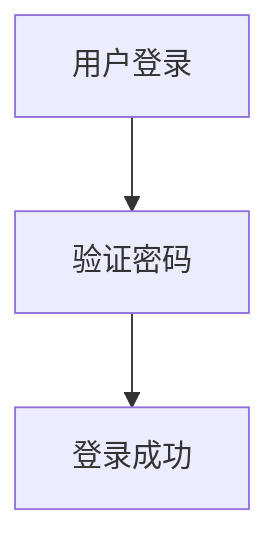

**强制规则**：

| 元素 | 规范 | 示例 |
|------|------|------|
| 节点 ID | 仅英文字母、数字、下划线 | `Node_01`、`UserLogin` |
| 标签转义 | 含特殊字符时用双引号包裹 | `Data["数据集 (v1.0)"]` |
| 特殊字符 | `()`, `{}`, `[]`, `""`, `#` 需转义 | `Node["#核心模块"]` |

#### 方向选择

| 方向 | 代码 | 适用场景 | 注意事项 |
|------|------|----------|----------|
| 从上到下 | `flowchart TD` / `TB` | **推荐默认**，流程图、层级结构 | 与文档流一致 |
| 从左到右 | `flowchart LR` | 时间线、管道流程 | 窄屏可能截断 |
| 从下到上 | `flowchart BT` | 反向流程 | 较少使用 |
| 从右到左 | `flowchart RL` | 特殊场景 | 较少使用 |

#### 子图（Subgraph）规范

**必须显式声明子图方向**，防止继承父级导致布局混乱：

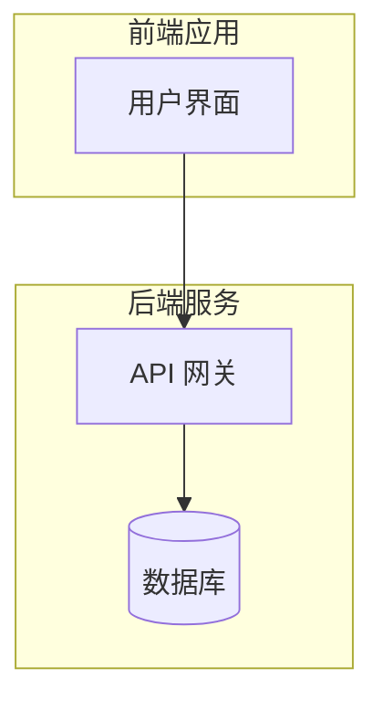

#### 节点形状

| 形状 | 语法 | 含义 | 示例 |
|------|------|------|------|
| 矩形 | `A[文本]` | 普通步骤 | `Step[处理数据]` |
| 圆角矩形 | `A(文本)` | 开始/结束 | `Start(开始)` |
| 体育场形 | `A([文本])` | 终端节点 | `End([结束])` |
| 菱形 | `A{文本}` | 判断/分支 | `Check{是否有效?}` |
| 六边形 | `A{{文本}}` | 准备步骤 | `Prep{{初始化}}` |
| 圆形 | `A((文本))` | 连接点 | `Link((A))` |
| 圆柱体 | `A[(文本)]` | 数据库 | `DB[(MySQL)]` |
| 旗帜形 | `A>文本]` | 异步操作 | `Async>发送消息]` |

### 时序图（Sequence Diagram）

#### 别名机制

**强制使用** `participant A as Alias` 语法，控制显示宽度：

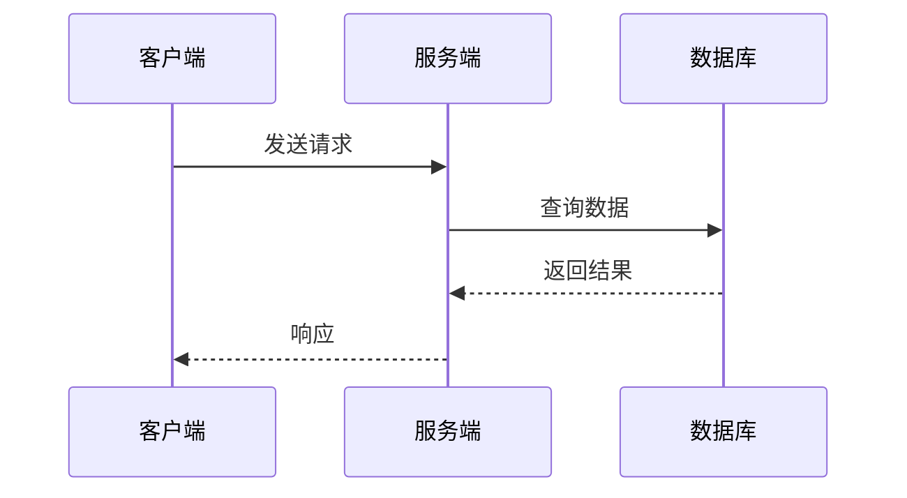

#### 长文本换行

超过 15 个汉字的消息文本，使用 `<br/>` 强制换行：

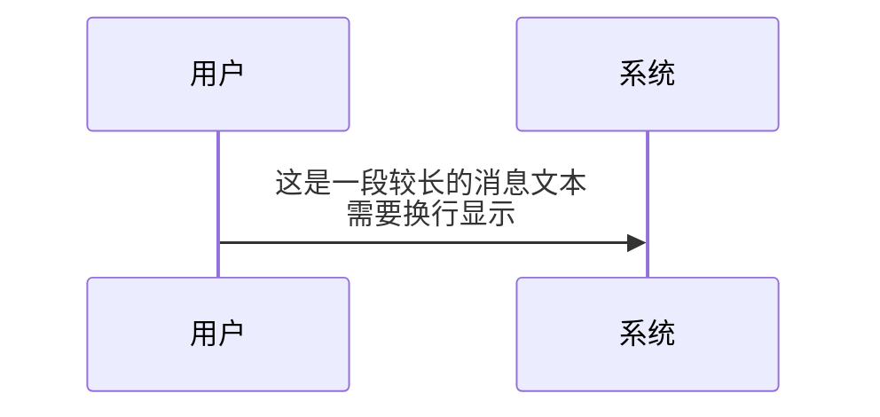

### 类图（Class Diagram）

#### 字体修复

Obsidian 默认类图字体过小（<10px），**必须**注入初始化指令：

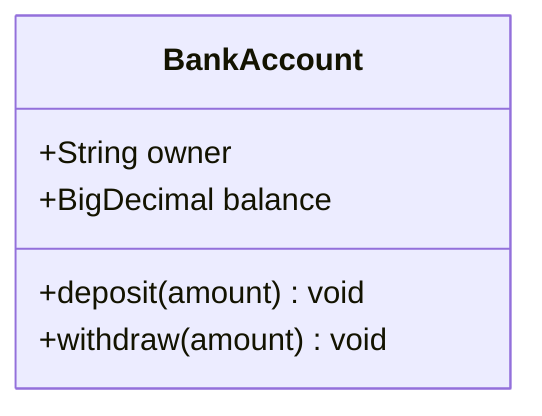

### 状态图（State Diagram）

**强制使用 `stateDiagram-v2`**，旧版在处理复合状态时有 Bug：

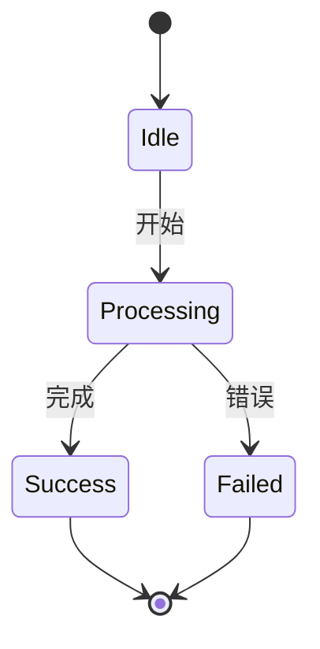

### 甘特图（Gantt）

日期格式必须严格匹配，推荐 `YYYY-MM-DD`：

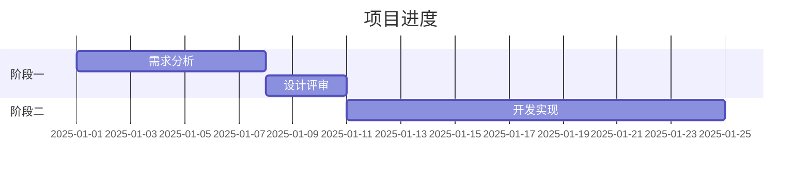

### ER 图（Entity Relationship）

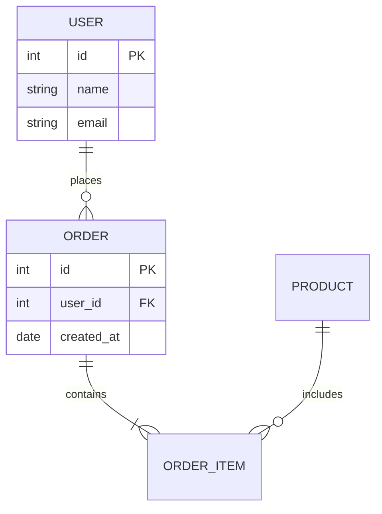

---

## 样式与主题适配

### 初始化指令模板

**必须注入**以下配置，确保 Dark/Light Mode 均可读：

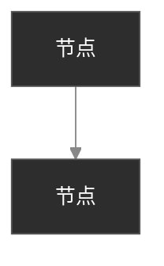

### 主题策略选择

| 策略 | 适用场景 | 说明 |
|------|----------|------|
| `base` + 变量覆盖 | **推荐默认** | 完全控制颜色，适配任意主题 |
| `forest` | 快速回退 | 高对比度，明暗模式均可读 |
| `dark` | 仅深色模式 | 不推荐，浅色模式不兼容 |
| `default` | 避免使用 | 深色模式下文字可能不可见 |

### 颜色安全映射表

**使用十六进制颜色码**，避免 CSS 变量（Mermaid 解析器支持不稳定）：

| 属性 | 推荐值 | 说明 |
|------|--------|------|
| `primaryColor` | `#2d2d2d` | 节点背景，深色底配白字 |
| `primaryTextColor` | `#ffffff` | 节点文字 |
| `lineColor` | `#888888` | 连线颜色，灰色明暗均可见 |
| `edgeLabelBackground` | `#333333` | 线条标签背景 |
| `primaryBorderColor` | `#555555` | 节点边框 |

### classDef 规范

定义样式类时，**必须同时指定 fill、color、stroke**：

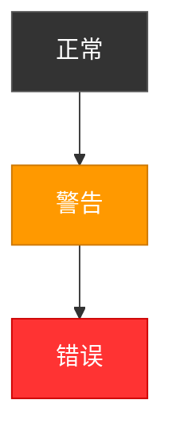

---

## 布局引擎

### Dagre vs ELK

| 引擎 | 特点 | 适用场景 |
|------|------|----------|
| `dagre`（默认） | 图表较宽，连线可能复杂折线 | 简单树状图（层级 <5） |
| `elk` | 更紧凑，减少连线交叉 | 复杂网络图（交叉连接多） |

### 启用 ELK

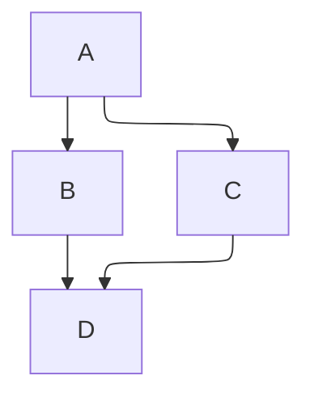

---

## 故障规避

### PDF 导出空白

**原因**：导出引擎在 SVG 未完全渲染时截图

**规避策略**：

1. 避免 `opacity < 1` 的颜色
2. 避免极复杂的嵌套子图
3. 导出前切换到阅读视图，等待完全加载

### 文本截断

某些主题中节点文本被边框切断。**解决**：在标签前后添加非换行空格：

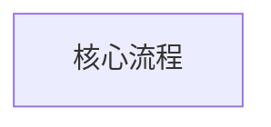

### 常见错误

| 错误 | 原因 | 解决 |
|------|------|------|
| `No diagram type detected` | 使用了不支持的图表类型 | 检查兼容性矩阵 |
| 节点文字消失 | 深色填充 + 黑色文字 | 使用 classDef 指定 color |
| 连线重叠 | 节点过多 | 拆分子图或使用 ELK |
| 子图布局混乱 | 未指定 `direction` | 显式声明子图方向 |

---

## 代码生成模板

### 标准 Flowchart 模板

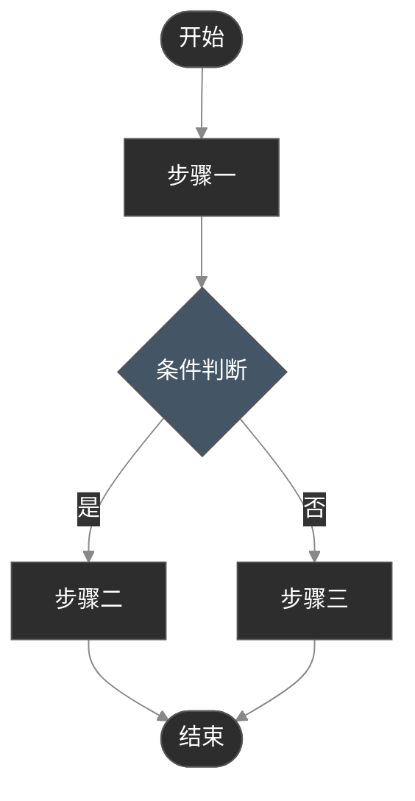

### 架构图完整示例

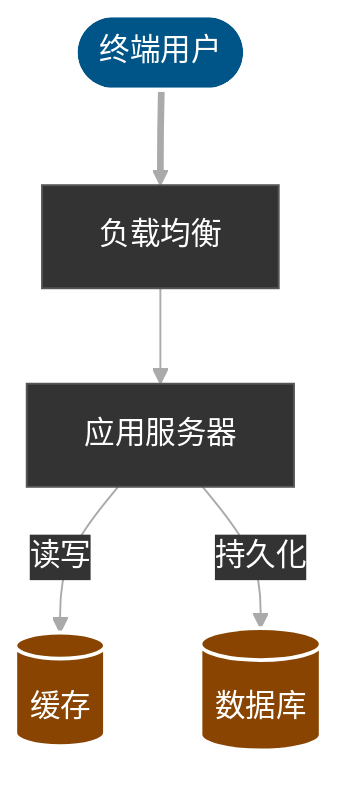
