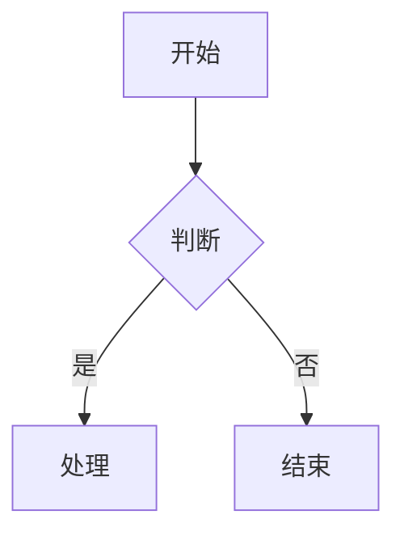

# docs 目录使用指南

本目录是项目的知识管理中心，使用 Obsidian 管理，记录开发日志、Bug、学习材料、每日学习总结和架构决策。

## 目录结构

```
docs/
├── devlog/           # 开发日志
│   ├── daily/        # 每日日志
│   ├── weekly/       # 周报
│   └── monthly/      # 月报
├── bugs/             # Bug 记录
│   └── {YYYY}/{MM}/  # 按年月组织
├── learning/         # 详细学习材料（教程式）
│   └── {topic}/      # 按主题组织
├── til/              # 每日学习总结（TIL）
│   └── {YYYY}/{MM}/  # 按年月组织
├── decisions/        # ADR 架构决策记录
├── templates/        # 模板文件（参考用，不要修改）
└── _MOC.md           # 主索引
```

## 文档类型说明

| 类型 | 目录 | 触发时机 | 粒度 |
|------|------|----------|------|
| **Learning** | `learning/{topic}/` | 学完一个章节/知识点 | 完整教程 |
| **TIL** | `til/{YYYY}/{MM}/` | 一天学习结束后 | 每日汇总 |
| **Bug** | `bugs/{YYYY}/{MM}/` | 修复非平凡 Bug | 单个问题 |
| **ADR** | `decisions/` | 做出架构决策 | 单个决策 |
| **Devlog** | `devlog/daily/` | 每天开发结束 | 每日记录 |

---

## 各类型详细说明

### Learning 详细学习材料 (`learning/`)

**触发条件**：完成了一个知识点/章节的详细讲解，需要保存完整内容

**特点**：
- 包含详细的概念讲解、示例、图表
- 按主题/系列组织
- 是可以日后反复查阅的**完整教程**

**目录结构**：
```
learning/
├── observability/           # 主题目录
│   ├── _index.md            # 系列索引
│   ├── 01-core-concepts.md  # 章节文件
│   ├── 02-metrics.md
│   └── 03-logs.md
└── spring-batch/
    ├── _index.md
    └── 01-fundamentals.md
```

**命名规范**：`learning/{topic}/{NN}-{slug}.md`

**使用命令**：`/note learning`

---

### TIL 每日学习总结 (`til/`)

**触发条件**：一天的学习结束后，用户主动调用

**重要说明**：
- ❌ 不是学完一个小节就创建
- ✅ 是一天结束后的学习汇总
- ✅ 汇总当天的多个 learning 文件

**目录结构**：
```
til/
├── _MOC.md
├── 2025/
│   ├── 11/
│   │   ├── 2025-11-28-observability-basics.md
│   │   └── 2025-11-29-metrics-deep-dive.md
│   └── 12/
│       └── 2025-12-01-logs-and-tracing.md
```

**命名规范**：`til/{YYYY}/{MM}/{YYYY-MM-DD}-{slug}.md`

**使用命令**：
```bash
/note til                           # 根据 git 历史自动汇总
/note til 今天学了可观测性基础       # 带说明的学习总结
```

**Frontmatter**：
```yaml
---
date: 2025-11-28
tags: [observability, metrics, logs]
learning_series: observability
chapters_completed: [01, 02]
---
```

---

### Bug 记录 (`bugs/`)

**触发条件**：
- 修复了一个非平凡的 Bug（需要调试超过 10 分钟）
- 发现了一个值得记录的坑或陷阱
- 用户明确要求记录

**命名规范**：`bugs/{YYYY}/{MM}/BUG-{NNN}-{slug}.md`

**示例**：`bugs/2025/11/BUG-001-transaction-not-rollback.md`

**使用命令**：`/note bug`

**模板选择**：
- 日常小问题 → `templates/bug-simple.md`
- 架构性问题（需要根因分析）→ `templates/bug-detailed.md`

**Frontmatter**：
```yaml
---
id: BUG-2025-001
date: 2025-11-27
severity: low | medium | high | critical
status: open | fixed | wontfix
tags: [mybatis, spring-boot]
module: patra-ingest
resolved_at: 2025-11-28  # 仅 fixed 状态需要
---
```

---

### ADR 架构决策 (`decisions/`)

**触发条件**：
- 做出了重要的技术选型决策
- 改变了现有架构模式
- 用户明确要求记录

**命名规范**：`decisions/ADR-{NNN}-{slug}.md`

**示例**：`decisions/ADR-005-adopt-opentelemetry-grafana-stack.md`

**使用命令**：`/note adr`

**模板**：`templates/adr.md`

**Frontmatter**：
```yaml
---
id: ADR-005
date: 2025-11-28
status: proposed | accepted | deprecated | superseded
tags: [architecture, decision]
---
```

---

### 开发日志 (`devlog/`)

**触发条件**：
- 每天开发结束时（晚上或凌晨）
- 用户执行 `/devlog` 命令

**使用命令**：
```bash
/devlog                    # 生成今日开发日志
/devlog 08:00-23:00        # 指定时间范围
/devlog 2025-11-26         # 生成指定日期的日志
/devlog-week               # 生成周报
/devlog-month              # 生成月报
```

**命名规范**：
- 每日日志：`devlog/daily/YYYY-MM-DD.md`
- 周报：`devlog/weekly/YYYY-Www.md`
- 月报：`devlog/monthly/YYYY-MM.md`

**Frontmatter（每日）**：
```yaml
---
date: 2025-11-27
type: devlog/daily
time_range: "06:00 - 23:30"
commits: 5
files_changed: 12
lines_added: 234
lines_deleted: 89
modules: [patra-catalog, patra-ingest]
tags: [mesh-import, xml-parser]
---
```

---

## Obsidian 链接语法（重要）

> **强制要求**：在 `docs/` 目录下创建或编辑文件时，引用其他文档必须使用 Obsidian 的 **Wikilink 语法**，而不是标准 Markdown 链接语法。

### 基本语法

| 用途 | Wikilink 语法 | 说明 |
|------|---------------|------|
| 链接到文件 | `[[文件名]]` | 不需要 `.md` 后缀 |
| 链接到路径 | `[[路径/文件名]]` | 相对于 vault 根目录 |
| 自定义显示文本 | `[[文件名\|显示文本]]` | 竖线后为显示的文字 |
| 链接到标题 | `[[文件名#标题]]` | 链接到文档内的某个标题 |
| 嵌入/预览 | `![[文件名]]` | 直接嵌入显示内容 |

### 示例

```markdown
# 正确 ✅ - Wikilink 语法
- 开发日志: [[devlog/daily/2025-11-27]]
- 相关 Bug: [[bugs/2025/11/BUG-001-xxx]]
- 学习材料: [[learning/observability/01-core-concepts|第一章：核心概念]]
- 每日总结: [[til/2025/11/2025-11-28-observability-basics]]
- 架构决策: [[decisions/ADR-005-xxx]]

# 错误 ❌ - 不要使用标准 Markdown 链接
- [开发日志](devlog/daily/2025-11-27.md)
```

### 为什么使用 Wikilink

1. **双向链接（Backlinks）**：Obsidian 自动追踪哪些文档链接到当前文档
2. **Graph View**：可视化文档间的关联关系
3. **悬停预览**：鼠标悬停在链接上可预览内容
4. **自动补全**：输入 `[[` 后 Obsidian 会自动提示可链接的文档
5. **重命名同步**：文件重命名时，所有指向它的链接会自动更新

---

## Mermaid 图表

> **强制要求**：所有流程图、架构图使用 Mermaid 语法，禁止使用 ASCII 艺术字符（`┌─┐│└┘▼` 等）。

### 基本语法



### 常用方向

| 方向 | 代码 | 适用场景 |
|------|------|----------|
| 从上到下 | `flowchart TD` | 流程图、层级结构 |
| 从左到右 | `flowchart LR` | 时间线、管道流程 |

### 节点样式

| 形状 | 语法 | 含义 |
|------|------|------|
| 矩形 | `A[文本]` | 普通步骤 |
| 圆角矩形 | `A(文本)` | 开始/结束 |
| 菱形 | `A{文本}` | 判断/分支 |
| 圆形 | `A((文本))` | 连接点 |

更多类型参考 [Mermaid 官方文档](https://mermaid.js.org/)。

---

## 任务列表

使用 Markdown 标准复选框语法，**禁止使用 emoji**（`✅ ⬜ 🔲`）：

| 状态 | 语法 | 渲染效果 |
|------|------|----------|
| 未完成 | `- [ ] 任务` | ☐ 任务 |
| 已完成 | `- [x] 任务` | ☑ 任务 |

### 扩展状态（可选）

| 状态 | 语法 | 含义 |
|------|------|------|
| 推迟 | `- [>] 任务` | 延后处理 |
| 待确认 | `- [?] 任务` | 需要确认 |
| 重要 | `- [!] 任务` | 高优先级 |
| 取消 | `- [-] 任务` | 已取消 |

---

## Callouts 提示框

使用 Obsidian 原生 Callout 语法（基于引用块），**禁止使用 emoji 模拟**：

### 基本语法

```markdown
> [!note] 标题（可选）
> 内容
```

### 常用类型

| 类型 | 语法 | 颜色 | 用途 |
|------|------|------|------|
| 笔记 | `[!note]` | 蓝色 | 一般说明 |
| 提示 | `[!tip]` | 青色 | 技巧建议 |
| 重要 | `[!important]` | 紫色 | 关键信息 |
| 警告 | `[!warning]` | 橙色 | 注意事项 |
| 危险 | `[!danger]` | 红色 | 严重警告 |
| 示例 | `[!example]` | 紫色 | 代码示例 |
| 引用 | `[!quote]` | 灰色 | 引用内容 |
| 信息 | `[!info]` | 蓝色 | 背景信息 |

### 折叠 Callout

使用 `+`（默认展开）或 `-`（默认折叠）：

```markdown
> [!note]- 点击展开
> 折叠的内容
```

---

## Frontmatter 元数据

每个文档必须在**文件开头**包含 YAML Frontmatter：

```yaml
---
title: 文档标题
date: 2025-11-28
tags: [tag1, tag2]
---
```

### 常用字段

| 字段 | 类型 | 说明 | 示例 |
|------|------|------|------|
| `title` | 字符串 | 文档标题 | `title: 核心概念` |
| `date` | 日期 | 创建/更新日期 | `date: 2025-11-28` |
| `tags` | 数组 | 标签列表 | `tags: [java, spring]` |
| `aliases` | 数组 | 文档别名 | `aliases: [别名1, 别名2]` |
| `cssclass` | 字符串 | 自定义样式类 | `cssclass: wide-page` |

### 注意事项

1. Frontmatter 必须位于文件**最开头**，前面不能有空行
2. 使用三个短横线 `---` 作为开始和结束标记
3. 字段名和冒号之间不能有空格，冒号后必须有空格

---

## 嵌入与引用

### 文件嵌入

| 用途 | 语法 | 说明 |
|------|------|------|
| 嵌入整个文件 | `![[文件名]]` | 显示完整内容 |
| 嵌入标题段落 | `![[文件名#标题]]` | 显示指定标题下的内容 |
| 嵌入块 | `![[文件名#^block-id]]` | 显示指定块 |
| 嵌入图片 | `![[image.png]]` | 显示图片 |
| 调整图片大小 | `![[image.png\|300]]` | 宽度 300px |

### 块引用

在段落末尾添加 `^block-id` 创建可引用的块：

```markdown
这是一段重要的内容 ^important-block
```

然后通过 `[[文件名#^important-block]]` 引用。

### 注意事项

- Block ID 只能包含字母、数字和短横线
- 嵌入是 Obsidian 特有语法，导出到其他平台时不兼容

---

## Dataview 查询

Dataview 用于动态生成内容列表，**禁止手动维护索引**。

### 基本语法

```dataview
<QUERY-TYPE> <fields>
FROM <source>
WHERE <condition>
SORT <field> <direction>
```

### 查询类型

| 类型 | 用途 | 示例 |
|------|------|------|
| `LIST` | 列表形式 | `LIST FROM "learning"` |
| `TABLE` | 表格形式 | `TABLE date, tags FROM "til"` |
| `TASK` | 任务列表 | `TASK WHERE !completed` |

### 常用示例

**列出某目录下的所有文件**：

```dataview
LIST FROM "docs/til/2025"
SORT date DESC
```

**显示带特定标签的文档**：

```dataview
TABLE date as 日期, file.name as 标题
FROM #observability
SORT date DESC
```

### 注意事项

- `_MOC.md` 文件中的 Dataview 查询会自动更新，**禁止手动修改**
- 查询结果依赖 Frontmatter 元数据，确保文档包含正确的字段

---

## 其他格式

### 高亮文本

使用双等号 `==文本==` 高亮，**禁止使用 HTML `<mark>` 标签**：

```markdown
==这是高亮文本==
```

### 脚注

**行内脚注**：`文本^[脚注内容]`

**引用脚注**：
- 引用位置：`文本[^1]`
- 定义位置：`[^1]: 脚注内容`

### 数学公式

**行内公式**：`$E = mc^2$`

**块级公式**：

```math
\sum_{i=1}^{n} x_i = x_1 + x_2 + ... + x_n
```

或使用双美元符号：`$$...$$`

### 代码块

始终指定语言标识以启用语法高亮：

| 语言 | 标识 |
|------|------|
| Java | `java` |
| YAML | `yaml` |
| SQL | `sql` |
| Shell | `bash` 或 `sh` |
| Prometheus 查询 | `promql` |
| Mermaid 图表 | `mermaid` |
| Dataview 查询 | `dataview` |

---

## 相关命令

| 命令 | 用途 |
|------|------|
| `/note bug` | 记录 Bug |
| `/note learning` | 保存详细学习材料 |
| `/note til` | 创建每日学习总结 |
| `/note adr` | 记录架构决策 |
| `/note` | 根据上下文自动推断类型 |
| `/devlog` | 生成开发日志 |
| `/devlog-week` | 生成周报 |
| `/devlog-month` | 生成月报 |

---

## 注意事项

1. **不要修改 `templates/` 目录下的文件**，它们是模板参考
2. **不要手动修改 `_MOC.md` 文件**，它们包含 Dataview 查询，会自动生成索引
3. **使用中文编写内容**，但文件名使用英文
4. **Learning vs TIL**：Learning 是详细教程（学完一章节保存），TIL 是每日汇总（一天结束后创建）
5. **及时记录**，趁记忆清晰时写下来
