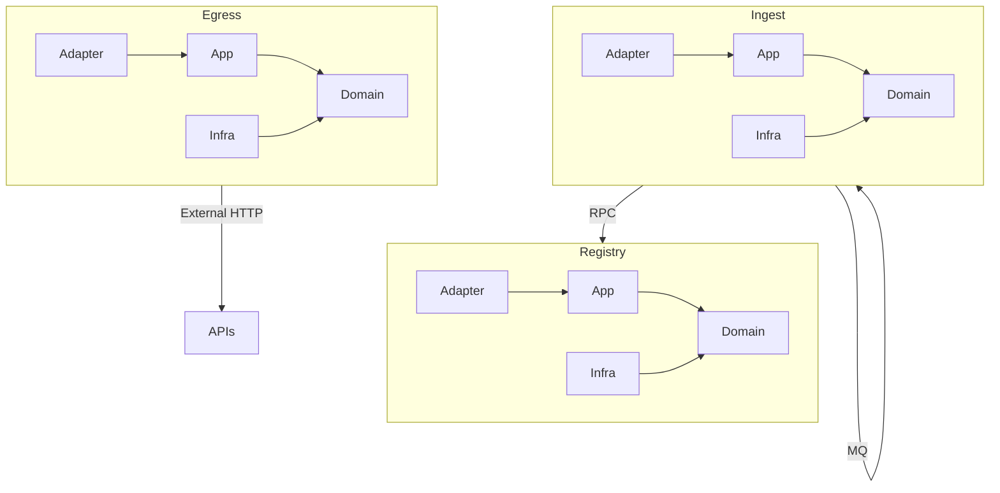

# C4 Container

## Containers/Services
- patra-ingest — plans, slices, execution, outbox relay
- patra-registry — provenance metadata and configuration
- patra-egress-gateway — outbound HTTP with resilience envelope
- patra-gateway-boot — API Gateway entrypoint (edge)
- Shared libraries — patra-common, expr-kernel, starters

## Responsibilities per Container
- Ingest: orchestrate use cases (plan, execute, outbox), publish/consume events
- Registry: expose RPC for provenance and expr snapshots
- Egress: expose internal RPC to perform external HTTP call with envelope

## Data Stores
- MySQL per service (ingest, registry)
- Redis for leases/checkpoints
- RocketMQ for events/outbox relay

## Communication (sync/async)
- Sync: Feign RPC between services
- Async: RocketMQ topics for task ready and outbox relay

## Cross-Cutting Concerns
- Config via Nacos/env
- Security via gateway and config
- Observability via SkyWalking, SLF4J logs, Micrometer metrics

