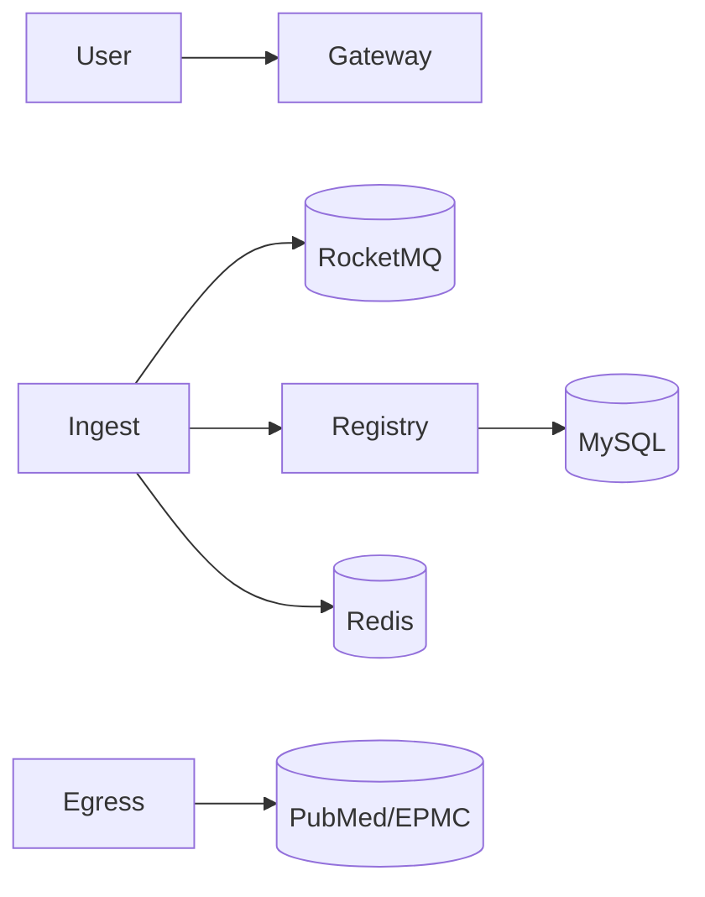

Purpose
- Papertrace ingests medical literature from multiple provenances, normalizes and enriches it, and exposes search/analysis capabilities.

Primary Users and External Systems
- Internal teams and downstream services needing standardized literature data
- External provenance APIs: PubMed, Europe PMC
- Infra: MySQL, Redis, RocketMQ, Nacos, SkyWalking

System Responsibilities
- Ingest plans and task execution orchestration
- Provenance registry and configuration
- Egress gateway for controlled external HTTP calls
- Common domain and starters for cross-cutting concerns

High-Level Interactions
- Ingest pulls configs from Registry, compiles expressions, plans tasks, publishes TaskReady events, executes batches, and relays outbox events to RocketMQ
- Egress Gateway performs outbound HTTP calls with unified envelopes

Key Quality Attributes
- Reliability via outbox, idempotency, retries
- Observability via traces/logs/metrics
- Clear boundaries and contracts across services

