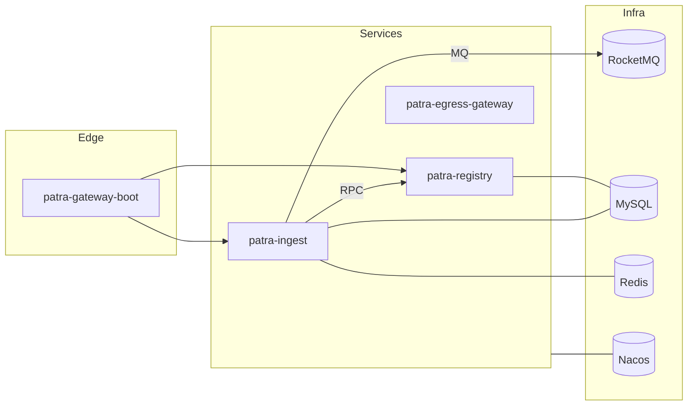

Deployment Topology

Runtime Environments
- Local (Docker Compose): `docker/compose` provides MySQL, Redis, RocketMQ, Nacos, Elasticsearch (optional).
- Services: launched via Spring Boot per module; gateway runs at edge.

Core Components (Local Defaults)
- MySQL: provision per service schemas; Flyway migrations in `*-infra` modules.
- Redis: leases and checkpoints for ingest execution.
- RocketMQ: async events and outbox relay topics.
- Nacos: configuration source; environment variables for secrets.
- SkyWalking: tracing backend (optional local deployment).

Network Topology (Mermaid)

Deployment Notes
- Services are independent deployables; prefer per-service DBs and isolated schemas.
- Health endpoints and readiness probes should gate traffic during startup/migrations.
- Versioning and rollback described in `operations/Release-Versioning.md`.

