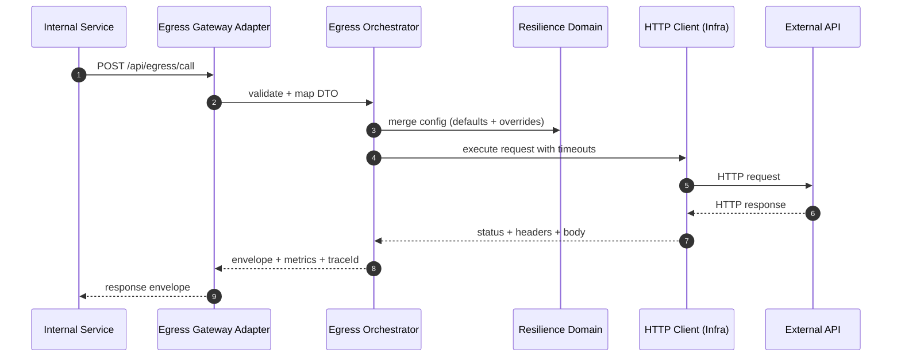

# Core Sequences

## Plan → TaskReady → Execute → Outbox Relay

```mermaid
sequenceDiagram
  autonumber
  participant Job as Scheduler Job (Adapter)
  participant App as PlanIngestionOrchestrator (App)
  participant Dom as Domain Aggregates
  participant Reg as Registry Service
  participant DB as Ingest DB
  participant MQ as RocketMQ

  Job->>App: trigger(plan request)
  App->>Reg: load provenance config snapshot
  App->>Dom: resolve window + build plan
  App->>DB: persist plan/slices/tasks (idempotent)
  App->>MQ: publish TaskReady events (outbox)
  Note over App,MQ: Outbox relay may publish asynchronously

  MQ-->>Adapter: TaskReady consumed (ingestTaskReadyConsumer)
  Adapter->>App: execute(taskId)
  App->>DB: acquire lease; read task state
  App->>Dom: batch execution with checkpoints
  App->>DB: persist results; advance cursor
  App->>MQ: publish outbox messages (if any)

  App->>DB: mark task complete; release lease
```

## Egress Call (Internal RPC)


