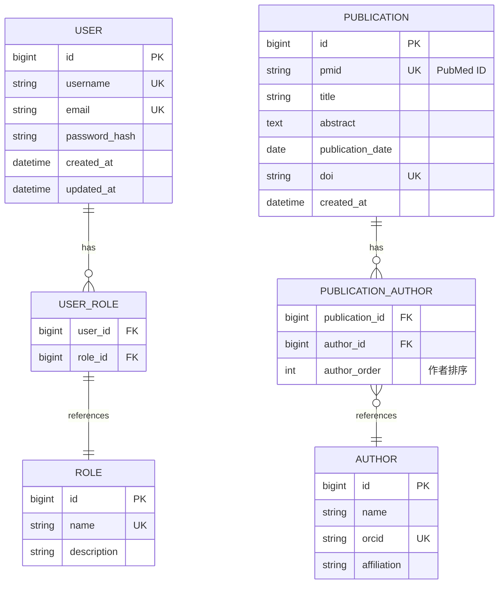

# Patra 数据库设计示例

## 0. 背景与设计目标

### 0.1 业务背景

**业务场景:**
Patra 是一个医学文献数据平台,需要从 PubMed、Europe PMC、Crossref 等 10+ 数据源采集医学文献元数据。本数据库设计聚焦于以下核心业务:

1. **文献采集与存储** - 从多个数据源采集文献元数据并去重
2. **用户权限管理** - 支持多租户、基于角色的访问控制
3. **作者关系管理** - 追踪作者与出版物的多对多关系
4. **数据质量保证** - 通过唯一标识符(PMID/DOI)防止重复数据

**业务痛点:**
- 不同数据源对同一文献的标识符不统一(PMID vs DOI vs 内部ID)
- 作者信息在不同数据源中格式不一致,需要规范化处理
- 需要支持增量更新和全量同步两种数据采集模式

---

### 0.2 设计目标

**优先级 P0 (必须满足):**
- ✅ **数据一致性** - 通过唯一约束和外键保证数据完整性
- ✅ **查询性能** - 支持按标题、摘要全文搜索,响应时间 < 500ms
- ✅ **可扩展性** - 设计支持未来添加新的数据源和字段

**优先级 P1 (重要):**
- 🎯 **审计追踪** - 记录数据的创建和更新时间
- 🎯 **多租户支持** - 通过用户角色隔离数据访问权限

**优先级 P2 (可选):**
- 💡 **历史版本** - 未来可能需要追踪文献元数据的变更历史
- 💡 **数据血缘** - 记录数据来源和转换过程(Provenance)

---

### 0.3 技术约束

**技术栈:**
- 数据库: MySQL 8.0+ (InnoDB 引擎)
- ORM: MyBatis-Plus 3.5.x
- 应用框架: Spring Boot 3.5.7
- 字符集: UTF-8 (utf8mb4)

**性能要求:**
- 单表数据量: Publication 预计 1000 万条,Author 预计 500 万条
- 查询 QPS: 峰值 1000 QPS
- 写入 TPS: 批量导入 10000 条/秒

**架构约束:**
- 遵循六边形架构 + DDD 原则
- 数据库设计需支持最终一致性(事件驱动架构)
- 不使用数据库级联删除(由应用层控制)

---

### 0.4 相关系统

**上游系统:**
- **patra-ingest** - 数据采集服务,负责从外部数据源拉取数据
- **patra-registry** - 配置中心,提供数据源配置和字典服务

**下游系统:**
- **patra-search** - 全文搜索服务(基于 Elasticsearch)
- **patra-export** - 数据导出服务,支持导出为 CSV/JSON/RIS 格式

**依赖服务:**
- **Nacos** - 服务注册与配置管理
- **RocketMQ** - 异步消息队列,用于数据变更事件

---

### 0.5 关键假设

1. **唯一标识符假设**
   - PMID 在 PubMed 数据源中具有全局唯一性
   - DOI 在所有数据源中具有全局唯一性
   - 同一文献在不同数据源中至少有一个标识符相同

2. **数据更新频率假设**
   - 文献元数据变更频率低(<1% 每月)
   - 作者信息相对稳定,不频繁更新
   - 用户数据变更频率中等(日活用户 1000 人)

3. **查询模式假设**
   - 80% 查询为按标题/摘要的全文搜索
   - 15% 查询为按作者、期刊、发表日期的精确查询
   - 5% 查询为复杂的关联查询(如"某作者的所有合作者")

4. **数据质量假设**
   - 10% 的文献没有摘要
   - 5% 的文献没有 DOI
   - 作者排序(author_order)在源数据中可能缺失,需要应用层补充

---

### 0.6 数据规模预估

| 实体 | 初始数据量 | 年增长量 | 5 年后规模 |
|------|-----------|---------|-----------|
| Publication | 100 万 | 200 万/年 | 1100 万 |
| Author | 50 万 | 100 万/年 | 550 万 |
| User | 100 | 500/年 | 2600 |
| Publication-Author (关联) | 500 万 | 1000 万/年 | 5500 万 |

**存储空间预估:**
- Publication 表: 平均 2KB/行 × 1100 万 ≈ 22 GB
- Author 表: 平均 0.5KB/行 × 550 万 ≈ 2.75 GB
- Publication-Author 关联表: 平均 0.1KB/行 × 5500 万 ≈ 5.5 GB
- **总计(含索引):** 约 50 GB

---

### 0.7 标准审计字段规范

**所有业务表必须包含以下审计字段:**

```sql
-- ==================== 审计字段 ====================
-- 变更追踪
`record_remarks`    JSON            NULL COMMENT 'JSON 数组, 备注/变更日志 [{"time":"2025-08-18 15:00:00","by":"John Doe","note":"xxx"}]',
`version`           BIGINT UNSIGNED NOT NULL DEFAULT 0 COMMENT '乐观锁版本号',
`ip_address`        VARBINARY(16)   NULL COMMENT '请求者IP (二进制, 支持 IPv4/IPv6)',

-- 创建信息
`created_at`        TIMESTAMP(6)    NOT NULL DEFAULT CURRENT_TIMESTAMP(6) COMMENT '创建时间 (UTC)',
`created_by`        BIGINT UNSIGNED NULL COMMENT '创建人ID',
`created_by_name`   VARCHAR(100)    NULL COMMENT '创建人姓名',

-- 更新信息
`updated_at`        TIMESTAMP(6)    NOT NULL DEFAULT CURRENT_TIMESTAMP(6) ON UPDATE CURRENT_TIMESTAMP(6) COMMENT '更新时间 (UTC)',
`updated_by`        BIGINT UNSIGNED NULL COMMENT '更新人ID',
`updated_by_name`   VARCHAR(100)    NULL COMMENT '更新人姓名',

-- 软删除
`deleted`           TINYINT(1)      NOT NULL DEFAULT 0 COMMENT '软删除: 0=活动, 1=已删除',
```

### 0.8 索引设计原则

**单列索引选择性要求:**

索引选择性(Index Selectivity) = 不同值的数量 / 总行数

| 选择性范围 | 是否适合单列索引 | 示例 |
|-----------|----------------|------|
| > 0.8 | ✅ 强烈推荐 | 主键、PMID、DOI、邮箱 |
| 0.3 - 0.8 | ✅ 可以考虑 | 用户名、期刊名称 |
| 0.1 - 0.3 | ⚠️ 需评估 | 发表年份、数据源 |
| < 0.1 | ❌ 不推荐 | 状态标志、性别、软删除标志 |

**软删除字段的索引策略:**

`deleted` 字段只有 0 和 1 两个值,区分度极低,**不应该单独建立索引**。

正确的策略:
1. **不建索引** - 如果未删除记录占 > 95%,不需要任何索引
2. **组合索引** - 将 `deleted` 作为组合索引的一部分:
   ```sql
   -- ✅ 正确: 高选择性字段在前
   KEY `idx_username_deleted` (`username`, `deleted`)
   KEY `idx_created_at_deleted` (`created_at`, `deleted`)

   -- ❌ 错误: 低选择性字段在前
   KEY `idx_deleted_username` (`deleted`, `username`)
   ```

3. **查询改写** - 优化器通常会忽略低选择性索引:
   ```sql
   -- 查询未删除记录时,MySQL 会优先使用其他高选择性索引
   SELECT * FROM user
   WHERE deleted = 0 AND username = 'john'
   -- 执行计划: 使用 uk_username,而非 idx_deleted
   ```

**常见低选择性字段:**
- `deleted` (软删除标志: 0/1)
- `status` (状态标志: 0/1/2)
- `gender` (性别: M/F)
- `is_active` (激活标志: 0/1)

这些字段应该:
- 作为过滤条件,但不建立单独索引
- 或与高选择性字段组合成复合索引

---

## 1. 整体架构 (Mermaid ER 图)



## 2. 详细表设计

### 2.1 用户表 (user)

**业务字段:**

| 字段名 | 类型 | 约束 | 说明 |
|-------|------|------|------|
| id | BIGINT UNSIGNED | PK, AUTO_INCREMENT | 主键 |
| username | VARCHAR(50) | NOT NULL, UNIQUE | 用户名 |
| email | VARCHAR(100) | NOT NULL, UNIQUE | 邮箱 |
| password_hash | VARCHAR(255) | NOT NULL | 密码哈希(bcrypt) |
| status | TINYINT | NOT NULL, DEFAULT 1 | 状态: 0=禁用, 1=启用 |

**审计字段:** (参见 0.8 标准审计字段规范)

| 字段名 | 类型 | 约束 | 说明 |
|-------|------|------|------|
| record_remarks | JSON | NULL | 备注/变更日志 |
| version | BIGINT UNSIGNED | NOT NULL, DEFAULT 0 | 乐观锁版本号 |
| ip_address | VARBINARY(16) | NULL | 请求者IP |
| created_at | TIMESTAMP(6) | NOT NULL, DEFAULT CURRENT_TIMESTAMP(6) | 创建时间(UTC) |
| created_by | BIGINT UNSIGNED | NULL | 创建人ID |
| created_by_name | VARCHAR(100) | NULL | 创建人姓名 |
| updated_at | TIMESTAMP(6) | NOT NULL, DEFAULT CURRENT_TIMESTAMP(6) ON UPDATE CURRENT_TIMESTAMP(6) | 更新时间(UTC) |
| updated_by | BIGINT UNSIGNED | NULL | 更新人ID |
| updated_by_name | VARCHAR(100) | NULL | 更新人姓名 |
| deleted | TINYINT(1) | NOT NULL, DEFAULT 0 | 软删除标志 |

**索引:**
- PRIMARY KEY: `id`
- UNIQUE KEY: `uk_username` (`username`)
- UNIQUE KEY: `uk_email` (`email`)
- KEY: `idx_status` (`status`)
- KEY: `idx_created_at` (`created_at`)

**索引说明:**
- ⚠️ `deleted` 字段区分度低(< 0.1),不建立单独索引
- ⚠️ `status` 字段区分度可能较低,需根据实际数据分布评估
- 如需同时过滤 `deleted=0 AND status=1`,可考虑组合索引 `idx_status_deleted`

**业务规则:**
- 用户名 3-50 字符,仅允许字母、数字、下划线
- 邮箱必须符合 RFC 5322 标准
- 密码哈希使用 BCrypt,强度因子 10
- 用户删除采用软删除,保留审计记录

---

### 2.2 出版物表 (publication)

**业务字段:**

| 字段名 | 类型 | 约束 | 说明 |
|-------|------|------|------|
| id | BIGINT UNSIGNED | PK, AUTO_INCREMENT | 主键 |
| pmid | VARCHAR(20) | NOT NULL, UNIQUE | PubMed ID |
| doi | VARCHAR(100) | UNIQUE | 数字对象标识符 |
| title | VARCHAR(500) | NOT NULL | 标题 |
| abstract | TEXT | NULL | 摘要 |
| publication_date | DATE | NULL | 发表日期 |
| journal | VARCHAR(200) | NULL | 期刊名称 |
| source | VARCHAR(50) | NOT NULL | 数据源: PUBMED, EPMC, etc. |

**审计字段:** (参见 0.8 标准审计字段规范)

| 字段名 | 类型 | 约束 | 说明 |
|-------|------|------|------|
| record_remarks | JSON | NULL | 备注/变更日志(如数据修正记录) |
| version | BIGINT UNSIGNED | NOT NULL, DEFAULT 0 | 乐观锁版本号 |
| ip_address | VARBINARY(16) | NULL | 请求者IP |
| created_at | TIMESTAMP(6) | NOT NULL, DEFAULT CURRENT_TIMESTAMP(6) | 创建时间(UTC) |
| created_by | BIGINT UNSIGNED | NULL | 创建人ID(系统导入为NULL) |
| created_by_name | VARCHAR(100) | NULL | 创建人姓名(系统导入为"System") |
| updated_at | TIMESTAMP(6) | NOT NULL, DEFAULT CURRENT_TIMESTAMP(6) ON UPDATE CURRENT_TIMESTAMP(6) | 更新时间(UTC) |
| updated_by | BIGINT UNSIGNED | NULL | 更新人ID |
| updated_by_name | VARCHAR(100) | NULL | 更新人姓名 |
| deleted | TINYINT(1) | NOT NULL, DEFAULT 0 | 软删除标志 |

**索引:**
- PRIMARY KEY: `id`
- UNIQUE KEY: `uk_pmid` (`pmid`)
- UNIQUE KEY: `uk_doi` (`doi`)
- KEY: `idx_publication_date` (`publication_date`)
- KEY: `idx_source` (`source`)
- KEY: `idx_created_at` (`created_at`)
- FULLTEXT KEY: `ft_title_abstract` (`title`, `abstract`)

**索引说明:**
- ⚠️ `deleted` 字段区分度低,不建立单独索引
- ✅ 全文索引 `ft_title_abstract` 用于支持标题和摘要的关键词搜索
- ⚠️ `source` 字段区分度取决于数据源数量(10+),需根据实际查询模式评估

**业务规则:**
- PMID 必须是纯数字字符串
- DOI 格式验证: `10.\d{4,}/.*`
- 标题不能为空字符串
- publication_date 允许部分日期(如仅年份)
- 系统自动导入的数据 `created_by` 为 NULL,`created_by_name` 为 "System"
- 人工修正的数据应在 `record_remarks` 中记录修正原因

---

## 3. 对应的 SQL DDL (执行标准)

```sql
-- ============================================================
-- 用户表
-- ============================================================
CREATE TABLE `user` (
  -- 主键
  `id` BIGINT UNSIGNED NOT NULL AUTO_INCREMENT COMMENT '主键',

  -- 业务字段
  `username` VARCHAR(50) NOT NULL COMMENT '用户名',
  `email` VARCHAR(100) NOT NULL COMMENT '邮箱',
  `password_hash` VARCHAR(255) NOT NULL COMMENT '密码哈希',
  `status` TINYINT NOT NULL DEFAULT 1 COMMENT '状态: 0=禁用, 1=启用',

  -- 审计字段
  `record_remarks` JSON NULL COMMENT 'JSON 数组, 备注/变更日志',
  `version` BIGINT UNSIGNED NOT NULL DEFAULT 0 COMMENT '乐观锁版本号',
  `ip_address` VARBINARY(16) NULL COMMENT '请求者IP (二进制, 支持 IPv4/IPv6)',
  `created_at` TIMESTAMP(6) NOT NULL DEFAULT CURRENT_TIMESTAMP(6) COMMENT '创建时间 (UTC)',
  `created_by` BIGINT UNSIGNED NULL COMMENT '创建人ID',
  `created_by_name` VARCHAR(100) NULL COMMENT '创建人姓名',
  `updated_at` TIMESTAMP(6) NOT NULL DEFAULT CURRENT_TIMESTAMP(6) ON UPDATE CURRENT_TIMESTAMP(6) COMMENT '更新时间 (UTC)',
  `updated_by` BIGINT UNSIGNED NULL COMMENT '更新人ID',
  `updated_by_name` VARCHAR(100) NULL COMMENT '更新人姓名',
  `deleted` TINYINT(1) NOT NULL DEFAULT 0 COMMENT '软删除: 0=活动, 1=已删除',

  -- 索引
  PRIMARY KEY (`id`),
  UNIQUE KEY `uk_username` (`username`),
  UNIQUE KEY `uk_email` (`email`),
  KEY `idx_status` (`status`),
  KEY `idx_created_at` (`created_at`)
  -- 注意: deleted 字段区分度低,不建立单独索引
) ENGINE=InnoDB DEFAULT CHARSET=utf8mb4 COLLATE=utf8mb4_unicode_ci COMMENT='用户表';

-- ============================================================
-- 出版物表
-- ============================================================
CREATE TABLE `publication` (
  -- 主键
  `id` BIGINT UNSIGNED NOT NULL AUTO_INCREMENT COMMENT '主键',

  -- 业务字段
  `pmid` VARCHAR(20) NOT NULL COMMENT 'PubMed ID',
  `doi` VARCHAR(100) DEFAULT NULL COMMENT 'DOI',
  `title` VARCHAR(500) NOT NULL COMMENT '标题',
  `abstract` TEXT COMMENT '摘要',
  `publication_date` DATE DEFAULT NULL COMMENT '发表日期',
  `journal` VARCHAR(200) DEFAULT NULL COMMENT '期刊名称',
  `source` VARCHAR(50) NOT NULL COMMENT '数据源',

  -- 审计字段
  `record_remarks` JSON NULL COMMENT 'JSON 数组, 备注/变更日志',
  `version` BIGINT UNSIGNED NOT NULL DEFAULT 0 COMMENT '乐观锁版本号',
  `ip_address` VARBINARY(16) NULL COMMENT '请求者IP (二进制, 支持 IPv4/IPv6)',
  `created_at` TIMESTAMP(6) NOT NULL DEFAULT CURRENT_TIMESTAMP(6) COMMENT '创建时间 (UTC)',
  `created_by` BIGINT UNSIGNED NULL COMMENT '创建人ID (系统导入为 NULL)',
  `created_by_name` VARCHAR(100) NULL COMMENT '创建人姓名 (系统导入为 "System")',
  `updated_at` TIMESTAMP(6) NOT NULL DEFAULT CURRENT_TIMESTAMP(6) ON UPDATE CURRENT_TIMESTAMP(6) COMMENT '更新时间 (UTC)',
  `updated_by` BIGINT UNSIGNED NULL COMMENT '更新人ID',
  `updated_by_name` VARCHAR(100) NULL COMMENT '更新人姓名',
  `deleted` TINYINT(1) NOT NULL DEFAULT 0 COMMENT '软删除: 0=活动, 1=已删除',

  -- 索引
  PRIMARY KEY (`id`),
  UNIQUE KEY `uk_pmid` (`pmid`),
  UNIQUE KEY `uk_doi` (`doi`),
  KEY `idx_publication_date` (`publication_date`),
  KEY `idx_source` (`source`),
  KEY `idx_created_at` (`created_at`),
  FULLTEXT KEY `ft_title_abstract` (`title`, `abstract`)
  -- 注意: deleted 字段区分度低,不建立单独索引
) ENGINE=InnoDB DEFAULT CHARSET=utf8mb4 COLLATE=utf8mb4_unicode_ci COMMENT='出版物表';
```

---

## 4. 领域模型映射 (DDD)

### Aggregate Root: Publication

```java
@Entity
@Table(name = "publication")
public class Publication {
    @Id
    @GeneratedValue(strategy = GenerationType.IDENTITY)
    private Long id;

    @Column(nullable = false, unique = true, length = 20)
    private String pmid;

    @Column(unique = true, length = 100)
    private String doi;

    @Column(nullable = false, length = 500)
    private String title;

    @Lob
    private String abstractText;

    // ... 其他字段和业务方法
}
```

---

## 5. 设计决策记录 (ADR)

### ADR-001: 选择 PMID 作为出版物唯一标识

**日期:** 2025-11-17
**状态:** 已采纳

**背景:**
出版物需要唯一标识符,候选方案包括:
1. 自增 ID
2. PMID (PubMed ID)
3. DOI (Digital Object Identifier)

**决策:**
使用自增 ID 作为主键,PMID 作为业务唯一键。

**理由:**
- PMID 在 PubMed 数据源中具有唯一性和稳定性
- DOI 不是所有出版物都有
- 自增 ID 作为主键提供数据库层面的性能优化
- PMID 作为唯一索引保证业务逻辑正确性

**影响:**
- 需要在应用层处理 PMID 重复问题
- 跨数据源时需要建立 PMID 映射关系
