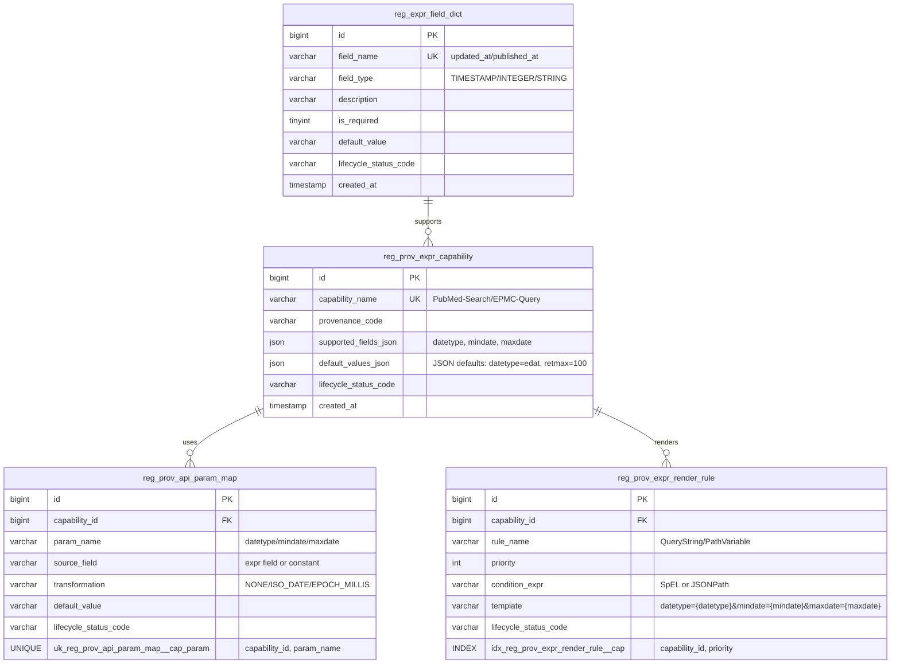

# Papertrace 核心数据模型 ER 图

> 医学文献数据平台 - 数据库模式设计  
> 更新时间: 2025-10-08

---

## 目录
1. [patra-ingest 数据模型](#1-patra-ingest-数据模型)
2. [patra-registry 数据模型](#2-patra-registry-数据模型)
3. [表关系说明](#3-表关系说明)
4. [渲染说明](#渲染说明)

---

## 1. patra-ingest 数据模型

### 核心实体关系图(简化版)

```mermaid
erDiagram
    ing_schedule_instance ||--o{ ing_plan : "triggers"
    ing_plan ||--o{ ing_plan_slice : "contains"
    ing_plan_slice ||--|| ing_task : "derives"
    ing_task ||--o{ ing_task_run : "attempts"
    ing_task_run ||--o{ ing_task_run_batch : "executes"
    ing_task ||--o{ ing_outbox_message : "generates"
    ing_task_run_batch ||--o{ ing_cursor_event : "advances"
    ing_cursor_event ||--|| ing_cursor : "updates"

    ing_schedule_instance {
        bigint id PK
        varchar scheduler_code "XXL/CRON/MANUAL"
        varchar scheduler_job_id
        varchar scheduler_log_id
        varchar trigger_type_code "SCHEDULE/MANUAL"
        timestamp triggered_at
        json trigger_params
        varchar provenance_code FK
        timestamp created_at
    }

    ing_plan {
        bigint id PK
        bigint schedule_instance_id FK
        varchar plan_key UK "human-readable identifier"
        varchar provenance_code
        varchar operation_code "HARVEST/BACKFILL/UPDATE"
        char expr_proto_hash "SHA256(normalized AST)"
        json expr_proto_snapshot "global expression tree"
        json provenance_config_snapshot "compiled config"
        char provenance_config_hash "SHA256(config)"
        varchar slice_strategy_code "TIME/ID_RANGE/CURSOR"
        json slice_params
        json window_spec "Format B: nested JSON with strategy-specific structure"
        timestamp window_from_time "VIRTUAL: extracted from window_spec"
        timestamp window_to_time "VIRTUAL: extracted from window_spec"
        varchar status_code "DRAFT/READY/COMPLETED"
        timestamp created_at
    }

    ing_plan_slice {
        bigint id PK
        bigint plan_id FK
        varchar provenance_code
        int slice_no UK "unique with plan_id"
        char slice_signature_hash UK "unique with plan_id"
        json window_spec "Format B: slice-specific window boundary"
        char expr_hash "localized expr"
        json expr_snapshot "executable AST"
        varchar status_code "PENDING/DISPATCHED/SUCCEEDED"
        timestamp created_at
    }

    ing_task {
        bigint id PK
        bigint schedule_instance_id FK
        bigint plan_id FK
        bigint slice_id FK
        varchar provenance_code
        varchar operation_code
        json params
        char idempotent_key UK "SHA256(slice+expr+op+trigger)"
        char expr_hash
        tinyint priority "1-9"
        varchar lease_owner
        timestamp leased_until
        int lease_count
        int retry_count
        varchar last_error_code
        varchar status_code "QUEUED/RUNNING/SUCCEEDED/FAILED"
        timestamp scheduled_at
        timestamp started_at
        timestamp finished_at
        varchar correlation_id
        timestamp created_at
    }

    ing_task_run {
        bigint id PK
        bigint task_id FK
        int attempt_no UK "unique with task_id"
        varchar provenance_code
        varchar operation_code
        varchar status_code "PLANNED/RUNNING/SUCCEEDED/FAILED"
        json checkpoint "nextHint/resumeToken"
        json stats "fetched/upserted/pages"
        text error
        timestamp window_from
        timestamp window_to
        timestamp started_at
        timestamp finished_at
        timestamp created_at
    }

    ing_task_run_batch {
        bigint id PK
        bigint run_id FK
        bigint task_id FK
        bigint slice_id FK
        bigint plan_id FK
        char expr_hash
        varchar provenance_code
        varchar operation_code
        int batch_no UK "unique with run_id"
        int page_no
        int page_size
        varchar before_token UK "unique with run_id"
        varchar after_token
        char idempotent_key UK "SHA256(run+before_token)"
        int record_count
        varchar status_code "RUNNING/SUCCEEDED/FAILED"
        timestamp committed_at
        json stats
        timestamp created_at
    }

    ing_cursor {
        bigint id PK
        varchar provenance_code
        varchar operation_code
        varchar cursor_key
        varchar namespace_scope_code "GLOBAL/EXPR/CUSTOM"
        char namespace_key UK "expr_hash or zeros"
        varchar cursor_type_code "TIME/ID/TOKEN"
        varchar cursor_value
        varchar observed_max_value
        timestamp normalized_instant
        decimal normalized_numeric
        bigint schedule_instance_id
        bigint plan_id
        bigint slice_id
        bigint task_id
        bigint last_run_id
        bigint last_batch_id
        char expr_hash
        bigint version "optimistic lock"
        timestamp created_at
        timestamp updated_at
    }

    ing_cursor_event {
        bigint id PK
        varchar provenance_code
        varchar operation_code
        varchar cursor_key
        varchar namespace_scope_code
        char namespace_key
        varchar cursor_type_code
        varchar prev_value
        varchar new_value
        varchar observed_max_value
        timestamp prev_instant
        timestamp new_instant
        decimal prev_numeric
        decimal new_numeric
        timestamp window_from
        timestamp window_to
        varchar direction_code "FORWARD/BACKFILL"
        char idempotent_key UK
        bigint schedule_instance_id
        bigint plan_id
        bigint slice_id
        bigint task_id
        bigint run_id
        bigint batch_id
        char expr_hash
        timestamp created_at
    }

    ing_outbox_message {
        bigint id PK
        varchar aggregate_type "TASK/PLAN"
        bigint aggregate_id
        varchar channel "ingest.task"
        varchar op_type "TASK_READY"
        varchar partition_key UK "provenance:operation"
        varchar dedup_key UK "task.idempotent_key"
        json payload_json "minimal necessary data"
        json headers_json "correlationId"
        timestamp not_before
        varchar status_code "PENDING/PUBLISHING/PUBLISHED"
        int retry_count
        timestamp next_retry_at
        varchar error_code
        varchar pub_lease_owner
        timestamp pub_leased_until
        varchar msg_id "broker message ID"
        timestamp created_at
    }
```



### 详细版(含索引与约束)

```mermaid
erDiagram
    ing_schedule_instance ||--o{ ing_plan : "1:N"
    ing_plan ||--o{ ing_plan_slice : "1:N"
    ing_plan_slice ||--|| ing_task : "1:1"
    ing_task ||--o{ ing_task_run : "1:N"
    ing_task_run ||--o{ ing_task_run_batch : "1:N"
    ing_task ||--o{ ing_outbox_message : "1:N"
    ing_task_run_batch }o--|| ing_cursor : "N:1 lineage"
    ing_task_run_batch ||--o{ ing_cursor_event : "1:N"

    ing_schedule_instance {
        bigint id PK "AUTO_INCREMENT"
        varchar scheduler_code "DICT: ing_scheduler"
        varchar scheduler_job_id "external job ID"
        varchar scheduler_log_id "external log/run ID"
        varchar trigger_type_code "DICT: ing_trigger_type"
        timestamp triggered_at
        json trigger_params
        varchar provenance_code "FK: reg_provenance.provenance_code"
        json record_remarks
        bigint version
        varbinary ip_address
        timestamp created_at
        bigint created_by
        varchar created_by_name
        timestamp updated_at
        bigint updated_by
        varchar updated_by_name
        tinyint deleted
        
        INDEX idx_sched_src "scheduler_code, scheduler_job_id, scheduler_log_id"
        INDEX idx_audit_deleted_upd "deleted, updated_at"
    }

    ing_plan {
        bigint id PK
        bigint schedule_instance_id FK
        varchar plan_key UK "globally unique, human-readable"
        varchar provenance_code
        varchar operation_code "DICT: ing_operation"
        char expr_proto_hash "SHA256, hex(64)"
        json expr_proto_snapshot "global expression AST"
        json provenance_config_snapshot "neutral config model"
        char provenance_config_hash "SHA256, hex(64)"
        varchar slice_strategy_code "TIME/ID_RANGE/CURSOR_LANDMARK"
        json slice_params "strategy-specific params"
        timestamp window_from "inclusive"
        timestamp window_to "exclusive"
        varchar status_code "DICT: ing_plan_status"
        json record_remarks
        bigint version
        varbinary ip_address
        timestamp created_at
        bigint created_by
        varchar created_by_name
        timestamp updated_at
        bigint updated_by
        varchar updated_by_name
        tinyint deleted
        
        UNIQUE uk_plan_key "plan_key"
        INDEX idx_plan_sched "schedule_instance_id"
        INDEX idx_plan_prov_op "provenance_code, operation_code"
        INDEX idx_plan_status "status_code"
        INDEX idx_plan_expr "expr_proto_hash"
        INDEX idx_plan_prov_config_hash "provenance_config_hash"
    }

    ing_plan_slice {
        bigint id PK
        bigint plan_id FK
        varchar provenance_code
        int slice_no
        char slice_signature_hash "SHA256(slice_spec)"
        json slice_spec "boundary: time/ID/cursor/budget"
        char expr_hash "SHA256(localized expr)"
        json expr_snapshot "executable expr with bounds"
        varchar status_code "DICT: ing_slice_status"
        json record_remarks
        bigint version
        varbinary ip_address
        timestamp created_at
        bigint created_by
        varchar created_by_name
        timestamp updated_at
        bigint updated_by
        varchar updated_by_name
        tinyint deleted
        
        UNIQUE uk_slice_unique "plan_id, slice_no"
        UNIQUE uk_slice_sig "plan_id, slice_signature_hash"
        INDEX idx_slice_prov_status "provenance_code, status_code"
        INDEX idx_slice_expr "expr_hash"
    }

    ing_task {
        bigint id PK
        bigint schedule_instance_id FK
        bigint plan_id FK
        bigint slice_id FK
        varchar provenance_code
        varchar operation_code
        json params
        char idempotent_key UK "SHA256(slice_sig+expr+op+trigger+params)"
        char expr_hash
        tinyint priority "1=high, 9=low"
        varchar lease_owner "instance#thread"
        timestamp leased_until "lease expiration"
        int lease_count "total leases acquired"
        int retry_count
        varchar last_error_code
        varchar last_error_msg
        varchar status_code "DICT: ing_task_status"
        timestamp scheduled_at
        timestamp started_at
        timestamp finished_at
        varchar scheduler_run_id
        varchar correlation_id
        json record_remarks
        bigint version
        varbinary ip_address
        timestamp created_at
        bigint created_by
        varchar created_by_name
        timestamp updated_at
        bigint updated_by
        varchar updated_by_name
        tinyint deleted
        
        UNIQUE uk_task_idem "idempotent_key"
        INDEX idx_task_slice "slice_id, status_code"
        INDEX idx_task_src_op "provenance_code, operation_code, status_code"
        INDEX idx_task_sched_at "status_code, scheduled_at"
        INDEX idx_task_queue "status_code, leased_until, priority, scheduled_at, id"
    }

    ing_task_run {
        bigint id PK
        bigint task_id FK
        int attempt_no
        varchar provenance_code
        varchar operation_code
        varchar status_code "DICT: ing_task_run_status"
        json checkpoint "nextHint/resumeToken/offset"
        json stats "fetched/upserted/failed/pages"
        text error
        timestamp window_from
        timestamp window_to
        timestamp started_at
        timestamp finished_at
        timestamp last_heartbeat
        varchar scheduler_run_id
        varchar correlation_id
        json record_remarks
        bigint version
        varbinary ip_address
        timestamp created_at
        bigint created_by
        varchar created_by_name
        timestamp updated_at
        bigint updated_by
        varchar updated_by_name
        tinyint deleted
        
        UNIQUE uk_run_attempt "task_id, attempt_no"
        INDEX idx_run_prov_op_status "provenance_code, operation_code, status_code"
        INDEX idx_run_task_status "task_id, status_code, started_at"
    }

    ing_task_run_batch {
        bigint id PK
        bigint run_id FK
        bigint task_id FK
        bigint slice_id FK
        bigint plan_id FK
        char expr_hash
        varchar provenance_code
        varchar operation_code
        int batch_no
        int page_no "for offset/limit pagination"
        int page_size
        varchar before_token "start token/cursorMark/retstart"
        varchar after_token "next token/cursorMark"
        char idempotent_key UK "SHA256(run_id+before_token|page_no)"
        int record_count
        varchar status_code "DICT: ing_batch_status"
        timestamp committed_at
        text error
        json stats
        json record_remarks
        bigint version
        varbinary ip_address
        timestamp created_at
        bigint created_by
        varchar created_by_name
        timestamp updated_at
        bigint updated_by
        varchar updated_by_name
        tinyint deleted
        
        UNIQUE uk_run_batch_no "run_id, batch_no"
        UNIQUE uk_run_before_tok "run_id, before_token"
        UNIQUE uk_batch_idem "idempotent_key"
        INDEX idx_batch_after_tok "run_id, after_token"
        INDEX idx_batch_status_time "run_id, status_code, committed_at"
        INDEX idx_batch_prov_op_status "provenance_code, operation_code, status_code, committed_at"
    }

    ing_cursor {
        bigint id PK
        varchar provenance_code
        varchar operation_code "DICT: ing_operation"
        varchar cursor_key "updated_at/published_at/seq_id/cursor_token"
        varchar namespace_scope_code "DICT: ing_namespace_scope"
        char namespace_key "expr_hash or zeros"
        varchar cursor_type_code "DICT: ing_cursor_type"
        varchar cursor_value "ISO-8601/decimal/opaque"
        varchar observed_max_value
        timestamp normalized_instant "for TIME type"
        decimal normalized_numeric "for ID type"
        bigint schedule_instance_id
        bigint plan_id
        bigint slice_id
        bigint task_id
        bigint last_run_id
        bigint last_batch_id
        char expr_hash
        bigint version "optimistic lock"
        json record_remarks
        varbinary ip_address
        timestamp created_at
        bigint created_by
        varchar created_by_name
        timestamp updated_at
        bigint updated_by
        varchar updated_by_name
        tinyint deleted
        
        UNIQUE uk_cursor_ns "provenance_code, operation_code, cursor_key, namespace_scope_code, namespace_key"
        INDEX idx_cursor_src_key "provenance_code, operation_code, cursor_key"
        INDEX idx_cursor_sort_time "cursor_type_code, normalized_instant"
        INDEX idx_cursor_sort_id "cursor_type_code, normalized_numeric"
        INDEX idx_cursor_lineage "schedule_instance_id, plan_id, slice_id, task_id, last_run_id, last_batch_id"
    }

    ing_cursor_event {
        bigint id PK
        varchar provenance_code
        varchar operation_code
        varchar cursor_key
        varchar namespace_scope_code
        char namespace_key
        varchar cursor_type_code
        varchar prev_value
        varchar new_value
        varchar observed_max_value
        timestamp prev_instant
        timestamp new_instant
        decimal prev_numeric
        decimal new_numeric
        timestamp window_from
        timestamp window_to
        varchar direction_code "DICT: ing_cursor_direction"
        char idempotent_key UK "SHA256(prov+op+key+ns+prev->new+window+run...)"
        bigint schedule_instance_id
        bigint plan_id
        bigint slice_id
        bigint task_id
        bigint run_id
        bigint batch_id
        char expr_hash
        json record_remarks
        bigint version
        varbinary ip_address
        timestamp created_at
        bigint created_by
        varchar created_by_name
        timestamp updated_at
        bigint updated_by
        varchar updated_by_name
        tinyint deleted
        
        UNIQUE uk_cur_evt_idem "idempotent_key"
        INDEX idx_cur_evt_timeline "provenance_code, operation_code, cursor_key, namespace_scope_code, namespace_key"
        INDEX idx_cur_evt_window "window_from, window_to"
        INDEX idx_cur_evt_instant "cursor_type_code, new_instant"
        INDEX idx_cur_evt_numeric "cursor_type_code, new_numeric"
        INDEX idx_cur_evt_lineage "schedule_instance_id, plan_id, slice_id, task_id, run_id, batch_id"
    }

    ing_outbox_message {
        bigint id PK
        varchar aggregate_type "TASK/PLAN"
        bigint aggregate_id "ing_task.id or ing_plan.id"
        varchar channel "ingest.task/ingest.plan"
        varchar op_type "TASK_READY/EVENT_PUBLISHED"
        varchar partition_key "provenance:operation"
        varchar dedup_key "task.idempotent_key or custom"
        json payload_json "minimal payload"
        json headers_json "correlationId, etc."
        timestamp not_before "earliest publish time"
        varchar status_code "PENDING/PUBLISHING/PUBLISHED/FAILED/DEAD"
        int retry_count
        timestamp next_retry_at
        varchar error_code
        varchar error_msg
        varchar pub_lease_owner "instance ID"
        timestamp pub_leased_until
        varchar msg_id "broker message ID"
        json record_remarks
        bigint version
        varbinary ip_address
        timestamp created_at
        bigint created_by
        varchar created_by_name
        timestamp updated_at
        bigint updated_by
        varchar updated_by_name
        tinyint deleted
        
        UNIQUE uk_outbox_channel_dedup "channel, dedup_key"
        INDEX idx_outbox_status_time "status_code, not_before, id"
        INDEX idx_outbox_partition "channel, partition_key, status_code"
        INDEX idx_outbox_lease "status_code, pub_leased_until"
        INDEX idx_outbox_created "created_at"
    }
```



---

## 2. patra-registry 数据模型

### 核心配置实体关系图(简化版)

```mermaid
erDiagram
    reg_provenance ||--o{ reg_prov_http_cfg : "has"
    reg_provenance ||--o{ reg_prov_pagination_cfg : "has"
    reg_provenance ||--o{ reg_prov_retry_cfg : "has"
    reg_provenance ||--o{ reg_prov_rate_limit_cfg : "has"
    reg_provenance ||--o{ reg_prov_window_offset_cfg : "has"
    reg_provenance ||--o{ reg_prov_batching_cfg : "has"

    reg_provenance {
        bigint id PK
        varchar provenance_code UK "pubmed/epmc/crossref"
        varchar provenance_name "Display name"
        varchar base_url_default
        varchar timezone_default "IANA TZ"
        varchar docs_url
        tinyint is_active
        varchar lifecycle_status_code "DICT: lifecycle_status"
        timestamp created_at
    }

    reg_prov_http_cfg {
        bigint id PK
        bigint provenance_id FK
        varchar operation_type "ALL/HARVEST/UPDATE/BACKFILL"
        timestamp effective_from
        timestamp effective_to
        json default_headers_json
        int timeout_connect_millis
        int timeout_read_millis
        int timeout_total_millis
        tinyint tls_verify_enabled
        varchar proxy_url_value
        varchar retry_after_policy_code "IGNORE/RESPECT/CLAMP"
        int retry_after_cap_millis
        varchar idempotency_header_name
        int idempotency_ttl_seconds
        varchar lifecycle_status_code

        UNIQUE uk_reg_prov_http_cfg__dim_from "provenance_id, operation_type, effective_from"
    }

    reg_prov_pagination_cfg {
        bigint id PK
        bigint provenance_id FK
        varchar operation_type
        timestamp effective_from
        timestamp effective_to
        varchar pagination_mode_code "PAGE_NUMBER/CURSOR/TOKEN/SCROLL"
        int page_size_value
        int max_pages_per_execution
        varchar sort_field_param_name
        tinyint sorting_direction "0=DESC, 1=ASC"
        varchar lifecycle_status_code

        UNIQUE uk_reg_prov_pagination_cfg__dim_from "provenance_id, operation_type, effective_from"
    }

    reg_prov_retry_cfg {
        bigint id PK
        bigint provenance_id FK
        varchar operation_type
        timestamp effective_from
        timestamp effective_to
        int max_retry_times
        varchar backoff_policy_type_code "FIXED/EXPONENTIAL/LINEAR"
        int initial_delay_millis
        int max_delay_millis
        double exp_multiplier_value
        double jitter_factor_ratio
        json retry_http_status_json "HTTP status codes: 429,500,503"
        json giveup_http_status_json "HTTP status codes: 400,401,403,404"
        tinyint retry_on_network_error
        int circuit_break_threshold
        int circuit_cooldown_millis
        varchar lifecycle_status_code

        UNIQUE uk_reg_prov_retry_cfg__dim_from "provenance_id, operation_type, effective_from"
    }

    reg_prov_rate_limit_cfg {
        bigint id PK
        bigint provenance_id FK
        varchar operation_type
        timestamp effective_from
        timestamp effective_to
        int max_concurrent_requests
        int per_credential_qps_limit
        varchar lifecycle_status_code

        UNIQUE uk_reg_prov_rate_limit_cfg__dim_from "provenance_id, operation_type, effective_from"
    }

    reg_prov_window_offset_cfg {
        bigint id PK
        bigint provenance_id FK
        varchar operation_type
        timestamp effective_from
        timestamp effective_to
        varchar window_mode_code "SLIDING/CALENDAR"
        int window_size_value
        varchar window_size_unit_code "SECOND/MINUTE/HOUR/DAY"
        varchar calendar_align_to "HOUR/DAY/WEEK/MONTH"
        int lookback_value
        varchar lookback_unit_code
        int overlap_value
        varchar overlap_unit_code
        int watermark_lag_seconds
        varchar offset_type_code "DATE/ID/COMPOSITE"
        varchar offset_field_name
        varchar offset_date_format "ISO_INSTANT/epochMillis/YYYYMMDD"
        varchar default_date_field_name "EDAT/PDAT/MHDA"
        int max_ids_per_window
        int max_window_span_seconds
        varchar lifecycle_status_code

        UNIQUE uk_reg_prov_window_offset_cfg__dim_from "provenance_id, operation_type, effective_from"
    }

    reg_prov_batching_cfg {
        bigint id PK
        bigint provenance_id FK
        varchar operation_type
        timestamp effective_from
        timestamp effective_to
        int detail_fetch_batch_size
        varchar ids_param_name "id/ids/pmid/pmids"
        varchar ids_join_delimiter ", or +"
        int max_ids_per_request
        varchar lifecycle_status_code
        
        UNIQUE uk_reg_prov_batching_cfg__dim_from "provenance_id, operation_type, effective_from"
    }
```



### 表达式配置实体关系图



---

## 3. 表关系说明

### patra-ingest 核心关系

| 关系类型 | 上游表 | 下游表 | 基数 | 说明 |
|---------|--------|--------|------|------|
| **触发编排** | `ing_schedule_instance` | `ing_plan` | 1:N | 一次调度触发多个 Plan |
| **切片** | `ing_plan` | `ing_plan_slice` | 1:N | 一个 Plan 切分多个 Slice |
| **派生任务** | `ing_plan_slice` | `ing_task` | 1:1 | 每个 Slice 派生一个 Task |
| **执行尝试** | `ing_task` | `ing_task_run` | 1:N | Task 可重试,每次尝试一条 Run |
| **批次执行** | `ing_task_run` | `ing_task_run_batch` | 1:N | Run 分批执行(分页/token) |
| **水位推进** | `ing_task_run_batch` | `ing_cursor` | N:1 | 多个 Batch 更新同一游标 |
| **水位事件** | `ing_cursor` | `ing_cursor_event` | 1:N | Cursor 每次推进记录事件 |
| **Outbox 发布** | `ing_task` | `ing_outbox_message` | 1:N | Task 创建后生成 Outbox 消息 |

### patra-registry 配置维度关系

| 维度配置表 | 与 `reg_provenance` 关系 | 时间有效性 | 说明 |
|-----------|-------------------------|-----------|------|
| `reg_prov_http_cfg` | N:1 (provenance_id FK) | ✅ `effective_from/to` | HTTP 策略(超时/重试/代理/TLS) |
| `reg_prov_pagination_cfg` | N:1 | ✅ | 分页策略(模式/页大小/排序) |
| `reg_prov_retry_cfg` | N:1 | ✅ | 重试策略(次数/退避/熔断) |
| `reg_prov_rate_limit_cfg` | N:1 | ✅ | 限流策略(并发/QPS) |
| `reg_prov_window_offset_cfg` | N:1 | ✅ | 窗口偏移策略(时间窗/offset) |
| `reg_prov_batching_cfg` | N:1 | ✅ | 批处理策略(批大小/ID 拼接) |

**灰度切换机制**:  
每个维度表支持 `(provenance_id, operation_type, effective_from)` 唯一约束,可在不停机情况下:
1. 新增新版配置(新 `effective_from`)
2. 调整旧版配置 `effective_to` 闭合区间
3. 查询时根据 `NOW()` 选择当前生效配置

---

## 渲染说明

### 在线渲染
- **Mermaid Live Editor**: https://mermaid.live
- **GitHub/GitLab**: Markdown 原生支持 ER Diagram 语法
- **dbdiagram.io**: 可导入 SQL DDL 自动生成 ER 图

### 本地渲染
```bash
# Mermaid CLI 导出
npm install -g @mermaid-js/mermaid-cli
mmdc -i er-diagrams.md -o er-diagrams.svg -b white

# 使用 MySQL Workbench 逆向工程
# File → Reverse Engineer → MySQL DDL
```

### 导出 SQL DDL
```bash
# 从 Flyway 迁移脚本导出完整 DDL
cat patra-ingest/patra-ingest-infra/src/main/resources/db/migration/V0.1.0__init_ingest_schema.sql > full-schema.sql
cat patra-registry/patra-registry-infra/src/main/resources/db/migration/V1.0.*.sql >> full-schema.sql
```

---

## WindowSpec JSON Format

The `window_spec` column in `ing_plan` and `ing_plan_slice` tables uses **Format B (nested JSON)** to store window boundary specifications. See detailed documentation:
- **Domain Model**: [docs/domain/WindowSpec.md](../domain/WindowSpec.md)
- **Database Schema**: [docs/database/window_spec_schema.md](./window_spec_schema.md)

**Quick Reference**:

| Strategy | Example JSON (Format B) |
|----------|------------------------|
| TIME | `{"strategy":"TIME","window":{"from":"2024-01-01T00:00:00Z","to":"2024-12-31T23:59:59Z","boundary":{"from":"CLOSED","to":"OPEN"},"timezone":"UTC"}}` |
| ID_RANGE | `{"strategy":"ID_RANGE","window":{"from":1000000,"to":2000000}}` |
| CURSOR_LANDMARK | `{"strategy":"CURSOR_LANDMARK","window":{"from":"token1","to":"token2"}}` |
| VOLUME_BUDGET | `{"strategy":"VOLUME_BUDGET","limit":100000,"unit":"RECORDS"}` |
| SINGLE | `{"strategy":"SINGLE"}` |

**Virtual Columns for TIME Strategy**:
- `window_from_time`: Extracted from `$.window.from` (enables indexed queries)
- `window_to_time`: Extracted from `$.window.to` (enables indexed queries)

These virtual columns are `NULL` for non-TIME strategies.

---

## 关键设计原则

### 1. 无物理外键约束
- **原因**: 微服务独立部署、跨库关联、性能考量
- **保障**: 应用层通过幂等键、事务边界、Outbox 模式保证一致性
- **追溯**: 通过 `*_lineage` 字段记录完整调用链

### 2. 幂等键设计
| 表 | 幂等键字段 | 组成 | 用途 |
|---|----------|------|------|
| `ing_plan` | `plan_key` | 人类可读标识 | 外部查询、去重 |
| `ing_plan_slice` | `slice_signature_hash` | SHA256(slice_spec) | 同 Plan 下去重 |
| `ing_task` | `idempotent_key` | SHA256(slice+expr+op+trigger+params) | 全局去重 |
| `ing_task_run_batch` | `idempotent_key` | SHA256(run_id+before_token\|page_no) | 批次去重 |
| `ing_cursor_event` | `idempotent_key` | SHA256(prov+op+key+ns+prev→new+window+run...) | 事件去重 |
| `ing_outbox_message` | `(channel, dedup_key)` | 组合唯一约束 | 源端去重 |

### 3. 审计字段统一
所有表包含标准审计字段:
- `record_remarks` (JSON): 变更说明
- `created_at/by/by_name`: 创建信息
- `updated_at/by/by_name`: 更新信息
- `version`: 乐观锁版本号
- `ip_address`: 请求方 IP(二进制,支持 IPv4/IPv6)
- `deleted`: 逻辑删除标志

### 4. 字典码设计
使用 `*_code` 字段关联系统字典表 `reg_sys_dict_item`:
- `scheduler_code` → `ing_scheduler` (XXL/CRON/MANUAL)
- `trigger_type_code` → `ing_trigger_type` (SCHEDULE/MANUAL)
- `operation_code` → `ing_operation` (HARVEST/BACKFILL/UPDATE/METRICS)
- `status_code` → 各状态字典 (ing_plan_status/ing_task_status 等)

---

## 相关文档

- [系统架构总览](../overview/architecture-diagrams.md)
- [patra-ingest 六边形架构图](../modules/ingest/architecture-diagram.md)
- [patra-registry 六边形架构图](../modules/registry/architecture-diagram.md)
- [Flyway 迁移脚本](../../patra-ingest/patra-ingest-infra/src/main/resources/db/migration/)

---

## 更新记录

| 版本 | 日期 | 变更说明 | 作者 |
|-----|------|---------|------|
| 1.1 | 2025-10-10 | 更新 window_spec 字段为 Format B，增加虚拟列说明和 WindowSpec 文档链接 | docs-engineer |
| 1.0 | 2025-10-08 | 初始版本:Ingest/Registry ER 图、关系说明、设计原则 | System |
