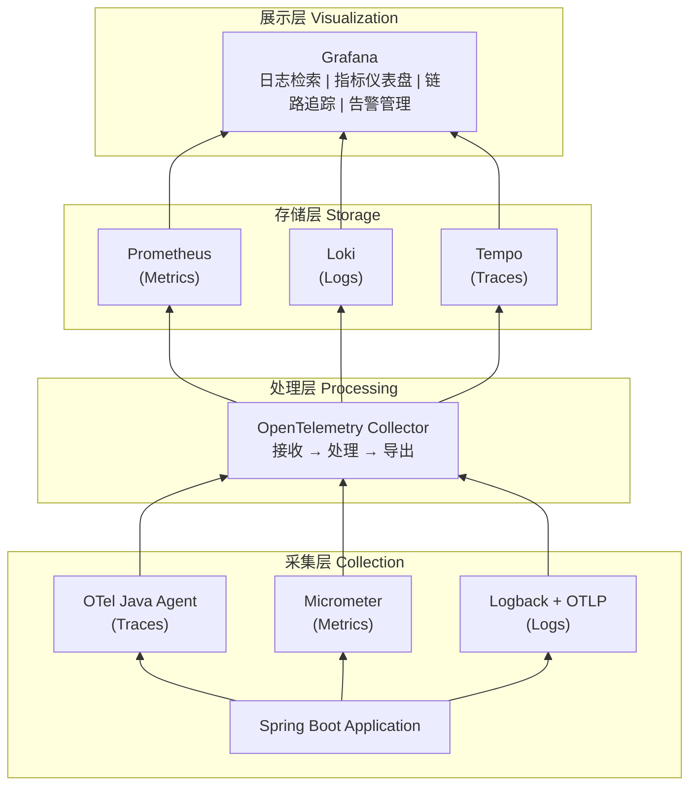

# ADR-005: 采用 OpenTelemetry + Grafana Stack 作为可观测性方案

## 状态

**accepted**

## 背景

项目需要建立完善的可观测性体系，满足以下核心需求：

1. **日志检索**：能够聚合、搜索和分析分布式系统的日志
2. **性能指标**：监控 JVM、HTTP、数据库等系统和业务指标
3. **链路追踪**：追踪请求在微服务间的完整调用链路
4. **告警系统**：主动发现问题并通知相关人员
5. **统一可视化**：在一个平台查看所有监控数据

### 技术考量

- 2024-2025 年，OpenTelemetry 已成为 CNCF 毕业项目，是遥测数据采集的**事实标准**
- 需要**厂商中立**的方案，避免锁定特定供应商
- Spring Boot 3.x 原生支持 Micrometer + OpenTelemetry 集成
- 项目是 Greenfield（绿地项目），可以直接采用最佳方案

## 决策

我们将采用 **OpenTelemetry + Grafana Stack** 作为可观测性方案：

### 技术栈

| 层级 | 组件 | 用途 |
|------|------|------|
| **采集层** | OpenTelemetry Java Agent | 自动采集 Traces、Metrics |
| **采集层** | Micrometer | Spring Boot 原生指标 API |
| **采集层** | Logback + OTLP Appender | 结构化日志输出 |
| **处理层** | OpenTelemetry Collector | 接收、处理、导出遥测数据 |
| **存储层** | Prometheus | Metrics（指标）时序存储 |
| **存储层** | Loki | Logs（日志）聚合存储 |
| **存储层** | Tempo | Traces（链路）分布式存储 |
| **展示层** | Grafana | 统一可视化、告警配置 |
| **告警层** | Alertmanager | 告警路由、通知 |

### 架构图

## 后果

### 正面影响

- **厂商中立**：OpenTelemetry 是 CNCF 标准，可无缝切换后端（如迁移到 Datadog、Jaeger 等）
- **统一入口**：Grafana 提供 Metrics/Logs/Traces 的统一查询界面
- **行业主流**：与 Google、AWS、微软、字节跳动等企业技术栈一致，便于职业发展
- **Spring Boot 原生支持**：Micrometer + OTel 是 Spring Boot 3.x 的官方推荐方案
- **资源高效**：Loki 比 ELK 节省 50%+ 内存，适合个人/小团队
- **学习价值高**：理解可观测性原理和标准协议，而非仅学会某个工具的使用

### 负面影响

- **初始学习曲线**：需要理解 OpenTelemetry 的概念（Span、Trace、Context Propagation）
- **组件较多**：需要部署和维护 5+ 个服务（Collector、Prometheus、Loki、Tempo、Grafana）
- **配置复杂度**：相比 SkyWalking 一站式方案，需要更多配置工作

### 风险

- Grafana Stack 组件版本兼容性需要关注（建议使用官方推荐的版本组合）
- 高流量场景需要配置合理的采样策略，避免数据量过大

## 替代方案

### 方案 A：Apache SkyWalking

**优点**：
- 开箱即用，自带 UI、存储、分析
- 对 Java 生态支持极佳
- 中文社区活跃，文档丰富

**缺点**：
- 锁定 SkyWalking 生态
- 国际影响力下降，企业采用趋势减弱
- 与 OpenTelemetry 存在 Agent 冲突问题

### 方案 B：ELK + Prometheus + Jaeger

**优点**：
- Elasticsearch 全文索引能力强
- 各组件成熟稳定

**缺点**：
- ELK 资源消耗大（ES 单节点需 4G+ 内存）
- 三套独立系统，缺乏统一入口
- Jaeger 功能相对 Tempo 较弱

### 方案 C：商业 SaaS（Datadog/New Relic/Grafana Cloud）

**优点**：
- 免运维，开箱即用
- 功能强大，AI 辅助分析

**缺点**：
- 成本高（按数据量/主机数计费）
- 数据外泄风险
- 学习目的下无法深入理解原理

## 参考资料

- [OpenTelemetry 官方文档](https://opentelemetry.io/docs/)
- [Grafana LGTM Stack](https://grafana.com/oss/lgtm-stack/)
- [Spring Boot 3 Observability](https://spring.io/blog/2022/10/12/observability-with-spring-boot-3/)
- [The Future of Observability: Trends Shaping 2025](https://leapcell.medium.com/the-future-of-observability-trends-shaping-2025-427fc9d0cd34)
