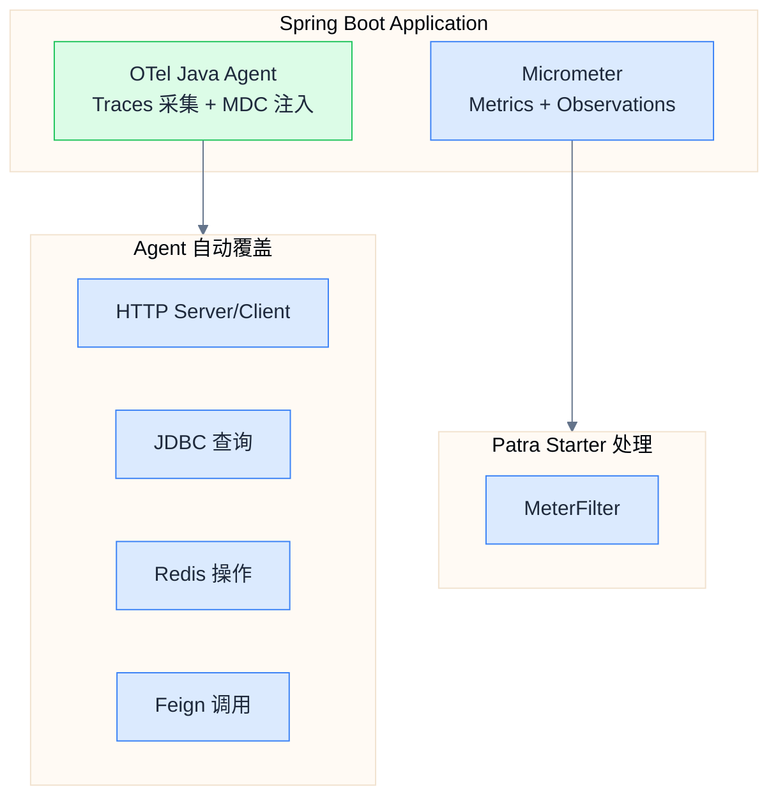
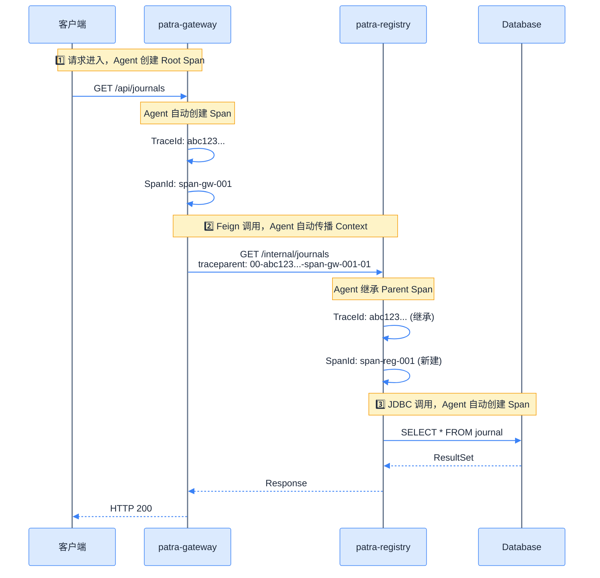

# OpenTelemetry 集成方案

## 采集策略

### 决策：采用 OTel Java Agent

本项目采用 **OTel Java Agent** 作为 Tracing 采集方案：

| 优势 | 说明 |
|------|------|
| **零代码侵入** | 通过 `-javaagent` JVM 参数注入，业务代码无 OTel 依赖 |
| **自动覆盖** | 自动覆盖 Spring Web、RestClient、Feign、JDBC、Redis 等 100+ 框架 |
| **简化维护** | 升级只需替换 Agent JAR，无需修改代码 |
| **官方推荐** | OpenTelemetry 官方首推方案 |

### 架构分工



## OTel Java Agent 配置

### 下载与部署

```bash
# 下载 Agent（v2.22.0）
curl -L -o docker/otel-agent/opentelemetry-javaagent.jar \
  https://github.com/open-telemetry/opentelemetry-java-instrumentation/releases/download/v2.22.0/opentelemetry-javaagent.jar
```

### JVM 参数配置

```bash
# Agent 路径
-javaagent:/path/to/opentelemetry-javaagent.jar

# 服务标识
-Dotel.service.name=patra-registry

# OTLP 导出配置
-Dotel.exporter.otlp.endpoint=http://otel-collector:4317
-Dotel.exporter.otlp.protocol=grpc

# 采样配置
-Dotel.traces.sampler=parentbased_traceidratio
-Dotel.traces.sampler.arg=1.0

# 日志导出
-Dotel.logs.exporter=otlp

# 禁用 Agent 指标导出（使用 Micrometer）
-Dotel.metrics.exporter=none
```

### 本地开发启动示例

```bash
java -javaagent:docker/otel-agent/opentelemetry-javaagent.jar \
     -Dotel.service.name=patra-registry \
     -Dotel.exporter.otlp.endpoint=http://localhost:4317 \
     -Dotel.exporter.otlp.protocol=grpc \
     -Dotel.traces.sampler=parentbased_traceidratio \
     -Dotel.traces.sampler.arg=1.0 \
     -Dotel.metrics.exporter=none \
     -Dotel.logs.exporter=otlp \
     -jar patra-registry-boot.jar \
     --spring.profiles.active=dev
```

### Docker Compose 配置

```yaml
services:
  patra-registry:
    image: patra/patra-registry:latest
    environment:
      JAVA_TOOL_OPTIONS: "-javaagent:/opt/otel/opentelemetry-javaagent.jar"
      OTEL_SERVICE_NAME: "patra-registry"
      OTEL_EXPORTER_OTLP_ENDPOINT: "http://otel-collector:4317"
      OTEL_RESOURCE_ATTRIBUTES: "service.version=0.1.0,deployment.environment=dev"
      OTEL_TRACES_SAMPLER: "parentbased_traceidratio"
      OTEL_TRACES_SAMPLER_ARG: "1.0"
      OTEL_METRICS_EXPORTER: "none"
      OTEL_LOGS_EXPORTER: "otlp"
    volumes:
      - ./docker/otel-agent/opentelemetry-javaagent.jar:/opt/otel/opentelemetry-javaagent.jar:ro
```

## 日志集成

### 架构设计

OTel Agent 自动将 `trace_id`/`span_id` 注入到 SLF4J MDC，Patra 通过自定义 Logback Converter 提取并格式化。

```d2 width=800
direction: right

classes: {
  app: {
    style: {
      fill: "#22c55e"
      stroke: "#16a34a"
      stroke-width: 2
      font-color: "#ffffff"
    }
  }
  component: {
    style: {
      fill: "#3b82f6"
      stroke: "#1d4ed8"
      stroke-width: 2
      font-color: "#ffffff"
    }
  }
  storage: {
    shape: cylinder
    style: {
      fill: "#8b5cf6"
      stroke: "#6d28d9"
      stroke-width: 2
      font-color: "#ffffff"
    }
  }
}

agent: OTel Agent {class: app}
mdc: SLF4J MDC {class: component}
logback: Logback {class: component}
converter: Patra Converters {class: component}
collector: OTel Collector {class: component}
loki: Loki {class: storage}

agent -> mdc: 自动注入 trace_id/span_id {style.stroke: "#64748b"; style.stroke-width: 2}
mdc -> logback: MDC 传播 {style.stroke: "#64748b"; style.stroke-width: 2}
logback -> converter: 格式化 {style.stroke: "#64748b"; style.stroke-width: 2}
agent -> collector: OTLP/Logs {style.stroke: "#64748b"; style.stroke-width: 2}
collector -> loki: Push {style.stroke: "#64748b"; style.stroke-width: 2}
```

### Logback 配置

```xml
<?xml version="1.0" encoding="UTF-8"?>
<configuration>
    <include resource="org/springframework/boot/logging/logback/defaults.xml"/>

    <springProperty scope="context" name="appName" source="spring.application.name" defaultValue="application"/>

    <!-- 注册自定义 Converter -->
    <conversionRule conversionWord="traceId"
                    converterClass="com.patra.starter.core.logging.TraceIdConverter"/>
    <conversionRule conversionWord="segmentId"
                    converterClass="com.patra.starter.core.logging.SegmentIdConverter"/>
    <conversionRule conversionWord="spanId"
                    converterClass="com.patra.starter.core.logging.SpanIdConverter"/>

    <!-- Console Appender -->
    <appender name="CONSOLE" class="ch.qos.logback.core.ConsoleAppender">
        <encoder>
            <pattern>%clr(%d{yyyy-MM-dd HH:mm:ss.SSS}){faint} %clr(%5p) %clr([${appName}]){blue} %clr([trace:%traceId,seg:%segmentId,span:%spanId]){magenta} %clr([%t]){faint} %clr(%-40.40logger{39}){cyan} %clr(:){faint} %m%n%wEx</pattern>
        </encoder>
    </appender>

    <root level="INFO">
        <appender-ref ref="CONSOLE"/>
    </root>
</configuration>
```

### 自定义 Logback Converter

Patra 实现了 3 个自定义 Converter，兼容 OTel Agent 和 Micrometer Tracing 两种 MDC 键格式：

| Converter | 用途 | 查找顺序 |
|-----------|------|----------|
| `TraceIdConverter` | 提取 Trace ID | `trace_id` → `traceId` |
| `SpanIdConverter` | 提取 Span ID | `span_id` → `spanId` |
| `SegmentIdConverter` | 提取 Segment ID | `trace_id` 前 16 位 |

**TraceIdConverter 实现逻辑：**

```java
public class TraceIdConverter extends ClassicConverter {
  @Override
  public String convert(ILoggingEvent event) {
    Map<String, String> mdcMap = event.getMDCPropertyMap();

    // 1. 优先尝试 OTel Agent 键（snake_case）
    String traceId = mdcMap.get("trace_id");
    if (isValidTraceId(traceId)) {
      return traceId;
    }

    // 2. 回退到 Micrometer 键（camelCase）
    traceId = mdcMap.get("traceId");
    if (isValidTraceId(traceId)) {
      return traceId;
    }

    return "N/A";
  }
}
```

### MDC 键格式差异

| 来源 | Trace ID 键 | Span ID 键 | 命名风格 |
|------|-------------|------------|----------|
| **OTel Agent** | `trace_id` | `span_id` | snake_case |
| **Micrometer Tracing** | `traceId` | `spanId` | camelCase |

> [!note] 自动兼容
> Patra 的 Logback Converter 自动处理这种差异，优先读取 OTel Agent 格式。

### 日志输出示例

```
2025-11-29 10:30:45.123  INFO [patra-registry] [trace:1d990b105aed7666951ce1520bb961a2,seg:1d990b105aed7666,span:141498c2e4fe4b33] [http-nio-8081-exec-1] c.p.registry.service.JournalService      : Processing journal: 12345
```

## Context Propagation

### W3C Trace Context

OTel Agent 自动处理 W3C Trace Context 规范的 Header 传播：

```http
GET /api/journals HTTP/1.1
Host: patra-registry:8081
traceparent: 00-0af7651916cd43dd8448eb211c80319c-b7ad6b7169203331-01
tracestate: patra=sampleRate:1.0
```

**Header 格式：**

| Header | 格式 | 说明 |
|--------|------|------|
| `traceparent` | `{version}-{traceId}-{spanId}-{flags}` | 标准追踪上下文 |
| `tracestate` | `{vendor}={value},...` | 厂商扩展数据 |

### 跨服务传播流程



## Micrometer Observation 使用

虽然 Tracing 由 Agent 处理，但业务代码可使用 Micrometer Observation API 创建业务 Span：

```java
@Service
public class JournalService {

    private final ObservationRegistry observationRegistry;

    /// 使用 @Observed 注解自动创建 Observation
    @Observed(name = "journal.search", contextualName = "search-journals")
    public List<Journal> search(String query) {
        return journalRepository.findByQuery(query);
    }

    /// 手动创建 Observation
    public Journal getById(Long id) {
        return Observation.createNotStarted("journal.get", observationRegistry)
            .lowCardinalityKeyValue("journal.id.range", getIdRange(id))
            .observe(() -> journalRepository.findById(id));
    }
}
```

> [!tip] Agent 与 Micrometer 协作
> OTel Agent 会自动检测 Micrometer Observation 创建的 Span 并纳入同一 Trace 上下文。
> 无需额外配置，两者共享 `TraceContext`。

## 相关链接

- 上一章：[[03-starter-module|Starter 模块设计]]
- 下一章：[[05-infrastructure|基础设施部署]]
- 索引：[[_MOC|可观测性系统设计]]
