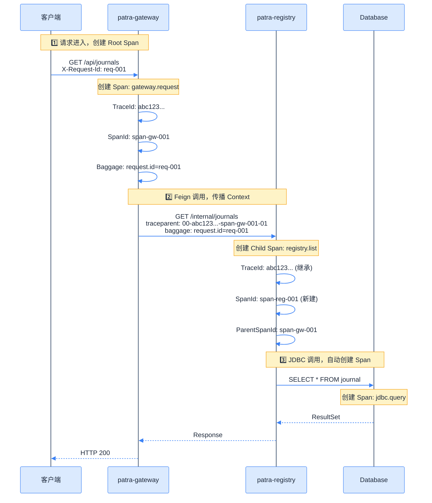

# OpenTelemetry 集成方案

## 采集策略选择

### Agent vs SDK 对比

| 维度 | OTel Java Agent | OTel SDK |
|------|-----------------|----------|
| **侵入性** | 零代码侵入（JVM 参数） | 需要代码依赖和配置 |
| **覆盖范围** | 自动覆盖 100+ 框架 | 需手动配置每个框架 |
| **灵活性** | 配置驱动，扩展有限 | 完全可编程 |
| **启动开销** | 增加 ~2-3 秒启动时间 | 无额外启动开销 |
| **内存占用** | ~50-100MB 额外内存 | 取决于使用方式 |
| **维护成本** | 升级 Agent JAR 即可 | 需更新代码依赖 |

### 决策：采用 OTel Java Agent

**理由：**
1. **零代码侵入**：业务模块不依赖 OTel SDK，符合六边形架构原则
2. **自动覆盖**：Spring Web、RestClient、Feign、JDBC、Redis 等自动采集
3. **简化维护**：通过 JVM 参数配置，无需修改业务代码
4. **官方推荐**：OpenTelemetry 官方推荐 Agent 作为首选方案

> [!note] Micrometer 保留说明
> 虽然使用 Agent，但保留 Micrometer 用于：
> - Spring Boot Actuator 原生集成
> - 自定义业务指标
> - 现有 Handler/Filter 复用

## OTel Java Agent 配置

### 下载与部署

```bash
# 下载最新版 Agent
curl -L -o opentelemetry-javaagent.jar \
  https://github.com/open-telemetry/opentelemetry-java-instrumentation/releases/latest/download/opentelemetry-javaagent.jar

# 放置到项目目录
mkdir -p docker/otel-agent
mv opentelemetry-javaagent.jar docker/otel-agent/
```

### JVM 参数配置

```bash
# 基础配置
-javaagent:/path/to/opentelemetry-javaagent.jar

# 服务标识
-Dotel.service.name=patra-registry
-Dotel.resource.attributes=service.version=1.0.0,deployment.environment=dev

# OTLP 导出配置
-Dotel.exporter.otlp.endpoint=http://otel-collector:4317
-Dotel.exporter.otlp.protocol=grpc

# 采样配置
-Dotel.traces.sampler=parentbased_traceidratio
-Dotel.traces.sampler.arg=1.0

# 日志注入
-Dotel.instrumentation.logback-appender.enabled=true
-Dotel.instrumentation.logback-mdc.add-baggage=true

# 指标导出（使用 Micrometer，禁用 Agent 指标）
-Dotel.metrics.exporter=none
```

### Dockerfile 配置

```dockerfile
FROM eclipse-temurin:25-jre

# 复制 Agent
COPY docker/otel-agent/opentelemetry-javaagent.jar /opt/otel/

# 设置环境变量
ENV JAVA_TOOL_OPTIONS="-javaagent:/opt/otel/opentelemetry-javaagent.jar"
ENV OTEL_SERVICE_NAME="patra-registry"
ENV OTEL_EXPORTER_OTLP_ENDPOINT="http://otel-collector:4317"
ENV OTEL_TRACES_SAMPLER="parentbased_traceidratio"
ENV OTEL_TRACES_SAMPLER_ARG="1.0"
ENV OTEL_METRICS_EXPORTER="none"
ENV OTEL_LOGS_EXPORTER="otlp"

# 复制应用
COPY target/*.jar /app/app.jar

ENTRYPOINT ["java", "-jar", "/app/app.jar"]
```

### Docker Compose 配置

```yaml
services:
  patra-registry:
    image: patra/patra-registry:latest
    environment:
      # OTel Agent 配置
      JAVA_TOOL_OPTIONS: "-javaagent:/opt/otel/opentelemetry-javaagent.jar"
      OTEL_SERVICE_NAME: "patra-registry"
      OTEL_EXPORTER_OTLP_ENDPOINT: "http://otel-collector:4317"
      OTEL_RESOURCE_ATTRIBUTES: "service.version=1.0.0,deployment.environment=dev"
      # 采样
      OTEL_TRACES_SAMPLER: "parentbased_traceidratio"
      OTEL_TRACES_SAMPLER_ARG: "1.0"
      # 指标由 Micrometer 处理
      OTEL_METRICS_EXPORTER: "none"
      # 日志导出
      OTEL_LOGS_EXPORTER: "otlp"
    volumes:
      - ./docker/otel-agent/opentelemetry-javaagent.jar:/opt/otel/opentelemetry-javaagent.jar:ro
```

## Micrometer → OTel Bridge

### 工作原理

```mermaid
%%{init: {
  'theme': 'base',
  'themeVariables': {
    'primaryColor': '#dbeafe',
    'primaryTextColor': '#1e293b',
    'primaryBorderColor': '#3b82f6',
    'lineColor': '#64748b',
    'edgeLabelBackground': '#f1f5f9'
  }
}}%%
flowchart LR
    subgraph App["Spring Boot Application"]
        Code[业务代码]
        Micrometer[Micrometer API]
        Bridge[micrometer-tracing-bridge-otel]
        OTelSDK[OpenTelemetry SDK]
    end

    subgraph Export["导出"]
        Prometheus[Prometheus Exporter]
        OTLP[OTLP Exporter]
    end

    Code -->|@Observed| Micrometer
    Micrometer --> Bridge
    Bridge --> OTelSDK

    Micrometer -->|MeterRegistry| Prometheus
    OTelSDK -->|TracerProvider| OTLP

    classDef default fill:#dbeafe,stroke:#3b82f6,color:#1e293b;
    classDef export fill:#ffedd5,stroke:#f97316,color:#1e293b;
    class Prometheus,OTLP export;
```

### 配置方式

**1. 添加依赖**

```xml
<dependency>
    <groupId>io.micrometer</groupId>
    <artifactId>micrometer-tracing-bridge-otel</artifactId>
</dependency>
```

**2. 自动配置**

```java
@Configuration
@ConditionalOnClass({OpenTelemetry.class, OtelTracer.class})
public class MicrometerOtelBridgeConfiguration {

    @Bean
    @ConditionalOnMissingBean
    public io.micrometer.tracing.Tracer micrometerTracer(OpenTelemetry openTelemetry) {
        var otelTracer = openTelemetry.getTracer("patra-micrometer");
        var otelCurrentTraceContext = new OtelCurrentTraceContext();

        return new OtelTracer(
            otelTracer,
            otelCurrentTraceContext,
            event -> { } // SpanCustomizer event publisher
        );
    }

    @Bean
    @ConditionalOnMissingBean
    public OtelPropagator otelPropagator(ContextPropagators propagators) {
        return new OtelPropagator(propagators, otelTracer);
    }
}
```

**3. 使用示例**

```java
@Service
public class JournalService {

    private final ObservationRegistry observationRegistry;

    /// 使用 @Observed 注解自动创建 Span。
    @Observed(name = "journal.search", contextualName = "search-journals")
    public List<Journal> search(String query) {
        // 业务逻辑
        return journalRepository.findByQuery(query);
    }

    /// 手动创建 Observation。
    public Journal getById(Long id) {
        return Observation.createNotStarted("journal.get", observationRegistry)
            .lowCardinalityKeyValue("journal.id.range", getIdRange(id))
            .observe(() -> journalRepository.findById(id));
    }
}
```

## 日志集成

### 架构设计

```d2 width=800
direction: right

classes: {
  app: {
    style: {
      fill: "#22c55e"
      stroke: "#16a34a"
      stroke-width: 2
      font-color: "#ffffff"
    }
  }
  log: {
    style: {
      fill: "#f97316"
      stroke: "#ea580c"
      stroke-width: 2
      font-color: "#ffffff"
    }
  }
  component: {
    style: {
      fill: "#3b82f6"
      stroke: "#1d4ed8"
      stroke-width: 2
      font-color: "#ffffff"
    }
  }
  storage: {
    shape: cylinder
    style: {
      fill: "#8b5cf6"
      stroke: "#6d28d9"
      stroke-width: 2
      font-color: "#ffffff"
    }
  }
}

# 应用层
app: Spring Boot App {class: app}
slf4j: SLF4J API {class: component}
logback: Logback Core {class: component}
mdc: MDC Context {class: component}

app -> slf4j: log.info() {style.stroke: "#64748b"; style.stroke-width: 2}
slf4j -> logback: {style.stroke: "#64748b"; style.stroke-width: 2}
logback -> mdc: 注入 TraceId {style.stroke: "#64748b"; style.stroke-width: 2}

# Appender 层
console: Console Appender {class: log}
otlp: OTLP Appender {class: log}

logback -> console: 本地开发 {style.stroke: "#64748b"; style.stroke-width: 2}
logback -> otlp: OTLP 导出 {style.stroke: "#64748b"; style.stroke-width: 2}

# 导出目标
collector: OTel Collector {class: component}
loki: Loki {class: storage}

otlp -> collector: OTLP/Logs {style.stroke: "#64748b"; style.stroke-width: 2}
collector -> loki: Push {style.stroke: "#64748b"; style.stroke-width: 2}
```

### Logback 配置

**logback-spring.xml**

```xml
<?xml version="1.0" encoding="UTF-8"?>
<configuration>
    <!-- 引入 Spring Boot 默认配置 -->
    <include resource="org/springframework/boot/logging/logback/defaults.xml"/>

    <!-- 属性定义 -->
    <springProperty scope="context" name="APP_NAME" source="spring.application.name"/>
    <springProperty scope="context" name="OTEL_ENDPOINT" source="patra.observability.exporter.endpoint"
                    defaultValue="http://localhost:4317"/>

    <!-- 控制台 Appender（开发环境） -->
    <appender name="CONSOLE" class="ch.qos.logback.core.ConsoleAppender">
        <encoder>
            <pattern>%d{yyyy-MM-dd HH:mm:ss.SSS} [%thread] [%X{traceId:-},%X{spanId:-}] %-5level %logger{36} - %msg%n</pattern>
        </encoder>
    </appender>

    <!-- OTLP Appender（生产环境） -->
    <appender name="OTLP" class="io.opentelemetry.instrumentation.logback.appender.v1_0.OpenTelemetryAppender">
        <!-- 捕获代码位置属性 -->
        <captureCodeAttributes>true</captureCodeAttributes>
        <!-- 捕获实验性属性 -->
        <captureExperimentalAttributes>true</captureExperimentalAttributes>
        <!-- 捕获所有 MDC 属性 -->
        <captureMdcAttributes>*</captureMdcAttributes>
    </appender>

    <!-- 异步 OTLP Appender -->
    <appender name="ASYNC_OTLP" class="ch.qos.logback.classic.AsyncAppender">
        <appender-ref ref="OTLP"/>
        <queueSize>1024</queueSize>
        <discardingThreshold>0</discardingThreshold>
        <neverBlock>true</neverBlock>
        <includeCallerData>true</includeCallerData>
    </appender>

    <!-- 开发环境：仅控制台 -->
    <springProfile name="dev,local">
        <root level="INFO">
            <appender-ref ref="CONSOLE"/>
        </root>
    </springProfile>

    <!-- 生产环境：控制台 + OTLP -->
    <springProfile name="prod,staging">
        <root level="INFO">
            <appender-ref ref="CONSOLE"/>
            <appender-ref ref="ASYNC_OTLP"/>
        </root>
    </springProfile>
</configuration>
```

### TraceId 自动注入

OTel Agent 自动将 TraceId/SpanId 注入 MDC：

```java
// 日志输出示例
log.info("Processing journal: {}", journalId);

// 输出结果（TraceId 自动注入）
// 2025-01-15 10:30:45.123 [main] [abc123def456...,789xyz...] INFO JournalService - Processing journal: 12345
```

**MDC 可用字段：**

| MDC Key | 说明 | 示例 |
|---------|------|------|
| `traceId` | 完整 Trace ID（32 位十六进制） | `abc123def456789...` |
| `spanId` | 当前 Span ID（16 位十六进制） | `789xyz123...` |
| `trace_flags` | Trace Flags | `01` |

## Context Propagation

### W3C Trace Context（默认）

```http
GET /api/journals HTTP/1.1
Host: patra-registry:8081
traceparent: 00-0af7651916cd43dd8448eb211c80319c-b7ad6b7169203331-01
tracestate: patra=sampleRate:1.0
```

**Header 格式：**

| Header | 格式 | 说明 |
|--------|------|------|
| `traceparent` | `{version}-{traceId}-{spanId}-{flags}` | 标准追踪上下文 |
| `tracestate` | `{vendor}={value},...` | 厂商扩展数据 |

### Baggage 传播

**配置：**

```yaml
patra:
  observability:
    tracing:
      baggage-fields:
        - X-Request-Id
        - X-Correlation-Id
        - X-User-Id
```

**使用示例：**

```java
@RestController
public class JournalController {

    @GetMapping("/api/journals")
    public List<Journal> list(@RequestHeader("X-Request-Id") String requestId) {
        // Baggage 自动传播到下游服务
        Baggage.current()
            .toBuilder()
            .put("request.id", requestId)
            .build()
            .makeCurrent();

        return journalService.list();
    }
}
```

### 跨服务传播流程



## 相关链接

- 上一章：[[03-starter-module|Starter 模块设计]]
- 下一章：[[05-infrastructure|基础设施部署]]
- 索引：[[_MOC|可观测性系统设计]]
