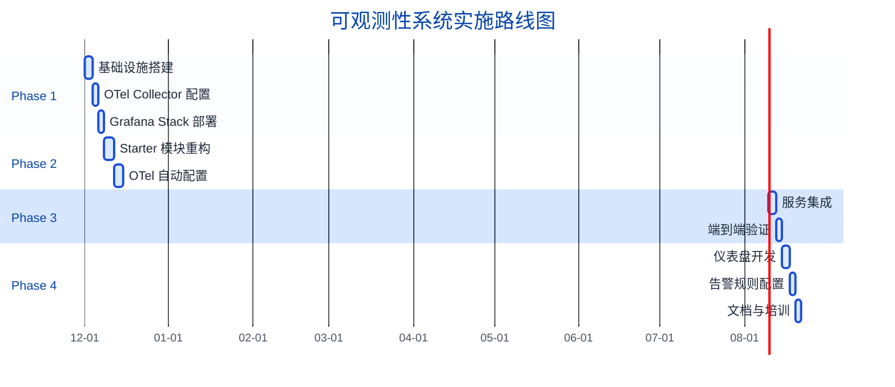
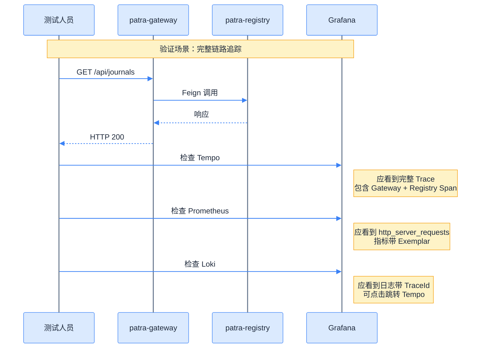
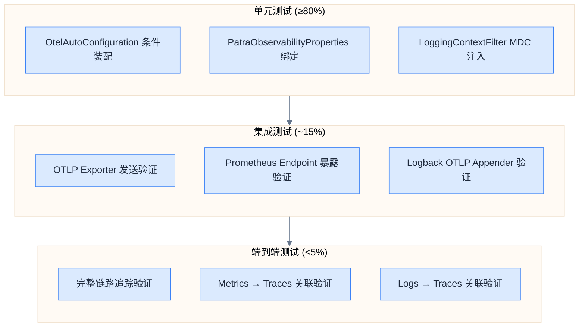

# 实现路线图

## 实施阶段概览



## Phase 1：基础设施搭建

### 目标

搭建完整的可观测性基础设施，包括 OTel Collector、Prometheus、Loki、Tempo、Grafana。

### 任务清单

| 任务 | 产出物 | 验收标准 |
|------|--------|----------|
| 创建 Docker Compose 配置 | `docker/docker-compose.observability.yaml` | `docker compose up -d` 启动成功 |
| 配置 OTel Collector | `docker/otel-collector/config.yaml` | 接收 OTLP 数据并路由到后端 |
| 配置 Prometheus | `docker/prometheus/prometheus.yml` | 正常抓取 Collector 指标 |
| 配置 Loki | `docker/loki/loki-config.yaml` | 日志存储和查询正常 |
| 配置 Tempo | `docker/tempo/tempo.yaml` | 链路存储和查询正常 |
| 配置 Grafana Provisioning | `docker/grafana/provisioning/*` | 数据源自动加载 |

### 目录结构

```
docker/
├── docker-compose.observability.yaml
├── otel-collector/
│   └── config.yaml
├── prometheus/
│   ├── prometheus.yml
│   └── rules/
│       └── alerts.yaml
├── loki/
│   └── loki-config.yaml
├── tempo/
│   └── tempo.yaml
├── alertmanager/
│   └── alertmanager.yml
└── grafana/
    ├── grafana.ini
    └── provisioning/
        ├── datasources/
        │   └── datasources.yaml
        ├── dashboards/
        │   └── dashboards.yaml
        └── alerting/
            └── alerting.yaml
```

### 验证步骤

```bash
# 1. 启动基础设施
docker compose -f docker/docker-compose.observability.yaml up -d

# 2. 验证服务健康
curl http://localhost:4318/v1/traces  # OTel Collector (HTTP)
curl http://localhost:9090/-/healthy   # Prometheus
curl http://localhost:3100/ready       # Loki
curl http://localhost:3200/ready       # Tempo
curl http://localhost:3000/api/health  # Grafana

# 3. 验证数据源连接
# 访问 http://localhost:3000 → Configuration → Data Sources
```

## Phase 2：Starter 模块重构

### 目标

重构 `patra-spring-boot-starter-observability` 模块，集成 OpenTelemetry。

### 任务清单

| 任务 | 产出物 | 验收标准 |
|------|--------|----------|
| 添加 OTel + Micrometer 依赖 | `pom.xml` 更新 | 依赖正确引入 |
| 创建 OtelAutoConfiguration | `OtelAutoConfiguration.java` | Bean 自动注册 |
| 重构 LoggingAutoConfiguration | `LoggingAutoConfiguration.java` | MDC 注入 TraceId |
| 更新配置属性 | `PatraObservabilityProperties.java` | 属性绑定正确 |
| 编写单元测试 | `*Test.java` | 覆盖率 ≥80% |
| 编写集成测试 | `*IT.java` | 端到端验证通过 |

### 依赖变更

**核心依赖：**

```xml
<!-- 添加 -->
<dependency>
    <groupId>io.micrometer</groupId>
    <artifactId>micrometer-tracing-bridge-otel</artifactId>
</dependency>
<dependency>
    <groupId>io.opentelemetry</groupId>
    <artifactId>opentelemetry-exporter-otlp</artifactId>
</dependency>
<dependency>
    <groupId>io.opentelemetry.instrumentation</groupId>
    <artifactId>opentelemetry-logback-appender-1.0</artifactId>
</dependency>
```

### 验证步骤

```bash
# 1. 编译验证
mvn clean compile -pl patra-spring-boot-starter-observability

# 2. 测试验证
mvn test -pl patra-spring-boot-starter-observability

# 3. 依赖检查
mvn dependency:tree -pl patra-spring-boot-starter-observability | grep opentelemetry
# 期望输出：包含 OpenTelemetry 相关依赖
```

## Phase 3：服务集成验证

### 目标

将所有微服务接入可观测性系统，验证三信号（Metrics/Traces/Logs）完整链路。

### 任务清单

| 任务 | 涉及服务 | 验收标准 |
|------|----------|----------|
| 下载 OTel Agent | 所有服务 | Agent JAR 存在 |
| 配置 JVM 参数 | 所有服务 | OTLP 导出成功 |
| 更新 Docker Compose | `docker-compose.yaml` | 服务正常启动 |
| 验证 Metrics | 所有服务 | Prometheus 有数据 |
| 验证 Traces | 所有服务 | Tempo 有链路 |
| 验证 Logs | 所有服务 | Loki 有日志 |
| 验证信号关联 | - | Metrics ↔ Traces ↔ Logs |

### 服务配置模板

**docker-compose.yaml 片段：**

```yaml
services:
  patra-registry:
    environment:
      JAVA_TOOL_OPTIONS: "-javaagent:/opt/otel/opentelemetry-javaagent.jar"
      OTEL_SERVICE_NAME: "patra-registry"
      OTEL_EXPORTER_OTLP_ENDPOINT: "http://otel-collector:4317"
      OTEL_RESOURCE_ATTRIBUTES: "service.version=1.0.0,deployment.environment=dev"
      OTEL_TRACES_SAMPLER: "parentbased_traceidratio"
      OTEL_TRACES_SAMPLER_ARG: "1.0"
      OTEL_METRICS_EXPORTER: "none"
      OTEL_LOGS_EXPORTER: "otlp"
    volumes:
      - ./docker/otel-agent/opentelemetry-javaagent.jar:/opt/otel/opentelemetry-javaagent.jar:ro
```

### 验证场景



## Phase 4：仪表盘与告警

### 目标

开发 Grafana 仪表盘，配置告警规则，完成文档和培训。

### 任务清单

| 任务 | 产出物 | 验收标准 |
|------|--------|----------|
| Services Overview 仪表盘 | `services-dashboard.json` | 展示服务健康状态 |
| JVM Metrics 仪表盘 | `jvm-dashboard.json` | 展示 JVM 指标 |
| HTTP Metrics 仪表盘 | `http-dashboard.json` | 展示 HTTP 请求统计 |
| 配置告警规则 | `alerting.yaml` | 告警触发正常 |
| 配置告警通知 | Alertmanager | 通知送达正常 |
| 编写操作手册 | `docs/runbook/` | 覆盖常见场景 |
| 培训材料 | `docs/learning/` | 已存在可复用 |

### 仪表盘验收标准

| 仪表盘 | 核心面板 | 数据刷新 |
|--------|----------|----------|
| Services Overview | 服务存活数、请求速率、错误率、P99 延迟 | 30s |
| JVM Metrics | Heap 使用、GC 暂停、线程数 | 30s |
| HTTP Metrics | 请求速率、延迟分布、状态码分布 | 15s |

### 告警验收标准

| 告警 | 触发条件 | 通知渠道 |
|------|----------|----------|
| High Error Rate | 错误率 > 1%，持续 5 分钟 | Webhook |
| High Latency | P99 > 1s，持续 5 分钟 | Webhook |
| Service Down | up == 0，持续 1 分钟 | Webhook |

## 测试策略

### 测试层级



### 测试用例

**单元测试：**

| 测试类 | 测试点 | 预期结果 |
|--------|--------|----------|
| `OtelAutoConfigurationTest` | `@ConditionalOnProperty` 条件 | 属性 false 时不加载 |
| `PatraObservabilityPropertiesTest` | 属性绑定 | YAML 配置正确映射 |
| `LoggingContextFilterTest` | MDC 注入 | TraceId 存在于 MDC |

**集成测试：**

| 测试类 | 测试点 | 依赖 |
|--------|--------|------|
| `OtlpExporterIT` | OTLP 发送 | WireMock 模拟 Collector |
| `PrometheusEndpointIT` | `/actuator/prometheus` | Spring Boot Test |
| `LogbackOtlpIT` | 日志导出 | TestContainers (OTel Collector) |

**端到端测试：**

| 测试类 | 测试点 | 依赖 |
|--------|--------|------|
| `TracingE2E` | 完整链路 | Docker Compose 全栈 |
| `SignalCorrelationE2E` | 信号关联 | Grafana API 验证 |

### 测试环境

```yaml
# TestContainers 配置
services:
  otel-collector:
    image: otel/opentelemetry-collector-contrib:0.90.0
    ports:
      - "4317:4317"  # gRPC
      - "4318:4318"  # HTTP

  # 可选：用于完整验证
  prometheus:
    image: prom/prometheus:v2.48.0
  loki:
    image: grafana/loki:2.9.0
  tempo:
    image: grafana/tempo:2.3.0
```

## 风险评估与缓解

### 风险矩阵

| 风险 | 可能性 | 影响 | 缓解措施 |
|------|--------|------|----------|
| OTel Agent 性能开销 | 中 | 中 | 压测验证，采样率调优 |
| OTLP 网络故障 | 低 | 中 | Collector 本地缓存，重试配置 |
| Grafana Stack 资源消耗 | 中 | 低 | 资源限制，数据保留策略 |
| 配置复杂度高 | 高 | 中 | 模板化配置，详细文档 |
| 团队学习曲线 | 中 | 低 | 培训材料，逐步推广 |

### 缓解措施详情

#### OTel Agent 性能开销

```yaml
# 采样策略：生产环境使用概率采样
OTEL_TRACES_SAMPLER: "parentbased_traceidratio"
OTEL_TRACES_SAMPLER_ARG: "0.1"  # 10% 采样率

# 资源监控
# 对比启用 Agent 前后的 CPU/Memory 使用
```

#### OTLP 网络故障

```yaml
# OTel Collector 配置：启用批处理和重试
exporters:
  otlp:
    endpoint: tempo:4317
    retry_on_failure:
      enabled: true
      initial_interval: 5s
      max_interval: 30s
      max_elapsed_time: 300s
```

#### 资源消耗

```yaml
# Docker Compose 资源限制
services:
  prometheus:
    deploy:
      resources:
        limits:
          memory: 2G
          cpus: '1.0'
```

## 回滚策略

### 快速回滚步骤

如果可观测性系统出现严重问题，可按以下步骤快速回滚：

```bash
# 1. 禁用 OTel Agent（移除 JAVA_TOOL_OPTIONS）
docker compose down
# 编辑 docker-compose.yaml，注释 JAVA_TOOL_OPTIONS
docker compose up -d

# 2. 可选：恢复上一版本配置（如有需要）
# 从 Git 恢复上一版本
git checkout HEAD~1 -- patra-spring-boot-starter-observability/

# 3. 重新部署
mvn clean package -DskipTests
docker compose up -d --build
```

### 回滚检查清单

- [ ] 服务正常启动
- [ ] 核心业务功能正常
- [ ] 无性能异常
- [ ] 日志正常输出（至少控制台）

## 验收标准总览

### Phase 1 验收

- [x] Docker Compose 一键启动所有组件
- [x] Grafana 自动加载所有数据源
- [x] 各组件健康检查通过

### Phase 2 验收

- [x] 基于 OpenTelemetry 标准实现
- [x] OTel Java Agent 模式配置完成
- [x] Logback Converter 单元测试覆盖（TraceIdConverter、SpanIdConverter、SegmentIdConverter）
- [ ] 集成测试全部通过

### Phase 3 验收

- [x] OTel SDK 成功初始化（日志显示 OTLP Exporter 配置）
- [x] HTTP Tracing 自动集成（ServerHttpObservationFilter + ObservationScopeFilter）
- [ ] 所有服务 Metrics 可查询
- [x] 所有服务 Traces 可查看（Tempo 验证通过）
- [x] 所有服务 Logs 带 TraceId（MDC 传播修复完成）
- [ ] Metrics ↔ Traces ↔ Logs 可关联跳转

### Phase 4 验收

- [ ] 三个核心仪表盘可用
- [ ] 告警触发并通知成功
- [ ] 操作手册覆盖常见场景

## 相关链接

- 上一章：[[06-grafana-visualization|Grafana 可视化]]
- 下一章：[[08-version-matrix|版本矩阵]]
- 索引：[[_MOC|可观测性系统设计]]
- ADR：[[../../decisions/ADR-005-adopt-opentelemetry-grafana-stack-for-observability|ADR-005]]
