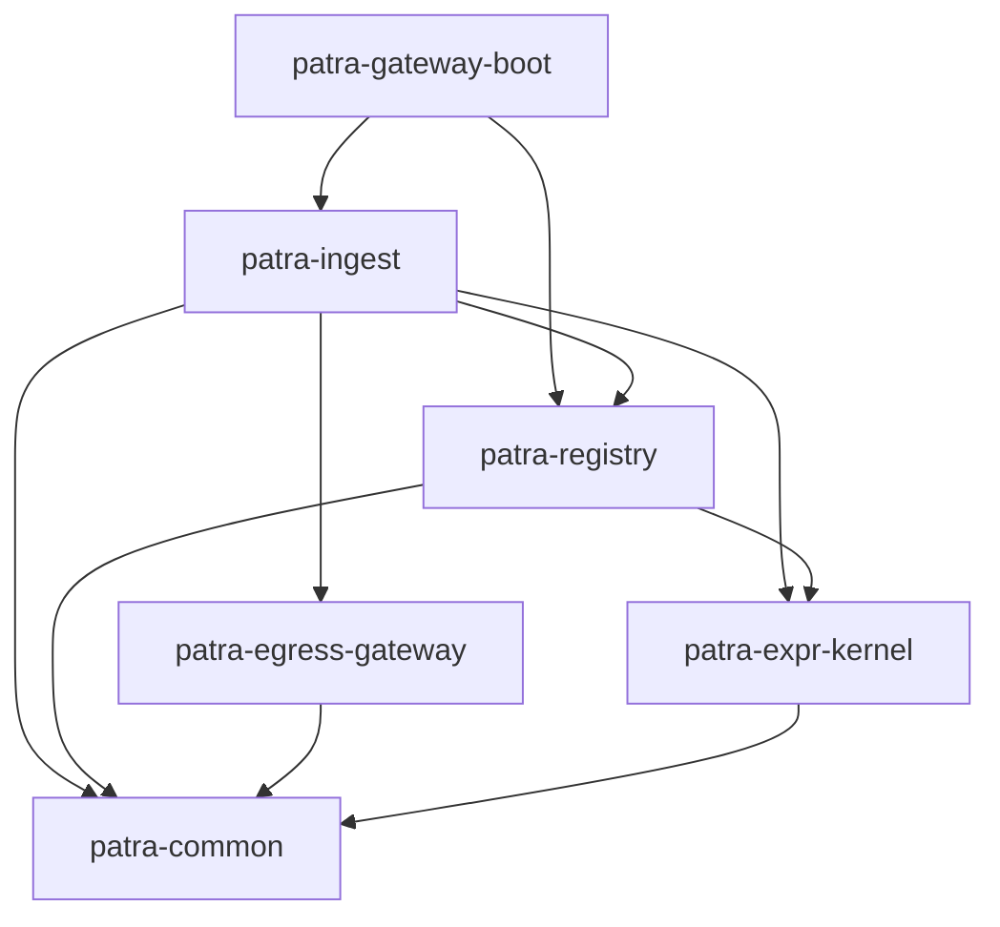

# 模块文档索引

> Papertrace 微服务模块架构与深入指南

---

## 📄 模块列表

### 核心业务微服务

#### 1. patra-ingest（采集引擎）
- **[六边形架构图](./ingest/architecture-diagram.md)** - Event-Driven + DDD 架构
- **深入指南**：规划中
- **关键能力**：
  - 调度任务管理（Schedule → Plan → Slice → Task）
  - 批量数据采集（Run → Batch → Cursor）
  - 事件驱动（Outbox 模式）
  - 幂等性保证

#### 2. patra-registry（配置中心）
- **[六边形架构图](./registry/architecture-diagram.md)** - SSOT 配置管理
- **深入指南**：规划中
- **关键能力**：
  - Provenance 数据源配置
  - 多维度配置管理（HTTP/Pagination/Retry/RateLimit）
  - 表达式定义与能力映射
  - 时间有效性与灰度切换

#### 3. patra-egress-gateway（南向网关）
- **[深入指南](./egress-gateway/deep-dive.md)** - 统一出站服务调用
- **关键能力**：
  - 外部服务透传（PubMed、PMC、OSS、邮件）
  - 弹性能力（限流、重试、熔断、超时）
  - 响应语义统一（ResponseEnvelope）
  - 配置管理（系统级 + 业务方覆盖）

### 基础设施微服务

#### 4. patra-gateway-boot（API 网关）
- **[深入指南](./gateway/deep-dive.md)** - 统一接入网关
- **关键能力**：
  - 路由聚合（动态路由、路径重写）
  - 服务发现与负载均衡
  - 安全策略（JWT、CORS、限流）
  - 错误形态对齐（ProblemDetail）

### 工具库模块

#### 5. patra-common
- **模块说明**：[patra-common/README.md](../../patra-common/README.md)
- **关键能力**：
  - 通用工具类（Hutool 扩展）
  - 基础数据结构
  - 常量定义

#### 6. patra-expr-kernel
- **模块说明**：[patra-expr-kernel/README.md](../../patra-expr-kernel/README.md)
- **深入指南**：[docs/modules/expr-kernel/deep-dive.md](./expr-kernel/README.md)
- **关键能力**：
  - 表达式解析与执行
  - 上下文管理
  - 内置函数库

---

## 🔗 相关文档

### 系统架构
- [系统架构总览](../overview/architecture.md)
- [C4 容器架构图](../overview/architecture.md#1-c4-container-架构图系统总览)
- [数据流部署视图](../overview/architecture.md#3-数据流部署视图)

### 业务流程
- [采集数据流](../process/ingest-dataflow.md)
- [Outbox 发布流程](../process/outbox-publishing.md)
- [Registry 配置生命周期](../process/registry-config-lifecycle.md)

### 数据模型
- [核心数据模型 ER 图](../database/er-diagrams.md)

---

## 📝 贡献指南

### 添加新模块文档
1. 创建模块目录：`docs/modules/{module-name}/`
2. 创建架构图：`docs/modules/{module-name}/architecture-diagram.md`
3. 创建深入指南：`docs/modules/{module-name}/deep-dive.md`
4. 更新本索引文件

### 模块文档结构
```
docs/modules/{module-name}/
├── architecture-diagram.md    # 六边形架构图（Mermaid）
├── deep-dive.md               # 深入指南（详细文档）
└── README.md                  # 模块索引（可选）
```

### 架构图模板
参考：[patra-ingest 六边形架构图](./ingest/architecture-diagram.md)

### 深入指南模板
参考：[模块深入指南模板](../templates/module-deep-dive-template.md)

---

## 🗂️ 模块分类

### 按分层分类

| 分层 | 模块 | 说明 |
|------|------|------|
| 边缘层 | patra-gateway-boot | API 网关 |
| 业务层 | patra-ingest, patra-registry | 核心业务服务 |
| 基础设施层 | patra-egress-gateway | 南向网关 |
| 工具层 | patra-common, patra-expr-kernel | 通用工具库 |
| Starters | patra-spring-boot-starter-* | 自定义 Starters |

### 按职责分类

| 职责 | 模块 | 说明 |
|------|------|------|
| 数据采集 | patra-ingest | 采集任务调度与执行 |
| 配置管理 | patra-registry | SSOT 配置中心 |
| 外部调用 | patra-egress-gateway | 统一出站网关 |
| 路由聚合 | patra-gateway-boot | 统一入站网关 |
| 表达式引擎 | patra-expr-kernel | 动态表达式解析 |

---

## 📊 模块依赖关系



---

## 🔧 模块开发规范

### 模块命名规范
- **微服务**：`patra-{service-name}`
- **子模块**：`patra-{service-name}-{layer}`
  - `{layer}` ∈ {api, adapter, app, domain, infra, boot}

### 模块结构规范
```
patra-{service}/
├── patra-{service}-api/          # 外部契约（DTOs、Client 接口）
├── patra-{service}-adapter/      # 入站适配器（REST、MQ、Job）
├── patra-{service}-app/          # 应用层（用例编排）
├── patra-{service}-domain/       # 领域层（聚合、值对象、端口）
├── patra-{service}-infra/        # 基础设施层（端口实现）
└── patra-{service}-boot/         # 启动模块
```

### 依赖方向规范
```
Adapter → App + API
App → Domain
Infra → Domain
Domain → 仅依赖 patra-common
```

---

## 📈 模块统计

### 代码行数统计
```bash
# 统计各模块的代码行数
cloc patra-ingest patra-registry patra-egress-gateway patra-gateway-boot \
     --by-file-by-lang --exclude-dir=target
```

### 依赖关系统计
```bash
# 统计各模块的依赖数量
mvn dependency:tree -pl patra-ingest | grep "com.papertrace" | wc -l
mvn dependency:tree -pl patra-registry | grep "com.papertrace" | wc -l
```

---

**更新记录**

| 版本 | 日期 | 变更说明 | 作者 |
|-----|------|---------|------|
| 1.0 | 2025-10-08 | 初始版本：模块文档索引 | docs-engineer |

---

**许可证**

Copyright © 2025 Papertrace
