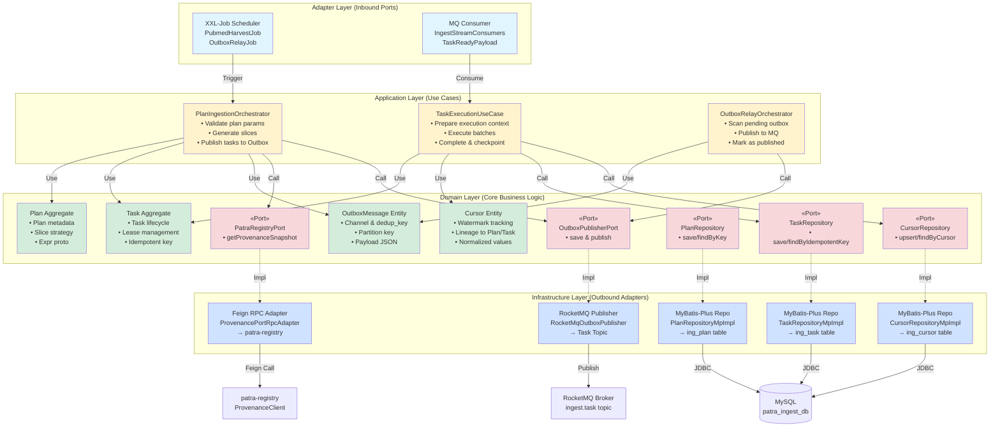
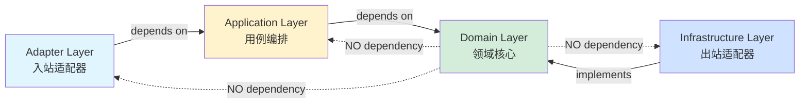
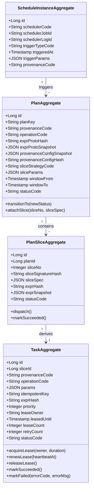
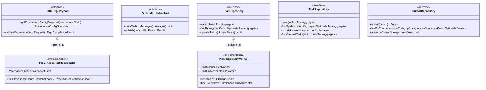

# patra-ingest 六边形架构图

> 采集引擎微服务 - 六边形架构 + DDD + Event-Driven  
> 更新时间: 2025-10-08

---

## 目录
1. [六边形架构总览](#1-六边形架构总览)
2. [分层依赖关系](#2-分层依赖关系)
3. [关键聚合与端口](#3-关键聚合与端口)
4. [渲染说明](#渲染说明)

---

## 1. 六边形架构总览

### 基础版(结构清晰)



### 详细版(含关键类)

```mermaid
graph TB
    subgraph "Adapter Layer - Inbound (入站适配器)"
        direction LR
        S1[scheduler/<br/>PubmedHarvestJob<br/>OutboxRelayJob]
        S2[stream/<br/>IngestStreamConsumers<br/>TaskReadyPayload]
    end
    
    subgraph "Application Layer - Use Cases (应用层编排)"
        direction TB
        subgraph "Plan Use Case"
            P1[PlanIngestionOrchestrator<br/>• execute PlanIngestionCommand<br/>• validate via PlannerValidator<br/>• assemble via PlanAssembler<br/>• slice via SlicePlannerRegistry<br/>• publish via TaskOutboxPublisher]
            P2[SlicePlannerRegistry<br/>• TimeSlicePlanner<br/>• SingleSlicePlanner]
        end
        
        subgraph "Execution Use Case"
            E1[TaskExecutionUseCase<br/>• prepare: load context & acquire lease<br/>• execute: BatchPlannerRegistry → BatchExecutorRegistry<br/>• complete: update cursor & release lease]
            E2[BatchPlannerRegistry<br/>• DefaultBatchPlanner]
            E3[BatchExecutorRegistry<br/>• DefaultBatchExecutor]
        end
        
        subgraph "Relay Use Case"
            R1[OutboxRelayOrchestrator<br/>• scan pending outbox messages<br/>• publish via RelayEventPublisher<br/>• mark as PUBLISHED<br/>• retry failed messages]
        end
    end
    
    subgraph "Domain Layer - Core (领域核心)"
        direction TB
        subgraph "Aggregates"
            A1[PlanAggregate<br/>• planKey, provenanceCode<br/>• exprProtoHash, exprProtoSnapshot<br/>• provenanceConfigSnapshot<br/>• sliceStrategy, sliceParams<br/>• window from/to, statusCode]
            A2[TaskAggregate<br/>• idempotentKey, exprHash<br/>• params, priority<br/>• lease: owner/until/count<br/>• retry, lastError<br/>• statusCode, timeline]
            A3[PlanSliceAggregate<br/>• sliceNo, sliceSignatureHash<br/>• sliceSpec, exprSnapshot<br/>• statusCode]
            A4[ScheduleInstanceAggregate<br/>• schedulerCode, jobId, logId<br/>• triggerType, triggeredAt<br/>• triggerParams, provenanceCode]
        end
        
        subgraph "Entities"
            E_Outbox[OutboxMessage<br/>• aggregateType/Id<br/>• channel, opType<br/>• partitionKey, dedupKey<br/>• payloadJson, headersJson<br/>• status, retryCount]
            E_Cursor[Cursor<br/>• provenanceCode, operationCode<br/>• cursorKey, namespaceScope/Key<br/>• cursorType, cursorValue<br/>• normalizedInstant/Numeric<br/>• lineage to Plan/Task/Run/Batch]
            E_TaskRun[TaskRun<br/>• taskId, attemptNo<br/>• status, checkpoint, stats<br/>• window, timeline]
        end
        
        subgraph "Ports (出站端口)"
            Port1[«Port» PatraRegistryPort<br/>getProvenanceConfigSnapshot]
            Port2[«Port» OutboxPublisherPort<br/>saveOutboxMessages]
            Port3[«Port» PlanRepository<br/>save/findByKey/updateStatus]
            Port4[«Port» TaskRepository<br/>save/findByIdempotentKey/updateLease]
            Port5[«Port» CursorRepository<br/>upsert/findByCursorKey]
            Port6[«Port» OutboxMessageRepository<br/>findPending/updateStatus]
        end
    end
    
    subgraph "Infrastructure Layer - Outbound (出站适配器)"
        direction LR
        I1[rpc/registry/<br/>ProvenancePortRpcAdapter<br/>→ ProvenanceClient Feign]
        I2[messaging/<br/>RocketMqOutboxPublisher<br/>→ RocketMQTemplate]
        I3[persistence/repository/<br/>PlanRepositoryMpImpl<br/>TaskRepositoryMpImpl<br/>CursorRepositoryMpImpl<br/>OutboxMessageRepositoryMpImpl<br/>→ MyBatis-Plus]
    end
    
    S1 -->|Trigger| P1
    S2 -->|Consume| E1
    
    P1 --> P2
    P1 --> A1
    P1 --> A2
    P1 --> A3
    P1 --> E_Outbox
    P1 -->|Call| Port1
    P1 -->|Call| Port2
    P1 -->|Call| Port3
    
    E1 --> E2
    E1 --> E3
    E1 --> A2
    E1 --> E_Cursor
    E1 --> E_TaskRun
    E1 -->|Call| Port4
    E1 -->|Call| Port5
    
    R1 --> E_Outbox
    R1 -->|Call| Port6
    R1 -->|Call| Port2
    
    Port1 -.->|Impl| I1
    Port2 -.->|Impl| I2
    Port3 -.->|Impl| I3
    Port4 -.->|Impl| I3
    Port5 -.->|Impl| I3
    Port6 -.->|Impl| I3
    
    I1 -->|Feign RPC| Ext1[patra-registry<br/>GET /provenance/{code}/snapshot]
    I2 -->|Publish Message| Ext2[RocketMQ<br/>Topic: ingest.task]
    I3 -->|JDBC/MyBatis-Plus| Ext3[(MySQL 8.0<br/>patra_ingest_db)]
    
    style S1 fill:#e1f5ff,stroke:#0066cc,stroke-width:2px
    style S2 fill:#e1f5ff,stroke:#0066cc,stroke-width:2px
    style P1 fill:#fff3cd,stroke:#cc9900,stroke-width:2px
    style P2 fill:#fff3cd,stroke:#cc9900,stroke-width:2px
    style E1 fill:#fff3cd,stroke:#cc9900,stroke-width:2px
    style E2 fill:#fff3cd,stroke:#cc9900,stroke-width:2px
    style E3 fill:#fff3cd,stroke:#cc9900,stroke-width:2px
    style R1 fill:#fff3cd,stroke:#cc9900,stroke-width:2px
    style A1 fill:#d4edda,stroke:#00aa66,stroke-width:3px
    style A2 fill:#d4edda,stroke:#00aa66,stroke-width:3px
    style A3 fill:#d4edda,stroke:#00aa66,stroke-width:3px
    style A4 fill:#d4edda,stroke:#00aa66,stroke-width:3px
    style E_Outbox fill:#d4edda,stroke:#00aa66,stroke-width:2px
    style E_Cursor fill:#d4edda,stroke:#00aa66,stroke-width:2px
    style E_TaskRun fill:#d4edda,stroke:#00aa66,stroke-width:2px
    style Port1 fill:#f8d7da,stroke:#cc0000,stroke-width:2px,stroke-dasharray: 5 5
    style Port2 fill:#f8d7da,stroke:#cc0000,stroke-width:2px,stroke-dasharray: 5 5
    style Port3 fill:#f8d7da,stroke:#cc0000,stroke-width:2px,stroke-dasharray: 5 5
    style Port4 fill:#f8d7da,stroke:#cc0000,stroke-width:2px,stroke-dasharray: 5 5
    style Port5 fill:#f8d7da,stroke:#cc0000,stroke-width:2px,stroke-dasharray: 5 5
    style Port6 fill:#f8d7da,stroke:#cc0000,stroke-width:2px,stroke-dasharray: 5 5
    style I1 fill:#cfe2ff,stroke:#0066cc,stroke-width:2px
    style I2 fill:#cfe2ff,stroke:#0066cc,stroke-width:2px
    style I3 fill:#cfe2ff,stroke:#0066cc,stroke-width:2px
```

---

## 2. 分层依赖关系

### 依赖方向规则



### 模块划分

| 模块 | 包路径 | 职责 | 依赖 |
|-----|--------|------|------|
| **patra-ingest-domain** | `com.patra.ingest.domain` | 纯 Java 领域模型、端口定义 | 仅依赖 `patra-common` |
| **patra-ingest-app** | `com.patra.ingest.app` | 用例编排、应用服务 | domain + patra-common + core-starter |
| **patra-ingest-infra** | `com.patra.ingest.infra` | MyBatis-Plus、Feign、RocketMQ | domain + mybatis-starter + feign-starter |
| **patra-ingest-adapter** | `com.patra.ingest.adapter` | XXL-Job、MQ Consumer | app + web-starter |
| **patra-ingest-api** | `com.patra.ingest.api` | 对外 API 契约(DTO) | 无框架依赖 |
| **patra-ingest-boot** | `com.patra.ingest` | 可执行启动类 | 所有模块 |

---

## 3. 关键聚合与端口

### 领域聚合根



### 关键端口接口



---

## 渲染说明

### 在线渲染
- **Mermaid Live Editor**: https://mermaid.live
- **GitHub/GitLab**: Markdown 原生支持
- **Confluence**: 使用 Mermaid Plugin

### 本地渲染
```bash
# VS Code 插件
# 安装: Markdown Preview Mermaid Support

# CLI 导出
npm install -g @mermaid-js/mermaid-cli
mmdc -i architecture-diagram.md -o hexagonal-arch.png -b transparent
```

### 图例说明

| 颜色 | 含义 |
|-----|------|
| 🔵 蓝色 | Adapter 层(入站/出站) |
| 🟡 黄色 | Application 层(用例编排) |
| 🟢 绿色 | Domain 层(领域核心) |
| 🔴 红色虚线 | Port 接口(端口) |
| ⚪ 灰色 | 外部系统 |

---

## 相关文档

- [系统架构总览](../../overview/architecture-diagrams.md)
- [核心数据模型 ER 图](../../database/er-diagrams.md)
- [任务执行流程文档](../../../TaskExecution-Flowchart.md)
- [patra-ingest README](../../../patra-ingest/README.md)

---

## 更新记录

| 版本 | 日期 | 变更说明 | 作者 |
|-----|------|---------|------|
| 1.0 | 2025-10-08 | 初始版本:六边形架构图、分层依赖、聚合与端口 | System |
