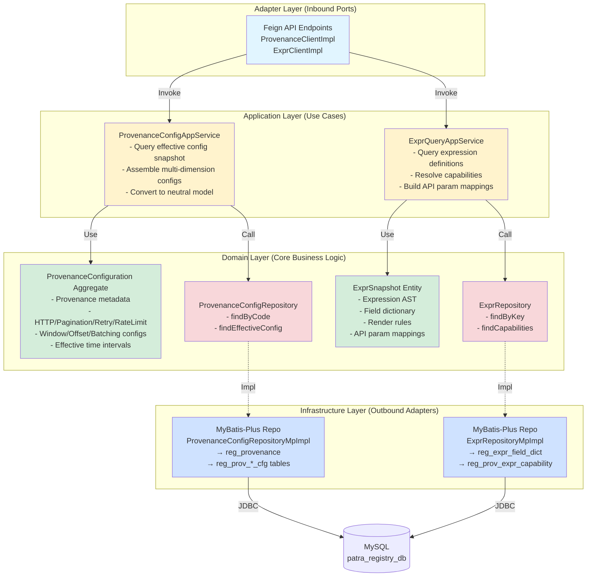
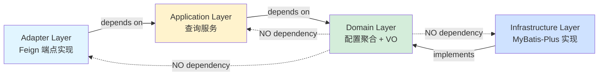
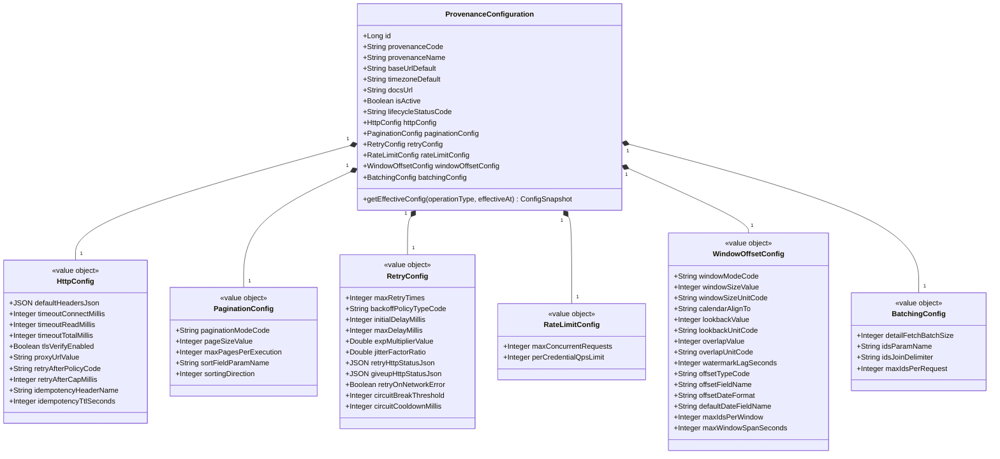
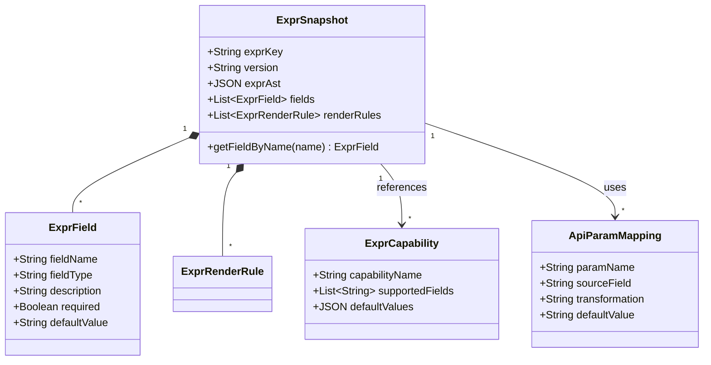
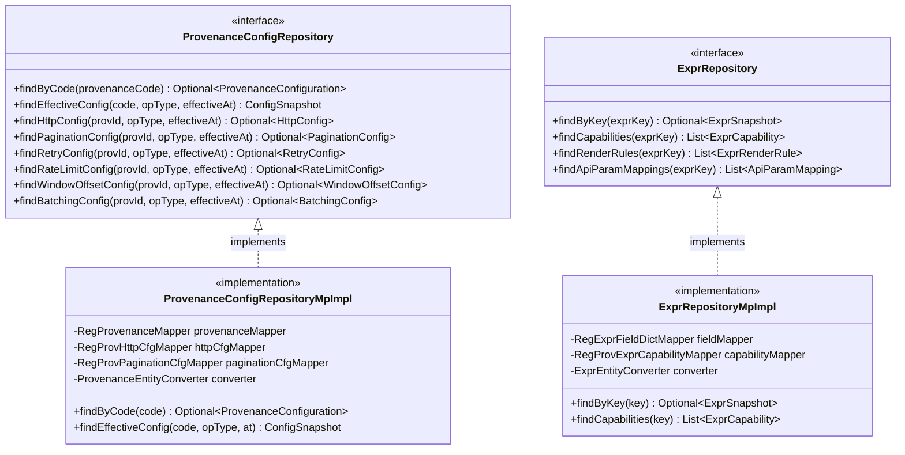

# patra-registry 六边形架构图

> 配置中心微服务 (SSOT) - 六边形架构 + DDD  
> 更新时间: 2025-10-08

---

## 目录
1. [六边形架构总览](#1-六边形架构总览)
2. [分层依赖关系](#2-分层依赖关系)
3. [关键聚合与端口](#3-关键聚合与端口)
4. [渲染说明](#渲染说明)

---

## 1. 六边形架构总览

### 基础版(结构清晰)



### 详细版(含关键类与配置维度)

```mermaid
graph TB
    subgraph "Adapter Layer - Inbound (入站适配器)"
        direction LR
        A1[rest/feign/<br/>ProvenanceClientImpl<br/>- GET /provenance/{code}/snapshot<br/>- GET /provenance/{code}/config]
        A2[rest/feign/<br/>ExprClientImpl<br/>- GET /expr/capabilities<br/>- GET /expr/render-rules]
    end
    
    subgraph "Application Layer - Use Cases (应用层服务)"
        direction TB
        subgraph "Provenance Query"
            P1[ProvenanceConfigAppService<br/>- queryEffectiveSnapshot<br/>- assembleFromMultiDimensions<br/>- convertToNeutralModel]
            P2[ProvenanceQueryAssembler<br/>- buildHttpConfigQuery<br/>- buildPaginationConfigQuery<br/>- buildRetryConfigQuery<br/>- buildRateLimitConfigQuery<br/>- buildWindowOffsetQuery<br/>- buildBatchingConfigQuery]
        end
        
        subgraph "Expression Query"
            E1[ExprQueryAppService<br/>- findExprSnapshot<br/>- findCapabilities<br/>- resolveApiParamMappings]
            E2[ExprQueryAssembler<br/>- assembleExprFields<br/>- assembleRenderRules]
        end
    end
    
    subgraph "Domain Layer - Core (领域核心)"
        direction TB
        subgraph "Aggregates"
            Agg1[ProvenanceConfiguration<br/>- Provenance identity<br/>- baseUrlDefault, timezone<br/>- docsUrl, isActive<br/>- lifecycleStatus]
        end
        
        subgraph "Value Objects (配置维度)"
            VO1[HttpConfig<br/>- defaultHeaders<br/>- timeout: connect/read/total<br/>- tlsVerify, proxyUrl<br/>- retryAfterPolicy, idempotency]
            VO2[PaginationConfig<br/>- paginationMode<br/>- pageSize, maxPages<br/>- sortField, direction]
            VO3[RetryConfig<br/>- maxRetryTimes<br/>- backoffPolicy, delays<br/>- retryHttpStatus, circuitBreaker]
            VO4[RateLimitConfig<br/>- maxConcurrent<br/>- perCredentialQps]
            VO5[WindowOffsetConfig<br/>- windowMode, size, unit<br/>- lookback, overlap, watermark<br/>- offsetType, fieldName, format]
            VO6[BatchingConfig<br/>- batchSize, idsParamName<br/>- idsJoinDelimiter<br/>- maxIdsPerRequest]
        end
        
        subgraph "Expression Models"
            Expr1[ExprSnapshot<br/>- exprKey, version<br/>- exprAst, fields<br/>- renderRules]
            Expr2[ExprCapability<br/>- capability name<br/>- supported fields<br/>- default values]
            Expr3[ApiParamMapping<br/>- paramName, sourceField<br/>- transformation, defaultValue]
        end
        
        subgraph "Ports (出站端口)"
            Port1[«Port» ProvenanceConfigRepository<br/>findByCode<br/>findEffectiveConfig<br/>findHttpConfig<br/>findPaginationConfig<br/>findRetryConfig<br/>findRateLimitConfig<br/>findWindowOffsetConfig<br/>findBatchingConfig]
            Port2[«Port» ExprRepository<br/>findByKey<br/>findCapabilities<br/>findRenderRules<br/>findApiParamMappings]
        end
    end
    
    subgraph "Infrastructure Layer - Outbound (出站适配器)"
        direction LR
        I1[persistence/repository/<br/>ProvenanceConfigRepositoryMpImpl<br/>- Join queries across:<br/>&nbsp;&nbsp;reg_provenance<br/>&nbsp;&nbsp;reg_prov_http_cfg<br/>&nbsp;&nbsp;reg_prov_pagination_cfg<br/>&nbsp;&nbsp;reg_prov_retry_cfg<br/>&nbsp;&nbsp;reg_prov_rate_limit_cfg<br/>&nbsp;&nbsp;reg_prov_window_offset_cfg<br/>&nbsp;&nbsp;reg_prov_batching_cfg]
        I2[persistence/repository/<br/>ExprRepositoryMpImpl<br/>- Query:<br/>&nbsp;&nbsp;reg_expr_field_dict<br/>&nbsp;&nbsp;reg_prov_expr_capability<br/>&nbsp;&nbsp;reg_prov_expr_render_rule<br/>&nbsp;&nbsp;reg_prov_api_param_map]
    end
    
    A1 -->|Invoke| P1
    A2 -->|Invoke| E1
    
    P1 --> P2
    P1 --> Agg1
    P1 --> VO1
    P1 --> VO2
    P1 --> VO3
    P1 --> VO4
    P1 --> VO5
    P1 --> VO6
    P1 -->|Call| Port1
    
    E1 --> E2
    E1 --> Expr1
    E1 --> Expr2
    E1 --> Expr3
    E1 -->|Call| Port2
    
    Port1 -.->|Impl| I1
    Port2 -.->|Impl| I2
    
    I1 -->|MyBatis-Plus + Join| Ext1[(MySQL 8.0<br/>patra_registry_db<br/>- reg_provenance<br/>- reg_prov_*_cfg)]
    I2 -->|MyBatis-Plus| Ext2[(MySQL 8.0<br/>patra_registry_db<br/>- reg_expr_*<br/>- reg_prov_expr_*)]
    
    style A1 fill:#e1f5ff,stroke:#0066cc,stroke-width:2px
    style A2 fill:#e1f5ff,stroke:#0066cc,stroke-width:2px
    style P1 fill:#fff3cd,stroke:#cc9900,stroke-width:2px
    style P2 fill:#fff3cd,stroke:#cc9900,stroke-width:2px
    style E1 fill:#fff3cd,stroke:#cc9900,stroke-width:2px
    style E2 fill:#fff3cd,stroke:#cc9900,stroke-width:2px
    style Agg1 fill:#d4edda,stroke:#00aa66,stroke-width:3px
    style VO1 fill:#d4edda,stroke:#00aa66,stroke-width:2px
    style VO2 fill:#d4edda,stroke:#00aa66,stroke-width:2px
    style VO3 fill:#d4edda,stroke:#00aa66,stroke-width:2px
    style VO4 fill:#d4edda,stroke:#00aa66,stroke-width:2px
    style VO5 fill:#d4edda,stroke:#00aa66,stroke-width:2px
    style VO6 fill:#d4edda,stroke:#00aa66,stroke-width:2px
    style Expr1 fill:#d4edda,stroke:#00aa66,stroke-width:2px
    style Expr2 fill:#d4edda,stroke:#00aa66,stroke-width:2px
    style Expr3 fill:#d4edda,stroke:#00aa66,stroke-width:2px
    style Port1 fill:#f8d7da,stroke:#cc0000,stroke-width:2px,stroke-dasharray: 5 5
    style Port2 fill:#f8d7da,stroke:#cc0000,stroke-width:2px,stroke-dasharray: 5 5
    style I1 fill:#cfe2ff,stroke:#0066cc,stroke-width:2px
    style I2 fill:#cfe2ff,stroke:#0066cc,stroke-width:2px
```

---

## 2. 分层依赖关系

### 依赖方向规则



### 模块划分

| 模块 | 包路径 | 职责 | 依赖 |
|-----|--------|------|------|
| **patra-registry-domain** | `com.patra.registry.domain` | 配置聚合、VO、端口定义 | 仅依赖 `patra-common` |
| **patra-registry-app** | `com.patra.registry.app` | 查询服务、DTO 转换 | domain + patra-common + core-starter |
| **patra-registry-infra** | `com.patra.registry.infra` | MyBatis-Plus 多表 Join 实现 | domain + mybatis-starter |
| **patra-registry-adapter** | `com.patra.registry.adapter` | Feign API 端点(ClientImpl) | app + api + web-starter |
| **patra-registry-api** | `com.patra.registry.api` | 对外 API 契约(Resp DTO) | 无框架依赖 |
| **patra-registry-boot** | `com.patra.registry` | 可执行启动类 | 所有模块 |

---

## 3. 关键聚合与端口

### 配置聚合根与值对象



### 表达式模型



### 关键端口接口



---

## 渲染说明

### 在线渲染
- **Mermaid Live Editor**: https://mermaid.live
- **GitHub/GitLab**: Markdown 原生支持
- **Confluence**: 使用 Mermaid Plugin

### 本地渲染
```bash
# VS Code 插件
# 安装: Markdown Preview Mermaid Support

# CLI 导出
npm install -g @mermaid-js/mermaid-cli
mmdc -i architecture-diagram.md -o registry-hexagonal.png -b transparent
```

### 图例说明

| 颜色 | 含义 |
|-----|------|
| 🔵 蓝色 | Adapter 层(Feign API 端点) |
| 🟡 黄色 | Application 层(查询服务) |
| 🟢 绿色 | Domain 层(配置聚合 + VO) |
| 🔴 红色虚线 | Port 接口(仓储端口) |
| ⚪ 灰色 | 外部系统(MySQL) |

---

## 配置维度说明

patra-registry 采用**多维度配置策略**,每个维度在独立表中存储并支持时间有效区间:

| 维度 | 表名 | 作用 | 关键字段 |
|-----|------|------|---------|
| **HTTP 策略** | `reg_prov_http_cfg` | 超时、重试后处理、代理、TLS | `timeout_*`, `retry_after_policy`, `proxy_url` |
| **分页策略** | `reg_prov_pagination_cfg` | 分页模式、页大小、排序 | `pagination_mode`, `page_size`, `max_pages` |
| **重试策略** | `reg_prov_retry_cfg` | 重试次数、退避、熔断 | `max_retry_times`, `backoff_policy`, `circuit_*` |
| **限流策略** | `reg_prov_rate_limit_cfg` | 并发、QPS、令牌桶 | `max_concurrent`, `per_credential_qps` |
| **窗口偏移** | `reg_prov_window_offset_cfg` | 时间窗口、offset 类型 | `window_mode`, `offset_type`, `lookback` |
| **批处理** | `reg_prov_batching_cfg` | 批大小、ID 拼接 | `batch_size`, `ids_param_name`, `max_ids` |

查询时,应用层通过 `ProvenanceQueryAssembler` 从各维度表中查询 **当前生效的配置** (基于 `effective_from/to` 区间),组装成完整的 `ProvenanceConfigSnapshot`.

---

## 相关文档

- [系统架构总览](../../overview/architecture-diagrams.md)
- [patra-ingest 六边形架构图](../ingest/architecture-diagram.md)
- [核心数据模型 ER 图](../../database/er-diagrams.md)
- [patra-registry API 文档](../../../patra-registry/patra-registry-api/README.md)

---

## 更新记录

| 版本 | 日期 | 变更说明 | 作者 |
|-----|------|---------|------|
| 1.0 | 2025-10-08 | 初始版本:六边形架构、配置维度、聚合与端口 | System |
