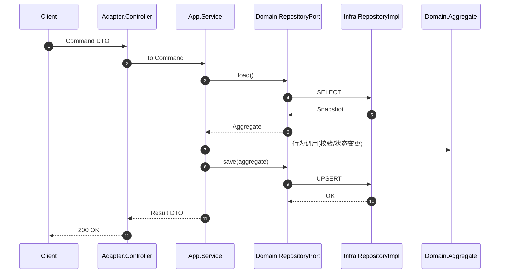
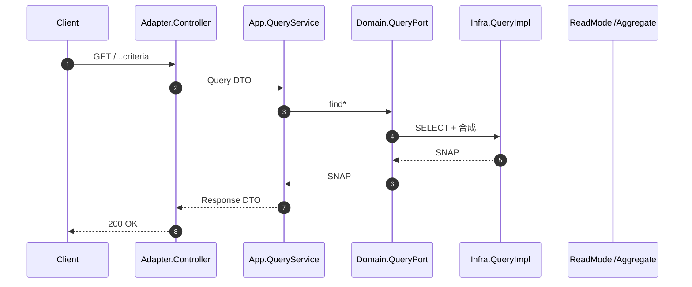

<div align="center">

# patra-registry

Registry 服务 = Papertrace 平台“元数据与配置”的 **单一可信源（SSOT）**。它为采集/解析/表达式渲染等下游组件提供：

| 子域         | 能力                                                  | 典型消费者                   |
|------------|-----------------------------------------------------|-------------------------|
| Dictionary | 统一字典类型/字典项/别名视图，状态过滤与校验                             | ingest / gateway / 规则引擎 |
| Provenance | 医学数据来源（来源配置 + 窗口/分页/限流/重试/HTTP/凭证 等切片）时间/Scope 维度合成 | ingest 采集调度             |
| Expr       | 表达式字段能力 + 渲染规则 + API 参数映射合成快照                       | ingest / 分析层 (构建动态查询)   |

采用 **六边形架构 + DDD + CQRS（读侧聚合/快照）**，保持领域纯净与外部技术解耦。

</div>

---

## 1. 子域（Subdomains）与核心建模

### 1.1 Dictionary 子域

只读聚合 `Dictionary` 聚合：`DictionaryType` + `DictionaryItem[]` + `DictionaryAlias[]`。
聚合内规则：

* 强制 ID 与类型 code 一致
* 默认项 ≤ 1（多默认即数据风险）
* 视图投影：enabled / visible / default 筛选与排序
* 引用校验：返回语义化 `ValidationResult`（NOT_FOUND / DISABLED / SUCCESS）

### 1.2 Provenance 子域

配置 = 多切片（Slice）按 Scope + 时间生效窗口 聚合：
`Provenance` + `WindowOffsetConfig` + `PaginationConfig` + `HttpConfig` + `BatchingConfig` +
`RetryConfig` + `RateLimitConfig` + `Credential`。

组装算法（简化伪代码）：

```
input: provenanceCode, operationType, operationCode, now
scope layers = [SOURCE, TASK]    // 先加载 SOURCE 层，再用 TASK 层覆盖
for each sliceType in SLICES:
  rows = query DB where provenance = ? and effective_from <= now and (effective_to is null or effective_to > now)
  map by (scope, operationType?, operation?)
  merge: SOURCE putIfAbsent; TASK 覆盖同 key
build ProvenanceConfiguration { each slice pick merged map entries }
```

有效性：若同一 scope+task+op 同一时间区间重叠多条 → 未来引入一致性检查（健康诊断）。

### 1.3 Expr 子域

表达式快照 = 以下集合的 Scope 合成：

* 字段能力：`ExprCapability` （支持操作符/范围类型/值类型）
* 渲染规则：`ExprRenderRule`（模板、匹配类型、是否分组、list joiner、functionCode）
* API 参数映射：`ApiParamMapping`（标准化 → Provider 参数 + 变换策略 hook）

合成规则：

1. 分别按 (scope, operationType?) 加载 SOURCE 层
2. 加载 TASK 层（存在则覆盖同 key）
3. 形成 `ExprSnapshot`（内部 map 保留覆盖后的顺序，使用 LinkedHashMap）
4. 查询调用链只读；不在 snapshot 中做计算副作用。

### 1.4 时间生效模型

所有切片/规则对象均具备 `(effectiveFrom, effectiveTo?)`：

```
isEffectiveAt(t) = !t.isBefore(effectiveFrom) && (effectiveTo == null || t.isBefore(effectiveTo))
```

存储端查询已做起始过滤；调用端可二次过滤保障幂等一致。

### 1.5 Scope Fallback 统一语义

```
优先级：SOURCE < TASK
合成：先插入 SOURCE，再用 TASK 覆盖同 key（key = scope|operationType|operation 可部分缺省）
operationType / operationCode 允许占位 "ALL"（标准化阶段统一填充）
```

### 1.6 配置生效流程（摘要）
1. 在管理端写入配置（或通过 SQL 种子导入）
2. 数据按 `effective_from` / `effective_to` 控制时间窗口
3. Registry 读取时依据 `Scope` 优先级 SOURCE < TASK 合并
4. 最终快照通过 Feign 暴露给 ingest / 分析服务

---

## 2. 分层结构与依赖（Hexagonal）

```
boot      → adapter, infra            # 已精简：不再直接依赖 app / api / domain
adapter   → app, api                  # 适配层负责错误映射 SPI Bean（迁自 boot）
app       → domain, patra-common
infra     → domain, patra-spring-boot-starter-mybatis
domain    → patra-common (无框架)
api       → jakarta.validation （契约层）
```

原则：不反向依赖；领域层零 Spring/ORM；只读查询允许专用 read model（当前聚合即视图）。

### 模块职责速览

| 模块      | 职责                                     | 关键约束                      |
|---------|----------------------------------------|---------------------------|
| api     | 对外 DTO/枚举/错误码/Feign 接口                 | 不含实现逻辑                    |
| adapter | 协议适配（REST/MQ/Scheduler）+ 错误映射 SPI Bean | 仅编排+转换；集中异常→错误码映射         |
| app     | 用例服务/事务/事件发布                           | 不做 IO 细节，依赖端口             |
| domain  | 聚合/VO/端口/不变量                           | 不依赖框架；聚合纯函数化（尽量）          |
| infra   | 仓储实现/DB 映射                             | 不跨层调用 app/adapter         |
| boot    | 启动、配置注入（组合根）                           | 不直接引用 domain/api；不再放置错误映射 |

### 2.1 最近结构调整（2025-09）

| 调整        | 说明                                                 | 目标收益                          |
|-----------|----------------------------------------------------|-------------------------------|
| 错误映射类迁移   | `RegistryErrorMappingContributor` 从 boot → adapter | 避免 boot 直依 domain/api，收敛组合根职责 |
| boot 依赖精简 | 移除对 app / api / domain 的直接依赖                       | 防止越层引用，降低误用风险                 |
| 依赖方向文档更新  | 本节图示更新                                             | 与实际 POM 一致，减少认知偏差             |

---

## 3. 核心运行数据流

### 3.1 写操作（未来场景预留 / 当前多为读聚合）



### 3.2 读操作（主流路径）



### 3.3 Outbox 事件（规划中）

未来字典变更、来源配置变更将通过 Outbox → MQ 推送缓存刷新事件；当前阶段尚未启用写侧。

---

## 4. 错误与异常模型

| 分类             | 异常类型                            | 说明                  | 映射策略                        |
|----------------|---------------------------------|---------------------|-----------------------------|
| 通用领域校验         | `DomainValidationException`     | 输入/不变量违反（参数为空、范围非法） | HTTP 400 (BAD_REQUEST)      |
| 语义状态（字典项禁用等）   | `DictionaryItemDisabled` 等      | 业务状态不允许             | REG-14xx (422 / 409 / 404)  |
| 资源不存在          | `DictionaryNotFoundException`   | 区分类型/项级             | REG-1401 / REG-1402         |
| 数据一致性          | `DictionaryDefaultItemMissing`  | 缺失默认项               | REG-1408                    |
| 仓储异常           | `DictionaryRepositoryException` | DB/驱动层异常封装          | REG-1409 / 500              |
| 配额/限流          | `RegistryQuotaExceeded`         | 业务速率或容量限制           | REG-1501 (429)              |
| Spring Data 异常 | DuplicateKey / OptimisticLock   | 冲突/并发               | HTTP.CONFLICT/UNPROCESSABLE |

新增统一异常带来的工程收益：

* 日志：可在全局异常处理器中对 4xx 校验错误降级为 debug
* 指标：`registry.validation.errors.count{field?}`
* 可扩展：后续分裂 `DomainSemanticException`（映射 422）以精细区分语法 vs 语义错误

---

## 5. 统一校验与标准化

| 场景                      | 行为                                  |
|-------------------------|-------------------------------------|
| Scope 值                 | 空白 → 抛 `DomainValidationException`  |
| operationType / operation 缺省 | 归一化为 "ALL"                          |
| key 大小写                 | 依据需要统一 `trim()` 并保留大小写（下游渲染敏感）      |
| 时间窗口                    | `effectiveFrom` 必填；`effectiveTo` 可空 |

后续可引入：

* JSON Schema 对复杂 `paramsJson` 提前校验
* 批量错误收集（一次性返回多个字段问题）

### 5.1 参数校验异常实现细则

统一使用 `DomainValidationException` 替代零散 `IllegalArgumentException`，并通过静态工具方法集中表达校验语义：

| Helper 方法                         | 用途                | 典型使用场景                       |
|-----------------------------------|-------------------|------------------------------|
| `require(condition, message)`     | 任意布尔断言            | 复合跨字段规则 / 自定义描述              |
| `notBlank(value, field)`          | 字符串非空（返回 trim 后值） | code / key / type / timezone |
| `nonNull(obj, field)`             | 非 null            | 时间、必要引用对象                    |
| `positive(id, field)`             | >0 ID 校验          | 主键 / 配置 ID / 计数初始值           |
| `nonNegative(n, field)`           | >=0               | 偏移量 / 重试次数 / 并发度             |
| `notEmpty(arr, field)`            | 数组非空              | 需要至少一个元素的枚举集合                |
| `withinRange(v, min, max, field)` | 数值闭区间             | 窗口大小 / 速率限制 / 长度限制           |

实践要点：

1. 构造器（或静态工厂）首段集中调用 helper（早失败）
2. helper 返回的 trim 结果直接赋值，避免重复 trim
3. 复杂跨字段规则：先原子校验 → 组合 `require`
4. 聚合根保持“纯校验 + 赋值”，不做外部 IO 或上下文感知逻辑
5. 若未来需要集合校验，追加 `notEmpty(Collection, field)` 后批量替换

迁移进度：Dictionary / Provenance / Expr 三子域 VO + ReadModel + 聚合 已全部完成；历史 IllegalArgumentException
仅在文档说明中保留背景。

示例前后对比：

```java
// Before
if(operationCode ==null||operationCode.isBlank()){
        throw new IllegalArgumentException("Operation code cannot be blank");
}

// After
String opCodeTrimmed = DomainValidationException.notBlank(operationCode, "Operation code");
```

未来扩展（规划）：

* 错误消息国际化（message key + 多语言资源）
* 错误码分层：REGISTRY.VALIDATION.* / REGISTRY.SEMANTIC.*
* 批量错误聚合：收集所有字段错误一次性给前端
* 统计指标：`registry.validation.errors.count{field=...,domain=...}`

> 约定：新增任何新的领域校验场景优先补充 helper，避免在调用点重新发明条件逻辑。

---

## 6. 可扩展点（Extension Points）

| 点位      | 接口/位置                        | 扩展示例                            |
|---------|------------------------------|---------------------------------|
| 字典查询    | `DictionaryRepository`       | 替换为带缓存实现（Caffeine + 版本号）        |
| 来源配置合成  | `ProvenanceConfigRepository` | 增强切片合法性检测 / 冲突检测                |
| 表达式渲染策略 | （未来）`ExprRenderEngine` 端口    | 支持多模板引擎 (Mustache / Handlebars) |
| Key 归一化 | `RegistryKeyNormalizer`      | 添加大小写/分隔符策略                     |
| 错误映射    | `ErrorMappingContributor`    | 注册新领域异常 → 错误码                   |
| 缓存失效广播  | Outbox / MQ 主题               | 数据修改后通知下游清缓存                    |

---

## 7. 性能与缓存（规划）

| 目标            | 方案                                      | 优先级  |
|---------------|-----------------------------------------|------|
| 减少热查询 DB 压力   | Redis分布式缓存 + 定时刷新                       | HIGH |
| 减少快照构建开销      | Snapshot 结构缓存（key: provenance+operationType） | HIGH |
| 避免重复 JSON 解析  | 预编译渲染模板缓存                               | MID  |
| 大字典分页下发       | Adapter 层分页接口                           | MID  |
| 热 Key Metrics | Micrometer + percentiles                | MID  |

缓存失效策略：版本号（row version / updated_at max）+ 主动失效事件。

---

## 8. 观测性（Observability）

| 类别          | 指标/日志                           | 说明                                  |
|-------------|---------------------------------|-------------------------------------|
| 领域校验        | validation.errors.count         | 分标签：type=Dictionary/Expr/Prov       |
| Snapshot 构建 | snapshot.build.duration         | Timer（含 provenanceCode, layerCount） |
| DB 查询       | mapper.select.timer / row.count | MyBatis 拦截器或 starter 内支持            |
| 缓存          | cache.hit / miss / evict        | Caffeine Metrics                    | 
| 健康巡检（规划）    | registry.health.state           | 聚合数据一致性扫描结果                         |

日志规范：所有异常路径携带 traceId；领域校验降级为 debug。

---

## 9. 数据一致性与幂等

| 关注点        | 风险   | 控制措施（规划+现状）               |
|------------|------|---------------------------|
| 多默认字典项     | 业务歧义 | 构造时检测（已实现）                |
| 时间窗口重叠     | 配置竞态 | 后续新增冲突检测扫描任务              |
| Scope 覆盖顺序 | 非确定性 | 固化顺序：SOURCE→TASK（已实现）     |
| 快照缓存过期     | 读取陈旧 | 版本号 + 失效广播（规划）            |
| 参数映射缺失     | 下游异常 | 构建 snapshot 时校验必需 Key（规划） |

建议建立定时巡检任务，检测以下风险：

- 同一 scope + task + operation 的时间窗口重叠
- Dictionary 默认项超过 1 条
- Expr 能力缺失必需字段

---

## 10. 测试策略

| 层级       | 目标          | 建议覆盖               |
|----------|-------------|--------------------|
| domain   | 不变量与边界      | 多默认项、时间窗口、Scope 合并 |
| infra    | 映射与查询       | Slice 合成、空结果、覆盖顺序  |
| app      | 用例编排        | 参数校验→仓储调用顺序        |
| adapter  | 契约          | DTO 序列化、错误码映射      |
| 性能基准（可选） | Snapshot 构建 | 冷/热缓存耗时对比          |

---

## 11. 版本与演进

* 错误码：追加式（不复用/不删除），格式 `REG-1xxx`（2xxx 预留给后续新子域）。

---

## 12. Roadmap

| 序 | 项目                        | 类型   | 状态  |
|---|---------------------------|------|-----|
| 1 | 统一领域校验异常 + 全量替换           | 基础设施 | 已完成 |
| 2 | Caffeine 缓存 + 版本失效        | 性能   | 待办  |
| 3 | Snapshot 预编译（表达式/模板）      | 性能   | 待办  |
| 4 | Outbox 事件广播缓存刷新           | 可扩展  | 待办  |
| 5 | JSON Schema 校验 paramsJson | 数据质量 | 待办  |
| 6 | 健康巡检任务（周期扫描）              | 可观测性 | 待办  |
| 7 | 分层错误码细化 422 vs 400        | 可维护  | 待办  |

---

## 13. FAQ

| 问题                                   | 解答                                  |
|--------------------------------------|-------------------------------------|
| 为什么是“读多写少”设计？                        | 当前平台前期以稳定消费统一配置为核心；写侧后续按需引入变更流程与审计。 |
| Scope 覆盖为什么 TASK 覆盖 SOURCE？          | TASK 更细粒度（特定任务或操作），语义上优先级更高。        |
| 何时需要新错误码而不是 400？                     | 当错误具备可语义识别与监控价值（如资源不存在、状态禁用、配额超限）。  |
| 为什么不用 Spring Validation 注解直接套在 VO 上？ | 避免领域层引入框架依赖；保持构造器语义明确。              |
| 表达式模板可否运行时拼接？                        | 允许，但推荐预编译缓存；避免高频反复解析。               |

---

## 14. 贡献与规范

* 小步提交，聚焦单一子域或单一技术改进。
* 新聚合/VO：构造器内必须校验不变量；禁止延迟校验。
* 添加错误码：更新 `ERROR_CODE_CATALOG.md`，不得复用既有编号。
* 性能相关改动：附基准（前后 latency 或构建耗时）。
* PR 模板字段：Changelog / 风险 / 回滚策略 / 验证步骤。
* 配置变更采用追加式（append-only），避免直接修改历史记录；关键配置使用事务并记录操作人。
* 批量导入先在测试库验证，可参考 `docs/modules/registry/sql` 样例。
* 写侧尚未启用 Outbox，变更后请关注缓存失效与快照一致性（参见 Roadmap）。

---

## 15. 附：快速定位表结构（命名约定节选）

| 表                            | 说明                                                                                               |
|------------------------------|--------------------------------------------------------------------------------------------------|
| reg_dict_type / item / alias | 字典类型 / 项 / 外部别名                                                                                  |
| reg_prov_*                   | Provenance 切片（endpoint / window / pagination / http / batching / retry / ratelimit / credential） |
| reg_prov_expr_*              | 表达式能力（field / capability / render_rule / api_param_mapping）                                      |


## 16. 附：常用命令

```bash
# 校验模块测试
cd patra-registry && ../../mvnw -q test

# 单独运行 Boot 服务（本地）
../../mvnw -pl patra-registry/patra-registry-boot -am spring-boot:run
```

## 17. 延伸阅读

- 模块 README：`patra-registry/README.md`
- SQL 种子：`docs/modules/registry/sql`
- 错误规范：`docs/standards/platform-error-handling.md`
