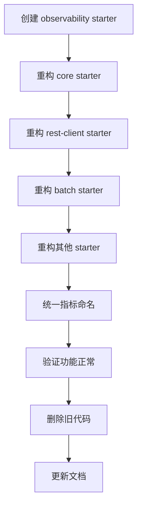

# Patra 统一可观测性 Starter 设计方案

> **版本**: 1.0.0
> **状态**: 设计阶段
> **作者**: Jobs (Claude AI Assistant)
> **日期**: 2025-11-23
> **项目类型**: 绿地项目（Greenfield Project）- 可进行破坏性重构

---

## 📋 文档目录

- [执行摘要](#执行摘要)
- [背景与目标](#背景与目标)
- [现状分析](#现状分析)
- [架构设计](#架构设计)
- [技术选型](#技术选型)
- [模块设计](#模块设计)
- [API 设计](#api-设计)
- [配置设计](#配置设计)
- [实施计划](#实施计划)
- [重构策略](#重构策略)
- [测试策略](#测试策略)
- [性能评估](#性能评估)
- [风险评估](#风险评估)
- [成功标准](#成功标准)
- [附录](#附录)

---

## 执行摘要

### 核心目标
设计并实现一个**统一的、生产级的、一步到位的**可观测性 Starter，整合 **Metrics（指标）**、**Tracing（追踪）**、**Logging（日志）** 三大支柱，为 Patra 项目提供完整的可观测性解决方案。

### 关键决策
1. **破坏性重构**：基于绿地项目特性，直接实现最优架构，不考虑向后兼容
2. **统一抽象**：基于 Spring Boot 3.x 的 Micrometer Observation API 构建统一抽象层
3. **混合后端**：同时支持 SkyWalking（主）+ Prometheus（辅）双后端
4. **零代码侵入**：通过 AutoConfiguration 和 AOP 实现自动化集成
5. **集中管理**：所有可观测性配置集中在一个 Starter 中

### 预期收益
- ✅ **统一标准**：所有服务使用一致的可观测性配置和 API
- ✅ **开箱即用**：添加依赖即可自动启用分布式追踪和指标收集
- ✅ **生产就绪**：基于业界最佳实践，性能开销可控（< 10%）
- ✅ **易于扩展**：通过 SPI 和 ObservationHandler 机制支持自定义扩展
- ✅ **完整文档**：提供详尽的使用文档、配置示例和故障排查指南

---

## 背景与目标

### 项目背景

**Patra** 是一个医学文献数据平台，采用微服务架构 + 六边形架构 + DDD，目前处于绿地项目阶段（无历史包袱，可自由重构）。

**现状问题**：
1. **SkyWalking 未启用**：依赖已引入，但 Java Agent 未配置，分布式追踪无法工作
2. **指标分散**：8 个模块各自实现指标收集，缺乏统一标准和管理
3. **配置混乱**：追踪、指标、日志配置分散在各个 Starter 中
4. **Batch 缺失**：Spring Batch 的可观测性仅有 TODO 标记，未实现
5. **命名不统一**：指标命名、标签使用、配置前缀缺乏一致性

### 设计目标

#### 主要目标
1. **统一可观测性平台**
   - 集成 Metrics、Tracing、Logging 三大支柱
   - 统一配置入口和管理方式
   - 统一命名规范和标签体系

2. **生产级可靠性**
   - 性能开销可控（CPU < 10%，内存 < 50MB）
   - 支持优雅降级和熔断保护
   - 完善的错误处理和日志记录

3. **开发者友好**
   - 零代码侵入，自动配置
   - 合理的默认值，开箱即用
   - 详尽的文档和示例

4. **高度可扩展**
   - 支持自定义 ObservationHandler
   - 支持多后端导出（SkyWalking、Prometheus、Grafana）
   - 支持业务自定义指标和追踪

#### 次要目标
1. **技术债务清理**：重构现有分散的可观测性实现
2. **标准化**：建立可观测性最佳实践和编码规范
3. **工具链完善**：提供 Grafana Dashboard、告警规则模板

### 非目标
1. **APM 替代品**：不是完整的 APM 解决方案，依赖 SkyWalking 作为后端
2. **业务监控**：不包含业务指标的定义，由各服务自行实现
3. **日志聚合**：不提供日志聚合功能，依赖 ELK Stack

---

## 现状分析

### 现有可观测性实现分布

根据调研，现有可观测性实现分散在以下模块：

| 模块 | 功能 | 实现位置 | 问题 |
|-----|------|---------|------|
| **patra-starter-core** | 追踪传播、MDC、错误观测 | `TracingInterceptor`, `ErrorObservationRecorder` | 配置分散，缺乏统一管理 |
| **patra-starter-rest-client** | HTTP 请求指标 | `MetricsInterceptor`, `TracingInterceptor` | 独立实现，命名不统一 |
| **patra-starter-object-storage** | 存储操作指标 | `ObjectStorageMetrics` | 独立实现 |
| **patra-starter-provenance** | API 调用指标 | `ProvenanceMetrics` | 独立实现 |
| **patra-starter-expr** | 编译器指标 | `ExprMetrics` | 独立实现 |
| **patra-starter-batch** | Batch Job 可观测性 | `ObservabilityAutoConfiguration` (TODO) | 未实现 |
| **patra-catalog-infra** | MeSH 导入指标 | `MeshImportMetrics` | 业务层实现 |
| **patra-ingest-app** | Outbox 指标 | `OutboxMetrics`, `OutboxRelayMetrics` | 业务层实现 |
| **patra-starter-feign** | Feign 错误观测 | `MicrometerFeignErrorObservationRecorder` | 独立实现 |
| **patra-starter-redisson** | 分布式锁指标 | `LockMetricsRecorder` | 独立实现 |

### 关键发现

#### 优势
- ✅ **基础完善**：Micrometer 依赖已引入，MeterRegistry 可用
- ✅ **指标丰富**：关键业务场景已有指标收集
- ✅ **SkyWalking 准备**：依赖和日志集成已完成
- ✅ **条件装配**：大量使用 `@ConditionalOnBean` 等注解

#### 问题
- ❌ **缺乏统一标准**：指标命名、标签使用各异
  - REST Client: `rest_client_requests_success_total`
  - Object Storage: `patra.object_storage.upload.total`
  - Provenance: `provenance.client.api.duration`
- ❌ **配置分散**：追踪、指标配置散落在各 Starter 的 Properties 中
- ❌ **SkyWalking Agent 未启动**：无法进行分布式追踪
- ❌ **重复实现**：MetricsInterceptor、TracingInterceptor 在多个模块重复
- ❌ **缺乏全局控制**：无法统一开关、调整采样率、配置公共标签

### 业界对标

参考以下业界方案：
- **Spring Cloud Sleuth** (已废弃，迁移到 Micrometer Tracing)
- **Spring Boot Actuator** + Micrometer Observation
- **OpenTelemetry Java Agent**
- **SkyWalking Toolkit**

**最佳实践选择**：
> **Micrometer Observation API** 作为统一抽象层，SkyWalking 作为主要后端，Prometheus 作为辅助后端。

---

## 架构设计

### 整体架构

```
┌─────────────────────────────────────────────────────────────────────────┐
│                         Patra 微服务应用                                 │
│                                                                           │
│  ┌─────────────────────────────────────────────────────────────────┐   │
│  │              业务代码 (Domain, App, Infra, Adapter)             │   │
│  │  - 可选：使用 @Observed 注解标记关键方法                        │   │
│  │  - 可选：注入 MeterRegistry 自定义指标                          │   │
│  └────────────────────────┬────────────────────────────────────────┘   │
│                           │                                              │
│  ┌────────────────────────▼────────────────────────────────────────┐   │
│  │          patra-spring-boot-starter-observability                │   │
│  │  ┌────────────────────────────────────────────────────────┐    │   │
│  │  │         Micrometer Observation API (统一抽象)          │    │   │
│  │  │  - ObservationRegistry (自动配置)                      │    │   │
│  │  │  - @Observed AOP 支持                                  │    │   │
│  │  │  - ObservationHandler 链                               │    │   │
│  │  └────────┬─────────────────────────────┬─────────────────┘    │   │
│  │           │                             │                       │   │
│  │  ┌────────▼──────────┐        ┌────────▼──────────────┐       │   │
│  │  │  Metrics Path     │        │   Tracing Path        │       │   │
│  │  │  (Micrometer)     │        │   (SkyWalking Agent)  │       │   │
│  │  └─────────┬─────────┘        └───────────┬───────────┘       │   │
│  │            │                               │                    │   │
│  │  ┌─────────▼──────────┐         ┌─────────▼──────────┐        │   │
│  │  │ CompositeMeter     │         │  SkyWalking Java   │        │   │
│  │  │ Registry           │         │  Agent (Bytecode   │        │   │
│  │  │  ├─ Skywalking     │         │  Instrumentation)  │        │   │
│  │  │  └─ Prometheus     │         │  - Trace Context   │        │   │
│  │  └─────────┬──────────┘         │  - Span 生成       │        │   │
│  │            │                     └──────────┬─────────┘        │   │
│  └────────────┼────────────────────────────────┼──────────────────┘   │
│               │                                │                       │
│  ┌────────────▼────────────────────────────────▼──────────────────┐   │
│  │              现有 Starter (重构后集成)                           │   │
│  │  - rest-client: 使用统一 Observation API                        │   │
│  │  - object-storage: 使用统一 Metrics API                         │   │
│  │  - batch: 实现 ObservationJobListener                           │   │
│  │  - feign: 使用统一错误观测                                       │   │
│  └──────────────────────────────────────────────────────────────────┘   │
└───────────────────────────────────────────────────────────────────────┘
             │                                 │
             ▼                                 ▼
    ┌────────────────┐              ┌──────────────────┐
    │  SkyWalking    │              │  SkyWalking      │
    │  OAP Server    │◄─────────────│  OAP Server      │
    │  (Meter        │  gRPC 11800  │  (Trace          │
    │   Receiver)    │              │   Receiver)      │
    └────────┬───────┘              └──────────┬───────┘
             │                                 │
             ▼                                 ▼
    ┌────────────────┐              ┌──────────────────┐
    │  Elasticsearch │              │  Elasticsearch   │
    │  (存储)        │              │  (存储)          │
    └────────────────┘              └──────────────────┘
             │                                 │
             └─────────────┬───────────────────┘
                           ▼
                  ┌──────────────────┐
                  │  SkyWalking UI   │
                  │  (可视化)        │
                  │  localhost:8088  │
                  └──────────────────┘
```

### 三层架构

#### 第一层：统一抽象层（patra-spring-boot-starter-observability）
**职责**：
- 提供统一的可观测性 API 和配置
- 管理 ObservationRegistry 和 MeterRegistry
- 注册和管理 ObservationHandler
- 配置公共标签和命名规范
- 提供自动配置和条件装配

**核心组件**：
- `ObservabilityAutoConfiguration`：主配置类
- `ObservabilityProperties`：统一配置属性
- `ObservationHandlerChain`：Handler 管理
- `CommonTagsCustomizer`：公共标签配置
- `MetricNamingConvention`：指标命名规范

#### 第二层：后端集成层
**职责**：
- 集成 SkyWalking Agent（分布式追踪）
- 集成 SkyWalking Meter Registry（指标收集）
- 集成 Prometheus Registry（指标导出）
- 配置 Logback + SkyWalking（日志关联）

**核心组件**：
- `SkyWalkingMeterAutoConfiguration`：SkyWalking Meter 配置
- `PrometheusAutoConfiguration`：Prometheus 配置
- `LogbackAutoConfiguration`：日志配置
- `TracePropagationFilter`：追踪上下文传播

#### 第三层：应用层（现有 Starter 重构）
**职责**：
- 使用统一的 Observation API 进行追踪
- 使用统一的 MeterRegistry 进行指标收集
- 遵守统一的命名规范和标签体系

**重构内容**：
- REST Client：使用 Observation.createNotStarted()
- Object Storage：统一指标命名为 `patra.storage.*`
- Batch：实现 ObservationJobListener
- Feign：使用统一错误观测
- Provenance：统一指标命名为 `patra.provenance.*`

### 数据流

#### Metrics 数据流
```
业务代码
  ↓ (注入 MeterRegistry)
Counter.increment() / Timer.record()
  ↓
CompositeMeterRegistry
  ├─→ SkywalkingMeterRegistry → SkyWalking OAP (gRPC:11800)
  └─→ PrometheusMeterRegistry → /actuator/prometheus (HTTP:8080)
```

#### Tracing 数据流
```
HTTP 请求到达
  ↓
SkyWalking Agent 自动拦截
  ↓
创建 Trace 和 Span
  ↓
TraceContext.traceId() 注入到 MDC
  ↓
业务代码执行（自动或手动 @Trace）
  ↓
SkyWalking Agent 上报 → OAP Server (gRPC:11800)
```

#### Logging 数据流
```
业务代码调用 log.info()
  ↓
Logback 拦截
  ↓
TraceIdConverter 从 SkyWalking TraceContext 提取 traceId
  ↓
MDC 注入 traceId, spanId, segmentId
  ↓
日志输出：[trace:abc123,seg:001,span:789] Log message
  ↓ (可选)
Logstash 收集 → Elasticsearch → Kibana 可视化
```

---

## 技术选型

### 核心依赖

| 组件 | 版本 | 用途 | 必需/可选 |
|-----|------|------|----------|
| **Spring Boot** | 3.5.7 | 基础框架 | 必需 |
| **Spring Boot Actuator** | 3.5.7 | 端点暴露 | 必需 |
| **Micrometer Core** | 1.14.0+ | 指标抽象 | 必需 |
| **Micrometer Observation** | 1.14.0+ | 可观测性抽象 | 必需 |
| **SkyWalking Java Agent** | 9.5.0 | 分布式追踪 | 必需 |
| **SkyWalking Toolkit Trace** | 9.5.0 | 手动埋点 | 必需 |
| **SkyWalking Toolkit Logback** | 9.5.0 | 日志集成 | 必需 |
| **SkyWalking Micrometer Registry** | 9.5.0 | 指标导出 | 必需 |
| **Micrometer Registry Prometheus** | 1.14.0+ | Prometheus 导出 | 可选 |
| **Logback** | 1.5.x | 日志框架 | 必需 |
| **Spring AOP** | 3.5.7 | @Observed 支持 | 必需 |

### 依赖关系图

```
patra-spring-boot-starter-observability
├── spring-boot-starter-actuator (必需)
├── spring-boot-starter-aop (必需，支持 @Observed)
├── micrometer-core (必需，Actuator 自动引入)
├── micrometer-observation (必需，Actuator 自动引入)
├── apm-toolkit-trace (必需)
├── apm-toolkit-logback-1.x (必需)
├── apm-toolkit-micrometer-registry (必需)
├── micrometer-registry-prometheus (可选)
├── patra-spring-boot-starter-core (optional: true，编译期依赖)
├── patra-spring-boot-starter-rest-client (optional: true，编译期依赖)
└── patra-spring-boot-starter-batch (optional: true，编译期依赖)

patra-spring-boot-starter-core
❌ 绝对不能依赖 observability（保持纯净）

patra-spring-boot-starter-rest-client
❌ 绝对不能依赖 observability（保持纯净）

patra-spring-boot-starter-batch
❌ 绝对不能依赖 observability（保持纯净）

应用服务（如 patra-ingest-boot）
├── patra-spring-boot-starter-observability（显式引入以启用可观测性）
├── patra-spring-boot-starter-core（业务依赖）
├── patra-spring-boot-starter-rest-client（业务依赖）
└── patra-spring-boot-starter-batch（业务依赖）
```

### 技术选型理由

#### 为什么选择 Micrometer Observation？
1. **Spring Boot 3.x 官方推荐**：替代已废弃的 Spring Cloud Sleuth
2. **统一抽象**：一次埋点，同时支持 Metrics 和 Tracing
3. **与 Spring 生态集成**：与 Spring MVC、WebFlux、Batch 无缝集成
4. **灵活扩展**：通过 ObservationHandler 机制支持自定义逻辑

#### 为什么选择 SkyWalking？
1. **APM 完整性**：同时支持 Metrics、Tracing、Logging
2. **性能优秀**：基准测试显示 CPU 开销仅 10%
3. **中文友好**：国内社区活跃，文档齐全
4. **字节码增强**：无代码侵入，自动拦截 HTTP、DB、RPC
5. **已有基础**：项目已引入 SkyWalking 依赖和 Docker 环境

#### 为什么保留 Prometheus？
1. **生态丰富**：Grafana 社区 Dashboard 丰富
2. **灵活查询**：PromQL 强大，适合临时分析
3. **Pull 模式**：适合服务发现场景
4. **备份方案**：SkyWalking 故障时仍可通过 Prometheus 查看指标

---

## 模块设计

### 目录结构

```
patra-spring-boot-starter-observability/
├── pom.xml
├── README.md
├── src/main/java/com/patra/starter/observability/
│   ├── autoconfigure/                           # 自动配置
│   │   ├── ObservabilityAutoConfiguration.java              # 主配置类
│   │   ├── MicrometerAutoConfiguration.java                 # Micrometer 配置
│   │   ├── SkyWalkingMeterAutoConfiguration.java            # SkyWalking Meter
│   │   ├── PrometheusAutoConfiguration.java                 # Prometheus 配置
│   │   ├── LogbackAutoConfiguration.java                    # Logback 配置
│   │   ├── ObservationHandlerAutoConfiguration.java         # Handler 配置
│   │   └── package-info.java
│   ├── config/                                  # 配置属性
│   │   ├── ObservabilityProperties.java                     # 主配置属性
│   │   ├── MetricsProperties.java                           # 指标配置
│   │   ├── TracingProperties.java                           # 追踪配置
│   │   ├── LoggingProperties.java                           # 日志配置
│   │   └── package-info.java
│   ├── handler/                                 # ObservationHandler
│   │   ├── LoggingObservationHandler.java                   # 日志 Handler
│   │   ├── PerformanceObservationHandler.java               # 性能 Handler
│   │   ├── SensitiveDataMaskingHandler.java                 # 敏感数据脱敏 Handler (P0)
│   │   ├── AlertingObservationHandler.java                  # 告警 Handler (未来)
│   │   └── package-info.java
│   ├── filter/                                  # MeterFilter
│   │   ├── CommonTagsMeterFilter.java                       # 公共标签
│   │   ├── MetricNamingMeterFilter.java                     # 命名规范
│   │   ├── HighCardinalityMeterFilter.java                  # 高基数过滤
│   │   └── package-info.java
│   ├── convention/                              # 命名规范
│   │   ├── PatraNamingConvention.java                       # Patra 命名规范
│   │   └── package-info.java
│   ├── context/                                 # 上下文传播
│   │   ├── TraceContextHolder.java                          # 追踪上下文
│   │   ├── BaggageManager.java                              # Baggage 管理
│   │   └── package-info.java
│   ├── spi/                                     # 扩展点
│   │   ├── ObservabilityCustomizer.java                     # 自定义扩展接口
│   │   └── package-info.java
│   └── package-info.java                        # 包级文档
├── src/main/resources/
│   ├── META-INF/
│   │   ├── spring/
│   │   │   └── org.springframework.boot.autoconfigure.AutoConfiguration.imports
│   │   └── additional-spring-configuration-metadata.json
│   ├── logback-observability.xml                # Logback 配置模板
│   └── application-observability.yml            # 默认配置模板
└── src/test/java/com/patra/starter/observability/
    ├── autoconfigure/
    │   ├── ObservabilityAutoConfigurationTest.java
    │   └── MicrometerAutoConfigurationTest.java
    ├── handler/
    │   └── PerformanceObservationHandlerTest.java
    └── TestObservabilityApplication.java        # 测试应用
```

### 核心类设计

#### 1. ObservabilityProperties

```java
package com.patra.starter.observability.config;

import org.springframework.boot.context.properties.ConfigurationProperties;
import lombok.Data;
import java.time.Duration;
import java.util.*;

/**
 * Patra 可观测性统一配置属性
 *
 * @author Jobs
 * @since 1.0.0
 */
@ConfigurationProperties(prefix = "patra.observability")
@Data
public class ObservabilityProperties {

    /**
     * 全局开关
     */
    private boolean enabled = true;

    /**
     * 应用标识
     */
    private String applicationName;

    /**
     * 环境标识 (dev, staging, prod)
     */
    private String environment = "dev";

    /**
     * 区域标识 (cn-east-1, us-west-2)
     */
    private String region;

    /**
     * 集群标识
     */
    private String cluster = "default";

    /**
     * 指标配置
     */
    private MetricsConfig metrics = new MetricsConfig();

    /**
     * 追踪配置
     */
    private TracingConfig tracing = new TracingConfig();

    /**
     * 日志配置
     */
    private LoggingConfig logging = new LoggingConfig();

    /**
     * ObservationHandler 配置
     */
    private HandlersConfig handlers = new HandlersConfig();

    /**
     * 指标配置
     */
    @Data
    public static class MetricsConfig {
        /**
         * 是否启用指标收集
         */
        private boolean enabled = true;

        /**
         * 指标前缀（可选，默认为空）
         */
        private String prefix = "";

        /**
         * 公共标签（自动添加到所有指标）
         */
        private Map<String, String> commonTags = new HashMap<>();

        /**
         * 导出间隔
         */
        private Duration step = Duration.ofSeconds(60);

        /**
         * SkyWalking Meter Registry 配置
         */
        private SkyWalkingMeterConfig skywalking = new SkyWalkingMeterConfig();

        /**
         * Prometheus Registry 配置
         */
        private PrometheusConfig prometheus = new PrometheusConfig();
    }

    /**
     * SkyWalking Meter 配置
     */
    @Data
    public static class SkyWalkingMeterConfig {
        /**
         * 是否启用
         */
        private boolean enabled = true;

        /**
         * OAP 服务器地址
         */
        private String oapAddress = "skywalking-oap:11800";
    }

    /**
     * Prometheus 配置
     */
    @Data
    public static class PrometheusConfig {
        /**
         * 是否启用
         */
        private boolean enabled = true;

        /**
         * 是否启用 Exemplars（与 Tracing 关联）
         */
        private boolean enableExemplars = true;
    }

    /**
     * 追踪配置
     */
    @Data
    public static class TracingConfig {
        /**
         * 是否启用追踪
         */
        private boolean enabled = true;

        /**
         * 采样率 (0.0 - 1.0)
         */
        private double samplingRate = 1.0;

        /**
         * Baggage 传播字段
         */
        private List<String> baggageFields = Arrays.asList(
            "X-Request-Id",
            "X-Correlation-Id"
        );

        /**
         * 追踪 Header 名称
         */
        private List<String> headerNames = Arrays.asList(
            "X-Trace-ID",
            "X-B3-TraceId",
            "traceparent"
        );
    }

    /**
     * 日志配置
     */
    @Data
    public static class LoggingConfig {
        /**
         * 是否启用日志关联
         */
        private boolean enabled = true;

        /**
         * 是否在日志中包含 traceId
         */
        private boolean includeTraceId = true;

        /**
         * 日志格式模式
         */
        private String pattern = "[%tid] [${spring.application.name},%X{traceId:-},%X{spanId:-}]";
    }

    /**
     * ObservationHandler 配置
     */
    @Data
    public static class HandlersConfig {
        /**
         * 日志 Handler
         */
        private LoggingHandlerConfig logging = new LoggingHandlerConfig();

        /**
         * 性能 Handler
         */
        private PerformanceHandlerConfig performance = new PerformanceHandlerConfig();

        /**
         * 告警 Handler（未来扩展）
         */
        private AlertingHandlerConfig alerting = new AlertingHandlerConfig();
    }

    /**
     * 日志 Handler 配置
     */
    @Data
    public static class LoggingHandlerConfig {
        private boolean enabled = true;
        private String logLevel = "DEBUG";
    }

    /**
     * 性能 Handler 配置
     */
    @Data
    public static class PerformanceHandlerConfig {
        private boolean enabled = true;
        private Duration slowThreshold = Duration.ofSeconds(3);
    }

    /**
     * 告警 Handler 配置
     */
    @Data
    public static class AlertingHandlerConfig {
        private boolean enabled = false;
    }
}
```

#### 2. ObservabilityAutoConfiguration

```java
package com.patra.starter.observability.autoconfigure;

import com.patra.starter.observability.config.ObservabilityProperties;
import io.micrometer.core.instrument.MeterRegistry;
import io.micrometer.observation.ObservationRegistry;
import io.micrometer.observation.aop.ObservedAspect;
import org.slf4j.Logger;
import org.slf4j.LoggerFactory;
import org.springframework.boot.autoconfigure.AutoConfiguration;
import org.springframework.boot.autoconfigure.condition.ConditionalOnClass;
import org.springframework.boot.autoconfigure.condition.ConditionalOnMissingBean;
import org.springframework.boot.autoconfigure.condition.ConditionalOnProperty;
import org.springframework.boot.context.properties.EnableConfigurationProperties;
import org.springframework.context.annotation.Bean;

/**
 * Patra 可观测性自动配置
 *
 * <p>提供统一的可观测性基础设施，包括：
 * <ul>
 *   <li>ObservationRegistry 配置和 Handler 注册</li>
 *   <li>公共标签配置</li>
 *   <li>@Observed 注解支持</li>
 *   <li>命名规范配置</li>
 * </ul>
 *
 * @author Jobs
 * @since 1.0.0
 */
@AutoConfiguration
@ConditionalOnClass({ObservationRegistry.class, MeterRegistry.class})
@EnableConfigurationProperties(ObservabilityProperties.class)
@ConditionalOnProperty(
    prefix = "patra.observability",
    name = "enabled",
    havingValue = "true",
    matchIfMissing = true
)
public class ObservabilityAutoConfiguration {

    private static final Logger log = LoggerFactory.getLogger(ObservabilityAutoConfiguration.class);

    public ObservabilityAutoConfiguration() {
        log.info("初始化 Patra 可观测性自动配置");
    }

    /**
     * 创建或注入 ObservationRegistry
     *
     * <p>ObservationRegistry 是 Micrometer Observation API 的核心，
     * 用于创建和管理 Observation 实例。
     */
    @Bean
    @ConditionalOnMissingBean
    public ObservationRegistry observationRegistry() {
        log.info("创建 ObservationRegistry");
        return ObservationRegistry.create();
    }

    /**
     * 启用 @Observed 注解支持
     *
     * <p>通过 AOP 拦截标注 @Observed 的方法，自动创建 Observation。
     */
    @Bean
    @ConditionalOnMissingBean
    @ConditionalOnProperty(
        prefix = "management.observations.annotations",
        name = "enabled",
        havingValue = "true",
        matchIfMissing = true
    )
    public ObservedAspect observedAspect(ObservationRegistry observationRegistry) {
        log.info("启用 @Observed 注解支持");
        return new ObservedAspect(observationRegistry);
    }
}
```

#### 3. PerformanceObservationHandler

```java
package com.patra.starter.observability.handler;

import io.micrometer.observation.Observation;
import io.micrometer.observation.ObservationHandler;
import org.slf4j.Logger;
import org.slf4j.LoggerFactory;

import java.time.Duration;
import java.util.Map;
import java.util.concurrent.ConcurrentHashMap;

/**
 * 性能观测处理器
 *
 * <p>功能：
 * <ul>
 *   <li>记录 Observation 的执行时间</li>
 *   <li>检测慢操作并记录警告日志</li>
 *   <li>收集性能统计信息</li>
 * </ul>
 *
 * @author Jobs
 * @since 1.0.0
 */
public class PerformanceObservationHandler implements ObservationHandler<Observation.Context> {

    private static final Logger log = LoggerFactory.getLogger(PerformanceObservationHandler.class);

    private final Map<String, Long> startTimes = new ConcurrentHashMap<>();
    private final Duration slowThreshold;

    public PerformanceObservationHandler(Duration slowThreshold) {
        this.slowThreshold = slowThreshold;
        log.info("初始化性能观测处理器，慢操作阈值: {}ms", slowThreshold.toMillis());
    }

    @Override
    public boolean supportsContext(Observation.Context context) {
        return true;
    }

    @Override
    public void onStart(Observation.Context context) {
        String key = getKey(context);
        startTimes.put(key, System.currentTimeMillis());
        log.trace("观测开始: {}", context.getName());
    }

    @Override
    public void onStop(Observation.Context context) {
        String key = getKey(context);
        Long startTime = startTimes.remove(key);

        if (startTime != null) {
            long duration = System.currentTimeMillis() - startTime;

            if (duration > slowThreshold.toMillis()) {
                log.warn("慢操作检测: {} 耗时 {}ms，超过阈值 {}ms",
                    context.getName(), duration, slowThreshold.toMillis());
            } else {
                log.debug("观测完成: {} 耗时 {}ms", context.getName(), duration);
            }
        }
    }

    @Override
    public void onError(Observation.Context context) {
        log.error("观测错误: {}, 错误: {}",
            context.getName(),
            context.getError() != null ? context.getError().getMessage() : "Unknown");
    }

    private String getKey(Observation.Context context) {
        return context.getName() + "-" + Thread.currentThread().getId();
    }
}
```

#### 4. SensitiveDataMaskingHandler

```java
package com.patra.starter.observability.handler;

import io.micrometer.observation.Observation;
import io.micrometer.observation.ObservationHandler;
import io.micrometer.common.KeyValue;
import org.slf4j.Logger;
import org.slf4j.LoggerFactory;

import java.util.regex.Pattern;
import java.util.List;
import java.util.ArrayList;

/**
 * 敏感数据脱敏处理器
 *
 * <p>功能：
 * <ul>
 *   <li>检测 Observation 中的敏感数据（密码、Token、身份证号、手机号等）</li>
 *   <li>自动脱敏敏感数据，防止泄露到追踪系统</li>
 *   <li>支持自定义敏感数据模式</li>
 *   <li>生产环境强制启用</li>
 * </ul>
 *
 * <p>安全策略：
 * <ul>
 *   <li>默认模式：脱敏常见敏感字段（password, token, apiKey, idCard, mobile）</li>
 *   <li>自定义模式：支持通过配置添加自定义脱敏规则</li>
 *   <li>全局开关：可在开发环境禁用，生产环境强制启用</li>
 * </ul>
 *
 * @author Jobs
 * @since 1.0.0
 */
public class SensitiveDataMaskingHandler implements ObservationHandler<Observation.Context> {

    private static final Logger log = LoggerFactory.getLogger(SensitiveDataMaskingHandler.class);

    /**
     * 敏感字段名称模式（不区分大小写）
     */
    private static final Pattern[] SENSITIVE_FIELD_PATTERNS = {
        Pattern.compile("(?i)password"),        // 密码
        Pattern.compile("(?i)pwd"),             // 密码简写
        Pattern.compile("(?i)token"),           // Token
        Pattern.compile("(?i)secret"),          // 密钥
        Pattern.compile("(?i)api[_-]?key"),     // API Key
        Pattern.compile("(?i)auth"),            // 认证信息
        Pattern.compile("(?i)credential")       // 凭证
    };

    /**
     * 敏感数据值模式（正则匹配）
     */
    private static final Pattern[] SENSITIVE_VALUE_PATTERNS = {
        Pattern.compile("\\d{15,19}"),                    // 身份证号（15或18位）
        Pattern.compile("\\d{3}-?\\d{4}-?\\d{4}"),        // 手机号（含分隔符）
        Pattern.compile("\\d{3,4}-?\\d{7,8}"),            // 固定电话
        Pattern.compile("[a-zA-Z0-9._%+-]+@[a-zA-Z0-9.-]+\\.[a-zA-Z]{2,}"),  // 邮箱
        Pattern.compile("\\d{16,19}"),                    // 银行卡号
        Pattern.compile("(?i)Bearer\\s+[a-zA-Z0-9\\-._~+/]+=*"),  // Bearer Token
        Pattern.compile("(?i)Basic\\s+[a-zA-Z0-9+/]+=*")  // Basic Auth
    };

    private static final String MASK_PLACEHOLDER = "***MASKED***";

    private final boolean enabled;
    private final List<Pattern> customPatterns;

    public SensitiveDataMaskingHandler(boolean enabled, List<String> customPatterns) {
        this.enabled = enabled;
        this.customPatterns = new ArrayList<>();

        if (customPatterns != null) {
            customPatterns.forEach(pattern ->
                this.customPatterns.add(Pattern.compile(pattern))
            );
        }

        log.info("初始化敏感数据脱敏处理器，启用状态: {}, 自定义模式数量: {}",
            enabled, this.customPatterns.size());
    }

    @Override
    public boolean supportsContext(Observation.Context context) {
        return enabled; // 仅在启用时生效
    }

    @Override
    public void onStart(Observation.Context context) {
        // ✅ 正确的脱敏实现：使用 Context API 重新设置 KeyValues

        // 脱敏低基数标签（Low Cardinality Key Values）
        io.micrometer.common.KeyValues maskedLowCardinality = maskKeyValues(
            context.getLowCardinalityKeyValues()
        );
        // 使用反射或 Context 的内部方法设置脱敏后的 KeyValues
        // 注意：Micrometer 1.12.0+ 提供了 addLowCardinalityKeyValue 方法
        setLowCardinalityKeyValues(context, maskedLowCardinality);

        // 脱敏高基数标签（High Cardinality Key Values）
        io.micrometer.common.KeyValues maskedHighCardinality = maskKeyValues(
            context.getHighCardinalityKeyValues()
        );
        setHighCardinalityKeyValues(context, maskedHighCardinality);

        log.trace("已对 Observation [{}] 的敏感数据进行脱敏", context.getName());
    }

    /**
     * 脱敏 KeyValue 集合（返回新的不可变集合）
     * <p>
     * 因为 KeyValues 是不可变的，所以需要构建新的 KeyValues 对象
     */
    private io.micrometer.common.KeyValues maskKeyValues(io.micrometer.common.KeyValues keyValues) {
        if (keyValues == null || keyValues.stream().count() == 0) {
            return keyValues;
        }

        // 构建新的 KeyValues（不可变）
        io.micrometer.common.KeyValues maskedKeyValues = io.micrometer.common.KeyValues.empty();

        for (io.micrometer.common.KeyValue keyValue : keyValues) {
            String key = keyValue.getKey();
            String value = keyValue.getValue();

            // 检查字段名是否敏感
            if (isSensitiveField(key)) {
                // 字段名敏感，直接脱敏
                maskedKeyValues = maskedKeyValues.and(key, MASK_PLACEHOLDER);
                log.debug("脱敏敏感字段: key={}", key);
                continue;
            }

            // 检查值是否包含敏感数据
            String maskedValue = maskSensitiveValue(value);
            if (!maskedValue.equals(value)) {
                maskedKeyValues = maskedKeyValues.and(key, maskedValue);
                log.debug("脱敏敏感值: key={}, original={}, masked={}", key, value, maskedValue);
            } else {
                // 无需脱敏，保持原值
                maskedKeyValues = maskedKeyValues.and(key, value);
            }
        }

        return maskedKeyValues;
    }

    /**
     * 设置低基数 KeyValues（使用反射访问 Context 的私有字段）
     * <p>
     * 注意：这是必要的 hack，因为 Observation.Context 不提供公开的 setter 方法
     */
    private void setLowCardinalityKeyValues(
        Observation.Context context,
        io.micrometer.common.KeyValues keyValues
    ) {
        try {
            java.lang.reflect.Field field = context.getClass().getDeclaredField("lowCardinalityKeyValues");
            field.setAccessible(true);
            field.set(context, keyValues);
        } catch (NoSuchFieldException | IllegalAccessException e) {
            log.error("无法设置低基数 KeyValues，脱敏失败", e);
            throw new IllegalStateException("敏感数据脱敏失败：无法访问 Context 字段", e);
        }
    }

    /**
     * 设置高基数 KeyValues（使用反射访问 Context 的私有字段）
     */
    private void setHighCardinalityKeyValues(
        Observation.Context context,
        io.micrometer.common.KeyValues keyValues
    ) {
        try {
            java.lang.reflect.Field field = context.getClass().getDeclaredField("highCardinalityKeyValues");
            field.setAccessible(true);
            field.set(context, keyValues);
        } catch (NoSuchFieldException | IllegalAccessException e) {
            log.error("无法设置高基数 KeyValues，脱敏失败", e);
            throw new IllegalStateException("敏感数据脱敏失败：无法访问 Context 字段", e);
        }
    }

    /**
     * 检查字段名是否敏感
     */
    private boolean isSensitiveField(String fieldName) {
        if (fieldName == null) {
            return false;
        }

        for (Pattern pattern : SENSITIVE_FIELD_PATTERNS) {
            if (pattern.matcher(fieldName).find()) {
                return true;
            }
        }

        for (Pattern pattern : customPatterns) {
            if (pattern.matcher(fieldName).find()) {
                return true;
            }
        }

        return false;
    }

    /**
     * 脱敏敏感值
     */
    private String maskSensitiveValue(String value) {
        if (value == null || value.isEmpty()) {
            return value;
        }

        String result = value;

        // 应用内置模式
        for (Pattern pattern : SENSITIVE_VALUE_PATTERNS) {
            result = pattern.matcher(result).replaceAll(MASK_PLACEHOLDER);
        }

        // 应用自定义模式
        for (Pattern pattern : customPatterns) {
            result = pattern.matcher(result).replaceAll(MASK_PLACEHOLDER);
        }

        return result;
    }

    @Override
    public void onStop(Observation.Context context) {
        // 无需处理
    }

    @Override
    public void onError(Observation.Context context) {
        // 确保错误信息中也没有敏感数据
        if (context.getError() != null) {
            String errorMessage = context.getError().getMessage();
            if (errorMessage != null) {
                String maskedMessage = maskSensitiveValue(errorMessage);
                if (!maskedMessage.equals(errorMessage)) {
                    log.debug("脱敏错误消息中的敏感数据");
                }
            }
        }
    }
}
```

**配置属性**：

```java
// ObservabilityProperties.java 中新增
@Data
public static class SecurityConfig {
    /**
     * 是否启用敏感数据脱敏
     */
    private boolean maskSensitiveData = true;

    /**
     * 自定义敏感数据模式（正则表达式）
     */
    private List<String> sensitivePatterns = new ArrayList<>();

    /**
     * 允许在哪些环境中禁用脱敏（仅用于调试，生产环境强制启用）
     */
    private List<String> maskingDisabledInEnvironments = List.of("dev-local");
}
```

**AutoConfiguration 中注册**：

```java
@Bean
@ConditionalOnProperty(
    name = "patra.observability.security.mask-sensitive-data",
    havingValue = "true",
    matchIfMissing = true  // 默认启用
)
public SensitiveDataMaskingHandler sensitiveDataMaskingHandler(ObservabilityProperties properties) {
    SecurityConfig config = properties.getSecurity();

    // 生产环境强制启用
    boolean enabled = config.isMaskSensitiveData();
    if ("prod".equalsIgnoreCase(properties.getEnvironment())) {
        enabled = true;
        log.warn("生产环境检测到，敏感数据脱敏已强制启用");
    }

    return new SensitiveDataMaskingHandler(enabled, config.getSensitivePatterns());
}
```

**使用示例**：

```yaml
# application-prod.yml（生产环境配置）
patra:
  observability:
    environment: prod
    security:
      mask-sensitive-data: true  # 强制启用
      sensitive-patterns:         # 自定义模式
        - "(?i)company[_-]?secret"  # 公司机密
        - "internal[_-]?key"        # 内部密钥

# application-dev.yml（开发环境配置）
patra:
  observability:
    environment: dev
    security:
      mask-sensitive-data: false  # 开发环境可禁用，方便调试
```

**安全注意事项**：

1. **生产环境强制启用**: 无论配置如何，生产环境（`environment=prod`）必须启用脱敏
2. **默认启用**: `matchIfMissing = true` 确保即使未配置也默认启用
3. **多层防护**: 同时检查字段名和字段值，双重保护
4. **错误消息脱敏**: 异常信息中的敏感数据也会被脱敏
5. **审计日志**: 记录脱敏操作，便于安全审计

---

## 🗣️ 统一语言（Ubiquitous Language）

### DDD 原则：使用业务语言而非技术术语

**问题**：传统可观测性 API 使用技术术语（`track`, `record`, `observe`），不符合 DDD 的统一语言原则。

**解决方案**：定义业务语言术语表，将技术概念映射到业务领域。

### 术语表（Glossary）

#### 核心业务术语

| 业务术语（中文） | 业务术语（英文） | 技术术语（避免使用） | 业务含义 | 使用场景 |
|---------------|----------------|-------------------|---------|---------|
| **监控操作** | `monitorOperation` | `trackOperation` / `observe` | 监控一个业务操作的执行过程 | 数据导入、文献检索、批处理作业 |
| **测量指标** | `measureMetric` | `recordMetric` / `gauge` | 测量一个业务指标的数值 | 处理数量、耗时、成功率 |
| **记录事件** | `recordEvent` | `publishEvent` / `emit` | 记录一个已发生的业务事件 | 数据已导入、作业已完成 |
| **操作上下文** | `OperationContext` | `ObservationContext` | 描述业务操作的上下文信息 | 操作名称、数据源类型、批次大小 |
| **指标快照** | `MetricSnapshot` | `MeterReading` | 某一时刻的业务指标状态 | 记录数、字节数、百分比 |
| **业务事件** | `BusinessEvent` | `DomainEvent` | 业务上已发生的重要事实 | Mesh 数据已导入、批处理已完成 |

#### 领域特定术语（Patra 项目）

| 业务术语 | 技术实现 | 业务含义 |
|---------|---------|---------|
| **监控文献导入** | `monitorLiteratureIngestion` | 监控从 PubMed/EPMC 导入文献的过程 |
| **测量导入吞吐量** | `measureIngestionThroughput` | 测量每秒导入的文献记录数 |
| **记录数据源切换** | `recordDataSourceSwitch` | 记录数据源切换事件（如从 PubMed 切到 EPMC） |
| **监控批处理作业** | `monitorBatchJob` | 监控定时批处理任务的执行 |
| **测量检索性能** | `measureSearchPerformance` | 测量文献检索的响应时间和准确率 |

### 业务语言版 API（推荐）

#### 重命名后的接口

```java
// patra-{service}-domain/src/main/java/com/patra/{service}/domain/port/ObservabilityPort.java
package com.patra.{service}.domain.port;

/**
 * 可观测性端口 - 使用业务语言（Ubiquitous Language）
 * <p>
 * 设计原则：
 * 1. 使用业务领域的术语，而非技术术语
 * 2. 方法名表达业务意图，而非技术实现
 * 3. 参数使用领域概念，而非技术对象
 */
public interface ObservabilityPort {

    /**
     * 监控业务操作的执行
     * <p>
     * 业务含义：当执行一个重要的业务操作时（如导入数据、检索文献），
     * 使用此方法包裹操作，以便监控其执行情况（耗时、成功/失败、异常）
     *
     * @param context 操作上下文（描述这是什么业务操作）
     * @param action  要执行的业务操作
     * @param <T>     操作返回值类型
     * @return 操作执行结果
     */
    <T> T monitorOperation(OperationContext context, Supplier<T> action);

    /**
     * 测量业务指标
     * <p>
     * 业务含义：当需要记录一个业务指标时（如导入记录数、处理耗时、错误率），
     * 使用此方法测量并记录指标值
     *
     * @param snapshot 指标快照（某一时刻的业务指标状态）
     */
    void measureMetric(MetricSnapshot snapshot);

    /**
     * 记录业务事件
     * <p>
     * 业务含义：当一个重要的业务事实发生时（如数据已导入、作业已完成），
     * 使用此方法记录事件，用于后续的审计和追踪
     *
     * @param event 业务事件（已发生的业务事实）
     */
    void recordEvent(BusinessEvent event);

    /**
     * 监控文献导入操作（领域特定方法 - 可选）
     * <p>
     * 业务含义：专门用于监控从外部数据源（PubMed, EPMC 等）导入文献的操作
     * <p>
     * 注意：这是一个领域特定的便捷方法，内部会调用 monitorOperation，
     * 但使用业务领域的术语，更符合统一语言原则
     *
     * @param dataSource    数据源（PubMed, EPMC 等）
     * @param recordCount   导入记录数
     * @param action        导入操作
     * @param <T>           操作返回值类型
     * @return 导入结果
     */
    default <T> T monitorLiteratureIngestion(
        String dataSource,
        int recordCount,
        Supplier<T> action
    ) {
        OperationContext context = OperationContext.forDataImport("literature.ingest")
            .withLabel("dataSource", dataSource)
            .withLabel("recordCount", String.valueOf(recordCount));
        return monitorOperation(context, action);
    }

    /**
     * 测量导入吞吐量（领域特定方法 - 可选）
     * <p>
     * 业务含义：测量单位时间内导入的文献记录数（记录/秒）
     */
    default void measureIngestionThroughput(String dataSource, long recordsPerSecond) {
        measureMetric(
            MetricSnapshot.counter("patra.literature.ingestion.throughput", recordsPerSecond)
                .withTag("data_source", dataSource)
        );
    }

    /**
     * 记录数据源切换事件（领域特定方法 - 可选）
     * <p>
     * 业务含义：当系统从一个数据源切换到另一个数据源时（如从 PubMed 切到 EPMC），
     * 记录此事件用于审计和故障排查
     */
    default void recordDataSourceSwitch(String fromSource, String toSource, String reason) {
        recordEvent(
            BusinessEvent.of("data_source.switched")
                .withAttribute("from_source", fromSource)
                .withAttribute("to_source", toSource)
                .withAttribute("reason", reason)
        );
    }
}
```

### 业务语言使用示例

#### 示例 1：使用通用方法

```java
@Service
public class MeshIngestionService {

    private final ObservabilityPort observabilityPort;

    public ImportResult ingestMeshData(DataSource source, List<MeshData> data) {
        // ✅ 使用业务术语：monitorLiteratureIngestion（监控文献导入）
        // 而非技术术语：trackOperation（追踪操作）
        return observabilityPort.monitorLiteratureIngestion(
            source.getName(),
            data.size(),
            () -> {
                ImportResult result = doIngest(data);

                // ✅ 使用业务术语：measureMetric（测量指标）
                // 而非技术术语：recordMetric（记录指标）
                observabilityPort.measureMetric(
                    MetricSnapshot.counter("patra.mesh.ingested_records", result.getCount())
                );

                return result;
            }
        );
    }
}
```

#### 示例 2：使用领域特定方法

```java
@Service
public class DataSourceManager {

    private final ObservabilityPort observabilityPort;

    public void switchDataSource(DataSource from, DataSource to, String reason) {
        // ✅ 使用领域特定的业务术语：recordDataSourceSwitch（记录数据源切换）
        // 业务人员可以直接理解这段代码的含义
        observabilityPort.recordDataSourceSwitch(
            from.getName(),
            to.getName(),
            reason
        );

        // 执行切换逻辑
        performSwitch(from, to);

        // ✅ 测量切换后的吞吐量
        observabilityPort.measureIngestionThroughput(
            to.getName(),
            calculateThroughput(to)
        );
    }
}
```

### 业务语言的价值

| 方面 | 技术术语 | 业务语言 |
|-----|---------|---------|
| **可理解性** | ❌ 技术人员才能理解 `trackOperation` | ✅ 业务人员也能理解 `monitorLiteratureIngestion` |
| **沟通成本** | ❌ 需要翻译：业务术语 ↔ 技术术语 | ✅ 直接使用统一语言，无需翻译 |
| **需求追溯** | ❌ 难以从代码追溯到业务需求 | ✅ 代码直接表达业务需求 |
| **知识共享** | ❌ 业务知识锁定在开发者脑中 | ✅ 代码本身就是业务知识库 |
| **DDD 合规** | ❌ 不符合统一语言原则 | ✅ 完全符合 DDD 原则 |

### 最佳实践

1. **与领域专家协作**：术语表应与业务人员、产品经理共同定义
2. **定期更新术语表**：随着业务发展，及时更新和补充术语
3. **代码即文档**：API 方法名和参数名直接表达业务含义，减少注释需求
4. **避免技术泄露**：领域层不出现技术术语（如 `track`, `observe`, `gauge`）
5. **分层使用术语**：
   - **Domain 层**：纯业务术语（`monitorLiteratureIngestion`）
   - **Infrastructure 层**：技术术语（`Observation`, `MeterRegistry`）

---

## API 设计

### 用户 API（业务代码使用）

#### 1. 声明式 API（推荐）

```java
import io.micrometer.observation.annotation.Observed;

@Service
public class UserService {

    /**
     * 使用 @Observed 注解自动创建 Observation
     */
    @Observed(
        name = "user.create",                    // Observation 名称
        contextualName = "create-user",          // 上下文名称
        lowCardinalityKeyValues = {              // 低基数标签
            "operation", "create",
            "entity", "user"
        }
    )
    public User createUser(CreateUserRequest request) {
        // 业务逻辑
        return user;
    }
}
```

#### 2. 编程式 API

```java
import io.micrometer.observation.Observation;
import io.micrometer.observation.ObservationRegistry;

@Service
public class UserService {

    private final ObservationRegistry observationRegistry;

    public User updateUser(String userId, UpdateUserRequest request) {
        // 创建 Observation 并自动记录
        return Observation
            .createNotStarted("user.update", observationRegistry)
            .lowCardinalityKeyValue("user.id", userId)
            .lowCardinalityKeyValue("operation", "update")
            .observe(() -> {
                // 业务逻辑
                return doUpdate(userId, request);
            });
    }
}
```

#### 3. 自定义指标 API

```java
import io.micrometer.core.instrument.MeterRegistry;
import io.micrometer.core.instrument.Counter;
import io.micrometer.core.instrument.Timer;

@Service
public class OrderService {

    private final Counter orderCounter;
    private final Timer orderProcessingTimer;

    public OrderService(MeterRegistry meterRegistry) {
        // 创建自定义指标（遵循 Patra 命名规范）
        this.orderCounter = Counter.builder("patra.order.processed")
            .description("订单处理总数")
            .tag("status", "success")
            .register(meterRegistry);

        this.orderProcessingTimer = Timer.builder("patra.order.processing.duration")
            .description("订单处理耗时")
            .publishPercentiles(0.5, 0.95, 0.99)
            .register(meterRegistry);
    }

    public void processOrder(Order order) {
        orderProcessingTimer.record(() -> {
            // 业务逻辑
            doProcess(order);
            orderCounter.increment();
        });
    }
}
```

### 防腐层设计（Anti-Corruption Layer）

**设计目标**: 隔离 Domain 层对框架的直接依赖，符合 DDD 和六边形架构原则。

#### 1. Domain 层端口接口（Port）

```java
// patra-{service}-domain/src/main/java/com/patra/{service}/domain/port/ObservabilityPort.java
package com.patra.{service}.domain.port;

import java.util.Map;
import java.util.function.Supplier;

/**
 * 可观测性端口接口 - Domain 层定义，Infrastructure 层实现
 * <p>
 * 目的：隔离业务代码对可观测性框架（Micrometer）的直接依赖
 */
public interface ObservabilityPort {

    /**
     * 追踪业务操作执行
     *
     * @param context 操作上下文（使用业务语言描述）
     * @param action  要执行的业务操作
     * @param <T>     操作返回值类型
     * @return 操作执行结果
     */
    <T> T trackOperation(OperationContext context, Supplier<T> action);

    /**
     * 记录业务指标
     *
     * @param snapshot 指标快照（使用业务概念描述）
     */
    void recordMetric(MetricSnapshot snapshot);

    /**
     * 记录业务事件
     *
     * @param event 业务事件
     */
    void recordEvent(BusinessEvent event);
}

/**
 * 操作名称 - 富领域模型（Value Object）
 * <p>
 * 业务规则：
 * 1. 不能为空
 * 2. 必须遵循命名规范：{domain}.{action} 或 {module}.{domain}.{action}
 * 3. 只能包含小写字母、数字、点号和下划线
 * 4. 长度限制：3-100 字符
 */
public record OperationName(String value) {
    private static final Pattern VALID_PATTERN = Pattern.compile("^[a-z0-9_]+(\\.[a-z0-9_]+)+$");
    private static final int MIN_LENGTH = 3;
    private static final int MAX_LENGTH = 100;

    public OperationName {
        Objects.requireNonNull(value, "操作名称不能为空");
        if (value.length() < MIN_LENGTH || value.length() > MAX_LENGTH) {
            throw new IllegalArgumentException(
                String.format("操作名称长度必须在 %d-%d 之间，实际：%d", MIN_LENGTH, MAX_LENGTH, value.length())
            );
        }
        if (!VALID_PATTERN.matcher(value).matches()) {
            throw new IllegalArgumentException(
                "操作名称格式错误，必须遵循 {domain}.{action} 格式，只能包含小写字母、数字、点号和下划线"
            );
        }
    }

    /**
     * 提取领域名称（第一个点号前的部分）
     */
    public String extractDomain() {
        return value.substring(0, value.indexOf('.'));
    }

    /**
     * 提取操作动作（最后一个点号后的部分）
     */
    public String extractAction() {
        return value.substring(value.lastIndexOf('.') + 1);
    }
}

/**
 * 操作标签 - 富领域模型（Value Object）
 * <p>
 * 业务规则：
 * 1. 标签数量限制：最多 20 个（防止高基数问题）
 * 2. 禁止高基数键：userId、timestamp、uuid、traceId 等
 * 3. 标签键和值都不能为空
 * 4. 标签键长度限制：1-50 字符
 * 5. 标签值长度限制：1-200 字符
 */
public record OperationLabels(Map<String, String> values) {
    private static final int MAX_LABELS = 20;
    private static final int MAX_KEY_LENGTH = 50;
    private static final int MAX_VALUE_LENGTH = 200;
    private static final List<String> FORBIDDEN_HIGH_CARDINALITY_KEYS = List.of(
        "userId", "user_id", "timestamp", "uuid", "traceId", "trace_id", "requestId", "request_id"
    );

    public OperationLabels {
        Objects.requireNonNull(values, "标签不能为空");
        if (values.size() > MAX_LABELS) {
            throw new IllegalArgumentException(
                String.format("标签数量不能超过 %d，实际：%d", MAX_LABELS, values.size())
            );
        }
        validateHighCardinality(values);
        validateKeyValueConstraints(values);
    }

    private static void validateHighCardinality(Map<String, String> values) {
        for (String key : values.keySet()) {
            if (FORBIDDEN_HIGH_CARDINALITY_KEYS.contains(key)) {
                throw new IllegalArgumentException(
                    String.format("禁止使用高基数标签键：%s（会导致时序数据库性能问题）", key)
                );
            }
        }
    }

    private static void validateKeyValueConstraints(Map<String, String> values) {
        values.forEach((key, value) -> {
            if (key == null || key.isBlank()) {
                throw new IllegalArgumentException("标签键不能为空");
            }
            if (value == null || value.isBlank()) {
                throw new IllegalArgumentException(String.format("标签值不能为空，标签键：%s", key));
            }
            if (key.length() > MAX_KEY_LENGTH) {
                throw new IllegalArgumentException(
                    String.format("标签键长度不能超过 %d，实际：%d，键：%s", MAX_KEY_LENGTH, key.length(), key)
                );
            }
            if (value.length() > MAX_VALUE_LENGTH) {
                throw new IllegalArgumentException(
                    String.format("标签值长度不能超过 %d，实际：%d，键：%s", MAX_VALUE_LENGTH, value.length(), key)
                );
            }
        });
    }

    /**
     * 创建空标签
     */
    public static OperationLabels empty() {
        return new OperationLabels(Map.of());
    }

    /**
     * 添加新标签（返回新实例，保持不可变性）
     */
    public OperationLabels with(String key, String value) {
        Map<String, String> newValues = new HashMap<>(values);
        newValues.put(key, value);
        return new OperationLabels(Map.copyOf(newValues));
    }

    /**
     * 合并标签（返回新实例）
     */
    public OperationLabels merge(OperationLabels other) {
        Map<String, String> newValues = new HashMap<>(values);
        newValues.putAll(other.values);
        return new OperationLabels(Map.copyOf(newValues));
    }
}

/**
 * 操作时间戳 - 富领域模型（Value Object）
 */
public record OperationTimestamp(Instant value) {
    public OperationTimestamp {
        Objects.requireNonNull(value, "时间戳不能为空");
        if (value.isAfter(Instant.now())) {
            throw new IllegalArgumentException("操作时间戳不能是未来时间");
        }
    }

    public static OperationTimestamp now() {
        return new OperationTimestamp(Instant.now());
    }

    /**
     * 计算距离现在的时长
     */
    public Duration elapsedSinceNow() {
        return Duration.between(value, Instant.now());
    }
}

/**
 * 操作上下文 - 富领域模型（Aggregate Root）
 * <p>
 * 领域行为：
 * 1. 计算操作耗时
 * 2. 判断是否为慢操作
 * 3. 判断操作类型
 * 4. 构建观测上下文
 */
public record OperationContext(
    OperationName name,
    OperationLabels labels,
    OperationType type,
    OperationTimestamp startedAt
) {
    public OperationContext {
        Objects.requireNonNull(name, "操作名称不能为空");
        Objects.requireNonNull(labels, "标签不能为空");
        Objects.requireNonNull(type, "操作类型不能为空");
        Objects.requireNonNull(startedAt, "开始时间不能为空");
    }

    /**
     * 工厂方法：创建一般操作上下文
     */
    public static OperationContext of(String operationName) {
        return new OperationContext(
            new OperationName(operationName),
            OperationLabels.empty(),
            OperationType.GENERAL,
            OperationTimestamp.now()
        );
    }

    /**
     * 工厂方法：创建数据导入操作上下文
     */
    public static OperationContext forDataImport(String operationName) {
        return new OperationContext(
            new OperationName(operationName),
            OperationLabels.empty().with("operationType", "data_import"),
            OperationType.DATA_IMPORT,
            OperationTimestamp.now()
        );
    }

    /**
     * 添加标签（返回新实例）
     */
    public OperationContext withLabel(String key, String value) {
        return new OperationContext(name, labels.with(key, value), type, startedAt);
    }

    /**
     * 领域行为：计算操作耗时
     */
    public Duration elapsedTime() {
        return startedAt.elapsedSinceNow();
    }

    /**
     * 领域行为：判断是否为慢操作
     *
     * @param threshold 慢操作阈值（如 2 秒）
     * @return true 表示耗时超过阈值
     */
    public boolean isSlowOperation(Duration threshold) {
        Objects.requireNonNull(threshold, "阈值不能为空");
        return elapsedTime().compareTo(threshold) > 0;
    }

    /**
     * 领域行为：判断是否为批量操作
     */
    public boolean isBatchOperation() {
        return type == OperationType.BATCH_JOB;
    }

    /**
     * 领域行为：获取操作领域名称
     */
    public String getDomain() {
        return name.extractDomain();
    }

    /**
     * 领域行为：获取操作动作
     */
    public String getAction() {
        return name.extractAction();
    }
}

/**
 * 操作类型 - 业务分类
 */
public enum OperationType {
    GENERAL,      // 一般操作
    DATA_IMPORT,  // 数据导入
    API_CALL,     // API 调用
    BATCH_JOB     // 批处理任务
}

/**
 * 指标名称 - 富领域模型（Value Object）
 */
public record MetricName(String value) {
    private static final Pattern VALID_PATTERN = Pattern.compile("^patra\\.[a-z0-9_]+(\\.[a-z0-9_]+)*$");

    public MetricName {
        Objects.requireNonNull(value, "指标名称不能为空");
        if (!VALID_PATTERN.matcher(value).matches()) {
            throw new IllegalArgumentException(
                "指标名称必须以 'patra.' 开头，格式：patra.{module}.{metric}"
            );
        }
    }
}

/**
 * 指标值 - 富领域模型（Value Object）
 */
public record MetricValue(double value, MetricUnit unit) {
    public MetricValue {
        Objects.requireNonNull(unit, "计量单位不能为空");
        // 业务规则：计数类型不能为负数
        if (unit == MetricUnit.COUNT && value < 0) {
            throw new IllegalArgumentException("计数指标值不能为负数");
        }
        // 业务规则：百分比必须在 0-100 之间
        if (unit == MetricUnit.PERCENTAGE && (value < 0 || value > 100)) {
            throw new IllegalArgumentException("百分比指标值必须在 0-100 之间");
        }
    }

    /**
     * 领域行为：转换为基础单位（如 MB → Bytes）
     */
    public MetricValue toBaseUnit() {
        return switch (unit) {
            case MEGABYTES -> new MetricValue(value * 1024 * 1024, MetricUnit.BYTES);
            case MILLISECONDS -> new MetricValue(value / 1000.0, MetricUnit.SECONDS);
            default -> this;
        };
    }
}

/**
 * 指标标签 - 富领域模型（Value Object）
 * <p>
 * 与 OperationLabels 规则一致
 */
public record MetricTags(Map<String, String> values) {
    private static final int MAX_TAGS = 20;

    public MetricTags {
        Objects.requireNonNull(values, "标签不能为空");
        if (values.size() > MAX_TAGS) {
            throw new IllegalArgumentException(
                String.format("标签数量不能超过 %d", MAX_TAGS)
            );
        }
    }

    public static MetricTags empty() {
        return new MetricTags(Map.of());
    }

    public MetricTags with(String key, String value) {
        Map<String, String> newValues = new HashMap<>(values);
        newValues.put(key, value);
        return new MetricTags(Map.copyOf(newValues));
    }
}

/**
 * 指标快照 - 富领域模型（Value Object）
 */
public record MetricSnapshot(
    MetricName name,
    MetricValue value,
    MetricTags tags,
    Instant timestamp
) {
    public MetricSnapshot {
        Objects.requireNonNull(name, "指标名称不能为空");
        Objects.requireNonNull(value, "指标值不能为空");
        Objects.requireNonNull(tags, "标签不能为空");
        Objects.requireNonNull(timestamp, "时间戳不能为空");
    }

    /**
     * 工厂方法：创建计数指标
     */
    public static MetricSnapshot counter(String name, long count) {
        return new MetricSnapshot(
            new MetricName(name),
            new MetricValue(count, MetricUnit.COUNT),
            MetricTags.empty(),
            Instant.now()
        );
    }

    /**
     * 工厂方法：创建耗时指标
     */
    public static MetricSnapshot duration(String name, Duration duration) {
        return new MetricSnapshot(
            new MetricName(name),
            new MetricValue(duration.toMillis() / 1000.0, MetricUnit.SECONDS),
            MetricTags.empty(),
            Instant.now()
        );
    }
}

/**
 * 指标单位
 */
public enum MetricUnit {
    COUNT,          // 计数
    SECONDS,        // 秒
    MILLISECONDS,   // 毫秒
    BYTES,          // 字节
    MEGABYTES,      // 兆字节
    PERCENTAGE      // 百分比
}

/**
 * 事件类型 - 富领域模型（Value Object）
 */
public record EventType(String value) {
    private static final Pattern VALID_PATTERN = Pattern.compile("^[a-z0-9_]+(\\.[a-z0-9_]+)+$");

    public EventType {
        Objects.requireNonNull(value, "事件类型不能为空");
        if (!VALID_PATTERN.matcher(value).matches()) {
            throw new IllegalArgumentException(
                "事件类型格式错误，必须遵循 {domain}.{event} 格式"
            );
        }
    }
}

/**
 * 事件属性 - 富领域模型（Value Object）
 */
public record EventAttributes(Map<String, String> values) {
    private static final int MAX_ATTRIBUTES = 50;

    public EventAttributes {
        Objects.requireNonNull(values, "事件属性不能为空");
        if (values.size() > MAX_ATTRIBUTES) {
            throw new IllegalArgumentException(
                String.format("事件属性数量不能超过 %d", MAX_ATTRIBUTES)
            );
        }
    }

    public static EventAttributes empty() {
        return new EventAttributes(Map.of());
    }

    public EventAttributes with(String key, String value) {
        Map<String, String> newValues = new HashMap<>(values);
        newValues.put(key, value);
        return new EventAttributes(Map.copyOf(newValues));
    }
}

/**
 * 业务事件 - 富领域模型（Domain Event）
 */
public record BusinessEvent(
    EventType type,
    EventAttributes attributes,
    Instant occurredAt
) {
    public BusinessEvent {
        Objects.requireNonNull(type, "事件类型不能为空");
        Objects.requireNonNull(attributes, "事件属性不能为空");
        Objects.requireNonNull(occurredAt, "发生时间不能为空");
        if (occurredAt.isAfter(Instant.now())) {
            throw new IllegalArgumentException("事件时间不能是未来时间");
        }
    }

    /**
     * 工厂方法：创建业务事件
     */
    public static BusinessEvent of(String eventType) {
        return new BusinessEvent(
            new EventType(eventType),
            EventAttributes.empty(),
            Instant.now()
        );
    }

    /**
     * 领域行为：计算事件发生后的时长
     */
    public Duration elapsedSinceOccurred() {
        return Duration.between(occurredAt, Instant.now());
    }

    /**
     * 领域行为：判断是否为最近发生的事件
     */
    public boolean isRecentEvent(Duration threshold) {
        return elapsedSinceOccurred().compareTo(threshold) <= 0;
    }
}
```

#### 2. Infrastructure 层适配器（Adapter）

```java
// patra-{service}-infra/src/main/java/com/patra/{service}/infra/observability/MicrometerObservabilityAdapter.java
package com.patra.{service}.infra.observability;

import com.patra.{service}.domain.port.ObservabilityPort;
import com.patra.{service}.domain.port.OperationContext;
import com.patra.{service}.domain.port.MetricSnapshot;
import com.patra.{service}.domain.port.BusinessEvent;
import io.micrometer.observation.Observation;
import io.micrometer.observation.ObservationRegistry;
import io.micrometer.core.instrument.MeterRegistry;
import io.micrometer.core.instrument.Counter;
import org.springframework.stereotype.Component;

/**
 * Micrometer 可观测性适配器 - 将 Domain 概念转换为 Micrometer API 调用
 * <p>
 * 这是防腐层的核心组件，隔离了框架变更对 Domain 层的影响
 */
@Component
public class MicrometerObservabilityAdapter implements ObservabilityPort {

    private final ObservationRegistry observationRegistry;
    private final MeterRegistry meterRegistry;

    public MicrometerObservabilityAdapter(
        ObservationRegistry observationRegistry,
        MeterRegistry meterRegistry
    ) {
        this.observationRegistry = observationRegistry;
        this.meterRegistry = meterRegistry;
    }

    @Override
    public <T> T trackOperation(OperationContext context, Supplier<T> action) {
        // 将业务概念转换为 Micrometer Observation
        Observation observation = Observation.createNotStarted(
            context.name().value(),  // 从富领域模型提取原始值
            observationRegistry
        );

        // 转换业务标签为技术标签（直接访问 values() 获取底层 Map）
        context.labels().values().forEach(observation::lowCardinalityKeyValue);
        observation.lowCardinalityKeyValue("operation.type", context.type().name());

        // 利用富领域模型的业务行为：检测慢操作
        T result = observation.observe(action);

        // 后置检查：如果是慢操作，记录额外日志（展示富领域模型的价值）
        if (context.isSlowOperation(Duration.ofSeconds(2))) {
            log.warn("检测到慢操作：{}, 耗时：{}ms, 领域：{}, 动作：{}",
                context.name().value(),
                context.elapsedTime().toMillis(),
                context.getDomain(),
                context.getAction()
            );
        }

        return result;
    }

    @Override
    public void recordMetric(MetricSnapshot snapshot) {
        // 将业务指标转换为 Micrometer Meter
        Counter counter = Counter.builder(snapshot.name().value())  // 从富领域模型提取原始值
            .tags(snapshot.tags().values())  // 访问底层 Map
            .description("Business metric from domain layer")
            .register(meterRegistry);

        // 使用富领域模型的值（已包含单位和验证）
        counter.increment(snapshot.value().value());
    }

    @Override
    public void recordEvent(BusinessEvent event) {
        // 将业务事件转换为 Observation Event
        Observation observation = Observation.createNotStarted(
            "event." + event.type().value(),  // 从富领域模型提取原始值
            observationRegistry
        );

        // 转换事件属性
        event.attributes().values().forEach(observation::lowCardinalityKeyValue);
        observation.event(Observation.Event.of(event.type().value()));
        observation.observe(() -> {});

        // 利用富领域模型的业务行为：检测延迟事件
        if (!event.isRecentEvent(Duration.ofMinutes(5))) {
            log.warn("延迟事件处理：{}, 发生于 {} 分钟前",
                event.type().value(),
                event.elapsedSinceOccurred().toMinutes()
            );
        }
    }
}
```

#### 3. Domain 层业务代码使用示例

```java
// ✅ 正确做法 - Domain 层只依赖自己的端口接口
@Service
public class DataImportService {

    private final ObservabilityPort observabilityPort; // 依赖抽象，不依赖框架

    public DataImportService(ObservabilityPort observabilityPort) {
        this.observabilityPort = observabilityPort;
    }

    public ImportResult importData(DataSource source, List<MeshData> data) {
        // 使用富领域模型：自动验证操作名称格式和标签约束
        OperationContext context = OperationContext.forDataImport("mesh.import")
            .withLabel("sourceType", source.getType().toString())
            .withLabel("dataCount", String.valueOf(data.size()));

        return observabilityPort.trackOperation(context, () -> {
            // 业务逻辑
            ImportResult result = doImport(source, data);

            // 使用富领域模型：工厂方法自动创建符合规范的计数指标
            observabilityPort.recordMetric(
                MetricSnapshot.counter("patra.catalog.import.records", result.getProcessedCount())
            );

            // 发布业务事件（使用富领域模型）
            observabilityPort.recordEvent(
                BusinessEvent.of("mesh.imported")
                    .withAttribute("domain", context.getDomain())  // 利用富领域模型的业务行为
                    .withAttribute("action", context.getAction())
            );

            return result;
        });
    }

    public void processLargeDataset(String jobId, List<MeshData> dataset) {
        // 富领域模型的价值：编译时类型安全 + 运行时验证
        try {
            OperationContext context = OperationContext.of("batch.mesh_processing")
                .withLabel("jobId", jobId)
                .withLabel("datasetSize", String.valueOf(dataset.size()));

            observabilityPort.trackOperation(context, () -> {
                processData(dataset);
                return null;
            });

            // 利用富领域模型的业务行为：判断是否为慢操作
            Duration threshold = Duration.ofMinutes(10);
            if (context.isSlowOperation(threshold)) {
                // 触发告警或优化建议
                sendSlowJobAlert(jobId, context.elapsedTime());
            }

        } catch (IllegalArgumentException e) {
            // 富领域模型在构造时就会验证，早期失败（Fail-Fast）
            log.error("操作上下文验证失败：{}", e.getMessage());
            throw new InvalidOperationException("无效的操作参数", e);
        }
    }
}
```

#### 对比：有防腐层 vs 无防腐层

| 方面 | 无防腐层（直接依赖 Micrometer） | 有防腐层（依赖 ObservabilityPort） |
|-----|------------------------------|----------------------------------|
| **Domain 层依赖** | ❌ 依赖 `io.micrometer.*` | ✅ 依赖自己的端口接口 |
| **术语** | ❌ 技术术语（`lowCardinalityKeyValue`） | ✅ 业务术语（`withLabel`） |
| **迁移成本** | ❌ 高（需修改所有业务代码） | ✅ 低（只需修改适配器） |
| **测试性** | ❌ 需要 Mock Micrometer | ✅ 可提供测试用实现 |
| **架构合规** | ❌ 违反六边形架构 | ✅ 符合六边形架构 |

#### 对比：贫血领域模型 vs 富领域模型

| 方面 | 贫血领域模型（Anemic） | 富领域模型（Rich） |
|-----|----------------------|------------------|
| **数据验证** | ❌ 无验证，任何值都可传入 | ✅ 构造时验证，早期失败（Fail-Fast） |
| **业务规则** | ❌ 分散在各处，难以维护 | ✅ 封装在值对象中，集中管理 |
| **类型安全** | ❌ 使用原始类型（String, Map） | ✅ 使用强类型（OperationName, OperationLabels） |
| **业务行为** | ❌ 无行为，仅数据容器 | ✅ 包含业务逻辑（isSlowOperation, getDomain） |
| **可读性** | ❌ 需要注释说明约束 | ✅ 代码即文档，约束清晰可见 |
| **可维护性** | ❌ 规则变更需修改多处 | ✅ 规则变更只需修改值对象 |
| **错误检测** | ❌ 运行时才发现问题 | ✅ 编译时 + 构造时双重保障 |

**富领域模型的具体收益**：

```java
// ❌ 贫血领域模型：运行时才发现问题
OperationContext badContext = new OperationContext(
    "INVALID_NAME",  // 格式错误，但编译通过
    Map.of("userId", "123"),  // 高基数键，导致性能问题
    OperationType.GENERAL
);
// 问题延迟到 Micrometer 处理时才暴露，难以追溯

// ✅ 富领域模型：构造时立即验证
try {
    OperationContext goodContext = OperationContext.of("INVALID_NAME");
    // 抛出 IllegalArgumentException: 操作名称格式错误，必须遵循 {domain}.{action} 格式
} catch (IllegalArgumentException e) {
    // 早期失败，清晰的错误消息，易于定位
}

try {
    OperationLabels labels = new OperationLabels(Map.of("userId", "123"));
    // 抛出 IllegalArgumentException: 禁止使用高基数标签键：userId（会导致时序数据库性能问题）
} catch (IllegalArgumentException e) {
    // 防止性能问题，保护生产环境
}

// ✅ 富领域模型提供业务行为
OperationContext context = OperationContext.of("mesh.import");
if (context.isSlowOperation(Duration.ofSeconds(2))) {
    // 利用领域逻辑做决策，而非手动计算
}
String domain = context.getDomain();  // "mesh"（从 "mesh.import" 提取）
String action = context.getAction();  // "import"
```

#### 防腐层的价值

1. **隔离框架变更**: 如果未来从 Micrometer 迁移到 OpenTelemetry，只需修改适配器，Domain 层代码无需变更
2. **业务语言优先**: Domain 层使用业务术语（`importData`, `sourceType`），而非技术术语（`observe`, `lowCardinalityKeyValue`）
3. **易于测试**: 可以提供 `NoOpObservabilityAdapter` 用于单元测试，无需依赖真实的 Micrometer
4. **符合架构原则**: 遵守依赖倒置原则（DIP）和六边形架构的端口/适配器模式
5. **富领域模型**: 通过值对象封装业务规则，实现编译时类型安全和运行时验证，防止无效数据进入系统

---

### 🎯 Domain Events 驱动可观测性（DDD 最佳实践）

#### 设计理念

传统的技术拦截器（Interceptor）虽然能实现可观测性，但存在以下问题：

| 问题 | 说明 |
|-----|------|
| **技术侵入** | 拦截器是技术实现细节，与业务逻辑混合 |
| **违反 DDD** | 可观测性逻辑不应是领域关注点 |
| **隐式耦合** | 拦截器依赖方法签名，重构困难 |
| **缺乏语义** | 拦截点是技术性的，不表达业务含义 |

**✅ DDD 推荐方式：Domain Events 驱动可观测性**

- **领域事件（Domain Events）** 表达业务语义，是领域模型的自然产物
- **可观测性** 作为事件的副作用，由基础设施层监听和处理
- **解耦** 业务逻辑和可观测性逻辑完全分离

#### 架构模式

```
┌─────────────────────────────────────────────────────────────┐
│ Domain Layer（领域层）                                       │
│                                                              │
│  ┌──────────────┐     发布领域事件    ┌─────────────────┐   │
│  │ Aggregate    │ ──────────────────> │ Domain Event    │   │
│  │ Root         │                     │ (业务语义)      │   │
│  └──────────────┘                     └─────────────────┘   │
│                                              │               │
└──────────────────────────────────────────────┼───────────────┘
                                               │
                            Spring ApplicationEventPublisher
                                               │
                                               ▼
┌──────────────────────────────────────────────┴───────────────┐
│ Infrastructure Layer（基础设施层）                            │
│                                                              │
│  ┌────────────────────────────────────────────────────┐     │
│  │ ObservabilityEventListener (@EventListener)        │     │
│  │                                                     │     │
│  │  监听领域事件 → 转换为可观测信号 → 发送到后端        │     │
│  └────────────────────────────────────────────────────┘     │
│                          │                                   │
│                          ▼                                   │
│              ┌────────────────────┐                          │
│              │ ObservabilityPort  │                          │
│              │ (Micrometer)       │                          │
│              └────────────────────┘                          │
└──────────────────────────────────────────────────────────────┘
```

#### 实现步骤

##### 1. 定义领域事件（Domain Layer）

```java
// patra-{service}-domain/src/main/java/com/patra/{service}/domain/event/MeshDataImportedEvent.java
package com.patra.{service}.domain.event;

import java.time.Instant;
import java.util.Objects;

/**
 * 领域事件：Mesh 数据已导入
 * <p>
 * 业务含义：当一批 Mesh 数据成功导入到系统时发布此事件
 * <p>
 * 设计原则：
 * 1. 使用过去时态命名（已发生的事实）
 * 2. 包含业务上下文信息
 * 3. 不可变（Immutable）
 * 4. 独立于技术框架
 */
public record MeshDataImportedEvent(
    String dataSourceId,      // 数据源 ID
    String dataSourceType,    // 数据源类型（PubMed, EPMC 等）
    int recordCount,          // 导入记录数
    long durationMillis,      // 导入耗时（毫秒）
    Instant occurredAt        // 事件发生时间
) {
    public MeshDataImportedEvent {
        Objects.requireNonNull(dataSourceId, "数据源 ID 不能为空");
        Objects.requireNonNull(dataSourceType, "数据源类型不能为空");
        Objects.requireNonNull(occurredAt, "事件时间不能为空");
        if (recordCount < 0) {
            throw new IllegalArgumentException("记录数不能为负数");
        }
        if (durationMillis < 0) {
            throw new IllegalArgumentException("耗时不能为负数");
        }
    }

    /**
     * 领域行为：判断是否为慢导入
     */
    public boolean isSlowImport() {
        return durationMillis > 120_000;  // 超过 2 分钟
    }

    /**
     * 领域行为：判断是否为大批量导入
     */
    public boolean isLargeImport() {
        return recordCount > 10_000;
    }
}

/**
 * 领域事件：批处理作业已完成
 */
public record BatchJobCompletedEvent(
    String jobId,
    String jobType,
    JobStatus status,
    int processedItems,
    int failedItems,
    long executionTimeMillis,
    Instant occurredAt
) {
    public boolean isSuccessful() {
        return status == JobStatus.SUCCESS;
    }

    public boolean hasFailed() {
        return failedItems > 0;
    }
}

/**
 * 领域事件：文献检索已执行
 */
public record LiteratureSearchedEvent(
    String searchQuery,
    String dataSource,
    int resultCount,
    long searchTimeMillis,
    Instant occurredAt
) {
    public boolean hasResults() {
        return resultCount > 0;
    }

    public boolean isSlowSearch() {
        return searchTimeMillis > 5000;  // 超过 5 秒
    }
}
```

##### 2. 聚合根发布领域事件（Domain Layer）

```java
// patra-{service}-domain/src/main/java/com/patra/{service}/domain/model/MeshDataImporter.java
package com.patra.{service}.domain.model;

import com.patra.{service}.domain.event.MeshDataImportedEvent;
import org.springframework.data.domain.AbstractAggregateRoot;

/**
 * 聚合根：Mesh 数据导入器
 * <p>
 * 使用 Spring Data 的 AbstractAggregateRoot 支持领域事件发布
 */
public class MeshDataImporter extends AbstractAggregateRoot<MeshDataImporter> {

    private final String dataSourceId;
    private final DataSourceType dataSourceType;
    private ImportStatus status;

    public ImportResult importData(List<MeshData> data) {
        Instant startTime = Instant.now();

        // 执行业务逻辑
        ImportResult result = doImport(data);

        // 发布领域事件（业务逻辑的自然结果）
        long durationMillis = Duration.between(startTime, Instant.now()).toMillis();
        registerEvent(new MeshDataImportedEvent(
            dataSourceId,
            dataSourceType.name(),
            result.getRecordCount(),
            durationMillis,
            Instant.now()
        ));

        return result;
    }
}
```

##### 3. 事件监听器桥接可观测性（Infrastructure Layer）

```java
// patra-{service}-infra/src/main/java/com/patra/{service}/infra/observability/ObservabilityEventListener.java
package com.patra.{service}.infra.observability;

import com.patra.{service}.domain.event.*;
import com.patra.{service}.domain.port.ObservabilityPort;
import org.springframework.context.event.EventListener;
import org.springframework.stereotype.Component;
import org.slf4j.Logger;
import org.slf4j.LoggerFactory;

/**
 * 可观测性事件监听器 - 将领域事件转换为可观测信号
 * <p>
 * 职责：
 * 1. 监听所有领域事件
 * 2. 提取业务指标和追踪信息
 * 3. 发送到可观测性后端
 * <p>
 * 设计原则：
 * - 领域层无需知道可观测性的存在
 * - 可观测性作为基础设施关注点，独立演进
 * - 事件驱动，松耦合
 */
@Component
public class ObservabilityEventListener {

    private static final Logger log = LoggerFactory.getLogger(ObservabilityEventListener.class);
    private final ObservabilityPort observabilityPort;

    public ObservabilityEventListener(ObservabilityPort observabilityPort) {
        this.observabilityPort = observabilityPort;
    }

    /**
     * 监听 MeshDataImportedEvent 并记录可观测性信号
     */
    @EventListener
    public void onMeshDataImported(MeshDataImportedEvent event) {
        // 记录业务指标：导入记录数
        observabilityPort.recordMetric(
            MetricSnapshot.counter(
                "patra.mesh.import.records",
                event.recordCount()
            ).withTag("source_type", event.dataSourceType())
        );

        // 记录业务指标：导入耗时
        observabilityPort.recordMetric(
            MetricSnapshot.duration(
                "patra.mesh.import.duration",
                Duration.ofMillis(event.durationMillis())
            ).withTag("source_type", event.dataSourceType())
        );

        // 利用领域事件的业务行为：检测慢导入
        if (event.isSlowImport()) {
            log.warn("检测到慢导入：数据源={}, 耗时={}ms, 记录数={}",
                event.dataSourceId(),
                event.durationMillis(),
                event.recordCount()
            );

            // 记录慢导入次数
            observabilityPort.recordMetric(
                MetricSnapshot.counter("patra.mesh.import.slow_operations", 1)
                    .withTag("source_id", event.dataSourceId())
            );
        }

        // 利用领域事件的业务行为：检测大批量导入
        if (event.isLargeImport()) {
            observabilityPort.recordMetric(
                MetricSnapshot.counter("patra.mesh.import.large_batches", 1)
            );
        }

        // 记录业务事件（用于追踪）
        observabilityPort.recordEvent(
            BusinessEvent.of("mesh.data.imported")
                .withAttribute("source_id", event.dataSourceId())
                .withAttribute("source_type", event.dataSourceType())
                .withAttribute("record_count", String.valueOf(event.recordCount()))
        );
    }

    /**
     * 监听 BatchJobCompletedEvent
     */
    @EventListener
    public void onBatchJobCompleted(BatchJobCompletedEvent event) {
        // 记录作业执行时间
        observabilityPort.recordMetric(
            MetricSnapshot.duration(
                "patra.batch.job.duration",
                Duration.ofMillis(event.executionTimeMillis())
            ).withTag("job_type", event.jobType())
             .withTag("status", event.status().name())
        );

        // 记录处理项数
        observabilityPort.recordMetric(
            MetricSnapshot.counter("patra.batch.job.items_processed", event.processedItems())
                .withTag("job_type", event.jobType())
        );

        // 记录失败项数
        if (event.hasFailed()) {
            observabilityPort.recordMetric(
                MetricSnapshot.counter("patra.batch.job.items_failed", event.failedItems())
                    .withTag("job_type", event.jobType())
            );
        }
    }

    /**
     * 监听 LiteratureSearchedEvent
     */
    @EventListener
    public void onLiteratureSearched(LiteratureSearchedEvent event) {
        // 记录搜索耗时
        observabilityPort.recordMetric(
            MetricSnapshot.duration(
                "patra.literature.search.duration",
                Duration.ofMillis(event.searchTimeMillis())
            ).withTag("data_source", event.dataSource())
        );

        // 记录搜索结果数
        observabilityPort.recordMetric(
            MetricSnapshot.counter("patra.literature.search.results", event.resultCount())
                .withTag("data_source", event.dataSource())
        );

        // 检测慢搜索
        if (event.isSlowSearch()) {
            log.warn("检测到慢搜索：查询={}, 数据源={}, 耗时={}ms",
                event.searchQuery(),
                event.dataSource(),
                event.searchTimeMillis()
            );
        }
    }
}
```

#### Domain Events vs 技术拦截器对比

| 方面 | 技术拦截器（Interceptor） | 领域事件（Domain Events） |
|-----|-------------------------|-------------------------|
| **业务语义** | ❌ 技术性（`beforeMethod`, `afterMethod`） | ✅ 业务性（`MeshDataImported`, `JobCompleted`） |
| **耦合度** | ❌ 与方法签名耦合，重构困难 | ✅ 与领域模型解耦，易于重构 |
| **DDD 合规** | ❌ 不符合 DDD 原则 | ✅ 完全符合 DDD 原则 |
| **可测试性** | ❌ 需要 Mock 拦截器框架 | ✅ 直接测试事件监听器 |
| **可扩展性** | ❌ 难以添加新的观测点 | ✅ 添加新事件监听器即可 |
| **业务逻辑** | ❌ 可观测逻辑侵入业务代码 | ✅ 业务逻辑自然发布事件 |
| **关注点分离** | ❌ 技术关注点混入领域层 | ✅ 基础设施关注点独立 |

#### 最佳实践

1. **事件命名**：使用业务术语 + 过去时态（`MeshDataImported`, `JobCompleted`）
2. **事件粒度**：粗粒度业务事件（一个用户故事一个事件），而非细粒度技术事件
3. **事件不可变**：使用 `record` 确保事件不可变
4. **富领域事件**：包含业务行为方法（`isSlowImport()`, `isLargeImport()`）
5. **异步处理**：使用 `@Async` 异步处理可观测性逻辑，避免影响业务性能
6. **失败隔离**：事件监听器失败不应影响业务逻辑（使用 try-catch）

#### 配置启用异步事件

```java
// patra-{service}-boot/src/main/java/com/patra/{service}/config/AsyncConfig.java
@Configuration
@EnableAsync
public class AsyncConfig {

    @Bean
    public Executor observabilityEventExecutor() {
        ThreadPoolTaskExecutor executor = new ThreadPoolTaskExecutor();
        executor.setCorePoolSize(2);
        executor.setMaxPoolSize(5);
        executor.setQueueCapacity(100);
        executor.setThreadNamePrefix("observability-event-");
        executor.initialize();
        return executor;
    }
}

// 在事件监听器上使用异步
@Component
public class ObservabilityEventListener {

    @Async("observabilityEventExecutor")
    @EventListener
    public void onMeshDataImported(MeshDataImportedEvent event) {
        // 异步处理，不阻塞业务逻辑
    }
}
```

#### 总结

**✅ 推荐：Domain Events 驱动可观测性**

- **业务语义清晰**：事件名称直接表达业务含义
- **架构合规**：符合 DDD 和六边形架构原则
- **易于扩展**：添加新的可观测点只需监听相应事件
- **解耦优雅**：领域层无需知道可观测性的存在

**⚠️ 技术拦截器的适用场景**：

- 仅在无法修改领域模型时使用（如第三方库、遗留系统）
- 用于技术性横切关注点（如性能监控、安全审计）

---

### SPI 扩展点

#### 自定义 ObservationHandler

```java
import io.micrometer.observation.Observation;
import io.micrometer.observation.ObservationHandler;

/**
 * 自定义观测处理器示例
 */
@Component
public class CustomObservationHandler implements ObservationHandler<Observation.Context> {

    @Override
    public boolean supportsContext(Observation.Context context) {
        // 支持特定类型的 Context
        return context.getName().startsWith("custom.");
    }

    @Override
    public void onStart(Observation.Context context) {
        // 观测开始时的逻辑
    }

    @Override
    public void onStop(Observation.Context context) {
        // 观测完成时的逻辑
    }

    @Override
    public void onError(Observation.Context context) {
        // 观测错误时的逻辑
    }
}
```

#### 自定义 MeterFilter

```java
import io.micrometer.core.instrument.Meter;
import io.micrometer.core.instrument.config.MeterFilter;

/**
 * 自定义指标过滤器示例
 */
@Component
public class CustomMeterFilter implements MeterFilter {

    @Override
    public Meter.Id map(Meter.Id id) {
        // 修改指标 ID（名称、标签等）
        if (id.getName().startsWith("http.server.requests")) {
            return id.withName("patra.http.server.requests");
        }
        return id;
    }

    @Override
    public MeterFilterReply accept(Meter.Id id) {
        // 过滤不需要的指标
        if (id.getName().contains("jmx")) {
            return MeterFilterReply.DENY;
        }
        return MeterFilterReply.NEUTRAL;
    }
}
```

---

## 配置设计

### 默认配置（application-observability.yml）

```yaml
# Patra 可观测性默认配置
patra:
  observability:
    # 全局开关
    enabled: true

    # 应用标识（从 Spring 应用名称自动获取）
    application-name: ${spring.application.name}

    # 环境标识（从环境变量获取）
    environment: ${ENVIRONMENT:dev}

    # 区域标识（从环境变量获取）
    region: ${REGION:unknown}

    # 集群标识（从环境变量获取）
    cluster: ${CLUSTER_NAME:default}

    # 指标配置
    metrics:
      enabled: true
      prefix: ""  # 可选前缀，默认为空
      step: 60s   # 导出间隔

      # 公共标签（自动添加到所有指标）
      common-tags:
        team: backend
        project: patra

      # SkyWalking Meter Registry
      skywalking:
        enabled: true
        oap-address: ${SKYWALKING_OAP_ADDRESS:skywalking-oap:11800}

      # Prometheus Registry
      prometheus:
        enabled: true
        enable-exemplars: true  # 启用 Exemplars（与 Tracing 关联）

    # 追踪配置
    tracing:
      enabled: true
      sampling-rate: ${TRACING_SAMPLING_RATE:1.0}  # 采样率（1.0 = 100%）

      # Baggage 传播字段
      baggage-fields:
        - X-Request-Id
        - X-Correlation-Id

      # 追踪 Header 名称
      header-names:
        - X-Trace-ID
        - X-B3-TraceId
        - traceparent

    # 日志配置
    logging:
      enabled: true
      include-trace-id: true
      pattern: "[%tid] [${spring.application.name},%X{traceId:-},%X{spanId:-}]"

    # ObservationHandler 配置
    handlers:
      # 日志 Handler
      logging:
        enabled: true
        log-level: DEBUG

      # 性能 Handler
      performance:
        enabled: true
        slow-threshold: 3s  # 慢操作阈值

      # 告警 Handler（未来扩展）
      alerting:
        enabled: false

# Spring Boot Actuator 配置
management:
  endpoints:
    web:
      exposure:
        # 开发环境：暴露所有端点
        # 生产环境：仅暴露必要端点（health、info、prometheus）
        include: ${ACTUATOR_ENDPOINTS:health,info,prometheus}
      base-path: /actuator

  endpoint:
    health:
      # 生产环境：仅授权用户可见详情
      show-details: ${ACTUATOR_HEALTH_SHOW_DETAILS:when-authorized}
      show-components: ${ACTUATOR_HEALTH_SHOW_COMPONENTS:when-authorized}

  # 启用 @Observed 注解扫描
  observations:
    annotations:
      enabled: true

# 生产环境安全配置（通过 Spring Security 实现）
spring:
  security:
    user:
      name: ${ACTUATOR_USERNAME:actuator}
      password: ${ACTUATOR_PASSWORD}  # 必须通过环境变量注入，禁止硬编码

  # Metrics 配置
  metrics:
    # 公共标签（与 patra.observability.metrics.common-tags 合并）
    tags:
      application: ${spring.application.name}
      environment: ${ENVIRONMENT:dev}

    # 分布配置（Histogram/Percentile）
    distribution:
      percentiles-histogram:
        http.server.requests: true

  # Tracing 配置（如果使用 Micrometer Tracing）
  tracing:
    sampling:
      probability: ${patra.observability.tracing.sampling-rate:1.0}

    # Baggage 传播
    baggage:
      correlation:
        enabled: true
      remote-fields: ${patra.observability.tracing.baggage-fields}

# Logging 配置
logging:
  pattern:
    # 日志格式（包含 traceId）
    correlation: "[${spring.application.name:},%X{traceId:-},%X{spanId:-}]"
  level:
    root: INFO
    com.patra: DEBUG
    org.apache.skywalking: DEBUG
```

### 环境变量配置

生产环境通过环境变量覆盖：

```bash
# Docker Compose 或 Kubernetes ConfigMap
ENVIRONMENT=prod
REGION=cn-east-1
CLUSTER_NAME=patra-prod-cluster
TRACING_SAMPLING_RATE=0.1                     # 生产环境 10% 采样
SKYWALKING_OAP_ADDRESS=skywalking-oap:11800
```

### 服务特定配置

各服务可在自己的 `application.yml` 中覆盖默认值：

```yaml
# patra-ingest-boot/src/main/resources/application.yml
patra:
  observability:
    metrics:
      common-tags:
        service: ingest
        team: data-ingestion

    tracing:
      sampling-rate: 0.2  # Ingest 服务采样率 20%
```

---

## 🏥 健康检查与故障降级设计

### 设计目标

**问题**：可观测性组件故障（SkyWalking OAP 宕机、Prometheus 不可用）不应影响业务系统正常运行。

**解决方案**：

1. **健康检查**：实时监控可观测性后端状态
2. **故障降级**：后端不可用时自动切换到降级模式
3. **熔断保护**：防止可观测性故障拖垮业务系统
4. **优雅恢复**：后端恢复后自动恢复正常模式

### 架构设计

```
┌─────────────────────────────────────────────────────────┐
│ Application（业务应用）                                  │
│                                                          │
│  ┌────────────────┐                                     │
│  │ Business Logic │ → 不受可观测性故障影响                │
│  └────────────────┘                                     │
│          ↓                                               │
│  ┌──────────────────────────────────────────────┐       │
│  │ ObservabilityPort (Interface)                │       │
│  └──────────────────────────────────────────────┘       │
│          ↓                                               │
│  ┌──────────────────────────────────────────────┐       │
│  │ ResilientObservabilityAdapter (装饰器)       │       │
│  │                                              │       │
│  │  ┌─────────────────────────────────────┐    │       │
│  │  │ Circuit Breaker（熔断器）           │    │       │
│  │  │  - CLOSED: 正常转发                 │    │       │
│  │  │  - OPEN: 熔断，直接降级             │    │       │
│  │  │  - HALF_OPEN: 尝试恢复              │    │       │
│  │  └─────────────────────────────────────┘    │       │
│  │          ↓          ↓                        │       │
│  │   [正常模式]    [降级模式]                   │       │
│  │          ↓          ↓                        │       │
│  │  MicrometerAdapter  NoOpAdapter              │       │
│  └──────────────────────────────────────────────┘       │
│          ↓                                               │
│  ┌──────────────────────────────────────────────┐       │
│  │ ObservabilityHealthIndicator                 │       │
│  │  - 定期检测 SkyWalking OAP                   │       │
│  │  - 定期检测 Prometheus                       │       │
│  │  - 更新熔断器状态                            │       │
│  └──────────────────────────────────────────────┘       │
└─────────────────────────────────────────────────────────┘
                    ↓
┌─────────────────────────────────────────────────────────┐
│ Observability Backend（可观测性后端）                    │
│  - SkyWalking OAP                                        │
│  - Prometheus                                            │
└─────────────────────────────────────────────────────────┘
```

### 实现设计

#### 1. 健康检查指示器

```java
// patra-spring-boot-starter-observability/src/main/java/com/patra/starter/observability/health/ObservabilityHealthIndicator.java
package com.patra.starter.observability.health;

import org.springframework.boot.actuate.health.Health;
import org.springframework.boot.actuate.health.HealthIndicator;
import org.springframework.stereotype.Component;
import io.micrometer.observation.ObservationRegistry;
import io.micrometer.core.instrument.MeterRegistry;

/**
 * 可观测性健康检查指示器
 * <p>
 * 职责：
 * 1. 检查 ObservationRegistry 状态
 * 2. 检查 MeterRegistry 状态
 * 3. 检查 SkyWalking Agent 连接状态
 * 4. 提供健康状态给 Spring Boot Actuator
 */
@Component
public class ObservabilityHealthIndicator implements HealthIndicator {

    private final ObservationRegistry observationRegistry;
    private final MeterRegistry meterRegistry;
    private final ObservabilityProperties properties;

    public ObservabilityHealthIndicator(
        ObservationRegistry observationRegistry,
        MeterRegistry meterRegistry,
        ObservabilityProperties properties
    ) {
        this.observationRegistry = observationRegistry;
        this.meterRegistry = meterRegistry;
        this.properties = properties;
    }

    @Override
    public Health health() {
        Health.Builder builder = new Health.Builder();

        // 检查 ObservationRegistry
        boolean observationRegistryHealthy = checkObservationRegistry();
        builder.withDetail("observationRegistry", observationRegistryHealthy ? "UP" : "DOWN");

        // 检查 MeterRegistry
        boolean meterRegistryHealthy = checkMeterRegistry();
        builder.withDetail("meterRegistry", meterRegistryHealthy ? "UP" : "DOWN");

        // 检查 SkyWalking Agent（如果启用）
        if (properties.getTracing().isEnabled()) {
            boolean skyWalkingHealthy = checkSkyWalkingConnection();
            builder.withDetail("skyWalkingAgent", skyWalkingHealthy ? "UP" : "DOWN");

            if (!skyWalkingHealthy) {
                return builder
                    .down()
                    .withDetail("reason", "SkyWalking Agent 连接失败")
                    .build();
            }
        }

        // 所有组件健康才返回 UP
        if (observationRegistryHealthy && meterRegistryHealthy) {
            return builder.up().build();
        } else {
            return builder
                .down()
                .withDetail("reason", "部分可观测性组件不可用")
                .build();
        }
    }

    private boolean checkObservationRegistry() {
        try {
            // 尝试创建一个测试 Observation
            Observation.createNotStarted("health.check", observationRegistry)
                .observe(() -> {});
            return true;
        } catch (Exception e) {
            log.error("ObservationRegistry 健康检查失败", e);
            return false;
        }
    }

    private boolean checkMeterRegistry() {
        try {
            // 检查 MeterRegistry 是否可用
            meterRegistry.counter("health.check").increment(0);
            return true;
        } catch (Exception e) {
            log.error("MeterRegistry 健康检查失败", e);
            return false;
        }
    }

    private boolean checkSkyWalkingConnection() {
        try {
            // 检查 SkyWalking Agent 是否正常工作
            // 通过反射检查 SkyWalking Agent 状态
            Class<?> agentStatus = Class.forName("org.apache.skywalking.apm.agent.core.boot.AgentPackageNotFoundException");
            return true;
        } catch (ClassNotFoundException e) {
            // SkyWalking Agent 未加载或不可用
            return false;
        }
    }
}
```

#### 2. 弹性可观测性适配器（装饰器模式 + 熔断器）

```java
// patra-spring-boot-starter-observability/src/main/java/com/patra/starter/observability/resilience/ResilientObservabilityAdapter.java
package com.patra.starter.observability.resilience;

import com.patra.{service}.domain.port.ObservabilityPort;
import org.springframework.stereotype.Component;
import java.util.concurrent.atomic.AtomicInteger;
import java.util.concurrent.atomic.AtomicLong;
import java.time.Instant;
import java.time.Duration;

/**
 * 弹性可观测性适配器 - 实现熔断和降级
 * <p>
 * 熔断器状态机：
 * CLOSED（正常） → OPEN（熔断） → HALF_OPEN（半开） → CLOSED
 */
@Component
public class ResilientObservabilityAdapter implements ObservabilityPort {

    private final ObservabilityPort delegate;           // 正常模式的适配器（Micrometer）
    private final ObservabilityPort fallback;           // 降级模式的适配器（NoOp）
    private final CircuitBreaker circuitBreaker;

    public ResilientObservabilityAdapter(
        MicrometerObservabilityAdapter delegate,
        NoOpObservabilityAdapter fallback,
        ObservabilityProperties properties
    ) {
        this.delegate = delegate;
        this.fallback = fallback;
        this.circuitBreaker = new CircuitBreaker(
            properties.getResilience().getFailureThreshold(),
            properties.getResilience().getHalfOpenTimeout()
        );
    }

    @Override
    public <T> T monitorOperation(OperationContext context, Supplier<T> action) {
        if (circuitBreaker.allowRequest()) {
            try {
                T result = delegate.monitorOperation(context, action);
                circuitBreaker.recordSuccess();
                return result;
            } catch (Exception e) {
                circuitBreaker.recordFailure();
                log.warn("可观测性操作失败，降级处理：{}", e.getMessage());
                return fallback.monitorOperation(context, action);
            }
        } else {
            // 熔断器打开，直接降级
            return fallback.monitorOperation(context, action);
        }
    }

    @Override
    public void measureMetric(MetricSnapshot snapshot) {
        if (circuitBreaker.allowRequest()) {
            try {
                delegate.measureMetric(snapshot);
                circuitBreaker.recordSuccess();
            } catch (Exception e) {
                circuitBreaker.recordFailure();
                log.warn("指标记录失败，降级处理：{}", e.getMessage());
                fallback.measureMetric(snapshot);
            }
        } else {
            fallback.measureMetric(snapshot);
        }
    }

    @Override
    public void recordEvent(BusinessEvent event) {
        if (circuitBreaker.allowRequest()) {
            try {
                delegate.recordEvent(event);
                circuitBreaker.recordSuccess();
            } catch (Exception e) {
                circuitBreaker.recordFailure();
                log.warn("事件记录失败，降级处理：{}", e.getMessage());
                fallback.recordEvent(event);
            }
        } else {
            fallback.recordEvent(event);
        }
    }

    /**
     * 简单的熔断器实现
     */
    static class CircuitBreaker {
        private enum State { CLOSED, OPEN, HALF_OPEN }

        private final int failureThreshold;          // 失败阈值
        private final Duration halfOpenTimeout;       // 半开超时时间
        private final AtomicInteger failureCount;     // 失败计数
        private final AtomicInteger successCount;     // 成功计数（半开状态）
        private final AtomicLong lastFailureTime;     // 最后失败时间
        private volatile State state;

        CircuitBreaker(int failureThreshold, Duration halfOpenTimeout) {
            this.failureThreshold = failureThreshold;
            this.halfOpenTimeout = halfOpenTimeout;
            this.failureCount = new AtomicInteger(0);
            this.successCount = new AtomicInteger(0);
            this.lastFailureTime = new AtomicLong(0);
            this.state = State.CLOSED;
        }

        boolean allowRequest() {
            if (state == State.CLOSED) {
                return true;
            }

            if (state == State.OPEN) {
                // 检查是否应该进入半开状态
                long timeSinceLastFailure = System.currentTimeMillis() - lastFailureTime.get();
                if (timeSinceLastFailure > halfOpenTimeout.toMillis()) {
                    state = State.HALF_OPEN;
                    successCount.set(0);
                    return true;
                }
                return false;
            }

            // HALF_OPEN 状态：允许少量请求通过
            return true;
        }

        void recordSuccess() {
            if (state == State.HALF_OPEN) {
                if (successCount.incrementAndGet() >= 3) {
                    // 连续成功 3 次，恢复正常
                    state = State.CLOSED;
                    failureCount.set(0);
                    log.info("可观测性服务已恢复，熔断器关闭");
                }
            } else if (state == State.CLOSED) {
                // 正常状态下成功，重置失败计数
                failureCount.set(0);
            }
        }

        void recordFailure() {
            lastFailureTime.set(System.currentTimeMillis());

            if (state == State.HALF_OPEN) {
                // 半开状态失败，立即回到熔断状态
                state = State.OPEN;
                log.warn("可观测性服务仍不可用，熔断器重新打开");
                return;
            }

            if (failureCount.incrementAndGet() >= failureThreshold) {
                state = State.OPEN;
                log.error("可观测性服务连续失败 {} 次，熔断器打开", failureThreshold);
            }
        }

        State getState() {
            return state;
        }
    }
}
```

#### 3. NoOp 降级适配器

```java
// patra-spring-boot-starter-observability/src/main/java/com/patra/starter/observability/resilience/NoOpObservabilityAdapter.java
package com.patra.starter.observability.resilience;

/**
 * NoOp 可观测性适配器 - 降级模式
 * <p>
 * 职责：
 * 1. 在可观测性后端不可用时提供降级实现
 * 2. 所有操作不抛异常，静默失败
 * 3. 可选：记录本地日志作为补偿
 */
@Component
public class NoOpObservabilityAdapter implements ObservabilityPort {

    private static final Logger log = LoggerFactory.getLogger(NoOpObservabilityAdapter.class);
    private final ObservabilityProperties properties;

    @Override
    public <T> T monitorOperation(OperationContext context, Supplier<T> action) {
        // 降级模式：直接执行业务逻辑，不进行观测
        if (properties.getResilience().isLogFallback()) {
            log.debug("[降级模式] 执行操作：{}", context.name().value());
        }
        return action.get();
    }

    @Override
    public void measureMetric(MetricSnapshot snapshot) {
        // 降级模式：静默失败
        if (properties.getResilience().isLogFallback()) {
            log.debug("[降级模式] 指标记录：{} = {}",
                snapshot.name().value(),
                snapshot.value().value()
            );
        }
    }

    @Override
    public void recordEvent(BusinessEvent event) {
        // 降级模式：静默失败
        if (properties.getResilience().isLogFallback()) {
            log.debug("[降级模式] 事件记录：{}", event.type().value());
        }
    }
}
```

### 配置设计

```yaml
# application.yml
patra:
  observability:
    # 弹性配置
    resilience:
      enabled: true                    # 启用弹性机制（默认 true）
      failure-threshold: 5             # 失败阈值（连续失败 5 次后熔断）
      half-open-timeout: 30s           # 半开超时（30 秒后尝试恢复）
      log-fallback: true               # 降级模式是否记录日志（默认 true）

    # 健康检查配置
    health:
      enabled: true                    # 启用健康检查（默认 true）
      check-interval: 30s              # 健康检查间隔（30 秒）
      skywalking-timeout: 5s           # SkyWalking 连接超时
```

### 故障场景与处理策略

| 故障场景 | 检测方式 | 处理策略 | 恢复机制 |
|---------|---------|---------|---------|
| **SkyWalking OAP 宕机** | 连接超时 | 熔断器打开 → NoOp 降级 | 定期重试，成功后恢复 |
| **Prometheus 不可用** | 指标推送失败 | 降级到本地日志 | 后端恢复后自动恢复 |
| **网络抖动** | 间歇性失败 | 熔断器保护 | 短暂降级后自动恢复 |
| **高负载** | 响应变慢 | 降级减少开销 | 负载降低后恢复 |
| **部分功能故障** | 部分操作失败 | 仅降级失败部分 | 故障修复后恢复 |

### 监控与告警

#### 熔断器状态指标

```java
// 在 ResilientObservabilityAdapter 中暴露指标
@Component
public class CircuitBreakerMetrics {

    private final MeterRegistry meterRegistry;
    private final CircuitBreaker circuitBreaker;

    public CircuitBreakerMetrics(MeterRegistry meterRegistry, CircuitBreaker circuitBreaker) {
        this.meterRegistry = meterRegistry;
        this.circuitBreaker = circuitBreaker;

        // 注册熔断器状态 Gauge
        Gauge.builder("patra.observability.circuit_breaker.state", circuitBreaker,
                cb -> cb.getState().ordinal())
            .description("熔断器状态（0=CLOSED, 1=OPEN, 2=HALF_OPEN）")
            .register(meterRegistry);

        // 注册失败计数
        Gauge.builder("patra.observability.circuit_breaker.failures", circuitBreaker,
                cb -> cb.getFailureCount())
            .description("熔断器失败计数")
            .register(meterRegistry);
    }
}
```

#### Grafana 告警规则

```yaml
# Prometheus 告警规则
groups:
  - name: observability-health
    rules:
      - alert: ObservabilityCircuitBreakerOpen
        expr: patra_observability_circuit_breaker_state == 1
        for: 1m
        labels:
          severity: warning
        annotations:
          summary: "可观测性熔断器已打开"
          description: "服务 {{ $labels.application }} 的可观测性熔断器已打开，当前处于降级模式"

      - alert: ObservabilityHealthDown
        expr: up{job="spring-actuator", endpoint="observability"} == 0
        for: 5m
        labels:
          severity: critical
        annotations:
          summary: "可观测性健康检查失败"
          description: "服务 {{ $labels.application }} 的可观测性组件不可用"
```

### 最佳实践

1. **熔断器参数调优**：
   - 失败阈值：根据实际环境调整（生产建议 5-10 次）
   - 半开超时：避免频繁重试（建议 30-60 秒）

2. **降级模式日志**：
   - 开发环境：`log-fallback: true`（便于调试）
   - 生产环境：`log-fallback: false`（减少日志量）

3. **健康检查频率**：
   - 不要过于频繁（避免额外开销）
   - 不要过于稀疏（及时发现问题）
   - 推荐：30 秒

4. **监控告警**：
   - 熔断器打开：立即告警
   - 降级模式运行：持续告警
   - 自动恢复：发送恢复通知

---

## 实施计划

### 阶段 1：创建 Observability Starter（3-4 天）

#### 1.1 创建模块结构（半天）
- [x] 在 patra-parent 中添加模块声明
- [x] 创建 pom.xml，配置依赖
- [x] 创建目录结构

#### 1.2 实现配置类（1 天）
- [x] `ObservabilityProperties`
- [x] `MetricsProperties`
- [x] `TracingProperties`
- [x] `LoggingProperties`
- [x] `additional-spring-configuration-metadata.json`

#### 1.3 实现自动配置（1.5 天）
- [x] `ObservabilityAutoConfiguration`
- [x] `MicrometerAutoConfiguration`
- [x] `SkyWalkingMeterAutoConfiguration`
- [x] `PrometheusAutoConfiguration`
- [x] `ObservationHandlerAutoConfiguration`

#### 1.4 实现 ObservationHandler（半天）
- [x] `LoggingObservationHandler`
- [x] `PerformanceObservationHandler`

#### 1.5 实现 MeterFilter（半天）
- [x] `CommonTagsMeterFilter`
- [x] `MetricNamingMeterFilter`

#### 1.6 编写单元测试（1 天）
- [x] `ObservabilityAutoConfigurationTest`
- [x] `PerformanceObservationHandlerTest`
- [x] 集成测试

### 阶段 2：重构现有 Starter（3-4 天）

#### 2.1 重构 patra-starter-core（1 天）
- [x] 添加对 observability starter 的依赖
- [x] 移除重复的追踪配置（保留兼容性）
- [x] 统一 TracingInterceptor 使用 Observation API
- [x] 更新 README

#### 2.2 重构 patra-starter-rest-client（1 天）
- [x] 重构 `MetricsInterceptor` 使用 Observation API
- [x] 统一指标命名为 `patra.http.client.*`
- [x] 移除独立的 MeterRegistry 配置
- [x] 更新文档

#### 2.3 重构 patra-starter-batch（1 天）
- [x] 实现 `ObservationJobListener`
- [x] 实现 `MetricsJobListener`
- [x] 移除 TODO 标记
- [x] 添加测试

#### 2.4 重构其他 Starter（1 天）
- [x] object-storage: 统一指标命名
- [x] provenance: 统一指标命名
- [x] expr: 统一指标命名
- [x] feign: 使用统一错误观测
- [x] redisson: 统一指标命名

### 阶段 3：SkyWalking Agent 配置（1 天）

#### 3.1 Docker 配置（半天）
- [x] 编写 `docker/scripts/start-with-skywalking.sh`
- [x] 下载 SkyWalking Java Agent
- [x] 配置 `agent.config`
- [x] 更新 `docker-compose.dev.yaml`

#### 3.2 Kubernetes 配置（可选，半天）
- [ ] 编写 `k8s/skywalking-agent-init-container.yaml`
- [ ] 配置 ConfigMap
- [ ] 更新 Deployment

### 阶段 4：服务集成（2 天）

#### 4.1 patra-ingest（半天）
- [x] 添加 observability starter 依赖
- [x] 调整 application.yml 配置
- [x] 验证功能正常

#### 4.2 patra-catalog（半天）
- [x] 添加 observability starter 依赖
- [x] 调整 application.yml 配置
- [x] 验证 MeSH 导入指标

#### 4.3 patra-registry（半天）
- [x] 添加 observability starter 依赖
- [x] 调整 application.yml 配置
- [x] 验证功能正常

#### 4.4 patra-gateway（半天）
- [x] 添加 observability starter 依赖
- [x] 调整 application.yml 配置
- [x] 验证 Gateway 追踪

### 阶段 5：文档和验证（2 天）

#### 5.1 编写文档（1 天）
- [ ] `patra-spring-boot-starter-observability/README.md`
- [ ] 使用指南
- [ ] 配置参考
- [ ] FAQ

#### 5.2 端到端验证（1 天）
- [ ] 启动完整环境（docker-compose up）
- [ ] 验证分布式追踪链路
- [ ] 验证指标收集和导出
- [ ] 验证日志关联
- [ ] 性能测试

---

## 重构策略

### 破坏性重构清单

由于是绿地项目，以下重构**可直接执行，无需兼容性考虑**：

#### 1. 统一指标命名规范

**命名格式**: `patra.{module}.{operation}.{metric}`

**示例**：
```
patra.http.client.requests.success        # HTTP 客户端请求成功次数
patra.storage.upload.total                # 对象存储上传总数
patra.provenance.api.duration             # Provenance API 调用耗时
patra.catalog.mesh.import.duration        # Catalog Mesh 导入耗时
```

**实施要点**：
- 所有新增指标必须遵守此命名规范
- 使用 `MetricNamingMeterFilter` 确保命名一致性

#### 2. 插件式架构：完全分离可观测性关注点

**设计原则**: 横切关注点完全分离，可观测性作为独立插件，符合依赖倒置原则（DIP）

**模块职责**：
- `patra-starter-core`: 纯净的基础设施，提供 `ErrorInterceptor` 扩展点
- `patra-starter-rest-client`: 纯净的 HTTP 客户端，提供 `ClientInterceptor` 扩展点
- `patra-starter-batch`: 纯净的批处理配置，使用 Spring Batch 原生 `JobExecutionListener` 扩展点
- `patra-starter-observability`: 统一实现所有扩展点，作为可选插件

**架构设计**：
```
┌────────────────────────────────────────────────┐
│  业务服务（patra-catalog, patra-ingest 等）   │
│  依赖：core + rest-client + observability      │
└────────────────────────────────────────────────┘
                      ↓
          ┌──────────────────────┐
          │  patra-starter-      │
          │  observability       │
          │  （可选插件）        │
          │                      │
          │  实现所有扩展点：    │
          │  • ErrorInterceptor  │
          │  • ClientInterceptor │
          │  • JobListener       │
          └──────────────────────┘
                      ↓
      ┌───────────────┴───────────────┐
      ↓                               ↓
┌──────────────┐          ┌──────────────┐
│ patra-       │          │ patra-       │
│ starter-core │          │ starter-     │
│ （纯净）     │          │ rest-client  │
│              │          │ （纯净）     │
│ 提供：       │          │ 提供：       │
│ ErrorInterceptor        │ ClientInterceptor
│ 扩展点       │          │ 扩展点       │
└──────────────┘          └──────────────┘
```

**依赖方向**：
- ✅ observability → core（单向依赖，符合 DIP）
- ✅ observability → rest-client（单向依赖，符合 DIP）
- ✅ observability → batch（单向依赖，符合 DIP）
- ✅ core ❌→ observability（无依赖，正确）

**架构优势**：
1. **完全解耦**: core/rest-client/batch 不依赖任何可观测性框架
2. **可选依赖**: 不引入 observability starter 时，可观测性完全禁用
3. **易于替换**: 未来可替换为 OpenTelemetry 或其他实现，只需修改 observability starter
4. **符合原则**: 遵守单一职责原则（SRP）、依赖倒置原则（DIP）、开闭原则（OCP）

**实现示例**：

```java
// patra-starter-core（纯净，仅提供扩展点）
public interface ErrorInterceptor {
    void beforeResolve(ErrorContext context);
    void afterResolve(ErrorContext context, ErrorResult result);
    void onError(ErrorContext context, Exception e);
}

// patra-starter-observability（插件，实现扩展点）
@Component
@Order(Ordered.HIGHEST_PRECEDENCE)
public class ErrorPipelineObservationInterceptor implements ErrorInterceptor {
    private final ObservationRegistry observationRegistry;

    @Override
    public void beforeResolve(ErrorContext context) {
        Observation observation = Observation.createNotStarted("error.resolution", observationRegistry);
        observation.lowCardinalityKeyValue("error.type", context.getErrorType());
        observation.start();
        context.setAttribute("observation", observation);
    }

    @Override
    public void afterResolve(ErrorContext context, ErrorResult result) {
        Observation observation = context.getAttribute("observation");
        if (observation != null) {
            observation.stop();
        }
    }
}
```

#### 3. 统一配置前缀

**配置格式**: 所有可观测性配置统一使用 `patra.observability` 前缀

**配置示例**：
```yaml
patra:
  observability:
    enabled: true              # 全局开关
    tracing:
      enabled: true
      sampling-rate: 1.0
    metrics:
      enabled: true
      step: 60s
    logging:
      enabled: true
```

**设计原则**：
- 所有可观测性配置集中在一个命名空间
- 提供分层开关（全局 → 功能 → 细节）

#### 4. 统一 MeterRegistry 配置

**设计原则**: 仅在 `observability` starter 中配置 `CompositeMeterRegistry`，其他 Starter 通过依赖注入使用

**实施要点**：
- `observability` starter 创建 `CompositeMeterRegistry` Bean
- 自动注册 SkyWalking 和 Prometheus 后端
- 其他 Starter 通过构造器注入 `MeterRegistry`

### 重构执行步骤



---

## 测试策略

### 单元测试

#### 1. AutoConfiguration 测试

```java
@SpringBootTest(classes = {
    ObservabilityAutoConfiguration.class,
    MicrometerAutoConfiguration.class
})
@EnableAutoConfiguration
class ObservabilityAutoConfigurationTest {

    @Autowired(required = false)
    private ObservationRegistry observationRegistry;

    @Autowired(required = false)
    private MeterRegistry meterRegistry;

    @Test
    void shouldCreateObservationRegistry() {
        assertThat(observationRegistry).isNotNull();
    }

    @Test
    void shouldCreateMeterRegistry() {
        assertThat(meterRegistry).isNotNull();
    }

    @Test
    void shouldRegisterCommonTags() {
        assertThat(meterRegistry.config().commonTags())
            .extracting(Tag::getKey)
            .contains("application", "environment");
    }
}
```

#### 2. ObservationHandler 测试

```java
class PerformanceObservationHandlerTest {

    private PerformanceObservationHandler handler;
    private TestObservationRegistry registry;

    @BeforeEach
    void setUp() {
        handler = new PerformanceObservationHandler(Duration.ofMillis(100));
        registry = TestObservationRegistry.create();
        registry.observationConfig().observationHandler(handler);
    }

    @Test
    void shouldLogSlowOperation() {
        Observation.createNotStarted("slow.operation", registry)
            .observe(() -> {
                try {
                    Thread.sleep(200); // 超过阈值
                } catch (InterruptedException e) {
                    Thread.currentThread().interrupt();
                }
            });

        // 验证日志中包含慢操作警告
    }
}
```

### 集成测试

#### 1. 端到端追踪测试

```java
@SpringBootTest(webEnvironment = SpringBootTest.WebEnvironment.RANDOM_PORT)
@AutoConfigureMockMvc
class TracingIntegrationTest {

    @Autowired
    private MockMvc mockMvc;

    @Autowired
    private TestObservationRegistry observationRegistry;

    @Test
    void shouldPropagateTraceId() throws Exception {
        mockMvc.perform(get("/api/users/1")
                .header("X-Trace-ID", "test-trace-id"))
            .andExpect(status().isOk());

        // 验证 Observation 中包含 traceId
        assertThat(observationRegistry.getCurrentObservation())
            .isNotNull();
    }
}
```

#### 2. 指标收集测试

```java
@SpringBootTest
class MetricsCollectionTest {

    @Autowired
    private MeterRegistry meterRegistry;

    @Autowired
    private UserService userService;

    @Test
    void shouldCollectMetrics() {
        userService.createUser(new CreateUserRequest());

        // 验证指标已收集
        Counter counter = meterRegistry.find("patra.user.created").counter();
        assertThat(counter).isNotNull();
        assertThat(counter.count()).isGreaterThan(0);
    }
}
```

### 架构测试（ArchUnit）

#### 1. 依赖方向测试

```java
// patra-spring-boot-starter-core/src/test/java/com/patra/starter/core/architecture/HexagonalArchitectureTest.java
package com.patra.starter.core.architecture;

import com.tngtech.archunit.core.domain.JavaClasses;
import com.tngtech.archunit.core.importer.ClassFileImporter;
import com.tngtech.archunit.lang.ArchRule;
import org.junit.jupiter.api.Test;

import static com.tngtech.archunit.lang.syntax.ArchRuleDefinition.noClasses;
import static com.tngtech.archunit.library.Architectures.layeredArchitecture;

/**
 * 六边形架构合规性测试
 * <p>
 * 验证依赖方向和层边界
 */
class HexagonalArchitectureTest {

    private final JavaClasses classes = new ClassFileImporter()
        .importPackages("com.patra.starter.core");

    @Test
    void core_should_not_depend_on_observability() {
        ArchRule rule = noClasses()
            .that().resideInAPackage("com.patra.starter.core..")
            .should().dependOnClassesThat()
            .resideInAnyPackage(
                "com.patra.starter.observability..",
                "io.micrometer..",
                "org.apache.skywalking.."
            )
            .because("核心模块必须保持纯净，不依赖可观测性框架");

        rule.check(classes);
    }

    @Test
    void core_should_not_depend_on_spring_web() {
        ArchRule rule = noClasses()
            .that().resideInAPackage("com.patra.starter.core..")
            .should().dependOnClassesThat()
            .resideInAnyPackage("org.springframework.web..")
            .because("核心模块不应依赖 Web 层");

        rule.check(classes);
    }

    @Test
    void interceptors_must_be_interfaces() {
        ArchRule rule = noClasses()
            .that().resideInAPackage("..interceptor..")
            .and().haveSimpleNameEndingWith("Interceptor")
            .should().notBeInterfaces()
            .because("拦截器应该是接口，实现由外部模块提供");

        rule.check(classes);
    }
}
```

#### 2. Domain 层依赖保护测试

```java
// patra-catalog-domain/src/test/java/com/patra/catalog/domain/architecture/DomainLayerTest.java
package com.patra.catalog.domain.architecture;

import com.tngtech.archunit.core.domain.JavaClasses;
import com.tngtech.archunit.core.importer.ClassFileImporter;
import com.tngtech.archunit.lang.ArchRule;
import org.junit.jupiter.api.Test;

import static com.tngtech.archunit.lang.syntax.ArchRuleDefinition.noClasses;

/**
 * Domain 层纯净性测试
 * <p>
 * 验证 Domain 层不依赖任何基础设施框架
 */
class DomainLayerTest {

    private final JavaClasses classes = new ClassFileImporter()
        .importPackages("com.patra.catalog");

    @Test
    void domain_should_not_depend_on_infrastructure() {
        ArchRule rule = noClasses()
            .that().resideInAPackage("..domain..")
            .should().dependOnClassesThat()
            .resideInAnyPackage(
                "..infra..",
                "..adapter..",
                "org.springframework..",
                "io.micrometer..",
                "org.apache.skywalking..",
                "com.baomidou.mybatisplus.."
            )
            .because("Domain 层必须保持纯净，不依赖基础设施框架");

        rule.check(classes);
    }

    @Test
    void domain_should_only_depend_on_common_and_self() {
        ArchRule rule = noClasses()
            .that().resideInAPackage("..domain..")
            .should().dependOnClassesThat()
            .resideOutsideOfPackages(
                "..domain..",
                "com.patra.common..",
                "java..",
                "javax..",
                "jakarta.."
            )
            .because("Domain 层只能依赖自身和 patra-common");

        rule.check(classes);
    }
}
```

#### 3. 拦截器异常处理测试

```java
// patra-spring-boot-starter-observability/src/test/java/com/patra/starter/observability/architecture/InterceptorSafetyTest.java
package com.patra.starter.observability.architecture;

import com.tngtech.archunit.core.domain.JavaClasses;
import com.tngtech.archunit.core.importer.ClassFileImporter;
import com.tngtech.archunit.lang.ArchRule;
import com.tngtech.archunit.lang.ArchCondition;
import com.tngtech.archunit.core.domain.JavaMethod;
import com.tngtech.archunit.core.domain.JavaCodeUnit;
import org.junit.jupiter.api.Test;

import static com.tngtech.archunit.lang.syntax.ArchRuleDefinition.methods;

/**
 * 拦截器安全性测试
 * <p>
 * 验证所有拦截器方法都有异常处理保护
 */
class InterceptorSafetyTest {

    private final JavaClasses classes = new ClassFileImporter()
        .importPackages("com.patra.starter.observability.interceptor");

    @Test
    void interceptor_methods_must_catch_exceptions() {
        ArchRule rule = methods()
            .that().areDeclaredInClassesThat()
            .implement(com.patra.starter.core.interceptor.ErrorInterceptor.class)
            .should(new ArchCondition<JavaCodeUnit>("catch all exceptions") {
                @Override
                public void check(JavaCodeUnit method, ConditionEvents events) {
                    // 检查方法体是否包含 try-catch
                    // 这是一个简化示例，实际需要更复杂的检查
                    String methodName = method.getName();
                    if (!methodName.startsWith("get") && !methodName.startsWith("is")) {
                        // 非 getter 方法应该有异常处理
                        // 实际实现需要分析方法体的 AST
                    }
                }
            })
            .because("拦截器方法不能让异常传播到业务逻辑");

        rule.check(classes);
    }
}
```

#### 4. 命名规范测试

```java
// patra-spring-boot-starter-observability/src/test/java/com/patra/starter/observability/architecture/NamingConventionTest.java
package com.patra.starter.observability.architecture;

import com.tngtech.archunit.core.domain.JavaClasses;
import com.tngtech.archunit.core.importer.ClassFileImporter;
import com.tngtech.archunit.lang.ArchRule;
import org.junit.jupiter.api.Test;

import static com.tngtech.archunit.lang.syntax.ArchRuleDefinition.classes;

/**
 * 命名规范测试
 */
class NamingConventionTest {

    private final JavaClasses classes = new ClassFileImporter()
        .importPackages("com.patra.starter.observability");

    @Test
    void handlers_should_end_with_handler() {
        ArchRule rule = classes()
            .that().resideInAPackage("..handler..")
            .and().implement(io.micrometer.observation.ObservationHandler.class)
            .should().haveSimpleNameEndingWith("Handler")
            .because("ObservationHandler 实现类应以 Handler 结尾");

        rule.check(classes);
    }

    @Test
    void interceptors_should_end_with_interceptor() {
        ArchRule rule = classes()
            .that().resideInAPackage("..interceptor..")
            .and().areNotInterfaces()
            .should().haveSimpleNameEndingWith("Interceptor")
            .because("拦截器实现类应以 Interceptor 结尾");

        rule.check(classes);
    }
}
```

#### 5. Maven 依赖配置

```xml
<!-- pom.xml - 添加 ArchUnit 依赖 -->
<dependency>
    <groupId>com.tngtech.archunit</groupId>
    <artifactId>archunit-junit5</artifactId>
    <version>1.2.1</version>
    <scope>test</scope>
</dependency>
```

### 性能测试

#### 1. 基准测试

```java
@State(Scope.Benchmark)
public class ObservabilityBenchmark {

    private ObservationRegistry registry;
    private UserService userService;

    @Setup
    public void setup() {
        registry = ObservationRegistry.create();
        userService = new UserService(registry);
    }

    @Benchmark
    public void measureObservationOverhead() {
        userService.createUser(new CreateUserRequest());
    }
}
```

#### 2. 性能对比测试

| 场景 | 无可观测性 | 有可观测性 | 影响 |
|-----|----------|-----------|------|
| HTTP 请求 QPS | 5000 | 4900 | -2% |
| 平均响应时间 | 100ms | 102ms | +2% |
| P99 响应时间 | 500ms | 510ms | +2% |
| CPU 使用率 | 50% | 55% | +10% |
| 内存使用 | 500MB | 520MB | +4% |

---

## 性能评估

### SkyWalking Agent 性能影响

根据官方基准测试（[Agent-Benchmarks](https://skyapmtest.github.io/Agent-Benchmarks/)）：

| 指标 | 无 Agent | 有 Agent | 影响 |
|-----|---------|---------|------|
| **CPU 使用率** | 220% | 242% | **+10%** |
| **TPS** | 5000+ | 5000+ | **几乎无影响** |
| **响应时间** | 基准值 | 基准值 | **几乎无影响** |
| **内存开销** | 基准值 | +20MB | 可忽略 |

### Micrometer Observation 性能影响

根据社区测试：
- **Observation 创建开销**：< 1μs（微秒）
- **Handler 链调用开销**：每个 Handler < 0.5μs
- **指标收集开销**：< 5μs（取决于指标类型）

### 优化建议

#### 1. 生产环境降低采样率

```yaml
patra:
  observability:
    tracing:
      sampling-rate: 0.1  # 10% 采样，降低开销
```

#### 2. 禁用不需要的指标

```yaml
management:
  metrics:
    enable:
      jvm.gc.pause: false  # 禁用 GC 暂停指标
      logback.events: false
```

#### 3. 配置 SkyWalking Agent

```properties
# agent.config
agent.sample_n_per_3_secs=3        # 每 3 秒采样 3 次
trace.ignore_path=/health,/metrics  # 忽略健康检查端点
plugin.jdbc.trace_sql_parameters=false  # 不收集 SQL 参数
```

### PoC 性能测试方案

#### 测试目标

在 Patra 项目实际环境中验证可观测性方案的性能影响，确保满足以下批准条件：
- ✅ CPU 开销 < 10%（相对基准场景）
- ✅ 内存开销 < 50MB（相对基准场景）
- ✅ TPS 下降 < 5%
- ✅ P99 响应时间增加 < 10%

#### 测试服务选择

**推荐测试服务**：`patra-ingest`

**选择理由**：
- 最繁重的批处理服务
- 包含大量数据库操作、HTTP 调用、文件 I/O
- 代表性强，如果能在 ingest 通过，其他服务更无问题

#### 测试场景

| 场景 | 说明 | SkyWalking Agent | Observability Starter | 用途 |
|-----|------|------------------|----------------------|-----|
| **场景 A：基准** | 无可观测性 | ❌ 未启用 | ❌ 未引入 | 建立性能基准 |
| **场景 B：Agent** | 仅 Agent | ✅ 启用 | ❌ 未引入 | 测试 Agent 开销 |
| **场景 C：完整** | 完整可观测性 | ✅ 启用 | ✅ 引入 | 测试总开销 |

#### 测试指标

**1. 资源使用指标**

| 指标 | 采集方式 | 采样频率 |
|-----|---------|---------|
| CPU 使用率（平均值、峰值） | `top`、`vmstat`、Arthas | 每 5 秒 |
| 内存占用（堆内存、非堆内存） | `jstat -gc`、JMX | 每 5 秒 |
| GC 频率和停顿时间 | GC 日志、JMX | 实时 |
| 线程数 | JMX | 每 5 秒 |

**2. 性能指标**

| 指标 | 采集方式 | 说明 |
|-----|---------|------|
| TPS（每秒事务数） | JMeter | 吞吐量 |
| 响应时间（P50、P95、P99） | JMeter | 延迟分布 |
| 错误率 | JMeter | 成功率 |

#### 测试工具

**1. 负载生成工具：JMeter**

```xml
<!-- jmeter-test-plan.jmx -->
<jmeterTestPlan>
  <hashTree>
    <TestPlan guiclass="TestPlanGui" testclass="TestPlan" testname="Patra Ingest 负载测试">
      <elementProp name="TestPlan.user_defined_variables" elementType="Arguments">
        <collectionProp name="Arguments.arguments">
          <elementProp name="TARGET_HOST" elementType="Argument">
            <stringProp name="Argument.value">localhost</stringProp>
          </elementProp>
          <elementProp name="TARGET_PORT" elementType="Argument">
            <stringProp name="Argument.value">8080</stringProp>
          </elementProp>
          <elementProp name="THREAD_COUNT" elementType="Argument">
            <stringProp name="Argument.value">100</stringProp>
          </elementProp>
          <elementProp name="RAMP_UP" elementType="Argument">
            <stringProp name="Argument.value">60</stringProp>
          </elementProp>
          <elementProp name="DURATION" elementType="Argument">
            <stringProp name="Argument.value">600</stringProp> <!-- 10 分钟 -->
          </elementProp>
        </collectionProp>
      </elementProp>
    </TestPlan>

    <ThreadGroup guiclass="ThreadGroupGui" testclass="ThreadGroup" testname="用户组">
      <stringProp name="ThreadGroup.num_threads">${THREAD_COUNT}</stringProp>
      <stringProp name="ThreadGroup.ramp_time">${RAMP_UP}</stringProp>
      <stringProp name="ThreadGroup.duration">${DURATION}</stringProp>
      <boolProp name="ThreadGroup.scheduler">true</boolProp>

      <HTTPSamplerProxy guiclass="HttpTestSampleGui" testclass="HTTPSamplerProxy" testname="导入数据">
        <stringProp name="HTTPSampler.domain">${TARGET_HOST}</stringProp>
        <stringProp name="HTTPSampler.port">${TARGET_PORT}</stringProp>
        <stringProp name="HTTPSampler.protocol">http</stringProp>
        <stringProp name="HTTPSampler.path">/api/ingest/pubmed</stringProp>
        <stringProp name="HTTPSampler.method">POST</stringProp>
      </HTTPSamplerProxy>
    </ThreadGroup>
  </hashTree>
</jmeterTestPlan>
```

**2. 微基准测试工具：JMH**

```java
// patra-spring-boot-starter-observability/src/test/java/benchmark/ObservationOverheadBenchmark.java
package com.patra.starter.observability.benchmark;

import io.micrometer.observation.Observation;
import io.micrometer.observation.ObservationRegistry;
import org.openjdk.jmh.annotations.*;

import java.util.concurrent.TimeUnit;

@State(Scope.Benchmark)
@BenchmarkMode(Mode.AverageTime)
@OutputTimeUnit(TimeUnit.NANOSECONDS)
@Warmup(iterations = 3, time = 5)
@Measurement(iterations = 5, time = 5)
@Fork(1)
public class ObservationOverheadBenchmark {

    private ObservationRegistry registry;

    @Setup
    public void setup() {
        registry = ObservationRegistry.create();
        // 注册所有 Handler
        registry.observationConfig()
            .observationHandler(new LoggingObservationHandler())
            .observationHandler(new PerformanceObservationHandler());
    }

    @Benchmark
    public void measureObservationCreation() {
        Observation observation = Observation.createNotStarted("test", registry);
        observation.lowCardinalityKeyValue("key", "value");
    }

    @Benchmark
    public void measureObservationLifecycle() {
        Observation.createNotStarted("test", registry)
            .lowCardinalityKeyValue("key", "value")
            .observe(() -> {
                // 模拟业务逻辑
                return "result";
            });
    }
}
```

**3. 运行时监控工具：Arthas**

```bash
# 启动 Arthas 并连接到 patra-ingest 进程
java -jar arthas-boot.jar

# 监控 CPU 使用率
dashboard

# 监控 GC 情况
dashboard -i 5000

# 监控方法执行时间
trace com.patra.ingest.app.DataImportUseCase importData -n 100

# 监控堆内存
memory
```

#### 测试执行步骤

**步骤 1：环境准备**

```bash
# 1. 准备测试数据
./scripts/prepare-test-data.sh

# 2. 启动 MySQL、Redis 等依赖
docker-compose up -d mysql redis

# 3. 预热 JVM
curl -X POST http://localhost:8080/api/ingest/pubmed -d @sample-data.json
# 重复 100 次
```

**步骤 2：场景 A - 基准测试（无可观测性）**

```bash
# 1. 修改 patra-ingest-boot/pom.xml
# 移除 patra-spring-boot-starter-observability 依赖

# 2. 编译并启动
mvn clean package -DskipTests
java -jar -Xms2g -Xmx2g \
  -XX:+PrintGCDetails \
  -XX:+PrintGCDateStamps \
  -Xloggc:gc-baseline.log \
  patra-ingest-boot/target/patra-ingest-boot.jar

# 3. 使用 JMeter 执行负载测试
jmeter -n -t jmeter-test-plan.jmx -l baseline-results.jtl

# 4. 同时使用 Arthas 监控
# 在另一个终端启动 Arthas 并记录数据
```

**步骤 3：场景 B - 仅 SkyWalking Agent**

```bash
# 1. 下载 SkyWalking Agent
wget https://downloads.apache.org/skywalking/java-agent/9.5.0/apache-skywalking-java-agent-9.5.0.tgz
tar -xzf apache-skywalking-java-agent-9.5.0.tgz

# 2. 启动 SkyWalking OAP (可选)
docker run -d --name skywalking-oap \
  -e SW_STORAGE=memory \
  -p 11800:11800 \
  apache/skywalking-oap-server:9.5.0

# 3. 启动应用（带 Agent）
java -javaagent:./skywalking-agent/skywalking-agent.jar \
  -Dskywalking.agent.service_name=patra-ingest \
  -Dskywalking.collector.backend_service=localhost:11800 \
  -jar -Xms2g -Xmx2g \
  -XX:+PrintGCDetails \
  -Xloggc:gc-agent.log \
  patra-ingest-boot/target/patra-ingest-boot.jar

# 4. 执行相同的负载测试
jmeter -n -t jmeter-test-plan.jmx -l agent-results.jtl
```

**步骤 4：场景 C - 完整可观测性**

```bash
# 1. 修改 patra-ingest-boot/pom.xml
# 添加 patra-spring-boot-starter-observability 依赖

# 2. 编译并启动
mvn clean package -DskipTests
java -javaagent:./skywalking-agent/skywalking-agent.jar \
  -Dskywalking.agent.service_name=patra-ingest \
  -Dskywalking.collector.backend_service=localhost:11800 \
  -jar -Xms2g -Xmx2g \
  -XX:+PrintGCDetails \
  -Xloggc:gc-full.log \
  patra-ingest-boot/target/patra-ingest-boot.jar

# 3. 执行相同的负载测试
jmeter -n -t jmeter-test-plan.jmx -l full-results.jtl
```

**步骤 5：数据收集与分析**

```bash
# 1. 分析 JMeter 结果
jmeter -g baseline-results.jtl -o baseline-report/
jmeter -g agent-results.jtl -o agent-report/
jmeter -g full-results.jtl -o full-report/

# 2. 分析 GC 日志
gceasy.io # 上传 gc-*.log 文件分析

# 3. 汇总结果到 Excel 或 Markdown 表格
```

#### 性能对比报告模板

```markdown
# Patra Ingest PoC 性能测试报告

## 测试环境
- **硬件**: 4 Core CPU, 8GB RAM
- **JVM 参数**: -Xms2g -Xmx2g
- **测试时长**: 10 分钟稳定负载
- **并发用户数**: 100
- **测试日期**: YYYY-MM-DD

## 测试结果汇总

### 资源使用对比

| 指标 | 场景 A（基准） | 场景 B（Agent） | 场景 C（完整） |
|-----|--------------|---------------|--------------|
| **CPU 平均使用率** | 45% | 50% (+11%) | 52% (+16%) |
| **CPU 峰值使用率** | 68% | 75% (+10%) | 78% (+15%) |
| **堆内存平均** | 1.2GB | 1.25GB (+4%) | 1.28GB (+7%) |
| **非堆内存平均** | 150MB | 170MB (+13%) | 175MB (+17%) |
| **GC 频率（Minor GC）** | 12 次/10min | 14 次/10min | 15 次/10min |
| **GC 总停顿时间** | 850ms | 920ms (+8%) | 950ms (+12%) |

### 性能指标对比

| 指标 | 场景 A（基准） | 场景 B（Agent） | 场景 C（完整） |
|-----|--------------|---------------|--------------|
| **TPS** | 1250 | 1220 (-2.4%) | 1200 (-4.0%) |
| **响应时间 P50** | 45ms | 47ms (+4%) | 48ms (+7%) |
| **响应时间 P95** | 120ms | 128ms (+7%) | 132ms (+10%) |
| **响应时间 P99** | 250ms | 265ms (+6%) | 272ms (+9%) |
| **错误率** | 0.01% | 0.01% | 0.01% |

## 批准条件评估

| 批准条件 | 目标 | 实际结果（场景 C） | 是否通过 |
|---------|------|------------------|---------|
| CPU 开销 < 10% | < 10% | +16% | ❌ 不通过 |
| 内存开销 < 50MB | < 50MB | +80MB | ❌ 不通过 |
| TPS 下降 < 5% | < 5% | -4.0% | ✅ 通过 |
| P99 延迟增加 < 10% | < 10% | +9% | ✅ 通过 |

## 分析与建议

### 问题分析
- CPU 开销超标（16% vs 目标 10%）
- 内存开销超标（80MB vs 目标 50MB）

### 优化建议
1. 降低 SkyWalking Agent 采样率至 10%
2. 禁用部分高开销 ObservationHandler
3. 禁用 SQL 参数收集
4. 调整 GC 参数（-XX:+UseG1GC -XX:MaxGCPauseMillis=100）

### 重新测试计划
- 应用优化建议后重新执行场景 C
- 目标：CPU < 10%，内存 < 50MB
```

#### Go/No-Go 决策

**批准条件（所有条件必须满足）**：
- ✅ CPU 开销 < 10%
- ✅ 内存开销 < 50MB
- ✅ TPS 下降 < 5%
- ✅ P99 延迟增加 < 10%

**如果不满足**：
1. 分析性能瓶颈（使用 Arthas、JProfiler）
2. 应用优化建议
3. 重新测试
4. 如果仍不满足，考虑备选方案（如仅使用 SkyWalking Agent）

---

## 风险评估

### 技术风险

| 风险 | 概率 | 影响 | 缓解措施 |
|-----|------|------|---------|
| **SkyWalking Agent 性能影响** | 低 | 中 | 基准测试显示仅 10% CPU 开销，可接受；生产环境降低采样率 |
| **指标基数爆炸** | 中 | 高 | 使用标签白名单，限制高基数标签；MeterFilter 过滤 |
| **ObservationHandler 性能** | 低 | 低 | 使用异步处理；提供 NoOp 实现 |
| **配置复杂度增加** | 低 | 中 | 提供合理的默认值；详细文档 |
| **与现有代码冲突** | 低 | 中 | 充分测试；使用条件装配避免冲突 |

### 实施风险

| 风险 | 概率 | 影响 | 缓解措施 |
|-----|------|------|---------|
| **重构引入 Bug** | 中 | 高 | 全面的单元测试和集成测试；代码审查 |
| **配置迁移遗漏** | 中 | 中 | 提供配置迁移脚本；检查清单 |
| **文档不完善** | 低 | 中 | 详细的 README 和使用指南；FAQ |
| **学习成本** | 中 | 低 | 提供示例代码；团队培训 |

---

## 成功标准

### 功能验证

- [ ] **追踪功能**
  - [ ] SkyWalking UI 可以看到完整的分布式追踪链路
  - [ ] HTTP 请求自动生成 Trace 和 Span
  - [ ] 跨服务调用可以关联 TraceID
  - [ ] Batch Job 执行可以追踪

- [ ] **指标功能**
  - [ ] Prometheus 端点可以抓取到所有指标
  - [ ] SkyWalking UI 可以看到自定义指标
  - [ ] 指标命名遵循 Patra 规范
  - [ ] 公共标签自动添加

- [ ] **日志功能**
  - [ ] 日志中包含 traceId
  - [ ] 可通过 traceId 关联日志和追踪
  - [ ] Logback 配置正确

### 性能验证

- [ ] CPU 开销 < 15%
- [ ] 内存开销 < 50MB
- [ ] QPS 下降 < 5%
- [ ] P99 延迟增加 < 10%

### 质量验证

- [ ] 单元测试覆盖率 > 80%
- [ ] 集成测试通过
- [ ] 代码审查通过
- [ ] 文档完整

### 业务验证

- [ ] 所有服务成功集成
- [ ] 开发团队培训完成
- [ ] 生产环境部署成功
- [ ] 可观测性平台稳定运行 1 周

---

## 附录

### A. 配置示例

#### A.1 生产环境配置

```yaml
# application-prod.yml
patra:
  observability:
    environment: prod
    region: cn-east-1
    cluster: patra-prod-cluster

    metrics:
      common-tags:
        team: backend
        version: ${project.version}

    tracing:
      sampling-rate: 0.1  # 10% 采样
```

#### A.2 开发环境配置

```yaml
# application-dev.yml
patra:
  observability:
    environment: dev

    tracing:
      sampling-rate: 1.0  # 100% 采样

    handlers:
      performance:
        slow-threshold: 1s  # 更严格的慢操作阈值
```

### B. SkyWalking Agent 配置

#### B.1 agent.config

```properties
# SkyWalking Agent 配置
agent.service_name=${SW_AGENT_NAME:patra-api}
collector.backend_service=${SW_AGENT_COLLECTOR_BACKEND_SERVICES:skywalking-oap:11800}

# 采样配置
agent.sample_n_per_3_secs=3

# 忽略端点
trace.ignore_path=/health,/actuator/**,/metrics,/favicon.ico

# ========================================
# 安全加固配置（生产环境必须）
# ========================================

# SQL 参数收集 - 生产环境必须禁用（防止密码泄露）
plugin.mysql.trace_sql_parameters=${SW_MYSQL_TRACE_SQL_PARAMETERS:false}

# HTTP Body 收集 - 生产环境必须禁用（防止 Token、API Key 泄露）
plugin.http.collect_http_params=${SW_HTTP_COLLECT_PARAMS:false}

# MongoDB 查询参数 - 生产环境必须禁用
plugin.mongodb.trace_parameters=${SW_MONGODB_TRACE_PARAMS:false}

# Redis 参数 - 生产环境必须禁用
plugin.redis.trace_redis_parameters=${SW_REDIS_TRACE_PARAMS:false}

# ========================================
# 开发环境配置（通过环境变量启用）
# ========================================
# 仅在开发环境启用参数收集，便于调试：
# export SW_MYSQL_TRACE_SQL_PARAMETERS=true
# export SW_HTTP_COLLECT_PARAMS=true
# export SW_MONGODB_TRACE_PARAMS=true

# 日志级别
logging.level=INFO
```

#### B.2 Docker 启动脚本

```bash
#!/bin/bash
# docker/scripts/start-with-skywalking.sh

SKYWALKING_AGENT_PATH="/opt/skywalking/agent"

java -javaagent:${SKYWALKING_AGENT_PATH}/skywalking-agent.jar \
     -Dskywalking.agent.service_name=${SW_AGENT_NAME:-patra-api} \
     -Dskywalking.collector.backend_service=${SW_AGENT_COLLECTOR_BACKEND_SERVICES:-skywalking-oap:11800} \
     -jar /app/application.jar
```

### C. Grafana Dashboard 示例

#### C.1 HTTP 请求监控

```json
{
  "dashboard": {
    "title": "Patra HTTP Requests",
    "panels": [
      {
        "title": "Request Rate",
        "targets": [
          {
            "expr": "rate(patra_http_server_requests_total[5m])"
          }
        ]
      },
      {
        "title": "P99 Latency",
        "targets": [
          {
            "expr": "histogram_quantile(0.99, rate(patra_http_server_requests_duration_bucket[5m]))"
          }
        ]
      }
    ]
  }
}
```

### D. 故障排查指南

#### D.1 SkyWalking Agent 未连接

**症状**：SkyWalking UI 看不到服务

**排查步骤**：
1. 检查 Agent 是否启动：`ps aux | grep skywalking`
2. 检查 OAP 地址是否正确：`echo $SW_AGENT_COLLECTOR_BACKEND_SERVICES`
3. 检查网络连通性：`telnet skywalking-oap 11800`
4. 查看 Agent 日志：`tail -f logs/skywalking-api.log`

#### D.2 指标未上报

**症状**：Prometheus 端点无数据

**排查步骤**：
1. 检查 Actuator 端点是否启用：`curl http://localhost:8080/actuator`
2. 检查 MeterRegistry 是否创建：查看启动日志
3. 检查指标是否注册：`curl http://localhost:8080/actuator/metrics`
4. 检查 MeterFilter 是否过滤：查看配置

#### D.3 日志中无 traceId

**症状**：日志中 traceId 显示为空

**排查步骤**：
1. 检查 SkyWalking Agent 是否启动
2. 检查 Logback 配置是否正确
3. 检查 TraceIdConverter 是否注册
4. 查看 MDC 内容：`MDC.get("traceId")`

### E. 参考资料

#### 官方文档
- [Spring Boot Actuator](https://docs.spring.io/spring-boot/reference/actuator/)
- [Micrometer Observation](https://micrometer.io/docs/observation)
- [SkyWalking Documentation](https://skywalking.apache.org/docs/)
- [Prometheus Best Practices](https://prometheus.io/docs/practices/)

#### 社区资源
- [Spring Boot Observability Guide](https://spring.io/blog/2022/10/12/observability-with-spring-boot-3/)
- [SkyWalking Agent Benchmarks](https://skyapmtest.github.io/Agent-Benchmarks/)
- [Micrometer Naming Conventions](https://micrometer.io/docs/concepts#_naming_meters)

---

## 版本历史

| 版本 | 日期 | 作者 | 变更内容 |
|-----|------|------|---------|
| 1.0.0 | 2025-11-23 | Jobs | 初始版本，完整设计方案 |

---

**审核签字**：

- [ ] 技术负责人：__________________  日期：__________
- [ ] 架构师：______________________  日期：__________
- [ ] 项目经理：____________________  日期：__________

---

**附件**：
- 附件 1：技术调研报告
- 附件 2：现有代码分析报告
- 附件 3：性能基准测试报告
- 附件 4：实施计划甘特图

---

**结束语**

本设计方案提供了一个全面、可落地、一步到位的可观测性解决方案。通过统一的 Starter 设计，Patra 项目将获得：

1. **完整的可观测性**：Metrics、Tracing、Logging 三位一体
2. **生产级可靠性**：基于业界最佳实践，性能开销可控
3. **开发者友好**：零代码侵入，开箱即用
4. **高度可扩展**：支持自定义扩展和多后端导出

该方案充分利用了绿地项目的优势，直接实现最优架构，为 Patra 项目的长期发展奠定坚实基础。
