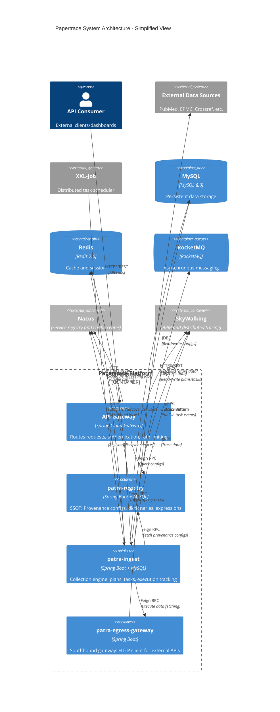
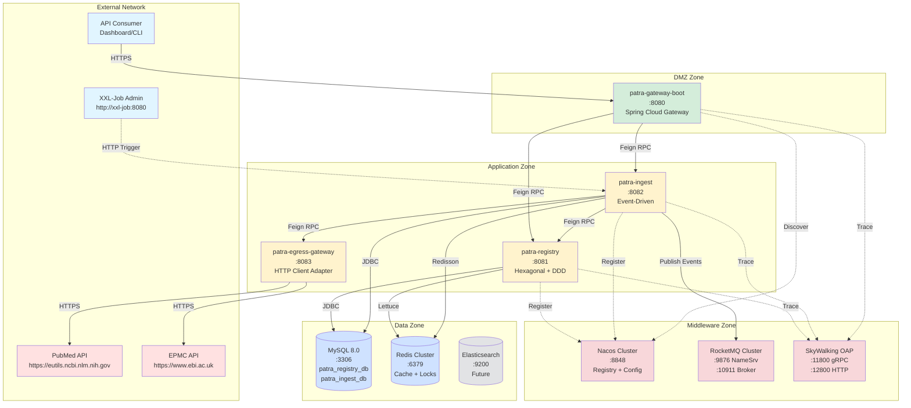

# Papertrace 系统架构图集

> 医学文献数据平台 - 系统级架构视图  
> 更新时间: 2025-10-08

---

## 目录
1. [C4 Container 架构图(系统总览)](#1-c4-container-架构图系统总览)
2. [微服务交互序列图](#2-微服务交互序列图)
3. [数据流部署视图](#3-数据流部署视图)
4. [渲染说明](#渲染说明)

---

## 1. C4 Container 架构图(系统总览)

### 基础版(简化)



### 详细版(含技术栈)

```mermaid
C4Container
    title Papertrace System Architecture - Detailed View with Tech Stack
    
    Person(user, "API Consumer", "External dashboards, CLI tools, monitoring systems")
    
    Container_Boundary(papertrace, "Papertrace Medical Literature Platform") {
        Container(gateway, "API Gateway", "Spring Cloud Gateway 4.1.3", "- Route forwarding<br/>- Authentication/Authorization<br/>- Rate limiting<br/>- CORS handling")
        
        Container(registry, "patra-registry", "Spring Boot 3.2.4<br/>Hexagonal Architecture", "- Provenance config management<br/>- Dictionary/metadata SSOT<br/>- Expression definitions<br/>- Config snapshots")
        
        Container(ingest, "patra-ingest", "Spring Boot 3.2.4<br/>Event-Driven + Hexagonal", "- Plan orchestration<br/>- Task scheduling & execution<br/>- Idempotency & retry<br/>- Cursor management<br/>- Outbox pattern")
        
        Container(egress, "patra-egress-gateway", "Spring Boot 3.2.4<br/>Reactive WebClient", "- Unified HTTP client<br/>- Protocol adaptation<br/>- Response parsing<br/>- Error handling")
        
        Container(parse, "patra-parse", "Spring Boot (Future)", "- XML/JSON parsing<br/>- Data cleansing<br/>- Schema normalization", "Planned")
        
        Container(search, "patra-search", "Spring Boot + ES (Future)", "- Full-text search<br/>- Faceted queries<br/>- Analytics", "Planned")
    }
    
    System_Ext(pubmed, "PubMed API", "NCBI biomedical literature database")
    System_Ext(epmc, "EPMC API", "Europe PMC literature service")
    System_Ext(crossref, "Crossref API", "Scholarly metadata registry")
    System_Ext(xxl_job, "XXL-Job 3.2.0", "Distributed task scheduler with admin UI")
    
    ContainerDb(mysql_registry, "MySQL - Registry", "MySQL 8.0<br/>InnoDB + utf8mb4", "- reg_provenance<br/>- reg_prov_*_cfg<br/>- reg_sys_dict_*")
    ContainerDb(mysql_ingest, "MySQL - Ingest", "MySQL 8.0<br/>InnoDB + utf8mb4", "- ing_plan<br/>- ing_task<br/>- ing_cursor<br/>- ing_outbox_message")
    ContainerDb(redis, "Redis Cluster", "Redis 7.0", "- Config cache<br/>- Distributed locks<br/>- Session storage")
    ContainerDb(es, "Elasticsearch", "ES 8.14", "- Literature index<br/>- Search analytics", "Future")
    
    ContainerQueue(mq, "RocketMQ", "RocketMQ 4.x", "- Task events (ingest.task)<br/>- Cursor events<br/>- Integration events")
    
    Container_Ext(nacos, "Nacos", "Alibaba Nacos 2.3.x", "- Service registry<br/>- Config management<br/>- Dynamic routing")
    Container_Ext(skywalking, "SkyWalking OAP", "SkyWalking 10.2", "- Distributed tracing<br/>- Metrics aggregation<br/>- Alerting")
    
    Rel(user, gateway, "HTTPS/REST", "API requests")
    Rel(gateway, registry, "Feign + LB", "GET /provenance/{code}")
    Rel(gateway, ingest, "Feign + LB", "POST /plans, GET /tasks")
    
    Rel(xxl_job, ingest, "HTTP POST", "Trigger: PubmedHarvestJob")
    Rel(ingest, registry, "Feign + Circuit Breaker", "Fetch ProvenanceConfigSnapshot")
    Rel(ingest, egress, "Feign + Resilience4j", "Execute HTTP requests")
    Rel(ingest, mq, "Transactional Outbox", "Publish TaskReadyEvent")
    
    Rel(egress, pubmed, "HTTPS + XML", "E-utilities API")
    Rel(egress, epmc, "HTTPS + JSON", "RESTful API")
    Rel(egress, crossref, "HTTPS + JSON", "Works API")
    
    Rel(registry, mysql_registry, "MyBatis-Plus", "CRUD operations")
    Rel(ingest, mysql_ingest, "MyBatis-Plus + OptimisticLock", "Plan/Task CRUD + Cursor updates")
    Rel(registry, redis, "Lettuce", "Config cache (TTL=5min)")
    Rel(ingest, redis, "Redisson", "Distributed locks for task lease")
    
    BiRel(registry, nacos, "HTTP + Heartbeat", "Register & Config pull")
    BiRel(ingest, nacos, "HTTP + Heartbeat", "Register & Config pull")
    BiRel(gateway, nacos, "HTTP", "Service discovery")
    
    Rel(registry, skywalking, "SkyWalking Agent", "Trace context propagation")
    Rel(ingest, skywalking, "SkyWalking Agent", "Trace: scheduleId → planId → taskId")
    Rel(gateway, skywalking, "SkyWalking Agent", "Gateway span")
    
    UpdateLayoutConfig($c4ShapeInRow="3", $c4BoundaryInRow="1")
```



---

## 2. 微服务交互序列图

### 采集任务执行流程

```mermaid
sequenceDiagram
    autonumber
    
    participant XXL as XXL-Job Scheduler
    participant Ingest as patra-ingest
    participant Registry as patra-registry
    participant Egress as patra-egress-gateway
    participant PubMed as PubMed API
    participant MQ as RocketMQ
    participant MySQL as MySQL DB
    
    Note over XXL,MySQL: 1. Schedule Trigger & Plan Creation
    XXL->>Ingest: POST /schedule/trigger<br/>(jobId, logId, params)
    activate Ingest
    Ingest->>Ingest: Create ScheduleInstance
    Ingest->>Registry: GET /provenance/pubmed/snapshot
    activate Registry
    Registry-->>Ingest: ProvenanceConfigSnapshot<br/>(HTTP/Pagination/Retry/RateLimit)
    deactivate Registry
    
    Ingest->>Ingest: Generate Plan<br/>(expr_proto, slice_strategy)
    Ingest->>MySQL: INSERT ing_plan<br/>(status=DRAFT)
    
    Note over Ingest,MySQL: 2. Slicing & Task Generation
    Ingest->>Ingest: Apply SliceStrategy<br/>(TIME-based: 30-day windows)
    loop For each slice
        Ingest->>MySQL: INSERT ing_plan_slice<br/>(expr_snapshot with bounds)
        Ingest->>MySQL: INSERT ing_task<br/>(idempotent_key, status=QUEUED)
        Ingest->>MySQL: INSERT ing_outbox_message<br/>(channel=ingest.task, dedup_key)
    end
    Ingest->>MySQL: UPDATE ing_plan<br/>(status=READY)
    Ingest-->>XXL: 200 OK (planId, sliceCount)
    deactivate Ingest
    
    Note over Ingest,MQ: 3. Outbox Relay (Background Job)
    activate Ingest
    Ingest->>MySQL: SELECT * FROM ing_outbox_message<br/>WHERE status=PENDING AND not_before<=NOW()
    loop For each outbox message
        Ingest->>MQ: Publish TaskReadyEvent<br/>(taskId, sliceKey, provenance, priority)
        Ingest->>MySQL: UPDATE ing_outbox_message<br/>(status=PUBLISHED, msg_id)
    end
    deactivate Ingest
    
    Note over Ingest,PubMed: 4. Task Execution (MQ Consumer or Direct)
    MQ->>Ingest: Consume TaskReadyEvent
    activate Ingest
    Ingest->>MySQL: SELECT * FROM ing_task<br/>WHERE id=? FOR UPDATE
    Ingest->>Ingest: Acquire lease<br/>(lease_owner, leased_until)
    Ingest->>MySQL: INSERT ing_task_run<br/>(attempt_no=1, status=RUNNING)
    
    loop For each batch (pagination)
        Ingest->>Egress: POST /execute<br/>(url, method, params, headers)
        activate Egress
        Egress->>PubMed: GET /esearch.fcgi?<br/>datetype=edat&mindate=2024-01-01&maxdate=2024-01-31&retstart=0&retmax=100
        PubMed-->>Egress: XML Response<br/>(IdList, Count, QueryTranslation)
        Egress-->>Ingest: Parsed BatchResult<br/>(records, nextToken)
        deactivate Egress
        
        Ingest->>MySQL: INSERT ing_task_run_batch<br/>(batch_no, before_token, after_token, record_count, status=SUCCEEDED)
        Ingest->>Ingest: Update checkpoint<br/>(nextHint=after_token)
    end
    
    Ingest->>MySQL: UPDATE ing_task_run<br/>(status=SUCCEEDED, stats)
    Ingest->>MySQL: UPDATE ing_task<br/>(status=SUCCEEDED, finished_at)
    Ingest->>MySQL: UPSERT ing_cursor<br/>(new_value, lineage)
    Ingest->>MySQL: INSERT ing_cursor_event<br/>(prev_value, new_value, window)
    deactivate Ingest
    
    Note over Ingest,MySQL: 5. Failure & Retry (If Error Occurs)
    alt On Failure
        Ingest->>MySQL: UPDATE ing_task_run<br/>(status=FAILED, error)
        Ingest->>Ingest: Check retry policy
        alt Retry available
            Ingest->>MySQL: UPDATE ing_task<br/>(retry_count++, status=QUEUED, scheduled_at=NOW()+backoff)
        else Max retries exceeded
            Ingest->>MySQL: UPDATE ing_task<br/>(status=FAILED, last_error_code)
        end
    end
```



---

## 3. 数据流部署视图

### 物理部署拓扑



### 数据流向说明

| 流向 | 协议 | 说明 |
|-----|------|------|
| Client → Gateway | HTTPS/REST | 外部 API 调用 |
| XXL-Job → Ingest | HTTP | 定时触发采集任务 |
| Ingest → Registry | Feign/HTTP | 获取 ProvenanceConfigSnapshot |
| Ingest → Egress | Feign/HTTP | 执行 HTTP 请求 |
| Egress → External APIs | HTTPS | 调用 PubMed/EPMC/Crossref |
| Ingest → MySQL | JDBC/MyBatis-Plus | 读写 Plan/Task/Cursor |
| Registry → MySQL | JDBC/MyBatis-Plus | 读写 Provenance Configs |
| Ingest → RocketMQ | Outbox Pattern | 发布 TaskReadyEvent |
| Services → Nacos | HTTP/Heartbeat | 服务注册与配置拉取 |
| Services → SkyWalking | gRPC/Agent | 分布式追踪 |
| Services → Redis | Lettuce/Redisson | 缓存与分布式锁 |

---

## 渲染说明

### 在线渲染
- **Mermaid Live Editor**: https://mermaid.live
- **GitHub/GitLab**: Markdown 文件原生支持 Mermaid 语法
- **VS Code**: 安装插件 `Markdown Preview Mermaid Support`

### 本地渲染
```bash
# 使用 Mermaid CLI
npm install -g @mermaid-js/mermaid-cli
mmdc -i architecture-diagrams.md -o architecture-diagrams.pdf

# 使用 Docker
docker run --rm -v $(pwd):/data minlag/mermaid-cli \
  -i /data/architecture-diagrams.md -o /data/architecture-diagrams.png
```

### 导出格式
- **SVG**: 矢量图形,可无损缩放
- **PNG**: 位图,适合嵌入 PPT/文档
- **PDF**: 文档归档

### 主题定制
在 Mermaid 代码块前添加:
```
%%{init: {'theme':'base', 'themeVariables': { 'primaryColor':'#ff6','primaryTextColor':'#000'}}}%%
```

---

## 更新记录

| 版本 | 日期 | 变更说明 | 作者 |
|-----|------|---------|------|
| 1.0 | 2025-10-08 | 初始版本:C4 Container、序列图、部署图 | System |

---

## 相关文档

- [patra-ingest 六边形架构图](../modules/ingest/architecture-diagram.md)
- [patra-registry 六边形架构图](../modules/registry/architecture-diagram.md)
- [核心数据模型 ER 图](../database/er-diagrams.md)
- [项目 README](../../README.md)
