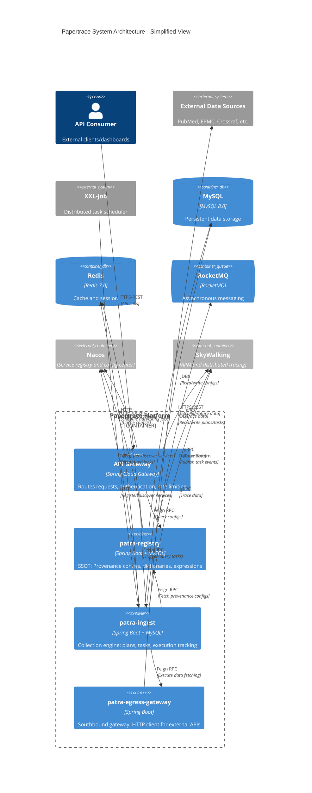
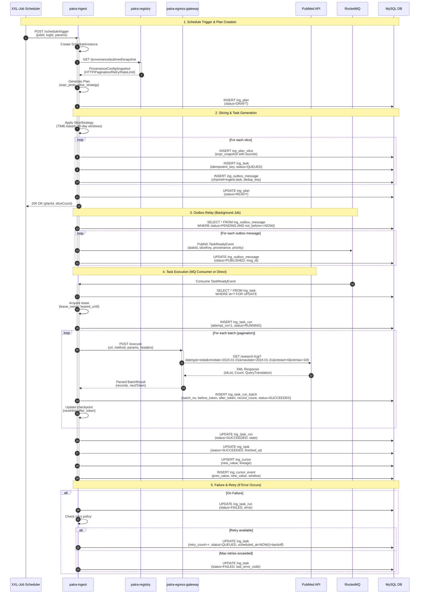
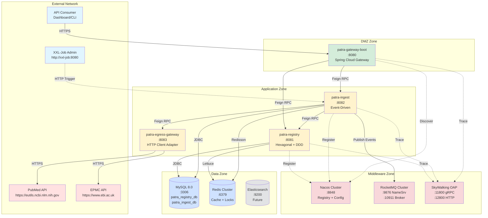

# 平台架构全览

Papertrace 聚焦医学文献的采集、标准化与服务化。整体采用“微服务 + 六边形架构 + 事件驱动”模式，强调幂等、可回放与可观测性。

## 1. 核心组件
- **patra-registry**：单一可信源（SSOT），管理来源配置、字典、表达式能力
- **patra-ingest**：采集与计划装配引擎，负责调度、窗口切分、任务出站
- **patra-gateway-boot**：统一接入网关，承担路由、鉴权、流控与错误形态对齐
- **自研 Starters**：封装错误解析、Web 输出、Feign 调用、MyBatis 等跨服务标准
- **patra-expr-kernel**：表达式 AST 内核，保证跨服务规则的确定性
- **patra-common**：领域基类、错误码模型、JSON 规范化工具

## 2. 分层约束（Hexagonal / DDD）
- **领域层 (domain)**：纯 Java，对外通过聚合、值对象与领域事件表达业务不变量
- **应用层 (app)**：编排用例、事务、幂等控制，仅依赖领域端口
- **适配层 (adapter)**：承载 REST/调度等入站交互（Inbound Only），负责协议转换与错误映射；后续若接入消息通道，可通过专用适配器扩展
- **基础设施层 (infra)**：实现仓储、消息、Feign 等出站二级端口（Outbound），由领域端口约束
- **启动层 (boot)**：整合配置，约束依赖方向 `adapter → app → domain ← infra`

保持“内环无框架、外环可替换”，确保测试与演进成本可控。
## 3. 数据采集主流程
1. **调度触发**：XXL-Job 将任务上下文推送至 patra-ingest adapter 层
2. **配置组装**：adapter 调用 `app.planning.PlanIngestionApplicationService`，通过 Feign 获取 provenance 与表达式快照
3. **窗口解析**：`app.planning.window` 根据 HARVEST/BACKFILL/UPDATE 策略生成 Plan 与 PlanSlice
4. **任务装配**：`app.planning` 构建 Task + OutboxMessage，并写入事务性表
5. **消息发布**：`app.relay` 扫描待发布消息（租约 + 退避），经由 `OutboxPublisherPort` 发布；当前实现为 `RocketMqOutboxPublisher`，基于 Spring Cloud Stream + RocketMQ 动态目的地投递
6. **下游消费**：后续解析/清洗/索引服务可接入异步通道，消费发布事件以完成链路闭环

所有步骤遵循幂等键、租约与指数退避策略，保证可回放与稳定性。
## 4. 基础设施依赖
- **Nacos**：注册中心 + 配置管理，统一聚合路由、Starter 属性与业务参数
- **MySQL**：主数据存储（计划、配置、字典、快照等）
- **Redis**：缓存与限流（规划中）
- **Elasticsearch**：文献索引（后续阶段）
- **消息通道**：按业务需要接入 MQ/Webhook 等外部媒介
- **SkyWalking**：全链路追踪；Starter 负责注入 TraceId
- **XXL-Job**：调度中心，驱动采集窗口与回放任务

## 5. 观测性与风险控制
- 指标：统一通过 Micrometer 输出计数、耗时、慢调用、错误分类
- 日志：`@Slf4j` + 参数化格式，透传 traceId / scheduleInstanceId
- 错误：所有服务输出 RFC7807 ProblemDetail（code/status/path/timestamp）
- 风险点：配置一致性（Registry）、任务堆积（Outbox）、外部 API 限流
- 预案：租约+重试+死信队列、健康巡检任务、配置版本化
## 6. 对外接口与安全
- API Gateway 统一入口，后续接入 JWT 鉴权、限流、熔断
- 内部服务通过 Feign + ProblemDetail 协议交互，禁止裸返回字符串或 null
- 配置、密钥、连接串全部通过 Nacos 或环境变量注入，仓库不保存敏感信息

## 7. 演进方向
- 建立完整的“采集→解析→索引”事件编排链路（包括执行端）
- 引入配置变更审计与灰度机制，提升 Registry 可控性
- 构建指标看板与报警策略，覆盖任务堆积、错误码 TopN、接口耗时
- 推进 Docs-as-Code（Docusaurus/VitePress）以提升文档可发现性


## 架构图集

> 医学文献数据平台 - 系统级架构视图  
> 更新时间: 2025-10-08

---

## 目录
1. [C4 Container 架构图(系统总览)](#1-c4-container-架构图系统总览)
2. [微服务交互序列图](#2-微服务交互序列图)
3. [数据流部署视图](#3-数据流部署视图)
4. [渲染说明](#渲染说明)

---

## 1. C4 Container 架构图(系统总览)

### 基础版(简化)



### 详细版(含技术栈)

```mermaid
C4Container
    title Papertrace System Architecture - Detailed View with Tech Stack
    
    Person(user, "API Consumer", "External dashboards, CLI tools, monitoring systems")
    
    Container_Boundary(papertrace, "Papertrace Medical Literature Platform") {
        Container(gateway, "API Gateway", "Spring Cloud Gateway 4.1.3", "- Route forwarding<br/>- Authentication/Authorization<br/>- Rate limiting<br/>- CORS handling")
        
        Container(registry, "patra-registry", "Spring Boot 3.2.4<br/>Hexagonal Architecture", "- Provenance config management<br/>- Dictionary/metadata SSOT<br/>- Expression definitions<br/>- Config snapshots")
        
        Container(ingest, "patra-ingest", "Spring Boot 3.2.4<br/>Event-Driven + Hexagonal", "- Plan orchestration<br/>- Task scheduling & execution<br/>- Idempotency & retry<br/>- Cursor management<br/>- Outbox pattern")
        
        Container(egress, "patra-egress-gateway", "Spring Boot 3.2.4<br/>Reactive WebClient", "- Unified HTTP client<br/>- Protocol adaptation<br/>- Response parsing<br/>- Error handling")
        
        Container(parse, "patra-parse", "Spring Boot (Future)", "- XML/JSON parsing<br/>- Data cleansing<br/>- Schema normalization", "Planned")
        
        Container(search, "patra-search", "Spring Boot + ES (Future)", "- Full-text search<br/>- Faceted queries<br/>- Analytics", "Planned")
    }
    
    System_Ext(pubmed, "PubMed API", "NCBI biomedical literature database")
    System_Ext(epmc, "EPMC API", "Europe PMC literature service")
    System_Ext(crossref, "Crossref API", "Scholarly metadata registry")
    System_Ext(xxl_job, "XXL-Job 3.2.0", "Distributed task scheduler with admin UI")
    
    ContainerDb(mysql_registry, "MySQL - Registry", "MySQL 8.0<br/>InnoDB + utf8mb4", "- reg_provenance<br/>- reg_prov_*_cfg<br/>- reg_sys_dict_*")
    ContainerDb(mysql_ingest, "MySQL - Ingest", "MySQL 8.0<br/>InnoDB + utf8mb4", "- ing_plan<br/>- ing_task<br/>- ing_cursor<br/>- ing_outbox_message")
    ContainerDb(redis, "Redis Cluster", "Redis 7.0", "- Config cache<br/>- Distributed locks<br/>- Session storage")
    ContainerDb(es, "Elasticsearch", "ES 8.14", "- Literature index<br/>- Search analytics", "Future")
    
    ContainerQueue(mq, "RocketMQ", "RocketMQ 4.x", "- Task events (ingest.task)<br/>- Cursor events<br/>- Integration events")
    
    Container_Ext(nacos, "Nacos", "Alibaba Nacos 2.3.x", "- Service registry<br/>- Config management<br/>- Dynamic routing")
    Container_Ext(skywalking, "SkyWalking OAP", "SkyWalking 10.2", "- Distributed tracing<br/>- Metrics aggregation<br/>- Alerting")
    
    Rel(user, gateway, "HTTPS/REST", "API requests")
    Rel(gateway, registry, "Feign + LB", "GET /provenance/:code")
    Rel(gateway, ingest, "Feign + LB", "POST /plans, GET /tasks")
    
    Rel(xxl_job, ingest, "HTTP POST", "Trigger: PubmedHarvestJob")
    Rel(ingest, registry, "Feign + Circuit Breaker", "Fetch ProvenanceConfigSnapshot")
    Rel(ingest, egress, "Feign + Resilience4j", "Execute HTTP requests")
    Rel(ingest, mq, "Transactional Outbox", "Publish TaskReadyEvent")
    
    Rel(egress, pubmed, "HTTPS + XML", "E-utilities API")
    Rel(egress, epmc, "HTTPS + JSON", "RESTful API")
    Rel(egress, crossref, "HTTPS + JSON", "Works API")
    
    Rel(registry, mysql_registry, "MyBatis-Plus", "CRUD operations")
    Rel(ingest, mysql_ingest, "MyBatis-Plus + OptimisticLock", "Plan/Task CRUD + Cursor updates")
    Rel(registry, redis, "Lettuce", "Config cache (TTL=5min)")
    Rel(ingest, redis, "Redisson", "Distributed locks for task lease")
    
    BiRel(registry, nacos, "HTTP + Heartbeat", "Register & Config pull")
    BiRel(ingest, nacos, "HTTP + Heartbeat", "Register & Config pull")
    BiRel(gateway, nacos, "HTTP", "Service discovery")
    
    Rel(registry, skywalking, "SkyWalking Agent", "Trace context propagation")
    Rel(ingest, skywalking, "SkyWalking Agent", "Trace: scheduleId → planId → taskId")
    Rel(gateway, skywalking, "SkyWalking Agent", "Gateway span")
    
    UpdateLayoutConfig($c4ShapeInRow="3", $c4BoundaryInRow="1")
```



---

## 2. 微服务交互序列图

### 采集任务执行流程



---

## 3. 数据流部署视图

### 物理部署拓扑



### 数据流向说明

| 流向 | 协议 | 说明 |
|-----|------|------|
| Client → Gateway | HTTPS/REST | 外部 API 调用 |
| XXL-Job → Ingest | HTTP | 定时触发采集任务 |
| Ingest → Registry | Feign/HTTP | 获取 ProvenanceConfigSnapshot |
| Ingest → Egress | Feign/HTTP | 执行 HTTP 请求 |
| Egress → External APIs | HTTPS | 调用 PubMed/EPMC/Crossref |
| Ingest → MySQL | JDBC/MyBatis-Plus | 读写 Plan/Task/Cursor |
| Registry → MySQL | JDBC/MyBatis-Plus | 读写 Provenance Configs |
| Ingest → RocketMQ | Outbox Pattern | 发布 TaskReadyEvent |
| Services → Nacos | HTTP/Heartbeat | 服务注册与配置拉取 |
| Services → SkyWalking | gRPC/Agent | 分布式追踪 |
| Services → Redis | Lettuce/Redisson | 缓存与分布式锁 |

---

## 渲染说明

### 在线渲染
- **Mermaid Live Editor**: https://mermaid.live
- **GitHub/GitLab**: Markdown 文件原生支持 Mermaid 语法
- **VS Code**: 安装插件 `Markdown Preview Mermaid Support`

### 本地渲染
```bash
# 使用 Mermaid CLI
npm install -g @mermaid-js/mermaid-cli
mmdc -i architecture-diagrams.md -o architecture-diagrams.pdf

# 使用 Docker
docker run --rm -v $(pwd):/data minlag/mermaid-cli \
  -i /data/architecture-diagrams.md -o /data/architecture-diagrams.png
```

### 导出格式
- **SVG**: 矢量图形,可无损缩放
- **PNG**: 位图,适合嵌入 PPT/文档
- **PDF**: 文档归档

### 主题定制
在 Mermaid 代码块前添加:
```
%%{init: {'theme':'base', 'themeVariables': { 'primaryColor':'#ff6','primaryTextColor':'#000'}}}%%
```

---

## 更新记录

| 版本 | 日期 | 变更说明 | 作者 |
|-----|------|---------|------|
| 1.0 | 2025-10-08 | 初始版本:C4 Container、序列图、部署图 | System |

---

## 相关文档

- [patra-ingest 六边形架构图](../modules/ingest/architecture-diagram.md)
- [patra-registry 六边形架构图](../modules/registry/architecture-diagram.md)
- [核心数据模型 ER 图](../database/er-diagrams.md)
- [项目 README](../../README.md)
