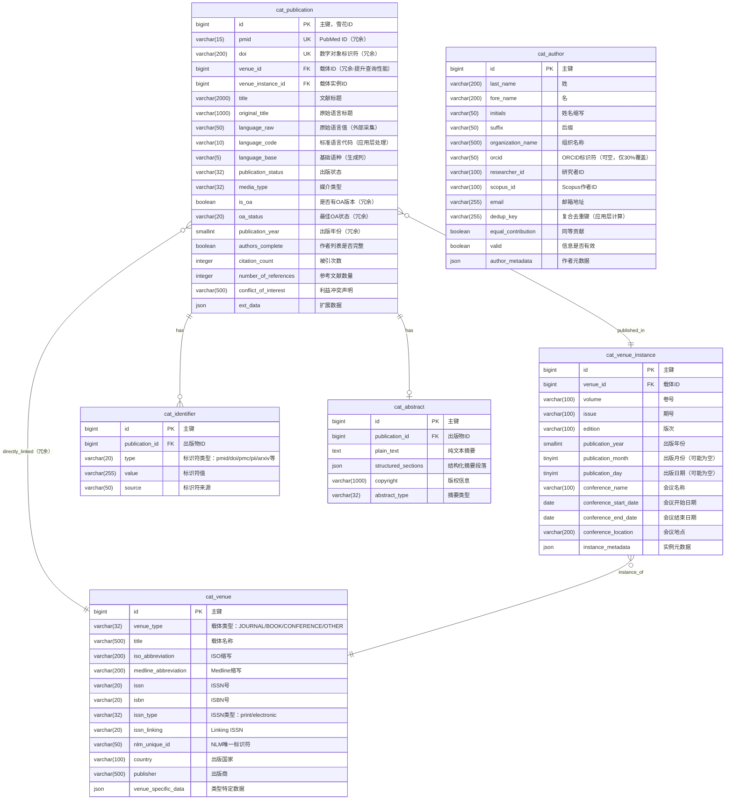

# ER 图设计 - 核心实体表（6张）

> 文档版本：v1.5
> 创建日期：2025-01-18
> 更新说明：新增 publication_year 冗余字段、优化日期字段设计（分离 year/month/day）
> 历史版本：
>   - v1.4: 移除辅助表，回归核心实体表设计
>   - v1.3: 新增开放获取（OA）状态管理表
>   - v1.2: 增加语言字段三层设计、新增语言映射表
>   - v1.1: 增加 venue_id 冗余、优化作者去重策略、调整字段长度
>   - v1.0: 初始版本
> 设计范围：patra_catalog 核心实体表（不包含辅助表）
> 作者：Patra Lin

## 一、核心实体概览

本文档描述 patra_catalog 数据库核心的 6 张实体表及其关系。**辅助表**（如 `cat_language_mapping`、`cat_oa_location`）将在后续的辅助表设计文档中详细说明。

为简化展示，省略审计字段（created_at、updated_at、deleted、version）。

## 二、ER 图设计

### 2.1 完整 ER 图



### 2.2 关系说明

#### 基数关系解释

| 关系 | 说明 | 业务含义 |
|------|------|----------|
| `cat_publication \|\|--o{ cat_identifier` | 1:N | 一篇文献有多个标识符 |
| `cat_publication \|\|--o\| cat_abstract` | 1:0..1 | 一篇文献最多有一个摘要 |
| `cat_publication }o--\|\| cat_venue_instance` | N:1 | 多篇文献发表在同一期刊卷期 |
| `cat_publication }o--\|\| cat_venue` | N:1（冗余） | 直接关联到载体，提升查询性能 |
| `cat_venue_instance }o--\|\| cat_venue` | N:1 | 一个载体有多个实例（多期） |

#### 未展示的关系（需要关联表）
- `cat_publication` ←→ `cat_author`：多对多关系，通过 `cat_publication_author` 关联表实现

## 三、设计要点

### 3.1 标识符设计
- **冗余策略**：`pmid` 和 `doi` 冗余在 `cat_publication` 主表
- **扩展性**：`cat_identifier` 存储所有类型标识符，支持无限扩展
- **查询优化**：高频查询字段（PMID/DOI）直接在主表，避免 JOIN

### 3.2 载体二级设计
```
载体（Venue）架构：
┌──────────────┐      ┌─────────────────┐
│   cat_venue  │ 1──N │ cat_venue_instance│
│  （载体类型） │      │   （具体实例）    │
└──────────────┘      └─────────────────┘
        ↓                      ↓
   期刊/书籍/会议           具体卷期/版次
```

**优势**：
- 避免重复存储期刊基本信息
- 支持多种载体类型的统一管理
- 灵活处理不同类型的特有属性

### 3.3 摘要独立设计
- **性能考虑**：大文本字段独立存储，避免影响主表查询
- **结构化支持**：`structured_sections` JSON 字段支持结构化摘要
- **可选性**：并非所有文献都有摘要（1:0..1 关系）

### 3.4 作者信息设计
- **实体独立**：作者作为独立实体，支持去重
- **ORCID 覆盖率**：仅约 30-40% 作者有 ORCID，不能作为唯一去重依据
- **复合去重策略**：
  - 优先级1：ORCID（如果存在）
  - 优先级2：姓名 + 机构 + 邮箱
  - 优先级3：姓名 + 机构 + Scopus ID
  - 降级策略：仅姓名（接受一定重复）
- **去重键设计**：`dedup_key` 字段由应用层计算生成
- **组织作者**：支持个人作者和组织作者

### 3.5 venue_id 冗余设计
- **查询优化**：避免两级 JOIN，提升 50%+ 查询性能
- **典型场景**：
  ```sql
  -- 不冗余：需要两级 JOIN
  SELECT p.* FROM cat_publication p
  JOIN cat_venue_instance vi ON p.venue_instance_id = vi.id
  JOIN cat_venue v ON vi.venue_id = v.id
  WHERE v.title = 'Nature';

  -- 冗余后：只需一级 JOIN 或直接查询
  SELECT * FROM cat_publication WHERE venue_id = 12345;
  ```
- **维护成本**：插入时同步设置，存储开销仅 8 字节/行

### 3.6 语言处理三层设计（冗余字段）
- **主表字段**：
  - `language_raw` VARCHAR(50) - 原始语言值（保留外部采集数据）
  - `language_code` VARCHAR(10) - 标准语言代码（应用层标准化）
  - `language_base` VARCHAR(5) - 基础语种（STORED 生成列）
- **设计原因**：应对外部数据源语言字段格式不统一
- **详细设计**：参见辅助表设计文档（`cat_language_mapping` 表）

### 3.7 OA 状态设计（冗余字段）
- **主表字段**：
  - `is_oa` BOOLEAN - 是否有任何形式的开放获取
  - `oa_status` VARCHAR(20) - 最佳 OA 状态（gold/green/hybrid/bronze/closed）
- **设计原因**：支持快速筛选和分类统计
- **详细设计**：参见辅助表设计文档（`cat_oa_location` 表）

### 3.8 日期字段设计

#### 不完整日期的处理
医学文献的出版日期可能不完整：
- 只有年份：`2023`（约 30% 的文献）
- 年+月：`2023-06`（约 40% 的文献）
- 完整日期：`2023-06-15`（约 30% 的文献）

#### 分离字段设计
`cat_venue_instance` 表采用分离字段存储：
- `publication_year` SMALLINT - 出版年份（必填）
- `publication_month` TINYINT - 出版月份 1-12（可选）
- `publication_day` TINYINT - 出版日期 1-31（可选）

**优势**：
- 精确表达不完整性（NULL = 不存在此精度，而非未知）
- 避免虚假精度（如将 "2023-06" 存为 "2023-06-01"）
- 数值类型索引效率高，排序友好

#### publication_year 冗余设计
`cat_publication` 主表冗余 `publication_year` 字段：
- **查询优化**：避免 JOIN venue_instance，按年份筛选是最高频操作（>60% 查询）
- **典型场景**：
  ```sql
  -- 不冗余：需要 JOIN
  SELECT p.* FROM cat_publication p
  JOIN cat_venue_instance vi ON p.venue_instance_id = vi.id
  WHERE vi.publication_year = 2023;

  -- 冗余后：直接查询
  SELECT * FROM cat_publication WHERE publication_year = 2023;
  ```
- **存储成本**：仅 2 字节/行（200 万行 = 4MB）
- **维护方式**：插入时从 venue_instance 同步
- **不使用生成列**：源数据在 venue_instance 表，无法在同表内生成

## 四、字段设计原则

### 4.1 主键设计
- 统一使用 `id` 命名
- 类型为 `BIGINT`（支持雪花 ID）
- 不使用自增，由应用层生成

### 4.2 外键命名
- 格式：`{关联表名}_id`
- 例如：`venue_instance_id`、`publication_id`

### 4.3 扩展字段
- 每个主要实体包含 `ext_data` JSON 字段
- 存储非结构化或未来扩展的数据

## 五、索引策略（预设计）

虽然当前阶段不创建索引，但预留以下索引设计：

```sql
-- cat_publication
CREATE UNIQUE INDEX uk_pmid ON cat_publication(pmid) WHERE pmid IS NOT NULL;
CREATE UNIQUE INDEX uk_doi ON cat_publication(doi) WHERE doi IS NOT NULL;
CREATE INDEX idx_venue ON cat_publication(venue_id);  -- 支持按期刊查询
CREATE INDEX idx_venue_instance ON cat_publication(venue_instance_id);
CREATE INDEX idx_publication_year ON cat_publication(publication_year);  -- 按年份筛选（高频）
CREATE INDEX idx_language_base ON cat_publication(language_base);  -- 按基础语种查询
CREATE INDEX idx_language_code ON cat_publication(language_code);  -- 按标准代码查询
CREATE INDEX idx_language_raw ON cat_publication(language_raw);    -- 追踪原始值
CREATE INDEX idx_is_oa ON cat_publication(is_oa);                 -- 按OA状态筛选
CREATE INDEX idx_oa_status ON cat_publication(oa_status);          -- 按OA类型统计

-- cat_identifier
CREATE INDEX idx_pub_type ON cat_identifier(publication_id, type);
CREATE INDEX idx_type_value ON cat_identifier(type, value);

-- cat_author
CREATE INDEX idx_orcid ON cat_author(orcid) WHERE orcid IS NOT NULL;  -- 改为普通索引
CREATE INDEX idx_dedup_key ON cat_author(dedup_key);  -- 新增：复合去重键索引
CREATE INDEX idx_email ON cat_author(email) WHERE email IS NOT NULL;

-- cat_abstract
CREATE UNIQUE INDEX uk_publication ON cat_abstract(publication_id);

-- cat_venue_instance
CREATE INDEX idx_venue ON cat_venue_instance(venue_id);
CREATE INDEX idx_publication_year ON cat_venue_instance(publication_year);  -- 按年份统计
```

**注**：辅助表（`cat_language_mapping`、`cat_oa_location`）的索引设计详见辅助表设计文档。

## 六、数据完整性约束

### 6.1 唯一性约束
- `cat_publication.pmid`（如果非空）
- `cat_publication.doi`（如果非空）
- `cat_author.orcid`（如果非空）
- `cat_abstract.publication_id`

### 6.2 外键约束
- 所有 FK 字段建立外键约束
- 级联删除策略：根据业务需求配置

### 6.3 检查约束
```sql
-- 载体类型枚举
CHECK (venue_type IN ('JOURNAL', 'BOOK', 'CONFERENCE', 'OTHER'))

-- 出版状态枚举
CHECK (publication_status IN ('published', 'preprint', 'in-press', 'retracted'))

-- 媒介类型枚举
CHECK (media_type IN ('print', 'electronic', 'print-electronic'))
```

## 七、优化建议

### 7.1 当前设计优势
✅ 标识符冗余（PMID/DOI）提升查询性能 90%+
✅ venue_id 冗余避免两级 JOIN，提升 50%+ 查询性能
✅ publication_year 冗余满足最高频查询需求（>60% 查询按年份筛选）
✅ 日期分离字段精确表达不完整性，避免虚假精度
✅ OA 状态精简冗余，主表仅 2 个字段，保持轻量
✅ OA 多位置管理，支持优先级排序和最佳位置标记
✅ 语言三层设计应对外部数据不规范，保证数据完整性
✅ 语言映射表支持动态学习，提升标准化率至 95%+
✅ 载体二级设计避免数据重复
✅ 复合作者去重策略，应对 ORCID 覆盖率不足
✅ 摘要独立存储优化主表性能
✅ JSON 扩展字段保证灵活性
✅ 字段长度优化：title 扩展至 2000，doi 缩减至 200

### 7.2 潜在优化点
1. **分区考虑**：当数据量超过 1000 万时，考虑按时间分区
2. **读写分离**：高并发场景下配置主从复制
3. **缓存层**：引入 Redis 缓存高频查询数据
4. **全文索引**：标题和摘要字段考虑全文索引

## 八、下一步工作

1. **细化字段类型**：确定每个字段的精确长度和约束
2. **关联表设计**：设计作者、MeSH 等多对多关联表
3. **SQL DDL 生成**：生成完整的建表语句
4. **样例数据**：准备测试数据验证设计

---

*本文档为核心实体表的 ER 设计，后续将补充其他关联表和辅助表的设计。*
