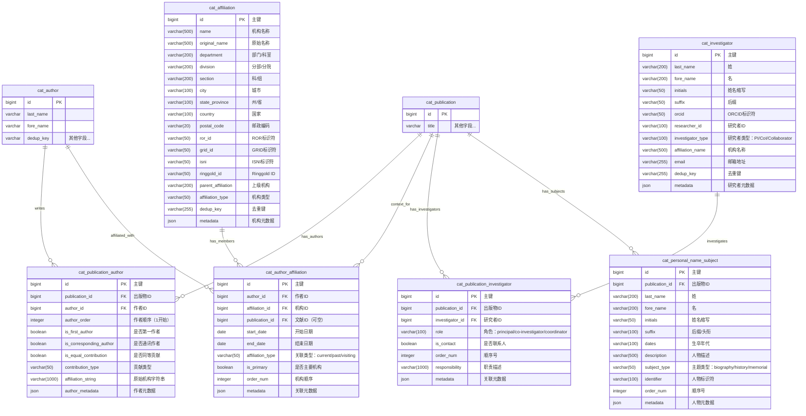

# ER 图设计 - 人员与机构表（6张）

> 文档版本：v1.0
> 创建日期：2025-01-18
> 设计范围：patra_catalog 人员与机构管理体系
> 作者：Patra Lin

## 一、人员机构体系概览

医学文献的人员与机构管理包含多个维度：
- **作者管理**：文献作者及其顺序、角色（第一作者、通讯作者、同等贡献）
- **机构归属**：作者的机构关联，支持多机构和多级层次
- **研究者管理**：参与研究但非文章作者的人员（如临床试验的主要研究者）
- **人物主题**：作为文献主题的人物（如传记、历史研究）

## 二、ER 图设计

### 2.1 完整 ER 图



### 2.2 关系说明

#### 基数关系解释

| 关系 | 说明 | 业务含义 |
|------|------|----------|
| `cat_publication \|\|--o{ cat_publication_author` | 1:N | 一篇文献有多个作者 |
| `cat_author \|\|--o{ cat_publication_author` | 1:N | 一个作者写多篇文献 |
| `cat_author \|\|--o{ cat_author_affiliation` | 1:N | 一个作者可有多个机构归属 |
| `cat_affiliation \|\|--o{ cat_author_affiliation` | 1:N | 一个机构有多个作者 |
| `cat_publication \|\|--o{ cat_author_affiliation` | 1:N（可选） | 特定文献时的机构关联 |
| `cat_publication \|\|--o{ cat_publication_investigator` | 1:N | 一篇文献有多个研究者 |
| `cat_investigator \|\|--o{ cat_publication_investigator` | 1:N | 一个研究者参与多项研究 |
| `cat_publication \|\|--o{ cat_personal_name_subject` | 1:N | 一篇文献可有多个人物主题 |

## 三、设计要点

### 3.1 文献-作者关联设计

**cat_publication_author 表核心特性**：
- **顺序保留**：`author_order` 字段保持原始作者顺序（1,2,3...）
- **角色标记**：区分第一作者、通讯作者、同等贡献作者
- **贡献类型**：支持 CRediT（Contributor Roles Taxonomy）标准
- **机构字符串**：保留原始的机构信息字符串，便于追溯

**设计理由**：
1. 作者顺序在学术界具有重要意义，必须严格保留
2. 通讯作者和第一作者需要特别标记，支持学术评价
3. 同等贡献在现代科研中越来越常见，需要支持
4. 原始机构字符串保留有助于数据验证和纠错

### 3.2 机构管理设计

**cat_affiliation 表特点**：
- **多级层次**：支持机构内部的多级结构（大学→学院→系→实验室）
- **标准标识符**：支持多种机构标识符系统
  - ROR（Research Organization Registry）- 推荐使用
  - GRID（Global Research Identifier Database）- 已停更但历史数据多
  - ISNI（International Standard Name Identifier）
  - Ringgold ID - 出版界常用
- **去重策略**：通过 `dedup_key` 实现机构去重
- **国际化**：保留原始名称，支持多语言机构名

**机构层次示例**：
```
Harvard University (name)
├── Harvard Medical School (department)
│   ├── Department of Genetics (division)
│   │   └── Church Lab (section)
```

### 3.3 作者-机构关联设计

**cat_author_affiliation 表特性**：
- **时间维度**：记录关联的起止时间
- **关联类型**：区分当前/历史/访问学者等关系
- **文献上下文**：可选的 `publication_id` 支持特定文献的机构信息
- **主要机构**：标记作者的主要所属机构

**使用场景**：
1. **通用关联**：不带 `publication_id`，表示作者的一般机构归属
2. **特定文献关联**：带 `publication_id`，表示发表特定文献时的机构
3. **历史追踪**：通过时间字段追踪作者的机构变更历史

### 3.4 研究者管理设计

**cat_investigator 表特点**：
- **独立实体**：研究者独立于作者存在
- **类型区分**：PI（主要研究者）、Co-I（协同研究者）、Collaborator
- **去重支持**：类似作者的去重机制

**与作者的区别**：
- 研究者：参与研究项目但不一定是论文作者（如临床试验的执行者）
- 作者：撰写并发表文献的人员
- 一个人可能既是研究者又是作者，但在系统中是两个独立记录

### 3.5 人物主题设计

**cat_personal_name_subject 表用途**：
- 传记类文献的主题人物
- 历史研究中的历史人物
- 纪念文章的被纪念者
- 病例报告中的患者（匿名化处理）

**设计特点**：
- 不需要去重（历史人物可能重名）
- 支持生卒年代等历史信息
- 可关联外部人物数据库标识符

## 四、去重策略详解

### 4.1 作者去重（已在 cat_author 表实现）

**复合去重键优先级**：
1. ORCID（如果存在）- 最可靠
2. 姓名 + 邮箱 + 机构
3. 姓名 + Scopus ID + 机构
4. 姓名 + 机构（接受一定重复）

### 4.2 机构去重

**cat_affiliation.dedup_key 计算规则**：
1. 如果有 ROR ID → 使用 ROR ID
2. 如果有 GRID ID → 使用 GRID ID
3. 否则 → 标准化名称 + 国家 + 城市

**标准化处理**：
- 移除 "University of"、"The" 等前缀
- 统一大小写和标点
- 处理常见缩写（MIT → Massachusetts Institute of Technology）

### 4.3 研究者去重

**cat_investigator.dedup_key 计算规则**：
1. ORCID（如果存在）
2. 姓名 + 邮箱
3. 姓名 + 机构名称
4. 仅姓名（低可信度）

## 五、数据完整性约束

### 5.1 唯一性约束

```sql
-- 防止重复关联
CREATE UNIQUE INDEX uk_pub_author ON cat_publication_author(publication_id, author_id);
CREATE UNIQUE INDEX uk_pub_investigator ON cat_publication_investigator(publication_id, investigator_id);

-- 作者顺序唯一
CREATE UNIQUE INDEX uk_author_order ON cat_publication_author(publication_id, author_order);

-- 机构标识符唯一
CREATE UNIQUE INDEX uk_ror ON cat_affiliation(ror_id) WHERE ror_id IS NOT NULL;
CREATE UNIQUE INDEX uk_grid ON cat_affiliation(grid_id) WHERE grid_id IS NOT NULL;
```

### 5.2 检查约束

```sql
-- 作者顺序必须从1开始
CHECK (author_order > 0)

-- 第一作者检查
CHECK ((author_order = 1 AND is_first_author = true) OR author_order > 1)

-- 关联类型枚举
CHECK (affiliation_type IN ('current', 'past', 'visiting', 'honorary'))

-- 研究者类型枚举
CHECK (investigator_type IN ('PI', 'CoI', 'Collaborator', 'Coordinator'))
```

### 5.3 业务规则

1. **第一作者唯一性**：每篇文献只能有一个 `is_first_author = true`
2. **通讯作者可多个**：允许多个 `is_corresponding_author = true`
3. **顺序连续性**：`author_order` 应该连续（1,2,3...），不应有跳跃
4. **机构关联时间**：`end_date` 必须大于等于 `start_date`

## 六、索引策略（预设计）

```sql
-- cat_publication_author
CREATE INDEX idx_publication ON cat_publication_author(publication_id);
CREATE INDEX idx_author ON cat_publication_author(author_id);
CREATE INDEX idx_corresponding ON cat_publication_author(is_corresponding_author);
CREATE INDEX idx_first ON cat_publication_author(is_first_author);

-- cat_affiliation
CREATE INDEX idx_dedup ON cat_affiliation(dedup_key);
CREATE INDEX idx_country ON cat_affiliation(country);
CREATE INDEX idx_name ON cat_affiliation(name);

-- cat_author_affiliation
CREATE INDEX idx_author ON cat_author_affiliation(author_id);
CREATE INDEX idx_affiliation ON cat_author_affiliation(affiliation_id);
CREATE INDEX idx_publication ON cat_author_affiliation(publication_id) WHERE publication_id IS NOT NULL;

-- cat_investigator
CREATE INDEX idx_orcid ON cat_investigator(orcid) WHERE orcid IS NOT NULL;
CREATE INDEX idx_dedup ON cat_investigator(dedup_key);

-- cat_publication_investigator
CREATE INDEX idx_publication ON cat_publication_investigator(publication_id);
CREATE INDEX idx_investigator ON cat_publication_investigator(investigator_id);

-- cat_personal_name_subject
CREATE INDEX idx_publication ON cat_personal_name_subject(publication_id);
CREATE INDEX idx_subject_type ON cat_personal_name_subject(subject_type);
```

## 七、数据质量考虑

### 7.1 作者数据质量

**常见问题**：
- 姓名格式不一致（全名 vs 缩写）
- 中文姓名的拼音方案差异
- 机构名称的多种写法

**解决方案**：
- 保留原始数据（affiliation_string）
- 标准化处理（dedup_key）
- 人工审核标记（需要时）

### 7.2 机构数据质量

**挑战**：
- 机构更名、合并、拆分
- 多语言机构名称
- 部门层级不一致

**应对策略**：
- 优先使用标准标识符（ROR、GRID）
- 保留历史名称映射
- 支持父子机构关系

### 7.3 数据补全策略

1. **ORCID 补全**：定期通过 ORCID API 补全作者信息
2. **ROR 更新**：定期同步 ROR 数据库更新机构信息
3. **邮箱验证**：通过域名验证机构邮箱
4. **交叉验证**：利用多个数据源交叉验证

## 八、扩展考虑

### 8.1 未来扩展点

1. **作者画像**：基于发表历史构建作者研究领域画像
2. **机构排名**：集成各类机构排名数据
3. **合作网络**：构建作者和机构的合作网络图谱
4. **贡献度量**：实现 CRediT 贡献分类的完整支持

### 8.2 性能优化预留

1. **分区策略**：大表按时间或机构分区
2. **缓存设计**：高频查询的作者和机构信息缓存
3. **异步处理**：去重和标准化的异步批处理
4. **读写分离**：机构主数据的读写分离

## 九、典型查询场景

```sql
-- 查询某篇文献的所有作者（保持顺序）
SELECT a.*, pa.author_order, pa.is_corresponding_author
FROM cat_publication_author pa
JOIN cat_author a ON pa.author_id = a.id
WHERE pa.publication_id = ?
ORDER BY pa.author_order;

-- 查询某作者的所有机构归属
SELECT af.*, aff.*
FROM cat_author_affiliation af
JOIN cat_affiliation aff ON af.affiliation_id = aff.id
WHERE af.author_id = ?
ORDER BY af.is_primary DESC, af.start_date DESC;

-- 查询某机构的所有作者
SELECT DISTINCT a.*
FROM cat_author a
JOIN cat_author_affiliation af ON a.id = af.author_id
JOIN cat_affiliation aff ON af.affiliation_id = aff.id
WHERE aff.ror_id = ? OR aff.name = ?;

-- 查询文献的研究者（非作者）
SELECT i.*, pi.role
FROM cat_publication_investigator pi
JOIN cat_investigator i ON pi.investigator_id = i.id
WHERE pi.publication_id = ?
ORDER BY pi.order_num;
```

## 十、下一步工作

1. **细化字段定义**：确定每个字段的精确长度和约束
2. **标准词表集成**：集成 CRediT、机构类型等标准词表
3. **API 设计**：设计作者和机构管理的 API 接口
4. **数据导入流程**：设计从原始数据到标准化数据的 ETL 流程

---

*本文档为人员与机构表的 ER 设计，与核心实体表和分类索引表共同构成 patra_catalog 的完整数据模型。*