# ER 图设计 - 关联信息表（7张）

> 文档版本：v1.0
> 创建日期：2025-01-18
> 设计范围：patra_catalog 关联信息管理体系
> 作者：Patra Lin

## 一、关联信息体系概览

医学文献的关联信息管理涵盖多个维度：
- **资助信息**：研究资金来源、项目编号、资助机构
- **引用关系**：参考文献、外部数据库引用（基因库、临床试验等）
- **相关项目**：撤稿、勘误、评论、更新等关联文献
- **补充材料**：图表、数据集、视频、代码等附加资源
- **发布历史**：文献生命周期中的关键时间节点

## 二、ER 图设计

### 2.1 完整 ER 图

```mermaid
erDiagram
    %% 引用核心表（简化展示）
    cat_publication {
        bigint id PK
        varchar title
        varchar pmid
        varchar doi
        "其他字段..."
    }

    %% 资助信息表
    cat_funding {
        bigint id PK "主键"
        varchar(200) agency_name "资助机构名称"
        varchar(100) agency_abbreviation "机构缩写"
        varchar(100) country "资助国家"
        varchar(100) grant_id "资助编号/项目编号"
        varchar(100) grant_acronym "项目缩写"
        varchar(500) grant_name "项目名称"
        varchar(50) funding_type "资助类型"
        decimal amount "资助金额 decimal(20, 2)"
        varchar(10) currency "货币类型"
        date start_date "开始日期"
        date end_date "结束日期"
        varchar(100) funder_id "资助者标识符（Crossref Funder ID）"
        varchar(100) ror_id "ROR标识符"
        varchar(255) dedup_key "去重键"
        json metadata "资助元数据"
    }

    cat_publication_funding {
        bigint id PK "主键"
        bigint publication_id FK "出版物ID"
        bigint funding_id FK "资助ID"
        varchar(500) acknowledgment_text "致谢文本"
        boolean is_primary "是否主要资助"
        integer order_num "顺序号"
        varchar(200) recipient_name "接收人/PI姓名"
        varchar(100) recipient_orcid "接收人ORCID"
        json metadata "关联元数据"
    }

    %% 引用关系表
    cat_reference {
        bigint id PK "主键"
        bigint publication_id FK "引用文献ID（本文）"
        bigint cited_publication_id FK "被引文献ID（如果在库中）"
        varchar(20) cited_pmid "被引文献PMID"
        varchar(200) cited_doi "被引文献DOI"
        varchar(2000) citation_text "引用文本"
        varchar(500) article_title "文章标题"
        varchar(500) source "来源期刊/书籍"
        varchar(100) volume "卷号"
        varchar(100) issue "期号"
        varchar(50) pages "页码"
        smallint year "年份"
        varchar(500) authors "作者列表"
        varchar(50) reference_type "引用类型"
        integer reference_number "引用编号"
        boolean is_retracted "是否已撤稿"
        json metadata "引用元数据"
    }

    cat_external_reference {
        bigint id PK "主键"
        bigint publication_id FK "出版物ID"
        varchar(50) database_name "数据库名称"
        varchar(100) database_category "数据库类别"
        varchar(200) accession_number "登录号"
        varchar(500) url "链接地址"
        varchar(50) reference_type "引用类型"
        varchar(500) description "描述"
        date access_date "访问日期"
        varchar(50) version "版本"
        integer order_num "顺序号"
        json metadata "外部引用元数据"
    }

    %% 相关项目表
    cat_related_item {
        bigint id PK "主键"
        bigint publication_id FK "主文献ID"
        bigint related_publication_id FK "相关文献ID（如果在库中）"
        varchar(20) related_pmid "相关文献PMID"
        varchar(200) related_doi "相关文献DOI"
        varchar(50) relationship_type "关系类型"
        varchar(500) title "相关项标题"
        varchar(500) description "关系描述"
        date relationship_date "关系建立日期"
        varchar(100) initiated_by "发起方"
        varchar(50) status "状态"
        integer order_num "顺序号"
        json metadata "关系元数据"
    }

    cat_supplemental_object {
        bigint id PK "主键"
        bigint publication_id FK "出版物ID"
        varchar(50) object_type "对象类型"
        varchar(50) content_type "内容类型（MIME）"
        varchar(500) title "标题"
        varchar(1000) description "描述"
        varchar(500) url "访问URL"
        varchar(255) file_name "文件名"
        bigint file_size "文件大小（字节）"
        varchar(100) doi "补充材料DOI"
        varchar(50) license "许可证"
        varchar(500) authors "作者/贡献者"
        integer order_num "顺序号"
        boolean is_public "是否公开"
        date available_date "可用日期"
        json metadata "对象元数据"
    }

    cat_publication_history {
        bigint id PK "主键"
        bigint publication_id FK "出版物ID"
        varchar(50) event_type "事件类型"
        date event_date "事件日期"
        varchar(10) date_precision "日期精度：day/month/year"
        varchar(500) description "事件描述"
        varchar(100) actor "执行者/机构"
        varchar(100) previous_status "之前状态"
        varchar(100) new_status "新状态"
        integer order_num "事件顺序"
        boolean is_public "是否公开"
        json metadata "事件元数据"
    }

    %% 实体关系定义
    cat_publication ||--o{ cat_publication_funding : "funded_by"
    cat_funding ||--o{ cat_publication_funding : "funds"
    cat_publication ||--o{ cat_reference : "cites"
    cat_publication ||--o| cat_reference : "cited_by"
    cat_publication ||--o{ cat_external_reference : "references_external"
    cat_publication ||--o{ cat_related_item : "has_related"
    cat_publication ||--o| cat_related_item : "related_to"
    cat_publication ||--o{ cat_supplemental_object : "has_supplements"
    cat_publication ||--o{ cat_publication_history : "has_history"
```



### 2.2 关系说明

#### 基数关系解释

| 关系 | 说明 | 业务含义 |
|------|------|----------|
| `cat_publication \|\|--o{ cat_publication_funding` | 1:N | 一篇文献可有多个资助来源 |
| `cat_funding \|\|--o{ cat_publication_funding` | 1:N | 一个资助项目可支持多篇文献 |
| `cat_publication \|\|--o{ cat_reference` | 1:N | 一篇文献引用多篇参考文献 |
| `cat_publication \|\|--o\| cat_reference` | 1:N（反向） | 一篇文献被多篇文献引用 |
| `cat_publication \|\|--o{ cat_external_reference` | 1:N | 一篇文献引用多个外部数据 |
| `cat_publication \|\|--o{ cat_related_item` | 1:N | 一篇文献有多个相关项 |
| `cat_publication \|\|--o{ cat_supplemental_object` | 1:N | 一篇文献有多个补充材料 |
| `cat_publication \|\|--o{ cat_publication_history` | 1:N | 一篇文献有多个历史事件 |

## 三、设计要点

### 3.1 资助信息管理

**cat_funding 表特性**：
- **标准标识符**：支持 Crossref Funder Registry ID 和 ROR ID
- **多币种支持**：记录原始金额和币种
- **项目周期**：支持起止时间记录
- **去重策略**：通过机构名 + 项目编号去重

**资助类型分类**：
```
funding_type:
├── Government（政府资助）
├── Foundation（基金会）
├── Corporate（企业资助）
├── Academic（学术机构）
├── Non-profit（非营利组织）
└── Other（其他）
```

**设计理由**：
1. 资助信息对于利益冲突声明至关重要
2. 支持科研评价和资金使用分析
3. 便于追踪研究的资金来源

### 3.2 引用关系设计

**cat_reference 表特点**：
- **双重关联**：既可关联库内文献（cited_publication_id），也可记录外部引用
- **完整信息**：即使被引文献不在库中，也保存完整的引文信息
- **撤稿标记**：标记已撤稿的引用，支持学术诚信
- **引用编号**：保留原始引用顺序

**引用类型分类**：
```
reference_type:
├── Journal Article（期刊文章）
├── Book（书籍）
├── Book Chapter（书籍章节）
├── Conference Paper（会议论文）
├── Thesis（学位论文）
├── Patent（专利）
├── Web Resource（网络资源）
├── Preprint（预印本）
└── Dataset（数据集）
```

### 3.3 外部引用管理

**cat_external_reference 表用途**：
- **基因数据库**：GenBank、RefSeq、Ensembl 等
- **蛋白质数据库**：UniProt、PDB 等
- **临床试验**：ClinicalTrials.gov、ChiCTR 等
- **数据仓库**：GEO、ArrayExpress、SRA 等
- **其他数据库**：OMIM、DrugBank、ChEMBL 等

**数据库类别**：
```
database_category:
├── Genomic（基因组学）
├── Proteomic（蛋白质组学）
├── Clinical Trial（临床试验）
├── Chemical（化学）
├── Disease（疾病）
├── Drug（药物）
└── Other（其他）
```

### 3.4 相关项目设计

**cat_related_item 关系类型**：
```
relationship_type:
├── Retraction（撤稿）
├── Erratum（勘误）
├── Correction（更正）
├── Comment（评论）
├── Response（回应）
├── Update（更新）
├── Republication（重新发表）
├── Duplicate（重复发表）
├── Partial Retraction（部分撤稿）
├── Expression of Concern（关注声明）
├── Withdrawn（撤回）
└── Superseded（被取代）
```

**设计特点**：
- **双向关联**：支持主文献和相关文献的双向查询
- **状态追踪**：记录关系的当前状态
- **时间线**：记录关系建立的时间
- **发起方**：记录是作者、编辑还是出版商发起

### 3.5 补充材料管理

**cat_supplemental_object 对象类型**：
```
object_type:
├── Figure（图片）
├── Table（表格）
├── Video（视频）
├── Audio（音频）
├── Dataset（数据集）
├── Code（代码）
├── Protocol（实验方案）
├── Questionnaire（问卷）
├── Checklist（检查清单）
├── Appendix（附录）
└── Other（其他）
```

**设计考虑**：
- **访问控制**：通过 is_public 控制访问权限
- **版本管理**：通过 metadata 记录版本信息
- **许可证**：记录补充材料的使用许可
- **大小限制**：记录文件大小，便于存储规划

### 3.6 发布历史管理

**cat_publication_history 事件类型**：
```
event_type:
├── Submitted（投稿）
├── Received（接收）
├── Accepted（接受）
├── Rejected（拒稿）
├── Published Online（在线发表）
├── Published Print（印刷发表）
├── Corrected（更正）
├── Retracted（撤稿）
├── Reinstated（恢复）
├── Updated（更新）
├── Indexed（索引）
└── Archived（归档）
```

**日期精度处理**：
- **day**：完整日期（2024-01-15）
- **month**：仅到月份（2024-01）
- **year**：仅到年份（2024）

**设计理由**：
1. 支持文献生命周期的完整追踪
2. 满足出版伦理的透明性要求
3. 便于分析出版时滞和审稿周期

## 四、数据完整性约束

### 4.1 唯一性约束

```sql
-- 防止重复资助关联
CREATE UNIQUE INDEX uk_pub_funding ON cat_publication_funding(publication_id, funding_id);

-- 引用编号唯一
CREATE UNIQUE INDEX uk_reference_num ON cat_reference(publication_id, reference_number);

-- 外部引用唯一
CREATE UNIQUE INDEX uk_external_ref ON cat_external_reference(
    publication_id, database_name, accession_number
);

-- 历史事件顺序唯一
CREATE UNIQUE INDEX uk_history_order ON cat_publication_history(publication_id, order_num);
```

### 4.2 检查约束

```sql
-- 金额非负
CHECK (amount >= 0)

-- 日期合理性
CHECK (end_date >= start_date)

-- 文件大小非负
CHECK (file_size >= 0)

-- 引用年份范围
CHECK (year BETWEEN 1800 AND EXTRACT(YEAR FROM CURRENT_DATE) + 1)

-- 日期精度枚举
CHECK (date_precision IN ('day', 'month', 'year'))

-- 关系类型枚举
CHECK (relationship_type IN (
    'Retraction', 'Erratum', 'Correction', 'Comment',
    'Response', 'Update', 'Republication', 'Duplicate',
    'Partial Retraction', 'Expression of Concern', 'Withdrawn', 'Superseded'
))
```

### 4.3 业务规则

1. **引用一致性**：如果 cited_publication_id 存在，则 cited_pmid 和 cited_doi 应与该记录一致
2. **资助去重**：同一资助项目（grant_id + agency_name）应该只有一条记录
3. **历史时序性**：事件的 event_date 应该符合逻辑顺序
4. **撤稿传播**：如果文献被撤稿，所有引用它的文献应该被标记

## 五、索引策略（预设计）

```sql
-- cat_funding
CREATE INDEX idx_agency ON cat_funding(agency_name);
CREATE INDEX idx_grant_id ON cat_funding(grant_id);
CREATE INDEX idx_funder_id ON cat_funding(funder_id) WHERE funder_id IS NOT NULL;
CREATE INDEX idx_ror ON cat_funding(ror_id) WHERE ror_id IS NOT NULL;
CREATE INDEX idx_dedup ON cat_funding(dedup_key);

-- cat_publication_funding
CREATE INDEX idx_publication ON cat_publication_funding(publication_id);
CREATE INDEX idx_funding ON cat_publication_funding(funding_id);
CREATE INDEX idx_primary ON cat_publication_funding(is_primary);

-- cat_reference
CREATE INDEX idx_publication ON cat_reference(publication_id);
CREATE INDEX idx_cited_pub ON cat_reference(cited_publication_id) WHERE cited_publication_id IS NOT NULL;
CREATE INDEX idx_cited_pmid ON cat_reference(cited_pmid) WHERE cited_pmid IS NOT NULL;
CREATE INDEX idx_cited_doi ON cat_reference(cited_doi) WHERE cited_doi IS NOT NULL;
CREATE INDEX idx_year ON cat_reference(year);
CREATE INDEX idx_retracted ON cat_reference(is_retracted) WHERE is_retracted = true;

-- cat_external_reference
CREATE INDEX idx_publication ON cat_external_reference(publication_id);
CREATE INDEX idx_database ON cat_external_reference(database_name);
CREATE INDEX idx_accession ON cat_external_reference(accession_number);
CREATE INDEX idx_category ON cat_external_reference(database_category);

-- cat_related_item
CREATE INDEX idx_publication ON cat_related_item(publication_id);
CREATE INDEX idx_related_pub ON cat_related_item(related_publication_id) WHERE related_publication_id IS NOT NULL;
CREATE INDEX idx_relationship ON cat_related_item(relationship_type);
CREATE INDEX idx_status ON cat_related_item(status);

-- cat_supplemental_object
CREATE INDEX idx_publication ON cat_supplemental_object(publication_id);
CREATE INDEX idx_object_type ON cat_supplemental_object(object_type);
CREATE INDEX idx_public ON cat_supplemental_object(is_public);
CREATE INDEX idx_doi ON cat_supplemental_object(doi) WHERE doi IS NOT NULL;

-- cat_publication_history
CREATE INDEX idx_publication ON cat_publication_history(publication_id);
CREATE INDEX idx_event_type ON cat_publication_history(event_type);
CREATE INDEX idx_event_date ON cat_publication_history(event_date);
```

## 六、数据质量考虑

### 6.1 资助信息质量

**常见问题**：
- 资助机构名称不规范
- 项目编号格式不一致
- 资助金额币种混乱

**解决方案**：
- 使用 Crossref Funder Registry 标准化机构名
- 建立项目编号格式规则库
- 实时汇率转换服务

### 6.2 引用完整性

**挑战**：
- 引用信息不完整
- 被引文献未入库
- 引用格式不规范

**应对策略**：
- 保留原始引用文本
- 定期匹配库内文献
- 使用 DOI/PMID 交叉验证

### 6.3 补充材料管理

**注意事项**：
- 存储成本控制
- 访问权限管理
- 版本控制需求
- 长期保存策略

**最佳实践**：
- 大文件使用对象存储（OSS）
- 实施访问日志记录
- 保留所有版本的元数据
- 定期备份和归档

## 七、扩展考虑

### 7.1 未来功能扩展

1. **引用网络分析**：构建引用关系图谱
2. **资助影响力评估**：分析资助产出和影响力
3. **撤稿监测**：主动监测和警告撤稿文献
4. **补充材料挖掘**：从补充材料中提取结构化数据

### 7.2 集成需求

1. **Crossref 集成**：获取资助信息和引用数据
2. **Retraction Watch 集成**：撤稿信息同步
3. **FigShare/Zenodo 集成**：补充材料托管
4. **ORCID 集成**：作者资助历史

## 八、典型查询场景

```sql
-- 查询文献的所有资助信息
SELECT f.*, pf.acknowledgment_text
FROM cat_publication_funding pf
JOIN cat_funding f ON pf.funding_id = f.id
WHERE pf.publication_id = ?
ORDER BY pf.is_primary DESC, pf.order_num;

-- 查询文献的参考文献列表
SELECT * FROM cat_reference
WHERE publication_id = ?
ORDER BY reference_number;

-- 查询引用了某篇文献的所有文献
SELECT p.* FROM cat_publication p
JOIN cat_reference r ON p.id = r.publication_id
WHERE r.cited_publication_id = ? OR r.cited_pmid = ?;

-- 查询文献的所有外部数据引用
SELECT * FROM cat_external_reference
WHERE publication_id = ?
AND database_category = 'Clinical Trial'
ORDER BY order_num;

-- 查询文献的撤稿/勘误信息
SELECT * FROM cat_related_item
WHERE publication_id = ?
AND relationship_type IN ('Retraction', 'Erratum', 'Correction')
ORDER BY relationship_date DESC;

-- 查询文献的补充材料
SELECT * FROM cat_supplemental_object
WHERE publication_id = ?
AND is_public = true
ORDER BY object_type, order_num;

-- 查询文献的完整时间线
SELECT * FROM cat_publication_history
WHERE publication_id = ?
ORDER BY event_date, order_num;
```

## 九、性能优化建议

### 9.1 大表分区策略

对于预期数据量较大的表，建议分区：
- `cat_reference`：按 publication_id 范围分区（4000万+）
- `cat_publication_history`：按 event_date 时间分区（600万+）

### 9.2 缓存策略

高频查询数据建议缓存：
- 资助机构信息（变化少）
- 常见外部数据库信息
- 撤稿文献列表

### 9.3 异步处理

建议异步处理的任务：
- 引用文献匹配
- 外部数据库验证
- 补充材料文件处理

## 十、下一步工作

1. **细化业务规则**：完善各类关系的处理逻辑
2. **制定数据标准**：建立各类枚举值的标准词表
3. **设计同步机制**：与外部数据源的同步方案
4. **性能测试**：大数据量下的查询性能测试

---

*本文档为关联信息表的 ER 设计，与其他设计文档共同构成 patra_catalog 的完整数据模型体系。*
