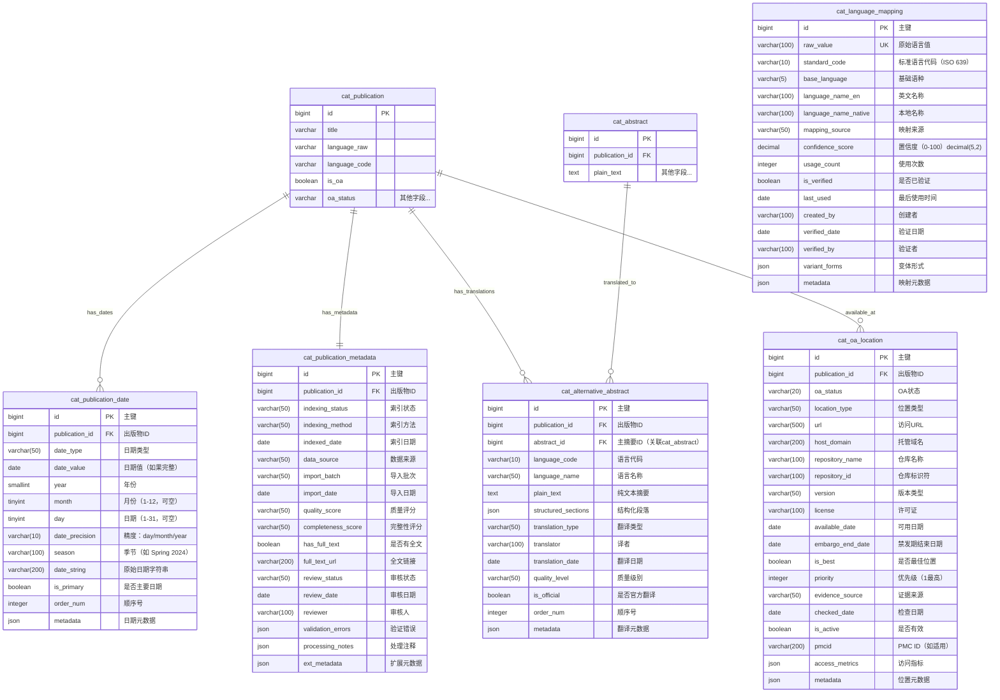

# ER 图设计 - 辅助管理表（5张）

> 文档版本：v1.0
> 创建日期：2025-01-18
> 设计范围：patra_catalog 辅助管理体系
> 作者：Patra Lin

## 一、辅助管理体系概览

辅助管理表提供核心业务的支撑功能：
- **日期管理**：精确记录文献生命周期中的各类日期
- **元数据管理**：存储文献的索引、状态等元信息
- **多语言支持**：管理摘要的多语言版本
- **语言标准化**：原始语言值到标准代码的映射
- **开放获取管理**：详细记录OA位置和版本信息

## 二、ER 图设计

### 2.1 完整 ER 图



### 2.2 关系说明

#### 基数关系解释

| 关系 | 说明 | 业务含义 |
|------|------|----------|
| `cat_publication \|\|--o{ cat_publication_date` | 1:N | 一篇文献有多个日期记录 |
| `cat_publication \|\|--\|\| cat_publication_metadata` | 1:1 | 一篇文献有一条元数据记录 |
| `cat_publication \|\|--o{ cat_alternative_abstract` | 1:N | 一篇文献可有多个语言版本的摘要 |
| `cat_abstract \|\|--o{ cat_alternative_abstract` | 1:N | 一个主摘要可有多个翻译版本 |
| `cat_publication \|\|--o{ cat_oa_location` | 1:N | 一篇文献可在多个位置开放获取 |

**注**：`cat_language_mapping` 是独立的映射表，不直接与其他表关联，而是通过应用层处理语言标准化。

## 三、设计要点

### 3.1 日期信息管理

**cat_publication_date 日期类型分类**：
```
date_type:
├── Received（接收日期）
├── Accepted（接受日期）
├── Published Online（在线发表日期）
├── Published Print（印刷发表日期）
├── Published（发表日期，未区分形式）
├── Revised（修订日期）
├── Corrected（更正日期）
├── Retracted（撤稿日期）
├── Submitted（投稿日期）
├── Available（可用日期）
├── Created（创建日期）
├── Modified（修改日期）
├── Embargo End（禁发期结束）
└── Copyright（版权日期）
```

**日期精度处理**：
- **完整日期**：存储在 date_value 字段
- **分离字段**：year、month、day 分别存储，支持不完整日期
- **原始字符串**：保留原始日期表示（如 "Spring 2024"）
- **季节支持**：某些出版物使用季节而非具体月份

**设计理由**：
1. 医学文献的日期信息复杂多样，需要灵活处理
2. 不同数据源的日期精度不同，需要保持原始精度
3. 支持日期范围查询和排序

### 3.2 元数据管理

**cat_publication_metadata 核心功能**：
- **索引管理**：记录文献在各数据库的索引状态
- **质量控制**：评分和完整性检查
- **数据溯源**：记录数据来源和导入批次
- **审核流程**：支持人工审核和验证
- **处理注释**：记录数据处理过程中的问题和决策

**索引状态分类**：
```
indexing_status:
├── Pending（待索引）
├── In Process（索引中）
├── Indexed（已索引）
├── Failed（索引失败）
├── Excluded（排除索引）
└── Reindexing（重新索引）
```

**质量评分维度**：
- 数据完整性（必填字段是否完整）
- 标识符有效性（PMID、DOI验证）
- 引用完整性（参考文献信息）
- 作者信息完整性
- 摘要质量

### 3.3 多语言摘要管理

**cat_alternative_abstract 特性**：
- **语言版本**：支持同一摘要的多语言版本
- **翻译类型**：
  - Official（官方翻译）
  - Professional（专业翻译）
  - Machine（机器翻译）
  - Community（社区翻译）
- **质量分级**：标记翻译质量等级
- **结构保持**：保持与原摘要相同的结构

**应用场景**：
1. 国际期刊提供的多语言摘要
2. 本地化需求的翻译版本
3. 机器翻译的备用版本

### 3.4 语言映射管理

**cat_language_mapping 核心设计**：

**映射策略**：
```
原始值 → 标准代码 → 基础语种
"eng"      → "en"     → "en"
"chi"      → "zh-CN"  → "zh"
"中文"     → "zh-CN"  → "zh"
"Chinese"  → "zh-CN"  → "zh"
"jpn"      → "ja"     → "ja"
```

**置信度评分规则**：
- 100%：官方ISO标准映射
- 90%+：常见变体，已验证
- 70-89%：机器学习推断
- <70%：需要人工审核

**动态学习机制**：
1. 记录每次使用（usage_count）
2. 高频映射优先级提升
3. 人工验证后置信度提升至100%
4. 定期清理低使用率映射

### 3.5 开放获取位置管理

**cat_oa_location 设计要点**：

**OA状态分类**：
```
oa_status:
├── Gold（金色OA - 出版商提供）
├── Green（绿色OA - 自存档）
├── Hybrid（混合OA）
├── Bronze（青铜OA - 免费但无明确许可）
├── Closed（非OA）
└── Unknown（未知）
```

**位置类型**：
```
location_type:
├── Publisher（出版商网站）
├── PMC（PubMed Central）
├── Institutional Repository（机构仓库）
├── Subject Repository（学科仓库）
├── Preprint Server（预印本服务器）
├── Author Website（作者网站）
└── Aggregator（聚合平台）
```

**版本类型**：
```
version:
├── publishedVersion（出版版本）
├── acceptedVersion（接受版本）
├── submittedVersion（投稿版本）
└── updatedVersion（更新版本）
```

**最佳位置选择规则**：
1. 优先级：Gold > Green > Hybrid > Bronze
2. 版本优先级：publishedVersion > acceptedVersion > submittedVersion
3. 可靠性：Publisher/PMC > Institutional Repository > Others
4. 许可证：CC-BY > CC-BY-NC > Other Open > No License

## 四、数据完整性约束

### 4.1 唯一性约束

```sql
-- 每个文献每种日期类型只能有一个主要日期
CREATE UNIQUE INDEX uk_primary_date ON cat_publication_date(
    publication_id, date_type
) WHERE is_primary = true;

-- 每个文献只有一条元数据
CREATE UNIQUE INDEX uk_pub_metadata ON cat_publication_metadata(publication_id);

-- 语言映射的原始值唯一
CREATE UNIQUE INDEX uk_raw_value ON cat_language_mapping(raw_value);

-- 每个文献每种语言只有一个摘要翻译
CREATE UNIQUE INDEX uk_abstract_lang ON cat_alternative_abstract(
    publication_id, language_code
);

-- 每个OA位置的URL唯一（同一文献）
CREATE UNIQUE INDEX uk_oa_url ON cat_oa_location(publication_id, url);
```

### 4.2 检查约束

```sql
-- 日期字段合理性
CHECK (month BETWEEN 1 AND 12 OR month IS NULL)
CHECK (day BETWEEN 1 AND 31 OR day IS NULL)
CHECK (date_precision IN ('day', 'month', 'year'))

-- 置信度范围
CHECK (confidence_score BETWEEN 0 AND 100)

-- 质量评分
CHECK (quality_score IN ('A', 'B', 'C', 'D', 'F'))

-- OA优先级
CHECK (priority > 0)

-- 禁发期逻辑
CHECK (embargo_end_date IS NULL OR embargo_end_date >= available_date)
```

### 4.3 业务规则

1. **日期一致性**：如果有 date_value，则 year/month/day 应该与之一致
2. **主要日期唯一**：每种 date_type 只能有一个 is_primary = true
3. **语言代码标准**：language_code 应符合 ISO 639 标准
4. **最佳OA位置**：每个文献只能有一个 is_best = true 的位置
5. **元数据完整性**：publication_metadata 应在文献创建时同步创建

## 五、索引策略（预设计）

```sql
-- cat_publication_date
CREATE INDEX idx_publication ON cat_publication_date(publication_id);
CREATE INDEX idx_date_type ON cat_publication_date(date_type);
CREATE INDEX idx_year ON cat_publication_date(year);
CREATE INDEX idx_date_value ON cat_publication_date(date_value) WHERE date_value IS NOT NULL;
CREATE INDEX idx_primary ON cat_publication_date(is_primary) WHERE is_primary = true;

-- cat_publication_metadata
CREATE INDEX idx_indexing_status ON cat_publication_metadata(indexing_status);
CREATE INDEX idx_data_source ON cat_publication_metadata(data_source);
CREATE INDEX idx_import_batch ON cat_publication_metadata(import_batch);
CREATE INDEX idx_review_status ON cat_publication_metadata(review_status);
CREATE INDEX idx_has_full_text ON cat_publication_metadata(has_full_text);

-- cat_alternative_abstract
CREATE INDEX idx_publication ON cat_alternative_abstract(publication_id);
CREATE INDEX idx_abstract ON cat_alternative_abstract(abstract_id);
CREATE INDEX idx_language ON cat_alternative_abstract(language_code);
CREATE INDEX idx_official ON cat_alternative_abstract(is_official);

-- cat_language_mapping
CREATE INDEX idx_standard_code ON cat_language_mapping(standard_code);
CREATE INDEX idx_base_language ON cat_language_mapping(base_language);
CREATE INDEX idx_confidence ON cat_language_mapping(confidence_score);
CREATE INDEX idx_verified ON cat_language_mapping(is_verified);
CREATE INDEX idx_usage ON cat_language_mapping(usage_count);

-- cat_oa_location
CREATE INDEX idx_publication ON cat_oa_location(publication_id);
CREATE INDEX idx_oa_status ON cat_oa_location(oa_status);
CREATE INDEX idx_location_type ON cat_oa_location(location_type);
CREATE INDEX idx_best ON cat_oa_location(is_best) WHERE is_best = true;
CREATE INDEX idx_active ON cat_oa_location(is_active) WHERE is_active = true;
CREATE INDEX idx_pmcid ON cat_oa_location(pmcid) WHERE pmcid IS NOT NULL;
```

## 六、数据同步与维护

### 6.1 语言映射维护

**初始化数据**：
```sql
-- 预置常见映射
INSERT INTO cat_language_mapping (raw_value, standard_code, base_language, confidence_score)
VALUES
    ('eng', 'en', 'en', 100),
    ('chi', 'zh', 'zh', 100),
    ('jpn', 'ja', 'ja', 100),
    ('fre', 'fr', 'fr', 100),
    ('ger', 'de', 'de', 100),
    ('spa', 'es', 'es', 100),
    -- 更多映射...
```

**维护策略**：
1. 每月分析新出现的原始值
2. 使用次数超过100的自动标记审核
3. 置信度低于70的人工审核
4. 定期清理使用次数为0的映射

### 6.2 OA状态同步

**同步规则**：
1. 插入/更新 cat_oa_location 时触发
2. 选择最佳位置（is_best = true）
3. 更新 cat_publication 的 is_oa 和 oa_status
4. 定期验证URL有效性

**触发器示例**：
```sql
CREATE TRIGGER sync_oa_status
AFTER INSERT OR UPDATE ON cat_oa_location
FOR EACH ROW
EXECUTE FUNCTION update_publication_oa_status();
```

### 6.3 元数据质量检查

**定期任务**：
1. **完整性检查**：每日检查必填字段
2. **一致性检查**：每周验证关联数据
3. **质量评分**：每月重新计算质量分数
4. **死链检查**：每季度验证全文链接

## 七、性能优化建议

### 7.1 分区策略

对于大表建议分区：
- `cat_publication_date`：按 date_type 列表分区
- `cat_oa_location`：按 oa_status 列表分区

### 7.2 缓存策略

高频访问数据建议缓存：
- 语言映射表（整表缓存）
- 常用日期类型的数据
- OA最佳位置信息

### 7.3 批处理优化

建议批处理的操作：
- 语言标准化处理
- OA状态同步
- 元数据质量评分计算

## 八、典型查询场景

```sql
-- 查询文献的所有日期信息
SELECT * FROM cat_publication_date
WHERE publication_id = ?
ORDER BY is_primary DESC, date_type, order_num;

-- 查询文献的在线发表日期
SELECT * FROM cat_publication_date
WHERE publication_id = ?
AND date_type = 'Published Online'
AND is_primary = true;

-- 获取文献的元数据和质量信息
SELECT * FROM cat_publication_metadata
WHERE publication_id = ?;

-- 查询文献的所有语言版本摘要
SELECT aa.*, a.plain_text as original_text
FROM cat_alternative_abstract aa
LEFT JOIN cat_abstract a ON aa.abstract_id = a.id
WHERE aa.publication_id = ?
ORDER BY aa.is_official DESC, aa.order_num;

-- 语言标准化查询
SELECT standard_code, base_language
FROM cat_language_mapping
WHERE raw_value = ?
AND is_verified = true;

-- 查询文献的最佳OA位置
SELECT * FROM cat_oa_location
WHERE publication_id = ?
AND is_best = true
AND is_active = true;

-- 查询某仓库的所有OA文献
SELECT p.* FROM cat_publication p
JOIN cat_oa_location oa ON p.id = oa.publication_id
WHERE oa.repository_name = ?
AND oa.is_active = true;
```

## 九、数据质量保障

### 9.1 语言处理质量

**问题与对策**：
| 问题 | 对策 |
|------|------|
| 原始值格式混乱 | 建立完善的映射表 |
| 新语言代码出现 | 动态学习机制 |
| 映射错误 | 人工审核+置信度评分 |

### 9.2 日期数据质量

**问题与对策**：
| 问题 | 对策 |
|------|------|
| 日期格式不统一 | 保留原始字符串 |
| 精度不一致 | 分离字段存储 |
| 时区问题 | 统一使用UTC |

### 9.3 OA信息准确性

**问题与对策**：
| 问题 | 对策 |
|------|------|
| URL失效 | 定期验证+备用链接 |
| 版本混淆 | 明确版本类型定义 |
| 状态变更 | 定期重新检查 |

## 十、扩展考虑

### 10.1 未来功能

1. **自动语言检测**：集成NLP模型自动识别语言
2. **OA趋势分析**：分析OA状态的时间变化
3. **智能日期解析**：处理更复杂的日期表达
4. **质量预测模型**：基于ML的数据质量预测

### 10.2 集成需求

1. **Unpaywall集成**：获取OA状态信息
2. **Google翻译API**：自动翻译摘要
3. **CrossRef API**：验证和补充元数据
4. **DOAJ集成**：开放获取期刊目录

---

*本文档为辅助管理表的 ER 设计，至此完成了 patra_catalog 数据库全部 36 张表的设计工作（核心实体6张 + 分类索引12张 + 人员机构6张 + 关联信息7张 + 辅助管理5张）。*
