# 阶段 2：ER 图设计 - 分类与索引表(12张)

> **设计目标**：为 Patra 医学文献管理系统设计分类与索引表的 ER 图，体现医学领域特色的标引体系
>
> **文档版本**：v3.0（按模板重构）
> **创建日期**：2025-01-18
> **设计范围**：patra_catalog 分类与索引体系（12张表）
> **作者**：Patra Lin

---

## 一、分类索引体系概览

医学文献的分类索引是学术检索的核心，本阶段设计涵盖四大标引维度：

| 体系 | 表数量 | 核心功能 | 预估规模（5年） |
|------|--------|---------|----------------|
| **MeSH 标引** | 6张 | 医学主题词表（NLM标准） | 主表3.75万，关联2.8亿 |
| **关键词** | 2张 | 作者/编辑自由关键词 | 词表700万，关联7000万 |
| **出版类型** | 2张 | 文献类型层次分类 | 类型150，关联1500万 |
| **物质索引** | 2张 | 化学物质、药物、生物制品 | 物质表8万，关联1500万 |

**设计亮点**：
- ✅ MeSH 树形编号多位置支持 - 一个主题词可在树形结构中有多个位置
- ✅ 主题词-限定词分离设计 - 支持 "Antibodies/immunology*" 灵活组合
- ✅ 主/副主题标记 - `is_major_topic` 对应 MeSH 星号（*）标记
- ✅ 出版类型层次 - 支持 "Review → Systematic Review" 父子关系
- ✅ 物质注册号体系 - CAS号等多种注册标准

**数据规模总计**：
- 词表总量：约 800万 行（MeSH 3.75万 + 关键词700万 + 类型150 + 物质8万）
- 关联关系：约 4.65亿 行（各体系文献关联总和）
- 存储预估：约 180GB（5年，未压缩）

---

## 二、🎨 完整 ER 图

```mermaid
erDiagram
    %% 引用核心表（简化展示）
    cat_publication {
        bigint id PK "主键"
        varchar title "文献标题"
    }

    %% ========================================
    %% MeSH 标引体系（6张表）
    %% ========================================

    cat_mesh_descriptor {
        bigint id PK "主键"
        varchar(10) ui UK "MeSH唯一标识符 D000001"
        varchar(255) name "主题词名称（首选术语）"
        varchar(50) descriptor_class "类型：1-Topical/2-PublicationType/3-Geographicals/4-CheckTag"
        text scope_note "范围说明"
        text annotation "注释"
        text previous_indexing "之前索引"
        text public_mesh_note "公共MeSH注释"
        text consider_also "另请参考"
        varchar(10) date_created "创建日期 YYYYMMDD"
        varchar(10) date_revised "修订日期 YYYYMMDD"
        varchar(10) date_established "确立日期 YYYYMMDD"
        boolean active_status "是否有效 1/0"
        varchar(10) mesh_version "MeSH版本年份"
        json metadata "其他元数据"
    }

    cat_mesh_qualifier {
        bigint id PK "主键"
        varchar(10) ui UK "限定词唯一标识符 Q000001"
        varchar(100) name "限定词名称"
        varchar(10) abbreviation "缩写 如 DI"
        text annotation "注释"
        varchar(10) date_created "创建日期"
        varchar(10) date_revised "修订日期"
        varchar(10) date_established "确立日期"
        boolean active_status "是否有效"
        varchar(10) mesh_version "MeSH版本年份"
    }

    cat_mesh_tree_number {
        bigint id PK "主键"
        bigint descriptor_id FK "主题词ID"
        varchar(50) tree_number UK "树形编号 如 C04.557.337.428"
        integer tree_level "层级深度"
        boolean is_primary "是否主要位置"
    }

    cat_mesh_entry_term {
        bigint id PK "主键"
        bigint descriptor_id FK "主题词ID"
        varchar(255) term "入口术语/同义词"
        varchar(10) lexical_tag "词法标记 NON/PEF/LAB/ABB"
        boolean is_print_flag "是否打印 Y/N"
        varchar(10) record_preferred "记录首选 Y/N"
        boolean is_permuted_term "是否排列术语"
    }

    cat_mesh_concept {
        bigint id PK "主键"
        bigint descriptor_id FK "主题词ID"
        varchar(10) concept_ui UK "概念UI M000001"
        varchar(255) concept_name "概念名称"
        boolean is_preferred "是否首选概念"
        varchar(255) casn1_name "CAS类型1名称"
        varchar(50) registry_number "注册号"
        text scope_note "范围说明"
        varchar(10) concept_status "概念状态"
    }

    cat_publication_mesh {
        bigint id PK "主键"
        bigint publication_id FK "出版物ID"
        bigint descriptor_id FK "主题词ID"
        bigint qualifier_id FK "限定词ID（可空）"
        boolean is_major_topic "是否主要主题（星号标记）"
        integer order_num "顺序号"
        varchar(50) indexing_method "标引方法"
    }

    %% ========================================
    %% 关键词体系（2张表）
    %% ========================================

    cat_keyword {
        bigint id PK "主键"
        varchar(500) term "关键词"
        varchar(50) source "来源：author/editor/indexer"
        varchar(10) language "语言"
        varchar(255) normalized_term "规范化词形"
        integer frequency "出现频次"
        json metadata "元数据"
    }

    cat_publication_keyword {
        bigint id PK "主键"
        bigint publication_id FK "出版物ID"
        bigint keyword_id FK "关键词ID"
        boolean is_major "是否主要关键词"
        integer order_num "顺序号"
        varchar(50) keyword_set "关键词集"
    }

    %% ========================================
    %% 出版类型体系（2张表）
    %% ========================================

    cat_publication_type {
        bigint id PK "主键"
        varchar(100) type_code UK "类型代码"
        varchar(200) type_name "类型名称"
        varchar(500) description "描述"
        varchar(50) vocabulary_source "词表来源"
        varchar(100) parent_type "父类型（支持层次）"
        boolean is_active "是否有效"
        json metadata "元数据"
    }

    cat_publication_type_mapping {
        bigint id PK "主键"
        bigint publication_id FK "出版物ID"
        bigint type_id FK "类型ID"
        integer order_num "顺序号"
    }

    %% ========================================
    %% 物质索引体系（2张表）
    %% ========================================

    cat_substance {
        bigint id PK "主键"
        varchar(100) registry_number UK "注册号（CAS号等）"
        varchar(500) name "物质名称"
        varchar(100) vocabulary_id "词表ID"
        varchar(50) vocabulary_source "词表来源"
        varchar(50) substance_class "物质分类"
        varchar(200) molecular_formula "分子式"
        json synonyms "同义词"
        json metadata "元数据"
    }

    cat_publication_substance {
        bigint id PK "主键"
        bigint publication_id FK "出版物ID"
        bigint substance_id FK "物质ID"
        boolean is_major "是否主要物质"
        varchar(100) role "物质角色"
    }

    %% ========================================
    %% 实体关系定义
    %% ========================================

    %% MeSH 内部关系
    cat_mesh_descriptor ||--o{ cat_mesh_tree_number : "has_positions（1:N，多位置）"
    cat_mesh_descriptor ||--o{ cat_mesh_entry_term : "has_synonyms（1:N，同义词）"
    cat_mesh_descriptor ||--o{ cat_mesh_concept : "has_concepts（1:N，多概念）"

    %% 文献 → MeSH 标引关系
    cat_publication ||--o{ cat_publication_mesh : "has_mesh（M:N通过中间表）"
    cat_mesh_descriptor ||--o{ cat_publication_mesh : "used_in"
    cat_mesh_qualifier ||--o{ cat_publication_mesh : "qualifies（可选限定）"

    %% 文献 → 关键词关系
    cat_publication ||--o{ cat_publication_keyword : "has_keywords（M:N）"
    cat_keyword ||--o{ cat_publication_keyword : "used_in"

    %% 文献 → 出版类型关系
    cat_publication ||--o{ cat_publication_type_mapping : "has_types（M:N）"
    cat_publication_type ||--o{ cat_publication_type_mapping : "classifies"

    %% 文献 → 物质关系
    cat_publication ||--o{ cat_publication_substance : "mentions（M:N）"
    cat_substance ||--o{ cat_publication_substance : "referenced_in"
```



---

## 三、📊 关系说明

### 3.1 MeSH 标引体系关系

| 关系 | 类型 | 说明 | 业务含义 |
|------|------|------|----------|
| `cat_mesh_descriptor \|\|--o{ cat_mesh_tree_number` | 1:N | 一个主题词有多个树形位置 | "Antibodies" 可以在免疫学和生物化学两个分支 |
| `cat_mesh_descriptor \|\|--o{ cat_mesh_entry_term` | 1:N | 一个主题词有多个同义词 | "Calcimycin" 的同义词 "A-23187" |
| `cat_mesh_descriptor \|\|--o{ cat_mesh_concept` | 1:N | 一个主题词有多个概念 | 主题词下的不同语义概念 |
| `cat_publication \|\|--o{ cat_publication_mesh` | 1:N | 一篇文献有多个MeSH标引 | 平均每篇8个MeSH主题词 |
| `cat_mesh_qualifier \|\|--o{ cat_publication_mesh` | 1:N（可空） | 限定词可选修饰主题词 | "immunology" 限定 "Antibodies" |

### 3.2 关键词体系关系

| 关系 | 类型 | 说明 | 业务含义 |
|------|------|------|----------|
| `cat_publication \|\|--o{ cat_publication_keyword` | 1:N | 一篇文献有多个关键词 | 平均每篇2-3个关键词 |
| `cat_keyword \|\|--o{ cat_publication_keyword` | 1:N | 一个关键词可用于多篇文献 | 去重复用，记录频次 |

### 3.3 出版类型体系关系

| 关系 | 类型 | 说明 | 业务含义 |
|------|------|------|----------|
| `cat_publication \|\|--o{ cat_publication_type_mapping` | 1:N | 一篇文献有多个类型 | 可同时是 "Journal Article" 和 "Review" |
| `cat_publication_type → cat_publication_type` | 自引用 | 父子类型层次 | "Systematic Review" 的父类型是 "Review" |

### 3.4 物质索引体系关系

| 关系 | 类型 | 说明 | 业务含义 |
|------|------|------|----------|
| `cat_publication \|\|--o{ cat_publication_substance` | 1:N | 一篇文献涉及多个物质 | 药理学研究涉及的化学物质 |
| `cat_substance \|\|--o{ cat_publication_substance` | 1:N | 一个物质可出现在多篇文献 | 阿司匹林在多个研究中被提及 |

---

## 四、🔑 关键设计决策

### 设计决策 1：为什么 MeSH 需要 6 张表？

**问题**：如何存储 NLM MeSH 的复杂层次结构？

**方案对比**：

| 方案 | 优点 | 缺点 | 查询性能 | 导入效率 | 数据完整性 | 决策 |
|------|------|------|---------|---------|-----------|------|
| 单表JSON存储 | 简单，单表查询 | 无法高效检索，难以关联查询 | 差 | 高 | 低 | ❌ |
| 3表设计(主题词+限定词+关联) | 满足基本需求 | 丢失树形结构、同义词、概念信息 | 中 | 中 | 中 | ❌ |
| **6表设计(完整结构)** | 完整支持PubMed数据，支持层次查询 | 表数量多，JOIN复杂 | 高 | 中 | 高 | ✅ **采用** |

**决定**：采用 6 张表完整设计，因为：

**核心理由**：
1. **数据完整性**：PubMed XML 包含复杂的层次结构，需要完整保留
   - `DescriptorRecord` → `cat_mesh_descriptor`
   - `TreeNumberList` → `cat_mesh_tree_number`（支持多位置）
   - `ConceptList` → `cat_mesh_concept`
   - `TermList` → `cat_mesh_entry_term`（同义词）
   - `QualifierRecord` → `cat_mesh_qualifier`

2. **查询效率**：分表存储，独立索引
   - 树形编号查询：直接在 `cat_mesh_tree_number` 索引查询
   - 同义词检索：全文索引 `cat_mesh_entry_term.term`
   - 概念关联：通过 `cat_mesh_concept` 桥接

3. **导入效率**：批量导入时可并行处理各表
   ```python
   # 并行导入策略
   1. 导入 cat_mesh_descriptor（主表）
   2. 并行导入：
      - cat_mesh_tree_number
      - cat_mesh_entry_term
      - cat_mesh_concept
   3. 最后构建索引
   ```

4. **扩展性**：支持 MeSH 年度更新
   - 保留历史版本（`mesh_version` 字段）
   - 废弃术语设置 `active_status=0`

**架构示意**：
```
cat_mesh_descriptor（主题词核心表）
    ├── cat_mesh_tree_number（1:N，树形编号）
    ├── cat_mesh_entry_term（1:N，同义词）
    └── cat_mesh_concept（1:N，概念）
          └── cat_mesh_entry_term（N:1，概念下的术语）

cat_mesh_qualifier（限定词独立表）

cat_publication_mesh（文献标引关联表）
    ├── descriptor_id（必填）
    ├── qualifier_id（可空）
    └── is_major_topic（主/副主题）
```

---

### 设计决策 2：树形编号的设计理由

**问题**：一个主题词为什么可以有多个树形位置？

**实际案例**：
```
"Antibodies"（抗体）主题词有两个树形位置：
1. D12.776.124.486.485（生物化学分支）
2. D20.215.894.899.600.100（免疫学分支）
```

**方案对比**：

| 方案 | 优点 | 缺点 | 决策 |
|------|------|------|------|
| 单个字段存储主位置 | 简单，单值索引 | 丢失多位置信息，无法层次导航 | ❌ |
| JSON数组存储多个位置 | 保留完整数据 | 无法高效查询，无法层次索引 | ❌ |
| **独立表存储（1:N）** | 每个位置独立索引，支持层次查询 | 需要JOIN | ✅ **采用** |

**决定**：独立表 `cat_mesh_tree_number` 存储多位置，因为：

1. **多学科交叉**：医学概念可能属于多个分支
   - "Antibodies" 既是生物化学物质，也是免疫学概念

2. **层次查询支持**：
   ```sql
   -- 查询某个分支下的所有子主题词
   SELECT DISTINCT d.* FROM cat_mesh_descriptor d
   JOIN cat_mesh_tree_number t ON d.id = t.descriptor_id
   WHERE t.tree_number LIKE 'D12.776.%';

   -- 查询某主题词的所有上级
   SELECT parent.* FROM cat_mesh_descriptor parent
   JOIN cat_mesh_tree_number pt ON parent.id = pt.descriptor_id
   WHERE pt.tree_number IN (
       SELECT SUBSTRING(tree_number, 1, LOCATE('.', tree_number, LOCATE('.', tree_number)+1)-1)
       FROM cat_mesh_tree_number WHERE descriptor_id = ?
   );
   ```

3. **主/次位置标记**：`is_primary` 字段标识主要位置

4. **层级深度预计算**：`tree_level` 字段优化层次查询
   ```
   D12 → level=1
   D12.776 → level=2
   D12.776.124 → level=3
   D12.776.124.486 → level=4
   D12.776.124.486.485 → level=5
   ```

---

### 设计决策 3：限定词的作用

**问题**：限定词（Qualifier）和主题词（Descriptor）是什么关系？

**MeSH 标引示例**：
```
"Antibodies/immunology*" 表示：
- 主题词：Antibodies（抗体）
- 限定词：immunology（免疫学方面）
- 星号（*）：主要主题标记
```

**方案对比**：

| 方案 | 优点 | 缺点 | 决策 |
|------|------|------|------|
| 合并存储（组合字符串） | 简单，节省空间 | 无法灵活组合，难以统计 | ❌ |
| **分离存储（主题词+限定词）** | 灵活组合，独立统计 | 需要JOIN，占用空间 | ✅ **采用** |

**决定**：分离存储，通过 `cat_publication_mesh` 关联，因为：

1. **灵活组合**：一个主题词可以有多种限定词
   ```
   Antibodies（可以有以下限定词）：
   - /immunology（免疫学方面）
   - /metabolism（代谢方面）
   - /therapeutic use（治疗用途）
   ```

2. **限定词复用**：100+ 限定词可用于所有主题词
   ```sql
   SELECT COUNT(*) FROM cat_mesh_qualifier;
   -- 约 100 个限定词

   SELECT COUNT(*) FROM cat_mesh_descriptor;
   -- 约 3.5 万个主题词

   -- 组合可能性：3.5万 × 100 = 350万种
   ```

3. **可选限定**：`qualifier_id` 可为 NULL
   - 有些标引只有主题词，没有限定词
   - 例如："COVID-19"（没有限定词）

4. **主题标记**：`is_major_topic` 独立于限定词
   - "Antibodies/immunology*" → `is_major_topic=true`
   - "COVID-19/drug therapy" → `is_major_topic=false`

**数据示例**：
```sql
-- cat_mesh_descriptor
id=1, ui='D000906', name='Antibodies'

-- cat_mesh_qualifier
id=1, ui='Q000276', name='immunology', abbreviation='IM'

-- cat_publication_mesh
publication_id=12345, descriptor_id=1, qualifier_id=1, is_major_topic=true
→ 表示："Antibodies/immunology*"
```

---

### 设计决策 4：关键词 vs MeSH 的区别

**问题**：为什么需要关键词表？与 MeSH 有什么区别？

**方案对比**：

| 方案 | 优点 | 缺点 | 决策 |
|------|------|------|------|
| 只使用MeSH | 标准化，权威 | 覆盖不全，时效性差 | ❌ |
| 只使用关键词 | 灵活，实时 | 不规范，同义词混乱 | ❌ |
| **MeSH + 关键词双轨** | 标准化 + 灵活性 | 需要两套体系 | ✅ **采用** |

**决定**：同时支持 MeSH 和关键词，因为：

**核心区别**：

| 维度 | MeSH（受控词表） | 关键词（自由词） |
|------|----------------|----------------|
| **来源** | NLM专家标引 | 作者/编辑提供 |
| **标准化** | 高度标准化 | 不规范（同义词多） |
| **覆盖范围** | 3.5万主题词 | 300万+（去重后） |
| **时效性** | 年度更新（滞后） | 实时（新概念快） |
| **层次结构** | 有树形结构 | 无结构 |
| **检索效果** | 查准率高 | 查全率高 |

**典型场景**：

1. **MeSH 场景**：
   ```sql
   -- 查询所有关于"COVID-19"的文献（标准化）
   SELECT p.* FROM cat_publication p
   JOIN cat_publication_mesh pm ON p.id = pm.publication_id
   JOIN cat_mesh_descriptor md ON pm.descriptor_id = md.id
   WHERE md.ui = 'D000086382'; -- COVID-19的MeSH UI
   ```

2. **关键词场景**：
   ```sql
   -- 查询包含新概念"CRISPR-Cas9"的文献（MeSH可能还没有）
   SELECT p.* FROM cat_publication p
   JOIN cat_publication_keyword pk ON p.id = pk.publication_id
   JOIN cat_keyword k ON pk.keyword_id = k.id
   WHERE k.normalized_term LIKE '%crispr%';
   ```

**设计要点**：

1. **关键词规范化**：`normalized_term` 字段
   ```
   原始关键词："COVID-19", "Covid-19", "covid 19"
   规范化后："covid19"
   ```

2. **多来源支持**：`source` 字段
   ```
   - 'author'   -- 作者提供
   - 'editor'   -- 编辑添加
   - 'indexer'  -- 索引员标注
   ```

3. **频次统计**：`frequency` 字段
   - 热门关键词识别
   - 趋势分析

---

### 设计决策 5：出版类型的层次设计

**问题**：出版类型为什么需要层次结构？

**实际案例**：
```
Journal Article（期刊文章）
├── Clinical Trial（临床试验）
│   ├── Randomized Controlled Trial（随机对照试验）
│   └── Controlled Clinical Trial（对照临床试验）
├── Review（综述）
│   ├── Systematic Review（系统综述）
│   └── Meta-Analysis（荟萃分析）
└── Case Reports（病例报告）
```

**方案对比**：

| 方案 | 优点 | 缺点 | 决策 |
|------|------|------|------|
| 平铺所有类型 | 简单，无层次 | 无法按父类型统计 | ❌ |
| 多表设计（type/subtype） | 层次明确 | 只支持2级，扩展性差 | ❌ |
| **parent_type自引用** | 支持任意层级，灵活 | 需要递归查询 | ✅ **采用** |

**决定**：使用 `parent_type` 字段实现自引用层次，因为：

1. **多层次查询**：
   ```sql
   -- 查询所有"综述"类文献（包括Systematic Review、Meta-Analysis）
   WITH RECURSIVE type_hierarchy AS (
       -- 锚点：综述类型
       SELECT id, type_code, type_name, parent_type FROM cat_publication_type
       WHERE type_code = 'Review'

       UNION ALL

       -- 递归：子类型
       SELECT t.id, t.type_code, t.type_name, t.parent_type
       FROM cat_publication_type t
       JOIN type_hierarchy h ON t.parent_type = h.type_code
   )
   SELECT p.* FROM cat_publication p
   JOIN cat_publication_type_mapping ptm ON p.id = ptm.publication_id
   WHERE ptm.type_id IN (SELECT id FROM type_hierarchy);
   ```

2. **多类型标注**：一篇文献可以有多个类型
   ```
   一篇文献可以同时是：
   - "Journal Article"（期刊文章）
   - "Randomized Controlled Trial"（随机对照试验）
   - "Multicenter Study"（多中心研究）
   ```

3. **类型演化**：通过 `is_active` 字段管理废弃类型
   ```sql
   -- 标记废弃类型
   UPDATE cat_publication_type SET is_active=0 WHERE type_code='OldType';

   -- 查询时过滤
   WHERE is_active=1
   ```

4. **词表来源**：`vocabulary_source` 支持多个标准
   ```
   - 'MEDLINE'  -- PubMed标准
   - 'EMBASE'   -- Embase标准
   - 'CUSTOM'   -- 自定义类型
   ```

---

### 设计决策 6：化学物质检索的必要性

**问题**：为什么需要独立的物质索引表？

**方案对比**：

| 方案 | 优点 | 缺点 | 决策 |
|------|------|------|------|
| 并入MeSH Concept | 复用现有结构 | MeSH更新滞后，非所有物质都有MeSH | ❌ |
| 仅存储在文本字段 | 简单，节省空间 | 无法高效检索，无法关联 | ❌ |
| **独立物质表** | 专用索引，支持CAS号等标准 | 增加表数量 | ✅ **采用** |

**决定**：独立 `cat_substance` 表，因为：

1. **药理学研究需求**：
   ```sql
   -- 查询涉及"阿司匹林"的所有研究
   SELECT p.* FROM cat_publication p
   JOIN cat_publication_substance ps ON p.id = ps.publication_id
   JOIN cat_substance s ON ps.substance_id = s.id
   WHERE s.name = 'Aspirin' OR s.registry_number = '50-78-2';
   ```

2. **注册号标准化**：
   ```
   - CAS号：化学物质唯一标识（如 50-78-2 = 阿司匹林）
   - EC号：酶分类号
   - UNII：FDA唯一成分标识符
   - "0"：非特定物质或物质类
   ```

3. **物质分类**：`substance_class` 字段
   ```
   - 'chemical'     -- 化学物质
   - 'drug'         -- 药物
   - 'biological'   -- 生物制品
   - 'enzyme'       -- 酶
   - 'antibody'     -- 抗体
   ```

4. **同义词支持**：`synonyms` JSON 字段
   ```json
   {
     "en": ["Aspirin", "Acetylsalicylic Acid"],
     "zh": ["阿司匹林", "乙酰水杨酸"]
   }
   ```

5. **物质角色**：`cat_publication_substance.role` 字段
   ```
   - 'therapeutic'    -- 治疗用途
   - 'diagnostic'     -- 诊断用途
   - 'research_tool'  -- 研究工具
   - 'adverse_effect' -- 不良反应
   ```

---

## 五、🎯 索引策略预览

### 5.1 MeSH 体系索引

#### cat_mesh_descriptor 表索引
| 索引名 | 类型 | 字段 | 选择性 | 理由 |
|--------|------|------|--------|------|
| PRIMARY | 聚簇索引 | id | 1.00 | 主键 |
| uk_mesh_ui | 唯一索引 | ui | 1.00 | MeSH UI是唯一标识 |
| idx_name | 普通索引 | name | 0.95 | 按主题词名称查询 |
| ft_name_note | 全文索引 | name, scope_note | N/A | 全文检索 |
| idx_active_version | 复合索引 | active_status, mesh_version | 0.80 | 筛选有效版本 |

#### cat_mesh_tree_number 表索引
| 索引名 | 类型 | 字段 | 选择性 | 理由 |
|--------|------|------|--------|------|
| PRIMARY | 聚簇索引 | id | 1.00 | 主键 |
| uk_tree_number | 唯一索引 | tree_number | 1.00 | 树形编号唯一 |
| idx_descriptor | 普通索引 | descriptor_id | 0.30 | 查询主题词的所有位置 |
| idx_tree_prefix | 前缀索引 | tree_number(20) | 0.60 | 层次查询（LIKE 'D12.%'） |
| idx_tree_level | 复合索引 | tree_level, descriptor_id | 0.50 | 按层级筛选 |

#### cat_publication_mesh 表索引
| 索引名 | 类型 | 字段 | 选择性 | 理由 |
|--------|------|------|--------|------|
| PRIMARY | 聚簇索引 | id | 1.00 | 主键 |
| idx_pub_desc | 复合索引 | publication_id, descriptor_id | 0.95 | 查询文献的MeSH |
| idx_desc_pub | 复合索引 | descriptor_id, publication_id | 0.85 | 查询MeSH的文献 |
| idx_major_topic | 复合索引 | descriptor_id, is_major_topic | 0.75 | 筛选主要主题 |
| idx_qualifier | 普通索引 | qualifier_id | 0.60 | 按限定词筛选 |

### 5.2 关键词体系索引

#### cat_keyword 表索引
| 索引名 | 类型 | 字段 | 选择性 | 理由 |
|--------|------|------|--------|------|
| PRIMARY | 聚簇索引 | id | 1.00 | 主键 |
| idx_normalized | 普通索引 | normalized_term | 0.90 | 规范化查询 |
| idx_frequency | 普通索引 | frequency DESC | 0.70 | 热门关键词排序 |
| ft_term | 全文索引 | term | N/A | 全文检索 |
| idx_source_lang | 复合索引 | source, language | 0.60 | 按来源和语言筛选 |

#### cat_publication_keyword 表索引
| 索引名 | 类型 | 字段 | 选择性 | 理由 |
|--------|------|------|--------|------|
| PRIMARY | 聚簇索引 | id | 1.00 | 主键 |
| idx_pub_keyword | 复合索引 | publication_id, keyword_id | 0.95 | 查询文献的关键词 |
| idx_keyword_pub | 复合索引 | keyword_id, publication_id | 0.90 | 查询关键词的文献 |
| idx_major | 复合索引 | keyword_id, is_major | 0.80 | 筛选主要关键词 |

### 5.3 出版类型体系索引

#### cat_publication_type 表索引
| 索引名 | 类型 | 字段 | 选择性 | 理由 |
|--------|------|------|--------|------|
| PRIMARY | 聚簇索引 | id | 1.00 | 主键 |
| uk_type_code | 唯一索引 | type_code | 1.00 | 类型代码唯一 |
| idx_parent | 普通索引 | parent_type | 0.30 | 查询子类型 |
| idx_active | 普通索引 | is_active | 0.20 | 筛选有效类型 |

#### cat_publication_type_mapping 表索引
| 索引名 | 类型 | 字段 | 选择性 | 理由 |
|--------|------|------|--------|------|
| PRIMARY | 聚簇索引 | id | 1.00 | 主键 |
| idx_pub_type | 复合索引 | publication_id, type_id | 0.95 | 查询文献的类型 |
| idx_type_pub | 复合索引 | type_id, publication_id | 0.90 | 查询类型的文献 |

### 5.4 物质体系索引

#### cat_substance 表索引
| 索引名 | 类型 | 字段 | 选择性 | 理由 |
|--------|------|------|--------|------|
| PRIMARY | 聚簇索引 | id | 1.00 | 主键 |
| uk_registry | 唯一索引 | registry_number | 0.99 | 注册号唯一（CAS号） |
| idx_name | 普通索引 | name | 0.85 | 按物质名称查询 |
| idx_class | 普通索引 | substance_class | 0.30 | 按分类筛选 |
| ft_name_synonyms | 全文索引 | name, synonyms | N/A | 全文检索（含同义词） |

#### cat_publication_substance 表索引
| 索引名 | 类型 | 字段 | 选择性 | 理由 |
|--------|------|------|--------|------|
| PRIMARY | 聚簇索引 | id | 1.00 | 主键 |
| idx_pub_substance | 复合索引 | publication_id, substance_id | 0.95 | 查询文献的物质 |
| idx_substance_pub | 复合索引 | substance_id, publication_id | 0.90 | 查询物质的文献 |
| idx_major_role | 复合索引 | substance_id, is_major, role | 0.85 | 筛选主要物质和角色 |

---

## 六、✅ ER 图验证清单

### 完整性检查
- [x] 包含全部 12 张分类索引表
  - [x] MeSH体系：6张（descriptor, qualifier, tree_number, entry_term, concept, publication_mesh）
  - [x] 关键词体系：2张（keyword, publication_keyword）
  - [x] 出版类型体系：2张（publication_type, publication_type_mapping）
  - [x] 物质体系：2张（substance, publication_substance）
- [x] 所有实体关系都已定义（14个关系）
- [x] 主键和唯一键都已标识
- [x] 外键关系明确（9个外键）

### 规范性检查
- [x] 表名使用单数形式，小写，下划线分隔
- [x] 字段名小写，下划线分隔
- [x] 主键统一为 `id`（BIGINT，雪花ID）
- [x] 关联表包含 `order_num`（保留顺序）
- [x] 布尔字段使用 `is_` 或 `_status` 命名
- [x] JSON扩展字段已包含（metadata, synonyms）

### 性能考虑
- [x] 高频查询字段已识别（ui, tree_number, normalized_term, registry_number）
- [x] 索引策略完整（主键/唯一/外键/业务索引共 40+ 个）
- [x] 全文索引需求已识别（name, term, scope_note）
- [x] 复合索引优化（publication_id + type_id 等）
- [x] 前缀索引优化（tree_number 层次查询）

### 数据质量
- [x] 唯一性约束（ui, tree_number, type_code, registry_number）
- [x] 检查约束（descriptor_class枚举、active_status布尔）
- [x] 外键约束（所有FK字段）
- [x] 非空约束（name, term 等关键字段）
- [x] 可选外键（qualifier_id允许NULL）

---

## 七、🔍 与需求的映射

| 需求场景 | ER图体现 | 实现方式 | 备注 |
|---------|----------|---------|------|
| MeSH层次查询 | cat_mesh_tree_number表 | 前缀索引 tree_number | LIKE 'D12.%' 查询子主题词 |
| MeSH同义词检索 | cat_mesh_entry_term表 | 全文索引 term | 支持 "A-23187" 找到 "Calcimycin" |
| 按主要主题筛选 | is_major_topic in publication_mesh | 复合索引 (descriptor_id, is_major_topic) | 对应MeSH星号标记 |
| 主题词-限定词组合 | descriptor_id + qualifier_id | 两个FK字段 | "Antibodies/immunology" |
| 关键词规范化查询 | normalized_term in keyword | 普通索引 | 忽略大小写、标点 |
| 关键词频次统计 | frequency in keyword | 降序索引 | 热门关键词排行 |
| 按出版类型筛选 | cat_publication_type_mapping | 复合索引 (type_id, publication_id) | - |
| 出版类型层次查询 | parent_type in publication_type | 递归CTE | "Review"包含子类型 |
| 化学物质检索 | cat_substance表 | 唯一索引 registry_number | CAS号精确查询 |
| 物质同义词检索 | synonyms JSON in substance | 全文索引 | 多语言支持 |
| 按物质角色筛选 | role in publication_substance | 复合索引 (substance_id, role) | therapeutic/diagnostic等 |
| MeSH版本管理 | mesh_version + active_status | 复合索引 | 支持年度更新 |
| 多位置树形编号 | 1:N关系 tree_number | descriptor_id外键 | 一个主题词多个位置 |
| 多类型标注 | M:N关系 type_mapping | 中间表 | 一篇文献多个类型 |
| 跨体系联合检索 | 独立的4个体系 | 各自索引优化 | 避免单表臃肿 |

---

## 八、下一步

分类索引 ER 图设计完成，进入 **[阶段 3: 人员机构 ER 设计](3-personnel-organization.md)**

下一阶段将设计：
- 作者管理（含去重策略）
- 机构信息
- 作者-机构关联
- 研究者信息
- 文献-作者关联（含顺序、角色）
- **共计 6 张表**

**设计重点**：
- 作者去重策略（ORCID优先级 + 复合去重键）
- 机构层次结构（部门-医院-大学）
- 作者顺序和角色（第一作者、通讯作者）

---

*本文档是 patra_catalog 数据库分类索引表的 ER 设计，是医学文献检索的核心基础。*
