# 阶段 4：ER 图设计 - 关联信息表(7张)

> **设计目标**: 为 Patra 医学文献管理系统设计关联信息管理体系的 ER 图,涵盖资助、引用、相关项、补充材料和发布历史
>
> **创建日期**: 2025-01-18
> **设计范围**: patra_catalog 关联信息管理体系(7张表)
> **作者**: Patra Lin

---

## 一、关联信息体系概览

本文档描述 patra_catalog 数据库关联信息管理的 7 张表及其关系。这些表管理文献的资助来源、引用关系、相关项目、补充材料和发布历史:

| 表名 | 中文名 | 核心功能 | 预估规模 |
|------|--------|---------|---------|
| `cat_funding` | 资助信息表 | 研究资金来源、项目管理 | 300万+ |
| `cat_publication_funding` | 文献-资助关联表 | 文献与资助的多对多关系 | 750万+ |
| `cat_reference` | 参考文献表 | 文献引用关系管理 | 2亿+ |
| `cat_external_reference` | 外部引用表 | 外部数据库引用(基因库、临床试验等) | 250万+ |
| `cat_related_item` | 相关项目表 | 撤稿、勘误、评论等关联文献 | 50万+ |
| `cat_supplemental_object` | 补充对象表 | 图表、数据集、代码等附加资源 | 500万+ |
| `cat_publication_history` | 发布历史表 | 文献生命周期事件追踪 | 3000万+ |

**设计亮点**:
- ✅ 资助信息去重策略(agency_name + grant_id) - 减少 60%+ 冗余
- ✅ 引用的双重关联设计 - 支持库内外文献引用
- ✅ 外部引用 vs 参考文献分离 - 清晰区分不同类型引用
- ✅ 相关项类型枚举(12种) - 覆盖撤稿/勘误/评论等场景
- ✅ 补充材料访问控制 - is_public + license 管理
- ✅ 历史事件时序性 - order_num + event_date 双重保障

---

## 二、🎨 完整 ER 图

```mermaid
erDiagram
    %% 引用核心表(简化展示)
    cat_publication {
        bigint id PK "主键,雪花ID"
        varchar(2000) title "文献标题"
        varchar(15) pmid "PubMed ID"
        varchar(200) doi "数字对象标识符"
    }

    %% 资助信息表
    cat_funding {
        bigint id PK "主键"
        varchar(200) agency_name "资助机构名称"
        varchar(100) agency_abbreviation "机构缩写"
        varchar(100) country "资助国家"
        varchar(100) grant_id "资助编号/项目编号"
        varchar(100) grant_acronym "项目缩写"
        varchar(500) grant_name "项目名称"
        varchar(50) funding_type "资助类型:Government/Foundation/Corporate等"
        decimal amount "资助金额 decimal(20, 2)"
        varchar(10) currency "货币类型:USD/EUR/CNY等"
        date start_date "开始日期"
        date end_date "结束日期"
        varchar(100) funder_id "资助者标识符(Crossref Funder ID)"
        varchar(100) ror_id "ROR标识符"
        varchar(255) dedup_key "去重键:MD5(agency_name+grant_id)"
        json metadata "资助元数据"
    }

    cat_publication_funding {
        bigint id PK "主键"
        bigint publication_id FK "出版物ID"
        bigint funding_id FK "资助ID"
        varchar(500) acknowledgment_text "致谢文本"
        boolean is_primary "是否主要资助"
        integer order_num "顺序号"
        varchar(200) recipient_name "接收人/PI姓名"
        varchar(100) recipient_orcid "接收人ORCID"
        json metadata "关联元数据"
    }

    %% 引用关系表
    cat_reference {
        bigint id PK "主键"
        bigint publication_id FK "引用文献ID(本文)"
        bigint cited_publication_id FK "被引文献ID(如果在库中)"
        varchar(20) cited_pmid "被引文献PMID(库外)"
        varchar(200) cited_doi "被引文献DOI(库外)"
        varchar(2000) citation_text "引用文本"
        varchar(500) article_title "文章标题"
        varchar(500) source "来源期刊/书籍"
        varchar(100) volume "卷号"
        varchar(100) issue "期号"
        varchar(50) pages "页码"
        smallint year "年份"
        varchar(500) authors "作者列表"
        varchar(50) reference_type "引用类型:Journal Article/Book等"
        integer reference_number "引用编号"
        boolean is_retracted "是否已撤稿"
        json metadata "引用元数据"
    }

    cat_external_reference {
        bigint id PK "主键"
        bigint publication_id FK "出版物ID"
        varchar(50) database_name "数据库名称:GenBank/ClinicalTrials.gov等"
        varchar(100) database_category "数据库类别:Genomic/Clinical Trial等"
        varchar(200) accession_number "登录号"
        varchar(500) url "链接地址"
        varchar(50) reference_type "引用类型"
        varchar(500) description "描述"
        date access_date "访问日期"
        varchar(50) version "版本"
        integer order_num "顺序号"
        json metadata "外部引用元数据"
    }

    %% 相关项目表
    cat_related_item {
        bigint id PK "主键"
        bigint publication_id FK "主文献ID"
        bigint related_publication_id FK "相关文献ID(如果在库中)"
        varchar(20) related_pmid "相关文献PMID"
        varchar(200) related_doi "相关文献DOI"
        varchar(50) relationship_type "关系类型:Retraction/Erratum/Comment等"
        varchar(500) title "相关项标题"
        varchar(500) description "关系描述"
        date relationship_date "关系建立日期"
        varchar(100) initiated_by "发起方:Author/Editor/Publisher"
        varchar(50) status "状态:Active/Resolved等"
        integer order_num "顺序号"
        json metadata "关系元数据"
    }

    cat_supplemental_object {
        bigint id PK "主键"
        bigint publication_id FK "出版物ID"
        varchar(50) object_type "对象类型:Figure/Table/Dataset/Code等"
        varchar(50) content_type "内容类型(MIME):application/pdf等"
        varchar(500) title "标题"
        varchar(1000) description "描述"
        varchar(500) url "访问URL"
        varchar(255) file_name "文件名"
        bigint file_size "文件大小(字节)"
        varchar(100) doi "补充材料DOI"
        varchar(50) license "许可证:CC-BY/CC0等"
        varchar(500) authors "作者/贡献者"
        integer order_num "顺序号"
        boolean is_public "是否公开"
        date available_date "可用日期"
        json metadata "对象元数据"
    }

    cat_publication_history {
        bigint id PK "主键"
        bigint publication_id FK "出版物ID"
        varchar(50) event_type "事件类型:Submitted/Accepted/Published等"
        date event_date "事件日期"
        varchar(10) date_precision "日期精度:day/month/year"
        varchar(500) description "事件描述"
        varchar(100) actor "执行者/机构"
        varchar(100) previous_status "之前状态"
        varchar(100) new_status "新状态"
        integer order_num "事件顺序"
        boolean is_public "是否公开"
        json metadata "事件元数据"
    }

    %% 实体关系定义
    cat_publication ||--o{ cat_publication_funding : "funded_by"
    cat_funding ||--o{ cat_publication_funding : "funds"
    cat_publication ||--o{ cat_reference : "cites"
    cat_publication ||--o| cat_reference : "cited_by"
    cat_publication ||--o{ cat_external_reference : "references_external"
    cat_publication ||--o{ cat_related_item : "has_related"
    cat_publication ||--o| cat_related_item : "related_to"
    cat_publication ||--o{ cat_supplemental_object : "has_supplements"
    cat_publication ||--o{ cat_publication_history : "has_history"
```



---

## 三、📊 关系说明

### 3.1 基数关系解释

| 关系 | 类型 | 说明 | 业务含义 |
|------|------|------|----------|
| `cat_publication \|\|--o{ cat_publication_funding` | 1:N | 一篇文献有多个资助关联记录 | 支持多个资助来源 |
| `cat_funding \|\|--o{ cat_publication_funding` | 1:N | 一个资助项目支持多篇文献 | 资助项目的文献产出 |
| `cat_publication \|\|--o{ cat_reference` | 1:N | 一篇文献引用多篇参考文献 | 平均每篇文献引用 20-50 篇 |
| `cat_publication \|\|--o\| cat_reference` | 1:N(反向) | 一篇文献被多篇文献引用 | 被引关系,用于引用网络分析 |
| `cat_publication \|\|--o{ cat_external_reference` | 1:N | 一篇文献引用多个外部数据 | 基因库、临床试验等数据引用 |
| `cat_publication \|\|--o{ cat_related_item` | 1:N | 一篇文献有多个相关项 | 撤稿、勘误、评论等 |
| `cat_publication \|\|--o{ cat_supplemental_object` | 1:N | 一篇文献有多个补充材料 | 图表、数据集、代码等 |
| `cat_publication \|\|--o{ cat_publication_history` | 1:N | 一篇文献有多个历史事件 | 投稿、接收、发表等时间节点 |

### 3.2 特殊关系说明

#### 资助的多对多关系
- 一篇文献可以有多个资助来源
- 一个资助项目可以支持多篇文献
- 通过 `cat_publication_funding` 中间表实现
- 支持主要资助标记(`is_primary`)和资助顺序(`order_num`)

#### 引用的双重关联
- **库内引用**: `cited_publication_id` 外键关联 `cat_publication.id`
- **库外引用**: `cited_pmid`、`cited_doi` 记录外部文献标识符
- 优先使用库内关联,如果被引文献不在库中则记录标识符
- 支持引用网络构建和引用完整性管理

---

## 四、🔑 关键设计决策

### 设计决策 1: 资助信息去重策略

**问题**: 如何避免相同资助项目在数据库中重复存储?

**资助信息重复现状**:
- 同一资助项目被多篇文献引用
- 机构名称和项目编号组合可唯一标识资助
- 不去重会导致 60%+ 的数据冗余

**方案对比**:

| 方案 | 优点 | 缺点 | 去重效果 | 决策 |
|------|------|------|---------|------|
| 每次插入新记录 | 实现简单,无需去重逻辑 | 大量冗余,统计困难 | 0% | ❌ |
| 使用 Funder ID | 标准化程度高 | Funder ID 覆盖率低(~40%) | 40% | ❌ |
| **agency_name + grant_id** | 覆盖率高,准确性好 | 需要名称规范化 | 90%+ | ✅ **采用** |
| 仅使用 grant_id | 去重简单 | grant_id 不同机构可能重复 | 60% | ❌ |

**决定**: 采用 `agency_name + grant_id` 复合去重策略,因为:

**实现方式**:
```java
// 生成去重键
String dedupKey = MD5(normalize(agencyName) + "|" + normalize(grantId));

// 规范化逻辑
private String normalize(String text) {
    return text.toLowerCase()
               .replaceAll("\\s+", " ")  // 多空格转单空格
               .replaceAll("[^a-z0-9 ]", "")  // 移除特殊字符
               .trim();
}
```

**优势**:
- ✅ **覆盖率高**: 90%+ 的资助信息可去重
- ✅ **准确性好**: 机构名+项目编号唯一标识资助
- ✅ **减少冗余**: 预计减少 60%+ 存储空间
- ✅ **统计友好**: 便于分析资助影响力和文献产出

**业务规则**:
- 插入前先查询是否存在相同 `dedup_key` 的记录
- 如果存在则复用,否则创建新记录
- 定期运行数据质量检查任务,识别遗漏的重复项

---

### 设计决策 2: 引用的双重关联设计

**问题**: 如何同时支持库内文献引用和库外文献引用?

**引用场景分析**:
- **库内引用**: 被引文献已收录在 patra_catalog 中(~30%)
- **库外引用**: 被引文献未收录,只有 PMID/DOI(~70%)

**方案对比**:

| 方案 | 优点 | 缺点 | 决策 |
|------|------|------|------|
| 仅存储 PMID/DOI | 实现简单 | 无法构建引用网络,无法关联库内文献 | ❌ |
| 仅使用外键关联 | 数据完整性强 | 无法引用库外文献(70%数据丢失) | ❌ |
| **双重关联(FK + PMID/DOI)** | 灵活性高,覆盖全场景 | 需要同步维护两套数据 | ✅ **采用** |

**决定**: 采用双重关联设计,因为:

**字段设计**:
```sql
-- 优先使用的字段
cited_publication_id BIGINT      -- 如果被引文献在库中,使用外键关联
                                 -- 外键约束: FOREIGN KEY (cited_publication_id)
                                 --           REFERENCES cat_publication(id)

-- 降级使用的字段(库外引用)
cited_pmid           VARCHAR(20)  -- 被引文献的 PMID
cited_doi            VARCHAR(200) -- 被引文献的 DOI

-- 始终存储的字段(无论是否在库中)
citation_text        VARCHAR(2000) -- 原始引用文本
article_title        VARCHAR(500)  -- 文章标题
authors              VARCHAR(500)  -- 作者列表
source               VARCHAR(500)  -- 来源期刊/书籍
year                 SMALLINT      -- 年份
```

**优先级规则**:
```java
// 1. 优先通过 PMID 匹配库内文献
if (citedPmid != null) {
    Publication citedPub = publicationRepo.findByPmid(citedPmid);
    if (citedPub != null) {
        reference.setCitedPublicationId(citedPub.getId());
        return; // 匹配成功,使用外键关联
    }
}

// 2. 其次通过 DOI 匹配
if (citedDoi != null) {
    Publication citedPub = publicationRepo.findByDoi(citedDoi);
    if (citedPub != null) {
        reference.setCitedPublicationId(citedPub.getId());
        return;
    }
}

// 3. 无法匹配库内文献,保留 PMID/DOI
// cited_pmid 和 cited_doi 已设置,无需额外处理
```

**优势**:
- ✅ **库内引用**: 支持引用网络构建、被引分析
- ✅ **库外引用**: 保留完整引用信息,不丢失数据
- ✅ **自动升级**: 新文献入库时,自动将库外引用升级为库内引用
- ✅ **数据完整性**: 即使外键关联失败,仍保留标识符

**同步维护策略**:
- 新文献入库时,触发引用匹配任务
- 定期批量扫描 `cited_pmid`/`cited_doi`,尝试匹配库内文献
- 匹配成功后更新 `cited_publication_id`,但保留原始标识符

---

### 设计决策 3: 外部引用 vs 参考文献分离

**问题**: 为什么将外部数据库引用和参考文献分离存储?

**引用类型分析**:
- **参考文献(cat_reference)**: 引用其他学术文献(期刊、书籍、会议)
- **外部引用(cat_external_reference)**: 引用外部数据库(基因库、临床试验、数据集)

**方案对比**:

| 方案 | 优点 | 缺点 | 决策 |
|------|------|------|------|
| 合并到一张表 | 查询简单,结构统一 | 字段冗余多,查询效率低 | ❌ |
| **分离存储** | 字段精简,查询高效 | 需要两次查询 | ✅ **采用** |

**决定**: 分离存储在不同表中,因为:

**字段差异对比**:

| 字段类型 | cat_reference | cat_external_reference |
|---------|--------------|----------------------|
| 通用字段 | publication_id, description, order_num | publication_id, description, order_num |
| 文献特定 | article_title, source, volume, issue, pages, year, authors | ❌ 不需要 |
| 数据库特定 | ❌ 不需要 | database_name, database_category, accession_number, version |
| 引用特定 | citation_text, reference_type, reference_number, is_retracted | reference_type |

**优势**:
- ✅ **字段精简**: 避免大量 NULL 值
- ✅ **查询高效**: 分离查询,各有专门索引
- ✅ **语义清晰**: 明确区分文献引用和数据引用
- ✅ **扩展性强**: 各自独立扩展,互不影响

**典型查询场景**:
```sql
-- 查询文献的所有参考文献
SELECT * FROM cat_reference
WHERE publication_id = ?
ORDER BY reference_number;

-- 查询文献引用的基因数据
SELECT * FROM cat_external_reference
WHERE publication_id = ?
  AND database_category = 'Genomic'
ORDER BY order_num;

-- 查询文献引用的临床试验
SELECT * FROM cat_external_reference
WHERE publication_id = ?
  AND database_category = 'Clinical Trial'
ORDER BY order_num;
```

---

### 设计决策 4: 相关项类型设计

**问题**: 如何覆盖撤稿、勘误、评论等 12 种关联类型?

**关联类型分析**:
- 学术诚信相关: Retraction(撤稿)、Partial Retraction(部分撤稿)、Expression of Concern(关注声明)、Withdrawn(撤回)
- 内容更正相关: Erratum(勘误)、Correction(更正)
- 学术讨论相关: Comment(评论)、Response(回应)
- 版本管理相关: Update(更新)、Republication(重新发表)、Superseded(被取代)、Duplicate(重复发表)

**方案对比**:

| 方案 | 优点 | 缺点 | 决策 |
|------|------|------|------|
| 每种类型一张表 | 字段定制化 | 查询复杂,扩展困难 | ❌ |
| **单表 + 类型枚举** | 查询简单,扩展灵活 | 部分类型特定字段需用 JSON | ✅ **采用** |
| 单表 + 动态字段 | 灵活性最高 | 数据完整性难保证 | ❌ |

**决定**: 采用单表 + 类型枚举方式,因为:

**relationship_type 枚举**:
```sql
CHECK (relationship_type IN (
    'Retraction',            -- 撤稿
    'Partial Retraction',    -- 部分撤稿
    'Expression of Concern', -- 关注声明
    'Withdrawn',             -- 撤回
    'Erratum',               -- 勘误
    'Correction',            -- 更正
    'Comment',               -- 评论
    'Response',              -- 回应
    'Update',                -- 更新
    'Republication',         -- 重新发表
    'Superseded',            -- 被取代
    'Duplicate'              -- 重复发表
))
```

**字段设计逻辑**:
```java
// 通用字段(所有类型都需要)
- publication_id         // 主文献 ID
- related_publication_id // 相关文献 ID
- related_pmid           // 相关文献 PMID(库外)
- related_doi            // 相关文献 DOI(库外)
- relationship_type      // 关系类型(枚举)
- relationship_date      // 关系建立日期
- status                 // 状态: Active/Resolved

// 部分类型特定字段
- initiated_by           // 发起方: Author/Editor/Publisher
                        // 适用于: Retraction, Correction, Erratum

- description            // 关系描述
                        // 适用于: Comment, Response

// 扩展字段
- metadata               // JSON 字段,存储类型特定数据
```

**优势**:
- ✅ **覆盖全面**: 支持 12 种关联类型
- ✅ **查询简单**: 单表查询,无需多表 UNION
- ✅ **扩展灵活**: 新增类型只需修改枚举
- ✅ **撤稿监测**: 支持撤稿文献的主动监测和警告

**典型查询**:
```sql
-- 查询所有撤稿文献
SELECT p.*, ri.relationship_date, ri.description
FROM cat_publication p
JOIN cat_related_item ri ON p.id = ri.publication_id
WHERE ri.relationship_type IN ('Retraction', 'Partial Retraction')
  AND ri.status = 'Active'
ORDER BY ri.relationship_date DESC;

-- 查询文献的勘误/更正
SELECT * FROM cat_related_item
WHERE publication_id = ?
  AND relationship_type IN ('Erratum', 'Correction')
ORDER BY relationship_date DESC;
```

---

### 设计决策 5: 补充材料访问控制

**问题**: 如何管理补充材料的访问权限和许可证?

**访问控制需求**:
- 部分补充材料受版权限制,不能公开访问
- 需要记录许可证信息(CC-BY、CC0 等)
- 需要支持延迟发布(available_date)

**方案对比**:

| 方案 | 优点 | 缺点 | 决策 |
|------|------|------|------|
| 不做访问控制 | 实现简单 | 可能侵权,法律风险高 | ❌ |
| **is_public + license** | 明确权限,支持许可证 | 需要人工审核 | ✅ **采用** |
| 仅使用 license | 标准化程度高 | license 覆盖率低(~40%) | ❌ |

**决定**: 采用 `is_public` + `license` 组合策略,因为:

**字段设计**:
```sql
is_public       BOOLEAN      -- 是否公开访问
                             -- TRUE: 任何人可访问
                             -- FALSE: 仅订阅用户或有权限用户访问

license         VARCHAR(50)  -- 许可证类型
                             -- CC-BY, CC-BY-SA, CC-BY-NC, CC0,
                             -- MIT, Apache-2.0, GPL-3.0, Proprietary

available_date  DATE         -- 可用日期
                             -- 延迟发布: available_date > 当前日期
                             -- 立即可用: available_date <= 当前日期
```

**访问控制逻辑**:
```java
public boolean canAccess(User user, SupplementalObject obj) {
    // 1. 检查是否公开
    if (!obj.isPublic()) {
        // 需要订阅或特定权限
        return user.hasSubscription() || user.hasPermission("DOWNLOAD_SUPPLEMENT");
    }

    // 2. 检查可用日期
    if (obj.getAvailableDate() != null
        && obj.getAvailableDate().isAfter(LocalDate.now())) {
        // 延迟发布,未到开放日期
        return false;
    }

    // 3. 检查许可证限制
    if ("Proprietary".equals(obj.getLicense())) {
        return user.hasPermission("PROPRIETARY_ACCESS");
    }

    return true;
}
```

**优势**:
- ✅ **明确权限**: `is_public` 标记清晰
- ✅ **许可证管理**: 支持开放许可证(CC系列)和专有许可证
- ✅ **延迟发布**: `available_date` 支持禁运期管理
- ✅ **审计友好**: 记录访问日志,追溯下载行为

**许可证类型分类**:
```
开放许可证(Open License):
├── CC0 (公共领域)
├── CC-BY (署名)
├── CC-BY-SA (署名-相同方式共享)
├── CC-BY-NC (署名-非商业性)
├── MIT
├── Apache-2.0
└── GPL-3.0

受限许可证(Restricted License):
├── Proprietary (专有)
├── All Rights Reserved (版权保留)
└── Custom (自定义)
```

---

### 设计决策 6: 历史事件的时序性保障

**问题**: 如何确保发布历史事件的时序性和完整性?

**时序性挑战**:
- 事件可能同一天发生(需要顺序号)
- 日期精度不一致(day/month/year)
- 需要支持事件排序和时间线展示

**方案对比**:

| 方案 | 优点 | 缺点 | 决策 |
|------|------|------|------|
| 仅使用 event_date | 实现简单 | 同一天的事件无法排序 | ❌ |
| event_date + timestamp | 精确时序 | timestamp 数据不可靠(~80%缺失) | ❌ |
| **event_date + order_num** | 明确顺序,数据可靠 | 需要维护顺序号 | ✅ **采用** |

**决定**: 采用 `event_date` + `order_num` 双重保障策略,因为:

**字段设计**:
```sql
event_date      DATE         -- 事件日期(必填)
date_precision  VARCHAR(10)  -- 日期精度: day/month/year
order_num       INTEGER      -- 事件顺序号(同一文献内唯一)

-- 唯一性约束
CREATE UNIQUE INDEX uk_history_order
ON cat_publication_history(publication_id, order_num);
```

**排序规则**:
```sql
-- 标准排序(优先日期,其次顺序号)
SELECT * FROM cat_publication_history
WHERE publication_id = ?
ORDER BY event_date, order_num;

-- 时间线查询(包含日期精度处理)
SELECT
    event_type,
    CASE date_precision
        WHEN 'day' THEN DATE_FORMAT(event_date, '%Y-%m-%d')
        WHEN 'month' THEN DATE_FORMAT(event_date, '%Y-%m')
        WHEN 'year' THEN DATE_FORMAT(event_date, '%Y')
    END as formatted_date,
    description
FROM cat_publication_history
WHERE publication_id = ?
ORDER BY event_date, order_num;
```

**order_num 生成逻辑**:
```java
// 插入新事件时,自动计算顺序号
public void addEvent(Long publicationId, HistoryEvent event) {
    // 1. 查询当前最大顺序号
    Integer maxOrderNum = historyRepo.findMaxOrderNum(publicationId);
    int nextOrderNum = (maxOrderNum == null) ? 1 : maxOrderNum + 1;

    // 2. 设置顺序号
    event.setOrderNum(nextOrderNum);

    // 3. 保存
    historyRepo.save(event);
}
```

**优势**:
- ✅ **时序保障**: `order_num` 确保同一天事件的顺序
- ✅ **精度处理**: `date_precision` 正确表达不完整日期
- ✅ **查询高效**: 日期+顺序号组合索引优化排序查询
- ✅ **数据可靠**: 不依赖不可靠的 timestamp 数据

**事件类型分类**:
```
event_type:
├── Submitted (投稿)
├── Received (接收)
├── Revised (修订)
├── Accepted (接受)
├── Rejected (拒稿)
├── Published Online (在线发表)
├── Published Print (印刷发表)
├── Corrected (更正)
├── Retracted (撤稿)
├── Reinstated (恢复)
├── Updated (更新)
├── Indexed (索引)
└── Archived (归档)
```

---

## 五、🎯 索引策略预览

### 5.1 cat_funding 表索引

| 索引名 | 类型 | 字段 | 选择性 | 理由 |
|--------|------|------|--------|------|
| PRIMARY | 聚簇索引 | id | 1.00 | 主键 |
| uk_dedup_key | 唯一索引 | dedup_key | 0.95 | 去重查询,防重复 |
| idx_agency | 普通索引 | agency_name | 0.75 | 按机构查询 |
| idx_grant_id | 普通索引 | grant_id | 0.80 | 按项目编号查询 |
| idx_funder_id | 普通索引 | funder_id | 0.85 | Crossref Funder ID 查询 |
| idx_ror | 普通索引 | ror_id | 0.90 | ROR 标识符查询 |
| idx_funding_type | 普通索引 | funding_type | 0.30 | 按资助类型筛选 |

### 5.2 cat_publication_funding 表索引

| 索引名 | 类型 | 字段 | 选择性 | 理由 |
|--------|------|------|--------|------|
| PRIMARY | 聚簇索引 | id | 1.00 | 主键 |
| uk_pub_funding | 唯一索引 | publication_id, funding_id | 1.00 | 防止重复关联 |
| idx_publication | 普通索引 | publication_id | 0.90 | 查询文献的资助来源 |
| idx_funding | 普通索引 | funding_id | 0.70 | 查询资助的文献产出 |
| idx_primary | 普通索引 | is_primary | 0.20 | 筛选主要资助 |

### 5.3 cat_reference 表索引

| 索引名 | 类型 | 字段 | 选择性 | 理由 |
|--------|------|------|--------|------|
| PRIMARY | 聚簇索引 | id | 1.00 | 主键 |
| uk_reference_num | 唯一索引 | publication_id, reference_number | 1.00 | 引用编号唯一 |
| idx_publication | 普通索引 | publication_id | 0.85 | 查询文献的参考文献列表 |
| idx_cited_pub | 普通索引 | cited_publication_id | 0.80 | 查询被引文献(库内) |
| idx_cited_pmid | 普通索引 | cited_pmid | 0.90 | 按 PMID 查询引用 |
| idx_cited_doi | 普通索引 | cited_doi | 0.90 | 按 DOI 查询引用 |
| idx_year | 普通索引 | year | 0.50 | 按年份统计引用 |
| idx_retracted | 普通索引 | is_retracted | 0.10 | 筛选撤稿文献引用 |

### 5.4 cat_external_reference 表索引

| 索引名 | 类型 | 字段 | 选择性 | 理由 |
|--------|------|------|--------|------|
| PRIMARY | 聚簇索引 | id | 1.00 | 主键 |
| uk_external_ref | 唯一索引 | publication_id, database_name, accession_number | 1.00 | 防止重复引用 |
| idx_publication | 普通索引 | publication_id | 0.90 | 查询文献的外部引用 |
| idx_database | 普通索引 | database_name | 0.70 | 按数据库查询 |
| idx_accession | 普通索引 | accession_number | 0.85 | 按登录号查询 |
| idx_category | 普通索引 | database_category | 0.50 | 按类别筛选 |

### 5.5 cat_related_item 表索引

| 索引名 | 类型 | 字段 | 选择性 | 理由 |
|--------|------|------|--------|------|
| PRIMARY | 聚簇索引 | id | 1.00 | 主键 |
| idx_publication | 普通索引 | publication_id | 0.90 | 查询文献的相关项 |
| idx_related_pub | 普通索引 | related_publication_id | 0.85 | 反向查询相关文献 |
| idx_relationship | 普通索引 | relationship_type | 0.40 | 按关系类型筛选 |
| idx_status | 普通索引 | status | 0.30 | 按状态筛选 |
| idx_date | 普通索引 | relationship_date | 0.60 | 按时间排序 |

### 5.6 cat_supplemental_object 表索引

| 索引名 | 类型 | 字段 | 选择性 | 理由 |
|--------|------|------|--------|------|
| PRIMARY | 聚簇索引 | id | 1.00 | 主键 |
| idx_publication | 普通索引 | publication_id | 0.85 | 查询文献的补充材料 |
| idx_object_type | 普通索引 | object_type | 0.50 | 按类型筛选 |
| idx_public | 普通索引 | is_public | 0.40 | 筛选公开材料 |
| idx_doi | 普通索引 | doi | 0.95 | 按 DOI 查询 |
| idx_available_date | 普通索引 | available_date | 0.60 | 按可用日期筛选 |

### 5.7 cat_publication_history 表索引

| 索引名 | 类型 | 字段 | 选择性 | 理由 |
|--------|------|------|--------|------|
| PRIMARY | 聚簇索引 | id | 1.00 | 主键 |
| uk_history_order | 唯一索引 | publication_id, order_num | 1.00 | 保证顺序唯一性 |
| idx_publication | 普通索引 | publication_id | 0.80 | 查询文献的历史事件 |
| idx_event_type | 普通索引 | event_type | 0.40 | 按事件类型筛选 |
| idx_event_date | 普通索引 | event_date | 0.60 | 按日期排序 |
| idx_pub_date | 复合索引 | publication_id, event_date, order_num | 0.95 | 时间线查询优化 |

---

## 六、✅ ER 图验证清单

### 完整性检查
- [x] 包含全部 7 张关联信息表
- [x] 所有业务关系都已定义(9 个核心关系)
- [x] 主键和唯一键都已标识
- [x] 外键关系明确(11 个外键)

### 规范性检查
- [x] 表名使用单数形式,小写,下划线分隔(cat_funding)
- [x] 字段名小写,下划线分隔(acknowledgment_text)
- [x] 主键统一为 `id` (BIGINT,雪花 ID)
- [x] 枚举字段已标注可选值(funding_type、relationship_type、event_type)
- [x] JSON 扩展字段已包含(metadata)

### 性能考虑
- [x] 高频查询字段已索引(publication_id、funding_id、cited_pmid、doi)
- [x] 唯一性约束优化(uk_pub_funding、uk_reference_num、uk_external_ref、uk_history_order)
- [x] 去重策略明确(funding 表 dedup_key)
- [x] 双重关联优化(reference 表 FK + PMID/DOI)
- [x] 索引策略完整(主键/唯一/外键/业务索引共 40+ 个)

### 数据质量
- [x] 唯一性约束(dedup_key、publication_id+funding_id、publication_id+reference_number)
- [x] 检查约束(funding_type枚举、relationship_type枚举、event_type枚举、date_precision枚举)
- [x] 外键约束(所有 FK 字段)
- [x] 非空约束(publication_id、event_type、relationship_type 等关键字段)

---

## 七、🔍 与需求的映射

| 需求场景 | ER 图体现 | 实现方式 | 备注 |
|---------|----------|---------|------|
| 资助查询 | cat_funding + cat_publication_funding | 通过关联表多对多查询 | 平均每篇文献 1-3 个资助 |
| 资金来源分析 | funding_type in cat_funding | 按类型统计 | Government/Foundation/Corporate 等 |
| Crossref Funder ID 查询 | funder_id in cat_funding | 唯一索引 idx_funder_id | 覆盖率 ~40% |
| 参考文献列表 | cat_reference | 按 reference_number 排序 | 平均每篇文献 20-50 篇引用 |
| 被引文献查询 | cited_publication_id FK | 反向查询 | 构建引用网络 |
| 引用网络构建 | reference 表双重关联 | FK + PMID/DOI 组合 | 库内外引用全覆盖 |
| 外部数据库引用 | cat_external_reference | 按 database_category 分类 | GenBank、ClinicalTrials 等 |
| 临床试验关联 | database_category='Clinical Trial' | 分类查询 | ClinicalTrials.gov、ChiCTR 等 |
| 基因库登录号查询 | accession_number in external_reference | 索引 idx_accession | GenBank、RefSeq 等 |
| 撤稿监测 | relationship_type='Retraction' | 按类型筛选 + 状态 | 主动监测和警告 |
| 勘误追踪 | relationship_type IN ('Erratum','Correction') | 按类型筛选 | 内容更正追踪 |
| 相关文献发现 | cat_related_item | 按 relationship_type 查询 | 12 种关联类型 |
| 补充材料下载 | cat_supplemental_object | 按 object_type 分类 | Figure/Table/Dataset/Code 等 |
| 数据集访问 | object_type='Dataset' + is_public | 访问控制逻辑 | 支持禁运期管理 |
| 代码仓库链接 | object_type='Code' + url | URL 字段 | GitHub、Zenodo 等 |
| 文献时间线 | cat_publication_history | 按 event_date + order_num 排序 | 完整生命周期追踪 |
| 审稿周期分析 | Submitted → Accepted 时间差 | 事件类型匹配 | 计算 event_date 差值 |
| 出版延迟统计 | Accepted → Published 时间差 | 事件类型匹配 | 评估出版效率 |

---

## 八、下一步

关联信息 ER 图设计完成,进入 **[阶段 5: 辅助管理 ER 设计](5-auxiliary-management.md)**

下一阶段将设计:
- 数据源管理(2 张表)
- 采集日志(2 张表)
- 变更历史(1 张表)
- **共计 5 张表**

---

*本文档是 patra_catalog 数据库关联信息管理体系的 ER 设计,涵盖资助、引用、相关项、补充材料和发布历史的完整管理。*
