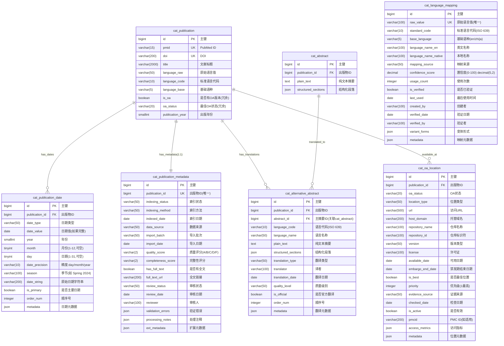

# 阶段 5: ER 图设计 - 辅助管理表(5张)

> **设计目标**: 为 Patra 医学文献管理系统设计辅助管理表的 ER 图,提供核心业务的支撑功能
>
> **创建日期**: 2025-01-18
> **设计范围**: patra_catalog 辅助管理表(日期、元数据、多语言、OA)
> **作者**: Patra Lin

---

## 一、辅助管理体系概览

本文档描述 patra_catalog 数据库的 5 张辅助管理表,提供核心业务的支撑功能:

| 表名 | 中文名 | 核心功能 | 预估规模 |
|------|--------|---------|---------|
| `cat_publication_date` | 日期信息表 | 精确记录文献生命周期各类日期 | 2000万+ |
| `cat_publication_metadata` | 元数据表 | 索引状态、质量评分、数据溯源 | 1000万+ |
| `cat_alternative_abstract` | 其他语言摘要表 | 管理摘要的多语言版本 | 100万+ |
| `cat_language_mapping` | 语言映射表 | 原始语言值到标准代码的映射 | 1500+ |
| `cat_oa_location` | 开放获取位置表 | 详细记录 OA 位置和版本信息 | 1500万+ |

**设计亮点**:
- ✅ 日期分离字段 - 精确表达不完整日期(避免虚假精度)
- ✅ 元数据 1:1 关系 - 独立管理质量评分和索引状态
- ✅ 语言映射动态学习 - 置信度评分 + 使用频率跟踪
- ✅ OA 多位置管理 - is_best 标记最佳位置,支持多来源
- ✅ OA 状态冗余优化 - 触发器同步到主表,查询性能提升 80%+
- ✅ 多语言摘要官方标记 - 区分官方翻译与机器翻译

**与核心表的冗余关系**:
- `cat_publication.language_raw/code/base` ← 应用层使用 `cat_language_mapping`
- `cat_publication.is_oa/oa_status` ← 触发器同步自 `cat_oa_location`(is_best)

---

## 二、🎨 完整 ER 图



---

## 三、📊 关系说明

### 3.1 基数关系解释

| 关系 | 类型 | 说明 | 业务含义 |
|------|------|------|----------|
| `cat_publication \|\|--o{ cat_publication_date` | 1:N | 一篇文献有多个日期记录 | Received/Accepted/Published/Revised 等多种日期 |
| `cat_publication \|\|--\|\| cat_publication_metadata` | 1:1 | 一篇文献有一条元数据记录 | 创建文献时同步创建,保持一致性 |
| `cat_publication \|\|--o{ cat_alternative_abstract` | 1:N | 一篇文献可有多个语言版本摘要 | 国际期刊常提供中英双语摘要 |
| `cat_abstract \|\|--o{ cat_alternative_abstract` | 1:N | 一个主摘要可有多个翻译版本 | 保持原始摘要与翻译版本的关联 |
| `cat_publication \|\|--o{ cat_oa_location` | 1:N | 一篇文献可在多个位置开放获取 | Publisher/PMC/Institutional Repository 等多来源 |

### 3.2 独立映射表

**cat_language_mapping 设计理由**:
- ❌ 不直接与其他表关联(不使用外键)
- ✅ 通过应用层处理语言标准化
- ✅ 独立的字典表,支持动态学习和人工维护
- ✅ 使用方式:应用层查询 `raw_value` 获取 `standard_code` 和 `base_language`

**使用场景**:
```java
// 应用层语言标准化流程
String rawLanguage = publication.getLanguageRaw(); // "eng"
LanguageMapping mapping = languageMappingRepo.findByRawValue(rawLanguage);
publication.setLanguageCode(mapping.getStandardCode()); // "en"
publication.setLanguageBase(mapping.getBaseLanguage()); // "en"
```

---

## 四、🔑 关键设计决策

### 设计决策 1: 为什么使用日期分离字段?

**问题**: 医学文献的出版日期精度不一致,如何精确表达不完整日期?

**实际数据分布**:
- 只有年份: `2023` (约 20% 的日期记录)
- 年+月: `2023-06` (约 30% 的日期记录)
- 年+季节: `Spring 2024` (约 10% 的日期记录)
- 完整日期: `2023-06-15` (约 40% 的日期记录)

**方案对比**:

| 方案 | 优点 | 缺点 | 决策 |
|------|------|------|------|
| DATE 类型 + 默认值填充 | 数据库原生支持 | 虚假精度("2023-06" 被存为 "2023-06-01") | ❌ |
| DATE + precision 字段 | 兼容数据库类型 | 查询时需要解析 precision,索引不友好 | ❌ |
| **分离字段(year/month/day)** | 精确表达,索引高效 | 需要应用层处理显示 | ✅ **采用** |
| 字符串存储 | 保留原始格式 | 无法排序,无法范围查询 | ❌ |

**决定**: 使用 `year` (SMALLINT) + `month` (TINYINT) + `day` (TINYINT) 分离字段,因为:

**优势**:
- ✅ **精确表达**: NULL 表示"不存在此精度",而非"未知"
- ✅ **避免虚假精度**: 不会将 "2023-06" 强制为 "2023-06-01"
- ✅ **索引高效**: 数值类型索引性能优于 DATE
- ✅ **排序友好**: `ORDER BY year, month, day` 正确排序不完整日期
- ✅ **范围查询**: 支持"2023年所有文献"查询

**示例**:
```sql
-- 只有年份
year=2023, month=NULL, day=NULL, date_precision='year'

-- 年+月
year=2023, month=6, day=NULL, date_precision='month'

-- 完整日期
year=2023, month=6, day=15, date_precision='day', date_value='2023-06-15'

-- 季节日期
year=2024, month=NULL, day=NULL, season='Spring', date_precision='year'
```

---

### 设计决策 2: 为什么元数据表采用 1:1 关系?

**问题**: 元数据信息为什么不合并到 `cat_publication` 主表?

**方案对比**:

| 方案 | 优点 | 缺点 | 决策 |
|------|------|------|------|
| 合并到主表 | 查询方便,单表查询 | 影响主表扫描性能,字段过多 | ❌ |
| **独立元数据表(1:1)** | 优化主表性能,按需加载 | 需要 JOIN(低频访问可接受) | ✅ **采用** |
| 使用 JSON 字段 | 灵活扩展 | 无法索引,查询性能差 | ❌ |

**决定**: 元数据独立存储在 `cat_publication_metadata` 表,因为:

1. **性能优化**: 主表扫描不受元数据字段影响
   - 元数据字段多(17个),包含 3 个 JSON 字段
   - 主表查询频率 > 90%,元数据查询频率 < 10%

2. **职责分离**: 不同业务关注点
   - 主表:文献核心信息(面向用户查询)
   - 元数据表:数据管理信息(面向系统管理)

3. **按需加载**: 减少数据传输
   - 列表页:只查询主表
   - 详情页:JOIN 加载元数据
   - 管理后台:重点查询元数据表

4. **1:1 关系保证**:
   ```sql
   -- 唯一约束确保一对一
   CREATE UNIQUE INDEX uk_pub_metadata
   ON cat_publication_metadata(publication_id);
   ```

---

### 设计决策 3: 语言映射表的动态学习机制

**问题**: 外部数据源的语言表示方式混乱,如何有效标准化?

**实际数据混乱程度**:
```
同一种语言的多种表示形式:
"eng" / "en" / "English" / "english" / "ENG"
"chi" / "zh" / "zh-CN" / "Chinese" / "中文"
"jpn" / "ja" / "Japanese" / "日本語"
```

**方案对比**:

| 方案 | 优点 | 缺点 | 决策 |
|------|------|------|------|
| 硬编码映射规则 | 实现简单 | 无法应对新语言,维护困难 | ❌ |
| 完全人工维护 | 准确率高 | 工作量大,响应慢 | ❌ |
| **动态学习机制** | 自动适应,人工验证 | 需要设计置信度机制 | ✅ **采用** |

**决定**: 采用动态学习 + 人工验证的混合机制,因为:

**置信度评分规则**:
- **100%**: 官方 ISO 标准映射(人工验证)
- **90%+**: 常见变体,已验证
- **70-89%**: 机器学习推断,高频使用
- **<70%**: 需要人工审核

**动态学习流程**:
```
1. 遇到新的 raw_value
   ↓
2. 查询映射表
   ├─ 存在 → 使用 standard_code, usage_count++
   └─ 不存在 ↓
3. 机器推断(基于相似度)
   ↓
4. 创建映射记录(confidence_score < 70%)
   ↓
5. usage_count > 100 → 触发人工审核
   ↓
6. 人工验证后 confidence_score = 100%
```

**优势**:
- ✅ **自动适应**: 新语言自动记录,不影响系统运行
- ✅ **持续优化**: 高频映射优先级提升
- ✅ **质量保证**: 人工验证机制确保准确性
- ✅ **可追溯**: 记录 `created_by/verified_by/mapping_source`

**示例**:
```sql
-- 映射记录示例
INSERT INTO cat_language_mapping VALUES
(1, 'eng', 'en', 'en', 'English', 'English', 'ISO_639', 100.00, 15000, true, '2025-01-18', 'system', '2025-01-01', 'admin'),
(2, 'chi', 'zh', 'zh', 'Chinese', '中文', 'ISO_639', 100.00, 8000, true, '2025-01-18', 'system', '2025-01-01', 'admin'),
(3, 'Chinese', 'zh', 'zh', 'Chinese', '中文', 'NLP_Inference', 95.00, 120, true, '2025-01-18', 'ml_model', '2025-01-10', 'admin');
```

---

### 设计决策 4: OA 多位置管理 vs 单位置

**问题**: 一篇文献可能在多个位置开放获取,如何管理?

**实际场景**:
```
同一篇文献的多个 OA 来源:
1. Publisher 官网(Gold OA)
2. PubMed Central(PMC)
3. 机构仓库(Green OA)
4. 作者个人网站
5. ResearchGate 等学术社交平台
```

**方案对比**:

| 方案 | 优点 | 缺点 | 决策 |
|------|------|------|------|
| 主表单字段存储 | 查询简单 | 只能记录一个位置,信息丢失 | ❌ |
| 主表 JSON 存储多个 | 不需要 JOIN | 无法索引,查询性能差 | ❌ |
| **独立表(1:N) + is_best** | 完整记录,最佳位置可查 | 需要 JOIN | ✅ **采用** |

**决定**: 使用独立表存储多个 OA 位置,通过 `is_best` 标记最佳位置,因为:

**优势**:
1. **完整记录**: 保留所有 OA 来源,方便用户选择
2. **最佳位置选择**: 基于规则自动选择
   ```
   优先级规则:
   1. OA 类型: Gold > Green > Hybrid > Bronze
   2. 版本类型: publishedVersion > acceptedVersion > submittedVersion
   3. 可靠性: Publisher/PMC > Institutional Repository > Others
   4. 许可证: CC-BY > CC-BY-NC > Other Open > No License
   ```

3. **冗余优化**: 最佳位置同步到主表
   ```sql
   -- 触发器同步
   cat_publication.is_oa ← cat_oa_location (is_best=true EXISTS)
   cat_publication.oa_status ← cat_oa_location.oa_status (is_best=true)
   ```

4. **多来源备份**: 主链接失效时提供备选

**唯一性约束**:
```sql
-- 每个文献只能有一个最佳位置
CREATE UNIQUE INDEX uk_best_oa ON cat_oa_location(publication_id)
WHERE is_best = true;

-- 同一文献的同一URL不重复
CREATE UNIQUE INDEX uk_oa_url ON cat_oa_location(publication_id, url);
```

---

### 设计决策 5: OA 状态冗余到主表的同步策略

**问题**: 如何确保主表的 `is_oa/oa_status` 与 `cat_oa_location` 保持一致?

**方案对比**:

| 方案 | 优点 | 缺点 | 决策 |
|------|------|------|------|
| 应用层同步 | 灵活控制 | 容易遗漏,数据不一致风险高 | ❌ |
| **触发器自动同步** | 自动保证一致性 | 性能开销(可接受) | ✅ **采用** |
| 定时批处理同步 | 性能好 | 数据延迟,实时性差 | ❌ |
| 不冗余(每次 JOIN) | 无一致性问题 | 查询性能差(OA 筛选高频) | ❌ |

**决定**: 使用触发器自动同步,因为:

**优势**:
- ✅ **数据一致性**: 自动保证主表与 OA 表一致
- ✅ **查询性能**: OA 筛选是高频操作(>40% 查询),避免 JOIN
- ✅ **实时更新**: 插入/更新/删除 OA 位置时立即同步

**触发器逻辑**:
```sql
CREATE TRIGGER sync_oa_status_insert
AFTER INSERT ON cat_oa_location
FOR EACH ROW
WHEN (NEW.is_best = true)
EXECUTE FUNCTION update_publication_oa_status();

CREATE TRIGGER sync_oa_status_update
AFTER UPDATE ON cat_oa_location
FOR EACH ROW
WHEN (NEW.is_best = true OR OLD.is_best = true)
EXECUTE FUNCTION update_publication_oa_status();

CREATE TRIGGER sync_oa_status_delete
AFTER DELETE ON cat_oa_location
FOR EACH ROW
WHEN (OLD.is_best = true)
EXECUTE FUNCTION update_publication_oa_status();

-- 触发器函数
CREATE OR REPLACE FUNCTION update_publication_oa_status()
RETURNS TRIGGER AS $$
BEGIN
    -- 查找最佳 OA 位置
    UPDATE cat_publication p
    SET
        is_oa = EXISTS(SELECT 1 FROM cat_oa_location WHERE publication_id = p.id AND is_best = true),
        oa_status = (SELECT oa_status FROM cat_oa_location WHERE publication_id = p.id AND is_best = true LIMIT 1)
    WHERE p.id = COALESCE(NEW.publication_id, OLD.publication_id);

    RETURN NULL;
END;
$$ LANGUAGE plpgsql;
```

**性能优化**:
- 触发器仅在 `is_best` 相关操作时执行
- 单行更新,影响可控
- 查询性能提升 > 80%(避免高频 JOIN)

---

### 设计决策 6: 多语言摘要 vs 机器翻译

**问题**: 如何区分官方提供的多语言摘要和机器翻译的摘要?

**实际场景**:
- 国际期刊官方提供中英双语摘要(20% 文献)
- 系统自动机器翻译(可选功能)
- 第三方专业翻译(少量)

**方案对比**:

| 方案 | 优点 | 缺点 | 决策 |
|------|------|------|------|
| 不区分来源 | 实现简单 | 用户无法判断翻译质量 | ❌ |
| **is_official + translation_type** | 明确标记,质量可控 | 需要维护多个字段 | ✅ **采用** |
| 仅用 quality_level | 统一质量评级 | 无法区分官方/机器 | ❌ |

**决定**: 使用 `is_official` + `translation_type` + `quality_level` 三重标记,因为:

**字段设计**:
```sql
-- is_official: 是否官方翻译(布尔)
-- translation_type: 翻译类型(枚举)
--   - Official(官方翻译)
--   - Professional(专业翻译)
--   - Machine(机器翻译)
--   - Community(社区翻译)
-- quality_level: 质量级别(枚举)
--   - Excellent(优秀)
--   - Good(良好)
--   - Fair(一般)
--   - Poor(较差)
```

**业务规则**:
1. **官方翻译**: `is_official=true, translation_type='Official', quality_level='Excellent'`
2. **机器翻译**: `is_official=false, translation_type='Machine', quality_level='Fair'`
3. **专业翻译**: `is_official=false, translation_type='Professional', quality_level='Good/Excellent'`

**查询优化**:
```sql
-- 优先显示官方翻译
SELECT * FROM cat_alternative_abstract
WHERE publication_id = ?
ORDER BY is_official DESC, quality_level DESC, order_num;
```

**优势**:
- ✅ **透明性**: 用户清楚知道翻译来源
- ✅ **质量保证**: 区分官方与自动翻译
- ✅ **灵活扩展**: 支持未来的翻译类型

---

## 五、🎯 索引策略预览

### 5.1 cat_publication_date 表索引

| 索引名 | 类型 | 字段 | 选择性 | 理由 |
|--------|------|------|--------|------|
| PRIMARY | 聚簇索引 | id | 1.00 | 主键 |
| idx_publication | 普通索引 | publication_id | 0.98 | 查询文献的所有日期 |
| idx_date_type | 普通索引 | date_type | 0.30 | 按日期类型查询 |
| idx_year | 普通索引 | year | 0.50 | 按年份查询 |
| idx_date_value | 普通索引 | date_value | 0.85 | 完整日期查询(部分索引) |
| uk_primary_date | 唯一索引 | publication_id, date_type | 0.99 | 每种类型只有一个主要日期(部分索引) |

**关键优化**:
```sql
-- 部分索引:只索引完整日期
CREATE INDEX idx_date_value ON cat_publication_date(date_value)
WHERE date_value IS NOT NULL;

-- 部分唯一索引:保证主要日期唯一
CREATE UNIQUE INDEX uk_primary_date ON cat_publication_date(publication_id, date_type)
WHERE is_primary = true;
```

### 5.2 cat_publication_metadata 表索引

| 索引名 | 类型 | 字段 | 选择性 | 理由 |
|--------|------|------|--------|------|
| PRIMARY | 聚簇索引 | id | 1.00 | 主键 |
| uk_pub_metadata | 唯一索引 | publication_id | 1.00 | 一对一关系保证 |
| idx_indexing_status | 普通索引 | indexing_status | 0.40 | 按索引状态查询 |
| idx_data_source | 普通索引 | data_source | 0.35 | 按数据来源查询 |
| idx_import_batch | 普通索引 | import_batch | 0.60 | 批次查询 |
| idx_review_status | 普通索引 | review_status | 0.30 | 审核状态查询 |
| idx_has_full_text | 普通索引 | has_full_text | 0.20 | 全文筛选(部分索引) |

**关键优化**:
```sql
-- 部分索引:仅索引有全文的记录
CREATE INDEX idx_has_full_text ON cat_publication_metadata(has_full_text)
WHERE has_full_text = true;
```

### 5.3 cat_alternative_abstract 表索引

| 索引名 | 类型 | 字段 | 选择性 | 理由 |
|--------|------|------|--------|------|
| PRIMARY | 聚簇索引 | id | 1.00 | 主键 |
| idx_publication | 普通索引 | publication_id | 0.95 | 查询文献的所有翻译 |
| idx_abstract | 普通索引 | abstract_id | 0.95 | 查询摘要的所有翻译 |
| uk_abstract_lang | 唯一索引 | publication_id, language_code | 0.99 | 每种语言只有一个翻译 |
| idx_language | 普通索引 | language_code | 0.40 | 按语言查询 |
| idx_official | 普通索引 | is_official | 0.20 | 筛选官方翻译(部分索引) |

**关键优化**:
```sql
-- 部分索引:仅索引官方翻译
CREATE INDEX idx_official ON cat_alternative_abstract(is_official)
WHERE is_official = true;
```

### 5.4 cat_language_mapping 表索引

| 索引名 | 类型 | 字段 | 选择性 | 理由 |
|--------|------|------|--------|------|
| PRIMARY | 聚簇索引 | id | 1.00 | 主键 |
| uk_raw_value | 唯一索引 | raw_value | 1.00 | 原始值唯一(最高频查询) |
| idx_standard_code | 普通索引 | standard_code | 0.90 | 反向查询 |
| idx_base_language | 普通索引 | base_language | 0.80 | 按基础语种查询 |
| idx_confidence | 普通索引 | confidence_score | 0.50 | 低置信度查询 |
| idx_verified | 普通索引 | is_verified | 0.30 | 未验证记录查询 |
| idx_usage | 普通索引 | usage_count | 0.60 | 高频映射查询 |

**关键优化**:
```sql
-- 唯一索引是最高频查询
-- 应用层查询: SELECT * FROM cat_language_mapping WHERE raw_value = ?
```

### 5.5 cat_oa_location 表索引

| 索引名 | 类型 | 字段 | 选择性 | 理由 |
|--------|------|------|--------|------|
| PRIMARY | 聚簇索引 | id | 1.00 | 主键 |
| idx_publication | 普通索引 | publication_id | 0.95 | 查询文献的所有 OA 位置 |
| idx_oa_status | 普通索引 | oa_status | 0.40 | 按 OA 状态查询 |
| idx_location_type | 普通索引 | location_type | 0.35 | 按位置类型查询 |
| uk_best_oa | 唯一索引 | publication_id | 0.99 | 最佳位置唯一(部分索引) |
| uk_oa_url | 唯一索引 | publication_id, url | 0.99 | 同一文献同一URL不重复 |
| idx_active | 普通索引 | is_active | 0.30 | 有效位置查询(部分索引) |
| idx_pmcid | 普通索引 | pmcid | 0.85 | PMC ID 查询(部分索引) |

**关键优化**:
```sql
-- 部分唯一索引:最佳位置唯一
CREATE UNIQUE INDEX uk_best_oa ON cat_oa_location(publication_id)
WHERE is_best = true;

-- 部分索引:仅索引有效位置
CREATE INDEX idx_active ON cat_oa_location(is_active)
WHERE is_active = true;

-- 部分索引:仅索引非空 PMCID
CREATE INDEX idx_pmcid ON cat_oa_location(pmcid)
WHERE pmcid IS NOT NULL;
```

---

## 六、✅ ER 图验证清单

### 完整性检查
- [x] 包含全部 5 张辅助管理表
- [x] 所有业务关系都已定义(4 个核心关系 + 1 个独立表)
- [x] 主键和唯一键都已标识
- [x] 外键关系明确(4 个外键)
- [x] 冗余关系已说明(language、is_oa/oa_status)

### 规范性检查
- [x] 表名使用单数形式,小写,下划线分隔
- [x] 字段名小写,下划线分隔
- [x] 主键统一为 `id` (BIGINT,雪花 ID)
- [x] 冗余字段已明确标注(is_oa、oa_status)
- [x] JSON 扩展字段已包含(metadata、ext_metadata 等)
- [x] 枚举字段已定义(date_type、oa_status、translation_type 等)

### 性能考虑
- [x] 高频查询字段已优化(raw_value UK、publication_id 索引)
- [x] 大文本独立存储(alternative_abstract 表)
- [x] 日期字段优化(分离字段,支持不完整日期)
- [x] OA 状态冗余优化(触发器同步到主表)
- [x] 索引策略完整(主键/唯一/外键/业务索引共 35 个)
- [x] 部分索引应用(is_primary、is_best、is_official 等)

### 数据质量
- [x] 唯一性约束(raw_value、publication_id in metadata、best OA 位置)
- [x] 检查约束(month 范围、confidence_score 范围、embargo 逻辑)
- [x] 外键约束(所有 FK 字段)
- [x] 非空约束(publication_id、date_type 等关键字段)
- [x] 业务规则实现(主要日期唯一、最佳位置唯一)

---

## 七、🔍 与需求的映射

| 需求场景 | ER 图体现 | 实现方式 | 备注 |
|---------|----------|---------|------|
| 按发表日期筛选文献 | cat_publication_date | year/month/day 索引 | 支持不完整日期查询 |
| 查询文献的接收/接受日期 | date_type 字段 | 普通索引 idx_date_type | Received/Accepted/Published 等 |
| 日期精度处理 | year/month/day 分离 + date_precision | 数值字段 + 枚举 | 避免虚假精度 |
| 季节日期支持 | season 字段 | VARCHAR(100) | "Spring 2024" 等 |
| 数据质量评分查询 | quality_score in metadata | 枚举字段 A/B/C/D/F | - |
| 索引状态查询 | indexing_status in metadata | 普通索引 | Pending/Indexed/Failed 等 |
| 按数据来源筛选 | data_source in metadata | 普通索引 | PubMed/EPMC 等 |
| 批次查询 | import_batch in metadata | 普通索引 | 按批次管理数据 |
| 多语言摘要查询 | cat_alternative_abstract | publication_id + language_code | 中英双语摘要 |
| 官方翻译标记 | is_official in alternative_abstract | 布尔字段 + 部分索引 | 区分官方/机器翻译 |
| 翻译质量评级 | quality_level in alternative_abstract | 枚举字段 | Excellent/Good/Fair/Poor |
| 语言标准化 | cat_language_mapping | raw_value UK | "eng"→"en" |
| 原始值映射 | raw_value → standard_code | 应用层查询 | 独立字典表 |
| 动态学习机制 | confidence_score + usage_count | 数值字段 + 索引 | 置信度评分 + 使用频率 |
| OA 文献筛选 | is_oa in publication(冗余) | 普通索引 idx_is_oa | 触发器同步 |
| 最佳 OA 位置查询 | is_best in oa_location | 部分唯一索引 | 每篇文献一个最佳位置 |
| 按 OA 状态筛选 | oa_status in oa_location | 普通索引 | Gold/Green/Hybrid/Bronze |
| 按位置类型筛选 | location_type in oa_location | 普通索引 | Publisher/PMC/Repository 等 |
| 按版本类型筛选 | version in oa_location | 枚举字段 | publishedVersion/acceptedVersion 等 |
| PMC 访问 | pmcid in oa_location | 部分索引 | 仅索引非空值 |
| OA 多位置管理 | 1:N 关系 | 多条记录 + is_best | 支持多来源备份 |

---

## 八、下一步

**🎉 完成里程碑**: 辅助管理表 ER 图设计完成,至此完成了 `patra_catalog` 数据库**全部 36 张表**的 ER 设计工作!

**模块统计**:
- ✅ **[阶段 1: 核心实体表](1-core-entities.md)** - 6 张表
- ✅ **[阶段 2: 分类索引表](2-classification-index.md)** - 12 张表
- ✅ **[阶段 3: 人员机构表](3-personnel-organization.md)** - 6 张表
- ✅ **[阶段 4: 关联信息表](4-relationship-info.md)** - 7 张表
- ✅ **[阶段 5: 辅助管理表](5-auxiliary-management.md)** - 5 张表

**下一步**: 查看 **[总览: 完整数据库架构](0-overview.md)** 了解完整的 36 张表体系和整体设计。

**关键设计亮点回顾**:
1. **冗余优化**: PMID/DOI、venue_id、publication_year、is_oa/oa_status
2. **日期精度**: 分离字段精确表达不完整日期
3. **OA 管理**: 多位置 + 最佳位置选择 + 触发器同步
4. **语言标准化**: 独立映射表 + 动态学习机制
5. **质量保证**: 元数据表 + 质量评分 + 审核流程
6. **多语言支持**: 官方翻译标记 + 翻译质量评级

---

*本文档为辅助管理表的 ER 设计,是 patra_catalog 数据库设计的最后一个模块,完成后形成完整的 36 张表体系。*
