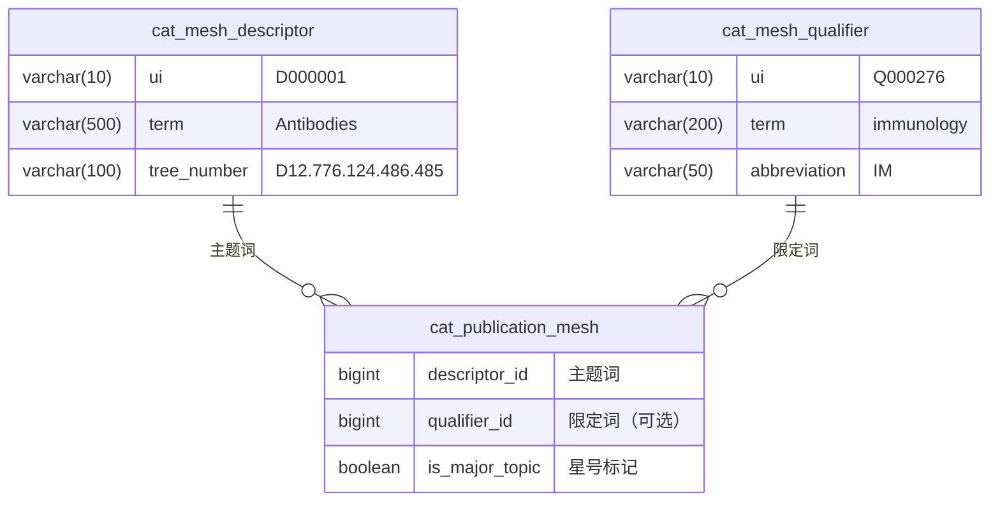

# ER 图设计 - 分类与索引表（8张）

> 文档版本：v1.0
> 创建日期：2025-01-18
> 设计范围：patra_catalog 分类与索引体系
> 作者：Patra Lin

## 一、分类索引体系概览

医学文献的分类索引体系包含多个维度：
- **MeSH 标引**：医学主题词表（Medical Subject Headings），NLM 标准
- **关键词**：作者/编辑提供的自由关键词
- **出版类型**：文献类型分类（期刊文章、综述、临床试验等）
- **物质索引**：化学物质、药物、生物制品等

## 二、ER 图设计

### 2.1 完整 ER 图

```mermaid
erDiagram
    %% 引用核心表（简化展示）
    cat_publication {
        bigint id PK
        varchar title
        "其他字段..."
    }

    %% MeSH 相关表
    cat_mesh_descriptor {
        bigint id PK "主键"
        varchar(10) ui UK "MeSH唯一标识符 D000001"
        varchar(255) name "主题词名称（首选术语）"
        varchar(50) descriptor_class "类型：1-4"
        text scope_note "范围说明"
        text annotation "注释"
        text previous_indexing "之前索引"
        text public_mesh_note "公共MeSH注释"
        text consider_also "另请参考"
        varchar(10) date_created "创建日期 YYYYMMDD"
        varchar(10) date_revised "修订日期 YYYYMMDD"
        varchar(10) date_established "确立日期 YYYYMMDD"
        boolean active_status "是否有效 1/0"
        varchar(10) mesh_version "MeSH版本年份"
        json metadata "其他元数据"
    }

    cat_mesh_qualifier {
        bigint id PK "主键"
        varchar(10) ui UK "限定词唯一标识符 Q000001"
        varchar(100) name "限定词名称"
        varchar(10) abbreviation "缩写 如 DI"
        text annotation "注释"
        varchar(10) date_created "创建日期"
        varchar(10) date_revised "修订日期"
        varchar(10) date_established "确立日期"
        boolean active_status "是否有效"
        varchar(10) mesh_version "MeSH版本年份"
    }

    cat_mesh_tree_number {
        bigint id PK "主键"
        bigint descriptor_id FK "主题词ID"
        varchar(50) tree_number "树形编号 如 C04.557.337.428"
        integer tree_level "层级深度"
        boolean is_primary "是否主要位置"
    }

    cat_mesh_entry_term {
        bigint id PK "主键"
        bigint descriptor_id FK "主题词ID"
        varchar(255) term "入口术语/同义词"
        varchar(10) lexical_tag "词法标记 NON/PEF/LAB/ABB"
        boolean is_print_flag "是否打印 Y/N"
        varchar(10) record_preferred "记录首选 Y/N"
        boolean is_permuted_term "是否排列术语"
    }

    cat_mesh_concept {
        bigint id PK "主键"
        bigint descriptor_id FK "主题词ID"
        varchar(10) concept_ui UK "概念UI M000001"
        varchar(255) concept_name "概念名称"
        boolean is_preferred "是否首选概念"
        varchar(255) casn1_name "CAS类型1名称"
        varchar(50) registry_number "注册号"
        text scope_note "范围说明"
        varchar(10) concept_status "概念状态"
    }

    cat_publication_mesh {
        bigint id PK "主键"
        bigint publication_id FK "出版物ID"
        bigint descriptor_id FK "主题词ID"
        bigint qualifier_id FK "限定词ID（可空）"
        boolean is_major_topic "是否主要主题"
        integer order_num "顺序号"
        varchar(50) indexing_method "标引方法"
    }

    %% 关键词相关表
    cat_keyword {
        bigint id PK "主键"
        varchar(500) term "关键词"
        varchar(50) source "来源：author/editor/indexer"
        varchar(10) language "语言"
        varchar(255) normalized_term "规范化词形"
        integer frequency "出现频次"
        json metadata "元数据"
    }

    cat_publication_keyword {
        bigint id PK "主键"
        bigint publication_id FK "出版物ID"
        bigint keyword_id FK "关键词ID"
        boolean is_major "是否主要关键词"
        integer order_num "顺序号"
        varchar(50) keyword_set "关键词集"
    }

    %% 出版类型相关表
    cat_publication_type {
        bigint id PK "主键"
        varchar(100) type_code UK "类型代码"
        varchar(200) type_name "类型名称"
        varchar(500) description "描述"
        varchar(50) vocabulary_source "词表来源"
        varchar(100) parent_type "父类型"
        boolean is_active "是否有效"
        json metadata "元数据"
    }

    cat_publication_type_mapping {
        bigint id PK "主键"
        bigint publication_id FK "出版物ID"
        bigint type_id FK "类型ID"
        integer order_num "顺序号"
    }

    %% 物质相关表
    cat_substance {
        bigint id PK "主键"
        varchar(100) registry_number UK "注册号（CAS号等）"
        varchar(500) name "物质名称"
        varchar(100) vocabulary_id "词表ID"
        varchar(50) vocabulary_source "词表来源"
        varchar(50) substance_class "物质分类"
        varchar(200) molecular_formula "分子式"
        json synonyms "同义词"
        json metadata "元数据"
    }

    cat_publication_substance {
        bigint id PK "主键"
        bigint publication_id FK "出版物ID"
        bigint substance_id FK "物质ID"
        boolean is_major "是否主要物质"
        varchar(100) role "物质角色"
    }

    %% MeSH 内部关系
    cat_mesh_descriptor ||--o{ cat_mesh_tree_number : "has_positions"
    cat_mesh_descriptor ||--o{ cat_mesh_entry_term : "has_synonyms"
    cat_mesh_descriptor ||--o{ cat_mesh_concept : "has_concepts"

    %% 文献标引关系
    cat_publication ||--o{ cat_publication_mesh : "has_mesh"
    cat_mesh_descriptor ||--o{ cat_publication_mesh : "used_in"
    cat_mesh_qualifier ||--o{ cat_publication_mesh : "qualifies"

    cat_publication ||--o{ cat_publication_keyword : "has_keywords"
    cat_keyword ||--o{ cat_publication_keyword : "used_in"

    cat_publication ||--o{ cat_publication_type_mapping : "has_types"
    cat_publication_type ||--o{ cat_publication_type_mapping : "classifies"

    cat_publication ||--o{ cat_publication_substance : "mentions"
    cat_substance ||--o{ cat_publication_substance : "referenced_in"
```



### 2.2 MeSH 标引子系统



**MeSH 标引示例**：
- "Antibodies/immunology*" = 抗体（免疫学方面，主要主题）
- "COVID-19/drug therapy" = COVID-19（药物治疗方面）

## 三、设计要点

### 3.1 MeSH 体系设计

#### 主题词-限定词组合
- **独立存储**：主题词和限定词分别存储，支持灵活组合
- **可选限定**：一个主题词可以没有限定词，也可以有多个
- **主要主题标记**：`is_major_topic` 对应 MeSH 的星号（*）标记

#### 树形结构支持
- `tree_number` 字段存储 MeSH 树形编号
- 支持层次查询和父子关系导航
- 例如：D12.776.124.486.485 表示在树形结构中的位置

### 3.2 关键词管理

#### 多来源支持
```sql
source 枚举值：
- 'author'   -- 作者提供
- 'editor'   -- 编辑添加
- 'indexer'  -- 索引员标注
- 'publisher' -- 出版商提供
```

#### 规范化处理
- `normalized_term`：存储规范化后的词形（小写、去除标点等）
- 支持同义词合并和频次统计
- 便于关键词去重和聚类分析

### 3.3 出版类型层次

#### 类型层次结构
```
Journal Article
├── Clinical Trial
│   ├── Randomized Controlled Trial
│   └── Controlled Clinical Trial
├── Review
│   ├── Systematic Review
│   └── Meta-Analysis
└── Case Reports
```

- `parent_type` 支持类型层次
- 多类型标注（一篇文献可以同时是多种类型）

### 3.4 物质索引设计

#### 注册号体系
- CAS 注册号：化学物质的唯一标识
- "0" 表示非特定物质或物质类
- 支持多种注册体系（CAS、EC、UNII等）

#### 物质分类
```sql
substance_class 示例：
- 'chemical'     -- 化学物质
- 'drug'         -- 药物
- 'biological'   -- 生物制品
- 'enzyme'       -- 酶
- 'antibody'     -- 抗体
```

## 四、关联表设计原则

### 4.1 多对多关系处理

所有分类索引都通过关联表实现多对多关系：
- `cat_publication_mesh`：文献 ↔ MeSH
- `cat_publication_keyword`：文献 ↔ 关键词
- `cat_publication_type_mapping`：文献 ↔ 类型
- `cat_publication_substance`：文献 ↔ 物质（新增）

### 4.2 顺序保留

- `order_num` 字段保留原始顺序
- 重要性递减排序（第一个通常最重要）

### 4.3 标记字段

- `is_major_topic`/`is_major`：标记主要概念
- 对应原始数据中的重要性标记

## 五、索引策略（预设计）

```sql
-- MeSH 索引
CREATE UNIQUE INDEX uk_mesh_ui ON cat_mesh_descriptor(ui);
CREATE INDEX idx_mesh_term ON cat_mesh_descriptor(term);
CREATE INDEX idx_pub_mesh ON cat_publication_mesh(publication_id, descriptor_id);

-- 关键词索引
CREATE INDEX idx_keyword_term ON cat_keyword(normalized_term);
CREATE INDEX idx_keyword_freq ON cat_keyword(frequency DESC);
CREATE INDEX idx_pub_keyword ON cat_publication_keyword(publication_id);

-- 类型索引
CREATE UNIQUE INDEX uk_type_code ON cat_publication_type(type_code);
CREATE INDEX idx_pub_type ON cat_publication_type_mapping(publication_id);

-- 物质索引
CREATE UNIQUE INDEX uk_registry ON cat_substance(registry_number);
CREATE INDEX idx_substance_name ON cat_substance(name);
CREATE INDEX idx_pub_substance ON cat_publication_substance(publication_id);
```

## 六、数据规模与性能考虑

### 6.1 数据量预估

| 表名 | 预估记录数 | 说明 |
|------|-----------|------|
| cat_mesh_descriptor | 3万 | NLM MeSH 词表规模 |
| cat_mesh_qualifier | 100 | 限定词数量固定 |
| cat_publication_mesh | 2000万 | 每篇10个MeSH标引 |
| cat_keyword | 100万 | 去重后的关键词 |
| cat_publication_keyword | 500万 | 每篇2-3个关键词 |
| cat_publication_type | 100 | 类型数量有限 |
| cat_publication_type_mapping | 300万 | 每篇1-2个类型 |
| cat_substance | 5万 | 医学相关物质 |
| cat_publication_substance | 300万 | 部分文献涉及 |

### 6.2 查询优化考虑

1. **高频查询场景**
   - 按 MeSH 主题词检索文献
   - 统计关键词频次
   - 筛选特定类型文献
   - 查找涉及特定物质的研究

2. **批量导入优化**
   - 词表预加载到内存
   - 批量插入关联记录
   - 延迟索引构建

## 七、扩展性设计

### 7.1 PubMed MeSH 数据导入完整方案

#### 数据来源与格式
**NLM FTP 下载地址**：
```
ftp://nlmpubs.nlm.nih.gov/online/mesh/MESH_FILES/xmlmesh/
- desc2025.xml    # 主题词文件（约30,000条）
- qual2025.xml    # 限定词文件（约100条）
- supp2025.xml    # 补充概念文件（约300,000条）
```

#### XML 数据结构映射

**Descriptor（主题词）映射**：
```xml
<DescriptorRecord>
    <DescriptorUI>D000001</DescriptorUI>              → cat_mesh_descriptor.ui
    <DescriptorName>
        <String>Calcimycin</String>                    → cat_mesh_descriptor.name
    </DescriptorName>
    <DescriptorClass>1</DescriptorClass>              → cat_mesh_descriptor.descriptor_class
    <DateCreated>19990101</DateCreated>               → cat_mesh_descriptor.date_created
    <DateRevised>20230707</DateRevised>               → cat_mesh_descriptor.date_revised
    <DateEstablished>19990101</DateEstablished>       → cat_mesh_descriptor.date_established

    <TreeNumberList>
        <TreeNumber>D03.633.100.221.173</TreeNumber>  → cat_mesh_tree_number.tree_number
    </TreeNumberList>

    <ConceptList>
        <Concept PreferredConceptYN="Y">
            <ConceptUI>M0000001</ConceptUI>           → cat_mesh_concept.concept_ui
            <ConceptName>                             → cat_mesh_concept.concept_name
                <String>Calcimycin</String>
            </ConceptName>
            <RegistryNumber>52665-69-7</RegistryNumber> → cat_mesh_concept.registry_number
            <TermList>
                <Term>
                    <String>A-23187</String>           → cat_mesh_entry_term.term
                    <LexicalTag>LAB</LexicalTag>      → cat_mesh_entry_term.lexical_tag
                </Term>
            </TermList>
        </Concept>
    </ConceptList>

    <ScopeNote>An ionophorous...</ScopeNote>          → cat_mesh_descriptor.scope_note
    <PublicMeshNote>91; was A 23187...</PublicMeshNote> → cat_mesh_descriptor.public_mesh_note
</DescriptorRecord>
```

**Qualifier（限定词）映射**：
```xml
<QualifierRecord>
    <QualifierUI>Q000008</QualifierUI>                → cat_mesh_qualifier.ui
    <QualifierName>
        <String>administration & dosage</String>       → cat_mesh_qualifier.name
    </QualifierName>
    <Abbreviation>AD</Abbreviation>                   → cat_mesh_qualifier.abbreviation
    <Annotation>for all routes...</Annotation>        → cat_mesh_qualifier.annotation
</QualifierRecord>
```

#### 导入脚本示例

**Python 导入示例**（使用 xml.etree）：
```python
import xml.etree.ElementTree as ET
import pymysql

def import_mesh_descriptors(xml_file, db_connection):
    tree = ET.parse(xml_file)
    root = tree.getroot()

    cursor = db_connection.cursor()

    for descriptor in root.findall('.//DescriptorRecord'):
        # 主表数据
        ui = descriptor.find('DescriptorUI').text
        name = descriptor.find('.//DescriptorName/String').text
        descriptor_class = descriptor.find('DescriptorClass').text if descriptor.find('DescriptorClass') is not None else '1'

        # 插入主题词
        sql = """INSERT INTO cat_mesh_descriptor
                 (ui, name, descriptor_class, date_created, date_revised,
                  date_established, active_status, mesh_version)
                 VALUES (%s, %s, %s, %s, %s, %s, 1, '2025')
                 ON DUPLICATE KEY UPDATE
                 name = VALUES(name),
                 date_revised = VALUES(date_revised)"""

        cursor.execute(sql, (ui, name, descriptor_class, ...))
        descriptor_id = cursor.lastrowid

        # 处理树形编号
        for tree_num in descriptor.findall('.//TreeNumber'):
            tree_number = tree_num.text
            tree_level = tree_number.count('.') + 1

            sql = """INSERT INTO cat_mesh_tree_number
                     (descriptor_id, tree_number, tree_level, is_primary)
                     VALUES (%s, %s, %s, %s)"""
            cursor.execute(sql, (descriptor_id, tree_number, tree_level, 1))

        # 处理概念和入口术语
        for concept in descriptor.findall('.//Concept'):
            concept_ui = concept.find('ConceptUI').text
            concept_name = concept.find('.//ConceptName/String').text
            is_preferred = concept.get('PreferredConceptYN') == 'Y'

            # 插入概念
            sql = """INSERT INTO cat_mesh_concept
                     (descriptor_id, concept_ui, concept_name, is_preferred)
                     VALUES (%s, %s, %s, %s)"""
            cursor.execute(sql, (descriptor_id, concept_ui, concept_name, is_preferred))

            # 处理入口术语
            for term in concept.findall('.//Term'):
                term_text = term.find('String').text
                lexical_tag = term.find('LexicalTag').text if term.find('LexicalTag') is not None else 'NON'

                sql = """INSERT INTO cat_mesh_entry_term
                         (descriptor_id, term, lexical_tag)
                         VALUES (%s, %s, %s)"""
                cursor.execute(sql, (descriptor_id, term_text, lexical_tag))

    db_connection.commit()
```

**批量导入优化**：
```sql
-- 1. 导入前优化
SET GLOBAL innodb_buffer_pool_size = 2147483648;  -- 2GB
SET foreign_key_checks = 0;
SET unique_checks = 0;
SET autocommit = 0;

-- 2. 使用 LOAD DATA INFILE（预处理为 CSV）
LOAD DATA LOCAL INFILE 'mesh_descriptors.csv'
INTO TABLE cat_mesh_descriptor
FIELDS TERMINATED BY '\t'
LINES TERMINATED BY '\n'
(ui, name, descriptor_class, scope_note, @date_created, @date_revised)
SET
    date_created = STR_TO_DATE(@date_created, '%Y%m%d'),
    date_revised = STR_TO_DATE(@date_revised, '%Y%m%d'),
    mesh_version = '2025',
    active_status = 1;

-- 3. 导入后恢复并构建索引
SET foreign_key_checks = 1;
SET unique_checks = 1;
COMMIT;

ALTER TABLE cat_mesh_descriptor ADD INDEX idx_ui (ui);
ALTER TABLE cat_mesh_tree_number ADD INDEX idx_tree (tree_number);
```

#### 补充概念（Supplementary Concepts）处理

需要额外的表来处理补充概念（如罕见疾病、新药物）：

```sql
CREATE TABLE cat_mesh_supplemental (
    id BIGINT PRIMARY KEY,
    ui VARCHAR(10) UNIQUE,           -- C000001
    name VARCHAR(500),
    mapped_to_descriptor VARCHAR(10), -- 映射到的主题词
    supplemental_class VARCHAR(50),   -- 1=Drug, 2=Disease, 3=Protocol
    date_created VARCHAR(10),
    mesh_version VARCHAR(10),
    INDEX idx_ui (ui),
    INDEX idx_mapped (mapped_to_descriptor)
);
```

#### 更新策略
- **年度全量更新**：每年12月下载新版 MeSH
- **UI 不变原则**：UI 是永久标识符，不会改变
- **增量更新字段**：仅更新 name、scope_note、date_revised
- **新增术语**：插入新的 UI 记录
- **废弃术语**：设置 active_status = 0，保留历史数据

### 7.2 多语言支持
- 关键词的多语言版本
- MeSH 术语的中文翻译
- 物质名称的国际化

### 7.3 自定义分类
- 支持项目特定分类体系
- 用户自定义标签
- 机构内部分类标准

## 八、数据质量保证

### 8.1 完整性约束
- MeSH UI 唯一性
- 类型代码唯一性
- 物质注册号唯一性

### 8.2 引用完整性
- 外键约束确保关联有效
- 级联删除策略配置

### 8.3 数据验证
- MeSH 组合有效性检查
- 关键词规范化规则
- 物质注册号格式验证

## 九、下一步工作

1. **细化字段定义**：确定字段长度和约束
2. **设计存储过程**：批量导入和更新逻辑
3. **全文索引配置**：关键词和术语的全文检索
4. **缓存策略**：高频词表的缓存设计

---

*本文档为分类与索引表的 ER 设计，是 patra_catalog 数据库设计的重要组成部分。*