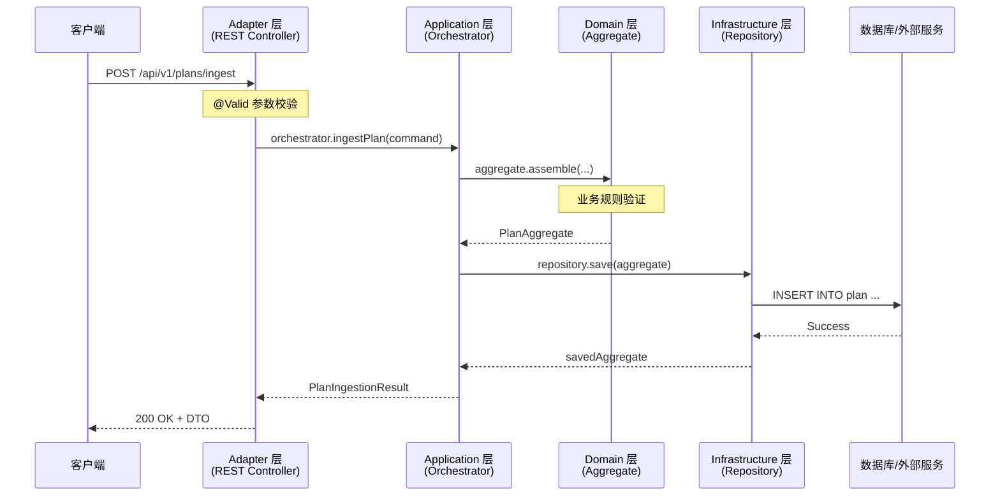
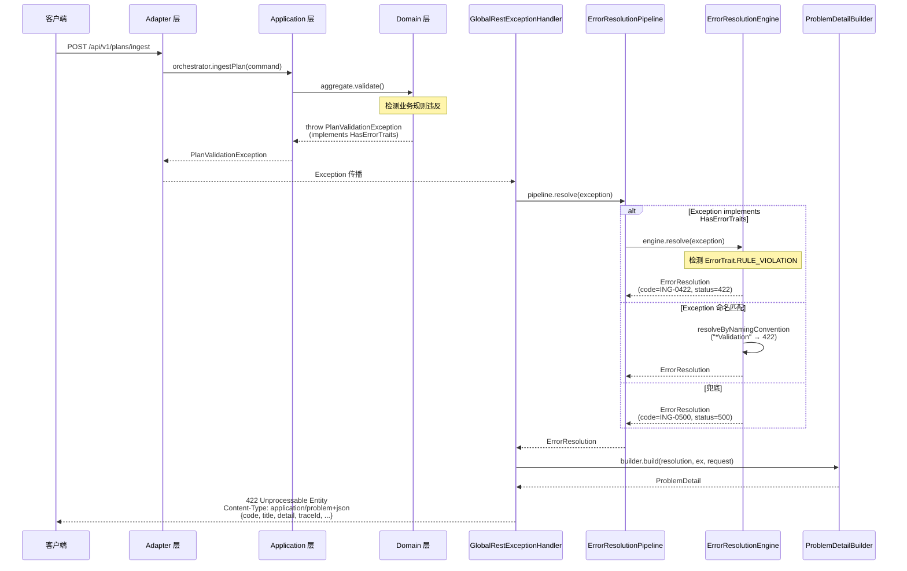
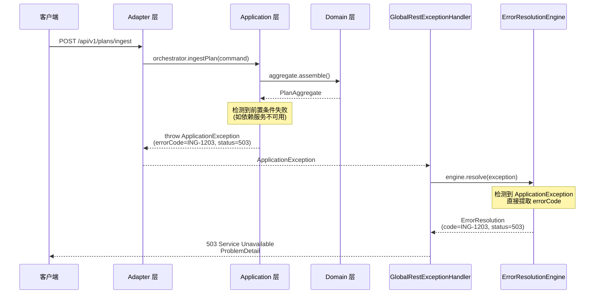
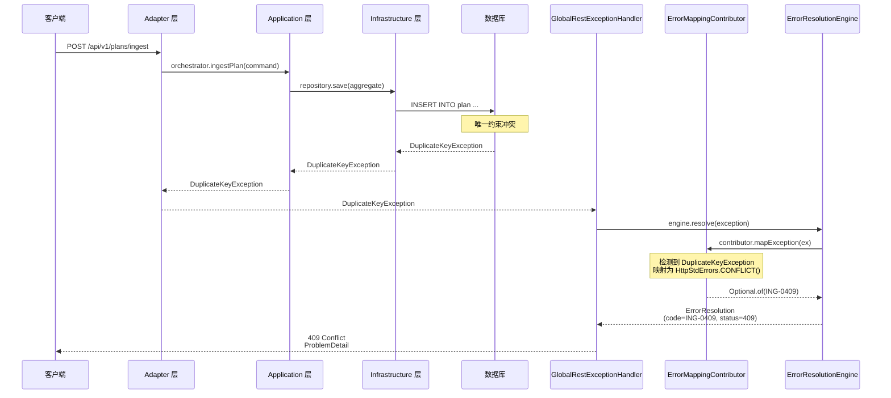
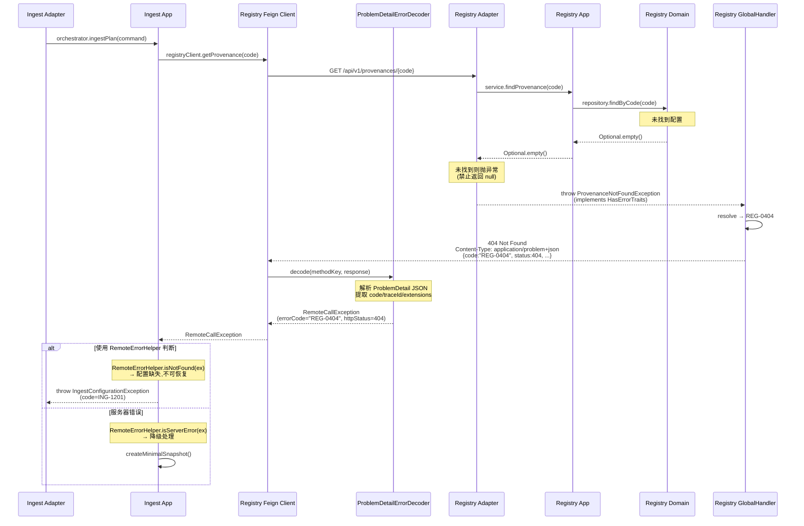
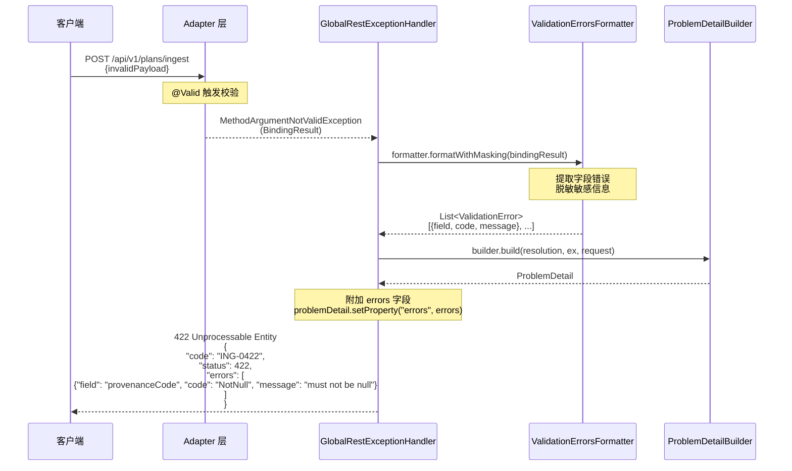

# Papertrace 平台错误处理流程全景图

## 目录
- [1. 概述](#1-概述)
- [2. 错误处理设计原则](#2-错误处理设计原则)
- [3. 异常分层架构](#3-异常分层架构)
- [4. 错误处理流程序列图](#4-错误处理流程序列图)
- [5. 异常分层详解](#5-异常分层详解)
- [6. 错误码体系设计](#6-错误码体系设计)
- [7. ProblemDetail 映射规则](#7-problemdetail-映射规则)
- [8. 跨服务错误处理](#8-跨服务错误处理)
- [9. 监控与故障处理](#9-监控与故障处理)
- [10. 最佳实践](#10-最佳实践)

---

## 1. 概述

Papertrace 平台采用统一的错误处理体系,确保所有微服务输出一致、可观测、可治理的错误响应.本文档详细追踪从异常产生到 HTTP 响应的完整流程.

### 1.1 核心特性

- **统一语义**:所有错误映射到平台错误码(`<上下文前缀>-<HTTP后缀>`),输出 RFC 7807 ProblemDetail 结构
- **分层清晰**:Domain → Application → Infrastructure → Adapter,异常在各层有明确职责
- **跨服务一致**:通过 Feign ErrorDecoder 统一解析远程服务的 ProblemDetail
- **可观测性**:集成 Micrometer,暴露错误解析、Feign 调用等关键指标
- **可扩展性**:通过 SPI(ErrorMappingContributor、ResolutionInterceptor)和拦截器链支持定制

### 1.2 技术栈

| 组件 | 用途 | 模块 |
|------|------|------|
| ErrorResolutionEngine | 异常到错误码解析核心引擎 | patra-spring-boot-starter-core |
| ErrorResolutionPipeline | 拦截器管线(追踪/熔断/指标) | patra-spring-boot-starter-core |
| GlobalRestExceptionHandler | 全局 REST 异常处理器 | patra-spring-boot-starter-web |
| ProblemDetailBuilder | RFC 7807 ProblemDetail 构造器 | patra-spring-boot-starter-web |
| ProblemDetailErrorDecoder | Feign 错误解码器 | patra-spring-cloud-starter-feign |
| RemoteCallException | 远程调用异常封装 | patra-spring-cloud-starter-feign |

---

## 2. 错误处理设计原则

### 2.1 六边形架构合规

- **依赖方向**:异常只能从外层向内层传递,Domain 层异常不依赖任何框架
- **端口隔离**:Infrastructure 层通过 Port 接口暴露能力,异常在 Port 定义中明确
- **适配器转换**:Adapter 层负责将 Domain/Application 异常转换为 HTTP/MQ/RPC 协议的错误表示

### 2.2 DDD 模式遵循

- **聚合不变式**:Domain 异常代表业务规则违反,由聚合方法抛出
- **应用编排**:Application 异常代表用例执行失败,由 Orchestrator 抛出
- **领域事件**:异常产生时发布相应的领域事件(如 `OutboxMessageFailedEvent`)

### 2.3 RFC 7807 标准

所有 HTTP 错误响应必须符合 RFC 7807 ProblemDetail 格式:

```json
{
  "type": "https://api.papertrace.io/errors/ing-1201",
  "title": "ING-1201",
  "status": 404,
  "detail": "Registry config not found: code=PUBMED",
  "code": "ING-1201",
  "path": "/api/v1/plans/ingest",
  "timestamp": "2025-10-08T10:30:45.123Z",
  "traceId": "abc123def456"
}
```

---

## 3. 异常分层架构

### 3.1 架构概览

```
┌─────────────────────────────────────────────────────────────┐
│                      Adapter Layer                          │
│  - REST Controller                                          │
│  - Job Scheduler                                            │
│  - MQ Listener                                              │
│  ↓ 捕获并转换为 HTTP/MQ/RPC 错误格式                          │
├─────────────────────────────────────────────────────────────┤
│                   Application Layer                         │
│  - *Orchestrator                                            │
│  - ApplicationException (携带 ErrorCodeLike)                │
│  ↓ 用例编排失败、跨聚合协调失败                               │
├─────────────────────────────────────────────────────────────┤
│                     Domain Layer                            │
│  - DomainException (纯 Java,无框架依赖)                      │
│  - 业务规则违反、聚合不变式失败                               │
│  ↓ 通过 HasErrorTraits 提供语义特征                          │
├─────────────────────────────────────────────────────────────┤
│                 Infrastructure Layer                        │
│  - MyBatis-Plus DAO 异常                                    │
│  - Feign RemoteCallException                                │
│  - Redis/MQ 依赖失败                                         │
│  ↓ 包装为 Domain 异常或直接上抛                              │
└─────────────────────────────────────────────────────────────┘
```

### 3.2 异常基类继承关系

```
RuntimeException
    │
    ├── DomainException (patra-common)
    │       │
    │       ├── IngestException (patra-ingest-domain)
    │       │       ├── PlanValidationException
    │       │       ├── OutboxPublishException (HasErrorTraits)
    │       │       ├── IngestScheduleParameterException (HasErrorTraits)
    │       │       └── ...
    │       │
    │       └── RegistryException (patra-registry-domain)
    │               ├── RegistryNotFound (HasErrorTraits)
    │               │       └── ProvenanceNotFoundException
    │               └── DomainValidationException
    │
    ├── ApplicationException (patra-common)
    │       └── 携带 ErrorCodeLike,用于应用层编排失败
    │
    └── RemoteCallException (patra-spring-cloud-starter-feign)
            └── 封装 Feign 调用下游服务的错误
```

---

## 4. 错误处理流程序列图

### 4.1 正常业务请求成功流程



### 4.2 领域异常流程(Domain Exception)



### 4.3 应用异常流程(Application Exception)



### 4.4 基础设施异常流程(Infrastructure Exception)



### 4.5 跨服务调用异常流程(Feign → RemoteCallException)



### 4.6 参数校验异常流程(Validation Exception)



---

## 5. 异常分层详解

### 5.1 Domain Layer Exception

#### 5.1.1 基类:DomainException

```java
/**
 * 领域异常基类 - 与框架无关,纯 Java
 * 位置: patra-common/src/main/java/com/patra/common/error/DomainException.java
 */
public abstract class DomainException extends RuntimeException {
    protected DomainException(String message) {
        super(message);
    }

    protected DomainException(String message, Throwable cause) {
        super(message, cause);
    }
}
```

#### 5.1.2 领域语义特征:HasErrorTraits

```java
/**
 * 提供错误语义特征,供解析引擎映射 HTTP 状态
 */
public interface HasErrorTraits {
    Set<ErrorTrait> getErrorTraits();
}

public enum ErrorTrait {
    NOT_FOUND,           // 404
    CONFLICT,            // 409
    RULE_VIOLATION,      // 422
    QUOTA_EXCEEDED,      // 429
    UNAUTHORIZED,        // 401
    FORBIDDEN,           // 403
    TIMEOUT,             // 504
    DEP_UNAVAILABLE      // 503
}
```

#### 5.1.3 示例:ProvenanceNotFoundException

```java
/**
 * Registry 领域:Provenance 未找到异常
 * 位置: patra-registry-domain/src/.../exception/provenance/ProvenanceNotFoundException.java
 */
public class ProvenanceNotFoundException extends RegistryNotFound {
    public ProvenanceNotFoundException(String message) {
        super(message);
    }
}

public abstract class RegistryNotFound extends RegistryException implements HasErrorTraits {
    @Override
    public Set<ErrorTrait> getErrorTraits() {
        return Set.of(ErrorTrait.NOT_FOUND); // → 映射为 REG-0404
    }
}
```

#### 5.1.4 示例:OutboxPublishException

```java
/**
 * Ingest 领域:Outbox 发布失败异常
 * 位置: patra-ingest-domain/src/.../exception/OutboxPublishException.java
 */
public class OutboxPublishException extends OutboxRelayExecutionException implements HasErrorTraits {
    private final Reason reason;

    public enum Reason {
        CHANNEL_NOT_ALLOWED(true),   // 致命错误,不可重试
        HEADERS_INVALID(true),        // 致命错误,不可重试
        SEND_FAILED(false);           // 可重试

        private final boolean fatal;
    }

    @Override
    public Set<ErrorTrait> getErrorTraits() {
        if (reason == Reason.CHANNEL_NOT_ALLOWED || reason == Reason.HEADERS_INVALID) {
            return EnumSet.of(ErrorTrait.RULE_VIOLATION); // → 422
        }
        return EnumSet.of(ErrorTrait.DEP_UNAVAILABLE);     // → 503
    }
}
```

### 5.2 Application Layer Exception

#### 5.2.1 基类:ApplicationException

```java
/**
 * 应用层异常 - 承载业务错误码
 * 位置: patra-common/src/main/java/com/patra/common/error/ApplicationException.java
 */
public class ApplicationException extends RuntimeException {
    private final ErrorCodeLike errorCode;

    public ApplicationException(ErrorCodeLike errorCode, String message) {
        super(message);
        if (errorCode == null) {
            throw new IllegalArgumentException("ErrorCode cannot be null");
        }
        this.errorCode = errorCode;
    }

    public ErrorCodeLike getErrorCode() {
        return errorCode;
    }
}
```

#### 5.2.2 使用场景

- **用例编排失败**:Orchestrator 检测到前置条件不满足
- **跨聚合协调失败**:多个聚合操作无法协调一致
- **外部依赖降级**:调用 Registry 失败后需要降级处理

#### 5.2.3 示例:Ingest 配置异常

```java
// 示例:Ingest Orchestrator 调用 Registry 失败
private ProvenanceConfigSnapshot handleRemoteError(RemoteCallException ex, String code) {
    if (RemoteErrorHelper.isNotFound(ex)) {
        // Registry 配置未注册 → 抛 ApplicationException
        throw new ApplicationException(
            IngestErrorCode.ING_1201,
            String.format("Provenance config not found: code=%s", code),
            ex
        );
    }

    if (RemoteErrorHelper.isServerError(ex)) {
        // Registry 服务不可用 → 抛 ApplicationException
        throw new ApplicationException(
            IngestErrorCode.ING_1203,
            String.format("Registry service unavailable: code=%s", code),
            ex
        );
    }

    // 其他客户端错误
    throw new ApplicationException(
        IngestErrorCode.ING_1202,
        String.format("Invalid registry response: code=%s", code),
        ex
    );
}
```

### 5.3 Infrastructure Layer Exception

#### 5.3.1 数据库异常映射

通过 `ErrorMappingContributor` SPI 将 MyBatis-Plus/JDBC 异常映射为平台错误码:

```java
/**
 * 示例:数据库异常映射 Contributor
 */
@Component
@RequiredArgsConstructor
public class DatabaseErrorMappingContributor implements ErrorMappingContributor {
    private final HttpStdErrors.Group http; // 自动注入(根据 context-prefix)

    @Override
    public Optional<ErrorCodeLike> mapException(Throwable exception) {
        // 唯一约束冲突 → 409
        if (exception instanceof DuplicateKeyException) {
            return Optional.of(http.CONFLICT());
        }

        // 数据完整性违反 → 422
        if (exception instanceof DataIntegrityViolationException) {
            return Optional.of(http.UNPROCESSABLE());
        }

        // 查询超时 → 504
        if (exception instanceof QueryTimeoutException) {
            return Optional.of(http.GATEWAY_TIMEOUT());
        }

        return Optional.empty();
    }
}
```

#### 5.3.2 Feign 远程调用异常

```java
/**
 * RemoteCallException - 封装 Feign 调用下游服务的错误
 * 位置: patra-spring-cloud-starter-feign/src/.../exception/RemoteCallException.java
 */
public class RemoteCallException extends RuntimeException {
    private final String errorCode;      // 远端业务错误码(如 REG-0404)
    private final int httpStatus;        // HTTP 状态码(如 404)
    private final String methodKey;      // Feign 方法键
    private final String traceId;        // 跨服务关联 TraceId
    private final Map<String, Object> extensions; // ProblemDetail 扩展字段

    // 基于 ProblemDetail 构造
    public RemoteCallException(ProblemDetail problemDetail, String methodKey) {
        super(problemDetail.getDetail());
        this.httpStatus = problemDetail.getStatus();
        this.methodKey = methodKey;

        Map<String, Object> properties = problemDetail.getProperties();
        this.errorCode = (String) properties.get(ErrorKeys.CODE);
        this.traceId = (String) properties.get(ErrorKeys.TRACE_ID);
        this.extensions = new HashMap<>(properties);
    }
}
```

### 5.4 Adapter Layer Exception Handling

#### 5.4.1 GlobalRestExceptionHandler

```java
/**
 * 全局 REST 异常处理器
 * 位置: patra-spring-boot-starter-web/src/.../handler/GlobalRestExceptionHandler.java
 */
@Slf4j
@RestControllerAdvice
@Order(Ordered.HIGHEST_PRECEDENCE)
public class GlobalRestExceptionHandler extends ResponseEntityExceptionHandler {

    private final ProblemDetailAdapter problemDetailAdapter;
    private final ValidationErrorsFormatter validationErrorsFormatter;

    /**
     * 兜底异常处理:对任意异常输出统一 ProblemDetail
     */
    @ExceptionHandler(Exception.class)
    public ResponseEntity<ProblemDetail> handleException(Exception ex, HttpServletRequest request) {
        ProblemDetailResponse response = problemDetailAdapter.adapt(ex, request);

        log.info("Exception handled: errorCode={} status={} path={}",
                response.errorResolution().errorCode().code(),
                response.httpStatus().value(),
                response.problemDetail().getProperties().get(ErrorKeys.PATH));

        return ResponseEntity
                .status(response.httpStatus())
                .contentType(MediaType.APPLICATION_PROBLEM_JSON)
                .body(response.problemDetail());
    }

    /**
     * 参数校验异常处理,附带校验错误数组
     */
    @Override
    protected ResponseEntity<Object> handleMethodArgumentNotValid(
            MethodArgumentNotValidException ex, ...) {

        ProblemDetailResponse response = problemDetailAdapter.adapt(ex, servletRequest);
        ProblemDetail problemDetail = response.problemDetail();

        List<ValidationError> errors = validationErrorsFormatter.formatWithMasking(ex.getBindingResult());
        problemDetail.setProperty(ErrorKeys.ERRORS, errors);

        return ResponseEntity
                .status(response.httpStatus())
                .contentType(MediaType.APPLICATION_PROBLEM_JSON)
                .body(problemDetail);
    }
}
```

---

## 6. 错误码体系设计

### 6.1 错误码格式

```
<上下文前缀>-<分段码>

示例:
- ING-0404  (Ingest,HTTP 对齐段 - Not Found)
- ING-1201  (Ingest,业务段 - Registry 配置未注册)
- REG-0409  (Registry,HTTP 对齐段 - Conflict)
- REG-1401  (Registry,业务段 - Dictionary type not found)
```

### 6.2 错误码分段规则

| 分段 | 范围 | 用途 | 获取方式 |
|------|------|------|----------|
| 0xxx | 0400-0599 | HTTP 标准语义对齐 | `HttpStdErrors.Group` 工厂方法 |
| 1xxx | 1000-1999 | 业务特定错误 | 各模块枚举维护 |

### 6.3 HTTP 对齐段(0xxx)

**禁止在枚举中维护 0xxx 常量**,统一通过 `HttpStdErrors.Group` 获取:

```java
@Component
@RequiredArgsConstructor
public class ExampleContributor implements ErrorMappingContributor {
    private final HttpStdErrors.Group http; // 自动注入(基于 patra.error.context-prefix)

    @Override
    public Optional<ErrorCodeLike> mapException(Throwable exception) {
        // 获取 0xxx 段错误码
        return Optional.of(http.NOT_FOUND());       // <PREFIX>-0404
        return Optional.of(http.CONFLICT());        // <PREFIX>-0409
        return Optional.of(http.UNPROCESSABLE());   // <PREFIX>-0422
        return Optional.of(http.TOO_MANY());        // <PREFIX>-0429
        return Optional.of(http.INTERNAL_ERROR());  // <PREFIX>-0500
        return Optional.of(http.UNAVAILABLE());     // <PREFIX>-0503
        return Optional.of(http.GATEWAY_TIMEOUT()); // <PREFIX>-0504
    }
}
```

### 6.4 业务错误码(1xxx)

各模块在 `*-api` 模块维护业务错误码枚举:

#### 6.4.1 IngestErrorCode

```java
/**
 * Ingest 模块业务错误码
 * 位置: patra-ingest-api/src/.../error/IngestErrorCode.java
 */
public enum IngestErrorCode implements ErrorCodeLike {
    // Registry 配置相关 (12xx)
    ING_1201("ING-1201", 404), // Registry 配置未注册或缺失
    ING_1202("ING-1202", 422), // Registry 返回非法配置数据
    ING_1203("ING-1203", 503), // Registry 服务不可用导致配置降级

    // Outbox 相关 (13xx)
    ING_1301("ING-1301", 500), // Outbox 写入失败
    ING_1302("ING-1302", 500), // Outbox 状态更新失败
    ING_1303("ING-1303", 500), // Outbox dead-letter 标记失败

    // 调度任务相关 (14xx)
    ING_1401("ING-1401", 422), // 调度任务参数解析失败
    ING_1402("ING-1402", 500), // 调度任务执行失败
    ING_1403("ING-1403", 422), // 计划装配前置验证失败

    // 检查点相关 (15xx)
    ING_1501("ING-1501", 422), // 检查点解析失败
    ING_1502("ING-1502", 422), // 检查点序列化失败
    ING_1503("ING-1503", 500), // 计划及任务持久化失败

    // 计划装配相关 (16xx)
    ING_1601("ING-1601", 500); // 计划装配失败(未生成切片/任务等)

    private final String code;
    private final int httpStatus;

    IngestErrorCode(String code, int httpStatus) {
        this.code = code;
        this.httpStatus = httpStatus;
    }

    @Override
    public String code() {
        return code;
    }

    @Override
    public int httpStatus() {
        return httpStatus;
    }
}
```

#### 6.4.2 RegistryErrorCode

```java
/**
 * Registry 模块业务错误码
 * 位置: patra-registry-api/src/.../error/RegistryErrorCode.java
 */
public enum RegistryErrorCode implements ErrorCodeLike {
    // Dictionary 操作 (14xx)
    REG_1401("REG-1401", 404), // Dictionary type not found
    REG_1402("REG-1402", 404), // Dictionary item not found
    REG_1403("REG-1403", 422), // Dictionary item disabled
    REG_1404("REG-1404", 409), // Dictionary type already exists
    REG_1405("REG-1405", 409), // Dictionary item already exists
    REG_1406("REG-1406", 422), // Dictionary type disabled
    REG_1407("REG-1407", 422), // Dictionary validation failed
    REG_1408("REG-1408", 422), // Default dictionary item missing
    REG_1409("REG-1409", 500), // Dictionary repository failure

    // Registry 通用操作 (15xx)
    REG_1501("REG-1501", 429); // Registry quota exceeded

    // 构造同上...
}
```

### 6.5 错误码契约:ErrorCodeLike

```java
/**
 * 业务错误码契约
 * 位置: patra-common/src/main/java/com/patra/common/error/codes/ErrorCodeLike.java
 */
public interface ErrorCodeLike {
    /**
     * 返回唯一的错误码字符串
     * 建议格式: "REG-0404", "ING-1201"
     */
    String code();

    /**
     * 返回与该错误码语义绑定的 HTTP 状态码(100~599)
     */
    int httpStatus();
}
```

---

## 7. ProblemDetail 映射规则

### 7.1 RFC 7807 标准字段

| 字段 | 类型 | 必填 | 说明 |
|------|------|------|------|
| type | URI | 是 | 错误类型 URI,格式: `{typeBaseUrl}/{errorCode}` |
| title | String | 是 | 简短标题,通常为错误码本身 |
| status | int | 是 | HTTP 状态码 |
| detail | String | 否 | 详细错误描述(已脱敏) |

### 7.2 Papertrace 扩展字段

| 字段 | 类型 | 必填 | 说明 |
|------|------|------|------|
| code | String | 是 | 业务错误码(如 "ING-1201") |
| path | String | 是 | 请求路径(代理友好提取) |
| timestamp | String | 是 | 错误发生时间(ISO 8601 UTC) |
| traceId | String | 否 | 分布式追踪 ID |
| errors | Array | 否 | 参数校验错误数组(仅校验异常) |

### 7.3 ErrorResolutionEngine 解析算法

```java
/**
 * 默认错误解析引擎
 * 位置: patra-spring-boot-starter-core/src/.../engine/DefaultErrorResolutionEngine.java
 */
public class DefaultErrorResolutionEngine implements ErrorResolutionEngine {

    @Override
    public ErrorResolution resolve(Throwable exception) {
        return resolveWithCause(exception, 0);
    }

    private ErrorResolution resolveWithCause(Throwable exception, int depth) {
        // 1. ApplicationException → 直接提取 errorCode
        if (exception instanceof ApplicationException appEx) {
            ErrorCodeLike errorCode = appEx.getErrorCode();
            return new ErrorResolution(errorCode, errorCode.httpStatus());
        }

        // 2. ErrorMappingContributor SPI → 业务定制映射
        for (ErrorMappingContributor contributor : mappingContributors) {
            Optional<ErrorCodeLike> mapped = contributor.mapException(exception);
            if (mapped.isPresent()) {
                ErrorCodeLike code = mapped.get();
                return new ErrorResolution(code, code.httpStatus());
            }
        }

        // 3. HasErrorTraits → 语义特征映射
        if (exception instanceof HasErrorTraits hasErrorTraits) {
            Set<ErrorTrait> traits = hasErrorTraits.getErrorTraits();
            if (!traits.isEmpty()) {
                ErrorCodeLike code = mapTraitsToCode(traits);
                return new ErrorResolution(code, code.httpStatus());
            }
        }

        // 4. 命名启发式 → 根据异常类名推断
        String className = exception.getClass().getSimpleName();
        ErrorResolution resolution = resolveByNamingConvention(className);
        if (resolution != null) {
            return resolution;
        }

        // 5. Cause 链递归
        Throwable cause = exception.getCause();
        if (cause != null && depth < maxCauseDepth) {
            return resolveWithCause(cause, depth + 1);
        }

        // 6. 兜底策略
        return fallbackForException(exception);
    }

    private ErrorCodeLike mapTraitsToCode(Set<ErrorTrait> traits) {
        if (traits.contains(ErrorTrait.NOT_FOUND)) { return createCode("0404"); }
        if (traits.contains(ErrorTrait.CONFLICT)) { return createCode("0409"); }
        if (traits.contains(ErrorTrait.RULE_VIOLATION)) { return createCode("0422"); }
        if (traits.contains(ErrorTrait.QUOTA_EXCEEDED)) { return createCode("0429"); }
        if (traits.contains(ErrorTrait.TIMEOUT)) { return createCode("0504"); }
        if (traits.contains(ErrorTrait.DEP_UNAVAILABLE)) { return createCode("0503"); }
        return createCode("0500");
    }

    private ErrorResolution resolveByNamingConvention(String className) {
        if (className.endsWith("NotFound")) {
            return new ErrorResolution(createCode("0404"), 404);
        }
        if (className.endsWith("Conflict") || className.endsWith("AlreadyExists")) {
            return new ErrorResolution(createCode("0409"), 409);
        }
        if (className.endsWith("Invalid") || className.endsWith("Validation")) {
            return new ErrorResolution(createCode("0422"), 422);
        }
        // ... 更多命名规则
        return null;
    }
}
```

### 7.4 ProblemDetailBuilder 构造逻辑

```java
/**
 * ProblemDetail 构造器
 * 位置: patra-spring-boot-starter-web/src/.../builder/ProblemDetailBuilder.java
 */
public class ProblemDetailBuilder {

    public ProblemDetail build(ErrorResolution resolution, Throwable exception, HttpServletRequest request) {
        HttpStatus httpStatus = HttpStatus.valueOf(resolution.httpStatus());
        ProblemDetail problemDetail = ProblemDetail.forStatus(httpStatus);

        // RFC 7807 标准字段
        problemDetail.setType(buildTypeUri(resolution.errorCode()));
        problemDetail.setTitle(resolution.errorCode().code());
        problemDetail.setDetail(maskSensitiveData(exception.getMessage()));

        // Papertrace 扩展字段
        problemDetail.setProperty(ErrorKeys.CODE, resolution.errorCode().code());
        problemDetail.setProperty(ErrorKeys.PATH, extractPath(request));
        problemDetail.setProperty(ErrorKeys.TIMESTAMP, Instant.now().atOffset(ZoneOffset.UTC).toString());

        // TraceId 注入
        traceProvider.getCurrentTraceId()
            .ifPresent(traceId -> problemDetail.setProperty(ErrorKeys.TRACE_ID, traceId));

        // SPI 扩展字段(核心 + Web)
        coreFieldContributors.forEach(contributor -> {
            Map<String, Object> fields = new HashMap<>();
            contributor.contribute(fields, exception);
            fields.forEach(problemDetail::setProperty);
        });

        webFieldContributors.forEach(contributor -> {
            Map<String, Object> fields = new HashMap<>();
            contributor.contribute(fields, exception, request);
            fields.forEach(problemDetail::setProperty);
        });

        return problemDetail;
    }

    /**
     * 代理友好地提取请求路径
     * 优先级: Forwarded > X-Forwarded-* > requestURI
     */
    private String extractPath(HttpServletRequest request) {
        String forwarded = request.getHeader("Forwarded");
        if (forwarded != null) {
            String path = parseForwardedPath(forwarded);
            if (path != null) return path;
        }

        String forwardedPath = request.getHeader("X-Forwarded-Path");
        if (forwardedPath != null) return forwardedPath;

        String forwardedUri = request.getHeader("X-Forwarded-Uri");
        if (forwardedUri != null) return forwardedUri;

        return request.getRequestURI();
    }

    /**
     * 对错误消息中的敏感信息进行脱敏
     */
    private String maskSensitiveData(String message) {
        return message
            .replaceAll("(?i)(password|token|secret|key)=[^\\s,}]+", "$1=***")
            .replaceAll("(?i)(password|token|secret|key)\":\\s*\"[^\"]+\"", "$1\":\"***\"");
    }
}
```

### 7.5 ProblemDetail 响应示例

#### 7.5.1 领域异常响应

```json
{
  "type": "https://api.papertrace.io/errors/reg-0404",
  "title": "REG-0404",
  "status": 404,
  "detail": "Provenance not found: code=PUBMED",
  "code": "REG-0404",
  "path": "/api/v1/provenances/PUBMED",
  "timestamp": "2025-10-08T10:30:45.123Z",
  "traceId": "abc123def456"
}
```

#### 7.5.2 参数校验异常响应

```json
{
  "type": "https://api.papertrace.io/errors/ing-0422",
  "title": "ING-0422",
  "status": 422,
  "detail": "Validation failed for argument [0] in public com.patra.ingest.api.dto.PlanIngestionResp ...",
  "code": "ING-0422",
  "path": "/api/v1/plans/ingest",
  "timestamp": "2025-10-08T10:30:45.123Z",
  "traceId": "abc123def456",
  "errors": [
    {
      "field": "provenanceCode",
      "code": "NotNull",
      "message": "must not be null"
    },
    {
      "field": "operationType",
      "code": "NotBlank",
      "message": "must not be blank"
    }
  ]
}
```

#### 7.5.3 应用异常响应

```json
{
  "type": "https://api.papertrace.io/errors/ing-1203",
  "title": "ING-1203",
  "status": 503,
  "detail": "Registry service unavailable: code=PUBMED",
  "code": "ING-1203",
  "path": "/api/v1/plans/ingest",
  "timestamp": "2025-10-08T10:30:45.123Z",
  "traceId": "abc123def456"
}
```

---

## 8. 跨服务错误处理

### 8.1 Feign 错误解码流程

#### 8.1.1 ProblemDetailErrorDecoder

```java
/**
 * Feign 错误解码器 - 解析下游 ProblemDetail 响应
 * 位置: patra-spring-cloud-starter-feign/src/.../decoder/ProblemDetailErrorDecoder.java
 */
public class ProblemDetailErrorDecoder implements ErrorDecoder {

    @Override
    public Exception decode(String methodKey, Response response) {
        String contentType = getContentType(response);
        boolean isProblemDetail = isProblemDetailResponse(contentType);

        if (isProblemDetail) {
            // 1. 读取响应体
            BodyBuffer bodyBuffer = readResponseBody(methodKey, response);

            // 2. 解析 ProblemDetail JSON
            ParsingResult parsingResult = parseProblemDetail(bodyBuffer);

            if (parsingResult.success() && parsingResult.problemDetail() != null) {
                ProblemDetail problemDetail = parsingResult.problemDetail();

                // 3. 提取 TraceId(从响应头或 ProblemDetail 属性)
                TraceExtraction traceExtraction = extractTraceId(response);
                if (traceExtraction.traceId() != null) {
                    problemDetail.setProperty(ErrorKeys.TRACE_ID, traceExtraction.traceId());
                }

                // 4. 构造 RemoteCallException
                return new RemoteCallException(problemDetail, methodKey);
            }
        }

        // 宽容模式兜底
        if (properties.isTolerant()) {
            return handleTolerantMode(methodKey, response, bodyBuffer);
        }

        // 严格模式回退为 FeignException
        return FeignException.errorStatus(methodKey, response);
    }

    private TraceExtraction extractTraceId(Response response) {
        String[] headers = {"traceId", "X-B3-TraceId", "traceparent", "X-Trace-Id"};
        for (String header : headers) {
            Collection<String> values = response.headers().get(header);
            if (values != null && !values.isEmpty()) {
                String traceId = values.iterator().next();
                if (traceId != null && !traceId.trim().isEmpty()) {
                    return new TraceExtraction(traceId.trim(), header);
                }
            }
        }
        return new TraceExtraction(null, null);
    }
}
```

### 8.2 RemoteErrorHelper 语义判断

```java
/**
 * 远程调用错误语义判断工具
 * 使用场景: Ingest 调用 Registry 失败后,根据错误类型决定降级/抛错/重试
 */
public final class RemoteErrorHelper {

    /**
     * 是否为"未找到"错误(404)
     * 语义: 配置缺失,不可恢复
     */
    public static boolean isNotFound(RemoteCallException ex) {
        return ex.getHttpStatus() == 404;
    }

    /**
     * 是否为客户端错误(4xx)
     * 语义: 请求参数/格式错误,不可重试
     */
    public static boolean isClientError(RemoteCallException ex) {
        int status = ex.getHttpStatus();
        return status >= 400 && status < 500;
    }

    /**
     * 是否为服务器错误(5xx)
     * 语义: 下游服务故障,可重试/降级
     */
    public static boolean isServerError(RemoteCallException ex) {
        int status = ex.getHttpStatus();
        return status >= 500 && status < 600;
    }

    /**
     * 是否为可重试错误(429/503/504)
     * 语义: 限流/不可用/超时,应进行退避重试
     */
    public static boolean isRetryable(RemoteCallException ex) {
        int status = ex.getHttpStatus();
        return status == 429 || status == 503 || status == 504;
    }
}
```

### 8.3 跨服务错误处理最佳实践

#### 8.3.1 下游服务(Registry):抛异常而非返回 null

```java
/**
 * Registry Adapter 实现 - 禁止返回 null
 */
@RestController
@RequiredArgsConstructor
public class ProvenanceClientImpl implements ProvenanceClient {

    private final ProvenanceConfigAppService appService;
    private final ProvenanceApiConverter converter;

    @Override
    public ProvenanceResp getProvenance(ProvenanceCode code) {
        return appService.findProvenance(code)
            .map(converter::toResp)
            .orElseThrow(() -> new ProvenanceNotFoundException("Provenance not found: code=" + code));
        // ✅ 抛异常 → GlobalRestExceptionHandler → ProblemDetail(REG-0404)
        // ❌ 禁止: return null;
    }
}
```

#### 8.3.2 上游服务(Ingest):语义分类处理

```java
/**
 * Ingest Application Orchestrator - 处理 Registry 远程调用错误
 */
private ProvenanceConfigSnapshot handleRemoteError(RemoteCallException ex, String code) {
    // 1. 404 → 配置缺失,不可恢复,立即抛出
    if (RemoteErrorHelper.isNotFound(ex)) {
        String msg = String.format("Provenance config not found: code=%s, traceId=%s", code, ex.getTraceId());
        throw new ApplicationException(IngestErrorCode.ING_1201, msg, ex);
    }

    // 2. 5xx/429/503/504 → 服务器错误/限流/不可用,降级处理
    if (RemoteErrorHelper.isServerError(ex) || RemoteErrorHelper.isRetryable(ex)) {
        log.warn("Registry service error, degrading: code={} status={} remoteCode={} traceId={}",
                code, ex.getHttpStatus(), ex.getErrorCode(), ex.getTraceId());

        // 降级策略: 使用最小化配置快照
        return createMinimalSnapshot(code);
    }

    // 3. 其他 4xx → 客户端错误,不可重试
    String msg = String.format("Registry client error: code=%s status=%d remoteCode=%s traceId=%s",
            code, ex.getHttpStatus(), ex.getErrorCode(), ex.getTraceId());
    throw new ApplicationException(IngestErrorCode.ING_1202, msg, ex);
}
```

### 8.4 Resilience4j 重试与熔断

#### 8.4.1 重试策略(待集成)

```yaml
# application.yml
resilience4j:
  retry:
    instances:
      patraRegistryClient:
        maxAttempts: 3
        waitDuration: 1000ms
        exponentialBackoffMultiplier: 2
        retryExceptions:
          - com.patra.starter.feign.error.exception.RemoteCallException
        retryOnException: |
          ex -> {
            if (ex instanceof RemoteCallException remote) {
              return RemoteErrorHelper.isRetryable(remote);
            }
            return false;
          }
```

#### 8.4.2 熔断策略(待集成)

```yaml
resilience4j:
  circuitbreaker:
    instances:
      patraRegistryClient:
        failureRateThreshold: 50
        slowCallRateThreshold: 50
        slowCallDurationThreshold: 2000ms
        permittedNumberOfCallsInHalfOpenState: 3
        slidingWindowSize: 10
        minimumNumberOfCalls: 5
        waitDurationInOpenState: 10s
```

### 8.5 MQ 异步错误处理(Outbox 模式)

#### 8.5.1 Outbox 发布失败处理

```java
/**
 * Outbox 发布失败后的错误处理流程
 */
public class OutboxRelayOrchestrator {

    public void relay(OutboxRelayCommand command) {
        try {
            // 1. 加载 Outbox 消息
            OutboxMessage message = loadOutboxMessage(command.messageId());

            // 2. 发布到 MQ
            relayExecutor.execute(message);

            // 3. 更新状态为 PUBLISHED
            message.markAsPublished(Instant.now());

        } catch (OutboxPublishException ex) {
            // 4. 根据失败原因决定重试/死信
            if (ex.getReason().isFatal()) {
                // 致命错误(CHANNEL_NOT_ALLOWED/HEADERS_INVALID) → 标记为死信
                message.markAsDeadLetter(ex.getMessage());
                eventPublisher.publish(new OutboxMessageFailedEvent(message.id(), ex.getReason()));

            } else {
                // 临时故障(SEND_FAILED) → 标记为延迟重试
                message.defer(Instant.now().plus(retryDelay));
                eventPublisher.publish(new OutboxMessageDeferredEvent(message.id()));
            }
        }
    }
}
```

#### 8.5.2 死信队列处理

- **触发条件**:消息发布失败且 `OutboxPublishException.Reason.isFatal() == true`
- **处理策略**:
  1. 标记 Outbox 消息状态为 `DEAD_LETTER`
  2. 发布 `OutboxMessageFailedEvent` 领域事件
  3. 告警通知运维人员介入
  4. 支持手动重试或数据修复后重新发布

---

## 9. 监控与故障处理

### 9.1 错误指标

#### 9.1.1 核心错误解析指标

| 指标名称 | 类型 | 标签 | 说明 |
|---------|------|------|------|
| `papertrace.error.resolution.count` | Counter | `errorCode`, `httpStatus`, `exceptionType` | 错误解析次数 |
| `papertrace.error.resolution.duration` | Timer | `errorCode` | 错误解析耗时 |
| `papertrace.error.trait.mapping` | Counter | `trait`, `errorCode` | Trait 映射次数 |
| `papertrace.error.fallback` | Counter | `reason` | 兜底策略触发次数 |

#### 9.1.2 Feign 错误解析指标

| 指标名称 | 类型 | 标签 | 说明 |
|---------|------|------|------|
| `papertrace.feign.error.decode` | Counter | `methodKey`, `httpStatus`, `success` | 错误解码次数 |
| `papertrace.feign.error.parsing.duration` | Timer | `methodKey` | ProblemDetail 解析耗时 |
| `papertrace.feign.error.traceid.extraction` | Counter | `methodKey`, `headerName`, `success` | TraceId 提取成功率 |
| `papertrace.feign.error.tolerant.mode` | Counter | `methodKey` | 宽容模式触发次数 |

#### 9.1.3 业务错误分布

通过 Micrometer 聚合各微服务的错误码分布:

```java
// 示例:统计 ING-1201 错误(Registry 配置缺失)出现频率
meterRegistry.counter("papertrace.business.error",
    "service", "ingest",
    "errorCode", "ING-1201",
    "severity", "high"
).increment();
```

### 9.2 告警规则

#### 9.2.1 5xx 错误率阈值

```yaml
# Prometheus Alert Rule
- alert: HighServerErrorRate
  expr: |
    (
      sum(rate(papertrace_error_resolution_count{httpStatus=~"5.."}[5m]))
      /
      sum(rate(papertrace_error_resolution_count[5m]))
    ) > 0.05
  for: 5m
  labels:
    severity: critical
  annotations:
    summary: "5xx error rate exceeds 5% for 5 minutes"
    description: "Service {{ $labels.service }} has {{ $value | humanizePercentage }} 5xx error rate"
```

#### 9.2.2 特定业务错误

```yaml
- alert: RegistryConfigMissing
  expr: rate(papertrace_business_error{errorCode="ING-1201"}[10m]) > 1
  for: 5m
  labels:
    severity: high
  annotations:
    summary: "Frequent ING-1201 errors (Registry config missing)"
    description: "{{ $value }} ING-1201 errors/second in the last 10 minutes"
```

#### 9.2.3 Feign 调用失败

```yaml
- alert: FeignCallFailureSpike
  expr: |
    sum(rate(papertrace_feign_error_decode{success="false"}[5m])) by (methodKey) > 5
  for: 3m
  labels:
    severity: warning
  annotations:
    summary: "High Feign call failure rate"
    description: "Method {{ $labels.methodKey }} has {{ $value }} failures/second"
```

### 9.3 故障排查

#### 9.3.1 TraceId 链路追踪

1. **获取 TraceId**:从 ProblemDetail 响应的 `traceId` 字段获取
2. **SkyWalking 查询**:在 SkyWalking UI 中搜索 TraceId
3. **跨服务链路**:查看完整的调用链(Ingest → Registry → Database)
4. **定位慢查询/异常节点**:识别耗时最长的 Span 和异常堆栈

#### 9.3.2 错误日志分析

所有异常处理都会记录结构化日志:

```json
{
  "timestamp": "2025-10-08T10:30:45.123Z",
  "level": "ERROR",
  "logger": "GlobalRestExceptionHandler",
  "message": "Exception handled: errorCode=ING-1201 status=404 path=/api/v1/plans/ingest",
  "traceId": "abc123def456",
  "spanId": "def456",
  "service": "patra-ingest",
  "exceptionType": "ProvenanceNotFoundException",
  "stackTrace": "..."
}
```

通过 ELK/Loki 查询:

```
service:patra-ingest AND errorCode:ING-1201 AND traceId:abc123def456
```

#### 9.3.3 错误堆栈分析

`GlobalRestExceptionHandler` 会记录完整堆栈(仅在日志中,不暴露给客户端):

```java
log.error("Exception handled: errorCode={} status={} path={}",
        errorCode, status, path, exception); // 第4个参数记录完整堆栈
```

---

## 10. 最佳实践

### 10.1 何时抛出何种异常

| 场景 | 异常类型 | 示例 |
|------|---------|------|
| 业务规则违反 | Domain Exception + HasErrorTraits | `PlanValidationException` (RULE_VIOLATION) |
| 资源未找到 | Domain Exception + NOT_FOUND | `ProvenanceNotFoundException` |
| 用例编排失败 | ApplicationException + ErrorCodeLike | `ApplicationException(ING-1203, ...)` |
| 数据库约束冲突 | 让 ErrorMappingContributor 映射 | `DuplicateKeyException` → ING-0409 |
| 远程调用失败 | RemoteCallException (自动) | Feign 解码器自动构造 |

### 10.2 如何定义新的错误码

#### 10.2.1 业务错误码(1xxx)

1. 在 `*-api` 模块的 `*ErrorCode` 枚举中新增:

```java
public enum IngestErrorCode implements ErrorCodeLike {
    // 新增错误码: 任务重试次数超限
    ING_1701("ING-1701", 422),

    private final String code;
    private final int httpStatus;

    // ... 构造函数和接口实现
}
```

2. 在业务代码中使用:

```java
if (task.getRetryCount() > maxRetries) {
    throw new ApplicationException(
        IngestErrorCode.ING_1701,
        String.format("Task retry limit exceeded: taskId=%s retries=%d", taskId, retryCount)
    );
}
```

#### 10.2.2 HTTP 对齐码(0xxx)

**禁止在枚举中维护**,统一通过注入 `HttpStdErrors.Group` 获取:

```java
@Component
@RequiredArgsConstructor
public class MyContributor implements ErrorMappingContributor {
    private final HttpStdErrors.Group http;

    @Override
    public Optional<ErrorCodeLike> mapException(Throwable exception) {
        if (exception instanceof TimeoutException) {
            return Optional.of(http.GATEWAY_TIMEOUT()); // <PREFIX>-0504
        }
        return Optional.empty();
    }
}
```

### 10.3 异常日志记录规范

#### 10.3.1 日志级别选择

| 异常类型 | 日志级别 | 理由 |
|---------|---------|------|
| Domain Exception (RULE_VIOLATION) | WARN | 业务规则违反,预期内的失败 |
| Domain Exception (NOT_FOUND) | INFO | 资源不存在,正常业务流程 |
| ApplicationException (4xx) | WARN | 用例失败,需关注但非系统故障 |
| ApplicationException (5xx) | ERROR | 系统故障,需紧急处理 |
| Infrastructure Exception | ERROR | 依赖故障,影响系统可用性 |

#### 10.3.2 日志内容要求

- **必须包含**:errorCode、traceId、关键业务标识(planId/taskId/provenanceCode)
- **禁止记录**:密码、Token、敏感个人信息
- **使用参数化**:避免字符串拼接,使用 `{}` 占位符

```java
// ✅ 正确示例
log.error("Plan ingestion failed: errorCode={} planId={} provenanceCode={} traceId={}",
        errorCode, planId, provenanceCode, traceId, exception);

// ❌ 错误示例
log.error("Plan ingestion failed: " + exception.getMessage());
```

### 10.4 避免异常被吞掉

#### 10.4.1 禁止空 catch 块

```java
// ❌ 禁止
try {
    repository.save(aggregate);
} catch (Exception ex) {
    // 空 catch,异常被吞掉
}

// ✅ 正确
try {
    repository.save(aggregate);
} catch (DuplicateKeyException ex) {
    throw new ApplicationException(http.CONFLICT(), "Plan already exists", ex);
} catch (Exception ex) {
    log.error("Unexpected error saving plan: planId={}", planId, ex);
    throw new ApplicationException(http.INTERNAL_ERROR(), "Failed to save plan", ex);
}
```

#### 10.4.2 Orchestrator 事务回滚

确保 `@Transactional` 注解正确配置:

```java
@Transactional(rollbackFor = Exception.class) // 所有异常都回滚
public PlanIngestionResult ingestPlan(PlanIngestionCommand command) {
    // ... 业务逻辑
}
```

### 10.5 跨服务错误传播最佳实践

#### 10.5.1 下游服务(被调用方)

- **禁止返回 null**:用异常表达"未找到/不可用"
- **遵循 ProblemDetail 规范**:确保错误响应包含 `code/traceId/timestamp`
- **HTTP 状态码对齐**:`errorCode.httpStatus()` 与 HTTP 响应状态码一致

#### 10.5.2 上游服务(调用方)

- **使用 RemoteErrorHelper 分类**:区分"不可恢复(404/422)"和"可重试(5xx/429)"
- **降级策略有界**:只对可恢复错误降级,避免掩盖配置缺失等严重问题
- **传播 TraceId**:确保 Feign 请求头包含 TraceId(`TraceIdRequestInterceptor` 自动处理)

---

## 附录

### 附录 A:关键类清单

| 类名 | 模块 | 职责 |
|------|------|------|
| `DomainException` | patra-common | 领域异常基类 |
| `ApplicationException` | patra-common | 应用层异常(携带 ErrorCodeLike) |
| `ErrorCodeLike` | patra-common | 错误码契约接口 |
| `HasErrorTraits` | patra-common | 错误语义特征接口 |
| `HttpStdErrors` | patra-common | HTTP 对齐码工厂 |
| `ErrorResolutionEngine` | patra-spring-boot-starter-core | 错误解析引擎 |
| `ErrorResolutionPipeline` | patra-spring-boot-starter-core | 拦截器管线 |
| `GlobalRestExceptionHandler` | patra-spring-boot-starter-web | 全局 REST 异常处理器 |
| `ProblemDetailBuilder` | patra-spring-boot-starter-web | ProblemDetail 构造器 |
| `ProblemDetailErrorDecoder` | patra-spring-cloud-starter-feign | Feign 错误解码器 |
| `RemoteCallException` | patra-spring-cloud-starter-feign | 远程调用异常封装 |
| `RemoteErrorHelper` | patra-spring-cloud-starter-feign | 远程错误语义判断工具 |

### 附录 B:配置参数清单

```yaml
# patra-spring-boot-starter-core
patra:
  error:
    context-prefix: ING # 错误码前缀(REG/ING/EGRESS)
    engine:
      max-cause-depth: 10 # Cause 链最大递归深度
      enable-trait-mapping: true # 启用 ErrorTrait 映射
      enable-naming-heuristic: true # 启用命名启发式
    observation:
      enabled: true # 启用 Micrometer 观测

# patra-spring-boot-starter-web
patra:
  error:
    web:
      type-base-url: https://api.papertrace.io/errors # ProblemDetail type URI 前缀
      include-stack: false # 是否在 ProblemDetail 中包含堆栈(仅开发环境)

# patra-spring-cloud-starter-feign
patra:
  feign:
    problem:
      tolerant: true # 宽容模式(非 ProblemDetail 响应时兜底)
      max-error-body-size: 8192 # 错误响应体最大读取字节
      observation:
        enabled: true # 启用 Feign 错误观测

# patra-spring-boot-starter-core (Tracing)
patra:
  tracing:
    header-names:
      - traceId
      - X-B3-TraceId
      - traceparent
      - X-Trace-Id
```

### 附录 C:相关文档

- [平台级错误处理规范](../standards/platform-error-handling.md)
- [跨服务错误链路最佳实践](../standards/cross-service-error-best-practices.md)
- [Ingest 数据流程](./ingest-dataflow.md)
- [Outbox 发布流程](./outbox-publishing.md)
- [RFC 7807: Problem Details for HTTP APIs](https://www.rfc-editor.org/rfc/rfc7807)

---

**文档版本**: 1.0
**最后更新**: 2025-10-08
**维护者**: Papertrace 平台架构组
