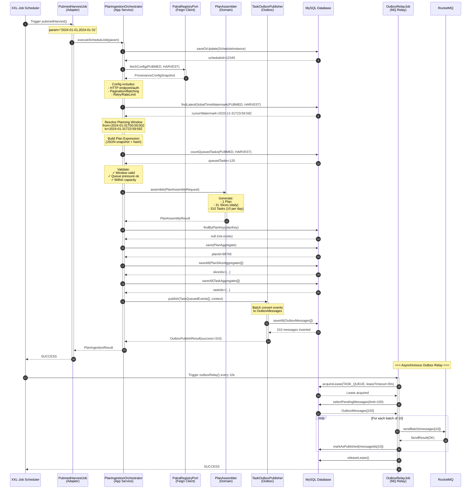

# Papertrace 采集数据流完整流程

> **文档版本**: v1.0  
> **生成时间**: 2025-10-08  
> **涵盖模块**: patra-ingest (完整采集引擎)

---

## 1. 概述

采集数据流是Papertrace的核心业务流程,负责将外部医学文献数据源(PubMed, EPMC等)的数据**可靠、幂等、可追溯**地采集到系统中.

### 关键特性

- **事件驱动**: 使用Outbox模式保证数据最终一致性
- **幂等设计**: planKey去重 + taskKey去重,支持断点续传
- **时间窗口策略**: 基于游标水位的增量采集
- **可观测性**: 完整的traceId传播 + 结构化日志

### 核心组件

| 组件 | 职责 | 所在模块 |
|-----|------|---------|
| **PubmedHarvestJob** | XXL-Job调度入口 | patra-ingest-adapter |
| **PlanIngestionOrchestrator** | 计划编排核心 | patra-ingest-app |
| **PlanAssembler** | Plan/Slice/Task装配 | patra-ingest-app |
| **TaskOutboxPublisher** | Outbox消息发布 | patra-ingest-app |
| **OutboxRelayJob** | Outbox消息中继 | patra-ingest-adapter |

---

## 2. 完整数据流序列图



---

## 3. 六个核心阶段详解

### Phase 1: 调度实例 + 配置快照

**目的**: 记录本次调度触发并获取来源配置

**关键代码位置**:
- `PlanIngestionOrchestrator.persistScheduleInstanceSafely()`
- `PatraRegistryPort.fetchConfig()`

**数据流**:
```
ScheduleInstance {
    scheduler: "XXL-Job"
    schedulerJobId: "pubmedHarvest"
    schedulerLogId: 67890
    triggerType: "CRON"
    triggeredAt: 2024-01-01T00:00:00Z
    triggerParams: "2024-01-01,2024-01-31"
    provenanceCode: "PUBMED"
}
→ DB: ingest_schedule_instance

ProvenanceConfigSnapshot {
    provenanceCode: "PUBMED"
    operationCode: "HARVEST"
    httpConfig: { baseUrl, auth, headers... }
    paginationConfig: { strategy, pageSize... }
    retryConfig: { maxAttempts, backoff... }
    rateLimitConfig: { maxConcurrency, ratePerSecond... }
}
← PatraRegistry Feign Client
```

**幂等性保证**:
- `scheduleInstanceRepository.saveOrUpdateInstance()` 按 `(scheduler, schedulerJobId, schedulerLogId)` 唯一约束

---

### Phase 2: 游标水位 + 窗口解析

**目的**: 确定本次采集的时间范围(增量采集)

**关键代码位置**:
- `CursorRepository.findLatestGlobalTimeWatermark()`
- `PlanningWindowResolver.resolveWindow()`

**窗口解析策略**:

```
Input:
- cursorWatermark: 2023-12-31T23:59:59Z (上次采集终点)
- windowFrom: 2024-01-01T00:00:00Z (调度参数)
- windowTo: 2024-01-31T23:59:59Z (调度参数)

Strategy: TIME (基于时间窗口)
Output:
- PlannerWindow { from: 2024-01-01T00:00:00Z, to: 2024-01-31T23:59:59Z }
```

**游标推进规则**:
- 游标只前进不后退(`cursorWatermark` 作为起点参考)
- 支持手动指定窗口(优先级高于游标自动推进)
- 窗口解析失败→抛出 `PlanValidationException`

---

### Phase 3: 计划表达式构建

**目的**: 生成计划级别的业务表达式快照(用于幂等去重和审计追踪)

**关键代码位置**:
- `PlanExpressionBuilder.build()`

**表达式内容**:
```json
{
  "provenance": "PUBMED",
  "operation": "HARVEST",
  "window": { "from": "2024-01-01T00:00:00Z", "to": "2024-01-31T23:59:59Z" },
  "config": {
    "pagination": { "strategy": "OFFSET", "pageSize": 100 },
    "batching": { "batchSize": 10 },
    "retry": { "maxAttempts": 3, "backoffMs": 5000 }
  }
}
```

**哈希生成**:
```java
String hash = DigestUtils.sha256Hex(expressionJson);
// hash = "a3f5e8d9..."
```

**用途**:
- **幂等去重**: planKey = `PUBMED:HARVEST:a3f5e8d9`
- **审计追踪**: 记录完整的业务上下文快照
- **补偿重试**: 相同哈希→复用现有Plan

---

### Phase 4: 前置校验

**目的**: 在装配前验证窗口合理性、背压、能力边界

**关键代码位置**:
- `PlannerValidator.validateBeforeAssemble()`
- `TaskRepository.countQueuedTasks()`

**校验项**:

| 校验项 | 规则 | 异常类型 |
|--------|------|----------|
| **窗口合理性** | `windowTo > windowFrom` <br/> 窗口跨度 ≤ 配置的最大跨度 | `PlanValidationException.WINDOW_INVALID` |
| **排队压力** | `queuedTasks < maxQueuedTasks` (默认5000) | `PlanValidationException.QUEUE_BACKPRESSURE` |
| **能力边界** | 预估任务数 ≤ `maxTasksPerPlan` (默认10000) | `PlanValidationException.CAPACITY_EXCEEDED` |

**日志示例**:
```
[INGEST][APP] plan-ingest validation passed queuedTasks=120
```

---

### Phase 5: 计划装配 (Plan/Slice/Task)

**目的**: 根据窗口和配置生成Plan、Slice、Task三层聚合蓝图

**关键代码位置**:
- `PlanAssembler.assemble()`

**装配策略**:

#### 5.1 Plan 层
```java
PlanAggregate {
    planKey: "PUBMED:HARVEST:a3f5e8d9" (幂等键)
    provenanceCode: "PUBMED"
    operationCode: "HARVEST"
    window: { from, to }
    status: "PENDING"
    scheduleInstanceId: 12345
    expressionHash: "a3f5e8d9"
    expressionJson: "{...}"
}
```

#### 5.2 Slice 层 (按天分片)
```java
For each day in [2024-01-01, 2024-01-31]:
    PlanSliceAggregate {
        sliceNo: 1..31
        sliceKey: "PUBMED:HARVEST:a3f5e8d9:SLICE:1"
        window: { from: day.startOfDay(), to: day.endOfDay() }
        status: "PENDING"
    }
```

#### 5.3 Task 层 (按分页分任务)
```java
For each slice:
    For pageOffset in [0, 100, 200, ..., 900] (10 pages per day):
        TaskAggregate {
            taskKey: "PUBMED:HARVEST:a3f5e8d9:SLICE:1:TASK:0" (幂等键)
            provenanceCode: "PUBMED"
            operationCode: "HARVEST"
            window: slice.window
            pageOffset: pageOffset
            pageSize: 100
            status: "QUEUED"
            priority: 5
            checkpoint: null (首次执行)
        }
```

**装配结果**:
```java
PlanAssemblyResult {
    plan: PlanAggregate
    slices: List<PlanSliceAggregate> (31 slices)
    tasks: List<TaskAggregate> (310 tasks)
    status: SUCCESS
}
```

---

### Phase 6: 幂等检查与持久化

**目的**: 去重 + 持久化 + 补偿重试

**关键代码位置**:
- `PlanRepository.findByPlanKey()`
- `PlanRepository.save()` / `PlanSliceRepository.saveAll()` / `TaskRepository.saveAll()`

#### 6.1 幂等去重逻辑
```java
if (existingPlan != null) {
    log.info("plan-ingest dedup hit existing planKey={}, reuse planId={}", 
             planKey, existingPlan.getId());
    
    // 查找失败/取消的任务
    List<TaskAggregate> retryTasks = existingTasks.stream()
        .filter(task -> task.status == FAILED || task.status == CANCELLED)
        .collect(toList());
    
    // 重置状态并重新发布
    retryTasks.forEach(task -> task.prepareForRetry());
    taskRepository.saveAll(retryTasks);
    
    // 发布重试事件
    taskOutboxPublisher.publishRetry(retryEvents, existingPlan, schedule);
    
    return result; // 提前返回,不再重复创建
}
```

#### 6.2 首次持久化
```sql
-- Plan 表
INSERT INTO ingest_plan (plan_key, provenance_code, operation_code, ...) VALUES (...);

-- Slice 表 (批量)
INSERT INTO ingest_plan_slice (slice_key, plan_id, slice_no, ...) VALUES (...), (...), ...;

-- Task 表 (批量,每批100条)
INSERT INTO ingest_task (task_key, plan_id, slice_id, status, ...) VALUES (...), (...), ...;
```

**事务边界**:
- `@Transactional` 注解在 `PlanIngestionOrchestrator.ingestPlan()`
- 所有持久化操作(Plan/Slice/Task/Outbox)在同一事务中

---

### Phase 7: Outbox 事件发布

**目的**: 将Task入队事件转换为Outbox消息,保证事件最终一致性

**关键代码位置**:
- `TaskOutboxPublisher.publish()`
- `AbstractOutboxPublisher.publish()`

**事件转换流程**:

#### 7.1 收集领域事件
```java
List<TaskQueuedEvent> queuedEvents = tasks.stream()
    .map(task -> {
        task.raiseQueuedEvent(); // 触发领域事件
        return task.pullDomainEvents()
            .filter(e -> e instanceof TaskQueuedEvent)
            .map(e -> (TaskQueuedEvent) e)
            .findFirst().orElse(null);
    })
    .filter(Objects::nonNull)
    .collect(toList());
```

#### 7.2 转换为 Outbox 消息
```java
For each TaskQueuedEvent:
    OutboxMessage {
        aggregateType: "Task"
        aggregateId: taskId
        channel: "task-queue"
        opType: "CREATED"
        partitionKey: taskId.toString() (保证顺序)
        dedupKey: "task-queue:${taskId}:CREATED"
        payloadJson: {
            "taskId": 12345,
            "planId": 98765,
            "provenanceCode": "PUBMED",
            "operationCode": "HARVEST",
            "window": { "from": "...", "to": "..." },
            "pageOffset": 0,
            "pageSize": 100,
            "priority": 5
        }
        headersJson: {
            "traceId": "abc123",
            "eventType": "TaskQueuedEvent",
            "timestamp": "2024-01-01T00:00:00Z",
            "source": "patra-ingest"
        }
        statusCode: "PENDING"
        notBefore: Instant.now()
        retryCount: 0
    }
```

#### 7.3 批量持久化
```sql
INSERT INTO ingest_outbox_message 
    (aggregate_type, aggregate_id, channel, op_type, partition_key, dedup_key, 
     payload_json, headers_json, status_code, not_before, retry_count, created_at)
VALUES 
    ('Task', 12345, 'task-queue', 'CREATED', '12345', 'task-queue:12345:CREATED', 
     '{"taskId":12345,...}', '{"traceId":"abc123",...}', 'PENDING', NOW(), 0, NOW()),
    ...
    (310 rows);
```

**发布结果**:
```java
OutboxPublishResult {
    totalCount: 310
    successCount: 310
    failureCount: 0
    failures: []
    duration: PT0.523S
}
```

---

### Phase 8: Outbox 中继 (异步)

**目的**: 将Outbox消息异步投递到RocketMQ

**关键代码位置**:
- `OutboxRelayJob` (XXL-Job定时任务,每10秒执行)
- `OutboxRelayOrchestrator.relayMessages()`

**中继流程**:

#### 8.1 租约获取 (防并发冲突)
```java
boolean leaseAcquired = repository.acquireLease(
    channel = "task-queue",
    leaseOwner = "${hostname}:${pid}",
    leaseTimeout = Duration.ofSeconds(30)
);

if (!leaseAcquired) {
    log.info("Failed to acquire lease for channel=task-queue, skip this round");
    return;
}
```

#### 8.2 查询待发布消息
```sql
SELECT * FROM ingest_outbox_message
WHERE channel = 'task-queue'
  AND status_code = 'PENDING'
  AND not_before <= NOW()
  AND (lease_owner IS NULL OR lease_expired_at < NOW())
ORDER BY created_at ASC
LIMIT 100;
```

#### 8.3 批量发送到 MQ
```java
List<List<OutboxMessage>> batches = partition(messages, batchSize = 10);

for (List<OutboxMessage> batch : batches) {
    SendResult result = rocketMqProducer.sendBatch(
        topic = "patra-task-queue",
        messages = batch.stream()
            .map(msg -> new Message(
                topic,
                msg.getPartitionKey(), // 分区键保证顺序
                msg.getPayloadJson().getBytes()
            ))
            .collect(toList())
    );
    
    if (result.getSendStatus() == SendStatus.SEND_OK) {
        repository.markAsPublished(batch.stream()
            .map(OutboxMessage::getId)
            .collect(toList()));
    } else {
        // 失败重试由下次定时任务处理
        log.error("Failed to send batch to MQ, will retry later");
    }
}
```

#### 8.4 释放租约
```java
repository.releaseLease(channel = "task-queue", leaseOwner = "${hostname}:${pid}");
```

**重试策略**:
- 发送失败的消息保持 `PENDING` 状态,下次定时任务自动重试
- 最大重试次数: 10次 (超过后标记为 `FAILED`)
- 退避策略: exponential backoff (5s, 10s, 20s, 40s, ...)

---

## 4. 关键设计决策

### 4.1 幂等性保证

| 层级 | 幂等键 | 去重策略 |
|------|--------|----------|
| **Plan** | `planKey = provenance:operation:expressionHash` | 若已存在→进入补偿重试分支 |
| **Slice** | `sliceKey = planKey:SLICE:sliceNo` | 随Plan去重(不会单独创建) |
| **Task** | `taskKey = planKey:SLICE:sliceNo:TASK:pageOffset` | 随Plan去重;失败任务可重置状态 |
| **Outbox** | `dedupKey = channel:aggregateId:opType` | UPSERT策略(重试时更新payload) |

### 4.2 事务边界

```
Transaction Scope:
┌───────────────────────────────────────────────────────────┐
│ @Transactional (PlanIngestionOrchestrator.ingestPlan)    │
│                                                           │
│  ┌─────────────────┐  ┌──────────────────┐  ┌─────────┐ │
│  │ Schedule        │  │ Plan/Slice/Task  │  │ Outbox  │ │
│  │ Instance        │→│ Persistence       │→│ Insert  │ │
│  └─────────────────┘  └──────────────────┘  └─────────┘ │
│                                                           │
│  Rollback on any exception → all or nothing              │
└───────────────────────────────────────────────────────────┘

Asynchronous Phase (separate transaction):
┌───────────────────────────────────────────────────────────┐
│ OutboxRelayJob (每10秒独立事务)                            │
│                                                           │
│  ┌─────────────┐  ┌──────────┐  ┌─────────────────────┐ │
│  │ Acquire     │→│ Send to  │→│ Mark as PUBLISHED   │ │
│  │ Lease       │  │ RocketMQ │  │ + Release Lease     │ │
│  └─────────────┘  └──────────┘  └─────────────────────┘ │
└───────────────────────────────────────────────────────────┘
```

**设计意图**:
- Plan编排与Outbox插入在同一事务→保证强一致性
- Outbox中继异步执行→解耦、削峰、提高吞吐

### 4.3 错误处理策略

| 阶段 | 异常类型 | 处理策略 |
|------|----------|----------|
| **Phase 1-2** | `PlanPersistenceException` | 事务回滚,XXL-Job标记失败,告警 |
| **Phase 3-4** | `PlanValidationException` | 事务回滚,记录详细错误原因,不重试 |
| **Phase 5** | `PlanAssemblyException` | 事务回滚,检查配置/窗口参数,人工介入 |
| **Phase 6-7** | `PlanPersistenceException` | 事务回滚,数据库连接/约束冲突,重试 |
| **Phase 8** | MQ发送失败 | 保持PENDING状态,下次定时任务自动重试 |

---

## 5. 监控与可观测性

### 5.1 关键指标

```java
// Metrics 埋点 (Micrometer)
metrics.counter("ingest.plan.created", tags("provenance", "PUBMED")).increment();
metrics.counter("ingest.task.queued", tags("provenance", "PUBMED")).increment(310);
metrics.timer("ingest.plan.duration").record(Duration.ofSeconds(2));
metrics.gauge("ingest.queue.depth", () -> taskRepository.countQueuedTasks("PUBMED", "HARVEST"));
```

### 5.2 结构化日志

```java
log.info("[INGEST][APP] plan-ingest start, provenance={}, op={}, triggeredAt={}", 
         provenanceCode, operationCode, now);

log.debug("[INGEST][APP] plan-ingest window resolved provenance={} op={} cursorWatermark={} window=[{}, {})",
          provenanceCode, operationCode, cursorWatermark, window.from(), window.to());

log.info("[INGEST][APP] plan-ingest success, planId={}, sliceCount={}, taskCount={}, window=[{}, {})",
         planId, sliceCount, taskCount, window.from(), window.to());
```

### 5.3 TraceId 传播

```
Request Context:
┌────────────────────────────────────────────────┐
│ XXL-Job (traceId: abc123)                      │
│   ↓                                            │
│ PubmedHarvestJob (MDC.put("traceId", "abc123"))│
│   ↓                                            │
│ PlanIngestionOrchestrator (继承MDC)            │
│   ↓                                            │
│ OutboxMessage.headers.traceId = "abc123"       │
│   ↓                                            │
│ RocketMQ Message (properties: traceId=abc123)  │
└────────────────────────────────────────────────┘
```

---

## 6. 性能优化点

### 6.1 批量操作
- Slice批量插入(31条/次)
- Task批量插入(每批100条,共310条分4批)
- Outbox批量插入(每批100条,共310条分4批)

### 6.2 索引优化
```sql
-- Plan幂等查询
CREATE UNIQUE INDEX idx_plan_key ON ingest_plan(plan_key);

-- Task排队统计
CREATE INDEX idx_task_status_provenance ON ingest_task(status, provenance_code, operation_code);

-- Outbox中继查询
CREATE INDEX idx_outbox_pending ON ingest_outbox_message(channel, status_code, not_before, created_at);
```

### 6.3 连接池配置
```yaml
spring:
  datasource:
    hikari:
      maximum-pool-size: 20
      minimum-idle: 5
      connection-timeout: 30000
      idle-timeout: 600000
```

---

## 7. 常见问题排查

### Q1: 为什么Plan没有生成?
**检查点**:
1. 游标水位是否正确? `SELECT * FROM ingest_cursor WHERE provenance_code='PUBMED' AND operation_code='HARVEST';`
2. 窗口解析是否成功? 查看日志 `plan-ingest window resolved`
3. 前置校验是否通过? 查看 `PlanValidationException` 异常

### Q2: 任务重复发布怎么办?
**幂等保证**:
- `planKey` 去重: 相同表达式哈希→复用现有Plan
- `dedupKey` 去重: Outbox消息按 `channel:aggregateId:opType` 去重
- 即使重复调用,也不会产生重复Task

### Q3: Outbox消息长时间PENDING?
**排查步骤**:
1. 检查OutboxRelayJob是否正常运行: `SELECT * FROM xxl_job_log WHERE job_id='outboxRelay' ORDER BY trigger_time DESC LIMIT 10;`
2. 检查租约竞争: `SELECT lease_owner, lease_expired_at FROM ingest_outbox_lease WHERE channel='task-queue';`
3. 检查MQ连接: 查看 `RocketMqProducer` 日志

---

## 8. 相关文档

- [Outbox发布机制](./outbox-publishing.md)
- [配置生命周期](./registry-config-lifecycle.md)
- [错误处理流程](./error-handling-flow.md)
- [数据库Schema](../database/schema-overview.md)

---

**最后更新**: 2025-10-08  
**维护者**: Papertrace Team
