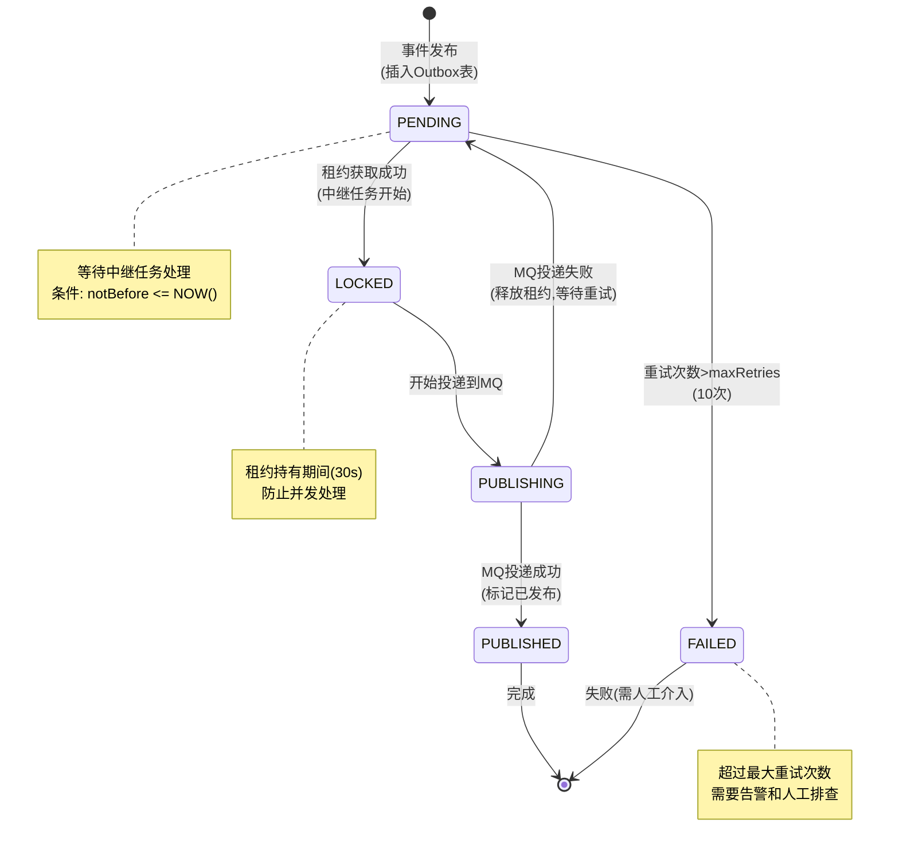

# Papertrace Outbox 发布机制

> **文档版本**: v1.0  
> **生成时间**: 2025-10-08  
> **涵盖模块**: patra-ingest (Outbox Pattern Implementation)

---

## 1. 概述

Outbox模式是Papertrace实现**事件驱动架构**和**最终一致性**的核心机制.通过将领域事件先持久化到本地Outbox表,再异步中继到消息队列,保证了**事务一致性**和**消息可靠投递**.

### 关键特性

- **事务保证**: Outbox消息与业务数据在同一事务中持久化
- **幂等发布**: 基于dedupKey的UPSERT策略,避免重复消息
- **租约机制**: 分布式环境下防止并发冲突
- **退避重试**: 指数退避策略处理发送失败
- **有序投递**: 基于partitionKey保证消息顺序

### 核心组件

| 组件 | 职责 | 所在模块 |
|-----|------|---------|
| **AbstractOutboxPublisher** | Outbox发布抽象基类(模板方法) | patra-ingest-app |
| **TaskOutboxPublisher** | Task事件Outbox发布器 | patra-ingest-app |
| **OutboxRelayOrchestrator** | Outbox中继编排器 | patra-ingest-app |
| **OutboxRelayJob** | XXL-Job定时中继任务 | patra-ingest-adapter |
| **RocketMqOutboxPublisher** | RocketMQ投递实现 | patra-ingest-infra |
| **OutboxMessageRepository** | Outbox消息仓储 | patra-ingest-infra |

---

## 2. Outbox 状态机



### 状态转换详解

| 状态 | 含义 | 可转换到 | 触发条件 |
|------|------|----------|----------|
| **PENDING** | 待发布 | LOCKED, FAILED | 初始状态 / MQ投递失败后回退 |
| **LOCKED** | 已锁定 | PUBLISHING | 中继任务获取租约成功 |
| **PUBLISHING** | 投递中 | PUBLISHED, PENDING | MQ发送API调用 |
| **PUBLISHED** | 已发布 | (终态) | MQ返回SendStatus.SEND_OK |
| **FAILED** | 失败 | (终态) | retryCount > maxRetries (10次) |

---

## 3. 发布流程详解

### 3.1 Phase 1: 领域事件收集

**代码位置**: `PlanIngestionOrchestrator.collectQueuedEvents()`

```java
// 步骤1: 触发领域事件
tasks.forEach(task -> task.raiseQueuedEvent());

// 步骤2: 从聚合根拉取事件
List<TaskQueuedEvent> events = tasks.stream()
    .flatMap(task -> task.pullDomainEvents().stream())
    .filter(e -> e instanceof TaskQueuedEvent)
    .map(e -> (TaskQueuedEvent) e)
    .collect(toList());
```

**TaskAggregate 事件生成**:
```java
public class TaskAggregate {
    private List<DomainEvent> domainEvents = new ArrayList<>();
    
    public void raiseQueuedEvent() {
        TaskQueuedEvent event = new TaskQueuedEvent(
            this.id,
            this.planId,
            this.provenanceCode,
            this.operationCode,
            this.window,
            this.priority,
            Instant.now()
        );
        this.domainEvents.add(event);
    }
    
    public List<DomainEvent> pullDomainEvents() {
        List<DomainEvent> events = new ArrayList<>(this.domainEvents);
        this.domainEvents.clear(); // 清空已拉取的事件
        return events;
    }
}
```

---

### 3.2 Phase 2: Outbox消息转换

**代码位置**: `TaskOutboxPublisher.publish()`

```java
@Override
public OutboxPublishResult publish(List<TaskQueuedEvent> events, OutboxPublishContext ctx) {
    // 父类模板方法处理:
    // 1. 过滤验证事件
    List<TaskQueuedEvent> validEvents = filterValidEvents(events);
    
    // 2. 构建OutboxMessage
    List<OutboxMessage> messages = validEvents.stream()
        .map(event -> createOutboxMessage(event, ctx))
        .collect(toList());
    
    // 3. 批量插入
    repository.saveAll(messages);
    
    return OutboxPublishResult.success(messages.size(), duration);
}
```

**OutboxMessage 构建详解**:
```java
private OutboxMessage createOutboxMessage(TaskQueuedEvent event, OutboxPublishContext ctx) {
    // 1. 构建Payload (业务数据)
    TaskPayload payload = new TaskPayload(
        event.taskId(),
        event.planId(),
        event.provenanceCode().getCode(),
        event.operationCode().getCode(),
        event.window().from(),
        event.window().to(),
        event.pageOffset(),
        event.pageSize(),
        event.priority()
    );
    
    // 2. 构建Headers (元数据)
    TaskHeaders headers = new TaskHeaders(
        ctx.getTraceId(),
        "TaskQueuedEvent",
        event.occurredAt(),
        "patra-ingest",
        ctx.getPlan().getId()
    );
    
    // 3. 序列化为JSON
    String payloadJson = objectMapper.writeValueAsString(payload);
    String headersJson = objectMapper.writeValueAsString(headers);
    
    // 4. 构建OutboxMessage
    return OutboxMessage.builder()
        .aggregateType(getAggregateType().getCode())  // 使用枚举方法获取类型代码
        .aggregateId(event.taskId())
        .channel(getChannel().getCode())              // 使用枚举方法获取通道代码
        .opType(getOperationType(event).getCode())    // 使用枚举方法获取操作类型代码
        .partitionKey(String.valueOf(event.taskId())) // 保证顺序
        .dedupKey("task-queue:" + event.taskId() + ":CREATED") // 幂等键
        .payloadJson(payloadJson)
        .headersJson(headersJson)
        .notBefore(Instant.now())
        .statusCode("PENDING")
        .retryCount(0)
        .build();
}
```

**数据库记录示例**:
```sql
INSERT INTO ingest_outbox_message (
    aggregate_type, aggregate_id, channel, op_type,
    partition_key, dedup_key,
    payload_json, headers_json,
    status_code, not_before, retry_count, created_at
) VALUES (
    'Task', 12345, 'task-queue', 'CREATED',
    '12345', 'task-queue:12345:CREATED',
    '{"taskId":12345,"planId":98765,"provenanceCode":"PUBMED",...}',
    '{"traceId":"abc123","eventType":"TaskQueuedEvent",...}',
    'PENDING', '2024-01-01 00:00:00', 0, '2024-01-01 00:00:00'
);
```

---

### 3.3 Phase 3: 租约获取 (防并发冲突)

**代码位置**: `OutboxRelayOrchestrator.relayMessages()`

```java
// 步骤1: 尝试获取租约
boolean leaseAcquired = leaseManager.acquireLease(
    channel = "task-queue",
    leaseOwner = InetAddress.getLocalHost().getHostName() + ":" + ProcessHandle.current().pid(),
    leaseTimeout = Duration.ofSeconds(30)
);

if (!leaseAcquired) {
    log.info("Failed to acquire lease for channel={}, skip this round", channel);
    return RelayResult.skipped("Lease not acquired");
}
```

**租约表结构**:
```sql
CREATE TABLE ingest_outbox_lease (
    id BIGINT PRIMARY KEY AUTO_INCREMENT,
    channel VARCHAR(50) NOT NULL UNIQUE,
    lease_owner VARCHAR(100),
    lease_acquired_at TIMESTAMP,
    lease_expired_at TIMESTAMP,
    updated_at TIMESTAMP DEFAULT CURRENT_TIMESTAMP ON UPDATE CURRENT_TIMESTAMP,
    INDEX idx_channel_expired (channel, lease_expired_at)
);
```

**租约获取SQL**:
```sql
-- CAS (Compare-And-Set) 原子操作
UPDATE ingest_outbox_lease
SET lease_owner = :leaseOwner,
    lease_acquired_at = NOW(),
    lease_expired_at = DATE_ADD(NOW(), INTERVAL 30 SECOND)
WHERE channel = :channel
  AND (lease_owner IS NULL OR lease_expired_at < NOW());

-- 返回: affectedRows == 1 表示获取成功
```

---

### 3.4 Phase 4: 消息中继到 MQ

**代码位置**: `RocketMqOutboxPublisher.publishBatch()`

```java
// 步骤1: 查询待发布消息
List<OutboxMessage> pendingMessages = repository.findPendingMessages(
    channel = "task-queue",
    limit = 100,
    notBeforeCutoff = Instant.now()
);

// 步骤2: 分批发送 (每批10条)
List<List<OutboxMessage>> batches = partition(pendingMessages, batchSize = 10);

for (List<OutboxMessage> batch : batches) {
    try {
        // 构建RocketMQ消息
        List<Message> mqMessages = batch.stream()
            .map(msg -> new Message(
                topic = "patra-task-queue",
                tag = msg.getOpType(), // CREATED / UPDATED / DELETED
                key = msg.getPartitionKey(), // 消息键(用于分区和顺序)
                body = msg.getPayloadJson().getBytes(UTF_8)
            ).putUserProperty("headers", msg.getHeadersJson()))
            .collect(toList());
        
        // 批量发送
        SendResult result = rocketMqProducer.send(mqMessages, sendTimeout = 3000);
        
        if (result.getSendStatus() == SendStatus.SEND_OK) {
            // 标记为已发布
            List<Long> messageIds = batch.stream()
                .map(OutboxMessage::getId)
                .collect(toList());
            repository.markAsPublished(messageIds, mqMessageId = result.getMsgId());
            
            log.info("Published {} messages to MQ, msgId={}", batch.size(), result.getMsgId());
        } else {
            // 发送失败,不更新状态(下次重试)
            log.error("Failed to send batch to MQ, status={}", result.getSendStatus());
            metrics.recordMqSendFailure("task-queue", batch.size());
        }
        
    } catch (Exception e) {
        log.error("Exception while sending batch to MQ", e);
        // 异常情况下递增重试计数
        repository.incrementRetryCount(batch.stream()
            .map(OutboxMessage::getId)
            .collect(toList()));
    }
}
```

**查询待发布消息SQL**:
```sql
SELECT * FROM ingest_outbox_message
WHERE channel = ?
  AND status_code = 'PENDING'
  AND not_before <= ?
  AND retry_count < 10
ORDER BY created_at ASC
LIMIT ?;
```

**标记已发布SQL**:
```sql
UPDATE ingest_outbox_message
SET status_code = 'PUBLISHED',
    mq_message_id = ?,
    published_at = NOW(),
    updated_at = NOW()
WHERE id IN (?);
```

---

### 3.5 Phase 5: 租约释放

```java
finally {
    // 无论成功失败,都释放租约
    leaseManager.releaseLease(channel = "task-queue", leaseOwner = currentOwner);
}
```

**释放租约SQL**:
```sql
UPDATE ingest_outbox_lease
SET lease_owner = NULL,
    lease_acquired_at = NULL,
    lease_expired_at = NULL
WHERE channel = ?
  AND lease_owner = ?;
```

---

## 4. 重试与退避策略

### 4.1 重试条件

```java
if (msg.getRetryCount() >= 10) {
    // 超过最大重试次数,标记为FAILED
    repository.markAsFailed(msg.getId(), reason = "Max retries exceeded");
    alertService.sendAlert("Outbox message failed", msg);
    return;
}
```

### 4.2 指数退避 (Exponential Backoff)

```java
// 计算下次可重试时间
Duration backoffDelay = Duration.ofSeconds((long) Math.pow(2, retryCount) * 5);
Instant nextRetryTime = Instant.now().plus(backoffDelay);

repository.updateNotBefore(msg.getId(), nextRetryTime);
```

**退避时间表**:

| 重试次数 | 退避时间 | 累计等待 |
|---------|---------|---------|
| 1 | 5秒 | 5秒 |
| 2 | 10秒 | 15秒 |
| 3 | 20秒 | 35秒 |
| 4 | 40秒 | 1分15秒 |
| 5 | 80秒 | 2分35秒 |
| 6 | 160秒 | 5分15秒 |
| 7 | 320秒 | 10分35秒 |
| 8 | 640秒 | 21分15秒 |
| 9 | 1280秒 | 42分35秒 |
| 10 | 2560秒 | 85分15秒 (超过最大重试) |

---

## 5. 幂等性保证

### 5.1 发布幂等 (dedupKey)

```java
// 首次发布
taskOutboxPublisher.publish(events, ctx);
→ INSERT INTO outbox (dedup_key='task-queue:12345:CREATED', ...)

// 重复发布 (补偿重试场景)
taskOutboxPublisher.publishRetry(events, ctx);
→ INSERT ... ON DUPLICATE KEY UPDATE payload_json=?, headers_json=?, updated_at=NOW()
```

**UPSERT SQL**:
```sql
INSERT INTO ingest_outbox_message (
    channel, dedup_key, aggregate_type, aggregate_id, op_type,
    partition_key, payload_json, headers_json, status_code, not_before, retry_count
) VALUES (?, ?, ?, ?, ?, ?, ?, ?, ?, ?, ?)
ON DUPLICATE KEY UPDATE
    payload_json = VALUES(payload_json),
    headers_json = VALUES(headers_json),
    status_code = 'PENDING',
    retry_count = 0,
    updated_at = NOW();
```

**唯一索引**:
```sql
CREATE UNIQUE INDEX idx_outbox_dedup ON ingest_outbox_message(channel, dedup_key);
```

### 5.2 消费幂等 (下游责任)

Outbox模式保证**at-least-once**投递,下游消费者需自行保证幂等:

```java
// 下游消费者示例
@RocketMQMessageListener(topic = "patra-task-queue")
public class TaskQueueConsumer implements RocketMQListener<String> {
    
    @Override
    public void onMessage(String message) {
        TaskPayload payload = objectMapper.readValue(message, TaskPayload.class);
        
        // 幂等处理: 检查taskId是否已处理
        if (taskProcessedCache.contains(payload.taskId())) {
            log.info("Task {} already processed, skip", payload.taskId());
            return; // ACK but skip processing
        }
        
        // 处理业务逻辑
        processTask(payload);
        
        // 记录已处理 (Redis/DB)
        taskProcessedCache.add(payload.taskId());
    }
}
```

---

## 6. 监控与告警

### 6.1 关键指标

```java
// Outbox发布指标
metrics.counter("outbox.publish.total", tags("channel", "task-queue")).increment(310);
metrics.counter("outbox.publish.success", tags("channel", "task-queue")).increment(310);
metrics.timer("outbox.publish.duration").record(Duration.ofMillis(523));

// Outbox中继指标
metrics.counter("outbox.relay.total", tags("channel", "task-queue")).increment(100);
metrics.counter("outbox.relay.mq_send_success", tags("channel", "task-queue")).increment(100);
metrics.gauge("outbox.pending.count", tags("channel", "task-queue"), () -> repository.countPending("task-queue"));
metrics.gauge("outbox.retry.count", tags("channel", "task-queue"), () -> repository.countRetrying("task-queue"));
metrics.counter("outbox.failed.total", tags("channel", "task-queue")).increment();

// 租约竞争指标
metrics.counter("outbox.lease.acquire.success", tags("channel", "task-queue")).increment();
metrics.counter("outbox.lease.acquire.conflict", tags("channel", "task-queue")).increment();
```

### 6.2 告警规则

| 告警项 | 阈值 | 级别 | 处理建议 |
|--------|------|------|----------|
| **Pending消息堆积** | > 1000条持续5分钟 | P2 | 检查MQ连接/消费者消费速度 |
| **重试消息比例** | > 10% | P3 | 检查MQ稳定性/网络延迟 |
| **Failed消息出现** | > 0 | P1 | 人工排查并重新发布 |
| **租约竞争率** | > 50% | P3 | 增加中继任务间隔/优化租约超时 |
| **发布延迟** | P99 > 5秒 | P2 | 检查数据库性能/批量大小 |

### 6.3 巡检SQL

```sql
-- 查看Pending堆积
SELECT channel, COUNT(*) AS pending_count
FROM ingest_outbox_message
WHERE status_code = 'PENDING'
GROUP BY channel;

-- 查看失败消息
SELECT * FROM ingest_outbox_message
WHERE status_code = 'FAILED'
ORDER BY created_at DESC
LIMIT 10;

-- 查看重试消息分布
SELECT channel, retry_count, COUNT(*) AS count
FROM ingest_outbox_message
WHERE status_code = 'PENDING' AND retry_count > 0
GROUP BY channel, retry_count
ORDER BY channel, retry_count;

-- 查看租约状态
SELECT channel, lease_owner, lease_acquired_at, lease_expired_at,
       TIMESTAMPDIFF(SECOND, NOW(), lease_expired_at) AS remaining_seconds
FROM ingest_outbox_lease;
```

---

## 7. 故障场景与处理

### 场景1: MQ不可用

**表现**:
- Outbox消息状态: PENDING堆积
- 错误日志: `MQClientException: No route info of this topic`

**处理**:
1. 检查RocketMQ NameServer连接: `telnet namesrv-host 9876`
2. 检查Topic是否存在: `sh mqadmin topicStatus -n namesrv-host:9876 -t patra-task-queue`
3. 等待MQ恢复后,Outbox自动重试投递

**恢复时间**: 下次中继任务周期(10秒)内自动恢复

---

### 场景2: 中继任务失败 (租约泄漏)

**表现**:
- 租约长时间未释放(`lease_expired_at` 已过期但`lease_owner`未清空)
- Pending消息无法处理

**处理**:
```sql
-- 强制释放过期租约
UPDATE ingest_outbox_lease
SET lease_owner = NULL,
    lease_acquired_at = NULL,
    lease_expired_at = NULL
WHERE lease_expired_at < NOW();
```

**预防措施**:
- 租约超时设置合理(30秒)
- 中继任务使用`finally`块确保释放租约

---

### 场景3: Failed消息堆积

**表现**:
- 状态为FAILED的消息逐渐增多
- 告警触发

**排查步骤**:
1. 查看Failed消息详情:
```sql
SELECT id, dedup_key, payload_json, retry_count, last_error, created_at
FROM ingest_outbox_message
WHERE status_code = 'FAILED'
ORDER BY created_at DESC;
```

2. 分析失败原因(查看`last_error`字段)

3. 修复问题后手动重新发布:
```java
// 重置状态为PENDING
repository.resetToPending(List.of(messageId1, messageId2, ...));

// 或者使用管理API
POST /api/admin/outbox/retry
{
  "messageIds": [123, 456, 789]
}
```

---

## 8. 性能优化

### 8.1 批量操作

```java
// 批量查询 (减少DB往返)
List<OutboxMessage> messages = repository.findPendingMessages(limit = 100);

// 批量发送 (提高MQ吞吐)
List<List<OutboxMessage>> batches = partition(messages, batchSize = 10);
rocketMqProducer.send(batches.get(0)); // 每次发送10条

// 批量更新状态 (减少UPDATE次数)
repository.markAsPublished(messageIds = [1,2,3,...,10]);
```

### 8.2 索引优化

```sql
-- 中继查询索引
CREATE INDEX idx_outbox_relay_query ON ingest_outbox_message(
    channel, status_code, not_before, created_at
);

-- 去重索引 (UNIQUE)
CREATE UNIQUE INDEX idx_outbox_dedup ON ingest_outbox_message(channel, dedup_key);

-- 租约查询索引
CREATE INDEX idx_lease_expired ON ingest_outbox_lease(channel, lease_expired_at);
```

### 8.3 配置调优

```yaml
papertrace:
  outbox:
    publisher:
      batch-size: 100          # 单次插入批量大小
      max-batch-size: 500      # 最大批量大小
    relay:
      fetch-limit: 100         # 单次查询消息数
      send-batch-size: 10      # MQ发送批量大小
      lease-timeout: 30s       # 租约超时时间
      schedule-interval: 10s   # 中继任务间隔
```

---

## 9. 最佳实践

### 9.1 设计建议

✅ **DO**:
- 使用dedupKey保证幂等发布
- 使用partitionKey保证消息顺序
- 设置合理的`notBefore`延迟发布
- 监控Pending堆积和Failed消息
- 下游消费者实现幂等处理

❌ **DON'T**:
- 不要在Outbox payload中存储敏感信息(明文密码/token)
- 不要设置过大的批量大小(导致单次事务过长)
- 不要忽略Failed消息告警
- 不要假设消息只会投递一次(at-least-once语义)

### 9.2 扩展场景

**多Channel支持**:
```java
// Task队列
taskOutboxPublisher.publish(taskEvents, ctx); // channel = "task-queue"

// 文献数据队列
literatureOutboxPublisher.publish(dataEvents, ctx); // channel = "literature-data"

// 每个Channel独立租约,互不影响
```

**延迟发布**:
```java
@Override
protected Instant resolveNotBefore(TaskQueuedEvent event, OutboxPublishContext ctx) {
    // 延迟5分钟发布
    return Instant.now().plus(Duration.ofMinutes(5));
}
```

**优先级队列**:
```java
// Outbox按priority字段排序
SELECT * FROM ingest_outbox_message
WHERE status_code = 'PENDING'
ORDER BY priority DESC, created_at ASC
LIMIT ?;
```

---

## 10. 相关文档

- [采集数据流](./ingest-dataflow.md)
- [配置生命周期](./registry-config-lifecycle.md)
- [错误处理流程](./error-handling-flow.md)
- [数据库Schema](../database/schema-overview.md)
- [RocketMQ集成指南](../operations/rocketmq-integration.md)

---

**最后更新**: 2025-10-08  
**维护者**: Papertrace Team
