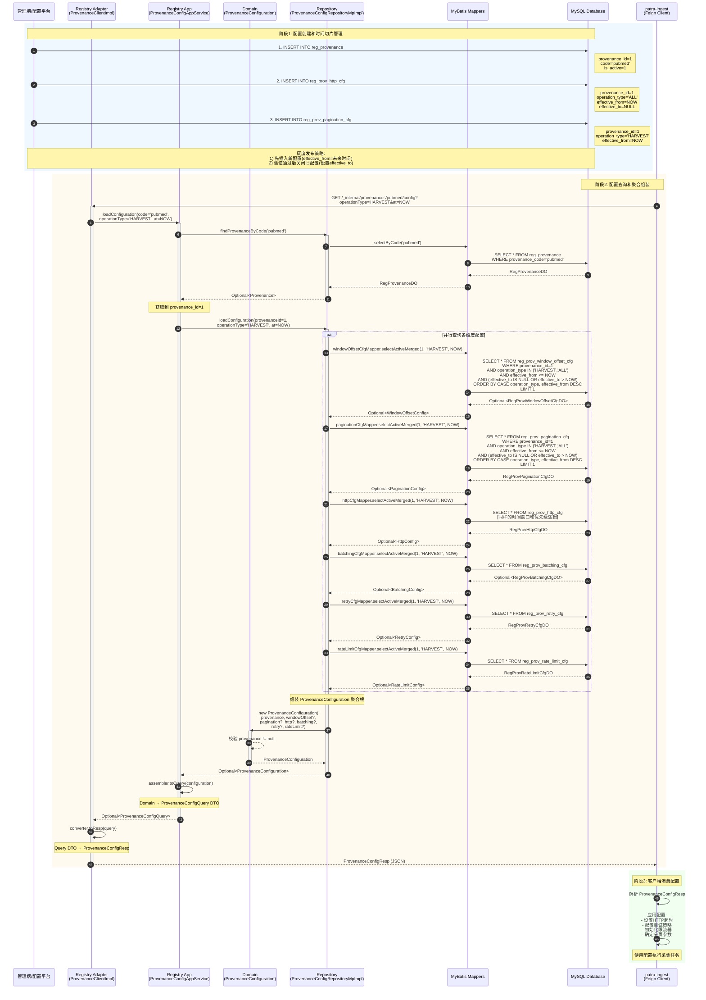

# ProvenanceConfig 配置生命周期流程分析

> **文档版本**: v1.0.0
> **生成时间**: 2025-10-08
> **模块**: patra-registry
> **作者**: Business Trace Analyzer Agent

---

## 1. 概述

### 1.1 ProvenanceConfig 的作用

`ProvenanceConfiguration` 是 patra-registry 服务中的**核心聚合根**,代表了外部数据源(Provenance)的完整配置快照.它整合了以下配置维度:

1. **Provenance** - 数据源基础元数据(来源代码、名称、基础URL、时区等)
2. **WindowOffsetConfig** - 时间窗口和增量偏移策略
3. **PaginationConfig** - 分页和游标配置
4. **HttpConfig** - HTTP客户端策略(超时、重试头、代理等)
5. **BatchingConfig** - 批量获取详情配置
6. **RetryConfig** - 重试和退避策略
7. **RateLimitConfig** - 限流和并发控制

### 1.2 设计特点

- **CQRS读视图**: 聚合根是只读的,用于查询侧组装有效配置
- **时间切片**: 所有配置维度支持 `effective_from` 和 `effective_to` 时间窗口
- **作用域优先级**: TASK/OPERATION-specific 配置覆盖 SOURCE/ALL 级别的默认配置
- **灵活可选**: 除 Provenance 外,其他配置维度都是可选的(nullable)

### 1.3 生命周期阶段

```
配置创建 → 时间切片管理 → 配置查询 → 客户端消费
   ↓           ↓              ↓           ↓
  写入DB    灰度发布策略   组装聚合根    Feign调用
```

---

## 2. 端到端流程序列图



---

## 3. 各阶段详细说明

### 3.1 配置创建阶段

#### 入口点
- **当前状态**: 尚未实现完整的管理端界面
- **预期入口**: 管理平台 REST API 或后台管理页面
- **直接方式**: 直接通过 SQL 插入配置数据

#### 数据流
```
管理端请求
  ↓
(未实现的) RegistryManagementController
  ↓
(未实现的) ProvenanceConfigWriteService
  ↓
直接 INSERT 到数据库表
```

#### 关键表结构

**1. reg_provenance (来源主表)**
```sql
CREATE TABLE reg_provenance (
    id BIGINT UNSIGNED PRIMARY KEY AUTO_INCREMENT,
    provenance_code VARCHAR(64) UNIQUE NOT NULL,  -- 'pubmed', 'crossref'
    provenance_name VARCHAR(128) NOT NULL,
    base_url_default VARCHAR(512),
    timezone_default VARCHAR(64) DEFAULT 'UTC',
    is_active TINYINT(1) DEFAULT 1,
    lifecycle_status_code VARCHAR(32) DEFAULT 'ACTIVE',
    version BIGINT UNSIGNED DEFAULT 0,           -- 乐观锁版本号
    ...
);
```

**2. reg_prov_*_cfg (配置维度表)**

所有配置表共享相同的模式:
```sql
CREATE TABLE reg_prov_pagination_cfg (
    id BIGINT UNSIGNED PRIMARY KEY,
    provenance_id BIGINT UNSIGNED NOT NULL,      -- FK -> reg_provenance(id)
    operation_type VARCHAR(32) DEFAULT 'ALL',    -- 作用域: ALL/HARVEST/UPDATE/BACKFILL
    effective_from TIMESTAMP(6) NOT NULL,        -- 生效起始时间(包含)
    effective_to TIMESTAMP(6) NULL,              -- 生效结束时间(不包含),NULL=开放式
    ...具体配置字段...,
    lifecycle_status_code VARCHAR(32) DEFAULT 'ACTIVE',
    version BIGINT UNSIGNED DEFAULT 0,
    UNIQUE KEY (provenance_id, operation_type, effective_from)
);
```

#### 时间切片管理策略

**灰度发布流程**:
```sql
-- 步骤1: 插入新配置(未来生效)
INSERT INTO reg_prov_http_cfg (
    provenance_id, operation_type,
    effective_from, effective_to,
    timeout_connect_millis, ...
) VALUES (
    1, 'HARVEST',
    '2025-10-15 00:00:00', NULL,  -- 未来时间生效
    5000, ...
);

-- 步骤2: 验证新配置(测试环境/金丝雀)

-- 步骤3: 关闭旧配置
UPDATE reg_prov_http_cfg
SET effective_to = '2025-10-15 00:00:00'
WHERE provenance_id = 1
  AND operation_type = 'HARVEST'
  AND effective_from < '2025-10-15 00:00:00'
  AND effective_to IS NULL;
```

#### 配置校验规则
- **非空约束**: provenance 必须存在且 active
- **时间窗口**: `effective_from <= effective_to` (如果 effective_to 非 NULL)
- **唯一性**: (provenance_id, operation_type, effective_from) 组合唯一
- **作用域**: operation_type 必须是有效的枚举值

---

### 3.2 配置查询阶段

#### Adapter 层: ProvenanceClientImpl

**类**: `com.patra.registry.adapter.inbound.rest.feign.ProvenanceClientImpl`

**方法**: `getConfiguration(ProvenanceCode code, String operationType, Instant at)`

**职责**:
- 实现 `ProvenanceEndpoint` 接口,暴露 REST API
- 接收 Feign 客户端请求
- 委托给应用服务层
- 转换 Query DTO → Response DTO
- 异常处理和错误映射

**核心代码片段**:
```java
@Override
public ProvenanceConfigResp getConfiguration(ProvenanceCode code,
                                             String operationType,
                                             Instant at) {
    log.debug("[REGISTRY][ADAPTER] get provenance config code={} operationType={} at={}",
              code, operationType, at);

    Optional<ProvenanceConfigQuery> result = appService.loadConfiguration(code, operationType, at);

    return result.map(converter::toResp)
            .orElseThrow(() -> new ProvenanceNotFoundException(
                "Provenance configuration not found: code=" + code +
                ", operationType=" + operationType));
}
```

**错误处理**:
- `ProvenanceNotFoundException`: 配置不存在 → 404
- 通过 `RegistryErrorMappingContributor` 映射到 ProblemDetail

---

#### Application 层: ProvenanceConfigAppService

**类**: `com.patra.registry.app.service.ProvenanceConfigAppService`

**方法**: `loadConfiguration(ProvenanceCode code, String operationType, Instant at)`

**职责**:
- 用例编排:先查 Provenance,再加载完整配置
- 默认值处理: at=null → Instant.now()
- Domain → Query DTO 转换
- 事务边界(读操作,无事务)

**核心流程**:
```java
public Optional<ProvenanceConfigQuery> loadConfiguration(ProvenanceCode provenanceCode,
                                                         String operationType,
                                                         Instant at) {
    // 步骤1: 查找 Provenance
    Optional<Provenance> provenanceOpt = repository.findProvenanceByCode(provenanceCode);
    if (provenanceOpt.isEmpty()) {
        log.error("Provenance not found: code={}", provenanceCode);
        return Optional.empty();
    }

    Provenance provenance = provenanceOpt.get();

    // 步骤2: 加载完整配置
    Optional<ProvenanceConfiguration> configuration = repository.loadConfiguration(
        provenance.id(),
        operationType,
        at != null ? at : Instant.now()
    );

    // 步骤3: 转换为 Query DTO
    return configuration.map(assembler::toQuery);
}
```

---

#### Domain 层: ProvenanceConfiguration

**类**: `com.patra.registry.domain.model.aggregate.ProvenanceConfiguration`

**特性**:
- **Record 类型**: 不可变值对象
- **紧凑构造器**: 校验 provenance 非空
- **便利方法**: hasXxx(), isComplete()

**构造器校验**:
```java
public ProvenanceConfiguration {
    DomainValidationException.nonNull(provenance, "Provenance");
}
```

**完整性检查**:
```java
public boolean isComplete() {
    return provenance != null && provenance.isActive();
}
```

---

#### Infrastructure 层: ProvenanceConfigRepositoryMpImpl

**类**: `com.patra.registry.infra.persistence.repository.ProvenanceConfigRepositoryMpImpl`

**方法**: `loadConfiguration(Long provenanceId, String operationType, Instant at)`

**职责**:
- **聚合组装**: 并行查询7个维度配置,组装成聚合根
- **时间切片查询**: 所有配置查询都基于 effective_from/effective_to 窗口
- **作用域优先级**: operation-specific > ALL
- **DO → Domain 转换**: 使用 MapStruct ProvenanceEntityConverter

**核心逻辑**:
```java
@Override
public Optional<ProvenanceConfiguration> loadConfiguration(Long provenanceId,
                                                           String operationType,
                                                           Instant at) {
    log.info("Loading configuration: provenanceId={}, operationType={}", provenanceId, operationType);

    // 步骤1: 查找 Provenance
    Optional<Provenance> provenanceOpt = findProvenanceById(provenanceId);
    if (provenanceOpt.isEmpty()) {
        log.warn("Provenance not found: provenanceId={}", provenanceId);
        return Optional.empty();
    }

    Instant timestamp = atOrNow(at);
    Provenance provenance = provenanceOpt.get();

    // 步骤2: 并行查询各维度配置
    Optional<WindowOffsetConfig> window = findActiveWindowOffset(provenanceId, operationType, timestamp);
    Optional<PaginationConfig> pagination = findActivePagination(provenanceId, operationType, timestamp);
    Optional<HttpConfig> httpConfig = findActiveHttpConfig(provenanceId, operationType, timestamp);
    Optional<BatchingConfig> batching = findActiveBatching(provenanceId, operationType, timestamp);
    Optional<RetryConfig> retry = findActiveRetry(provenanceId, operationType, timestamp);
    Optional<RateLimitConfig> rateLimit = findActiveRateLimit(provenanceId, operationType, timestamp);

    // 步骤3: 组装聚合根(可选配置用 null)
    ProvenanceConfiguration configuration = new ProvenanceConfiguration(
        provenance,
        window.orElse(null),
        pagination.orElse(null),
        httpConfig.orElse(null),
        batching.orElse(null),
        retry.orElse(null),
        rateLimit.orElse(null)
    );

    log.info("Configuration loaded successfully: provenanceId={}, operationType={}",
             provenanceId, operationType);
    return Optional.of(configuration);
}
```

---

#### MyBatis Mapper: 时间切片和优先级查询

**Mapper XML**: `RegProvPaginationCfgMapper.xml`

**方法**: `selectActiveMerged(Long provenanceId, String operationType, Instant now)`

**SQL 逻辑**:
```xml
<select id="selectActiveMerged" resultType="...RegProvPaginationCfgDO">
    SELECT *
    FROM patra_registry.reg_prov_pagination_cfg
    WHERE deleted = 0
      AND lifecycle_status_code = 'ACTIVE'
      AND provenance_id = #{provenanceId}
      AND effective_from &lt;= #{now}                    -- 时间窗口下界
      AND (effective_to IS NULL OR effective_to &gt; #{now})  -- 时间窗口上界(开放式或未到期)
      AND operation_type IN (#{operationType}, 'ALL')   -- 作用域匹配
    ORDER BY
      CASE WHEN operation_type = #{operationType} THEN 1 ELSE 2 END,  -- 优先级: 特定 > ALL
      effective_from DESC,                              -- 最新生效优先
      id DESC                                           -- ID倒序(防止并发插入导致的不确定性)
    LIMIT 1
</select>
```

**查询策略**:
1. **时间窗口过滤**: `[effective_from, effective_to)` 包含查询时间点
2. **作用域匹配**: 优先返回 operation-specific,回退到 ALL
3. **最新优先**: 同一作用域下,effective_from 最大的配置优先
4. **软删除过滤**: deleted=0
5. **生命周期过滤**: lifecycle_status_code='ACTIVE'

---

### 3.3 配置分发阶段

#### API 契约: ProvenanceEndpoint

**接口**: `com.patra.registry.api.rpc.endpoint.ProvenanceEndpoint`

**端点定义**:
```java
public interface ProvenanceEndpoint {
    String BASE_PATH = "/_internal/provenances";

    @GetMapping(BASE_PATH + "/{code}/config")
    ProvenanceConfigResp getConfiguration(
        @PathVariable("code") ProvenanceCode code,
        @RequestParam(value = "operationType", required = false) String operationType,
        @RequestParam(value = "at", required = false) Instant at
    );
}
```

**URL 示例**:
```
GET http://patra-registry:8080/_internal/provenances/pubmed/config?operationType=HARVEST&at=2025-10-08T10:00:00Z
```

**响应 DTO**: `ProvenanceConfigResp`
```java
public record ProvenanceConfigResp(
    ProvenanceResp provenance,
    WindowOffsetResp windowOffset,      // nullable
    PaginationConfigResp pagination,    // nullable
    HttpConfigResp http,                // nullable
    BatchingConfigResp batching,        // nullable
    RetryConfigResp retry,              // nullable
    RateLimitConfigResp rateLimit       // nullable
) {}
```

---

#### Feign Client: ProvenanceClient

**接口**: `com.patra.registry.api.rpc.client.ProvenanceClient`

**定义**:
```java
@FeignClient(
    name = "patra-registry",
    contextId = "provenanceClient"
)
public interface ProvenanceClient extends ProvenanceEndpoint {
}
```

**客户端使用**(patra-ingest 示例):
```java
@Service
@RequiredArgsConstructor
public class HarvestConfigLoader {
    private final ProvenanceClient provenanceClient;

    public ProvenanceConfigResp loadConfig(String sourceCode) {
        return provenanceClient.getConfiguration(
            ProvenanceCode.of(sourceCode),
            "HARVEST",
            null  // 使用当前时间
        );
    }
}
```

---

### 3.4 客户端消费阶段

#### patra-ingest 集成示例

**依赖引入**:
```xml
<dependency>
    <groupId>com.patra</groupId>
    <artifactId>patra-registry-api</artifactId>
</dependency>
```

**配置加载**:
```java
@Component
public class IngestConfigurationResolver {
    private final ProvenanceClient provenanceClient;

    public IngestExecutionContext buildContext(String sourceCode, String operationType) {
        // 1. 获取配置
        ProvenanceConfigResp config = provenanceClient.getConfiguration(
            ProvenanceCode.of(sourceCode),
            operationType,
            Instant.now()
        );

        // 2. 应用 HTTP 配置
        HttpConfigResp httpConfig = config.http();
        if (httpConfig != null) {
            httpClient.setConnectTimeout(httpConfig.timeoutConnectMillis());
            httpClient.setReadTimeout(httpConfig.timeoutReadMillis());
        }

        // 3. 应用 Retry 配置
        RetryConfigResp retryConfig = config.retry();
        if (retryConfig != null) {
            retryTemplate.setMaxAttempts(retryConfig.maxRetryTimes());
            retryTemplate.setBackoffPolicy(buildBackoffPolicy(retryConfig));
        }

        // 4. 应用 Rate Limit 配置
        RateLimitConfigResp rateLimitConfig = config.rateLimit();
        if (rateLimitConfig != null) {
            rateLimiter.setPermitsPerSecond(rateLimitConfig.perCredentialQpsLimit());
        }

        // 5. 返回执行上下文
        return IngestExecutionContext.builder()
            .provenance(config.provenance())
            .paginationConfig(config.pagination())
            .batchingConfig(config.batching())
            .build();
    }
}
```

---

## 4. 数据模型

### 4.1 核心表结构

#### reg_provenance (来源主表)

| 字段 | 类型 | 说明 | 示例 |
|------|------|------|------|
| id | BIGINT UNSIGNED | 主键,自增 | 1 |
| provenance_code | VARCHAR(64) | 来源代码,全局唯一 | 'pubmed' |
| provenance_name | VARCHAR(128) | 来源显示名称 | 'PubMed' |
| base_url_default | VARCHAR(512) | 默认基础URL | 'https://eutils.ncbi.nlm.nih.gov' |
| timezone_default | VARCHAR(64) | 默认时区 | 'UTC' |
| is_active | TINYINT(1) | 是否激活 | 1 |
| lifecycle_status_code | VARCHAR(32) | 生命周期状态 | 'ACTIVE' |
| version | BIGINT UNSIGNED | 乐观锁版本号 | 5 |

**索引**:
- PRIMARY KEY: `id`
- UNIQUE KEY: `uk_reg_provenance_code (provenance_code)`

---

#### reg_prov_pagination_cfg (分页配置)

| 字段 | 类型 | 说明 | 示例 |
|------|------|------|------|
| id | BIGINT UNSIGNED | 主键 | 101 |
| provenance_id | BIGINT UNSIGNED | FK -> reg_provenance(id) | 1 |
| operation_type | VARCHAR(32) | 作用域 | 'HARVEST' |
| effective_from | TIMESTAMP(6) | 生效起始时间 | '2025-10-01 00:00:00' |
| effective_to | TIMESTAMP(6) | 生效结束时间 | NULL (开放式) |
| pagination_mode_code | VARCHAR(32) | 分页模式 | 'PAGE_NUMBER' |
| page_size_value | INT | 页大小 | 100 |
| max_pages_per_execution | INT | 单次执行最大页数 | 50 |
| lifecycle_status_code | VARCHAR(32) | 生命周期状态 | 'ACTIVE' |
| version | BIGINT UNSIGNED | 版本号 | 2 |

**索引**:
- PRIMARY KEY: `id`
- UNIQUE KEY: `uk_reg_prov_pagination_cfg__dim_from (provenance_id, operation_type, effective_from)`
- FOREIGN KEY: `fk_reg_prov_pagination_cfg__provenance (provenance_id) -> reg_provenance(id)`

---

#### reg_prov_http_cfg (HTTP 策略配置)

| 字段 | 类型 | 说明 | 示例 |
|------|------|------|------|
| id | BIGINT UNSIGNED | 主键 | 201 |
| provenance_id | BIGINT UNSIGNED | FK -> reg_provenance(id) | 1 |
| operation_type | VARCHAR(32) | 作用域 | 'ALL' |
| effective_from | TIMESTAMP(6) | 生效起始时间 | '2025-10-01 00:00:00' |
| effective_to | TIMESTAMP(6) | 生效结束时间 | NULL |
| default_headers_json | JSON | 默认HTTP头 | '{"User-Agent":"Papertrace/1.0"}' |
| timeout_connect_millis | INT | 连接超时(毫秒) | 5000 |
| timeout_read_millis | INT | 读取超时(毫秒) | 30000 |
| timeout_total_millis | INT | 总超时(毫秒) | 60000 |
| tls_verify_enabled | TINYINT(1) | 是否验证TLS | 1 |
| retry_after_policy_code | VARCHAR(32) | Retry-After 策略 | 'RESPECT' |
| retry_after_cap_millis | INT | Retry-After 上限 | 300000 |
| lifecycle_status_code | VARCHAR(32) | 生命周期状态 | 'ACTIVE' |

**索引**: 同 pagination_cfg

---

#### reg_prov_retry_cfg (重试策略配置)

| 字段 | 类型 | 说明 | 示例 |
|------|------|------|------|
| id | BIGINT UNSIGNED | 主键 | 301 |
| provenance_id | BIGINT UNSIGNED | FK -> reg_provenance(id) | 1 |
| operation_type | VARCHAR(32) | 作用域 | 'ALL' |
| max_retry_times | INT | 最大重试次数 | 3 |
| backoff_policy_type_code | VARCHAR(32) | 退避策略 | 'EXPONENTIAL' |
| initial_delay_millis | INT | 初始延迟 | 1000 |
| max_delay_millis | INT | 最大延迟 | 60000 |
| exp_multiplier_value | DOUBLE | 指数退避倍数 | 2.0 |
| jitter_factor_ratio | DOUBLE | 抖动因子 | 0.2 |
| retry_http_status_json | JSON | 可重试状态码 | '[429, 500, 503]' |
| retry_on_network_error | TINYINT(1) | 网络错误重试 | 1 |
| circuit_break_threshold | INT | 熔断阈值 | 5 |

**索引**: 同 pagination_cfg

---

### 4.2 时间切片示例

**场景**: PubMed 分页配置演进

| id | provenance_id | operation_type | effective_from | effective_to | page_size_value | 状态 |
|----|---------------|----------------|----------------|--------------|-----------------|------|
| 101 | 1 | HARVEST | 2025-09-01 00:00:00 | 2025-10-01 00:00:00 | 50 | DEPRECATED |
| 102 | 1 | HARVEST | 2025-10-01 00:00:00 | NULL | 100 | ACTIVE |

**查询逻辑**:
- 查询时间 = 2025-09-15 → 返回 id=101 (page_size=50)
- 查询时间 = 2025-10-08 → 返回 id=102 (page_size=100)

---

### 4.3 作用域优先级示例

**场景**: PubMed HTTP 配置

| id | provenance_id | operation_type | timeout_read_millis | 优先级 |
|----|---------------|----------------|---------------------|--------|
| 201 | 1 | ALL | 30000 | 低(默认) |
| 202 | 1 | HARVEST | 60000 | 高(特定操作) |

**查询逻辑**:
- operationType='HARVEST' → 返回 id=202 (timeout=60s)
- operationType='UPDATE' → 返回 id=201 (timeout=30s, 回退到 ALL)

---

## 5. 关键设计决策

### 5.1 时间切片策略

**选择**: 基于 `effective_from` 和 `effective_to` 的时间窗口

**优点**:
- ✅ 支持灰度发布(先插入未来配置,再关闭旧配置)
- ✅ 配置历史可追溯(所有版本都保留在数据库)
- ✅ 时间点查询简单高效(`LIMIT 1`)
- ✅ 支持配置回滚(重新打开旧配置的 effective_to)

**缺点**:
- ❌ 需要应用层保证时间窗口不重叠
- ❌ 数据量增长快(每次变更插入新行)

**替代方案**:
- **版本号策略**: 使用 version 字段,但不支持灰度和历史查询
- **快照表**: 定期生成快照,但实时性差

---

### 5.2 作用域优先级

**选择**: OPERATION-specific > ALL (通过 SQL ORDER BY CASE 实现)

**优点**:
- ✅ 灵活的配置继承(默认 + 覆盖)
- ✅ 减少配置冗余(公共配置在 ALL 级别)
- ✅ SQL 层面解决,无需应用层合并逻辑

**缺点**:
- ❌ 查询逻辑稍复杂
- ❌ 需要规范化 operation_type 字符串(通过 RegistryKeyStandardizer)

---

### 5.3 聚合根组装

**选择**: 仓储层一次性组装完整聚合根(非懒加载)

**优点**:
- ✅ 聚合根完整性保证
- ✅ 查询性能优化(7个 SQL 并行执行)
- ✅ 简化应用层逻辑

**缺点**:
- ❌ 即使某些维度不需要,也会查询
- ❌ 网络往返次数多(7次 DB 查询)

**优化方向**:
- 可考虑引入 Redis 缓存聚合结果
- 客户端可明确指定需要的配置维度(通过查询参数)

---

### 5.4 版本控制机制

**选择**: 乐观锁 `version` 字段(当前仅预留,未强制使用)

**当前状态**:
- 所有表都有 `version` 字段
- 写操作时未强制检查版本号
- 依赖数据库唯一约束防止并发冲突

**未来增强**:
```java
@Version
private Long version;

// MyBatis-Plus 自动处理
UPDATE reg_prov_http_cfg
SET timeout_read_millis = #{newValue}, version = version + 1
WHERE id = #{id} AND version = #{oldVersion};
```

---

### 5.5 缓存策略

**当前状态**: 无缓存,每次请求都查询数据库

**推荐策略**:

**1. 本地缓存(Caffeine)**
```java
@Cacheable(value = "provenanceConfig", key = "#code + ':' + #operationType")
public Optional<ProvenanceConfigQuery> loadConfiguration(ProvenanceCode code,
                                                         String operationType,
                                                         Instant at) {
    // ...
}
```

**配置**:
- TTL: 5分钟
- 最大条目: 100
- 失效策略: 基于访问时间

**2. 分布式缓存(Redis)**
```java
// Key: registry:config:{code}:{operationType}
// Value: JSON serialized ProvenanceConfigResp
// TTL: 10 minutes
```

**缓存失效**:
- 配置变更时主动清除缓存
- 定时刷新(每5分钟)
- 客户端可通过 `at` 参数绕过缓存

---

## 6. 监控与故障处理

### 6.1 监控指标

#### 业务指标

| 指标名称 | 类型 | 说明 | 告警阈值 |
|---------|------|------|---------|
| `registry.config.query.count` | Counter | 配置查询总次数 | - |
| `registry.config.query.duration` | Histogram | 查询耗时分布 | P99 > 500ms |
| `registry.config.not_found.count` | Counter | 配置未找到次数 | > 100/min |
| `registry.config.dimension.missing` | Counter | 某维度配置缺失次数 | - |
| `registry.config.cache.hit_rate` | Gauge | 缓存命中率 | < 80% |

#### 技术指标

| 指标名称 | 类型 | 说明 | 告警阈值 |
|---------|------|------|---------|
| `registry.db.query.count` | Counter | 数据库查询次数 | - |
| `registry.db.query.duration` | Histogram | DB查询耗时 | P99 > 100ms |
| `registry.mapper.selectActiveMerged.duration` | Histogram | 单个Mapper查询耗时 | P99 > 50ms |
| `registry.feign.call.count` | Counter | Feign调用次数(客户端侧) | - |
| `registry.feign.call.error_rate` | Gauge | Feign调用错误率 | > 5% |

---

### 6.2 告警规则

#### 1. 配置查询超时告警

**条件**:
```promql
histogram_quantile(0.99,
  rate(registry_config_query_duration_bucket[5m])
) > 0.5
```

**级别**: WARNING

**处理**:
- 检查数据库慢查询日志
- 分析是否需要添加索引
- 检查是否缓存失效

---

#### 2. 配置未找到频繁告警

**条件**:
```promql
rate(registry_config_not_found_count[1m]) > 100
```

**级别**: CRITICAL

**处理**:
- 检查客户端是否传递了错误的 provenance_code
- 验证数据库中是否存在对应配置
- 检查是否有配置被误删除或标记为 inactive

---

#### 3. 缓存命中率过低

**条件**:
```promql
registry_config_cache_hit_rate < 0.8
```

**级别**: WARNING

**处理**:
- 检查缓存 TTL 配置
- 分析是否配置变更频繁导致缓存频繁失效
- 考虑增加缓存容量

---

### 6.3 常见问题排查

#### 问题1: 配置查询返回旧版本

**症状**:
- 客户端获取到的配置不是最新的
- 修改配置后,部分服务仍使用旧配置

**排查步骤**:
1. **检查时间切片**:
```sql
SELECT id, effective_from, effective_to, page_size_value
FROM reg_prov_pagination_cfg
WHERE provenance_id = 1
  AND operation_type = 'HARVEST'
  AND deleted = 0
ORDER BY effective_from DESC;
```

2. **检查缓存**:
```bash
# Redis 缓存
redis-cli GET "registry:config:pubmed:HARVEST"
redis-cli TTL "registry:config:pubmed:HARVEST"
```

3. **检查查询时间参数**:
```java
// 确保查询时间正确
Instant queryTime = Instant.now();
log.info("Query time: {}", queryTime);
```

**解决方案**:
- 清除缓存: `redis-cli DEL "registry:config:pubmed:HARVEST"`
- 检查 effective_from 是否未来时间
- 验证旧配置的 effective_to 是否正确关闭

---

#### 问题2: 配置维度缺失(返回 null)

**症状**:
- `ProvenanceConfigResp.pagination()` 返回 null
- 客户端使用默认值,但期望使用配置值

**排查步骤**:
1. **检查配置是否存在**:
```sql
SELECT * FROM reg_prov_pagination_cfg
WHERE provenance_id = (SELECT id FROM reg_provenance WHERE provenance_code = 'pubmed')
  AND operation_type IN ('HARVEST', 'ALL')
  AND deleted = 0
  AND lifecycle_status_code = 'ACTIVE';
```

2. **检查时间窗口**:
```sql
SELECT *,
       effective_from <= NOW() AS is_started,
       (effective_to IS NULL OR effective_to > NOW()) AS is_not_ended
FROM reg_prov_pagination_cfg
WHERE provenance_id = 1;
```

3. **检查日志**:
```
# 查找 Repository 层日志
grep "Finding pagination config" registry.log
```

**解决方案**:
- 插入缺失的配置记录
- 修正时间窗口参数
- 确认 lifecycle_status_code='ACTIVE'

---

#### 问题3: 作用域优先级错误

**症状**:
- 期望获取 HARVEST 特定配置,实际获取到 ALL 配置
- 优先级逻辑未按预期工作

**排查步骤**:
1. **检查 SQL 排序逻辑**:
```sql
SELECT id, operation_type, page_size_value,
       CASE WHEN operation_type = 'HARVEST' THEN 1 ELSE 2 END AS priority
FROM reg_prov_pagination_cfg
WHERE provenance_id = 1
  AND operation_type IN ('HARVEST', 'ALL')
  AND effective_from <= NOW()
  AND (effective_to IS NULL OR effective_to > NOW())
ORDER BY priority, effective_from DESC;
```

2. **检查 operationType 规范化**:
```java
String operationKey = RegistryKeyStandardizer.toOperationKeyOrAll(operationType);
log.info("Normalized operation key: {}", operationKey);
```

**解决方案**:
- 验证传入的 operationType 参数
- 检查 RegistryKeyStandardizer 规范化逻辑
- 确认 SQL ORDER BY 逻辑正确

---

#### 问题4: 并发更新导致版本冲突

**症状**:
- 两个管理员同时修改配置
- 后提交的更新丢失

**排查步骤**:
1. **检查版本号**:
```sql
SELECT id, version, updated_at, updated_by_name
FROM reg_prov_http_cfg
WHERE id = 201
ORDER BY updated_at DESC;
```

2. **检查事务日志**:
```bash
# 查找并发更新日志
grep "version" registry.log | grep "conflict"
```

**解决方案**:
- **短期**: 数据库唯一约束兜底(已有: `uk_reg_prov_*_cfg__dim_from`)
- **长期**: 启用 MyBatis-Plus 乐观锁
```java
@Version
private Long version;

// 更新时自动检查版本
int updated = mapper.updateById(entity);
if (updated == 0) {
    throw new OptimisticLockException("Configuration has been modified by another user");
}
```

---

## 7. 性能分析

### 7.1 查询性能

**场景**: 单次配置查询 `loadConfiguration()`

**SQL 执行分析**:
```
1. SELECT FROM reg_provenance (1 query)           -- ~5ms
2. SELECT FROM reg_prov_window_offset_cfg         -- ~10ms
3. SELECT FROM reg_prov_pagination_cfg            -- ~10ms
4. SELECT FROM reg_prov_http_cfg                  -- ~10ms
5. SELECT FROM reg_prov_batching_cfg              -- ~10ms
6. SELECT FROM reg_prov_retry_cfg                 -- ~10ms
7. SELECT FROM reg_prov_rate_limit_cfg            -- ~10ms
-----------------------------------------------------------
Total: 7 queries, ~65ms (without network latency)
```

**优化方向**:

1. **索引优化**:
```sql
-- 已有索引(充分)
CREATE UNIQUE INDEX uk_reg_prov_pagination_cfg__dim_from
ON reg_prov_pagination_cfg (provenance_id, operation_type, effective_from);

-- 可选覆盖索引(包含查询字段,避免回表)
CREATE INDEX idx_reg_prov_pagination_cfg__query_coverage
ON reg_prov_pagination_cfg (
    provenance_id, operation_type, effective_from, effective_to,
    lifecycle_status_code, deleted
) INCLUDE (page_size_value, pagination_mode_code, ...);
```

2. **并行查询**(当前已实现):
- 7个配置查询理论上可并行
- MyBatis 默认串行,可考虑 CompletableFuture

3. **缓存策略**:
- 本地缓存(Caffeine): 响应时间 < 1ms
- 分布式缓存(Redis): 响应时间 < 10ms

---

### 7.2 数据库压力

**估算**: 假设 patra-ingest 有 10 个采集任务,每 1 分钟执行一次

**查询频率**:
```
10 tasks × 1 query/min × 7 SQL/query = 70 SQL/min = 1.17 QPS
```

**峰值场景**: 100 个并发任务
```
100 tasks × 1 query × 7 SQL = 700 SQL = ~700 QPS (瞬时)
```

**数据库负载**:
- MySQL 单表查询(有索引): ~1000 QPS 容量
- 当前负载: **低**(< 10% 容量)

**扩展性**:
- 引入 Redis 缓存 → 减少 90% DB 查询
- 读写分离 → 读库独立扩展
- 分库分表 → 按 provenance_id 分片(暂不需要)

---

### 7.3 网络传输

**响应大小估算**:

**ProvenanceConfigResp JSON**:
```json
{
  "provenance": { /* ~200 bytes */ },
  "windowOffset": { /* ~300 bytes */ },
  "pagination": { /* ~150 bytes */ },
  "http": { /* ~400 bytes */ },
  "batching": { /* ~150 bytes */ },
  "retry": { /* ~300 bytes */ },
  "rateLimit": { /* ~150 bytes */ }
}
```

**总大小**: ~1.5 KB (未压缩)

**GZIP 压缩**: ~0.5 KB (压缩比 ~70%)

**建议**:
- 启用 HTTP GZIP 压缩
- 对于频繁调用的配置,考虑客户端本地缓存

---

## 8. 未来增强方向

### 8.1 配置变更通知

**需求**: 配置更新后,实时通知所有消费者

**方案1: MQ 推送**
```java
@Service
public class ConfigChangeNotifier {
    private final RabbitTemplate rabbitTemplate;

    public void notifyConfigChange(ProvenanceCode code, String operationType) {
        ConfigChangeEvent event = new ConfigChangeEvent(code, operationType, Instant.now());
        rabbitTemplate.convertAndSend("registry.config.change", event);
    }
}

// 消费者侧
@RabbitListener(queues = "registry.config.change")
public void onConfigChange(ConfigChangeEvent event) {
    // 清除本地缓存
    cacheManager.evict("provenanceConfig", event.getCode() + ":" + event.getOperationType());
    // 重新加载配置
    loadConfiguration(event.getCode(), event.getOperationType(), Instant.now());
}
```

**方案2: Nacos Config 集成**
- 将配置发布到 Nacos Config
- 利用 Nacos 的配置监听机制
- 自动刷新客户端配置

---

### 8.2 配置审计日志

**需求**: 记录所有配置变更历史,支持审计和回滚

**实现**:
```sql
CREATE TABLE reg_config_audit_log (
    id BIGINT UNSIGNED PRIMARY KEY AUTO_INCREMENT,
    config_table VARCHAR(64) NOT NULL,           -- 'reg_prov_http_cfg'
    config_id BIGINT UNSIGNED NOT NULL,          -- 配置记录ID
    operation_type VARCHAR(16) NOT NULL,         -- 'INSERT', 'UPDATE', 'DELETE'
    before_value JSON NULL,                      -- 变更前值
    after_value JSON NOT NULL,                   -- 变更后值
    changed_by BIGINT UNSIGNED NOT NULL,         -- 操作人ID
    changed_by_name VARCHAR(100) NOT NULL,       -- 操作人姓名
    change_reason TEXT NULL,                     -- 变更原因
    created_at TIMESTAMP(6) DEFAULT CURRENT_TIMESTAMP(6),
    INDEX idx_config_audit_log__config (config_table, config_id),
    INDEX idx_config_audit_log__changed_by (changed_by),
    INDEX idx_config_audit_log__created_at (created_at)
);
```

**触发器**(MySQL):
```sql
CREATE TRIGGER trg_reg_prov_http_cfg_audit
AFTER UPDATE ON reg_prov_http_cfg
FOR EACH ROW
BEGIN
    INSERT INTO reg_config_audit_log (
        config_table, config_id, operation_type,
        before_value, after_value, changed_by, changed_by_name
    ) VALUES (
        'reg_prov_http_cfg', NEW.id, 'UPDATE',
        JSON_OBJECT('timeout_read_millis', OLD.timeout_read_millis, ...),
        JSON_OBJECT('timeout_read_millis', NEW.timeout_read_millis, ...),
        NEW.updated_by, NEW.updated_by_name
    );
END;
```

---

### 8.3 配置校验和测试

**需求**: 配置生效前进行合法性校验和模拟测试

**实现**:

**1. 配置校验服务**:
```java
@Service
public class ConfigValidationService {
    public ValidationResult validateHttpConfig(HttpConfigReq req) {
        List<String> errors = new ArrayList<>();

        // 超时时间合理性
        if (req.timeoutConnectMillis() > req.timeoutTotalMillis()) {
            errors.add("Connect timeout cannot exceed total timeout");
        }

        // 代理URL格式
        if (req.proxyUrlValue() != null && !isValidProxyUrl(req.proxyUrlValue())) {
            errors.add("Invalid proxy URL format");
        }

        return errors.isEmpty() ? ValidationResult.ok() : ValidationResult.error(errors);
    }
}
```

**2. 配置测试端点**:
```java
@RestController
@RequestMapping("/_internal/provenances/test")
public class ConfigTestController {
    @PostMapping("/http-config")
    public TestResult testHttpConfig(@RequestBody HttpConfigReq config) {
        try {
            // 使用测试配置发起真实HTTP请求
            HttpClient testClient = buildClientFromConfig(config);
            HttpResponse response = testClient.get("https://httpbin.org/get");

            return TestResult.success(
                "HTTP request succeeded with timeout=" + config.timeoutReadMillis()
            );
        } catch (Exception e) {
            return TestResult.failure("HTTP request failed: " + e.getMessage());
        }
    }
}
```

---

### 8.4 配置版本管理和回滚

**需求**: 支持配置版本标签,快速回滚到历史版本

**实现**:

**1. 配置版本表**:
```sql
CREATE TABLE reg_config_version (
    id BIGINT UNSIGNED PRIMARY KEY AUTO_INCREMENT,
    provenance_id BIGINT UNSIGNED NOT NULL,
    version_tag VARCHAR(32) NOT NULL,            -- 'v1.0', 'v1.1-stable'
    version_description TEXT NULL,               -- 版本说明
    snapshot_json JSON NOT NULL,                 -- 完整配置快照
    created_at TIMESTAMP(6) DEFAULT CURRENT_TIMESTAMP(6),
    created_by BIGINT UNSIGNED NOT NULL,
    UNIQUE KEY uk_reg_config_version__tag (provenance_id, version_tag)
);
```

**2. 版本快照服务**:
```java
@Service
public class ConfigVersionService {
    public void createSnapshot(Long provenanceId, String versionTag, String description) {
        // 1. 加载当前完整配置
        ProvenanceConfiguration config = repository.loadConfiguration(
            provenanceId, "ALL", Instant.now()
        ).orElseThrow();

        // 2. 序列化为 JSON
        String snapshotJson = objectMapper.writeValueAsString(config);

        // 3. 保存版本快照
        RegConfigVersionDO version = RegConfigVersionDO.builder()
            .provenanceId(provenanceId)
            .versionTag(versionTag)
            .versionDescription(description)
            .snapshotJson(snapshotJson)
            .build();
        versionMapper.insert(version);
    }

    public void rollbackToVersion(Long provenanceId, String versionTag) {
        // 1. 加载历史版本快照
        RegConfigVersionDO version = versionMapper.selectByTag(provenanceId, versionTag);
        ProvenanceConfiguration snapshot = objectMapper.readValue(
            version.getSnapshotJson(), ProvenanceConfiguration.class
        );

        // 2. 关闭当前所有配置
        closeCurrentConfigs(provenanceId);

        // 3. 重新插入快照配置(effective_from=NOW)
        insertConfigFromSnapshot(snapshot);
    }
}
```

---

## 9. 总结

### 9.1 核心要点

1. **ProvenanceConfiguration** 是 patra-registry 的核心聚合根,整合7个配置维度
2. **时间切片机制** 支持配置灰度发布和历史版本追溯
3. **作用域优先级** 实现配置继承(OPERATION > ALL)
4. **Feign RPC** 实现跨服务配置分发
5. **仓储模式** 封装复杂查询逻辑,保持领域模型纯净

### 9.2 架构优势

- ✅ **六边形架构合规**: 依赖方向正确(Adapter → App → Domain ← Infra)
- ✅ **CQRS 读模型**: 聚合根专注查询侧,写操作独立(未实现)
- ✅ **DDD 分层清晰**: Domain 无框架依赖,Infra 封装技术细节
- ✅ **可测试性强**: 各层职责单一,易于单元测试

### 9.3 待改进点

- ⚠️ **缺少写操作**: 配置创建/更新未实现完整用例
- ⚠️ **无缓存策略**: 每次查询都访问数据库
- ⚠️ **乐观锁未启用**: version 字段未充分利用
- ⚠️ **缺少变更通知**: 配置更新后客户端无法及时感知

---

## 附录

### A. 相关代码文件清单

**Domain 层**:
- `patra-registry-domain/src/main/java/com/patra/registry/domain/model/aggregate/ProvenanceConfiguration.java`
- `patra-registry-domain/src/main/java/com/patra/registry/domain/model/vo/provenance/*.java`
- `patra-registry-domain/src/main/java/com/patra/registry/domain/port/ProvenanceConfigRepository.java`

**Application 层**:
- `patra-registry-app/src/main/java/com/patra/registry/app/service/ProvenanceConfigAppService.java`
- `patra-registry-app/src/main/java/com/patra/registry/app/converter/ProvenanceQueryAssembler.java`

**Infrastructure 层**:
- `patra-registry-infra/src/main/java/com/patra/registry/infra/persistence/repository/ProvenanceConfigRepositoryMpImpl.java`
- `patra-registry-infra/src/main/java/com/patra/registry/infra/persistence/mapper/provenance/*.java`
- `patra-registry-infra/src/main/resources/mapper/RegProvPaginationCfgMapper.xml`
- `patra-registry-infra/src/main/resources/db/migration/V1.0.1__init_provenance_config_schema.sql`

**Adapter 层**:
- `patra-registry-adapter/src/main/java/com/patra/registry/adapter/inbound/rest/feign/ProvenanceClientImpl.java`
- `patra-registry-adapter/src/main/java/com/patra/registry/adapter/inbound/rest/feign/converter/ProvenanceApiConverter.java`

**API 契约**:
- `patra-registry-api/src/main/java/com/patra/registry/api/rpc/endpoint/ProvenanceEndpoint.java`
- `patra-registry-api/src/main/java/com/patra/registry/api/rpc/client/ProvenanceClient.java`
- `patra-registry-api/src/main/java/com/patra/registry/api/rpc/dto/provenance/*.java`

---

### B. 参考资料

- **Hexagonal Architecture**: https://alistair.cockburn.us/hexagonal-architecture/
- **CQRS Pattern**: https://martinfowler.com/bliki/CQRS.html
- **MyBatis-Plus**: https://baomidou.com/guide/
- **Spring Cloud OpenFeign**: https://spring.io/projects/spring-cloud-openfeign

---

**文档结束**
