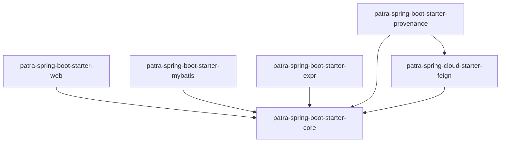

# Starters 文档索引

> Papertrace 自定义 Spring Boot/Cloud Starters 使用指南

---

## 📄 Starters 列表

### Spring Boot Starters

#### 1. patra-spring-boot-starter-core
**核心能力 Starter**

- **模块路径**：`patra-spring-boot-starter-core/`
- **主要功能**：
  - 统一错误处理（ProblemDetail、全局异常拦截）
  - Trace SPI（TraceId 生成与传播）
  - 通用工具类（IdGenerator、TimeUtils）
  - 基础配置（Jackson、时区、编码）

- **引入方式**：
  ```xml
  <dependency>
      <groupId>com.papertrace</groupId>
      <artifactId>patra-spring-boot-starter-core</artifactId>
      <version>${papertrace.version}</version>
  </dependency>
  ```

- **配置项**：
  ```yaml
  patra:
    core:
      trace:
        enabled: true                    # 启用 TraceId
        header-name: X-Trace-Id          # TraceId Header 名称
      error:
        include-stacktrace: false        # 是否包含堆栈信息
        include-message: true            # 是否包含错误消息
  ```

#### 2. patra-spring-boot-starter-web
**Web 增强 Starter**

- **模块路径**：`patra-spring-boot-starter-web/`
- **主要功能**：
  - 统一 CORS 配置
  - 全局异常处理器
  - 请求/响应日志拦截器
  - Content-Type 强制 UTF-8

- **引入方式**：
  ```xml
  <dependency>
      <groupId>com.papertrace</groupId>
      <artifactId>patra-spring-boot-starter-web</artifactId>
      <version>${papertrace.version}</version>
  </dependency>
  ```

- **配置项**：
  ```yaml
  patra:
    web:
      cors:
        enabled: true
        allowed-origins: "*"
        allowed-methods: GET,POST,PUT,DELETE
      logging:
        enabled: true
        include-request-body: false
        include-response-body: false
  ```

#### 3. patra-spring-boot-starter-mybatis
**MyBatis-Plus 增强 Starter**

- **模块路径**：`patra-spring-boot-starter-mybatis/`
- **主要功能**：
  - MyBatis-Plus 配置（分页插件、乐观锁、逻辑删除）
  - 审计字段自动填充（created_at、updated_at）
  - 通用 Mapper/Service 基类
  - 数据权限拦截器（规划中）

- **引入方式**：
  ```xml
  <dependency>
      <groupId>com.papertrace</groupId>
      <artifactId>patra-spring-boot-starter-mybatis</artifactId>
      <version>${papertrace.version}</version>
  </dependency>
  ```

- **配置项**：
  ```yaml
  patra:
    mybatis:
      audit:
        enabled: true                    # 启用审计字段自动填充
      pagination:
        max-limit: 1000                  # 分页最大限制
      logic-delete:
        enabled: true                    # 启用逻辑删除
  ```

#### 4. patra-spring-boot-starter-expr
**表达式引擎 Starter**

- **模块路径**：`patra-spring-boot-starter-expr/`
- **主要功能**：
  - 集成 `patra-expr-kernel` 表达式引擎
  - 表达式解析与执行
  - 上下文管理
  - 内置函数库

- **引入方式**：
  ```xml
  <dependency>
      <groupId>com.papertrace</groupId>
      <artifactId>patra-spring-boot-starter-expr</artifactId>
      <version>${papertrace.version}</version>
  </dependency>
  ```

- **使用示例**：
  ```java
  @Autowired
  private ExpressionEngine expressionEngine;
  
  public void evaluateExpression() {
      Map<String, Object> context = Map.of("pageSize", 100, "offset", 0);
      Object result = expressionEngine.evaluate("pageSize + offset", context);
      // result = 100
  }
  ```

#### 5. patra-spring-boot-starter-provenance
**Provenance 配置 Starter**

- **模块路径**：`patra-spring-boot-starter-provenance/`
- **主要功能**：
  - Provenance 配置加载（从 patra-registry）
  - 配置缓存与刷新
  - 配置变更监听
  - 灰度切换支持

- **引入方式**：
  ```xml
  <dependency>
      <groupId>com.papertrace</groupId>
      <artifactId>patra-spring-boot-starter-provenance</artifactId>
      <version>${papertrace.version}</version>
  </dependency>
  ```

- **配置项**：
  ```yaml
  patra:
    provenance:
      registry-url: http://patra-registry:8081
      cache-ttl: 300s                    # 缓存过期时间
      refresh-interval: 60s              # 刷新间隔
  ```

### Spring Cloud Starters

#### 6. patra-spring-cloud-starter-feign
**Feign 增强 Starter**

- **模块路径**：`patra-spring-cloud-starter-feign/`
- **主要功能**：
  - Feign 统一配置（超时、重试、日志）
  - TraceId 传播拦截器
  - 错误解码器（ProblemDetail → 异常）
  - 请求/响应日志

- **引入方式**：
  ```xml
  <dependency>
      <groupId>com.papertrace</groupId>
      <artifactId>patra-spring-cloud-starter-feign</artifactId>
      <version>${papertrace.version}</version>
  </dependency>
  ```

- **配置项**：
  ```yaml
  patra:
    feign:
      trace:
        enabled: true                    # 启用 TraceId 传播
      logging:
        enabled: true
        level: FULL                      # NONE/BASIC/HEADERS/FULL
      timeout:
        connect: 5s
        read: 30s
      retry:
        enabled: true
        max-attempts: 3
  ```

---

## 🔗 相关文档

### 设计规范
- **[Feign API 设计指南](../standards/feign-api-design-guide.md)**
- **[平台错误处理规范](../standards/platform-error-handling.md)**
- **[日志规范](../standards/logging-convention.md)**

### 源码参考
- **patra-common**：通用工具类和基础组件
- **patra-expr-kernel**：表达式引擎核心

---

## 📝 贡献指南

### 创建新 Starter

#### 1. 模块结构
```
patra-spring-boot-starter-{name}/
├── src/main/java/
│   └── com/patra/starter/{name}/
│       ├── autoconfigure/                      # 自动配置类
│       │   └── {Name}AutoConfiguration.java
│       ├── config/                             # 配置类
│       │   └── {Name}Properties.java
│       └── support/                            # 支持类
│           └── {Name}Helper.java
└── src/main/resources/
    └── META-INF/
        └── spring/
            └── org.springframework.boot.autoconfigure.AutoConfiguration.imports
```

#### 2. 自动配置模板
```java
@AutoConfiguration
@EnableConfigurationProperties({NameProperties.class})
@ConditionalOnClass({SomeClass.class})
@ConditionalOnProperty(prefix = "patra.name", name = "enabled", havingValue = "true", matchIfMissing = true)
public class NameAutoConfiguration {
    
    @Bean
    @ConditionalOnMissingBean
    public SomeBean someBean(NameProperties properties) {
        return new SomeBean(properties);
    }
}
```

#### 3. 配置属性模板
```java
@ConfigurationProperties(prefix = "patra.name")
public class NameProperties {
    
    /**
     * Enable/disable this feature
     */
    private boolean enabled = true;
    
    /**
     * Timeout duration
     */
    private Duration timeout = Duration.ofSeconds(30);
    
    // Getters and setters
}
```

#### 4. 自动配置注册
```
# src/main/resources/META-INF/spring/org.springframework.boot.autoconfigure.AutoConfiguration.imports
com.patra.starter.name.autoconfigure.NameAutoConfiguration
```

---

## 🗂️ Starters 规范

### 命名规范
- **Spring Boot Starters**：`patra-spring-boot-starter-{name}`
- **Spring Cloud Starters**：`patra-spring-cloud-starter-{name}`
- **配置前缀**：`patra.{name}`

### 依赖管理
- **仅依赖必要的第三方库**
- **不引入业务依赖**
- **版本统一在 patra-parent 管理**

### 配置原则
- **约定优于配置**：提供合理的默认值
- **条件装配**：使用 `@ConditionalOn*` 注解
- **可插拔**：支持通过 `enabled` 属性开关
- **文档完整**：配置项有清晰的注释

---

## 📊 Starters 统计

### 依赖关系


### 使用统计
```bash
# 统计各 Starter 的使用次数
grep -r "patra-spring-boot-starter" --include="pom.xml" patra-*/pom.xml | \
    sed 's/.*artifactId>\(.*\)<\/artifactId.*/\1/' | \
    sort | uniq -c | sort -rn
```

---

## 🔧 最佳实践

### 1. 合理选择 Starter
```xml
<!-- 业务服务基础依赖 -->
<dependency>
    <groupId>com.papertrace</groupId>
    <artifactId>patra-spring-boot-starter-core</artifactId>
</dependency>
<dependency>
    <groupId>com.papertrace</groupId>
    <artifactId>patra-spring-boot-starter-web</artifactId>
</dependency>
<dependency>
    <groupId>com.papertrace</groupId>
    <artifactId>patra-spring-boot-starter-mybatis</artifactId>
</dependency>

<!-- RPC 调用方依赖 -->
<dependency>
    <groupId>com.papertrace</groupId>
    <artifactId>patra-spring-cloud-starter-feign</artifactId>
</dependency>

<!-- 需要 Provenance 配置的服务 -->
<dependency>
    <groupId>com.papertrace</groupId>
    <artifactId>patra-spring-boot-starter-provenance</artifactId>
</dependency>
```

### 2. 配置覆盖
```yaml
# 应用级配置（application.yml）
patra:
  core:
    trace:
      enabled: true
      header-name: X-Trace-Id
  web:
    cors:
      enabled: true
  mybatis:
    audit:
      enabled: true

# 环境级配置（Nacos）
patra:
  provenance:
    registry-url: http://patra-registry-prod:8081
```

### 3. 条件装配
```java
// 仅在特定环境启用
@ConditionalOnProperty(prefix = "patra.feature", name = "enabled")

// 仅在缺少特定 Bean 时创建
@ConditionalOnMissingBean(SomeService.class)

// 仅在特定 Profile 下启用
@Profile("!test")
```

---

**更新记录**

| 版本 | 日期 | 变更说明 | 作者 |
|-----|------|---------|------|
| 1.0 | 2025-10-08 | 初始版本：Starters 文档索引 | docs-engineer |

---

**许可证**

Copyright © 2025 Papertrace
