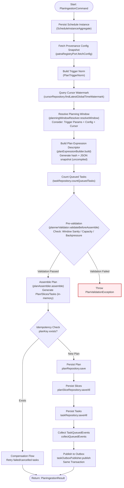
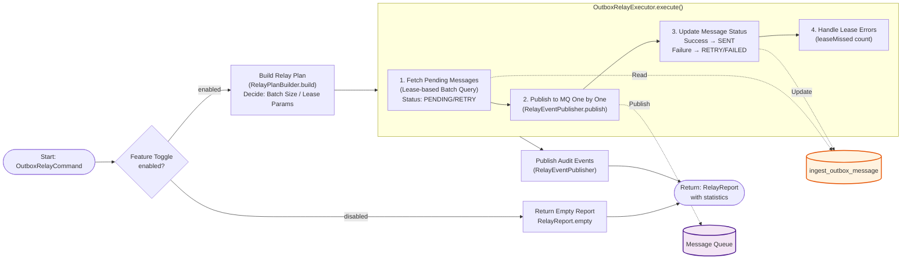
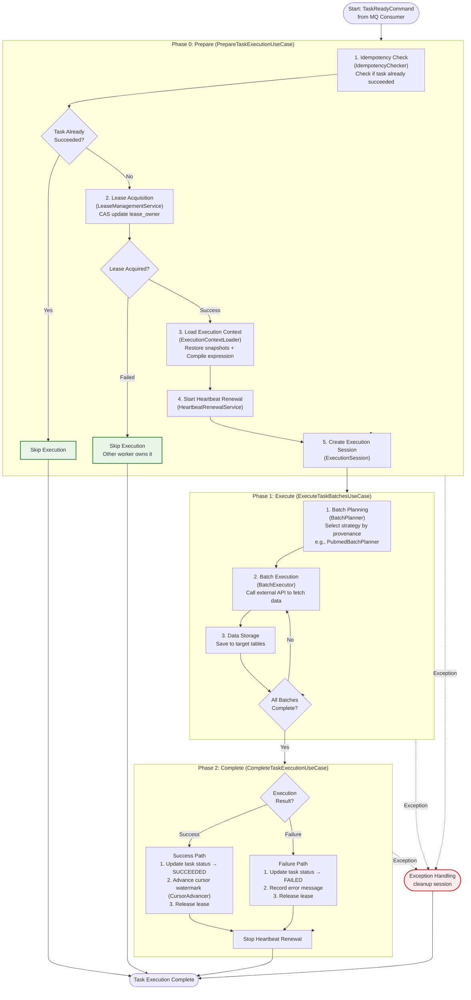
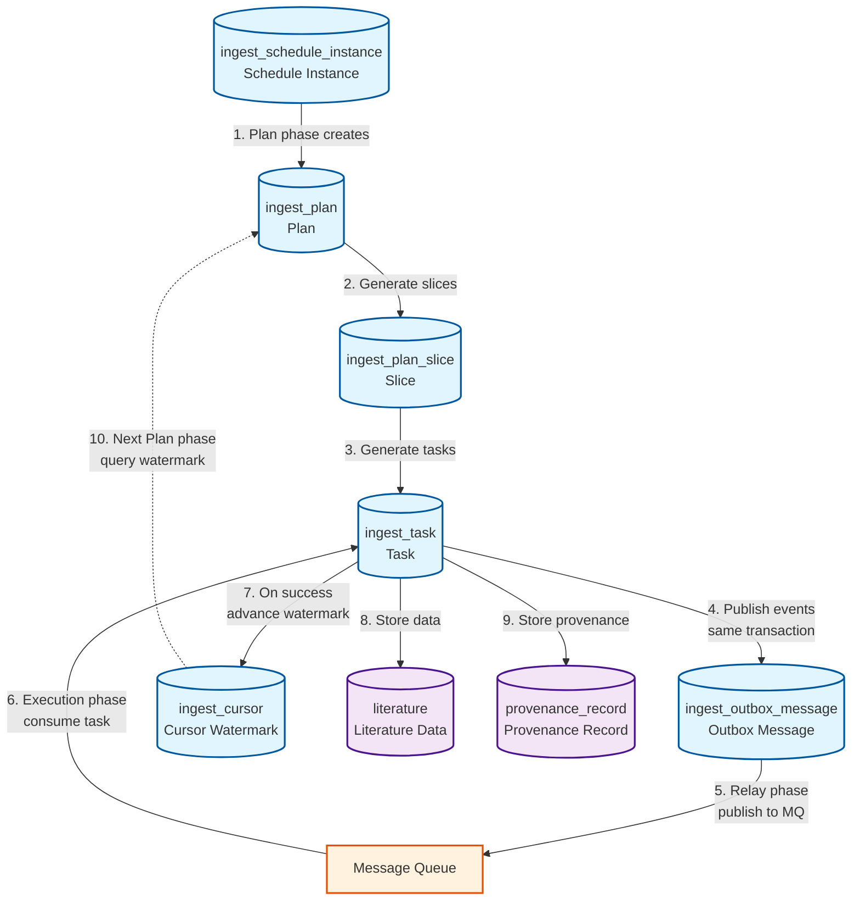

# patra-ingest Data Ingestion Flow

> This document illustrates the complete business flow of patra-ingest service from Plan (Planning) → Relay (Relaying) → Execution.
>
> **Code Version**: 2025-01-19
>
> **Related Docs**: [patra-ingest README](../../patra-ingest/README.md)

---

## 1. Overview Flow

Complete data flow from scheduler trigger to task execution completion.

```mermaid
flowchart TD
    %% Style definitions
    classDef phaseClass fill:#e1f5ff,stroke:#01579b,stroke-width:2px
    classDef dbClass fill:#fff3e0,stroke:#e65100,stroke-width:2px
    classDef mqClass fill:#f3e5f5,stroke:#4a148c,stroke-width:2px

    %% Trigger
    Scheduler[("⏰ Scheduler<br/>(Cron Job)")]

    %% Plan Phase
    subgraph Plan["📋 Plan Phase (PlanIngestionOrchestrator)"]
        P1["1. Load Config Snapshot<br/>(ScheduleInstance + ProvenanceConfig)"]
        P2["2. Resolve Window<br/>(Cursor Watermark + Window)"]
        P3["3. Build Expression<br/>(Expression Descriptor)"]
        P4["4. Pre-validation<br/>(Window/Capacity/Backpressure)"]
        P5["5. Assemble Plan<br/>(Plan/Slices/Tasks)<br/>with Idempotency Check"]
        P6["6. Persist<br/>(Plan → Slices → Tasks → Outbox)"]

        P1 --> P2 --> P3 --> P4 --> P5 --> P6
    end

    %% Relay Phase
    subgraph Relay["🔄 Relay Phase (OutboxRelayOrchestrator)"]
        R1["1. Build Relay Plan<br/>(RelayPlan)"]
        R2["2. Fetch Pending Messages<br/>(Lease-based Fetch)"]
        R3["3. Publish to MQ<br/>(Publish Messages)"]
        R4["4. Mark as Sent<br/>(Update Status)"]

        R1 --> R2 --> R3 --> R4
    end

    %% Execution Phase
    subgraph Execution["⚙️ Execution Phase (TaskExecutionUseCase)"]
        E1["Phase 0: Prepare<br/>(Idempotency Check + Lease + Load Context)"]
        E2["Phase 1: Execute<br/>(Batch Planning + Batch Execution)"]
        E3["Phase 2: Complete<br/>(Update Status + Advance Cursor + Release Lease)"]

        E1 --> E2 --> E2
        E2 --> E3
    end

    %% Database Tables
    DB_Plan[("💾 ingest_plan")]:::dbClass
    DB_Slice[("💾 ingest_plan_slice")]:::dbClass
    DB_Task[("💾 ingest_task")]:::dbClass
    DB_Outbox[("💾 ingest_outbox_message")]:::dbClass
    DB_Cursor[("💾 ingest_cursor")]:::dbClass

    %% Message Queue
    MQ[("📨 Message Queue<br/>(RabbitMQ/RocketMQ)")]:::mqClass

    %% External Services
    Registry["🗂️ patra-registry<br/>(Provenance Config)"]
    ExternalAPI["🌐 External API<br/>(PubMed/EPMC/Crossref)"]

    %% Connections
    Scheduler -->|Trigger| Plan

    Plan -->|Write| DB_Plan
    Plan -->|Write| DB_Slice
    Plan -->|Write| DB_Task
    Plan -->|Write<br/>Same Txn| DB_Outbox
    Plan -->|Query Watermark| DB_Cursor
    Plan -->|Fetch Config| Registry

    DB_Outbox -->|Scheduled Poll| Relay
    Relay -->|Publish Task Events| MQ
    Relay -->|Update Status| DB_Outbox

    MQ -->|Consume Tasks| Execution
    Execution -->|Update Status| DB_Task
    Execution -->|Advance Watermark| DB_Cursor
    Execution -->|Call| ExternalAPI

    %% Apply styles
    class Plan,Relay,Execution phaseClass
```

**Key Points**:
- **Plan Phase**: Completes in a single `@Transactional` transaction, ensuring atomicity of Plan/Task/Outbox writes
- **Outbox Pattern**: Implements at-least-once message delivery semantics via Outbox table
- **Relay Phase**: Independent scheduled job that polls Outbox table and publishes to MQ
- **Execution Phase**: Consumes tasks from MQ, executes them, and updates status and cursor

---

## 2. Plan Phase Detailed Flow

Detailed flow of `PlanIngestionOrchestrator.ingestPlan()` method with 6 core phases.

**Phase Descriptions**:

| Phase | Responsibility | Key Components |
|-------|---------------|----------------|
| Phase 1 | Initialize schedule instance and load config | `ScheduleInstanceRepository`, `PatraRegistryPort` |
| Phase 2 | Resolve execution window (cursor-aware) | `CursorRepository`, `PlanningWindowResolver` |
| Phase 3 | Build expression prototype snapshot | `PlanExpressionBuilder` |
| Phase 4 | Pre-validate (avoid invalid plans) | `PlannerValidator`, `TaskRepository` |
| Phase 5 | Assemble Plan/Slices/Tasks | `PlanAssembler`, Slicing strategies (TIME/DATE/SINGLE) |
| Phase 6 | Persist and publish events | `PlanRepository`, `TaskOutboxPublisher` |

**Idempotency Mechanism**:
- `planKey = hash(provenance + operation + window + strategy)`
- If `planKey` exists, go to compensation flow (retry failed tasks)
- Ensures no duplicate Plans when scheduler triggers repeatedly

---

## 3. Relay Phase Flow

Outbox message processing flow of `OutboxRelayOrchestrator.relay()` method.

**Key Mechanisms**:
- **Lease Mechanism**: Uses `lease_owner` and `lease_expire_at` fields to prevent multiple Relay instances from processing same message
- **Retry Strategy**: Failed messages are marked as `RETRY` and retried in next poll
- **Batch Processing**: Processes a batch of messages (default 100) per poll to avoid long transactions

**RelayReport Statistics**:
- `fetched`: Number of messages fetched
- `published`: Number of messages successfully published
- `retried`: Number of messages retried
- `failed`: Number of messages failed
- `leaseMissed`: Number of messages with lease misses

---

## 4. Execution Phase Flow

Three-phase execution flow of `TaskExecutionUseCaseImpl.execute()` method.

**Three-Phase Details**:

### Phase 0: Prepare (Preparation Phase)
- **Idempotency Guarantee**: Check if task already succeeded to avoid duplicate processing
- **Lease Mechanism**: Acquire task execution right via CAS update of `lease_owner`
- **Context Restoration**:
  - Restore config snapshots from Task → Slice → Plan hierarchy
  - Compile expression (via `patra-expr-kernel`)
  - Generate `ExecutionContext` (includes compiledQuery + compiledParams)
- **Heartbeat Renewal**: Start background thread to periodically renew lease

### Phase 1: Execute (Execution Phase)
- **Batch Planning**: Select appropriate `BatchPlanner` based on provenance
  - e.g., `PubmedBatchPlanner` requests planning metadata (count + WebEnv/QueryKey) so Execute stage can reuse PubMed History Server caches instead of re-running ESearch for every batch
- **Batch Execution**: Call external APIs (PubMed/EPMC/Crossref) to fetch data
- **Data Storage**: Save to corresponding business tables (literature/provenance, etc.)

### Phase 2: Complete (Completion Phase)
- **Success Path**:
  1. Update task status to `SUCCEEDED`
  2. Advance cursor watermark (`CursorAdvancer`)
  3. Release lease
- **Failure Path**:
  1. Update task status to `FAILED`
  2. Record error message (`lastErrorMsg`)
  3. Release lease (allow retry)
- **Resource Cleanup**: Stop heartbeat renewal thread

**Exception Handling**:
- Any exception triggers `session.cleanup()`
- Ensures lease release and heartbeat stop to avoid resource leaks
- Exception is re-thrown; upstream (MQ consumer) decides whether to retry

---

## 5. Data Flow Diagram

Data flow relationships between database tables.

**Key Constraints**:
- `ingest_plan.schedule_instance_id` → `ingest_schedule_instance.id`
- `ingest_plan_slice.plan_id` → `ingest_plan.id`
- `ingest_task.plan_id` → `ingest_plan.id`
- `ingest_task.slice_id` → `ingest_plan_slice.id`

**Idempotency Indexes**:
- `ingest_plan.plan_key` (UNIQUE)
- `ingest_task.idempotent_key` (UNIQUE)

**Performance Indexes**:
- `ingest_task(status, scheduled_at)` - Worker polling for tasks
- `ingest_outbox_message(status, seq)` - Relay polling for messages

---

## 6. Key Design Patterns

### 6.1 Outbox Pattern
- **Purpose**: Guarantee at-least-once message delivery semantics
- **Implementation**: Plan phase writes Task + Outbox messages in same transaction
- **Advantage**: Avoids distributed transactions, ensures data consistency

### 6.2 Idempotency Mechanism
- **Plan Level**: `planKey = hash(provenance + operation + window + strategy)`
- **Task Level**: `idempotentKey` business idempotency key
- **Execution Level**: Check task status before execution, skip if already succeeded

### 6.3 Lease Mechanism
- **Relay Phase**: Outbox messages use `lease_owner` + `lease_expire_at` to prevent duplicate processing
- **Execution Phase**: Tasks use lease mechanism to ensure single-worker execution
- **Heartbeat Renewal**: Periodically renew lease during execution to prevent long-task lease expiration

### 6.4 Cursor Advancement
- **Purpose**: Support incremental data collection
- **Implementation**: Advance `ingest_cursor` table watermark after each successful task
- **Query**: Next Plan phase continues from watermark position

---

## 7. References

- [patra-ingest README](../../patra-ingest/README.md)
- [Plan Ingestion Use Case README](../../patra-ingest/patra-ingest-app/src/main/java/com/patra/ingest/app/usecase/plan/README.md)
- [Architecture Documentation](../ARCHITECTURE.md)
- [Development Guide](../DEV-GUIDE.md)

---

**Last Updated**: 2025-01-19
