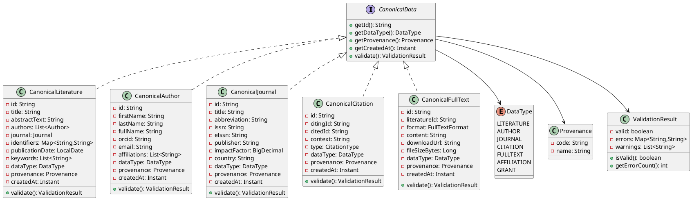

# 数据模型设计

**特性**: 多数据源多类型数据适配器
**分支**: `001-data-source-adapter`
**版本**: 1.0.0
**最后更新**: 2025-11-11

---

## 目录

1. [概述](#概述)
2. [CanonicalData 接口体系](#canonicaldata-接口体系)
3. [五种数据类型实现](#五种数据类型实现)
4. [值对象设计](#值对象设计)
5. [数据转换策略](#数据转换策略)
6. [数据库设计](#数据库设计)
7. [类图](#类图)

---

## 概述

本文档定义了多数据源多类型数据适配器的核心数据模型,基于 DDD 原则设计,遵循六边形架构的 Domain 层规范。

### 设计原则

1. **不可变性**: 所有 CanonicalData 实现类使用 `@Value` 注解,确保对象不可变
2. **类型安全**: 使用 Java 泛型和类型检查,消除运行时类型转换错误
3. **自验证**: 每个数据类型实现 `validate()` 方法,确保数据完整性
4. **框架无关**: Domain 层不依赖任何框架,仅使用 Lombok、Hutool、patra-common

### 架构位置

```
patra-ingest/
└── patra-ingest-domain/
    └── src/main/java/com/patra/ingest/domain/
        ├── model/
        │   ├── canonical/           # 规范数据模型
        │   │   ├── CanonicalData.java          (接口)
        │   │   ├── CanonicalLiterature.java    (实现)
        │   │   ├── CanonicalAuthor.java        (实现)
        │   │   ├── CanonicalJournal.java       (实现)
        │   │   ├── CanonicalCitation.java      (实现)
        │   │   └── CanonicalFullText.java      (实现)
        │   └── valueobject/         # 值对象
        │       ├── DataType.java
        │       ├── Provenance.java
        │       ├── Identifiers.java
        │       ├── ValidationResult.java
        │       └── ErrorType.java
        └── event/                   # 领域事件
            ├── DataFetched.java
            ├── DataTransformed.java
            ├── DataTransformFailed.java
            └── AdapterInvocationFailed.java
```

---

## CanonicalData 接口体系

### 顶层接口

```java
package com.patra.ingest.domain.model.canonical;

import com.patra.ingest.domain.model.valueobject.DataType;
import com.patra.ingest.domain.model.valueobject.Provenance;
import com.patra.ingest.domain.model.valueobject.ValidationResult;
import java.time.Instant;

/**
 * 规范数据顶层接口。
 *
 * <p>所有从外部数据源获取并转换后的数据都必须实现此接口,
 * 提供统一的标识、类型、来源和验证能力。</p>
 *
 * <h2>设计原则：</h2>
 * <ul>
 *   <li>不可变性：所有实现类必须是不可变的</li>
 *   <li>自验证：通过 validate() 方法确保数据完整性</li>
 *   <li>可溯源：明确标识数据来源(Provenance)</li>
 * </ul>
 *
 * @since 1.0.0
 * @author Patra Team
 * @see CanonicalLiterature
 * @see CanonicalAuthor
 * @see CanonicalJournal
 * @see CanonicalCitation
 * @see CanonicalFullText
 */
public interface CanonicalData {

    /**
     * 获取数据唯一标识。
     *
     * <p>使用数据源的原始ID,格式: "{provenance}:{originalId}"</p>
     * <p>示例: "pubmed:12345678", "arxiv:2301.12345"</p>
     *
     * @return 数据唯一标识,不能为空
     */
    String getId();

    /**
     * 获取数据类型。
     *
     * @return 数据类型枚举,不能为空
     */
    DataType getDataType();

    /**
     * 获取数据来源标识。
     *
     * @return 数据来源,不能为空
     */
    Provenance getProvenance();

    /**
     * 获取数据创建时间。
     *
     * @return 创建时间戳,不能为空
     */
    Instant getCreatedAt();

    /**
     * 验证数据完整性和业务规则。
     *
     * <p>验证内容包括:</p>
     * <ul>
     *   <li>必填字段不能为空</li>
     *   <li>字段格式符合规范(如ORCID格式、ISSN格式)</li>
     *   <li>业务不变量满足(如引用关系的citingId和citedId不能相同)</li>
     * </ul>
     *
     * @return 验证结果,包含成功/失败状态和错误消息列表
     */
    ValidationResult validate();
}
```

### 接口设计说明

| 方法 | 职责 | 不变性约束 |
|------|------|-----------|
| `getId()` | 返回全局唯一标识 | 格式: "{provenance}:{originalId}" |
| `getDataType()` | 返回数据类型 | 必须与实际实现类匹配 |
| `getProvenance()` | 返回数据来源 | 必须是已注册的数据源代码 |
| `getCreatedAt()` | 返回创建时间 | 不可修改,由构造函数设置 |
| `validate()` | 自验证方法 | 返回 ValidationResult,不抛出异常 |

---

## 五种数据类型实现

### 1. CanonicalLiterature (规范文献)

**聚合根**: 是
**聚合边界**: 包含文献基本信息、作者列表、期刊信息、标识符映射
**唯一标识**: `{provenance}:{PMID/DOI/ArXivID}`

```java
package com.patra.ingest.domain.model.canonical;

import com.patra.ingest.domain.model.valueobject.*;
import lombok.Value;
import lombok.Builder;
import java.time.Instant;
import java.time.LocalDate;
import java.util.List;
import java.util.Map;

/**
 * 规范文献聚合根。
 *
 * <p>代表一篇学术论文或文献,是平台最核心的数据实体。</p>
 *
 * <h2>不变性约束：</h2>
 * <ul>
 *   <li>标题(title)不能为空</li>
 *   <li>至少包含一个标识符(PMID、DOI或ArXiv ID之一)</li>
 *   <li>作者列表可以为空(部分数据源可能不提供作者信息)</li>
 * </ul>
 *
 * @since 1.0.0
 */
@Value
@Builder(toBuilder = true)
public class CanonicalLiterature implements CanonicalData {

    /**
     * 文献唯一标识。
     * <p>格式: "{provenance}:{originalId}"</p>
     * <p>示例: "pubmed:12345678", "arxiv:2301.12345"</p>
     */
    String id;

    /**
     * 文献标题(必填)。
     */
    String title;

    /**
     * 摘要文本(可选)。
     */
    String abstractText;

    /**
     * 作者列表(可选,但不能为 null,空列表表示无作者信息)。
     */
    @Builder.Default
    List<Author> authors = List.of();

    /**
     * 期刊信息(可选)。
     */
    Journal journal;

    /**
     * 标识符映射(至少包含一个标识符)。
     * <p>键示例: "PMID", "DOI", "ARXIV_ID", "PMC_ID"</p>
     */
    Map<String, String> identifiers;

    /**
     * 出版日期(可选)。
     */
    LocalDate publicationDate;

    /**
     * 关键词列表(可选)。
     */
    @Builder.Default
    List<String> keywords = List.of();

    /**
     * 数据类型(固定为 LITERATURE)。
     */
    @Builder.Default
    DataType dataType = DataType.LITERATURE;

    /**
     * 数据来源标识。
     */
    Provenance provenance;

    /**
     * 创建时间戳。
     */
    Instant createdAt;

    /**
     * 验证文献数据完整性。
     *
     * @return 验证结果
     */
    @Override
    public ValidationResult validate() {
        ValidationResult.Builder builder = ValidationResult.builder();

        // 必填字段验证
        if (title == null || title.isBlank()) {
            builder.addError("title", "标题不能为空");
        }

        // 标识符验证
        if (identifiers == null || identifiers.isEmpty()) {
            builder.addError("identifiers", "至少需要一个标识符(PMID/DOI/ArXiv ID)");
        }

        // 来源验证
        if (provenance == null) {
            builder.addError("provenance", "数据来源不能为空");
        }

        // ID 格式验证
        if (id == null || !id.contains(":")) {
            builder.addError("id", "ID格式错误,应为 '{provenance}:{originalId}'");
        }

        return builder.build();
    }

    /**
     * 作者信息(内部类)。
     */
    @Value
    @Builder
    public static class Author {
        String firstName;
        String lastName;
        String fullName;
        String orcid;
        String email;
        List<String> affiliations;
    }

    /**
     * 期刊信息(内部类)。
     */
    @Value
    @Builder
    public static class Journal {
        String title;
        String abbreviation;
        String issn;
        String eIssn;
        String publisher;
        String country;
    }
}
```

**字段映射表**:

| 字段 | 类型 | 必填 | 说明 | 来源示例(PubMed) |
|------|------|------|------|------------------|
| id | String | ✅ | 全局唯一标识 | "pubmed:12345678" |
| title | String | ✅ | 文献标题 | article.getTitle() |
| abstractText | String | ❌ | 摘要 | article.getAbstract() |
| authors | List<Author> | ❌ | 作者列表 | article.getAuthors() |
| journal | Journal | ❌ | 期刊信息 | article.getJournal() |
| identifiers | Map | ✅ | 标识符 | PMID, DOI, PMC |
| publicationDate | LocalDate | ❌ | 出版日期 | article.getPubDate() |
| keywords | List<String> | ❌ | 关键词 | article.getMeshTerms() |
| dataType | DataType | ✅ | 数据类型(固定) | LITERATURE |
| provenance | Provenance | ✅ | 数据来源 | "pubmed" |
| createdAt | Instant | ✅ | 创建时间 | Instant.now() |

---

### 2. CanonicalAuthor (规范作者)

**聚合根**: 是
**聚合边界**: 包含姓名、ORCID、Email、机构列表
**唯一标识**: ORCID(如果有),否则 `{provenance}:{authorName}`

```java
package com.patra.ingest.domain.model.canonical;

import com.patra.ingest.domain.model.valueobject.*;
import lombok.Value;
import lombok.Builder;
import java.time.Instant;
import java.util.List;

/**
 * 规范作者聚合根。
 *
 * <p>代表一位学术作者,包含身份标识和机构隶属。</p>
 *
 * <h2>不变性约束：</h2>
 * <ul>
 *   <li>姓氏(lastName)或全名(fullName)至少有一个不为空</li>
 *   <li>ORCID如果存在,必须符合格式规范(16位数字,分4组)</li>
 * </ul>
 *
 * @since 1.0.0
 */
@Value
@Builder(toBuilder = true)
public class CanonicalAuthor implements CanonicalData {

    /**
     * 作者唯一标识。
     * <p>优先使用 ORCID,否则使用 "{provenance}:{authorName}"</p>
     */
    String id;

    /**
     * 名(First Name,可选)。
     */
    String firstName;

    /**
     * 姓(Last Name,与fullName至少有一个)。
     */
    String lastName;

    /**
     * 全名(与lastName至少有一个)。
     */
    String fullName;

    /**
     * ORCID 标识符(可选)。
     * <p>格式: 0000-0001-2345-6789 (16位数字,分4组)</p>
     */
    String orcid;

    /**
     * Email 地址(可选)。
     */
    String email;

    /**
     * 机构列表(可选)。
     */
    @Builder.Default
    List<String> affiliations = List.of();

    /**
     * 数据类型(固定为 AUTHOR)。
     */
    @Builder.Default
    DataType dataType = DataType.AUTHOR;

    /**
     * 数据来源标识。
     */
    Provenance provenance;

    /**
     * 创建时间戳。
     */
    Instant createdAt;

    @Override
    public ValidationResult validate() {
        ValidationResult.Builder builder = ValidationResult.builder();

        // 姓名验证
        if ((lastName == null || lastName.isBlank()) &&
            (fullName == null || fullName.isBlank())) {
            builder.addError("name", "姓氏(lastName)或全名(fullName)至少有一个不为空");
        }

        // ORCID 格式验证
        if (orcid != null && !orcid.matches("\\d{4}-\\d{4}-\\d{4}-\\d{4}")) {
            builder.addError("orcid", "ORCID格式错误,应为 XXXX-XXXX-XXXX-XXXX");
        }

        // 来源验证
        if (provenance == null) {
            builder.addError("provenance", "数据来源不能为空");
        }

        return builder.build();
    }
}
```

---

### 3. CanonicalJournal (规范期刊)

**聚合根**: 是
**聚合边界**: 包含期刊名称、缩写、ISSN/eISSN、出版商
**唯一标识**: ISSN 或 eISSN

```java
package com.patra.ingest.domain.model.canonical;

import com.patra.ingest.domain.model.valueobject.*;
import lombok.Value;
import lombok.Builder;
import java.time.Instant;
import java.math.BigDecimal;

/**
 * 规范期刊聚合根。
 *
 * <p>代表一个学术期刊,包含期刊元信息和影响力指标。</p>
 *
 * <h2>不变性约束：</h2>
 * <ul>
 *   <li>期刊标题(title)不能为空</li>
 *   <li>ISSN和eISSN至少有一个不为空</li>
 * </ul>
 *
 * @since 1.0.0
 */
@Value
@Builder(toBuilder = true)
public class CanonicalJournal implements CanonicalData {

    /**
     * 期刊唯一标识。
     * <p>使用 ISSN 或 eISSN</p>
     */
    String id;

    /**
     * 期刊标题(必填)。
     */
    String title;

    /**
     * 期刊缩写(可选)。
     */
    String abbreviation;

    /**
     * ISSN (纸质版,与eIssn至少有一个)。
     */
    String issn;

    /**
     * eISSN (电子版,与issn至少有一个)。
     */
    String eIssn;

    /**
     * 出版商(可选)。
     */
    String publisher;

    /**
     * 影响因子(可选)。
     */
    BigDecimal impactFactor;

    /**
     * 国家/地区(可选)。
     */
    String country;

    /**
     * 数据类型(固定为 JOURNAL)。
     */
    @Builder.Default
    DataType dataType = DataType.JOURNAL;

    /**
     * 数据来源标识。
     */
    Provenance provenance;

    /**
     * 创建时间戳。
     */
    Instant createdAt;

    @Override
    public ValidationResult validate() {
        ValidationResult.Builder builder = ValidationResult.builder();

        // 标题验证
        if (title == null || title.isBlank()) {
            builder.addError("title", "期刊标题不能为空");
        }

        // ISSN 验证
        if ((issn == null || issn.isBlank()) &&
            (eIssn == null || eIssn.isBlank())) {
            builder.addError("issn", "ISSN和eISSN至少有一个不为空");
        }

        // 来源验证
        if (provenance == null) {
            builder.addError("provenance", "数据来源不能为空");
        }

        return builder.build();
    }
}
```

---

### 4. CanonicalCitation (规范引用)

**聚合根**: 是
**聚合边界**: 包含引用文献ID、被引文献ID、引用上下文
**唯一标识**: `{citingId}+{citedId}`

```java
package com.patra.ingest.domain.model.canonical;

import com.patra.ingest.domain.model.valueobject.*;
import lombok.Value;
import lombok.Builder;
import java.time.Instant;

/**
 * 规范引用聚合根。
 *
 * <p>代表两篇文献之间的引用关系。</p>
 *
 * <h2>不变性约束：</h2>
 * <ul>
 *   <li>citingId和citedId不能为空且不能相同</li>
 *   <li>引用类型(type)必须是预定义值之一(DIRECT、INDIRECT、SELF)</li>
 * </ul>
 *
 * @since 1.0.0
 */
@Value
@Builder(toBuilder = true)
public class CanonicalCitation implements CanonicalData {

    /**
     * 引用关系唯一标识。
     * <p>格式: "{citingId}+{citedId}"</p>
     */
    String id;

    /**
     * 引用文献ID(必填)。
     * <p>格式: "{provenance}:{literatureId}"</p>
     */
    String citingId;

    /**
     * 被引文献ID(必填)。
     * <p>格式: "{provenance}:{literatureId}"</p>
     */
    String citedId;

    /**
     * 引用上下文(可选)。
     * <p>引用文献中提到被引文献的文本片段</p>
     */
    String context;

    /**
     * 引用类型。
     */
    CitationType type;

    /**
     * 数据类型(固定为 CITATION)。
     */
    @Builder.Default
    DataType dataType = DataType.CITATION;

    /**
     * 数据来源标识。
     */
    Provenance provenance;

    /**
     * 创建时间戳。
     */
    Instant createdAt;

    @Override
    public ValidationResult validate() {
        ValidationResult.Builder builder = ValidationResult.builder();

        // 引用ID验证
        if (citingId == null || citingId.isBlank()) {
            builder.addError("citingId", "引用文献ID不能为空");
        }

        if (citedId == null || citedId.isBlank()) {
            builder.addError("citedId", "被引文献ID不能为空");
        }

        // 自引用验证
        if (citingId != null && citingId.equals(citedId)) {
            builder.addError("citation", "引用文献ID和被引文献ID不能相同(禁止自引用)");
        }

        // 引用类型验证
        if (type == null) {
            builder.addError("type", "引用类型不能为空");
        }

        // 来源验证
        if (provenance == null) {
            builder.addError("provenance", "数据来源不能为空");
        }

        return builder.build();
    }

    /**
     * 引用类型枚举。
     */
    public enum CitationType {
        /** 直接引用 */
        DIRECT,
        /** 间接引用 */
        INDIRECT,
        /** 自引用(同一作者) */
        SELF
    }
}
```

---

### 5. CanonicalFullText (规范全文)

**聚合根**: 是
**聚合边界**: 包含关联文献ID、格式、内容或下载URL
**唯一标识**: `{literatureId}+{format}`

```java
package com.patra.ingest.domain.model.canonical;

import com.patra.ingest.domain.model.valueobject.*;
import lombok.Value;
import lombok.Builder;
import java.time.Instant;

/**
 * 规范全文聚合根。
 *
 * <p>代表文献的全文内容或下载链接。</p>
 *
 * <h2>不变性约束：</h2>
 * <ul>
 *   <li>关联文献ID(literatureId)不能为空</li>
 *   <li>格式(format)必须是预定义值之一</li>
 *   <li>内容(content)和下载URL(downloadUrl)至少有一个不为空</li>
 * </ul>
 *
 * @since 1.0.0
 */
@Value
@Builder(toBuilder = true)
public class CanonicalFullText implements CanonicalData {

    /**
     * 全文唯一标识。
     * <p>格式: "{literatureId}+{format}"</p>
     */
    String id;

    /**
     * 关联文献ID(必填)。
     * <p>格式: "{provenance}:{literatureId}"</p>
     */
    String literatureId;

    /**
     * 全文格式。
     */
    FullTextFormat format;

    /**
     * 全文内容(与downloadUrl至少有一个)。
     * <p>如果提供content,表示已下载的全文</p>
     */
    String content;

    /**
     * 下载URL(与content至少有一个)。
     * <p>如果提供downloadUrl,表示全文的下载地址</p>
     */
    String downloadUrl;

    /**
     * 文件大小(字节,可选)。
     */
    Long fileSizeBytes;

    /**
     * 数据类型(固定为 FULLTEXT)。
     */
    @Builder.Default
    DataType dataType = DataType.FULLTEXT;

    /**
     * 数据来源标识。
     */
    Provenance provenance;

    /**
     * 创建时间戳。
     */
    Instant createdAt;

    @Override
    public ValidationResult validate() {
        ValidationResult.Builder builder = ValidationResult.builder();

        // 关联文献ID验证
        if (literatureId == null || literatureId.isBlank()) {
            builder.addError("literatureId", "关联文献ID不能为空");
        }

        // 格式验证
        if (format == null) {
            builder.addError("format", "全文格式不能为空");
        }

        // 内容或URL验证
        if ((content == null || content.isBlank()) &&
            (downloadUrl == null || downloadUrl.isBlank())) {
            builder.addError("content", "全文内容(content)和下载URL(downloadUrl)至少有一个不为空");
        }

        // 来源验证
        if (provenance == null) {
            builder.addError("provenance", "数据来源不能为空");
        }

        return builder.build();
    }

    /**
     * 全文格式枚举。
     */
    public enum FullTextFormat {
        /** PDF 格式 */
        PDF,
        /** HTML 格式 */
        HTML,
        /** XML 格式 */
        XML,
        /** 纯文本 */
        TEXT
    }
}
```

---

## 值对象设计

### 1. DataType (数据类型枚举)

```java
package com.patra.ingest.domain.model.valueobject;

/**
 * 数据类型枚举。
 *
 * <p>定义系统支持的所有规范数据类型。</p>
 *
 * @since 1.0.0
 */
public enum DataType {
    /** 文献 */
    LITERATURE("文献"),

    /** 作者 */
    AUTHOR("作者"),

    /** 期刊 */
    JOURNAL("期刊"),

    /** 引用关系 */
    CITATION("引用"),

    /** 全文 */
    FULLTEXT("全文"),

    /** 机构 */
    AFFILIATION("机构"),

    /** 基金 */
    GRANT("基金");

    private final String displayName;

    DataType(String displayName) {
        this.displayName = displayName;
    }

    public String getDisplayName() {
        return displayName;
    }
}
```

---

### 2. Provenance (数据来源值对象)

```java
package com.patra.ingest.domain.model.valueobject;

import lombok.Value;

/**
 * 数据来源值对象。
 *
 * <p>不可变,标识数据来自哪个外部数据源。</p>
 *
 * @since 1.0.0
 */
@Value(staticConstructor = "of")
public class Provenance {

    /**
     * 数据源代码(如 "pubmed", "epmc", "arxiv")。
     */
    String code;

    /**
     * 数据源名称(可选,用于显示)。
     */
    String name;

    /**
     * 创建仅包含代码的来源标识。
     *
     * @param code 数据源代码
     * @return Provenance 实例
     */
    public static Provenance ofCode(String code) {
        return new Provenance(code, null);
    }
}
```

---

### 3. ValidationResult (验证结果值对象)

```java
package com.patra.ingest.domain.model.valueobject;

import lombok.Value;
import lombok.Builder;
import lombok.Singular;
import java.util.List;
import java.util.Map;

/**
 * 验证结果值对象。
 *
 * <p>不可变,记录数据验证的成功/失败状态和错误详情。</p>
 *
 * @since 1.0.0
 */
@Value
@Builder
public class ValidationResult {

    /**
     * 验证是否成功。
     */
    boolean valid;

    /**
     * 错误消息映射(字段名 → 错误消息)。
     */
    @Singular("error")
    Map<String, String> errors;

    /**
     * 警告消息列表(可选)。
     */
    @Singular("warning")
    List<String> warnings;

    /**
     * 检查验证是否通过(无错误)。
     *
     * @return true 如果验证成功
     */
    public boolean isValid() {
        return errors == null || errors.isEmpty();
    }

    /**
     * 获取错误数量。
     *
     * @return 错误数量
     */
    public int getErrorCount() {
        return errors == null ? 0 : errors.size();
    }

    /**
     * 创建成功的验证结果。
     *
     * @return ValidationResult 实例
     */
    public static ValidationResult success() {
        return ValidationResult.builder().valid(true).build();
    }

    /**
     * Builder 内部类,用于构建 ValidationResult。
     */
    public static class ValidationResultBuilder {
        /**
         * 添加错误消息。
         *
         * @param field 字段名
         * @param message 错误消息
         * @return Builder 实例
         */
        public ValidationResultBuilder addError(String field, String message) {
            return this.error(field, message);
        }

        /**
         * 添加警告消息。
         *
         * @param message 警告消息
         * @return Builder 实例
         */
        public ValidationResultBuilder addWarning(String message) {
            return this.warning(message);
        }
    }
}
```

---

### 4. ErrorType (错误类型枚举)

```java
package com.patra.ingest.domain.model.valueobject;

/**
 * 错误类型枚举。
 *
 * <p>用于标识错误的性质和指导后续处理(是否重试)。</p>
 *
 * @since 1.0.0
 */
public enum ErrorType {
    /** 无错误 */
    NONE,

    /** 可重试错误(临时性错误,如网络超时、API限流) */
    RETRIABLE,

    /** 不可重试错误(永久性错误,如数据格式错误、权限不足) */
    NON_RETRIABLE,

    /** 部分成功(批量处理时,部分数据成功、部分失败) */
    PARTIAL_SUCCESS
}
```

---

## 数据转换策略

### DataTransformStrategy 接口

```java
package com.patra.ingest.domain.strategy;

import com.patra.ingest.domain.model.canonical.CanonicalData;
import java.util.List;

/**
 * 数据转换策略接口。
 *
 * <p>负责将外部数据源的原始数据转换为规范数据模型。</p>
 *
 * @param <S> 源数据类型(外部数据源的原始类型)
 * @param <T> 目标数据类型(CanonicalData 的实现类)
 * @since 1.0.0
 */
public interface DataTransformStrategy<S, T extends CanonicalData> {

    /**
     * 获取源数据类型。
     *
     * @return 源数据的 Class 对象
     */
    Class<S> getSourceType();

    /**
     * 获取目标数据类型。
     *
     * @return 目标数据的 Class 对象
     */
    Class<T> getTargetType();

    /**
     * 转换单条数据。
     *
     * @param source 源数据
     * @return 转换后的规范数据
     * @throws TransformException 如果转换失败
     */
    T transform(S source);

    /**
     * 批量转换数据,支持部分成功。
     *
     * <p>即使部分数据转换失败,也会继续处理其他数据,
     * 最终返回成功和失败的详细信息。</p>
     *
     * @param sources 源数据列表
     * @return 转换结果(包含成功项和错误列表)
     */
    TransformResult<T> batchTransform(List<S> sources);
}
```

### TransformResult (转换结果)

```java
package com.patra.ingest.domain.strategy;

import lombok.Value;
import lombok.Builder;
import java.util.List;

/**
 * 批量转换结果值对象。
 *
 * @param <T> 目标数据类型
 * @since 1.0.0
 */
@Value
@Builder
public class TransformResult<T> {

    /**
     * 成功转换的数据列表。
     */
    List<T> successItems;

    /**
     * 转换失败的错误列表。
     */
    List<TransformError> errors;

    /**
     * 计算成功率。
     *
     * @return 成功率(0.0 ~ 1.0)
     */
    public double getSuccessRate() {
        int total = getTotalCount();
        return total == 0 ? 0.0 : (double) successItems.size() / total;
    }

    /**
     * 获取总数。
     *
     * @return 成功数 + 失败数
     */
    public int getTotalCount() {
        return successItems.size() + errors.size();
    }

    /**
     * 判断是否部分成功。
     *
     * @return true 如果有成功也有失败
     */
    public boolean isPartialSuccess() {
        return !successItems.isEmpty() && !errors.isEmpty();
    }

    /**
     * 判断是否全部成功。
     *
     * @return true 如果没有失败
     */
    public boolean isFullSuccess() {
        return !successItems.isEmpty() && errors.isEmpty();
    }

    /**
     * 判断是否全部失败。
     *
     * @return true 如果没有成功
     */
    public boolean isFullFailure() {
        return successItems.isEmpty() && !errors.isEmpty();
    }
}
```

### TransformError (转换错误)

```java
package com.patra.ingest.domain.strategy;

import lombok.Value;

/**
 * 转换错误记录值对象。
 *
 * @since 1.0.0
 */
@Value
public class TransformError {

    /**
     * 失败数据的索引(在原始列表中的位置)。
     */
    int index;

    /**
     * 原始数据快照(最多1KB,用于排查问题)。
     */
    String sourceDataSnapshot;

    /**
     * 错误消息。
     */
    String errorMessage;

    /**
     * 原始异常(可选)。
     */
    Throwable cause;
}
```

---

## 数据库设计

### 规范数据存储表

由于不同数据类型的字段差异较大,采用**单表继承(Single Table Inheritance)**模式,使用 `data_type` 字段区分类型。

```sql
-- 规范数据主表
CREATE TABLE t_canonical_data (
    id BIGINT PRIMARY KEY AUTO_INCREMENT COMMENT '主键',
    canonical_id VARCHAR(255) NOT NULL UNIQUE COMMENT '规范ID ({provenance}:{originalId})',
    data_type VARCHAR(32) NOT NULL COMMENT '数据类型 (LITERATURE/AUTHOR/JOURNAL/CITATION/FULLTEXT)',
    provenance_code VARCHAR(64) NOT NULL COMMENT '数据来源代码',
    created_at TIMESTAMP NOT NULL DEFAULT CURRENT_TIMESTAMP COMMENT '创建时间',

    -- 文献字段 (LITERATURE)
    title TEXT COMMENT '文献标题',
    abstract_text TEXT COMMENT '摘要',
    publication_date DATE COMMENT '出版日期',
    identifiers JSON COMMENT '标识符映射 (PMID, DOI, etc.)',
    authors JSON COMMENT '作者列表',
    journal JSON COMMENT '期刊信息',
    keywords JSON COMMENT '关键词列表',

    -- 作者字段 (AUTHOR)
    first_name VARCHAR(255) COMMENT '名',
    last_name VARCHAR(255) COMMENT '姓',
    full_name VARCHAR(512) COMMENT '全名',
    orcid VARCHAR(64) COMMENT 'ORCID',
    email VARCHAR(255) COMMENT 'Email',
    affiliations JSON COMMENT '机构列表',

    -- 期刊字段 (JOURNAL)
    journal_title VARCHAR(512) COMMENT '期刊标题',
    abbreviation VARCHAR(128) COMMENT '期刊缩写',
    issn VARCHAR(32) COMMENT 'ISSN',
    e_issn VARCHAR(32) COMMENT 'eISSN',
    publisher VARCHAR(255) COMMENT '出版商',
    impact_factor DECIMAL(10,3) COMMENT '影响因子',
    country VARCHAR(128) COMMENT '国家',

    -- 引用字段 (CITATION)
    citing_id VARCHAR(255) COMMENT '引用文献ID',
    cited_id VARCHAR(255) COMMENT '被引文献ID',
    citation_context TEXT COMMENT '引用上下文',
    citation_type VARCHAR(32) COMMENT '引用类型 (DIRECT/INDIRECT/SELF)',

    -- 全文字段 (FULLTEXT)
    literature_id VARCHAR(255) COMMENT '关联文献ID',
    fulltext_format VARCHAR(32) COMMENT '全文格式 (PDF/HTML/XML/TEXT)',
    content LONGTEXT COMMENT '全文内容',
    download_url VARCHAR(512) COMMENT '下载URL',
    file_size_bytes BIGINT COMMENT '文件大小(字节)',

    INDEX idx_data_type (data_type),
    INDEX idx_provenance (provenance_code),
    INDEX idx_created_at (created_at),
    INDEX idx_citing_id (citing_id),  -- 用于引用查询
    INDEX idx_cited_id (cited_id),    -- 用于被引查询
    INDEX idx_literature_id (literature_id)  -- 用于全文关联查询
) ENGINE=InnoDB DEFAULT CHARSET=utf8mb4 COMMENT='规范数据主表';
```

### 设计说明

| 设计决策 | 理由 |
|---------|------|
| **单表继承** | 简化查询,避免多表JOIN,牺牲存储空间换取查询性能 |
| **JSON 存储** | authors、identifiers、keywords 等列表/映射字段使用 JSON 格式,灵活存储 |
| **nullable 字段** | 大部分字段可空,只有当 `data_type` 匹配时才有值 |
| **索引策略** | 按 data_type、provenance、created_at 建立索引,支持常见查询 |
| **字符集** | utf8mb4 支持 emoji 和多语言字符 |

---

## 类图

### CanonicalData 体系类图



---

## 总结

本数据模型设计完全遵循以下原则:

1. ✅ **DDD 领域驱动**: 每种数据类型都是独立的聚合根,包含业务逻辑和验证规则
2. ✅ **不可变性**: 所有类使用 `@Value` 注解,对象一旦创建不可修改
3. ✅ **自验证**: 每个类实现 `validate()` 方法,确保数据完整性
4. ✅ **框架无关**: Domain 层不依赖 Spring、MyBatis 等框架
5. ✅ **类型安全**: 使用 Java 泛型和枚举,消除魔法值和类型转换错误
6. ✅ **可溯源**: 每条数据都包含 `provenance` 字段,明确标识数据来源
7. ✅ **Builder 模式**: 使用 Lombok `@Builder` 注解,简化对象构建

**下一步**: 基于此数据模型设计泛型适配器接口和转换策略(参见 `contracts/` 目录)。
